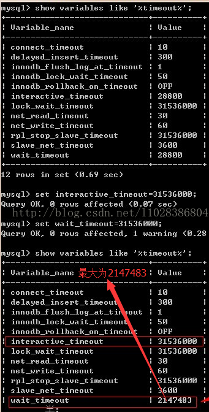

## 1.增加 MySQL 的 wait_timeout 属性的值（不推荐）

mysql5之前的版本，可以在jdbc连接的url中加入：autoReconnect = true

设置mysql5中wait_timeout 
在linux中最大为365，wait_timeout=31536000 
在window中最大为24天，以window为例： 




这个方法并不推荐，原因：

MySQL服务器所支撑的最大连接数是有限的，因为每一个连接、第一个表打开的操作都要消耗服务器内存，理想状态是当一个MySQL客户端连接完成工作就自动断开释放内存，如果你的你的网站有大量的MySQL链接请求，这些连接完成SQL执行任务后空闲着啥事也不干，白白占用内存资源，如果 这些连接堆积起来，将导致MySQL超过最大连接数，从而无法新建MySQL连接，有可能导致&ldquo;Too many connections&rdquo;的错误。 
参考自：[http://blog.csdn.net/cenfei78325747/article/details/7854611](http://blog.csdn.net/cenfei78325747/article/details/7854611)


## 2.使用连接池（推荐）

（1）无论是使用C3PO还是proxool连接池，一定要去hibernate解压包里找到相应文件夹的jar包，导入：
 

有些人一直解决不了连接池问题，可能原因就在这里

以proxool为例： 

（2）配置hibernate.cfg.xml

```xml
<session-factory>
<!-- 选择使用连接池 -->
<property name="connection.provider_class">
  org.hibernate.connection.ProxoolConnectionProvider
 </property>
<!-- 指明要使用的proxool.xml中定义的proxool别名 -->
<property name="proxool.pool_alias">mysql</property>
<!-- 指明Proxool配置文件所在位置，这里与Hibernate的配置文件在同一目录下 -->
<property name="proxool.xml">proxool.xml</property>

</session-factory>
```

（3）在同一目录下配置proxool.xml

```xml
<?xml version="1.0" encoding="UTF-8"?>
<proxool>
<!-- proxool别名 -->
<alias>mysql</alias>
<!-- 数据库连接Url -->
<driver-url>
<![CDATA[jdbc:mysql://localhost:3306/work?useUnicode=true&characterEncoding=UTF-8]]>
</driver-url>
<!-- JDBC驱动名称 -->
<driver-class>com.mysql.jdbc.Driver</driver-class>
<!-- 数据库连接帐号 -->
<driver-properties>
<!--这里改成你自己的-->
<property name="user" value="root" />
<property name="password" value="password" />
</driver-properties>
<!-- proxool自动侦察各个连接状态的时间间隔(毫秒),侦察到空闲的连接就马上回收,超时的销毁 -->
<house-keeping-sleep-time>60000</house-keeping-sleep-time>
<!-- 指因未有空闲连接可以分配而在队列中等候的最大请求数,超过这个请求数的用户连接就不会被接受 -->
<maximum-new-connections>100</maximum-new-connections>
<!-- 最少保持的空闲连接数 -->
<prototype-count>3</prototype-count>
<!-- 允许最大连接数,超过了这个连接，再有请求时，就排在队列中等候，最大的等待请求数由maximum-new-
connections决定 -->
<maximum-connection-count>20</maximum-connection-count>
<!-- 最小连接数 -->
<minimum-connection-count>3</minimum-connection-count>
<!-- 在分配连接前后是否进行有效性测试，这个是解决本问题的关键 -->
<test-before-use>true</test-before-use>
<test-after-use>true</test-after-use>
<!-- 用于测试的SQL语句 -->
<house-keeping-test-sql>SELECT CURRENT_USER</house-keeping-test-sql>
</proxool>
```

参考：[http://blog.csdn.net/u012377333/article/details/50600173](http://blog.csdn.net/u012377333/article/details/50600173)