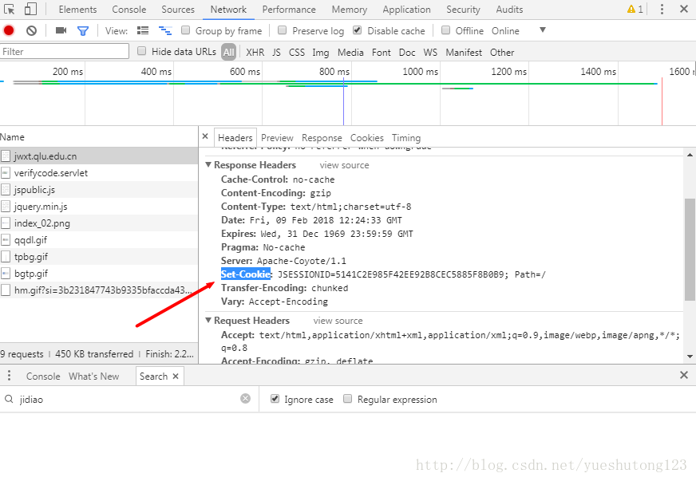

# 一：原理

>*  客户端访问服务器，服务器通过Session对象记录会话，服务器可以指定一个唯一的session ID作为cookie来代表每个客户端，用来识别这个客户端接下来的请求。
>*  我们通过Chrome浏览器进行网页访问时，服务器会在我们第一次请求时就建立会话生成Session对象，然后给我们的浏览器返回该Session ID，并把Session的ID保存在客户机的Cookie中，如图：
>*  我们的每次请求都带上我们的**Cookie**,就可以实现会话状态的保持。

---



---

# 二：代码

>*  Jsoup应该是Java最简单的网页解析框架
>*  下载地址：[https://jsoup.org/download](https://jsoup.org/download)
>*  该实例以强智教务系统为例：[http://jwxt.qlu.edu.cn](http://jwxt.qlu.edu.cn)

```javascript
package cn.zyzpp.eduCookie;

import java.io.IOException;
import java.util.HashMap;
import java.util.Map;
import java.util.Scanner;

import org.jsoup.Connection;
import org.jsoup.Connection.Method;
import org.jsoup.Connection.Response;
import org.jsoup.Jsoup;
import org.junit.Before;
import org.junit.Test;

import cn.zyzpp.eduCookie2.S;

/**
 * 模拟登录带验证码的教务系统
 * 
 * 2018-2-9
 */
public class JsoupSafeCode {
    private String url_safecode = "http://jwxt.qlu.edu.cn/verifycode.servlet?t=0.020974584"; // 验证码
    private String url_encode = "http://jwxt.qlu.edu.cn/Logon.do?method=logon&flag=sess"; // 加密字符串
    private String url_Login = "http://jwxt.qlu.edu.cn/Logon.do?method=logon"; // 登录
    private String username = "";
    private String password = "";
    private String path = JsoupSafeCode.class.getResource("/").getPath().replaceAll("%20", " ") + "safecode.png";
    private Map<String, String> cookie;

    /**
     * 下载验证码
     * 保存Cookie
     * @throws IOException
     */
    public void getSafeCode() throws IOException {
        Response response = Jsoup.connect(url_safecode).ignoreContentType(true) // 获取图片需设置忽略内容类型
                .userAgent("Mozilla").method(Method.GET).timeout(3000).execute();
        cookie = response.cookies();
        byte[] bytes = response.bodyAsBytes();
        Util.saveFile(path, bytes);
        System.out.println("保存验证码到：" + path);
    }

    /**
     * 登录教务系统
     */
    public void initLogin() throws IOException {
        S.print("输入验证码：");
        Scanner scan = new Scanner(System.in);
        String code = scan.next();
        try {
            Map<String, String> data = new HashMap<String, String>();
            data.put("view", "1");
            data.put("encoded", getEncoded());
            data.put("RANDOMCODE", code);
            Connection connect = Jsoup.connect(url_Login)
                    .header("Accept",
                            "text/html,application/xhtml+xml,application/xml;q=0.9,image/webp,image/apng,*/*;q=0.8")
                    .userAgent("Mozilla").method(Method.POST).data(data).timeout(3000);
            for (Map.Entry<String, String> entry : cookie.entrySet()) {
                connect.cookie(entry.getKey(), entry.getValue());
            }
            Response response = connect.execute();
            S.println(response.parse().text().toString());
        } catch (IOException e) {

        }
    }

    /**
     * 加密参数（依具体环境而定，加密算法一般在JS中获得）
     */
    public String getEncoded() {
        try {
            Connection connect = Jsoup.connect(url_encode)
                    .header("Accept",
                            "text/html,application/xhtml+xml,application/xml;q=0.9,image/webp,image/apng,*/*;q=0.8")
                    .userAgent("Mozilla").method(Method.POST).timeout(3000);
            for (Map.Entry<String, String> entry : cookie.entrySet()) {
                connect.cookie(entry.getKey(), entry.getValue());
            }
            Response response = connect.execute();
            String dataStr = response.parse().text();
            // 把JS中的加密算法用Java写一遍：
            String scode = dataStr.split("#")[0];
            String sxh = dataStr.split("#")[1];
            String code = username + "%%%" + password;
            String encoded = "";
            for (int i = 0; i < code.length(); i++) {
                if (i < 20) {
                    encoded = encoded + code.substring(i, i + 1)
                            + scode.substring(0, Integer.parseInt(sxh.substring(i, i + 1)));
                    scode = scode.substring(Integer.parseInt(sxh.substring(i, i + 1)), scode.length());
                } else {
                    encoded = encoded + code.substring(i, code.length());
                    i = code.length();
                }
            }
            return encoded;
        } catch (IOException e) {

        }
        return null;
    }

}
```

继续：

```javascript
package cn.zyzpp.eduCookie;

import java.io.File;
import java.io.FileOutputStream;
import java.io.IOException;

public class Util {
    /**
     * 将字节流转换成文件
     * 
     * @param filename
     * @param data
     * @throws Exception
     */
    public static void saveFile(String filename, byte[] data) {

        if (data != null) {
            String filepath = filename;
            File file = new File(filepath);
            if (file.exists()) {
                file.delete();
            }
            try {
                FileOutputStream fos = new FileOutputStream(file);
                fos.write(data, 0, data.length);
                fos.flush();
                fos.close();
            } catch (IOException e) {
                e.printStackTrace();
            }

        }
    }
}
```

---

# 后记

在模拟登陆该教务系统时，笔者观察到该教务系统还有一个不需要验证码即可登陆的网址：[http://jwxt.qlu.edu.cn/jsxsd/xsxk/xklc_list](http://jwxt.qlu.edu.cn/jsxsd/xsxk/xklc_list)，不过这个需要把用户名和密码通过JS算法进行前端加密合成为encoded字符串，如下

```javascript
String encoded = playJs(username) + "%%%" + playJs(password);
```

然后直接带参POST即可。 
具体的playJs()方法参考我的另一篇博客：[Java执行JavaScript脚本破解encodeInp()加密](https://www.cnblogs.com/yueshutong/p/9381592.html)

---