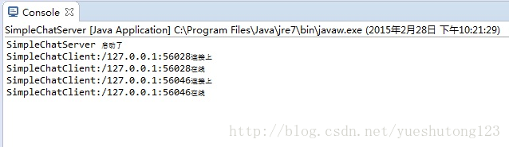
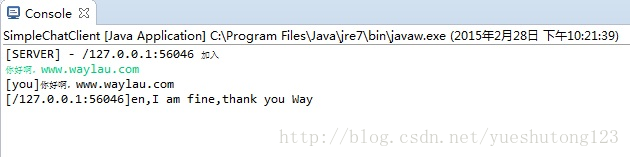
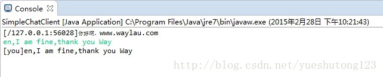

参看Netty入门（一）：Netty入门（一）之webSocket聊天室
Netty4.X下载地址：[http://netty.io/downloads.html](http://netty.io/downloads.html)

### 一：服务端

**1.SimpleChatServerHandler.java**

```javascript
package cn.zyzpp.netty4.service;

import io.netty.channel.Channel;
import io.netty.channel.ChannelHandlerContext;
import io.netty.channel.SimpleChannelInboundHandler;
import io.netty.channel.group.ChannelGroup;
import io.netty.channel.group.DefaultChannelGroup;
import io.netty.util.concurrent.GlobalEventExecutor;

/**
 * Created by 巅峰小学生 
 * 2018年3月4日
 */
public class SimpleChatServerHandler extends SimpleChannelInboundHandler<String> { // (1)
    public static ChannelGroup channels = new DefaultChannelGroup(GlobalEventExecutor.INSTANCE);

    /**
     * 每当从服务端收到新的客户端连接时，客户端的 Channel 存入ChannelGroup列表中，
     * 并通知列表中的其他客户端 Channel
     */
    @Override
    public void handlerAdded(ChannelHandlerContext ctx) throws Exception { // (2)
        Channel incoming = ctx.channel();
        for (Channel channel : channels) {
            channel.writeAndFlush("[SERVER] - " + incoming.remoteAddress() + " 加入\n");
        }
        channels.add(ctx.channel());
    }

    /**
     * 每当从服务端收到客户端断开时，客户端的 Channel 移除 ChannelGroup 列表中，
     * 并通知列表中的其他客户端 Channel
     */
    @Override
    public void handlerRemoved(ChannelHandlerContext ctx) throws Exception { // (3)
        Channel incoming = ctx.channel();
        for (Channel channel : channels) {
            channel.writeAndFlush("[SERVER] - " + incoming.remoteAddress() + " 离开\n");
        }
        channels.remove(ctx.channel());
    }

    /**
     * 每当从服务端读到客户端写入信息时，将信息转发给其他客户端的 Channel。
     * 其中如果你使用的是 Netty 5.x 版本时，需要把 channelRead0() 重命名为messageReceived()
     */
    @Override
    protected void channelRead0(ChannelHandlerContext ctx, String s) throws Exception { // (4)
        Channel incoming = ctx.channel();
        for (Channel channel : channels) {
            if (channel != incoming) {
                channel.writeAndFlush("[" + incoming.remoteAddress() + "]" + s + "\n");
            } else {
                channel.writeAndFlush("[you]" + s + "\n");
            }
        }
    }

    /**
     * 服务端监听到客户端活动
     */
    @Override
    public void channelActive(ChannelHandlerContext ctx) throws Exception { // (5)
        Channel incoming = ctx.channel();
        System.out.println("SimpleChatClient:" + incoming.remoteAddress() + "在线");
    }

    /**
     * 服务端监听到客户端不活动
     */
    @Override
    public void channelInactive(ChannelHandlerContext ctx) throws Exception { // (6)
        Channel incoming = ctx.channel();
        System.out.println("SimpleChatClient:" + incoming.remoteAddress() + "掉线");
    }

    /**
     * 当出现 Throwable 对象才会被调用
     */
    @Override
    public void exceptionCaught(ChannelHandlerContext ctx, Throwable cause) { // (7)
        Channel incoming = ctx.channel();
        System.out.println("SimpleChatClient:" + incoming.remoteAddress() + "异常");
        // 当出现异常就关闭连接
        cause.printStackTrace();
        ctx.close();
    }

}
```

>*  1.SimpleChatServerHandler 继承自 SimpleChannelInboundHandler，这个类实现了ChannelInboundHa   ndler接口，ChannelInboundHandler 提供了许多事件处理的接口方法，然后你可以覆盖这些方法。现在仅仅   只需要继承 SimpleChannelInboundHandler 类而不是你自己去实现接口方法。   2.覆盖了 handlerAdded() 事件处理方法。每当从服务端收到新的客户端连接时，客户端的 Channel 存入Chan   nelGroup列表中，并通知列表中的其他客户端 Channel   3.覆盖了 handlerRemoved() 事件处理方法。每当从服务端收到客户端断开时，客户端的 Channel 移除 Chan   nelGroup 列表中，并通知列表中的其他客户端 Channel   4.覆盖了 channelRead0() 事件处理方法。每当从服务端读到客户端写入信息时，将信息转发给其他客户端的 C   hannel。其中如果你使用的是 Netty 5.x 版本时，需要把 channelRead0() 重命名为messageReceived()   5.覆盖了 channelActive() 事件处理方法。服务端监听到客户端活动   6.覆盖了 channelInactive() 事件处理方法。服务端监听到客户端不活动   7.exceptionCaught() 事件处理方法是当出现 Throwable 对象才会被调用，即当 Netty 由于 IO 错误或者处理   器在处理事件时抛出的异常时。在大部分情况下，捕获的异常应该被记录下来并且把关联的 channel 给关闭   掉。然而这个方法的处理方式会在遇到不同异常的情况下有不同的实现，比如你可能想在关闭连接之前发送一个   错误码的响应消息。

**2.SimpleChatServerInitializer.java**

>*  SimpleChatServerInitializer 用来增加多个的处理类到 ChannelPipeline 上，包括编码、解码、SimpleChatS   erverHandler 等。

```javascript
package cn.zyzpp.netty4.service;

import io.netty.channel.ChannelInitializer;
import io.netty.channel.ChannelPipeline;
import io.netty.channel.socket.SocketChannel;
import io.netty.handler.codec.DelimiterBasedFrameDecoder;
import io.netty.handler.codec.Delimiters;
import io.netty.handler.codec.string.StringDecoder;
import io.netty.handler.codec.string.StringEncoder;

/**
 * Created by 巅峰小学生 
 * 2018年3月4日
 * 初始化连接时候的各个组件
 */
public class SimpleChatServerInitializer extends ChannelInitializer<SocketChannel> {
    @Override
    public void initChannel(SocketChannel ch) throws Exception {
        ChannelPipeline pipeline = ch.pipeline();
        pipeline.addLast("framer", new DelimiterBasedFrameDecoder(8192, Delimiters.lineDelimiter()));
        pipeline.addLast("decoder", new StringDecoder());
        pipeline.addLast("encoder", new StringEncoder());
        pipeline.addLast("handler", new SimpleChatServerHandler());
        System.out.println("SimpleChatClient:" + ch.remoteAddress() + "连接上");
    }
}
```

**3.SimpleChatServer.java**

>*  编写一个 main() 方法来启动服务端。

```javascript
package cn.zyzpp.netty4.service;

import io.netty.bootstrap.ServerBootstrap;
import io.netty.channel.ChannelFuture;
import io.netty.channel.ChannelOption;
import io.netty.channel.EventLoopGroup;
import io.netty.channel.nio.NioEventLoopGroup;
import io.netty.channel.socket.nio.NioServerSocketChannel;

public class SimpleChatServer {
    private int port;

    public SimpleChatServer(int port) {
        this.port = port;
    }

    public void run() throws Exception {
        EventLoopGroup bossGroup = new NioEventLoopGroup(); // (1)
        EventLoopGroup workerGroup = new NioEventLoopGroup();
        try {
            ServerBootstrap b = new ServerBootstrap(); // (2)
            b.group(bossGroup, workerGroup)
                    .channel(NioServerSocketChannel.class) // (3)
                    .childHandler(new SimpleChatServerInitializer()) // (4)
                    .option(ChannelOption.SO_BACKLOG, 128) // (5)
                    .childOption(ChannelOption.SO_KEEPALIVE, true); // (6)
            System.out.println("SimpleChatServer 启动了");
            // 绑定端口，开始接收进来的连接
            ChannelFuture f = b.bind(port).sync(); // (7)
            // 等待服务器 socket 关闭 。
            // 在这个例子中，这不会发生，但你可以优雅地关闭你的服务器。
            f.channel().closeFuture().sync();
        } finally {
            workerGroup.shutdownGracefully();
            bossGroup.shutdownGracefully();
            System.out.println("SimpleChatServer 关闭了");
        }
    }

    public static void main(String[] args) throws Exception {
        int port;
        if (args.length > 0) {
            port = Integer.parseInt(args[0]);
        } else {
            port = 8888;
        }
        new SimpleChatServer(port).run();
    }
}
```

>*  1.NioEventLoopGroup是用来处理I/O操作的多线程事件循环器，Netty 提供了许多不同的EventLoopGroup的   实现用来处理不同的传输。在这个例子中我们实现了一个服务端的应用，因此会有2个 NioEventLoopGroup 会   被使用。第一个经常被叫做&lsquo;boss&rsquo;，用来接收进来的连接。第二个经常被叫做&lsquo;worker&rsquo;，用来处理已经被   接收的连接，一旦&lsquo;boss&rsquo;接收到连接，就会把连接信息注册到&lsquo;worker&rsquo;上。如何知道多少个线程已经被使   用，如何映射到已经创建的 Channel上都需要依赖于 EventLoopGroup 的实现，并且可以通过构造函数来配置   他们的关系。   2.ServerBootstrap是一个启动 NIO 服务的辅助启动类。你可以在这个服务中直接使用 Channel，但是这会是   一个复杂的处理过程，在很多情况下你并不需要这样做。   3.这里我们指定使用NioServerSocketChannel类来举例说明一个新的 Channel 如何接收进来的连接。   4.这里的事件处理类经常会被用来处理一个最近的已经接收的 Channel。SimpleChatServerInitializer 继承自C   hannelInitializer是一个特殊的处理类，他的目的是帮助使用者配置一个新的 Channel。也许你想通过增加一些   处理类比如 SimpleChatServerHandler 来配置一个新的 Channel 或者其对应的ChannelPipeline来实现你的   网络程序。当你的程序变的复杂时，可能你会增加更多的处理类到 pipline 上，然后提取这些匿名类到最顶层的类   上。   5.你可以设置这里指定的 Channel 实现的配置参数。我们正在写一个TCP/IP 的服务端，因此我们被允许设置 s   ocket 的参数选项比如tcpNoDelay 和 keepAlive。请参考ChannelOption和详细的ChannelConfig实现的接   口文档以此可以对ChannelOption 的有一个大概的认识。   6.option() 是提供给NioServerSocketChannel用来接收进来的连接。childOption() 是提供给由父管道Server   Channel接收到的连接，在这个例子中也是 NioServerSocketChannel。   7.我们继续，剩下的就是绑定端口然后启动服务。这里我们在机器上绑定了机器所有网卡上的 8080 端口。当然   现在你可以多次调用 bind() 方法(基于不同绑定地址)。   恭喜！你已经完成了基于 Netty 聊天服务端程序。

### 二：客户端

**1.SimpleChatClientHandler.java**

>*  客户端的处理类比较简单，只需要将读到的信息打印出来即可

```javascript
package cn.zyzpp.netty4.client;

import io.netty.channel.ChannelHandlerContext;
import io.netty.channel.SimpleChannelInboundHandler;

/**
 * Created by 巅峰小学生 
 * 2018年3月4日 下午5:46:46
 */
public class SimpleChatClientHandler extends SimpleChannelInboundHandler<String> {
    @Override
    protected void channelRead0(ChannelHandlerContext ctx, String s) throws Exception {
        System.out.println(s);
    }
}
```

**2.SimpleChatClientInitializer.java**

>*  与服务端类似

```javascript
package cn.zyzpp.netty4.client;

import io.netty.channel.ChannelInitializer;
import io.netty.channel.ChannelPipeline;
import io.netty.channel.socket.SocketChannel;
import io.netty.handler.codec.DelimiterBasedFrameDecoder;
import io.netty.handler.codec.Delimiters;
import io.netty.handler.codec.string.StringDecoder;
import io.netty.handler.codec.string.StringEncoder;

/**
 * Created by 巅峰小学生
 *  2018年3月4日 下午5:48:08
*/
public class SimpleChatClientInitializer extends ChannelInitializer<SocketChannel> {
    @Override
    public void initChannel(SocketChannel ch) throws Exception {
        ChannelPipeline pipeline = ch.pipeline();
        pipeline.addLast("framer", new DelimiterBasedFrameDecoder(8192, Delimiters.lineDelimiter()));
        pipeline.addLast("decoder", new StringDecoder());
        pipeline.addLast("encoder", new StringEncoder());
        pipeline.addLast("handler", new SimpleChatClientHandler());
    }
}
```

**3.SimpleChatClient.java**

>*  编写一个 main() 方法来启动客户端。

```javascript
package cn.zyzpp.netty4.client;

import java.io.BufferedReader;
import java.io.InputStreamReader;

import io.netty.bootstrap.Bootstrap;
import io.netty.channel.Channel;
import io.netty.channel.EventLoopGroup;
import io.netty.channel.nio.NioEventLoopGroup;
import io.netty.channel.socket.nio.NioSocketChannel;

/**
 * Created by 巅峰小学生 
 * 2018年3月4日 下午5:50:44
 */
public class SimpleChatClient {
    public static void main(String[] args) throws Exception {
        new SimpleChatClient("localhost", 8080).run();
    }

    private final String host;
    private final int port;

    public SimpleChatClient(String host, int port) {
        this.host = host;
        this.port = port;
    }

    public void run() throws Exception {
        EventLoopGroup group = new NioEventLoopGroup();
        try {
            Bootstrap bootstrap = new Bootstrap().group(group).channel(NioSocketChannel.class)
                    .handler(new SimpleChatClientInitializer());
            Channel channel = bootstrap.connect(host, port).sync().channel();
            BufferedReader in = new BufferedReader(new InputStreamReader(System.in));
            while (true) {
                channel.writeAndFlush(in.readLine() + "\r\n");
            }
        } catch (Exception e) {
            e.printStackTrace();
        } finally {
            group.shutdownGracefully();
        }
    }
}
```

### 运行效果

先运行 SimpleChatServer，再可以运行多个 SimpleChatClient，控制台输入文本继续测试 



