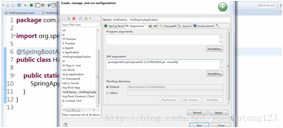

# 一：热部署的实现

>*  1.使用Spring-boot-devtools
>*  2.使用Spring Loaded

---

# 二：devtools（推荐）

一般情况下直接在pom.xml文件添加下面的依赖即可，但eclipse和IDEA有时也会造成影响。

```javascript
        <!-- 热部署 -->
        <dependency>
            <groupId>org.springframework.boot</groupId>
            <artifactId>spring-boot-devtools</artifactId>
            <optional>true</optional>
        </dependency>
```

如下配置，可有可无：

```
<span class="hljs-preprocessor">#热部署生效</span>
spring<span class="hljs-preprocessor">.devtools</span><span class="hljs-preprocessor">.restart</span><span class="hljs-preprocessor">.enabled</span>=true
<span class="hljs-preprocessor">#设置重启的目录,添加那个目录的文件需要restart</span>
spring<span class="hljs-preprocessor">.devtools</span><span class="hljs-preprocessor">.restart</span><span class="hljs-preprocessor">.additional</span>-paths=src/main/java
<span class="hljs-preprocessor"># 为mybatis设置，生产环境可删除</span>
restart<span class="hljs-preprocessor">.include</span><span class="hljs-preprocessor">.mapper</span>=/mapper-[%%w-%%.]+jar
restart<span class="hljs-preprocessor">.include</span><span class="hljs-preprocessor">.pagehelper</span>=/pagehelper-[%%w-%%.]+jar
<span class="hljs-preprocessor">#排除那个目录的文件不需要restart</span>
<span class="hljs-preprocessor">#spring.devtools.restart.exclude=static/**,public/**</span>
<span class="hljs-preprocessor">#classpath目录下的WEB-INF文件夹内容修改不重启</span>
<span class="hljs-preprocessor">#spring.devtools.restart.exclude=WEB-INF/**</span>
```

---

# 三：Spring Loaded

1.Maven启动方式,添加依赖

```javascript
        <dependency>
            <groupId>org.springframework</groupId>
            <artifactId>springloaded</artifactId>
            <veision>1.2.6.RELEASE</version>
        </dependency>
```

需要以maven方式启动 
执行mvn spring-boot:run命令

2.run as - Java application

需要下载该Jar包，右击运行配置

