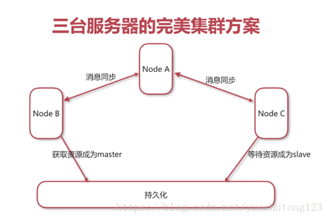

## 入门

消息中间件带来的好处：

```
1）解耦：系统解耦
2）异步：异步执行
3）横向扩展 
4）安全可靠
5）顺序保证
```

栗子： 
通过服务调用让其它系统感知事件发生

```
系统之间高耦合
程序执行效率低
```


 通过消息中间件解耦服务调用 

## 1.Linux安装消息中间件ActiveMQ

1.下载安装包 
`wget http://120.221.32.78:6510/mirrors.shu.edu.cn/apache//activemq/5.15.3/apache-activemq-5.15.3-bin.tar.gz` 
解压 
`tar -zxvf apache-activemq-5.15.3-bin.tar.gz`

2.启动与关闭

```java
进入到bin目录，使用命令./activemq start启动服务
使用命令ps -ef |grep activemq查看进程是否存在
使用命令./activemq stop关闭服务
```

3.安装验证

```java
访问地址：http://Linux主机IP:8161/
默认用户：admin
默认密码：admin
```

4.Maven依赖

```xml
<dependency>
     <groupId>org.apache.activemq</groupId>
     <artifactId>activemq-all</artifactId>
     <version>5.15.3</version>
</dependency>
```

## 2.队列模式的消息演示

队列模式： 
1）客户端包括生产者和消费者 
2）队列中的消息只能被一个消费者消费 
3）消费者可以随时消费

1.编写AppProducer类

```java
import javax.jms.Connection;
import javax.jms.ConnectionFactory;
import javax.jms.Destination;
import javax.jms.JMSException;
import javax.jms.MessageProducer;
import javax.jms.Session;
import javax.jms.TextMessage;

import org.apache.activemq.ActiveMQConnectionFactory;

/**
 * App 生产者-队列模式
 * @author
 *
 */
public class AppProducer {
    /** 指定ActiveMQ服务的地址 */
    private static final String URL = "tcp://127.0.0.1:61616";
    /** 指定队列的名称 */
    private static final String QUEUE_NAME = "queue-test";

    public static void main(String[] args) throws JMSException {

        // 1.创建ConnectionFactory
        ConnectionFactory connectionFactory = new ActiveMQConnectionFactory(URL);

        // 2.创建Connection
        Connection connection = connectionFactory.createConnection();

        // 3.启动连接
        connection.start();

        // 4.创建会话（第一个参数：是否在事务中处理）
        Session session = connection.createSession(false, Session.AUTO_ACKNOWLEDGE);

        // 5. 创建一个目标
        Destination destination = session.createQueue(QUEUE_NAME);

        // 6.创建一个生产者
        MessageProducer producer = session.createProducer(destination);

        for (int i = 0; i < 100; i++) {

            // 7.创建消息
            TextMessage textMessage = session.createTextMessage("test" + i);

            // 8.发布消息
            producer.send(textMessage);

            System.out.println("消息发送：" + textMessage.getText());
        }

        // 9.关闭连接
        connection.close();
    }

}
```

2.编写AppConsumer类

```java
import javax.jms.Connection;
import javax.jms.ConnectionFactory;
import javax.jms.Destination;
import javax.jms.JMSException;
import javax.jms.Message;
import javax.jms.MessageConsumer;
import javax.jms.MessageListener;
import javax.jms.Session;
import javax.jms.TextMessage;

import org.apache.activemq.ActiveMQConnectionFactory;

/**
 * App 消费者-队列模式
 * @author
 *
 */
public class AppConsumer {
    /** 指定ActiveMQ服务的地址 */
    private static final String URL = "tcp://127.0.0.1:61616";
    /** 指定队列的名称 */
    private static final String QUEUE_NAME = "queue-test";

    public static void main(String[] args) throws JMSException {

        // 1.创建ConnectionFactory
        ConnectionFactory connectionFactory = new ActiveMQConnectionFactory(URL);

        // 2.创建Connection
        Connection connection = connectionFactory.createConnection();

        // 3.启动连接
        connection.start();

        // 4.创建会话（第一个参数：是否在事务中处理）
        Session session = connection.createSession(false, Session.AUTO_ACKNOWLEDGE);

        // 5.创建一个目标
        Destination destination = session.createQueue(QUEUE_NAME);

        // 6.创建一个消费者
        MessageConsumer consumer = session.createConsumer(destination);

        // 7.创建一个监听器
        consumer.setMessageListener(new MessageListener() {
            public void onMessage(Message message) {
                TextMessage textMessage = (TextMessage)message;
                try {
                    System.out.println("接收消息：" + textMessage.getText());
                } catch (JMSException e) {
                    System.out.println("接收消息异常：");
                    e.printStackTrace();
                }
            }
        });

        // 8.关闭连接
        //connection.close();
    }

}
```

## 3.主题模式的消息演示

主题模式 
1）客户端包括发布者和订阅者 
2）主体中的消息被所有订阅者消费 
3）消费者不能消费订阅之前就发送到主题中的消息

1.编写AppProducer类

```java
import javax.jms.Connection;
import javax.jms.ConnectionFactory;
import javax.jms.Destination;
import javax.jms.JMSException;
import javax.jms.MessageProducer;
import javax.jms.Session;
import javax.jms.TextMessage;

import org.apache.activemq.ActiveMQConnectionFactory;

/**
 * App 生产者-主题模式
 * @author
 *
 */
public class AppProducer {
    /** 指定ActiveMQ服务的地址 */
    private static final String URL = "tcp://127.0.0.1:61616";
    /** 指定主题的名称 */
    private static final String TOPIC_NAME = "topic-test";

    public static void main(String[] args) throws JMSException {

        // 1.创建ConnectionFactory
        ConnectionFactory connectionFactory = new ActiveMQConnectionFactory(URL);

        // 2.创建Connection
        Connection connection = connectionFactory.createConnection();

        // 3.启动连接
        connection.start();

        // 4.创建会话（第一个参数：是否在事务中处理）
        Session session = connection.createSession(false, Session.AUTO_ACKNOWLEDGE);

        // 5. 创建一个目标
        Destination destination = session.createTopic(TOPIC_NAME);

        // 6.创建一个生产者
        MessageProducer producer = session.createProducer(destination);

        for (int i = 0; i < 100; i++) {

            // 7.创建消息
            TextMessage textMessage = session.createTextMessage("test" + i);

            // 8.发布消息
            producer.send(textMessage);

            System.out.println("消息发送：" + textMessage.getText());
        }

        // 9.关闭连接
        connection.close();
    }

}
```

2.编写AppConsumer类

```java
import javax.jms.Connection;
import javax.jms.ConnectionFactory;
import javax.jms.Destination;
import javax.jms.JMSException;
import javax.jms.Message;
import javax.jms.MessageConsumer;
import javax.jms.MessageListener;
import javax.jms.Session;
import javax.jms.TextMessage;

import org.apache.activemq.ActiveMQConnectionFactory;

/**
 * App 消费者-主题模式
 * @author
 *
 */
public class AppConsumer {
    /** 指定ActiveMQ服务的地址 */
    private static final String URL = "tcp://127.0.0.1:61616";
    /** 指定主题的名称 */
    private static final String TOPIC_NAME = "topic-test";

    public static void main(String[] args) throws JMSException {

        // 1.创建ConnectionFactory
        ConnectionFactory connectionFactory = new ActiveMQConnectionFactory(URL);

        // 2.创建Connection
        Connection connection = connectionFactory.createConnection();

        // 3.启动连接
        connection.start();

        // 4.创建会话（第一个参数：是否在事务中处理）
        Session session = connection.createSession(false, Session.AUTO_ACKNOWLEDGE);

        // 5.创建一个目标
        Destination destination = session.createTopic(TOPIC_NAME);

        // 6.创建一个消费者
        MessageConsumer consumer = session.createConsumer(destination);

        // 7.创建一个监听器
        consumer.setMessageListener(new MessageListener() {
            public void onMessage(Message message) {
                TextMessage textMessage = (TextMessage)message;
                try {
                    System.out.println("接收消息：" + textMessage.getText());
                } catch (JMSException e) {
                    System.out.println("接收消息异常：");
                    e.printStackTrace();
                }
            }
        });

        // 8.关闭连接
        //connection.close();
    }

}
```

## 4.Spring集成ActiveMQ

**1.Maven依赖**

```java

        <dependency>
            <groupId>org.apache.activemq</groupId>
            <artifactId>activemq-all</artifactId>
            <version>5.15.3</version>
        </dependency>

        <!--spring依赖 -->
        <dependency>
            <groupId>org.springframework</groupId>
            <artifactId>spring-context</artifactId>
            <version>4.1.7.RELEASE</version>
        </dependency>
        <dependency>
            <groupId>org.springframework</groupId>
            <artifactId>spring-jms</artifactId>
            <version>4.1.7.RELEASE</version>
        </dependency>
```

**2.spring配置文件**

1）common.xml

```java
<?xml version="1.0" encoding="UTF-8"?>
<beans xmlns="http://www.springframework.org/schema/beans"
    xmlns:xsi="http://www.w3.org/2001/XMLSchema-instance" 
    xmlns:context="http://www.springframework.org/schema/context"
    xsi:schemaLocation="http://www.springframework.org/schema/beans http://www.springframework.org/schema/beans/spring-beans.xsd
        http://www.springframework.org/schema/context http://www.springframework.org/schema/context/spring-context-4.3.xsd">

    <!-- 开启注解：可以使用@Autowired等 -->
    <context:annotation-config />

    <!-- ActiveMQ为我们提供的ConnectionFactory -->
    <bean id="targetConnectionFactory" class="org.apache.activemq.ActiveMQConnectionFactory">
        <property name="brokerURL" value="tcp://118.89.177.110:61616"></property>
    </bean>

    <!-- Spring jms为我们提供的连接池 -->
    <bean id="connectionFactory"
        class="org.springframework.jms.connection.SingleConnectionFactory">
        <property name="targetConnectionFactory" ref="targetConnectionFactory"></property>
    </bean>

    <!-- 队列模式 -->
    <bean id="queueDestination" class="org.apache.activemq.command.ActiveMQQueue">
        <constructor-arg value="queue"></constructor-arg>
    </bean>

    <!-- 主题模式-->
    <bean id="topicDestination" class="org.apache.activemq.command.ActiveMQTopic">
        <constructor-arg value="topic"></constructor-arg>
    </bean>

</beans>
```

2）consumer.xml

```java
<?xml version="1.0" encoding="UTF-8"?>
<beans xmlns="http://www.springframework.org/schema/beans"
    xmlns:xsi="http://www.w3.org/2001/XMLSchema-instance" 
    xmlns:context="http://www.springframework.org/schema/context"
    xsi:schemaLocation="http://www.springframework.org/schema/beans http://www.springframework.org/schema/beans/spring-beans.xsd
        http://www.springframework.org/schema/context http://www.springframework.org/schema/context/spring-context-4.3.xsd">

    <!-- 引入配置 -->
    <import resource="common.xml"/>

    <!-- 配置消息监听器 -->
    <bean id="consumerMessageListener" class="cn.zyzpp.spring.consumer.ConsumerMessageListener"/>

    <!-- 配置消息容器 -->
    <bean id="jmsContainer" class="org.springframework.jms.listener.DefaultMessageListenerContainer">
        <property name="connectionFactory" ref="connectionFactory" />
        <!-- 队列模式 -->
        <!-- <property name="destination" ref="queueDestination" /> -->
        <!-- 主题模式 -->
        <property name="destination" ref="topicDestination" />
        <property name="messageListener" ref="consumerMessageListener" />
    </bean>

</beans>
```

3）producer.xml

```java
<?xml version="1.0" encoding="UTF-8"?>
<beans xmlns="http://www.springframework.org/schema/beans"
    xmlns:xsi="http://www.w3.org/2001/XMLSchema-instance" 
    xmlns:context="http://www.springframework.org/schema/context"
    xsi:schemaLocation="http://www.springframework.org/schema/beans http://www.springframework.org/schema/beans/spring-beans.xsd
        http://www.springframework.org/schema/context http://www.springframework.org/schema/context/spring-context-4.3.xsd">

    <!-- 引入配置 -->
    <import resource="common.xml"/>

    <!-- 配置JmsTemplate发送消息 -->
    <bean id="jmsTemplate" class="org.springframework.jms.core.JmsTemplate">
        <property name="connectionFactory" ref="connectionFactory"></property>
    </bean>

    <!-- 注入实体Bean而不是接口 -->
    <bean class="cn.zyzpp.spring.producer.ProducerServiceImpl"></bean>

</beans>
```

3）生产者消费者编码

ProducerService.java

```java
package cn.zyzpp.spring.producer;
/**
 * Created by yster@foxmail.com
*/
public interface ProducerService {
    void sendMessage(String message);
}
```

ProducerServiceImpl.java

```java
package cn.zyzpp.spring.producer;

import javax.annotation.Resource;
import javax.jms.Destination;
import javax.jms.JMSException;
import javax.jms.Message;
import javax.jms.Session;
import javax.jms.TextMessage;

import org.springframework.beans.factory.annotation.Autowired;
import org.springframework.jms.core.JmsTemplate;
import org.springframework.jms.core.MessageCreator;

/**
 * Created by yster@foxmail.com 2018年4月24日 下午7:13:27
 */
public class ProducerServiceImpl implements ProducerService {

    @Autowired
    private JmsTemplate jmsTemplate;

//  @Resource(name = "queueDestination") //队列模式
    @Resource(name = "topicDestination") //主题模式
    private Destination destination;

    @Override
    public void sendMessage(String message) {
        //使用jmsTemplate发送消息
        jmsTemplate.send(destination, new MessageCreator() {
            @Override
            public Message createMessage(Session session) throws JMSException {
                //创建一个消息
                TextMessage textMessage = session.createTextMessage(message);
                return textMessage;
            }
        });
        System.out.println("发送消息：" + message);
    }

}
```

AppProducer.java

```java
package cn.zyzpp.spring.producer;

import org.springframework.context.support.ClassPathXmlApplicationContext;

/**
 * Created by yster@foxmail.com
 * 2018年4月24日 下午7:29:30
*/
public class AppProducer {

    public static void main(String[] args) {
        ClassPathXmlApplicationContext context = new ClassPathXmlApplicationContext("classpath:producer.xml");
        ProducerService service = context.getBean(ProducerService.class);
        for(int i=0; i<100; i++){
            service.sendMessage("消息发送："+i);
        }
        context.close();
    }

}
```

ConsumerMessageListener.java

```java
package cn.zyzpp.spring.consumer;

import javax.jms.JMSException;
import javax.jms.Message;
import javax.jms.MessageListener;
import javax.jms.TextMessage;

/**
 * Created by yster@foxmail.com
 * 2018年4月24日 下午8:48:39
*/
public class ConsumerMessageListener implements MessageListener {

    @Override
    public void onMessage(Message message) {
        TextMessage textMessage = (TextMessage) message;
        try {
            System.out.println("接受消息：" + textMessage.getText());
        } catch (JMSException e) {
            e.printStackTrace();
        }
    }

}
```

AppConsumer.java

```java
package cn.zyzpp.spring.consumer;

import org.springframework.context.ApplicationContext;
import org.springframework.context.support.ClassPathXmlApplicationContext;

/**
 * Created by yster@foxmail.com
 * 2018年4月24日 下午7:29:30
*/
public class AppConsumer {

    public static void main(String[] args) {
        ApplicationContext context = new ClassPathXmlApplicationContext("classpath:consumer.xml");

    }

}
```

## 5.ActiveMQ集群

为什么要对消息中间件集群

```
实现高可用，以排除单点故障引起的服务中断
实现负载均衡，以提升效率为更多客户提供服务
```

集群方式

```java
客户端集群：让多个消费者消费同一个队列
Broker cluster：多个Broker之间同步消息
Master Slave：实现高可用
```

ActiveMQ失效转移（failover）-客户端配置

```
允许当其中一台消息服务器宕机时，客户端在传输层上重新连接到其它消息服务器
语法：<span class="hljs-tag">failover</span><span class="hljs-pseudo">:(uri1</span>,&hellip;,<span class="hljs-tag">uriN</span>)?<span class="hljs-tag">transportOptions</span>
```

transportOptions参数说明

```java
randomize默认为true，表示在URI列表中选择URI连接时是否采用随机策略
initialReconnectDelay默认为10，单位毫秒，表示第一次尝试重连之间等待的时间
maxReconnectDelay默认为30000，单位毫秒，最长重连的时间间隔
```

Broker cluster集群配置-原理 

NetworkConnector（网络连接器）

```
网络连接器主要用于配置ActiveMQ服务器与服务器之间的网络通讯方式，
用于服务器透传消息。
网络连接器分为静态连接器和动态连接器
```

静态连接器


动态连接器


5-2 ActiveMQ集群理论 
ActiveMQ Master Slace集群方案

```java
Share nothing storage master/slave（已过时，5.8+后移除）
Shared storage master/slave 共享存储
Replicated LevelDB Store基于负责的LevelDB Store
```

共享存储集群的原理


基于复制的LevelDB Store的原理


两种集群方式对比


三台服务器的完美集群方案 


ActiveMQ集群配置方案 

配置过程

1.节点准备

```java
mkdir activemq创建目录
cp -rf apache-activemq-5.15.3 activemq/activemq-a
cp -rf apache-activemq-5.15.3 activemq/activemq-b
cp -rf apache-activemq-5.15.3 activemq/activemq-c
cd activemq
mkdir kahadb
```

2.配置a节点

```java
cd activemq-a/
cd conf/
vim activemq.xml
    <networkConnectors>
              <networkConnector name="local_network" uri="static:(tcp://127.0.0.1:61617,tcp://127.0.0.1:61618)" />
    </networkConnectors>
vim jetty.xml：配置管理端口号，a节点使用默认端口，无须配置
```

3.配置b节点

```java
vim activemq.xml
配置网络连接器
    <networkConnectors>
      <networkConnector name="network_a" uri="static:(tcp://127.0.0.1:61616)" />
    </networkConnectors>
配置持久化存储路径
    <persistenceAdapter>
        <kahaDB directory="/***/activemq/kahadb"/>
    </persistenceAdapter>
配置服务端口
<transportConnector name="openwire" uri="tcp://0.0.0.0:61617?maximumConnections=1000&wireFormat.maxFrameSize=104857600"/>
vim jetty.xml
配置管理端口号
<bean id="jettyPort" class="org.apache.activemq.web.WebConsolePort" init-method="start">
         <!-- the default port number for the web console -->
    <property name="host" value="0.0.0.0"/>
    <property name="port" value="8162"/>
</bean>
```

4.配置c节点

```java
vim activemq.xml
配置网络连接器
    <networkConnectors>
      <networkConnector name="network_a" uri="static:(tcp://127.0.0.1:61616)" />
    </networkConnectors>
配置持久化存储路径
    <persistenceAdapter>
        <kahaDB directory="/***/activemq/kahadb"/>
    </persistenceAdapter>
配置服务端口
<transportConnector name="openwire" uri="tcp://0.0.0.0:61618?maximumConnections=1000&wireFormat.maxFrameSize=104857600"/>
vim jetty.xml
配置管理端口号
<bean id="jettyPort" class="org.apache.activemq.web.WebConsolePort" init-method="start">
         <!-- the default port number for the web console -->
    <property name="host" value="0.0.0.0"/>
    <property name="port" value="8163"/>
</bean>
```

5.启动服务

回到activemq目录，分别启动a，b，c三个节点

```java
./activemq-a/bin/activemq start
./activemq-b/bin/activemq start
./activemq-c /bin/activemq start
```

检查是否都启动成功

```java
ps -ef |grep activemq
```

检查是否对外提供服务，即端口是否被监听（占用）

```java
netstat -anp |grep 61616
netstat -anp |grep 61617
netstat -anp |grep 61618
```

检查发现61618即c节点没有提供服务，但是c节点的进程是启动成功了的。因为b节点和c点击是master/slave配置，现在b节点获取到了共享文件夹的所有权，所以c节点正在等待获得资源，并且提供服务。即c节点在未获得资源之前，是不提供服务的。

测试，把b节点杀掉，看c节点能不能提供61618的服务

```java
./activemq-b/bin/activemq stop
netstat -anp |grep 61618
./activemq-b/bin/activemq start
netstat -anp |grep 61617
```

检查发现，重新启动b节点后，b节点61617端口并没有提供服务，是因为现在b节点成为了slave节点，而c节点成为了master节点。所以，现在b节点启动了，但是它并不对外提供服务。只有当c节点出现问题后，b节点才对外提供服务。

6.通过代码测试集群配置是否生效

生产者

```java
import javax.jms.Connection;
import javax.jms.ConnectionFactory;
import javax.jms.Destination;
import javax.jms.JMSException;
import javax.jms.MessageProducer;
import javax.jms.Session;
import javax.jms.TextMessage;

import org.apache.activemq.ActiveMQConnectionFactory;

/**
 * App 生产者-队列模式-集群配置测试
 * @author
 *
 */
public class AppProducerTest {
    /** failover 为状态转移的存在部分
     * 因a节点只作为消费者使用，所以这里不配置61616节点了。
     * */
    private static final String URL = "failover:(tcp://127.0.0.1:61617,tcp://127.0.0.1:61618)?randomize=true";
    /** 指定队列的名称 */
    private static final String QUEUE_NAME = "queue-test";

    public static void main(String[] args) throws JMSException {

        // 1.创建ConnectionFactory
        ConnectionFactory connectionFactory = new ActiveMQConnectionFactory(URL);

        // 2.创建Connection
        Connection connection = connectionFactory.createConnection();

        // 3.启动连接
        connection.start();

        // 4.创建会话（第一个参数：是否在事务中处理）
        Session session = connection.createSession(false, Session.AUTO_ACKNOWLEDGE);

        // 5. 创建一个目标
        Destination destination = session.createQueue(QUEUE_NAME);

        // 6.创建一个生产者
        MessageProducer producer = session.createProducer(destination);

        for (int i = 0; i < 100; i++) {

            // 7.创建消息
            TextMessage textMessage = session.createTextMessage("test" + i);

            // 8.发布消息
            producer.send(textMessage);

            System.out.println("消息发送：" + textMessage.getText());
        }

        // 9.关闭连接
        connection.close();
    }

}
```

消费者

```java
import javax.jms.Connection;
import javax.jms.ConnectionFactory;
import javax.jms.Destination;
import javax.jms.JMSException;
import javax.jms.Message;
import javax.jms.MessageConsumer;
import javax.jms.MessageListener;
import javax.jms.Session;
import javax.jms.TextMessage;

import org.apache.activemq.ActiveMQConnectionFactory;

/**
 * App 消费者-队列模式-集群配置测试
 * @author
 *
 */
public class AppConsumerTest {
    /** failover 为状态转移的存在部分
     * */
    private static final String URL = "failover:(tcp://127.0.0.1:61616,tcp://127.0.0.1:61617,tcp://127.0.0.1:61618)?randomize=true";
    /** 指定队列的名称 */
    private static final String QUEUE_NAME = "queue-test";

    public static void main(String[] args) throws JMSException {

        // 1.创建ConnectionFactory
        ConnectionFactory connectionFactory = new ActiveMQConnectionFactory(URL);

        // 2.创建Connection
        Connection connection = connectionFactory.createConnection();

        // 3.启动连接
        connection.start();

        // 4.创建会话（第一个参数：是否在事务中处理）
        Session session = connection.createSession(false, Session.AUTO_ACKNOWLEDGE);

        // 5.创建一个目标
        Destination destination = session.createQueue(QUEUE_NAME);

        // 6.创建一个消费者
        MessageConsumer consumer = session.createConsumer(destination);

        // 7.创建一个监听器
        consumer.setMessageListener(new MessageListener() {
            public void onMessage(Message message) {
                TextMessage textMessage = (TextMessage)message;
                try {
                    System.out.println("接收消息：" + textMessage.getText());
                } catch (JMSException e) {
                    System.out.println("接收消息异常：");
                    e.printStackTrace();
                }
            }
        });

        // 8.关闭连接
        //connection.close();
    }

}
```

管理界面查看消息

```java
http://127.0.0.1:8161
http://127.0.0.1:8162
http://127.0.0.1:8163
```

## 6.扩展


本文记录简要，推荐阅读 [慕课网-Java消息中间件学习总结](https://segmentfault.com/a/1190000010348979)