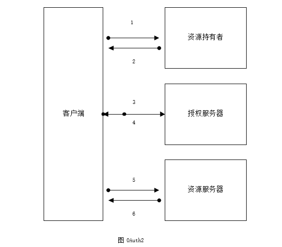
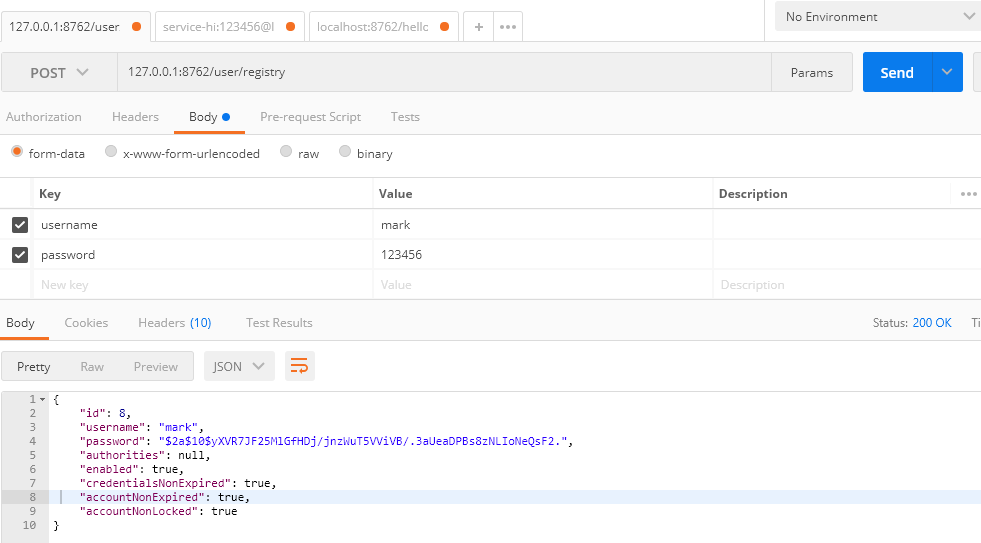
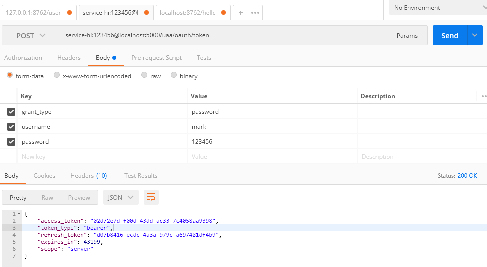
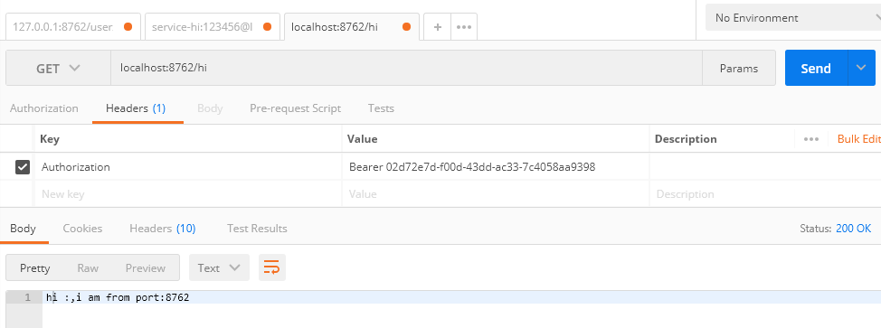
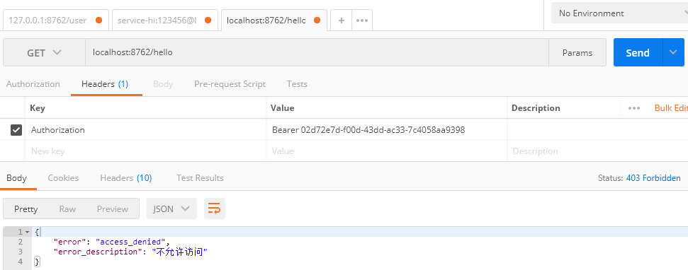
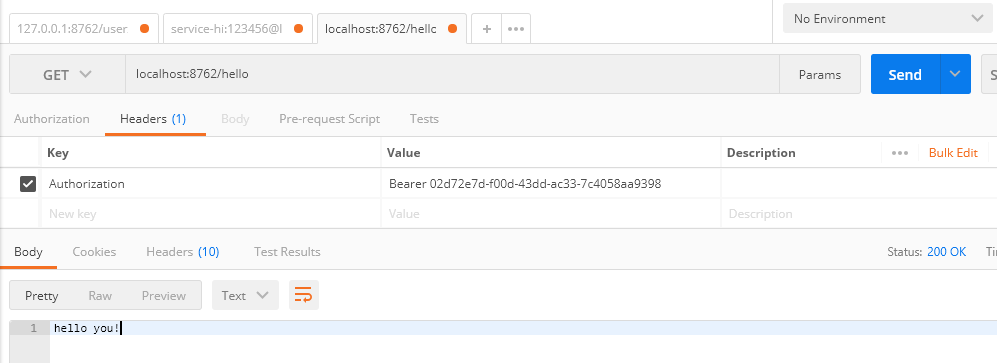

# 一、简介

OAth2是一个标准的授权协议。

在认证与授权的过程中，主要包含以下3种角色。

- 服务提供方 Authorization Server。
- 资源持有者 Resource Server。
- 客户端 Client。

OAuth2的认证流程如图所示，具体如下。




（1）用户（资源持有者）打开客户端 ，客户端询问用户授权。

（2）用户同意授权。

（3）客户端向授权服务器申请授权。

（4）授权服务器对客户端进行认证，也包括用户信息的认证，认证成功后授权给予令牌。

（5）客户端获取令牌后，携带令牌向资源服务器请求资源。

（6）资源服务器确认令牌正确无误，向客户端释放资源。

OAuth2 Provider 的角色被分为 Authorization Server（授权服务）和 Resource Service（资源服务），通常它们不在同一个服务中，可能一个 Authorization Service 对应多个 Resource Service。Spring OAuth2 需配合 Spring Security 一起使用，所有的请求由 Spring MVC 控制器处理，并经过一系列的Spring Security过滤器。

在Spring Security过滤器链中有以下两个节点，这两个节点是向 Authorization Service 获取验证和授权的。

- 授权节点：默认为 /oauth/authorize。
- 获取Token节点：默认为 /oauth/token。

# 二、快速开始

## 2.1 新建本地数据库

客户端信息可以存储在数据库中，这样就可以通过更改数据库来实时更新客户端信息的数据。Spring OAuth2 已经设计好了数据库的表，且不可变。

```sql
/*
 Navicat MySQL Data Transfer
 
 Source Host           : localhost
 Source Database       : spring-cloud-auth

 Target Server Version : 50718
 File Encoding         : utf-8
*/

SET NAMES utf8;
SET FOREIGN_KEY_CHECKS = 0;

-- ----------------------------
--  Table structure for `clientdetails`
-- ----------------------------
DROP TABLE IF EXISTS `clientdetails`;
CREATE TABLE `clientdetails` (
  `appId` varchar(128) NOT NULL,
  `resourceIds` varchar(256) DEFAULT NULL,
  `appSecret` varchar(256) DEFAULT NULL,
  `scope` varchar(256) DEFAULT NULL,
  `grantTypes` varchar(256) DEFAULT NULL,
  `redirectUrl` varchar(256) DEFAULT NULL,
  `authorities` varchar(256) DEFAULT NULL,
  `access_token_validity` int(11) DEFAULT NULL,
  `refresh_token_validity` int(11) DEFAULT NULL,
  `additionalInformation` varchar(4096) DEFAULT NULL,
  `autoApproveScopes` varchar(256) DEFAULT NULL,
  PRIMARY KEY (`appId`)
) ENGINE=InnoDB DEFAULT CHARSET=utf8;

-- ----------------------------
--  Table structure for `oauth_access_token`
-- ----------------------------
DROP TABLE IF EXISTS `oauth_access_token`;
CREATE TABLE `oauth_access_token` (
  `token_id` varchar(256) DEFAULT NULL,
  `token` blob,
  `authentication_id` varchar(128) NOT NULL,
  `user_name` varchar(256) DEFAULT NULL,
  `client_id` varchar(256) DEFAULT NULL,
  `authentication` blob,
  `refresh_token` varchar(256) DEFAULT NULL,
  PRIMARY KEY (`authentication_id`)
) ENGINE=InnoDB DEFAULT CHARSET=utf8;


-- ----------------------------
--  Table structure for `oauth_approvals`
-- ----------------------------
DROP TABLE IF EXISTS `oauth_approvals`;
CREATE TABLE `oauth_approvals` (
  `userId` varchar(256) DEFAULT NULL,
  `clientId` varchar(256) DEFAULT NULL,
  `scope` varchar(256) DEFAULT NULL,
  `status` varchar(10) DEFAULT NULL,
  `expiresAt` datetime DEFAULT NULL,
  `lastModifiedAt` datetime DEFAULT NULL
) ENGINE=InnoDB DEFAULT CHARSET=utf8;

-- ----------------------------
--  Table structure for `oauth_client_details`
-- ----------------------------
DROP TABLE IF EXISTS `oauth_client_details`;
CREATE TABLE `oauth_client_details` (
  `client_id` varchar(256) NOT NULL,
  `resource_ids` varchar(256) DEFAULT NULL,
  `client_secret` varchar(256) DEFAULT NULL,
  `scope` varchar(256) DEFAULT NULL,
  `authorized_grant_types` varchar(256) DEFAULT NULL,
  `web_server_redirect_uri` varchar(256) DEFAULT NULL,
  `authorities` varchar(256) DEFAULT NULL,
  `access_token_validity` int(11) DEFAULT NULL,
  `refresh_token_validity` int(11) DEFAULT NULL,
  `additional_information` varchar(4096) DEFAULT NULL,
  `autoapprove` varchar(256) DEFAULT NULL,
  PRIMARY KEY (`client_id`)
) ENGINE=InnoDB DEFAULT CHARSET=utf8;

-- ----------------------------
--  Table structure for `oauth_client_token`
-- ----------------------------
DROP TABLE IF EXISTS `oauth_client_token`;
CREATE TABLE `oauth_client_token` (
  `token_id` varchar(256) DEFAULT NULL,
  `token` blob,
  `authentication_id` varchar(128) NOT NULL,
  `user_name` varchar(256) DEFAULT NULL,
  `client_id` varchar(256) DEFAULT NULL,
  PRIMARY KEY (`authentication_id`)
) ENGINE=InnoDB DEFAULT CHARSET=utf8;

-- ----------------------------
--  Table structure for `oauth_code`
-- ----------------------------
DROP TABLE IF EXISTS `oauth_code`;
CREATE TABLE `oauth_code` (
  `code` varchar(256) DEFAULT NULL,
  `authentication` blob
) ENGINE=InnoDB DEFAULT CHARSET=utf8;

-- ----------------------------
--  Table structure for `oauth_refresh_token`
-- ----------------------------
DROP TABLE IF EXISTS `oauth_refresh_token`;
CREATE TABLE `oauth_refresh_token` (
  `token_id` varchar(256) DEFAULT NULL,
  `token` blob,
  `authentication` blob
) ENGINE=InnoDB DEFAULT CHARSET=utf8;


-- ----------------------------
--  Table structure for `role`
-- ----------------------------
DROP TABLE IF EXISTS `role`;
CREATE TABLE `role` (
  `id` bigint(20) NOT NULL AUTO_INCREMENT,
  `name` varchar(255) NOT NULL,
  PRIMARY KEY (`id`)
) ENGINE=InnoDB AUTO_INCREMENT=3 DEFAULT CHARSET=utf8;


-- ----------------------------
--  Table structure for `user`
-- ----------------------------
DROP TABLE IF EXISTS `user`;
CREATE TABLE `user` (
  `id` bigint(20) NOT NULL AUTO_INCREMENT,
  `password` varchar(255) DEFAULT NULL,
  `username` varchar(255) NOT NULL,
  PRIMARY KEY (`id`),
  UNIQUE KEY `UK_sb8bbouer5wak8vyiiy4pf2bx` (`username`)
) ENGINE=InnoDB AUTO_INCREMENT=7 DEFAULT CHARSET=utf8;


-- ----------------------------
--  Table structure for `user_role`
-- ----------------------------
DROP TABLE IF EXISTS `user_role`;
CREATE TABLE `user_role` (
  `user_id` bigint(20) NOT NULL,
  `role_id` bigint(20) NOT NULL,
  KEY `FKa68196081fvovjhkek5m97n3y` (`role_id`),
  KEY `FK859n2jvi8ivhui0rl0esws6o` (`user_id`),
  CONSTRAINT `FK859n2jvi8ivhui0rl0esws6o` FOREIGN KEY (`user_id`) REFERENCES `user` (`id`),
  CONSTRAINT `FKa68196081fvovjhkek5m97n3y` FOREIGN KEY (`role_id`) REFERENCES `role` (`id`)
) ENGINE=InnoDB DEFAULT CHARSET=utf8;


SET FOREIGN_KEY_CHECKS = 1;
```

## 2.2 新建Maven工程

整个项目采用的是Maven多Module的形式，所以需要你新建一个空白的Maven工程，并在根目录的pom.xml的配置Spring Boot的版本1.5.3.RELEASE，Spring Cloud的版本为Dalston.RELEASE，参考代码

```xml

<?xml version="1.0" encoding="UTF-8"?>
<project xmlns="http://maven.apache.org/POM/4.0.0" xmlns:xsi="http://www.w3.org/2001/XMLSchema-instance"
         xsi:schemaLocation="http://maven.apache.org/POM/4.0.0 http://maven.apache.org/xsd/maven-4.0.0.xsd">
    <modelVersion>4.0.0</modelVersion>

    <parent>
        <groupId>org.springframework.boot</groupId>
        <artifactId>spring-boot-starter-parent</artifactId>
        <version>1.5.3.RELEASE</version>
        <relativePath/>
    </parent>

    <modules>
        <module>eureka-server</module>
        <module>service-auth</module>
        <module>service-hi</module>
    </modules>

    <groupId>cn.yueshutong</groupId>
    <artifactId>spring-cloud-autho2</artifactId>
    <version>0.0.1-SNAPSHOT</version>
    <name>spring-cloud-autho2</name>
    <description>Demo project for Spring Boot</description>

    <properties>
        <java.version>1.8</java.version>
        <spring-cloud.version>Dalston.RELEASE</spring-cloud.version>
    </properties>

    <dependencies>
        <dependency>
            <groupId>org.springframework.boot</groupId>
            <artifactId>spring-boot-starter</artifactId>
        </dependency>

        <dependency>
            <groupId>org.springframework.boot</groupId>
            <artifactId>spring-boot-starter-test</artifactId>
            <scope>test</scope>
        </dependency>
    </dependencies>

    <dependencyManagement>
        <dependencies>
            <dependency>
                <groupId>org.springframework.cloud</groupId>
                <artifactId>spring-cloud-dependencies</artifactId>
                <version>${spring-cloud.version}</version>
                <type>pom</type>
                <scope>import</scope>
            </dependency>
        </dependencies>
    </dependencyManagement>

    <build>
        <plugins>
            <plugin>
                <groupId>org.springframework.boot</groupId>
                <artifactId>spring-boot-maven-plugin</artifactId>
            </plugin>
        </plugins>
    </build>

</project>

```

## 2.3 编写 Eureka Server

新建模块eureka-server，并添加Eureka依赖，此处要指定父工程

```xml

<?xml version="1.0" encoding="UTF-8"?>
<project xmlns="http://maven.apache.org/POM/4.0.0" xmlns:xsi="http://www.w3.org/2001/XMLSchema-instance"
         xsi:schemaLocation="http://maven.apache.org/POM/4.0.0 http://maven.apache.org/xsd/maven-4.0.0.xsd">
    <modelVersion>4.0.0</modelVersion>

    <groupId>cn.yueshutong</groupId>
    <artifactId>eureka-server</artifactId>
    <version>0.0.1-SNAPSHOT</version>
    <packaging>jar</packaging>

    <name>eureka-server</name>
    <description>Demo project for Spring Boot</description>

    <parent>
        <groupId>cn.yueshutong</groupId>
        <artifactId>spring-cloud-autho2</artifactId>
        <version>0.0.1-SNAPSHOT</version>
    </parent>

    <properties>
        <java.version>1.8</java.version>
    </properties>

    <dependencies>
        <dependency>
            <groupId>org.springframework.cloud</groupId>
            <artifactId>spring-cloud-starter-eureka-server</artifactId>
        </dependency>

    </dependencies>

    <build>
        <plugins>
            <plugin>
                <groupId>org.springframework.boot</groupId>
                <artifactId>spring-boot-maven-plugin</artifactId>
            </plugin>
        </plugins>
    </build>

</project>


```

在eureka-server工程的配置文件 application.yml 中配置 Eureka Server

```yml
server:
  port: 8761
eureka:
  instance:
    hostname: localhost
  client:
    registerWithEureka: false
    fetchRegistry: false
    serviceUrl:
      defaultZone: http://${eureka.instance.hostname}:${server.port}/eureka/
```

最后，添加@EnableEurekaServer注解开启Eureka Server的功能

```java
@EnableEurekaServer
@SpringBootApplication
public class EurekaServerApplication {

	public static void main(String[] args) {
		SpringApplication.run(EurekaServerApplication.class, args);
	}
}
```

## 2.4 编写 Uaa 授权服务

1.新建模块service-auth，并加入下列依赖，作为Uaa（授权服务）

```xml

<?xml version="1.0" encoding="UTF-8"?>
<project xmlns="http://maven.apache.org/POM/4.0.0" xmlns:xsi="http://www.w3.org/2001/XMLSchema-instance"
         xsi:schemaLocation="http://maven.apache.org/POM/4.0.0 http://maven.apache.org/xsd/maven-4.0.0.xsd">
    <modelVersion>4.0.0</modelVersion>

    <groupId>cn.yueshutong</groupId>
    <artifactId>service-auth</artifactId>
    <version>0.0.1-SNAPSHOT</version>
    <packaging>jar</packaging>

    <name>service-auth</name>
    <description>Demo project for Spring Boot</description>

    <parent>
        <groupId>cn.yueshutong</groupId>
        <artifactId>spring-cloud-autho2</artifactId>
        <version>0.0.1-SNAPSHOT</version>
    </parent>

    <properties>
        <java.version>1.8</java.version>
    </properties>

    <dependencies>
        <dependency>
            <groupId>org.springframework.cloud</groupId>
            <artifactId>spring-cloud-starter-oauth2</artifactId>
        </dependency>

        <dependency>
            <groupId>org.springframework.boot</groupId>
            <artifactId>spring-boot-starter-data-jpa</artifactId>
        </dependency>

        <dependency>
            <groupId>mysql</groupId>
            <artifactId>mysql-connector-java</artifactId>
        </dependency>

        <dependency>
            <groupId>org.springframework.boot</groupId>
            <artifactId>spring-boot-starter-web</artifactId>

        </dependency>
        <dependency>
            <groupId>org.springframework.cloud</groupId>
            <artifactId>spring-cloud-starter-eureka</artifactId>
        </dependency>
    </dependencies>

    <build>
        <plugins>
            <plugin>
                <groupId>org.springframework.boot</groupId>
                <artifactId>spring-boot-maven-plugin</artifactId>
            </plugin>
        </plugins>
    </build>

</project>


```

打开spring-cloud-starter-oauth2依赖可以看到，它已经整合了spring-cloud-starter-security、spring-security-oauth2 和 spring-security-jwt 这3个起步依赖。

2.配置 application.yml 做如下配置

```yml
spring:
  application:
    name: service-auth

  datasource:
    driver-class-name: com.mysql.jdbc.Driver
    url: jdbc:mysql://localhost:3306/spring-cloud-auth?useUnicode=true&characterEncoding=utf8&characterSetResults=utf8
    username: root
    password: 123456

  jpa:
    hibernate:
      ddl-auto: update
    show-sql: true
server:
  context-path: /uaa
  port: 5000

security:
  oauth2:
    resource:
      filter-order: 3
#  basic:
#    enabled: false


eureka:
  client:
    serviceUrl:
      defaultZone: http://localhost:8761/eureka/
```

配置 security.oauth2.resource.filter-order 为3，在 Spring Boot1.5.x 版本之前，默认即可。

3.配置Spring Security

由于 auth-service 需要对外暴露检查 Token 的API接口，所以 auth-service 也是一个资源服务，需要在工程中引入 Spring Security，并做相关配置，对 auth-service 资源进行保护。

```java
@Configuration
@EnableWebSecurity
@EnableGlobalMethodSecurity(prePostEnabled = true)//注解开启在方法上的保护功能
public class WebSecurityConfig extends WebSecurityConfigurerAdapter {


    @Autowired
    private UserServiceDetail userServiceDetail;

    @Override
    protected void configure(HttpSecurity http) throws Exception {
        // @formatter:off
        http
                .authorizeRequests().anyRequest().authenticated()
                .and()
                .csrf().disable();
        // @formatter:on
    }

    @Override
    protected void configure(AuthenticationManagerBuilder auth) throws Exception {
        auth.userDetailsService(userServiceDetail).passwordEncoder(new BCryptPasswordEncoder());
    }

    @Override
    @Bean
    public AuthenticationManager authenticationManagerBean() throws Exception {
        return super.authenticationManagerBean();
    }

}
```

UserServiceDetail.java 

```java
@Service
public class UserServiceDetail implements UserDetailsService {

    @Autowired
    private UserDao userRepository;
    
    @Override
    public UserDetails loadUserByUsername(String username) throws UsernameNotFoundException {
        return userRepository.findByUsername(username);
    }
}
```

User.java，需要实现 UserDetails 接口

```java
@Entity
public class User implements UserDetails, Serializable {
	@Id
	@GeneratedValue(strategy = GenerationType.IDENTITY)
	private Long id;

	@Column(nullable = false,  unique = true)
	private String username;

	@Column
	private String password;

	@ManyToMany(cascade = CascadeType.ALL, fetch = FetchType.EAGER)
	@JoinTable(name = "user_role", joinColumns = @JoinColumn(name = "user_id", referencedColumnName = "id"),
			inverseJoinColumns = @JoinColumn(name = "role_id", referencedColumnName = "id"))
	private List<Role> authorities;


	public User() {
	}

	@Override
	public Collection<? extends GrantedAuthority> getAuthorities() {
		return authorities;
	}

    //setter getter

	@Override
	public boolean isAccountNonExpired() {
		return true;
	}

	@Override
	public boolean isAccountNonLocked() {
		return true;
	}

	@Override
	public boolean isCredentialsNonExpired() {
		return true;
	}

	@Override
	public boolean isEnabled() {
		return true;
	}

}
```

Role.java，需要实现GrantedAuthority接口

```java
@Entity
public class Role implements GrantedAuthority {

	@Id
	@GeneratedValue(strategy = GenerationType.IDENTITY)
	private Long id;

	@Column(nullable = false)
	private String name;

    //setter getter
    
	@Override
	public String getAuthority() {
		return name;
	}
    
	@Override
	public String toString() {
		return name;
	}
}
```

UserDao.java

```java
public interface UserDao extends JpaRepository<User, Long> {
	User findByUsername(String username);
}
```

4.配置Authorization Server

```java
@SpringBootApplication
@EnableResourceServer //开启资源服务，因为程序需要对外暴露获取token的API接口
@EnableEurekaClient //开启Eureka Client
public class ServiceAuthApplication {
	@Autowired
	@Qualifier("dataSource")
	private DataSource dataSource;

	public static void main(String[] args) {
		SpringApplication.run(ServiceAuthApplication.class, args);
	}


	@Configuration
	@EnableAuthorizationServer //开启授权服务的功能
	protected  class OAuth2AuthorizationConfig extends AuthorizationServerConfigurerAdapter {

		//将Token存储在内存中
		//private TokenStore tokenStore = new InMemoryTokenStore();

		JdbcTokenStore tokenStore=new JdbcTokenStore(dataSource);

		@Autowired
		@Qualifier("authenticationManagerBean")
		private AuthenticationManager authenticationManager;

		@Autowired
		private UserServiceDetail userServiceDetail;


		@Override
		public void configure(ClientDetailsServiceConfigurer clients) throws Exception {
		    //ClientDetailsServiceConfigurer配置了客户端的一些基本信息
			clients.inMemory() //将客户端的信息存储在内存中
					.withClient("browser") //创建了一个client名为browser的客户端
					.authorizedGrantTypes("refresh_token", "password")//配置验证类型
					.scopes("ui")//配置客户端域为“ui”
					.and()
					.withClient("service-hi")
					.secret("123456")
					.authorizedGrantTypes("client_credentials", "refresh_token","password")
					.scopes("server");

		}

		@Override
		public void configure(AuthorizationServerEndpointsConfigurer endpoints) throws Exception {
			endpoints
					.tokenStore(tokenStore) //Token的存储方式为内存
					.authenticationManager(authenticationManager) //WebSecurity配置好的
					.userDetailsService(userServiceDetail);//读取用户的验证信息
		}

		@Override
		public void configure(AuthorizationServerSecurityConfigurer oauthServer) throws Exception {
		    //配置获取Token的策略
			oauthServer
					.tokenKeyAccess("permitAll()") //对获取Token的请求不再拦截
					.checkTokenAccess("isAuthenticated()"); //验证获取Token的验证信息

		}
	}
}
```

5.暴露Remote Token Service接口

本例采用 RemoteTokenService 这种方式对 Token 进行验证。如果其他资源服务需要验证 Token，则需要远程调用授权服务暴露的验证 Token 的API接口。

```java
@RestController
@RequestMapping("/users")
public class UserController {

	//暴露Remote Token Services接口
	//如果其它服务需要验证Token，则需要远程调用授权服务暴露的验证Token的API接口
	@RequestMapping(value = "/current", method = RequestMethod.GET)
	public Principal getUser(Principal principal) {
		return principal;
	}

}
```

## 2.6 编写service-hi资源服务

1.新建模块 service-hi ，这个工程作为资源服务。在pom文件引入如下依赖

```xml

<?xml version="1.0" encoding="UTF-8"?>
<project xmlns="http://maven.apache.org/POM/4.0.0" xmlns:xsi="http://www.w3.org/2001/XMLSchema-instance"
         xsi:schemaLocation="http://maven.apache.org/POM/4.0.0 http://maven.apache.org/xsd/maven-4.0.0.xsd">
    <modelVersion>4.0.0</modelVersion>

    <groupId>cn.yueshutong</groupId>
    <artifactId>service-hi</artifactId>
    <version>0.0.1-SNAPSHOT</version>
    <packaging>jar</packaging>

    <name>service-hi</name>
    <description>Demo project for Spring Boot</description>

    <parent>
        <groupId>cn.yueshutong</groupId>
        <artifactId>spring-cloud-autho2</artifactId>
        <version>0.0.1-SNAPSHOT</version>
    </parent>

    <properties>
        <java.version>1.8</java.version>
    </properties>

    <dependencies>
        <dependency>
            <groupId>org.springframework.cloud</groupId>
            <artifactId>spring-cloud-starter-eureka</artifactId>
        </dependency>
        <dependency>
            <groupId>org.springframework.boot</groupId>
            <artifactId>spring-boot-starter-web</artifactId>
        </dependency>

        <dependency>
            <groupId>org.springframework.cloud</groupId>
            <artifactId>spring-cloud-starter-feign</artifactId>
        </dependency>

        <dependency>
            <groupId>org.springframework.cloud</groupId>
            <artifactId>spring-cloud-starter-oauth2</artifactId>
        </dependency>

        <dependency>
            <groupId>org.springframework.boot</groupId>
            <artifactId>spring-boot-starter-data-jpa</artifactId>
        </dependency>

        <dependency>
            <groupId>mysql</groupId>
            <artifactId>mysql-connector-java</artifactId>
        </dependency>
    </dependencies>

    <build>
        <plugins>
            <plugin>
                <groupId>org.springframework.boot</groupId>
                <artifactId>spring-boot-maven-plugin</artifactId>
            </plugin>
        </plugins>
    </build>

</project>


```

2.配置application.yml文件

```yml
eureka:
  client:
    serviceUrl:
      defaultZone: http://localhost:8761/eureka/
server:
  port: 8762
spring:
  application:
    name: service-hi
  datasource:
    driver-class-name: com.mysql.jdbc.Driver
    url: jdbc:mysql://localhost:3306/spring-cloud-auth?useUnicode=true&characterEncoding=utf8&characterSetResults=utf8
    username: root
    password: 123456

  jpa:
    hibernate:
      ddl-auto: update
    show-sql: true

security:
  oauth2:
    resource:
      user-info-uri: http://localhost:5000/uaa/users/current #获取当前Token的用户信息

    client:
      clientId: service-hi
      clientSecret: 123456
      accessTokenUri: http://localhost:5000/uaa/oauth/token #获取Token
      grant-type: client_credentials,password
      scope: server
```

3.配置 Resource Server

server-hi 工程作为 Resource Server（资源服务），需要配置 Resource Server的相关配置，配置代码

```java
@Configuration
@EnableResourceServer
@EnableGlobalMethodSecurity(prePostEnabled = true)//开启方法级别的保护
public class ResourceServerConfigurer extends ResourceServerConfigurerAdapter {

    @Override
    public void configure(HttpSecurity http) throws Exception {
        //配置哪些请求需要验证
        http.authorizeRequests()
                .antMatchers("/user/registry").permitAll()
                .anyRequest().authenticated();
    }

}
```

4.配置OAuth2 Client

```java
@EnableOAuth2Client //开启OAuth2Client
@EnableConfigurationProperties
@Configuration
public class OAuth2ClientConfig {

    @Bean
    @ConfigurationProperties(prefix = "security.oauth2.client")//获取Bean的配置属性
    public ClientCredentialsResourceDetails clientCredentialsResourceDetails() {
        //配置受保护资源的信息
        return new ClientCredentialsResourceDetails();
    }

    /**
     *  @EnableOAuth2Client.
     * 1.oauth2ClientContextFilter
     * 2.AccessTokenRequest
     */
    @Bean
    public RequestInterceptor oauth2FeignRequestInterceptor(){
        //配置一个过滤器，存储当前请求和上下文
        //在request域内创建 AccessTokenRequest 类型的Bean。
        return new OAuth2FeignRequestInterceptor(new DefaultOAuth2ClientContext(), clientCredentialsResourceDetails());
    }

    @Bean
    public OAuth2RestTemplate clientCredentialsRestTemplate() {
        //向Uaa服务请求的
        return new OAuth2RestTemplate(clientCredentialsResourceDetails());
    }
}
```

5.编写用户注册接口

把service-auth的User.java、UserDao.java拷贝到service-hi工程。

Service层的UserServiceImpl类创建用户，其中需要对密码进行加密

```java
@Service
public class UserService   {

   private static final BCryptPasswordEncoder encoder = new BCryptPasswordEncoder();

   @Autowired
   private UserDao userDao;


   public User create(String username, String password) {
      User user=new User();
      user.setUsername(username);
      String hash = encoder.encode(password);
      user.setPassword(hash);
      User u=userDao.save(user);
      return u;

   }
}
```

编写UserController.java

```java
@RestController
@RequestMapping("/user")
public class UserController {

	@Autowired
	private UserService userService;

	@RequestMapping(value = "/registry",method = RequestMethod.POST)
	public User createUser( @RequestParam("username") String username
	, @RequestParam("password") String password) {
		return userService.create(username,password);
	}

}
```

编写HiController类

```java
@RestController
public class HiController {
    Logger logger= LoggerFactory.getLogger(HiController.class);

    @Value("${server.port}")
    String port;

    //不需要任何权限，只要Header中的Token正确即可
    @RequestMapping("/hi")
    public String home() {
        return "hi :"+",i am from port:" +port;
    }

    //需要ROLE_ADMIN权限
    @PreAuthorize("hasAuthority('ROLE_ADMIN')")  //
    @RequestMapping("/hello")
    public String hello (){
        return "hello you!";
    }
    //获取当前“Token”用户信息
    @GetMapping("/getPrinciple")
    public OAuth2Authentication getPrinciple(OAuth2Authentication oAuth2Authentication, Principal principal,
                             Authentication authentication){

        logger.info(oAuth2Authentication.getUserAuthentication().getAuthorities().toString());
        logger.info(oAuth2Authentication.toString());
        logger.info("principal.toString()"+principal.toString());
        logger.info("principal.getName()"+principal.getName());
        logger.info("authentication:"+authentication.getAuthorities().toString());

        return oAuth2Authentication;

    }
}
```

6.启动类

```
@SpringBootApplication
@EnableEurekaClient
public class ServiceHiApplication {

    public static void main(String[] args) {
        SpringApplication.run(ServiceHiApplication.class, args);
    }

}

```

下面依次启动这3个工程。

## 2.7 PostMan验证

1.注册用户，返回注册成功信息




2.获取Token




3.访问/hi，不需要权限，只要Token正确即可




4.访问/hello，需要ROLE_ADMIN权限




访问不成功，在数据库role表添加权限信息ROLE_ADMIN，然后在user_role表关联下，再次访问。



需要注意的是Token在Header的位置，以及前戳。

## 总结

本案列架构有改进之处。例如在资源服务器加一个登录接口，该接口不受Spring Security 保护。登录成功后，service-hi 远程调用 auth-service 获取 Token 返回给浏览器，浏览器以后所有的请求都需要携带该 Token。
这个架构的缺陷就是每次请求都需要资源服务内部远程调用 auth-service 服务来验证 Token 的正确性，以及该Token对应的用户所具有的权限，额外多了一次内部请求。如果在高并发的情况下，auth-service 需要集群部署，并且需要做缓存处理。所以最佳方案还是使用 Spring Security OAuth2 以JWT的形式来保护Spring Cloud构建的微服务系统。

> *参考：《深入理解Spring Cloud与微服务构建》方志朋*