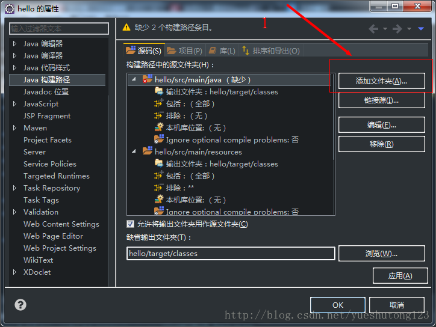
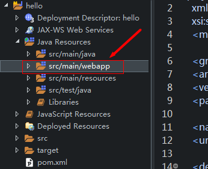
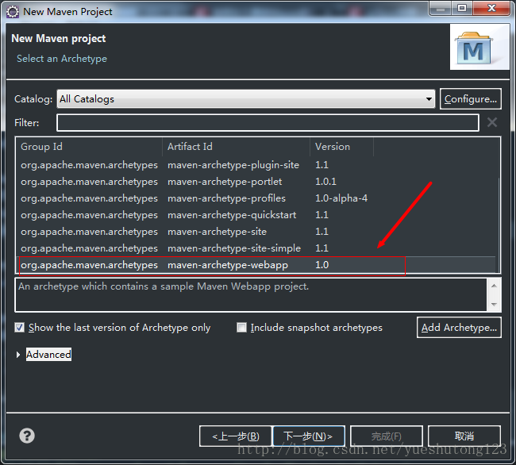
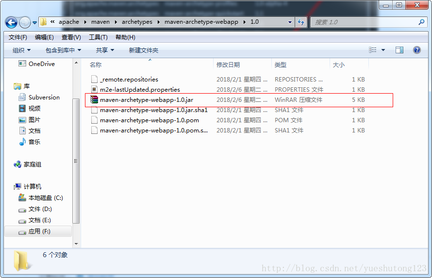
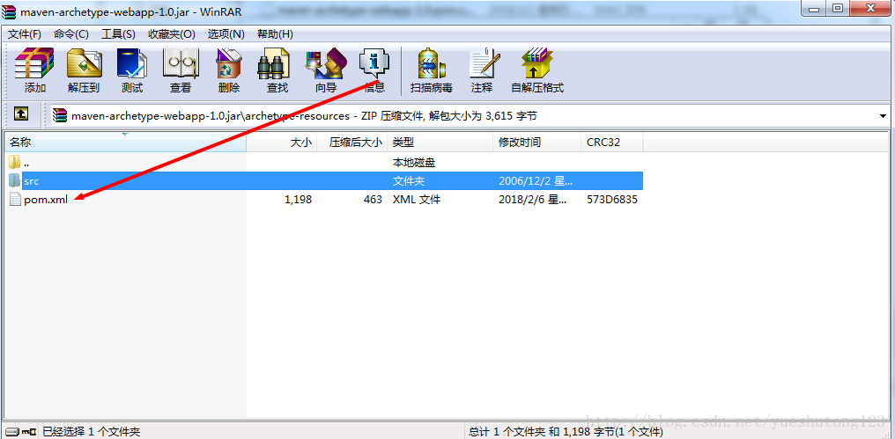
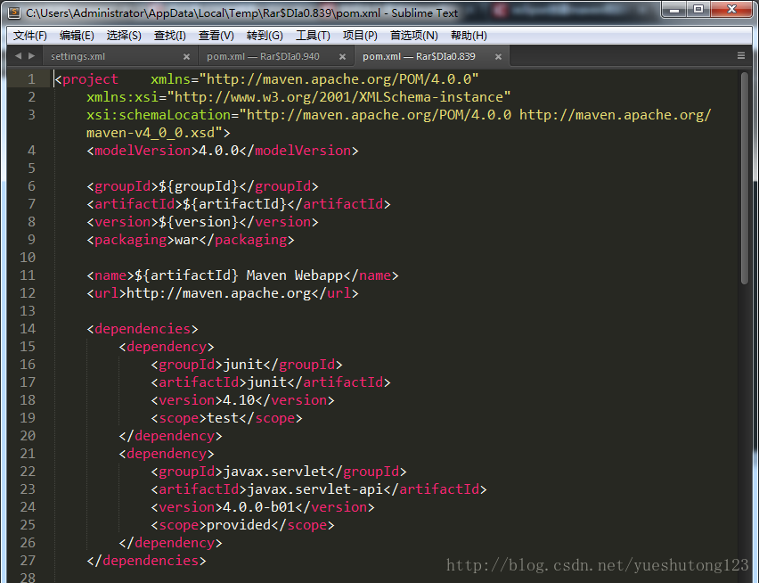
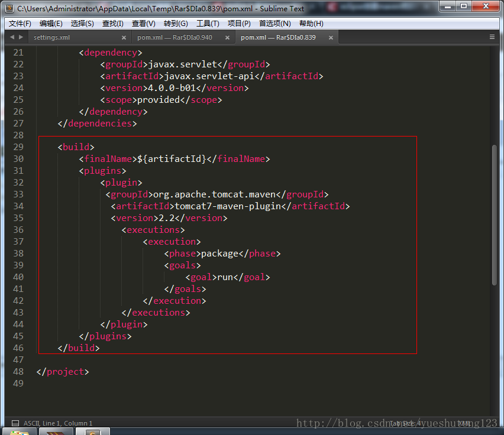
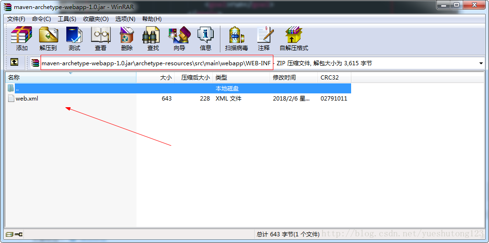
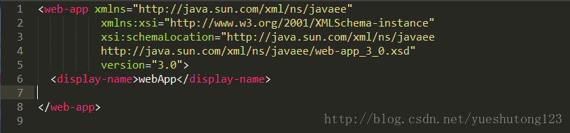
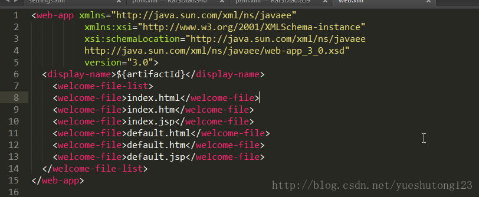

# 一：问题

在用eclipse创建一个maven project (webApp)时，我们一般会要进行许多麻烦的配置，比如

1.更改Java jdk版本为1.7或1.8（默认1.5）

2.补全src/main/java, src/main/resources, src/test/java, src/test/resources, 这四个目录（默认只有src/main/resources）

3.更改Dynamic Web Project的版本为3.0或3.1 (默认2.3)

4.配置pom.xml文件（默认只有junit还是3.X）

# 二：解决

1.对于第一个问题可以在我们的用户配置settings.xml里配置下述代码，机器上的jdk是多少就写多少。

```xml
<profile>
   <id>jdk-1.8</id>

   <activation>
   	<activeByDefault>true</activeByDefault>
     <jdk>1.8</jdk>
   </activation>

   <properties>  
  	 <maven.compiler.source>1.8</maven.compiler.source> 
  	 <maven.compiler.target>1.8</maven.compiler.target> 
  	 <maven.compiler.compilerVersion>1.8</maven.compiler.compilerVersion>  
  </properties> 

 </profile>
```

2.第二个问题博主没有想到太好的解决办法，网上有作者推荐了一种不太健全的方法，如下：

右击项目构建路径build path:





显而易见，这种方法为我们多建立了一个源文件夹，我们移除，然后增加没有的src/test/resources源文件夹。

# 三：创新

上面两种方法百度谷歌都是可以搜到一大堆的，对于后面两个问题，笔者百度了好久都没有找到，

网络上广为流传的解决方案，也都是新建项目后再在项目上进行更改，治标不治本。

于是笔者想到了修改maven底层文件更改默认配置的思路：

maven的底层文件这么多，我们如何得知该修改哪一个呢？看下面这幅图：



没错，我们的maven模板就来源于这个！然后我们在maven的本地仓库中搜索，找到了具有相同名称的jar包：



我们打开这个压缩包，查看到目录为：



打开pom.xml发现，这正是我们需要的默认模板。默认的模板排版既不简洁也缺少我们的默认servlet API和tomcat容器（或jetty），我们更改一下：





这样看起来是不是美观了，而且每次新建项目也不需要我们再重复再做相同的工作。

这样就解决了第四个问题，那第三个如何解决呢？简单！我们找到



web.xml，更改里面的默认代码为：



保存后，新建项目，我们发现默认的Dynamic Web Project的版本变成3.0，证明思路是可行的。

我们发现还有一个问题，就是display-name属性值是固定的，我们不用maven的时候都是和项目名称一模一样的，那我们如何配置？有办法！我们找到上面的pom.xml发现里面使用了EL表达式，

```xml
	<groupId>${groupId}</groupId>
	<artifactId>${artifactId}</artifactId>
	<version>${version}</version>
	<packaging>war</packaging>
```

我们可以尝试借鉴这段代码，在web.xml中使用！上图：



保存，新建项目！我们惊喜的发现项目名称已经实现自动配置，说明我们的思路是正确！

# 四：结束

工欲善其事必先利其器

如果觉得配置麻烦可以直接下载笔者配置好的jar包，直接替换使用

下载地址：[点击打开链接](http://download.csdn.net/download/yueshutong123/10243745)