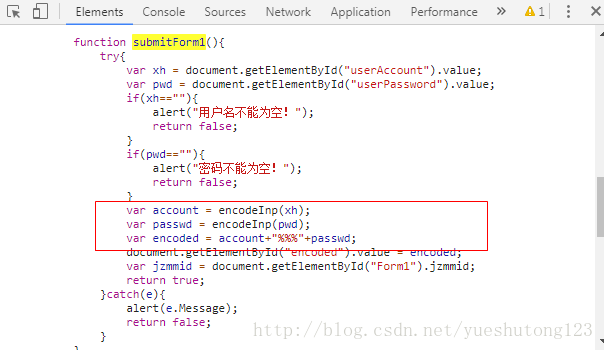

# 一：背景

> 在模拟登录某网站时遇到了用户名和密码被JS进行加密提交的问题，如图：

---



---

# 二：解决方法

> 1.我们首先需要获得该JS加密函数，一般如下：

conwork.js

```javascript
var keyStr = "ABCDEFGHIJKLMNOPQRSTUVWXYZabcdefghijklmnopqrstuvwxyz0123456789+/=";

function encodeInp(input) {
    var output = "";
    var chr1, chr2, chr3 = "";
    var enc1, enc2, enc3, enc4 = "";
    var i = 0;
    do {
        chr1 = input.charCodeAt(i++);
        chr2 = input.charCodeAt(i++);
        chr3 = input.charCodeAt(i++);
        enc1 = chr1 >> 2;
        enc2 = ((chr1 & 3) << 4) | (chr2 >> 4);
        enc3 = ((chr2 & 15) << 2) | (chr3 >> 6);
        enc4 = chr3 & 63;
        if (isNaN(chr2)) {
            enc3 = enc4 = 64
        } else if (isNaN(chr3)) {
            enc4 = 64
        }
        output = output + keyStr.charAt(enc1) + keyStr.charAt(enc2) + keyStr.charAt(enc3) + keyStr.charAt(enc4);
        chr1 = chr2 = chr3 = "";
        enc1 = enc2 = enc3 = enc4 = ""
    } while (i < input.length);
    return output
}
```

> 2.新建一个接口，内部实现和JS函数名相同的抽象方法：

Methods.java

```java
public interface Methods {
    public String encodeInp(String input);
}
```

> 3.Java执行JavaScript函数破解加密算法

```java
    /**
     *  Java执行JavaScript脚本破解加密算法
     * @param str
     * @return 加密后的字符串
     */
    public String playJs(String str) {
        // 创建一个脚本引擎管理器
        ScriptEngineManager manager = new ScriptEngineManager();
        // 获取一个指定的名称的脚本引擎
        ScriptEngine engine = manager.getEngineByName("js");
        try {
            // 获取当前类的所在目录的路径（%20是处理空格）
            String path = JsoupCookie.class.getResource("/").getPath().replaceAll("%20", " ");
            // FileReader的参数为所要执行的js文件的路径（对空格进行处理）
            engine.eval(new FileReader(path + "conwork.js"));
            if (engine instanceof Invocable) {
                Invocable invocable = (Invocable) engine;
                // 从脚本引擎中返回一个给定接口的实现
                Methods executeMethod = invocable.getInterface(Methods.class);
                // 执行指定的js方法
                return executeMethod.encodeInp(str);
            }
        } catch (Exception e) {
            // e.printStackTrace();
        }
        return null;
    }
```

>注意：Js文件在实例中默认保存在项目源文件夹下

