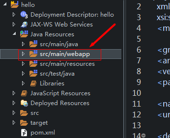

### 一：基本步骤

1. 新建Maven项目，导入相关**依赖**（推荐）
2. 在WEB-INF的**web.xml**中进行配置   &mdash;&mdash;&mdash;&mdash;&ndash;*Hibernate配置* &mdash;&mdash;&mdash;&mdash;&mdash;-
3. 创建entity包，创建数据库相关**实体类**
4. 根据实体类创建****.hbm.xml**映射文件(移动到resources/mapper下)或者直接使用hibernate注解   &mdash;&mdash;&ndash;*Spring整合Hibernate配置* &mdash;&mdash;&mdash;-
5. 在resources下创建spring文件夹，新建**spring-dao.xml**，添加二者整合配置。   &mdash;&mdash;&mdash;&mdash;*Spring Service层配置*&mdash;&mdash;&mdash;&ndash;
6. 在spring文件夹下新建**spring-service.xml**，配置service层的相关bean。   &mdash;&mdash;&mdash;&mdash;&ndash;*Spring整合Struts2*&mdash;&mdash;&mdash;&mdash;&mdash;-
7. 创建.action包, 新建**Action**类
8. 在spring文件夹下创建**spring-web.xml**配置struts2的Action类
9. 在resources下新建**struts.xml**并配置action等   &mdash;&mdash;&mdash;&mdash;&ndash;&mdash;*日志记录*&mdash;&mdash;&mdash;&mdash;&mdash;-
10. 在resources下创建**log4j.properties**文件即可。

### 二：详细配置



1.新建Maven项目，导入相关依赖（推荐） 
若不使用maven：请前往[Maven官网](http://mvnrepository.com/)依次下载jar包导入）

```xml
    <properties>
        <!-- 统一源码的编码方式 -->
        <project.build.sourceEncoding>UTF-8</project.build.sourceEncoding>
        <!-- 统一各个框架版本 -->
        <spring.version>4.3.7.RELEASE</spring.version>
        <hibernate.version>4.3.10.Final</hibernate.version>
        <struts2.version>2.5.5</struts2.version>
    </properties>

    <dependencies>
        <!-- junit依赖 -->
        <dependency>
            <groupId>junit</groupId>
            <artifactId>junit</artifactId>
            <version>4.11</version>
            <scope>test</scope>
        </dependency>

        <!--补全项目依赖 -->
        <!--1.日志 java日志有:slf4j,log4j,logback,common-logging 
                slf4j:是规范/接口 
                日志实现:log4j,logback,common-logging 
                使用:slf4j+                   -->
        <dependency>
            <groupId>org.slf4j</groupId>
            <artifactId>slf4j-log4j12</artifactId>
            <version>1.7.25</version>
        </dependency>

        <!--2.数据库相关依赖 -->
        <dependency>
            <groupId>mysql</groupId>
            <artifactId>mysql-connector-java</artifactId>
            <version>5.1.35</version>
        </dependency>
        <dependency>
            <groupId>c3p0</groupId>
            <artifactId>c3p0</artifactId>
            <version>0.9.1.1</version>
        </dependency>

        <!--2.dao框架:hibernate-lib-required依赖 -->
        <dependency>
            <groupId>org.hibernate</groupId>
            <artifactId>hibernate-core</artifactId>
            <version>${hibernate.version}</version>
        </dependency>
        <!--1) hibernate-lib-jpa/包 -->
        <dependency>
            <groupId>org.hibernate</groupId>
            <artifactId>hibernate-entitymanager</artifactId>
            <version>${hibernate.version}</version>
        </dependency>

        <!--3.Servlet web相关依赖 -->
        <dependency>
            <groupId>taglibs</groupId>
            <artifactId>standard</artifactId>
            <version>1.1.2</version>
        </dependency>
        <dependency>
            <groupId>jstl</groupId>
            <artifactId>jstl</artifactId>
            <version>1.2</version>
        </dependency>
        <dependency>
            <groupId>javax.servlet</groupId>
            <artifactId>javax.servlet-api</artifactId>
            <version>3.1.0</version>
            <scope>provided</scope>
        </dependency>
　　　　 <dependency>
   　　　　　<groupId>javax.servlet.jsp</groupId>
   　　　　　<artifactId>jsp-api</artifactId>
  　　　　　 <version>2.2</version>
  　　　　　 <scope>provided</scope>
　　　　 </dependency>
        <!--4.spring依赖 -->
        <!--1)IOC依赖 -->
        <dependency>
            <groupId>org.springframework</groupId>
            <artifactId>spring-core</artifactId>
            <version>${spring.version}</version>
        </dependency>
        <dependency>
            <groupId>org.springframework</groupId>
            <artifactId>spring-context</artifactId>
            <version>${spring.version}</version>
        </dependency>
        <dependency>
            <groupId>org.springframework</groupId>
            <artifactId>spring-beans</artifactId>
            <version>${spring.version}</version>
        </dependency>
        <dependency>
            <groupId>org.springframework</groupId>
            <artifactId>spring-expression</artifactId>
            <version>${spring.version}</version>
        </dependency>
        <!--2)spring AOP依赖 -->
        <dependency>
            <groupId>org.springframework</groupId>
            <artifactId>spring-aop</artifactId>
            <version>${spring.version}</version>
        </dependency>
        <dependency>
            <groupId>org.springframework</groupId>
            <artifactId>spring-aspects</artifactId>
            <version>${spring.version}</version>
        </dependency>
        <dependency>
            <groupId>org.aopalliance</groupId>
            <artifactId>com.springsource.org.aopalliance</artifactId>
            <version>1.0.0</version>
        </dependency>
        <dependency>
            <groupId>org.aspectj</groupId>
            <artifactId>aspectjweaver</artifactId>
            <version>1.6.8</version>
        </dependency>
        <!--3)spring dao层依赖 -->
        <dependency>
            <groupId>org.springframework</groupId>
            <artifactId>spring-jdbc</artifactId>
            <version>${spring.version}</version>
        </dependency>
        <dependency>
            <groupId>org.springframework</groupId>
            <artifactId>spring-orm</artifactId>
            <version>${spring.version}</version>
        </dependency>
        <!--4)spring 事务管理 -->
        <dependency>
            <groupId>org.springframework</groupId>
            <artifactId>spring-tx</artifactId>
            <version>${spring.version}</version>
        </dependency>
        <!--5)spring web相关依赖 -->
        <dependency>
            <groupId>org.springframework</groupId>
            <artifactId>spring-web</artifactId>
            <version>${spring.version}</version>
        </dependency>
        <!--6)spring test相关依赖 -->
        <dependency>
            <groupId>org.springframework</groupId>
            <artifactId>spring-test</artifactId>
            <version>${spring.version}</version>
        </dependency>
        <!--7)spring log4j 日志记录 -->
        <dependency>
            <groupId>org.apache.log4j</groupId>
            <artifactId>com.springsource.org.apache.log4j</artifactId>
            <version>1.2.15</version>
        </dependency>
        <dependency>
            <groupId>org.apache.commons</groupId>
            <artifactId>com.springsource.org.apache.commons.logging</artifactId>
            <version>1.1.1</version>
        </dependency>

        <!--5.struts2 依赖 -->
        <dependency>
            <groupId>org.apache.struts</groupId>
            <artifactId>struts2-core</artifactId>
            <version>${struts2.version}</version>
        </dependency>
        <!--1)Struts2整合Spring -->
        <dependency>
            <groupId>org.apache.struts</groupId>
            <artifactId>struts2-spring-plugin</artifactId>
            <version>${struts2.version}</version>
        </dependency>
        <!--2)Struts2注解开发 -->
        <dependency>
            <groupId>org.apache.struts</groupId>
            <artifactId>struts2-convention-plugin</artifactId>
            <version>${struts2.version}</version>
        </dependency>
    </dependencies>
```

2.在WEB-INF的web.xml中进行配置

```xml
<web-app xmlns="http://xmlns.jcp.org/xml/ns/javaee" 
    xmlns:xsi="http://www.w3.org/2001/XMLSchema-instance"
    xsi:schemaLocation="http://xmlns.jcp.org/xml/ns/javaee 
    http://xmlns.jcp.org/xml/ns/javaee/web-app_3_1.xsd"
    version="3.1">
    <display-name>ssh</display-name>
    <welcome-file-list>
        <welcome-file>index.jsp</welcome-file>
    </welcome-file-list>

    <!-- 配置Struts2过滤器 -->
    <filter>
        <filter-name>struts2</filter-name>
        <filter-class>org.apache.struts2.dispatcher.filter.StrutsPrepareAndExecuteFilter</filter-class>
    </filter>
    <filter-mapping>
        <filter-name>struts2</filter-name>
        <url-pattern>/*</url-pattern>
    </filter-mapping>

    <!-- 配置Spring的监听器 -->
    <listener>
        <listener-class>org.springframework.web.context.ContextLoaderListener</listener-class>
    </listener>

    <!-- 指定Spring配置文件所在路径 -->
    <context-param>
        <param-name>contextConfigLocation</param-name>
        <param-value>classpath:spring/spring-*.xml</param-value>
    </context-param>
</web-app>
```

3.创建entity包，创建数据库相关实体类

```java
package cn.zyzpp.domain;

public class Product {
    private Integer pid;
    private String pname;
    private Double price;

    public Product() {
        super();
    }

    public Product(Integer pid, String pname, Double price) {
        super();
        this.pid = pid;
        this.pname = pname;
        this.price = price;
    }

    public Integer getPid() {
        return pid;
    }

    public void setPid(Integer pid) {
        this.pid = pid;
    }

    public String getPname() {
        return pname;
    }

    public void setPname(String pname) {
        this.pname = pname;
    }

    public Double getPrice() {
        return price;
    }

    public void setPrice(Double price) {
        this.price = price;
    }

    @Override
    public String toString() {
        return "pname:" + getPname() + ";price:" + getPrice();
    }

}
```

4.根据实体类创建**.hbm.xml映射文件(移动到resources/mapper下)

```xml
<?xml version="1.0"?>
<!DOCTYPE hibernate-mapping PUBLIC "-//Hibernate/Hibernate Mapping DTD 3.0//EN"
"http://hibernate.sourceforge.net/hibernate-mapping-3.0.dtd">
<!-- Generated 2018-2-21 14:13:05 by Hibernate Tools 3.5.0.Final -->
<hibernate-mapping>
    <class name="cn.zyzpp.domain.Product" table="product">
        <id name="pid" type="java.lang.Integer">    <!-- 主键 -->
            <column name="pid" />       <!-- 数据库字段 -->
            <generator class="increment" /> <!-- 主键策略:自动; assigned:手动-->
        </id>
        <property name="pname" type="java.lang.String">
            <column name="pname" />
        </property>
        <property name="price" type="java.lang.Double">
            <column name="price" />
        </property>
    </class>
</hibernate-mapping>
```

或者直接在实体类中使用注释

```java
package cn.zyzpp.domain;

import javax.persistence.Column;
import javax.persistence.Entity;
import javax.persistence.GeneratedValue;
import javax.persistence.GenerationType;
import javax.persistence.Id;
import javax.persistence.Table;

/**
 * hibernate注释演示
 */
@Entity
@Table(name = "EMPLOYEE")
public class Employee {
    @Id                             //定义主键
    @GeneratedValue(strategy=GenerationType.IDENTITY)   //主键生成策略:自动选择; mysql会自增
    @Column(name = "id")        //对应数据库字段
    private int id;
    @Column(name = "first_name")
    private String firstName;
    @Column(name = "last_name")
    private String lastName;
    @Column(name = "salary")
    private int salary;

    public Employee() {
        //@Entity规定必须有的构造方法
    }

    public Employee(String firstName, String lastName, int salary) {
        super();
        this.firstName = firstName;
        this.lastName = lastName;
        this.salary = salary;
    }

    public int getId() {
        return id;
    }

    public void setId(int id) {
        this.id = id;
    }

    public String getFirstName() {
        return firstName;
    }

    public void setFirstName(String first_name) {
        this.firstName = first_name;
    }

    public String getLastName() {
        return lastName;
    }

    public void setLastName(String last_name) {
        this.lastName = last_name;
    }

    public int getSalary() {
        return salary;
    }

    public void setSalary(int salary) {
        this.salary = salary;
    }
}
```

补充一步：新建ProductDao.java

```java
public class ProductDao extends HibernateDaoSupport {
public void saveProduct(Product product){
        System.out.println("注入sessionFactory后，可以直接调用HibernateTemplate");
this.getHibernateTemplate().save(product);
    }

}
```

5.在resources下创建spring文件夹，新建spring-dao.xml，添加二者整合配置。

```properties
/*推荐在resources下新建jdbc.properties而不是直接使用*/
jdbc.driver=com.mysql.jdbc.Driver
jdbc.url=jdbc:mysql://127.0.0.1:3306/domain?useUnicode=true&characterEncoding=utf-8
jdbc.username=root
jdbc.password=
```

```xml
<?xml version="1.0" encoding="UTF-8"?>
<beans xmlns="http://www.springframework.org/schema/beans"
     xmlns:xsi="http://www.w3.org/2001/XMLSchema-instance"
     xmlns:context="http://www.springframework.org/schema/context"
     xmlns:aop="http://www.springframework.org/schema/aop"
     xmlns:tx="http://www.springframework.org/schema/tx"
     xmlns:task="http://www.springframework.org/schema/task"
     xsi:schemaLocation="http://www.springframework.org/schema/beans
         http://www.springframework.org/schema/beans/spring-beans-3.1.xsd
         http://www.springframework.org/schema/context
         http://www.springframework.org/schema/context/spring-context-3.1.xsd
         http://www.springframework.org/schema/aop
         http://www.springframework.org/schema/aop/spring-aop-3.1.xsd
         http://www.springframework.org/schema/tx
         http://www.springframework.org/schema/tx/spring-tx-3.1.xsd
         http://www.springframework.org/schema/task
         http://www.springframework.org/schema/task/spring-task-3.1.xsd">
    <!-- Spring配置整合hibernate过程 -->
    <!-- 1:配置数据库相关参数properties的属性：${url} -->
    <context:property-placeholder location="classpath:jdbc.properties" />

    <!-- 2:数据库连接池 -->
    <bean id="dataSource" class="com.mchange.v2.c3p0.ComboPooledDataSource">
        <!-- 配置连接池属性 -->
        <property name="driverClass" value="${jdbc.driver}" />
        <property name="jdbcUrl" value="${jdbc.url}" />
        <property name="user" value="${jdbc.username}" />
        <property name="password" value="${jdbc.password}" />
        <!-- c3p0连接池的私有属性 -->
        <property name="maxPoolSize" value="30" />
        <property name="minPoolSize" value="10" />
        <!-- 关闭连接后不自动commit -->
        <property name="autoCommitOnClose" value="false" />
        <!-- 获取连接超时时间 -->
        <property name="checkoutTimeout" value="3000" />
        <!-- 当获取连接失败重试次数 -->
        <property name="acquireRetryAttempts" value="2" />
    </bean>

    <!-- 3:配置hibernate4的相关属性 -->
    <bean id="sessionFactory" class="org.springframework.orm.hibernate4.LocalSessionFactoryBean">
        <!-- 注入连接池 -->
        <property name="dataSource" ref="dataSource"></property>
        <!-- 配置Hibernate的属性 -->
        <property name="hibernateProperties">
            <props>
                <prop key="hibernate.dialect">org.hibernate.dialect.MySQLDialect</prop><!-- 方言 -->
                <prop key="hibernate.show_sql">true</prop>
                <prop key="hibernate.format_sql">true</prop>
                <prop key="hibernate.hbm2ddl.auto">update</prop><!-- 更新表结构：有表使用无表创建 -->
            </props>
        </property>
        <!-- 加载Hibernate4中的映射文件 -->
        <property name="mappingLocations">
            <list>
                <value>classpath:mapper/*.hbm.xml</value>
            </list>
        </property>
        <!-- 或者：配置实体注解扫描 -->
<!--        <property name="packagesToScan">-->
<!--            <list>-->
<!--                <value>cn.zyzpp.domain</value>-->
<!--            </list>-->
<!--        </property>-->
    </bean>

    <!-- 配置DAO的类 -->
    <bean id="productDao" class="cn.zyzpp.dao.ProductDao">
        <property name="sessionFactory" ref="sessionFactory" />
    </bean>

</beans>
```

6.在spring文件夹下新建spring-service.xml，配置service层的相关bean。

```java
package cn.zyzpp.service;

import org.springframework.transaction.annotation.Transactional;

import cn.zyzpp.dao.ProductDao;
import cn.zyzpp.domain.Product;
@Transactional
public class ProductService {
    //业务层注入Dao的类
    private ProductDao productDao;

    public void setProductDao(ProductDao productDao) {
        this.productDao = productDao;
    }
    /**
     * 业务层保存方法
     * @param product
     */
    public void save(Product product){
        System.out.println("service中的save方法执行了");
        productDao.saveProduct(product);
    }
}
```

```xml
<?xml version="1.0" encoding="UTF-8"?>
<beans xmlns="http://www.springframework.org/schema/beans"
     xmlns:xsi="http://www.w3.org/2001/XMLSchema-instance"
     xmlns:context="http://www.springframework.org/schema/context"
     xmlns:aop="http://www.springframework.org/schema/aop"
     xmlns:tx="http://www.springframework.org/schema/tx"
     xmlns:task="http://www.springframework.org/schema/task"
     xsi:schemaLocation="http://www.springframework.org/schema/beans
         http://www.springframework.org/schema/beans/spring-beans-3.1.xsd
         http://www.springframework.org/schema/context
         http://www.springframework.org/schema/context/spring-context-3.1.xsd
         http://www.springframework.org/schema/aop
         http://www.springframework.org/schema/aop/spring-aop-3.1.xsd
         http://www.springframework.org/schema/tx
         http://www.springframework.org/schema/tx/spring-tx-3.1.xsd
         http://www.springframework.org/schema/task
         http://www.springframework.org/schema/task/spring-task-3.1.xsd">

    <!-- 配置业务类 -->
    <bean id="productService" class="cn.zyzpp.service.ProductService">
        <property name="productDao" ref="productDao"></property>
    </bean>

    <!--配置事务管理器 -->
    <bean id="transactionManager"
        class="org.springframework.orm.hibernate4.HibernateTransactionManager">
        <!--注入数据库连接池 -->
        <property name="sessionFactory" ref="sessionFactory" />
    </bean>

    <!--开启注解事务 -->
    <tx:annotation-driven transaction-manager="transactionManager" />

</beans>
```

7.创建.action包, 新建Action类

```java
package cn.zyzpp.action;

import java.io.IOException;

import javax.servlet.http.HttpServletResponse;

import org.apache.struts2.ServletActionContext;

import com.opensymphony.xwork2.ActionSupport;
import com.opensymphony.xwork2.ModelDriven;

import cn.zyzpp.domain.Product;
import cn.zyzpp.service.ProductService;

public class ProductAction extends ActionSupport implements ModelDriven<Product> {

    // 模型驱动使用的类
    private Product product = new Product();

    @Override
    public Product getModel() {
        return product;
    }

    // struts2和spring整合过程按名称自动注入的业务类
    private ProductService productService;

    public void setProductService(ProductService productService) {
        this.productService = productService;
    }

    /**
     * Action响应
     * 
     * @param product
     * @return
     * @throws IOException
     */
    public String save() throws IOException {
        System.out.println("action中的save方法执行了:" + product.toString());
        productService.save(product);
        return NONE;
    }

}
```

8.在spring文件夹下创建spring-web.xml配置struts2的Action类

```xml
<?xml version="1.0" encoding="UTF-8"?>
<beans xmlns="http://www.springframework.org/schema/beans"
     xmlns:xsi="http://www.w3.org/2001/XMLSchema-instance"
     xmlns:context="http://www.springframework.org/schema/context"
     xmlns:aop="http://www.springframework.org/schema/aop"
     xmlns:tx="http://www.springframework.org/schema/tx"
     xmlns:task="http://www.springframework.org/schema/task"
     xsi:schemaLocation="http://www.springframework.org/schema/beans
         http://www.springframework.org/schema/beans/spring-beans-3.1.xsd
         http://www.springframework.org/schema/context
         http://www.springframework.org/schema/context/spring-context-3.1.xsd
         http://www.springframework.org/schema/aop
         http://www.springframework.org/schema/aop/spring-aop-3.1.xsd
         http://www.springframework.org/schema/tx
         http://www.springframework.org/schema/tx/spring-tx-3.1.xsd
         http://www.springframework.org/schema/task
         http://www.springframework.org/schema/task/spring-task-3.1.xsd">

    <!-- Spring配置Struts2的Action类 -->
    <bean id="productAction" class="cn.zyzpp.action.ProductAction" scope="prototype">
        <property name="productService" ref="productService"></property>
    </bean>

</beans>
```

9.在resources下新建struts.xml并配置action等

```xml
<?xml version="1.0" encoding="UTF-8" ?>
<!DOCTYPE struts PUBLIC
    "-//Apache Software Foundation//DTD Struts Configuration 2.5//EN"
    "http://struts.apache.org/dtds/struts-2.5.dtd">
<!--            struts2整合spring第一种方式    ：还是由struts2.xml配置action 
<struts>
    <package name="ssh" extends="struts-default" namespace="/">
        <action name="product_*" class="cn.zyzpp.action.ProductAction" method="{1}">
        </action>
    </package>
</struts>-->
<!--            struts2整合spring第二种方式    ：由spring容器管理action类 ：类路径改为id值即可-->
<struts>
    <package name="ssh" extends="struts-default" namespace="/">
        <action name="product_*" class="productAction" method="{1}">
        </action>
    </package>

        <!-- 改变action 后戳 -->
    <constant name="struts.action.extension" value=",html"></constant>

</struts>
```

10.在resources下创建log4j.properties文件即可。

```properties
log4j.rootLogger=debug, stdout
#log4j.logger.org.mybatis.example.BlogMapper=TRACE
log4j.appender.stdout=org.apache.log4j.ConsoleAppender
log4j.appender.stdout.layout=org.apache.log4j.PatternLayout
log4j.appender.stdout.layout.ConversionPattern=[%t] %-5p [%c] - %m%n
#DEBUG < INFO < WARN < ERROR <FATAL<br /><br />
```

最后，使用Tomcat的Maven插件，执行mvn tomcat:run启动项目！

```xml
<plugins>
    <plugin>
        <groupId>org.apache.tomcat.maven</groupId>
        <artifactId>tomcat7-maven-plugin</artifactId>
        <version>2.2</version>
        <configuration>
            <hostName>localhost</hostName>
            <uriEncoding>UTF-8</uriEncoding>
            <path>/</path>
            <port>8080</port>
        </configuration>
    </plugin></plugins>
```


