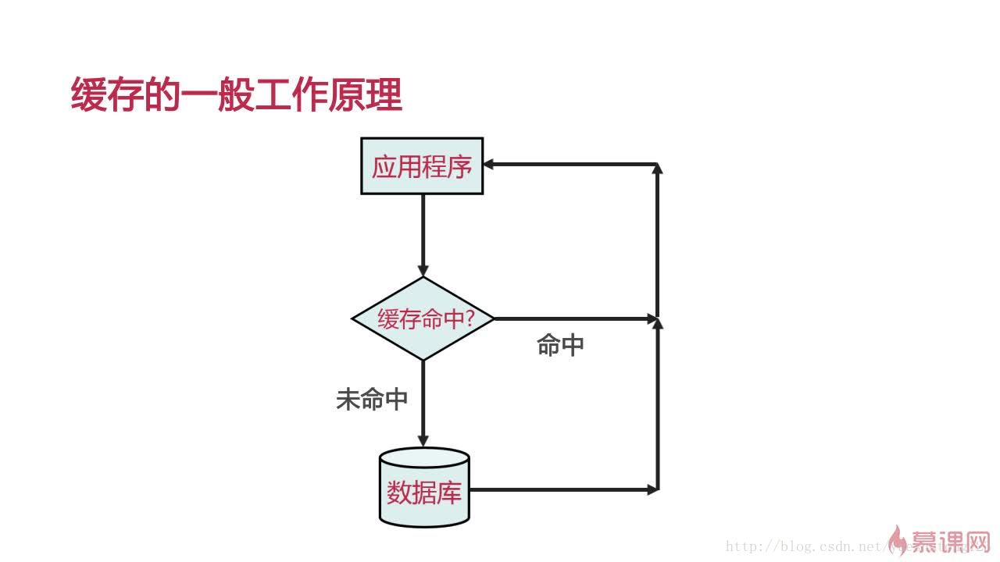
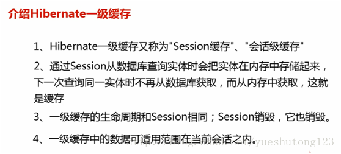
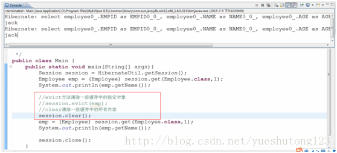
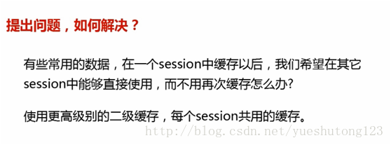
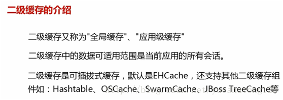
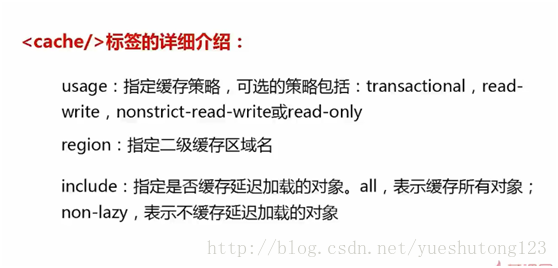
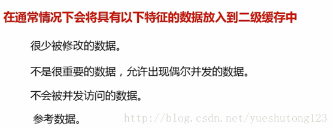
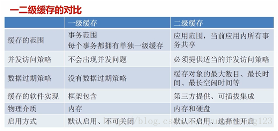
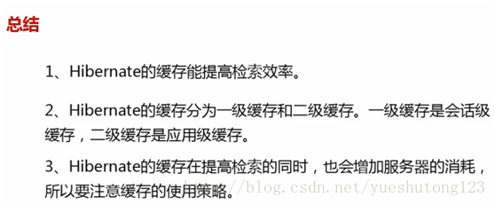

 
 
 
 
 


### 如何配置二级缓存：

##### 第一步：导入EHcache依赖

###### 1）Maven项目：

```xml
<!--此处使用hibernate4-->
<dependency>
    <groupId>org.hibernate</groupId>
     <artifactId>hibernate-ehcache</artifactId>
    <version>4.3.10.Final</version>
</dependency>
```

###### 2)普通项目：

解压下载的hibernate压缩包，找到路径：`\hibernate-release-4.3.10.Final\lib\optional\ehcache`，把路径下的包全部导入到项目

##### 第二步：在源文件夹下,创建ehcache.xml

```xml
<ehcache>
    <!-- 
        磁盘存储:将缓存中暂时不使用的对象,转移到硬盘,类似于Windows系统的虚拟内存
        path:指定在硬盘上存储对象的路径
        path可以配置的目录有：
            user.home（用户的家目录）
            user.dir（用户当前的工作目录）
            java.io.tmpdir（默认的临时目录）
            ehcache.disk.store.dir（ehcache的配置目录）
            绝对路径（如：d:\\ehcache）
        查看路径方法：String tmpDir = System.getProperty("java.io.tmpdir");  
     -->
    <diskStore path="java.io.tmpdir" />

    <!-- 
        defaultCache:默认的缓存配置信息,如果不加特殊说明,则所有对象按照此配置项处理
        maxElementsInMemory:设置了缓存的上限,最多存储多少个记录对象
        eternal:代表对象是否永不过期 (指定true则下面两项配置需为0无限期)
        timeToIdleSeconds:最大的发呆时间 /秒
        timeToLiveSeconds:最大的存活时间 /秒
        overflowToDisk:是否允许对象被写入到磁盘
        说明：下列配置自缓存建立起600秒(10分钟)有效 。
        在有效的600秒(10分钟)内，如果连续120秒(2分钟)未访问缓存，则缓存失效。
        就算有访问，也只会存活600秒。
     -->
    <defaultCache maxElementsInMemory="10000" eternal="false"
        timeToIdleSeconds="120" timeToLiveSeconds="600" overflowToDisk="true" />

    <!-- (此处为非必需的配置，对应第四步)
        cache:为指定名称的对象进行缓存的特殊配置
        name:指定对象的完整名
     -->
    <cache 
        name="StudentCache" 
        maxElementsInMemory="10000" 
        eternal="false"
        timeToIdleSeconds="300" 
        timeToLiveSeconds="600" 
        overflowToDisk="true" 
        />
</ehcache>
```

##### 第三步：在hibernate.cfg.xml中配置

```xml
     <!-- 配置二级缓存 -->
     <!-- hibernate4以前的版本 配置缓存的提供类-->
     <!-- <property name="hibernate.cache.provider_class">net.sf.ehcache.hibernate.SingletonEhCacheProvider</property> -->
     <!--hibernate4以后版本二级缓存的提供类-->
    <property name="hibernate.cache.region.factory_class">org.hibernate.cache.ehcache.EhCacheRegionFactory</property>
```

如果是Spring+Hibernate，需要在spring.xml中

```xml
<bean id="sessionFactory" class="org.springframework.orm.hibernate4.LocalSessionFactoryBean">
<property name="hibernateProperties">
    <props>
        <prop key="hibernate.dialect">org.hibernate.dialect.MySQLDialect</prop><!-- 方言 -->
        <prop key="hibernate.show_sql">true</prop>
        <prop key="hibernate.format_sql">true</prop>
        <prop key="hibernate.hbm2ddl.auto">update</prop><!-- 更新表结构：有表使用无表创建 -->
        <!-- 开启二级缓存 -->  
        <prop key="hibernate.cache.use_second_level_cache">true</prop>  
        <!-- 启用查询缓存 -->  
        <prop key="hibernate.cache.use_query_cache">true</prop>  
        <!-- 配置二级缓存提供商 -->  
        <prop key="hibernate.cache.region.factory_class">org.hibernate.cache.ehcache.EhCacheRegionFactory</prop>  
        <!-- 加载缓存所需配置文件 -->  
        <prop key="hibernate.net.sf.ehcache.configurationResourceName">classpath:ehcache.xml</prop>
    </props>
</property>
...
</bean>
```

##### 第四步：在需要缓存的对象中开启

```xml
<?xml version="1.0"?>
<!DOCTYPE hibernate-mapping PUBLIC "-//Hibernate/Hibernate Mapping DTD 3.0//EN"
"http://hibernate.sourceforge.net/hibernate-mapping-3.0.dtd">
<!-- Generated 2017-9-24 20:49:54 by Hibernate Tools 3.5.0.Final -->
<hibernate-mapping>
    <class name="com.zyzpp.hibernate.Students" table="students">
        <!-- 开启Ehcache缓存 -->
        <!-- usage:缓存策略      
             region:指定缓存配置(需单独在ehcache.xml配置)
             include:是否缓存延迟加载的对象(如name,sex,number) 
        -->
        <cache usage="read-only" include="all" region="StudentCache"/>

        <id name="id" type="int">
            <column name="id" />
            <generator class="native" />
        </id>
        <property name="name" type="java.lang.String">
            <column name="name" />
        </property>
        <property name="sex" type="java.lang.String">
            <column name="sex" />
        </property>
        <property name="number" type="int">
            <column name="number" />
        </property>
    </class>
</hibernate-mapping>
```

若是使用hibernate注解：`@Cache(usage =CacheConcurrencyStrategy.READ_ONLY)`

```java
@Entity
@Table(name = "EMPLOYEE")
@Cache(usage =CacheConcurrencyStrategy.READ_ONLY,include="all", region="")  //开启缓存
public class Employee {
    @Id                             //定义主键
    @GeneratedValue(strategy=GenerationType.IDENTITY)   //主键生成策略:自动选择mysql自增
    @Column(name = "id")                        //对应数据库字段
    private int id;
    @Column(name = "first_name")
    private String firstName;
    @Column(name = "last_name")
    private String lastName;
    @Column(name = "salary")
    private int salary;

    public Employee() {
        //@Entity规定必须有的构造方法
    }
    //....getter
    //....setter
}
```

 
 
 
