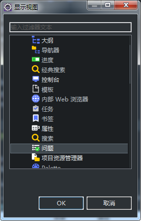
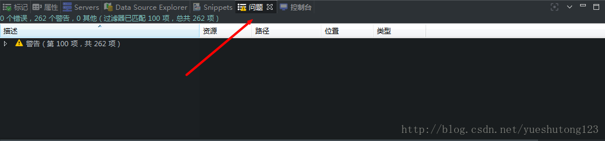

###### Maven报错Archive for required library:某.jar’ in project ‘项目名’cannot be read or is not a valid ZIP file

#### 报错信息：项目出现红色叉号

#### 报错原因：maven自动下载的依赖包错误

#### 解决方法：eclipse顶部–>窗口–>显示视图–>其他–>问题

#### 出现这个视图后，查看错误提示信息，找到错误文件路径，手动删除即可。

