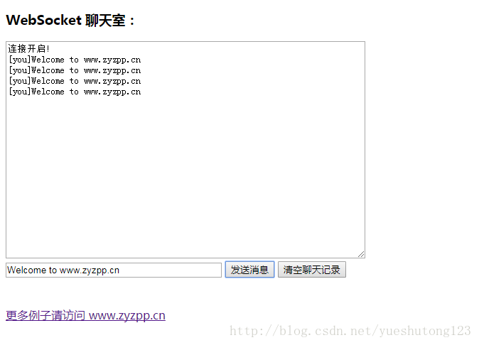

#### 一：简介

>*  Netty 是一个提供 asynchronous event-driven （异步事件驱动）的网络应用框架，是一个用以快速开发高性能、高可靠性协议的服务器和客户端。
>*  换句话说，Netty 是一个 NIO 客户端服务器框架，使用它可以快速简单地开发网络应用程序，比如服务器和客户端的协议。Netty 大大简化了网络程序的开发过程比如 TCP 和 UDP 的 socket 服务的开发。
>*  下载地址：[http://netty.io/downloads.html](http://netty.io/downloads.html)

#### 二：实例

**1.自定义配置类**

```java
import io.netty.channel.group.ChannelGroup;
import io.netty.channel.group.DefaultChannelGroup;
import io.netty.util.concurrent.GlobalEventExecutor;

/**
* Created by 巅峰小学生
* 2018年3月3日 下午9:51:27
*/
public class NettyConfig {

    /**
     * 储存每一个客户端接入进来时的channel对象
     */
    public static ChannelGroup group = new DefaultChannelGroup(GlobalEventExecutor.INSTANCE);
    /**
     * 服务器端口号
     */
    public static final int port = 8888;
    /**
     * WebSocket地址
     */
    public static final String WEB_SOCKET_URL="ws://localhost:"+port+"/websocket";

}
```

**2.接受/处理/响应webSocket请求的核心业务处理类**

```java
import io.netty.buffer.ByteBuf;
import io.netty.buffer.Unpooled;
import io.netty.channel.Channel;
import io.netty.channel.ChannelFuture;
import io.netty.channel.ChannelFutureListener;
import io.netty.channel.ChannelHandlerContext;
import io.netty.channel.SimpleChannelInboundHandler;
import io.netty.handler.codec.http.DefaultFullHttpResponse;
import io.netty.handler.codec.http.FullHttpRequest;
import io.netty.handler.codec.http.HttpResponseStatus;
import io.netty.handler.codec.http.HttpVersion;
import io.netty.handler.codec.http.websocketx.CloseWebSocketFrame;
import io.netty.handler.codec.http.websocketx.PingWebSocketFrame;
import io.netty.handler.codec.http.websocketx.PongWebSocketFrame;
import io.netty.handler.codec.http.websocketx.TextWebSocketFrame;
import io.netty.handler.codec.http.websocketx.WebSocketFrame;
import io.netty.handler.codec.http.websocketx.WebSocketServerHandshaker;
import io.netty.handler.codec.http.websocketx.WebSocketServerHandshakerFactory;
import io.netty.util.CharsetUtil;

/**
 * Created by 巅峰小学生 
 * 2018年3月3日 下午10:00:52
 * 
 * 接受/处理/响应webSocket请求的核心业务处理类
 */
public class MyWebSocketHandler extends SimpleChannelInboundHandler<Object> {

    private WebSocketServerHandshaker handshaker;

    /**
     * 每当从服务端收到新的客户端连接时， 客户端的 Channel 存入ChannelGroup列表中， 
     * 并通知列表中的其他客户端 Channel
     */
    @Override
    public void handlerAdded(ChannelHandlerContext ctx) throws Exception { // (2)
        Channel incoming = ctx.channel();
        for (Channel channel : NettyConfig.group) {
            channel.writeAndFlush("[SERVER] - " + incoming.remoteAddress() + " 加入\n");
        }
        NettyConfig.group.add(ctx.channel());
    }

    /*
     * 每当从服务端收到客户端断开时，客户端的 Channel 移除 ChannelGroup 列表中，
     *  并通知列表中的其他客户端 Channel
     */
    @Override
    public void handlerRemoved(ChannelHandlerContext ctx) throws Exception {
        Channel incoming = ctx.channel();
        for (Channel channel : NettyConfig.group) {
            channel.writeAndFlush("[SERVER] - " + incoming.remoteAddress() + " 离开\n");
        }
        NettyConfig.group.remove(ctx.channel());
    }

    /**
     * 服务端监听到客户端活动
     */
    @Override
    public void channelActive(ChannelHandlerContext ctx) throws Exception {
        Channel incoming = ctx.channel();
        System.out.println("Client:" + incoming.remoteAddress() + "在线");
    }

    /*
     * 客户端与服务端断开连接的时候调用
     */
    @Override
    public void channelInactive(ChannelHandlerContext ctx) throws Exception {
        Channel incoming = ctx.channel();
        System.out.println("Client:" + incoming.remoteAddress() + "掉线");
    }

    /**
     * 服务端接收客户端发送过来的数据结束之后调用
     */
    @Override
    public void channelReadComplete(ChannelHandlerContext ctx) throws Exception {
        ctx.flush();
    }

    /**
     * 当出现 Throwable 对象才会被调用，即当 Netty 由于 IO 错误或者处理器在处理事件时抛出的异常时。
     * 在大部分情况下，捕获的异常应该被记录下来并且把关联的 channel 给关闭掉。
     */
    @Override
    public void exceptionCaught(ChannelHandlerContext ctx, Throwable cause) throws Exception {
        Channel incoming = ctx.channel();
        System.out.println("Client:" + incoming.remoteAddress() + "异常");
        cause.printStackTrace();
        ctx.close();
    }

    /**
     * 服务端处理客户端webSocket请求的核心方法。
     * 
     * 如果你使用的是 Netty 5.x 版本时，需要把 channelRead0() 重命名为messageReceived()
     */
    @Override
    protected void channelRead0(ChannelHandlerContext context, Object msg) throws Exception {
        // 处理客户端向服务端发起http握手请求的业务
        if (msg instanceof FullHttpRequest) {
            handHttpRequest(context, (FullHttpRequest) msg);
        } else if (msg instanceof WebSocketFrame) {// 处理websocket连接业务
            handWebSocketFrame(context, (WebSocketFrame) msg);
        }
    }

    // -----------重写方法结束-------------

    /**
     * 处理客户端与服务端之前的websocket业务
     * 
     * @param ctx
     * @param frame
     */
    private void handWebSocketFrame(ChannelHandlerContext ctx, WebSocketFrame frame) {
        // 判断是否是关闭webSocket的指令
        if (frame instanceof CloseWebSocketFrame) {
            handshaker.close(ctx.channel(), (CloseWebSocketFrame) frame.retain());
        }
        // 判断是否ping消息
        if (frame instanceof PingWebSocketFrame) {
            ctx.channel().write(new PongWebSocketFrame(frame.content().retain()));
            return;
        }
        // 每当从服务端读到客户端写入信息时，将信息转发给其他客户端的 Channel
        if (frame instanceof TextWebSocketFrame) {
            TextWebSocketFrame msg = (TextWebSocketFrame) frame;
            Channel incoming = ctx.channel();
            for (Channel channel : NettyConfig.group) {
                if (channel != incoming) {
                    channel.writeAndFlush(new TextWebSocketFrame("[" + incoming.remoteAddress() + "]" + msg.text()));
                } else {
                    channel.writeAndFlush(new TextWebSocketFrame("[you]" + msg.text()));
                }
            }
        }
        // 群发消息
        // NettyConfig.group.writeAndFlush(tws);
    }

    /**
     * 处理客户端向服务端发起http握手请求的业务
     * 
     * @param ctx
     * @param req
     */
    @SuppressWarnings("deprecation")
    private void handHttpRequest(ChannelHandlerContext ctx, FullHttpRequest req) {
        if (!req.getDecoderResult().isSuccess() || !("websocket".equals(req.headers().get("Upgrade")))) {
            sendHttpResponse(ctx, req,
                    new DefaultFullHttpResponse(HttpVersion.HTTP_1_1, HttpResponseStatus.BAD_REQUEST));
            return;
        }
        WebSocketServerHandshakerFactory wsFactory = new WebSocketServerHandshakerFactory(NettyConfig.WEB_SOCKET_URL,
                null, false);
        handshaker = wsFactory.newHandshaker(req);
        if (handshaker == null) {
            WebSocketServerHandshakerFactory.sendUnsupportedWebSocketVersionResponse(ctx.channel());
        } else {
            handshaker.handshake(ctx.channel(), req);
        }
    }

    /**
     * 服务端向客户端响应消息
     * 
     * @param ctx
     * @param req
     * @param res
     */
    @SuppressWarnings("deprecation")
    private void sendHttpResponse(ChannelHandlerContext ctx, FullHttpRequest req, DefaultFullHttpResponse res) {
        if (res.getStatus().code() != 200) {
            ByteBuf buf = Unpooled.copiedBuffer(res.getStatus().toString(), CharsetUtil.UTF_8);
            res.content().writeBytes(buf);
            buf.release();
        }
        // 服务端向客户端发送数据
        ChannelFuture f = ctx.channel().writeAndFlush(res);
        if (res.getStatus().code() != 200) {
            f.addListener(ChannelFutureListener.CLOSE);
        }
    }

}
```

**3.初始化连接时候的各个组件**

```javascript
import io.netty.channel.ChannelInitializer;
import io.netty.channel.socket.SocketChannel;
import io.netty.handler.codec.http.HttpObjectAggregator;
import io.netty.handler.codec.http.HttpServerCodec;
import io.netty.handler.stream.ChunkedWriteHandler;

/**
* Created by 巅峰小学生
* 2018年3月4日 下午12:15:13
* 
* 初始化连接时候的各个组件
*/
public class MyWebSocketChannelHandler extends ChannelInitializer<SocketChannel> {

    @Override
    protected void initChannel(SocketChannel ch) throws Exception {
        ch.pipeline().addLast("http-codec", new HttpServerCodec());
        ch.pipeline().addLast("aggregator", new HttpObjectAggregator(65536));
        ch.pipeline().addLast("http-chunket", new ChunkedWriteHandler());
        ch.pipeline().addLast("handler", new MyWebSocketHandler());
    }

}
```

**4.程序启动入口**

```java
import io.netty.bootstrap.ServerBootstrap;
import io.netty.channel.Channel;
import io.netty.channel.EventLoopGroup;
import io.netty.channel.nio.NioEventLoopGroup;
import io.netty.channel.socket.nio.NioServerSocketChannel;

/**
 * Created by 巅峰小学生
 *  2018年3月4日
 *  
 *  程序入口 负责启动程序
*/
public class Main {

    public static void main(String[] args) {
        EventLoopGroup bossGroup = new NioEventLoopGroup();
        EventLoopGroup workGroup = new NioEventLoopGroup();
        try{
            ServerBootstrap b = new ServerBootstrap();
            b.group(bossGroup, workGroup);
            b.channel(NioServerSocketChannel.class);
            b.childHandler(new MyWebSocketChannelHandler());
            System.out.println("服务端开启等待客户端连接...");
            Channel ch = b.bind(NettyConfig.port).sync().channel();
            ch.closeFuture().sync();
        }catch(Exception e){
            e.printStackTrace();
        }finally{
            //优雅的退出程序
            bossGroup.shutdownGracefully();
            workGroup.shutdownGracefully();
        }
    }

}
```

**5.html聊天室页面**

```html
<!DOCTYPE html>
<html>
<head>
<meta charset="UTF-8">
<title>WebSocket Chat</title>
</head>
<body>
    <script type="text/javascript">
        var socket;
        if (!window.WebSocket) {
            window.WebSocket = window.MozWebSocket;
        }
        if (window.WebSocket) {
            socket = new WebSocket("ws://localhost:8888/websocket");
            socket.onmessage = function(event) {
                var ta = document.getElementById('responseText');
                ta.value = ta.value + '\n' + event.data
            };
            socket.onopen = function(event) {
                var ta = document.getElementById('responseText');
                ta.value = "连接开启!";
            };
            socket.onclose = function(event) {
                var ta = document.getElementById('responseText');
                ta.value = ta.value + "连接被关闭";
            };
        } else {
            alert("你的浏览器不支持 WebSocket！");
        }
        function send(message) {
            if (!window.WebSocket) {
                return;
            }
            if (socket.readyState == WebSocket.OPEN) {
                socket.send(message);
            } else {
                alert("连接没有开启.");
            }
        }
</script>
    <form onsubmit="return false;">
        <h3>WebSocket 聊天室：</h3>
        <textarea id="responseText" style="width: 500px; height: 300px;"></textarea>
        <br> <input type="text" name="message" style="width: 300px"
            value="Welcome to www.zyzpp.cn"> <input type="button"
            value="发送消息" onclick="send(this.form.message.value)"> <input
            type="button"
            onclick="javascript:document.getElementById('responseText').value=''"
            value="清空聊天记录">
    </form>
    <br>
    <br>
    <a href="http://www.zyzpp.cn/">更多例子请访问 www.zyzpp.cn</a>
</body>
</html>
```



#### 三：扩展

>*  如何在让很多客户机进行聊天呢？
>*  比如：电脑版QQ。
>*  请阅读：Netty入门（二）之PC聊天室


