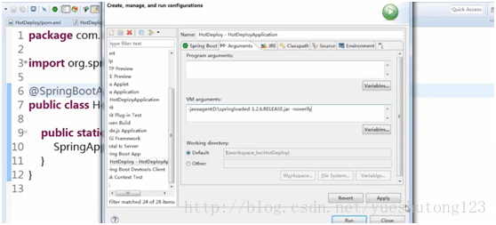

# 一：热部署的实现

>*  1.使用Spring-boot-devtools
>*  2.使用Spring Loaded

---

# 二：devtools（推荐）

一般情况下直接在pom.xml文件添加下面的依赖即可，但eclipse和IDEA有时也会造成影响。

```javascript
<!-- 热部署 -->
<dependency>
    <groupId>org.springframework.boot</groupId>
    <artifactId>spring-boot-devtools</artifactId>
    <optional>true</optional>
</dependency>
```

如下配置，可有可无：

```properties
#热部署生效
spring.devtools.restart.enabled=true
#设置重启的目录,添加那个目录的文件需要restart
spring.devtools.restart.additional-paths=src/main/java
# 为mybatis设置，生产环境可删除
restart.include.mapper=/mapper-[%%w-%%.]+jar
restart.include.pagehelper=/pagehelper-[%%w-%%.]+jar
#排除那个目录的文件不需要restart
#spring.devtools.restart.exclude=static/**,public/**
#classpath目录下的WEB-INF文件夹内容修改不重启
#spring.devtools.restart.exclude=WEB-INF/**
```

---

# 三：Spring Loaded

1.Maven启动方式,添加依赖

```xml
<dependency>
    <groupId>org.springframework</groupId>
    <artifactId>springloaded</artifactId>
    <veision>1.2.6.RELEASE</version>
</dependency>
```

需要以maven方式启动 
执行mvn spring-boot:run命令

2.run as - Java application

需要下载该Jar包，右击运行配置

