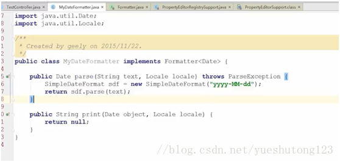
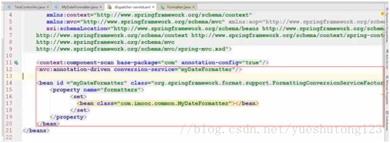
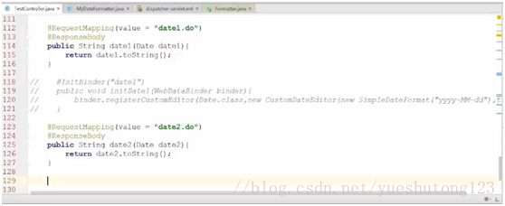
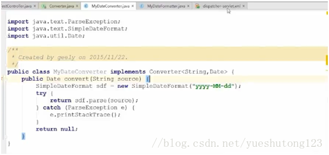
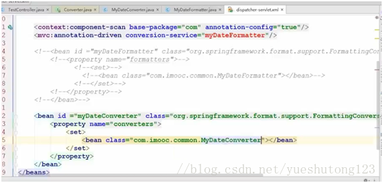

# 1.基本类型

**基本类型参数不可为空** 
正例：[http://localhost:8080/demo/he?id=2](http://localhost:8080/demo/he?id2) 
反例：[http://localhost:8080/demo/he?id=](http://localhost:8080/demo/he?id)（报400错误） 
注意：String不是基本类型，具体参考>[Java数据类型](http://blog.csdn.net/ta1bin1/article/details/53666163)

```java
@RestController //定义控制器返回字符串
public class HelloController {

    @RequestMapping(value = "/hello", method = RequestMethod.GET)
    public String printHello(int id) {
        return "Response:"+id;
    }

    //添加@RequestParam(required=false)参数可为空
    @RequestMapping(value = "/hello", method = RequestMethod.GET)
    public String printHello(@RequestParam(required=false)int id) {
        return "Response:"+id;
    }

}
```

# 2.包装类和数组的处理

```java
@RestController 
public class HelloController {

    // http://localhost:8080/demo/hello?id=1
    @RequestMapping(value = "/hello", method = RequestMethod.GET)
    public String printHello(Integer id) {
        return "Response:"+id;
    }

    // http://localhost:8080/demo/hi?name=Tom&name=Jim
    @RequestMapping(value = "/hi", method = RequestMethod.GET)
    public String printHello(String[] name) {
        return "Response:"+anme;
    }

}
```

# 3.简单对象&多层级对象&同属性对象

```java
    //简单对象
    //http://127.0.0.1:8080/Spring/hi?age=10&name=Tom
    @RequestMapping(value="/hi", method = RequestMethod.GET)    
    @ResponseBody
    public String object(Student student){
        return student.toString();
    }

    //多层级对象
    //http://127.0.0.1:8080/Spring/hi2?age=10&name=Tom&student.age=18
    @RequestMapping(value="/hi2", method = RequestMethod.GET)   
    @ResponseBody
    public String object2(Admin admin){
        return admin.toString();
    }

    //同属性的多对象
    //http://127.0.0.1:8080/Spring/hi3?name=Tom&student.age=18
    @RequestMapping(value="/hi3", method = RequestMethod.GET)   
    @ResponseBody
    public String object3(Student student, Admin admin){
        return student.toString()+admin.toString();
    }

    //同属性的多对象赋值 需指定对象的前缀
    @InitBinder("student")
    public void initStudent(WebDataBinder binder){
        binder.setFieldDefaultPrefix("student.");
    }

    //同属性的多对象赋值 需指定对象的前缀
    @InitBinder("admin")
    public void initStudent2(WebDataBinder binder){
        binder.setFieldDefaultPrefix("admin.");
    }
```

# 4.List&Set&Map

```java
public class ListFrom {
    private List<Student> users ;

    // getter setter...

    @Override
    public String toString() {
        return "ListFrom [users=" + users + "]";
    }

}
```

```java
public class MapFrom {
    private Map<String, Student> users ;

    // getter setter...

    @Override
    public String toString() {
        return "MapFrom [users=" + users + "]";
    }   

}
```

```java
@RestController
public class DataController {

    //List对象
    //http://127.0.0.1:8080/Spring/list?users[0].age=10&users[1].name=Tom
    @RequestMapping(value="/list", method = RequestMethod.GET, produces={"text/html;charset=UTF-8"})    //支持中文
    public String object2(ListFrom s){
        return s.toString();
    }

    //Map对象
    //http://127.0.0.1:8080/Spring/map?users["X"].age=10&users["Y"].name=Tom
    @RequestMapping(value="/map", method = RequestMethod.GET)   
    public String object3(MapFrom s){
        return s.toString();
    }
}
```

# 5.Json或Xml 数据参数

###### `@RequestBody 注解`

```java
    //发送json数据到该url即可实现数据绑定
    @RequestMapping(value="/json", method = RequestMethod.POST) 
    public String object3(@RequestBody Student s){
        return s.toString();
    }
```

对于xml数据，需要在实体类中添加注释

```java
@XmlRootElement(name = "admin")
public class Admin {
private String name;
private Integer age;

    @XmlElement(name = "name")
public String getName() {
return name;
    }
public void setName(String name) {
this.name = name;
    }

    @XmlElement(name = "age")
public Integer getAge() {
return age;
    }
public void setAge(Integer age) {
this.age = age;
    }
}
```

然后

```java
    //发送xml数据到该url即可实现数据绑定
    @RequestMapping(value="/xml", method = RequestMethod.POST)  
    public String object3(@RequestBody Admin s){
        return s.toString();
    }
```

# 6. PropertyEditor、Formatter、Converter

局部配置

```java
    //PropertyEditor
    //http://127.0.0.1:8080/Spring_iMooc/date1?date1=2018-01-01
    @RequestMapping(value="/date1", method = RequestMethod.GET) 
    public String date1(Date date1){
        return date1.toString();
    }
    @InitBinder("date1")
    public void initDate1(WebDataBinder binder){
        binder.registerCustomEditor(Date.class, new CustomDateEditor(new SimpleDateFormat("yyyy-MM-dd"), true));
    }
```

全局配置 


1）自定义Formatter 


2）注入 


3）使用 


也可以使用自定义Converter 

1）自定义 


2）配置 


3）使用

# 7.RESTful扩展

简单来说，就是把参数移到URL上，比如下面。

```
https://docs.spring.io/spring-boot/docs/1.5.10.RELEASE/reference/pdf/spring-boot-reference.pdf<br />　 http://jbk.39.net/xebm/
```

使用方法

```
@RequestMapping("/subject/{name}")<br />public String demo(@PathVariable("name") String name){<br />　　return name;<br />}<br />
```

路径URL也支持通配符匹配


|||
|---|---|
|通配符|描述|
|?|匹配任何单字符|
|*|匹配0或者任意数量的字符|
|**|匹配0或者更多的目录|

