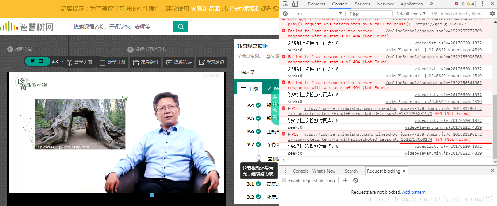
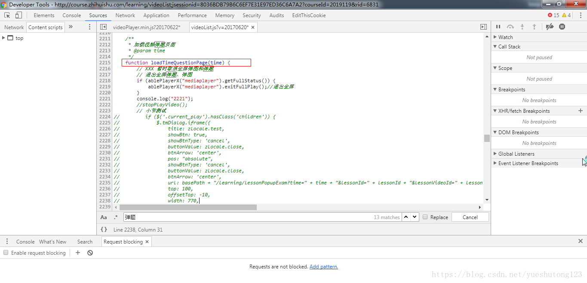
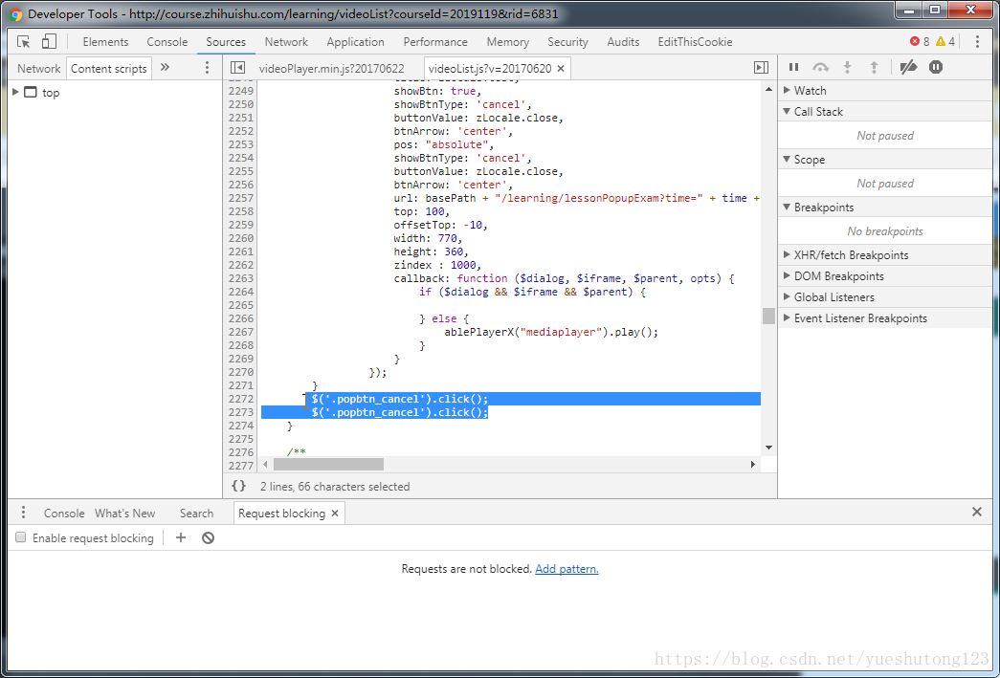
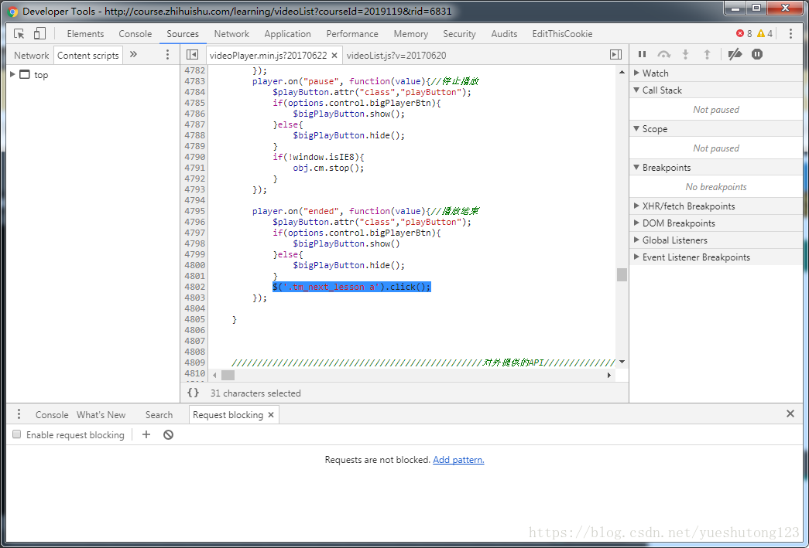

>*  破解思路：分析网页js函数，用代码模拟鼠标点击事件。

#### 分析过程

打开谷歌开发者工具，打开console，我们发现有两个log打印 

打开对应的两个js文件，我们分析可以看到，videoList.js应该是智慧树页面的一些业务逻辑，videoPlayer.min.js是视频播放器插件。 
我们尝试注释找到的该加载视频弹题的函数: 


然后试看，刚开始没问题，但没看一两个页面就崩溃了。然后我们继续换个思路，找到弹出的题目上的关闭的标签。通过jquery函数获取并调用click()函数。完美关闭视频弹窗。这里要注意，关闭代码要运行两次才可以。 


接下来我们在继续寻找视频播放结束的代码，两个js页面都有，可以进行log打印找到视频播放最后的代码，在最后，我们加上一行函数完美实现了自动播放下一节！看图： 

#### 方法总结

>1. 如何关掉视频弹窗？   在videoList.js里的2272行加上`$('.popbtn_cancel').click();`这一行代码即可关掉弹题。
>2. 如何实现实现自动播放下一节？   在videoPlayer.min.js的4802行加入`$('.tm_next_lesson a').click();`这一行代码即可实现自动下一节。

#### 最终脚本

打开chrome开发者工具，切换到console视图，运行下列代码：

```javascript
var fa=$("body");  
        var btn=$("<li></li>");  
        var json={  
            "background":"#31e16d",  
            "height":"16px",  
            "padding":"5px",  
            "cursor": "pointer",  
            "top":"300px",  
            "right":"80px",  
            "position": "fixed"  
        };  
        btn.css(json);  
        btn.html("<span id='lfsenior'>开启自动播放模式</span>");  
        fa.append(btn);  
        var bodywidth=$("#body").css("width");  
        var mainwidth=$("#main").css("width");  
        btn.click(function () {  
           $("#lfsenior").html("自动模式已开启");  
           //关闭弹题  
            setInterval(function(){  
                $(".popboxes_close").click();  
                //获取当前进度  
                var spans=$(".current_play span");  
                var progress=spans[spans.size()-1].innerHTML;  
                if("100"==progress.substring(progress.lastIndexOf("『")+1,progress.lastIndexOf("』")-1)){  
                   //播放完毕  
                   $(".next_lesson a").click();  
                }else{  
                   $("#vjs_mediaplayer_html5_api")[0].play();  
                    $("#vjs_mediaplayer_html5_api")[0].muted=true;  
                }  
                 $("#lfsenior").html("自动模式已开启,本章进度:"+progress+"%");  
            },100);  


        });  
```

>推荐阅读：破解超星泛雅网课实现自动播放下一节