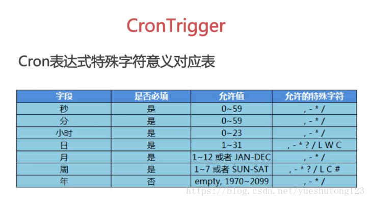
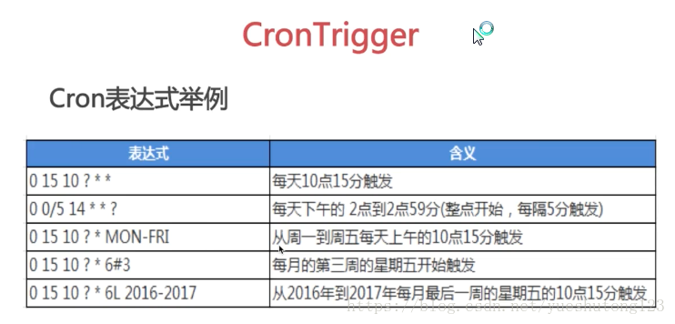
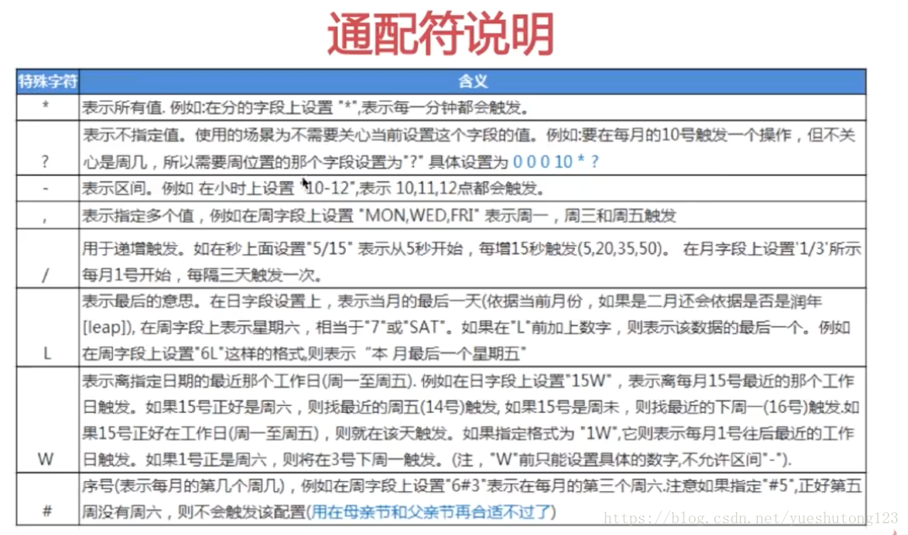
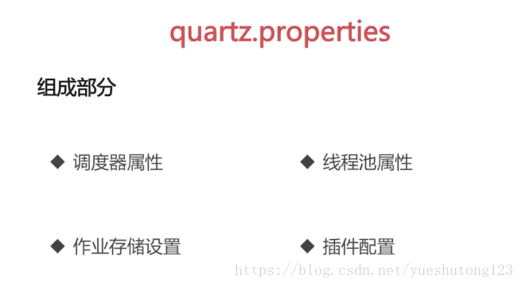
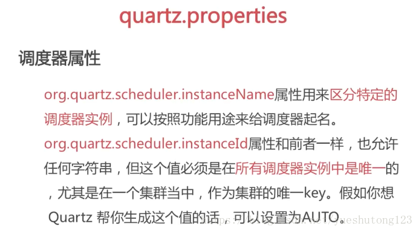
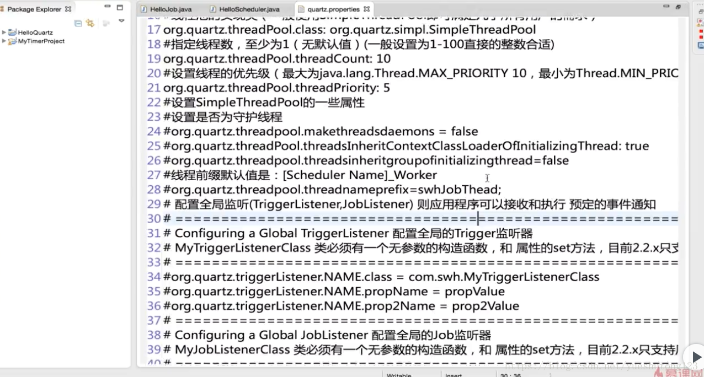
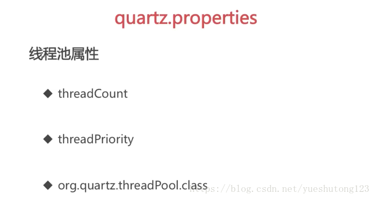

# 一，导包

1）官网下载：[http://www.quartz-scheduler.org/downloads/](http://www.quartz-scheduler.org/downloads/) 
2）Maven

```xml
<dependency>
    <groupId>org.quartz-scheduler</groupId>
    <artifactId>quartz</artifactId>
    <version>2.2.1</version>
</dependency>
```

# 二，实例

1.先定义一个作业任务类，写我们的执行代码

```java
package cn.zyzpp.quartz.demo;
import java.text.SimpleDateFormat;
import java.util.Date;

import org.quartz.Job;
import org.quartz.JobDataMap;
import org.quartz.JobDetail;
import org.quartz.JobExecutionContext;
import org.quartz.JobExecutionException;
import org.quartz.JobKey;
import org.quartz.Trigger;
/**
 * Created by yster@foxmail.com
 * 2018年4月9日 下午11:00:52
*/
public class HelloJob implements Job {

    //第(2)种获取传入的参数的方法：setter方法 属性对应key的值
    private String setKey;

    public void execute(JobExecutionContext context) throws JobExecutionException {
        //获取JobDetail对象
        String now =  new SimpleDateFormat("yyyy-mm-dd hh:mm:ss").format(new Date());
        JobDetail detail = context.getJobDetail();
        String group = detail.getKey().getGroup();
        String value = detail.getJobDataMap().getString("key");

        //获取Trigger对象
        Trigger trigger = context.getTrigger();
        value= trigger.getJobDataMap().getString("key");

        //获取JobDataMap对象 
        //第(1)种获取传入的参数的方法
        JobDataMap data =  context.getMergedJobDataMap();
        value = data.getString("key");//相同key 调用trigger的value
        //System.out.println(group + "：" + value  + " at " + now + setKey);

        //获取Jobkey对象
        JobKey jobKey = trigger.getJobKey();
        String name =  jobKey.getName();
        group = jobKey.getGroup();

        try {
            Thread.sleep(5000l);
        } catch (InterruptedException e) {
            e.printStackTrace();
        }

        System.out.println(now + "：" + name + " " +group);
    }

    public String getSetKey() {
        return setKey;
    }

    public void setSetKey(String setKey) {
        this.setKey = setKey;
    }

}
```

2.

```java
package cn.zyzpp.quartz.demo;

import java.text.SimpleDateFormat;
import java.util.Date;

import org.quartz.CronScheduleBuilder;
import org.quartz.CronTrigger;
import org.quartz.JobBuilder;
import org.quartz.SimpleScheduleBuilder;
import org.quartz.SimpleTrigger;
import org.quartz.TriggerBuilder;

import org.quartz.JobDetail;
import org.quartz.Scheduler;
import org.quartz.Trigger;
import org.quartz.impl.StdSchedulerFactory;

/**
 * Created by yster@foxmail.com 2018年4月9日 下午10:57:14
 */
public class QuartzTest {

    public static void main(String[] args) {
        SimpleDateFormat sf =new SimpleDateFormat("yyyy-mm-dd hh:mm:ss");
        try {
            // Quartz 作业：定义一个JobDetail：为Job类设置属性
            JobDetail jobDetail = JobBuilder.newJob(HelloJob.class) // 定义Job类为HelloQuartz类，这是真正的执行逻辑所在
                    .withIdentity("job1", "group1") // 定义name/group
                    .usingJobData("key", "job-value") // 自定义参数
                    .usingJobData("setKey", "setValue").build();

            // System.out.println(jobDetail.getKey().getName());
            // System.out.println(jobDetail.getKey().getGroup());
            // System.out.println(jobDetail.getJobClass());

            // 定义任务开始时间以及结束时间
            Date startDate = new Date();
            System.out.println("scheduler开始：" + sf.format(new Date()));
            startDate.setTime(new Date().getTime() + 2000);
            Date endDate = new Date();
            endDate.setTime(startDate.getTime() + 4000);

            // Quartz触发器：定义一个Trigger
            Trigger trigger = TriggerBuilder.newTrigger()
                    .withIdentity("trigger1", "group1") // 定义name/group
                    // .startNow()//一旦加入scheduler，立即生效
                    .startAt(startDate)
                    .endAt(endDate)
                    .withSchedule(SimpleScheduleBuilder.simpleSchedule()
                            .withIntervalInSeconds(1) // 每隔一秒执行一次
                            .repeatForever()) // 一直执行，奔腾到老不停歇
                    .usingJobData("key", "trigger-value")
                    .build();

            //SimpleTrigger 在一个指定时间段内执行一次作业任务 或者在指定时间间隔内多次执行作业任务
            SimpleTrigger simpleTrigger = (SimpleTrigger) TriggerBuilder
                    .newTrigger()
                    .withIdentity("trigger1", "group1") // 定义name/group
                    .startAt(startDate)
                    .withSchedule(SimpleScheduleBuilder.simpleSchedule()
                            .withIntervalInSeconds(2)
                            .withRepeatCount(3))    //执行第1次后再执行3次（SimpleTrigger.REPEAT_INDEFINITELY）
                    .build();

            //CronTrigger 基于 cron 表达式，更常用
            CronTrigger cronTrigger = (CronTrigger) TriggerBuilder
                    .newTrigger()
                    .withIdentity("trigger1", "group1") // 定义name/group
                    .startAt(startDate)
                    .withSchedule(
                            //Cron表达式：[秒][分][时][日][月][周][年] (周日1-周六7，年可不写)   *每 ?不关心 -至 #第 /递增 ,和 L最后 W最近工作日
                            CronScheduleBuilder.cronSchedule("0/2 * * * * ? * ")    
                            )
                    .build();

            // 调度类链接&ldquo;工作&rdquo;和&ldquo;触发器&rdquo;到一起，并执行它
            // 创建scheduler
            StdSchedulerFactory sfact = new StdSchedulerFactory();
            Scheduler scheduler = sfact.getScheduler();

            // 加入这个调度 返回第一次执行时间
            scheduler.scheduleJob(jobDetail, cronTrigger);
            //System.out.println("调度器：" + sf.format(scheduler.scheduleJob(jobDetail, cronTrigger)));

            // 启动之
            scheduler.start();

            // 运行一段时间后暂停    可再次start 当前主线程不终止
            Thread.sleep(10000l);       
//          scheduler.standby();    
//          System.out.println("暂停：三秒后再次开启");

//          Thread.sleep(3000l);    
//          scheduler.start();

//          Thread.sleep(5000l);            
            scheduler.shutdown(true);//true等待执行的job完成后关闭scheduler，false直接关闭
            System.out.println("scheduler终止" + sf.format(new Date()));
        } catch (Exception e) {
            e.printStackTrace();
        }
    }
}
```

# 三，干货

### 1）Cron表达式







### 2）/org/quartz/quartz.properties









### 3）集成Spring

```xml
<!-- JobDetail -->
 <!-- （1）simpleJobDetail : 定义任务类和任务方法-->
 <bean id="simpleJobDetail"
     class="org.springframework.scheduling.quartz.MethodInvokingJobDetailFactoryBean">
     <property name="targetObject" ref="myBean" />
     <property name="targetMethod" value="printMessage" />
 </bean>

 <!--（2）继承 QuartzJobBean 传参-->
 <bean id="firstComplexJobDetail"
     class="org.springframework.scheduling.quartz.JobDetailFactoryBean">
     <property name="jobClass"
         value="com.imooc.springquartz.quartz.FirstScheduledJob" />
     <property name="jobDataMap">
         <map>
             <entry key="anotherBean" value-ref="anotherBean" />
         </map>
     </property>
     <property name="durability" value="true"/>              
 </bean>

 <!--Trigger-->
 <!-- （1）距离当前时间1秒之后执行，之后每隔两秒钟执行一次 -->
 <bean id="mySimpleTrigger" class="org.springframework.scheduling.quartz.SimpleTriggerFactoryBean">
     <property name="jobDetail"  ref="simpleJobDetail"/>
     <property name="startDelay"  value="1000"/>
     <property name="repeatInterval"  value="2000"/>
 </bean>

 <!-- （2）每隔5秒钟执行一次 -->
 <bean id="myCronTrigger" class="org.springframework.scheduling.quartz.CronTriggerFactoryBean">
     <property name="jobDetail"  ref="firstComplexJobDetail"/>
     <property name="cronExpression"  value="0/5 * * ? * *"/>
 </bean>

 <!-- （3）Scheduler -->
 <bean class="org.springframework.scheduling.quartz.SchedulerFactoryBean">
     <property name="jobDetails">
         <list>
             <ref bean="simpleJobDetail"/>
             <ref bean="firstComplexJobDetail"/>
         </list>
     </property>
     <property name="triggers">
         <list>
             <ref bean="mySimpleTrigger"/>
             <ref bean="myCronTrigger"/>
         </list>
     </property>
 </bean>
```

1.MyBean.java

```java
import java.text.SimpleDateFormat;
import java.util.Date;

import org.springframework.stereotype.Component;

@Component("myBean")
public class MyBean {
    public void printMessage() {
        // 打印当前的执行时间，格式为2017-01-01 00:00:00
        Date date = new Date();
        SimpleDateFormat sf = new SimpleDateFormat("yyyy-MM-dd HH:mm:ss");
        System.out.println("MyBean Executes!" + sf.format(date));
    }
}
```

2.AnotherBean.java

```java

import org.springframework.stereotype.Component;

@Component("anotherBean")
public class AnotherBean {
    public void printAnotherMessage() {
        System.out.println("AnotherMessage");
    }
}
```

3.FirstScheduledJob.java

```java
import java.text.SimpleDateFormat;
import java.util.Date;

import org.quartz.JobExecutionContext;
import org.quartz.JobExecutionException;
import org.springframework.scheduling.quartz.QuartzJobBean;

public class FirstScheduledJob extends QuartzJobBean{
     private AnotherBean anotherBean;

     public void setAnotherBean(AnotherBean anotherBean){
         this.anotherBean = anotherBean;
     }

    @Override
    protected void executeInternal(JobExecutionContext arg0)
            throws JobExecutionException {
        Date date = new Date();
        SimpleDateFormat sf = new SimpleDateFormat("yyyy-MM-dd HH:mm:ss");
        System.out.println("FirstScheduledJob Executes!" + sf.format(date));
        this.anotherBean.printAnotherMessage();     
    }
}
```