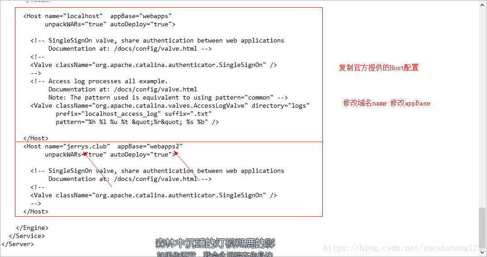
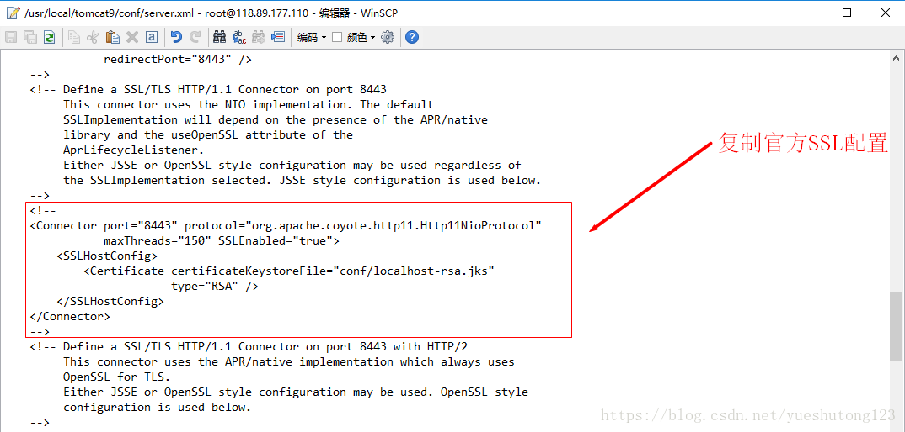
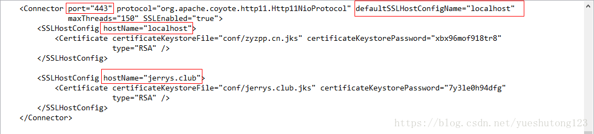

这里是Tomcat9版本，其它版本基本一致！

## 1.配置多个主机域名

### 1.打开conf文件夹下的server.xml

复制官方提供的HOST配置，修改为你的域名，appBase路径（相对路径）

### 2.新建刚刚定义的文件夹

新建新的appBase路径，在Tomcat根目录下。

###### 3.显而易见。第二个host对应第二个webapps文件夹

默认还是ROOT目录

###### 4.访问不同域名，完美解决！比网上的一大堆乱七八糟的简单很多

## 2.配置多个SSL

### 1.这里依旧接上部分，对上面两个Host配置两个SSL。

### 2.详细配置如下

注意红色圈出的

###### 3.上面两个hostname都明白吧？