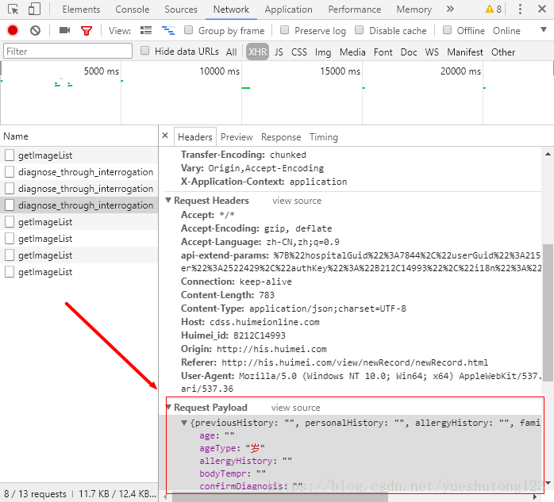

# 引言

>*  现在前后端分离渐渐成为主流，网站可以通过json格式的数据和服务端进行交互，比如下图：



### 关于这点，JSOUP官方API文档已经给出了解决方法

>*  Connection requestBody​(String body)   Set a POST (or PUT) request body. Useful when a server expects a plain request body, not a set for URL encoded form key/value pairs. E.g.:
>*  字符串连接requestBody(身体)   设置一个POST(或PUT)请求体。当服务器需要一个普通的请求体，而不是URL编码的表单键/值对的集合时，这很有用。例如:

```java
Jsoup.connect(url)
 .requestBody(json)
 .header("Content-Type", "application/json")
 .post();
```

>*  If any data key/vals are supplied, they will be sent as URL query params.   Returns:   this Request, for chaining
>*  如果提供了任何数据键/值，它们将作为URL查询参数发送。   返回:   这个请求,链接

---

###### 在jsoup-1.8中若找不到.requestBody()方法，建议使用1.10系列版本！