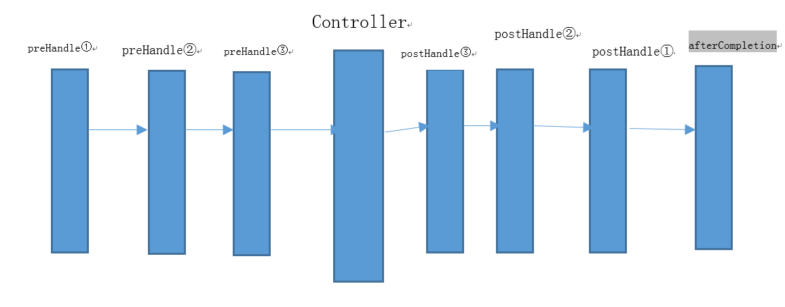

# 1.配置拦截器

```java
@Configuration
public class WebMvcConfigurer extends WebMvcConfigurerAdapter {

    @Override
    public void addInterceptors(InterceptorRegistry registry) {
        /**
         * 拦截器按照顺序执行
         * 不止One，还有Two，Three
         */
        registry.addInterceptor(new OneInterceptor()).addPathPatterns("/*/**").addPathPatterns("/hello");

        super.addInterceptors(registry);
    }

}
```

### 在Spring Boot 2.0以后的方式


```java
@Configuration
public class InterceptorConfigurer implements WebMvcConfigurer {

    @Override
public void addInterceptors(InterceptorRegistry registry) {
/**
         * 拦截器按照顺序执行
*/
        registry.addInterceptor(new TwoInterceptor()).addPathPatterns("/**");
    }

}
```

# 2.定义拦截器

```java
public class OneInterceptor implements HandlerInterceptor {

    /**
     * 在整个请求结束之后被调用，也就是在DispatcherServlet 渲染了对应的视图之后执行
     * （主要是用于进行资源清理工作）
     */
    @Override
    public void afterCompletion(HttpServletRequest arg0, HttpServletResponse arg1, Object arg2, Exception arg3)
            throws Exception {
        //after

    }

    /**
     * 请求处理之后进行调用，但是在视图被渲染之前（Controller方法调用之后）
     */
    @Override
    public void postHandle(HttpServletRequest arg0, HttpServletResponse arg1, Object arg2, ModelAndView arg3)
            throws Exception {
        //post

    }

    /**
     * 在请求处理之前进行调用（Controller方法调用之前）
     */
    @Override
    public boolean preHandle(HttpServletRequest request, HttpServletResponse response, Object object) throws Exception {

        //可以进行权限验证request.getSession

        return true; //放行
    }
}
```