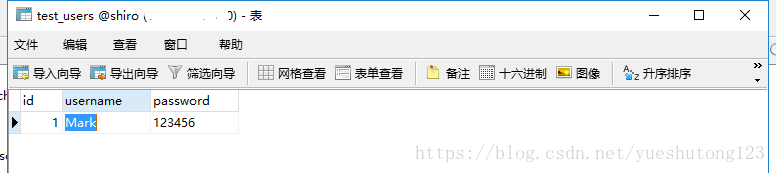
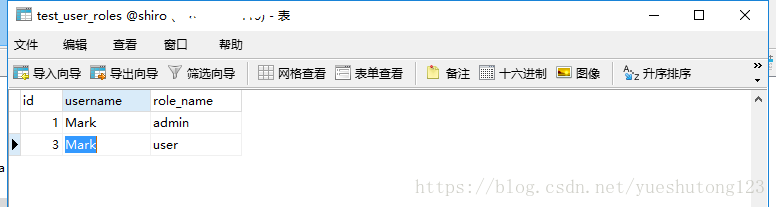

# 入门

## 1.simpleRealmTest

```java
package cn.realm;

import org.apache.shiro.SecurityUtils;
import org.apache.shiro.authc.UsernamePasswordToken;
import org.apache.shiro.mgt.DefaultSecurityManager;
import org.apache.shiro.realm.SimpleAccountRealm;
import org.apache.shiro.subject.Subject;
import org.junit.Before;
import org.junit.Test;

/**
 * Create by codeblog@qq.com 2018-05-11
**/
public class simpleRealmTest {

    SimpleAccountRealm simpleAccountRealm = new SimpleAccountRealm();
    @Before
    public void addUser() {
        simpleAccountRealm.addAccount("Mark", "123456", "admin");
    }


    @Test
    public void testAuthentication() {
        // 1.构建SecurityManager环境
        DefaultSecurityManager defaultSecurityManager = new DefaultSecurityManager();
        defaultSecurityManager.setRealm(simpleAccountRealm);

        // 2.主题提交认证请求
        SecurityUtils.setSecurityManager(defaultSecurityManager);
        Subject subject = SecurityUtils.getSubject();

        UsernamePasswordToken token = new UsernamePasswordToken("Mark", "123456");
        subject.login(token);
        System.out.println("是否登录:" + subject.isAuthenticated());

        subject.checkRoles("admin");    //授权
        subject.checkPermission("user:delete");

        subject.logout();
        System.out.println("是否登录:" + subject.isAuthenticated());
    }

}
```

## 2.IniRealmTest

user.ini

```java
[users]
\#提供了对用户/密码及其角色的配置，用户名=密码，角色1，角色2
Mark=123456,admin
[roles]
\#提供了角色及权限之间关系的配置，角色=权限1，权限2
admin=user:delete
```

```java
package cn.realm;

import org.apache.shiro.SecurityUtils;
import org.apache.shiro.authc.UsernamePasswordToken;
import org.apache.shiro.mgt.DefaultSecurityManager;
import org.apache.shiro.realm.text.IniRealm;
import org.apache.shiro.subject.Subject;
import org.junit.Test;

/**
 * Create by codeblog@qq.com 2018-05-12 11:47:41
**/
public class IniRealmTest {

    IniRealm iniRealm = new IniRealm("classpath:user.ini");

    @Test
    public void testAuthentication() {
        // 1.构建SecurityManager环境
        DefaultSecurityManager defaultSecurityManager = new DefaultSecurityManager();
        defaultSecurityManager.setRealm(iniRealm);

        // 2.主题提交认证请求
        SecurityUtils.setSecurityManager(defaultSecurityManager);
        Subject subject = SecurityUtils.getSubject();

        UsernamePasswordToken token = new UsernamePasswordToken("Mark", "123456");
        subject.login(token);
        System.out.println("是否登录:" + subject.isAuthenticated());

        subject.checkRoles("admin");    //授权
        subject.checkPermission("user:delete");

        subject.logout();
        System.out.println("是否登录:" + subject.isAuthenticated());
    }

}
```

## 3.JdbcRealmTest

```java
package cn.realm;

import org.apache.shiro.SecurityUtils;
import org.apache.shiro.authc.UsernamePasswordToken;
import org.apache.shiro.mgt.DefaultSecurityManager;
import org.apache.shiro.realm.jdbc.JdbcRealm;
import org.apache.shiro.subject.Subject;
import org.junit.Test;

import com.alibaba.druid.pool.DruidDataSource;

/**
 * Create by codeblog@qq.com 2018-05-12 11:47:52
**/
public class JdbcRealmTest {
    DruidDataSource dataSource = new DruidDataSource();
    {
        dataSource.setUrl("jdbc:mysql://127.0.0.1:3306/shiro");
        dataSource.setUsername("root");
        dataSource.setPassword("123456");
    }
    @Test
    public void testAuthentication() {
        JdbcRealm jdbcRealm = new JdbcRealm();
        jdbcRealm.setDataSource(dataSource);
        //开启角色权限
        jdbcRealm.setPermissionsLookupEnabled(true);

        /*自定义SQL进行查询：不自定义使用默认表名
        //认证查询*/
        jdbcRealm.setAuthenticationQuery("select password from test_users where username = ?");
        /*用户角色查询*/
        jdbcRealm.setUserRolesQuery("select role_name from test_user_roles where username = ?");

        // 1.构建SecurityManager环境
        DefaultSecurityManager defaultSecurityManager = new DefaultSecurityManager();
        defaultSecurityManager.setRealm(jdbcRealm);

        // 2.主题提交认证请求
        SecurityUtils.setSecurityManager(defaultSecurityManager);
        Subject subject = SecurityUtils.getSubject();

        UsernamePasswordToken token = new UsernamePasswordToken("Jerry", "123456");//Mark
        subject.login(token);
        System.out.println("是否登录:" + subject.isAuthenticated());

        subject.checkRoles("admin","user"); //授权
        subject.checkPermission("user:select"); //权限

        subject.logout();
        System.out.println("是否登录:" + subject.isAuthenticated());
    }

}
```





## 4.自定义CustomRealm

```java
package cn.realm;

import java.util.HashMap;
import java.util.HashSet;
import java.util.Map;
import java.util.Set;

import org.apache.shiro.authc.AuthenticationException;
import org.apache.shiro.authc.AuthenticationInfo;
import org.apache.shiro.authc.AuthenticationToken;
import org.apache.shiro.authc.SimpleAuthenticationInfo;
import org.apache.shiro.authz.AuthorizationInfo;
import org.apache.shiro.authz.SimpleAuthorizationInfo;
import org.apache.shiro.crypto.hash.Md5Hash;
import org.apache.shiro.realm.AuthorizingRealm;
import org.apache.shiro.subject.PrincipalCollection;
import org.apache.shiro.util.ByteSource;

/**
 * Create by codeblog@qq.com 2018-05-12 05:59:16
**/
public class CustomRealm extends AuthorizingRealm {
    Map<String, String> userMap = new HashMap<>();
    //模拟数据库或缓存的数据
    {
//      Md5Hash md5 = new Md5Hash("123456");    //加密
        Md5Hash md5 = new Md5Hash("123456","Mark");//加盐
        userMap.put("Mark", md5.toString());
//      userMap.put("Mark", "123456");
        super.setName("customRealm");
    }

    @Override
    protected AuthorizationInfo doGetAuthorizationInfo(PrincipalCollection principals) {
        String username = (String) principals.getPrimaryPrincipal();
        // 从数据库或者缓存中获得角色数据
        Set<String> roles = getRolesByUserName(username);
        Set<String> permissions = getPermissionsByUserName(username);

        SimpleAuthorizationInfo simpleAuthorizationInfo = new SimpleAuthorizationInfo();
        simpleAuthorizationInfo.setStringPermissions(permissions);
        simpleAuthorizationInfo.setRoles(roles);

        return simpleAuthorizationInfo;
    }

    private Set<String> getPermissionsByUserName(String username) {
        Set<String> sets = new HashSet<>();
        sets.add("user:delete");
        sets.add("user:add");
        return sets;
    }

    private Set<String> getRolesByUserName(String username) {
        Set<String> sets = new HashSet<>();
        sets.add("admin");
        sets.add("user");
        return sets;
    }

    @Override
    protected AuthenticationInfo doGetAuthenticationInfo(AuthenticationToken token) throws AuthenticationException {
        // 1.从主体传过来的认证信息中，获得用户名
        String username = (String) token.getPrincipal();

        // 2.通过用户名到数据库中获取凭证
        String password = getPasswordByUsername(username);
        if(password == null) {
            return null;
        }
        SimpleAuthenticationInfo simpleAuthenticationInfo = new SimpleAuthenticationInfo("Mark", password, "customRealm");
        //加盐
        simpleAuthenticationInfo.setCredentialsSalt(ByteSource.Util.bytes("Mark"));
        return simpleAuthenticationInfo;
    }

    private String getPasswordByUsername(String username) {
        return userMap.get(username);
    }

}
```

```java
package cn.realm;

import org.apache.shiro.SecurityUtils;
import org.apache.shiro.authc.UsernamePasswordToken;
import org.apache.shiro.authc.credential.HashedCredentialsMatcher;
import org.apache.shiro.mgt.DefaultSecurityManager;
import org.apache.shiro.subject.Subject;
import org.junit.Test;

/**
 * Create by codeblog@qq.com 2018-05-12 07:53:15
**/
public class CustomRealmTest {

    CustomRealm customRealm = new CustomRealm();


    @Test
    public void testAuthentication() {
        // 1.构建SecurityManager环境
        DefaultSecurityManager defaultSecurityManager = new DefaultSecurityManager();
        defaultSecurityManager.setRealm(customRealm);

        //声明CustomRealm使用了Md5加密
        HashedCredentialsMatcher matcher = new HashedCredentialsMatcher();
        matcher.setHashAlgorithmName("md5");
        matcher.setHashIterations(1);
        customRealm.setCredentialsMatcher(matcher);

        // 2.主题提交认证请求
        SecurityUtils.setSecurityManager(defaultSecurityManager);
        Subject subject = SecurityUtils.getSubject();

        UsernamePasswordToken token = new UsernamePasswordToken("Mark", "123456");
        subject.login(token);
        System.out.println("是否登录:" + subject.isAuthenticated());

        subject.checkRoles("admin");    //授权
        subject.checkPermission("user:delete");

        subject.logout();
        System.out.println("是否登录:" + subject.isAuthenticated());
    }

}
```

---

更多Spring集成Shiro的实例在Github：[https://gitee.com/zyzpp/shiro-imooc/](https://gitee.com/zyzpp/shiro-imooc/)