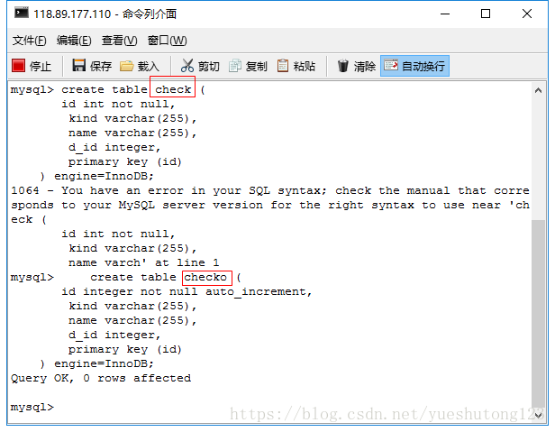

# 一：引言

###### 用hibernate建表时经常遇到的一个异常：Error executing DDL via JDBC Statement

###### 方法：

*  查看报错sql语句。问题就在这里。
*  我是表名（字段名）与保留字冲突。

# 二：Mysql保留字表

| Reserved Words in MySQL 5.6.23 |                    |                     |
| ------------------------------ | ------------------ | ------------------- |
| ACCESSIBLE                     | ADD                | ALL                 |
| ALTER                          | ANALYZE            | AND                 |
| AS                             | ASC                | ASENSITIVE          |
| BEFORE                         | BETWEEN            | BIGINT              |
| BINARY                         | BLOB               | BOTH                |
| BY                             | CALL               | CASCADE             |
| CASE                           | CHANGE             | CHAR                |
| CHARACTER                      | CHECK              | COLLATE             |
| COLUMN                         | CONDITION          | CONSTRAINT          |
| CONTINUE                       | CONVERT            | CREATE              |
| CROSS                          | CURRENT_DATE       | CURRENT_TIME        |
| CURRENT_TIMESTAMP              | CURRENT_USER       | CURSOR              |
| DATABASE                       | DATABASES          | DAY_HOUR            |
| DAY_MICROSECOND                | DAY_MINUTE         | DAY_SECOND          |
| DEC                            | DECIMAL            | DECLARE             |
| DEFAULT                        | DELAYED            | DELETE              |
| DESC                           | DESCRIBE           | DETERMINISTIC       |
| DISTINCT                       | DISTINCTROW        | DIV                 |
| DOUBLE                         | DROP               | DUAL                |
| EACH                           | ELSE               | ELSEIF              |
| ENCLOSED                       | ESCAPED            | EXISTS              |
| EXIT                           | EXPLAIN            | FALSE               |
| FETCH                          | FLOAT              | FLOAT4              |
| FLOAT8                         | FOR                | FORCE               |
| FOREIGN                        | FROM               | FULLTEXT            |
| GET                            | GRANT              | GROUP               |
| HAVING                         | HIGH_PRIORITY      | HOUR_MICROSECOND    |
| HOUR_MINUTE                    | HOUR_SECOND        | IF                  |
| IGNORE                         | IN                 | INDEX               |
| INFILE                         | INNER              | INOUT               |
| INSENSITIVE                    | INSERT             | INT                 |
| INT1                           | INT2               | INT3                |
| INT4                           | INT8               | INTEGER             |
| INTERVAL                       | INTO               | IO_AFTER_GTIDS      |
| IO_BEFORE_GTIDS                | IS                 | ITERATE             |
| JOIN                           | KEY                | KEYS                |
| KILL                           | LEADING            | LEAVE               |
| LEFT                           | LIKE               | LIMIT               |
| LINEAR                         | LINES              | LOAD                |
| LOCALTIME                      | LOCALTIMESTAMP     | LOCK                |
| LONG                           | LONGBLOB           | LONGTEXT            |
| LOOP                           | LOW_PRIORITY       | MASTER_BIND         |
| MASTER_SSL_VERIFY_SERVER_CERT  | MATCH              | MAXVALUE            |
| MEDIUMBLOB                     | MEDIUMINT          | MEDIUMTEXT          |
| MIDDLEINT                      | MINUTE_MICROSECOND | MINUTE_SECOND       |
| MOD                            | MODIFIES           | NATURAL             |
| NOT                            | NO_WRITE_TO_BINLOG | NULL                |
| NUMERIC                        | ON                 | OPTIMIZE            |
| OPTION                         | OPTIONALLY         | OR                  |
| ORDER                          | OUT                | OUTER               |
| OUTFILE                        | PARTITION          | PRECISION           |
| PRIMARY                        | PROCEDURE          | PURGE               |
| RANGE                          | READ               | READS               |
| READ_WRITE                     | REAL               | REFERENCES          |
| REGEXP                         | RELEASE            | RENAME              |
| REPEAT                         | REPLACE            | REQUIRE             |
| RESIGNAL                       | RESTRICT           | RETURN              |
| REVOKE                         | RIGHT              | RLIKE               |
| SCHEMA                         | SCHEMAS            | SECOND_MICROSECOND  |
| SELECT                         | SENSITIVE          | SEPARATOR           |
| SET                            | SHOW               | SIGNAL              |
| SMALLINT                       | SPATIAL            | SPECIFIC            |
| SQL                            | SQLEXCEPTION       | SQLSTATE            |
| SQLWARNING                     | SQL_BIG_RESULT     | SQL_CALC_FOUND_ROWS |
| SQL_SMALL_RESULT               | SSL                | STARTING            |
| STRAIGHT_JOIN                  | TABLE              | TERMINATED          |
| THEN                           | TINYBLOB           | TINYINT             |
| TINYTEXT                       | TO                 | TRAILING            |
| TRIGGER                        | TRUE               | UNDO                |
| UNION                          | UNIQUE             | UNLOCK              |
| UNSIGNED                       | UPDATE             | USAGE               |
| USE                            | USING              | UTC_DATE            |
| UTC_TIME                       | UTC_TIMESTAMP      | VALUES              |
| VARBINARY                      | VARCHAR            | VARCHARACTER        |
| VARYING                        | WHEN               | WHERE               |
| WHILE                          | WITH               | WRITE               |
| XOR                            | YEAR_MONTH         | ZEROFILL            |

