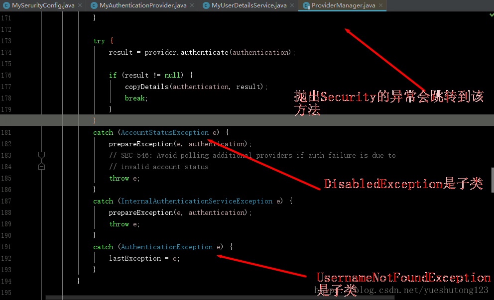

# 一：唠嗑

>*  鼓捣了两天的Spring Security，踩了不少坑。如果你在学Spring Security，恰好又是使用的Spring Boot，那么给我点个赞吧！这篇博客将会让你了解Spring Security的各种坑！
>*  阅读前说一下，这篇博客是我一字一字打出来的，转载务必注明出处哦！
>*  另外，本文已授权微信公众号&ldquo;后端技术精选&rdquo;独家发布

---

# 二：开始

## 1.准备

*  Spring boot 1.5
*  Mysql 5.7
*  导入依赖

```xml
        <!-- Web工程 -->
        <dependency>
            <groupId>org.springframework.boot</groupId>
            <artifactId>spring-boot-starter-web</artifactId>
        </dependency>
        <!-- 数据库相关 -->
        <dependency>
            <groupId>org.springframework.boot</groupId>
            <artifactId>spring-boot-starter-data-jpa</artifactId>
        </dependency>
        <dependency>
            <groupId>mysql</groupId>
            <artifactId>mysql-connector-java</artifactId>
        </dependency>
        <!-- security 核心 -->
        <dependency>
            <groupId>org.springframework.boot</groupId>
            <artifactId>spring-boot-starter-security</artifactId>
        </dependency>
        <!-- thymeleaf 模板-->
        <dependency>
            <groupId>org.springframework.boot</groupId>
            <artifactId>spring-boot-starter-thymeleaf</artifactId>
        </dependency>
        <!-- 可以在HTML使用sec标签操作Security -->
        <dependency>
            <groupId>org.thymeleaf.extras</groupId>
            <artifactId>thymeleaf-extras-springsecurity4</artifactId>
        </dependency><br />
```

## 2.开启Security并配置

```java
package cn.zyzpp.security.config;

import org.springframework.beans.factory.annotation.Autowired;
import org.springframework.context.annotation.Configuration;
import org.springframework.security.authentication.AuthenticationProvider;
import org.springframework.security.config.annotation.authentication.builders.AuthenticationManagerBuilder;
import org.springframework.security.config.annotation.web.builders.HttpSecurity;
import org.springframework.security.config.annotation.web.builders.WebSecurity;
import org.springframework.security.config.annotation.web.configuration.EnableWebSecurity;
import org.springframework.security.config.annotation.web.configuration.WebSecurityConfigurerAdapter;
import org.springframework.security.core.userdetails.UserDetailsService;

/**
 * Create by yster@foxmail.com 2018/6/10/010 18:07
 */
@EnableWebSecurity
public class MySerurityConfig extends WebSecurityConfigurerAdapter {
    /*自己实现下面两个接口*/
    @Autowired
    private AuthenticationProvider authenticationProvider;
    @Autowired
    private UserDetailsService userDetailsService;

    @Override
    protected void configure(HttpSecurity http) throws Exception {
        http.authorizeRequests()
                .antMatchers("/", "/signIn").permitAll()//所有人都可以访问
                .antMatchers("/leve/1").hasRole("VIP1") //设置访问角色
                .antMatchers("/leve/2").hasRole("VIP2")
                .antMatchers("/leve/3").hasAuthority("VIP2")//设置访问权限
                .anyRequest().authenticated() //其他所有资源都需要认证，登陆后访问
                .and()
                .formLogin()//开启自动配置的授权功能
                .loginPage("/login")    //自定义登录页（controller层需要声明）
                .usernameParameter("username")  //自定义用户名name值
                .passwordParameter("password")  //自定义密码name值
                .failureUrl("/login?error") //登录失败则重定向到此URl
                .permitAll() //登录页都可以访问
                .and()
                .logout()//开启自动配置的注销功能
                .logoutSuccessUrl("/")//注销成功后返回到页面并清空Session
                .and()
                .rememberMe()
                .rememberMeParameter("remember")//自定义rememberMe的name值，默认remember-Me
                .tokenValiditySeconds(604800);//记住我的时间/秒
    }

    /*定义认证规则*/
    @Override
    protected void configure(AuthenticationManagerBuilder auth) throws Exception {
    /*  保存用户信息到内存中
        auth.inMemoryAuthentication()
             .withUser("张三").password("123456").roles("VIP1")
             .and()
             .withUser("李四").password("123456").roles("VIP2");
    */

        /*自定义认证*/
        auth.authenticationProvider(authenticationProvider);
        auth.userDetailsService(userDetailsService);//不定义的话rememberMe报错
    }

    /*忽略静态资源*/
    @Override
    public void configure(WebSecurity web) {
        web.ignoring().antMatchers("/resources/static/**");
    }

}
```

---

### 讲一下：

*  我们基本不会把用户信息保存在内存中，所以我们自定义认证方法。这里我推荐阅读 [认证(Authentication)与源码解读](http://www.tianshouzhi.com/api/tutorials/spring_security_4/263) 了解。
*  自定义认证也有两种方法，第一是注入DaoAuthenticationProvider（org.springframework.security.authentication.dao）

```java
    @Bean
    public DaoAuthenticationProvider daoAuthenticationProvider(){
        DaoAuthenticationProvider daoAuthenticationProvider = new DaoAuthenticationProvider();
        daoAuthenticationProvider.setUserDetailsService(userDetailsService);//获取用户信息
        daoAuthenticationProvider.setPasswordEncoder(new Md5PasswordEncoder());//MD5加密
        daoAuthenticationProvider.setSaltSource(new SaltSource() {  //加盐
            @Override
            public Object getSalt(UserDetails user) {
                return user.getUsername();
            }
        });
        return daoAuthenticationProvider;
    }
```

*  然后改一下设置

```java
auth.authenticationProvider(authenticationProvider);
```

*  这种方法我并不推荐，因为我们把密码错误的异常交给了Security底层去抛出，然而抛出的消息只是`Bad credentials` 这样的消息提示你会需要？

*  所以我们使用第二种方法，如下：

---

## 3.自定义AuthenticationProvider接口实现类

```java
package cn.zyzpp.security.config;

import org.springframework.beans.factory.annotation.Autowired;
import org.springframework.security.authentication.AuthenticationProvider;
import org.springframework.security.authentication.DisabledException;
import org.springframework.security.authentication.UsernamePasswordAuthenticationToken;
import org.springframework.security.authentication.encoding.Md5PasswordEncoder;
import org.springframework.security.core.Authentication;
import org.springframework.security.core.userdetails.UserDetails;
import org.springframework.stereotype.Component;

/**
 * Create by yster@foxmail.com 2018/6/21/021 15:53
 * Authentication 是一个接口，用来表示用户认证信息的
 */
@Component
public class MyAuthenticationProvider implements AuthenticationProvider{
    @Autowired
    private MyUserDetailsService userDetailsService;

    @Override
    public Authentication authenticate(Authentication authentication){
        //1.获取用户输入的用户名 密码
        String username = authentication.getName();
        String password = (String) authentication.getCredentials();
        //2.关于MD5加密：
        //因为我们是自定义Authentication，所以必须手动加密加盐而不需要再配置。
        password = new Md5PasswordEncoder().encodePassword(password,username);
        //3.由输入的用户名查找该用户信息，内部抛出异常
        UserDetails user = userDetailsService.loadUserByUsername(username);
        //4.密码校验
        if (!password.equals(user.getPassword())) {
            throw new DisabledException("---->UserName :" + username + " password error!");
        }
        return new UsernamePasswordAuthenticationToken(user, password, user.getAuthorities());
    }

    @Override
    public boolean supports(Class<?> aClass) {
        return (UsernamePasswordAuthenticationToken.class
                .isAssignableFrom(aClass));
    }

}
```

---

### 讲一下：

*  这里说Security的一个坑：
*  相信你也看到了有的教程上说抛出`UsernameNotFoundException` 用户找不到，`BadCredentialsException` 坏的凭据，但这两个类都是继承自`AuthenticationException`抽象类，当你抛出这俩异常时，Security底层会捕捉到你抛出的异常，如图： 

*  看到了吧，`AuthenticationException`异常并不会被抛出，debug调式一下，你就会感受到它的曲折历程，相当感人！然后莫名其妙的被换掉了，而且无解。

*  没错，你没看错，`AccountStatusException`异常被直接抛出了，这正是我们需要的；有的同学可能想到了自定义异常，但我们是结合Security框架，要按人家的规则来，不信你试试。
*  附一些常用异常

```
 <span class="hljs-comment">/* 
    AuthenticationException常用的的子类：(会被底层换掉，不推荐使用)
    UsernameNotFoundException 用户找不到
    BadCredentialsException 坏的凭据

    AccountStatusException用户状态异常它包含如下子类：（推荐使用）
    AccountExpiredException 账户过期
    LockedException 账户锁定
    DisabledException 账户不可用
    CredentialsExpiredException 证书过期
*/</span>
```

---

## 4.自定义UserDetailsService接口实现类

```java
package cn.zyzpp.security.config;

import cn.zyzpp.security.entity.Role;
import cn.zyzpp.security.service.UserService;
import org.springframework.beans.factory.annotation.Autowired;
import org.springframework.security.authentication.DisabledException;
import org.springframework.security.core.GrantedAuthority;
import org.springframework.security.core.authority.SimpleGrantedAuthority;
import org.springframework.security.core.userdetails.User;
import org.springframework.security.core.userdetails.UserDetails;
import org.springframework.security.core.userdetails.UserDetailsService;
import org.springframework.stereotype.Component;

import java.util.ArrayList;
import java.util.List;

/**
 * 进行认证的时候需要一个 UserDetailsService 来获取用户的信息 UserDetails，
 * 其中包括用户名、密码和所拥有的权限等。
 * Create by yster@foxmail.com 2018/6/21/021 15:56
 */
@Component
public class MyUserDetailsService implements UserDetailsService {

    @Autowired
    private UserService userService;

    /*
     * 采坑笔记：
     * new SimpleGrantedAuthority("...")时
     * 加前戳是Role，通过hasRole()获取，用来认证角色;
     * 不加前戳是Authoritiy,通过hasAuthority()获取，用来鉴定权限;
     * 总结：加前戳是角色，不加前戳是权限。此前戳只用于本类。
     */
    String role_ = "ROLE_";

    @Override
    public UserDetails loadUserByUsername(String username) {
        //1.业务层根据username获取该用户
        cn.zyzpp.security.entity.User user = userService.findUserByUserName(username);
        if (user == null) {
            //这里我们不抛出UsernameNotFoundException因为Security会把我们抛出的该异常捕捉并换掉；
            //这里要明确Security抛出的异常无法被ControllerAdvice捕捉到，无法进行统一异常处理；
            //而我们只需要打印正确的异常消息即可，Security自动把异常添加到HttpServletRequest或HttpSession中
            throw new DisabledException("---->UserName :" + username + " not found!");
        }
        //2.从业务层获取用户权限并转为Authorities
        List<GrantedAuthority> authorities = new ArrayList<>();
        for (Role role : user.getRoleList()) {
            authorities.add(new SimpleGrantedAuthority(role.getName()));//设置权限
            authorities.add(new SimpleGrantedAuthority(role_ + role.getName()));//设置角色
        }
        //3.返回Spring定义的User对象
        return new User(username, user.getPassword(), authorities);
    }

}
```

---

### 讲一下：

*  我们在保存用户信息到内存中时是这样的

```java
  auth.inMemoryAuthentication()
      .withUser("张三")
      .password("123456")
      .roles("ROLE_VIP1")
      .authorities("VIP1")
```

*  角色和权限是分开设置的，但我们在自定义时只有权限设置，

```java
authorities.add(new SimpleGrantedAuthority("权限名"));
```

*  定义以后你会发现这真真真&hellip;的是权限，不是角色，联想到上面Security的角色和权限其实是不同的，我想我应该是错过了什么？
*  然后翻看Security源码： 


*  翻译过来：如果调用hasRole(&ldquo;ADMIN&rdquo;)或hasRole(&ldquo;ROLE_ADMIN&rdquo;) 
方法时，当Role前缀为&rdquo;ROLE_&rdquo;(默认)时将使用ROLE_ADMIN角色。

*  而我们在把用户信息保存到内存时，底层是这样的：
   
   

*  解读一下就是在调用`.roles("ROLE_VIP1")`方法注册Role时，先通过`role.startsWith("ROLE_")`断言输入的角色名是否是`"ROLE_"`开头的，如果不是，补充`"RELE_"`前戳。

*  所以，Security解决角色和权限分开的依据就是是否含有`"ROLE_"`前戳，该默认前戳也是可以自己修改的。
*  ok，继续我们的Security学习之路。

---

# 5.获取Security登录异常信息

```java
package cn.zyzpp.security.controller;
...
import cn.zyzpp.security.service.UserService;
import javax.servlet.http.HttpServletRequest;
import javax.servlet.http.HttpSession;

/**
 * Create by yster@foxmail.com 2018/6/10/010 18:35
 */
@Controller
public class MyController {
    @Autowired
    UserService userService;

    @Autowired
    HttpSession session;
    @Autowired
    HttpServletRequest request;

    /*ModelMap的Key*/
    final String ERROR = "error";

    /**
     * 自定义登录页并进行异常信息提示
     * 需要在Security中设置
     */
    @RequestMapping(value = "/login")
    public String login(ModelMap modelMap){
      /*
       security的AuthenticationException异常自动保存在request或session中
       官方默认保存在Session，但我们自定义过多。我测试是在request中。
       所以在html页面还需要搭配th:if="${param.error!=null}"检查Url是否有参数error
        */
        String key = WebAttributes.AUTHENTICATION_EXCEPTION;

        if (session.getAttribute(key)!=null){
//            System.out.println("request");
            AuthenticationException exception = (AuthenticationException) session.getAttribute(key);
            modelMap.addAttribute(ERROR,exception.getMessage());
        }
        if (request.getAttribute(key)!=null){
//            System.out.println("session");
            AuthenticationException exception = (AuthenticationException) request.getAttribute(key);
            modelMap.addAttribute(ERROR,exception.getMessage());
        }

        return "login";
    }

}
```

#### 自定义login登录页面

*  Security规定若是GET访问则是请求页面，POST访问则为提交登录

```java
<!DOCTYPE html>
<html xmlns:th="http://www.thymeleaf.org">
<head>
    <meta charset="UTF-8"/>
    <title>登录页面</title>
</head>
<body>
<form th:action="@{/login}" method="post">
    用户名:<input type="text" placeholder="username" name="username" required=""/><br/>
    密码:<input type="password" placeholder="password" name="password" required=""/><br/>
    记住我：<input type="checkbox" name="remember"/>
    <input type="submit" value="提交"/>
    <span th:if="${param.error!=null}" th:text="${error}"/>
</form>
</body>
</html>
```

---

### 讲一下：

*  如果你debug追踪一下，你就可以了解Security的运行原理
*  Security的`SimpleUrlAuthenticationFailureHandler`（简单认证故障处理）会把异常保存到`request`或`session`中，`forwardToDestination`默认为`false`，也就是保存在`session`，实际我们测试是保存在`request`。 

---

# 6.在view层使用Security

#### 6.1 使用HTML sec标签 (推荐)

```java
<!DOCTYPE html>
<html xmlns:th="http://www.thymeleaf.org" xmlns:sec="http://www.thymeleaf.org/thymeleaf-extras-springsecurity4">
<head>
    <meta charset="UTF-8"/>
    <title>首页</title>
</head>
<body>
<div sec:authorize="isAuthenticated()">
    <form th:action="@{/logout}" method="POST">
        <input type="submit" value="注销" />
    </form>
    user:<b sec:authentication="name"></b><br/>
    <!-- principal对应org.springframework.security.core.userdetails.User类 -->
    Role:<b sec:authentication="principal.authorities"></b>
</div>
<div sec:authorize="!isAuthenticated()">
    <h2>游客你好！</h2>请<a th:href="@{/login}">登录</a>
</div>
<div sec:authorize="hasRole('VIP1')">
    <h2>ROLE_VIP1_可见</h2>
</div>
<div sec:authorize="hasRole('VIP2')">
    <h2>ROLE_VIP2_可见</h2>
</div>
<div sec:authorize="hasAuthority('VIP1')">
    <h2>Authority：VIP1_可见</h2>
</div>
</body>
</html>
```

#### 6.2 编码获取用户登录信息

*  下面为我自己写的方法，看看就好！

```java
    /**
     * 不使用sec标签（不推荐）
     * 在Controller获取用户信息
     */
    @RequestMapping("/index")
    public String index1(ModelMap model){
        userAndRoles(model);
        return "index";
    }

    /**
     * Security辅助方法：获取用户信息
     */
    private void userAndRoles(ModelMap model) {
        //从Security获取当前用户会话
        Object principal = SecurityContextHolder.getContext()
                .getAuthentication()
                .getPrincipal();
        User user = null;
        //判断用户已经登录
        if (principal instanceof User){
            user = (User) principal;
            //遍历迭代器获取用户权限
            Iterator<GrantedAuthority> iterator = user.getAuthorities().iterator();
            List<String> roles = new ArrayList<>();
            while (iterator.hasNext()){
                roles.add(iterator.next().getAuthority());
            }
            //保存角色信息
            model.addAttribute("roles",roles.toString());
        }
        //保存用户信息，未登录为空
        model.addAttribute("user",user);
    }
```

---

# 6.权限及用户的Entity类

*  权限表

```java
/**
 * 权限表
 * Create by yster@foxmail.com 2018/6/21/021 18:00
 */
@Entity
@Table(name = "role")
public class Role {
    @Id
    @GeneratedValue
    private int id;
    private String name;
    ...
}
```

*  用户表

```java
/**
 * Create by yster@foxmail.com 2018/6/21/021 17:59
 */
@Entity
@Table(name = "user",uniqueConstraints = {@UniqueConstraint(columnNames="username")})
public class User {
    @Id
    @GeneratedValue
    private int id;
    private String username;
    private String password;
    @OneToMany(cascade={CascadeType.ALL}, fetch=FetchType.EAGER)
    @JoinColumn(name = "r_id")
    private List<Role> roleList;
    ....
}
```

---

>*  关于Security的部分先到这里，之所以写这篇博客，源于网上的相关资料略少，坑略多，毕竟做伸手党做惯了，一些坑踩的还是不容易的！
>*  项目我已经打包上传至：[https://download.csdn.net/download/yueshutong123/10494694](https://download.csdn.net/download/yueshutong123/10494694)

# []()2019/1/9补充

## []()Spring Security在方法级别上的保护

Spring Security从2.0版本开始，提供了方法级别的安全支持，并提供了 JSR-250 的支持。写一个配置类 SecurityConfig 继承 WebSecurityConfigurationAdapter，并加上相关注解，就可以开启方法级别的保护。

```
@EnableWebSecurity
@Configuration
@EnableGlobalMethodSecurity(prePostEnabled = true)
public class SerurityConfig extends WebSecurityConfigurerAdapter {
}
```

在上面的配置代码中，@EnableGlobalMethodSecurity(prePostEnabled = true) 注解开启了方法级别的保护，括号后面的参数可选，可选的参数如下。

*  prePostEnabled：Spring Security 的 Pre 和 Post 注解是否可用，即 @PreAuthorize 和 @PostAuthorize 是否可用。
*  secureEnabled：Spring Security 的 @Service 注解是否可用。
*  jsr250Enabled：Spring Security 对 JSR-250 的注解是否可用。

一般来说，只会用到 prePostEnabled。因为 即 @PreAuthorize 注解比 @PostAuthorize 注解更适合方法级别的安全控制，并且支持 Spring EL 表达式，适合 Spring 开发者。其中，@PreAuthorize 注解会在进入方法钱进行权限验证，@PostAuthorize 注解在方法执行后再进行权限验证。

如何在方法上写权限注解呢？
例如有权限点字符串&ldquo;ROLE_ADMIN&rdquo;，在方法上可以写为 @PreAuthorize(&ldquo;hasRole(&lsquo;ADMIN&rsquo;)&rdquo;)，也可以写为 @PreAuthorize(&ldquo;hasAuthority(&lsquo;ROLE_ADMIN&rsquo;)&rdquo;)，这二者是等价的。加多个权限点，可以写为 @PreAuthorize(&ldquo;hasRole(&lsquo;ADMIN&rsquo;,&lsquo;USER&rsquo;)&rdquo;)、@PreAuthorize(&ldquo;hasAuthority(&lsquo;ROLE_ADMIN&rsquo;,&lsquo;ROLE_USER&rsquo;)&rdquo;)。


