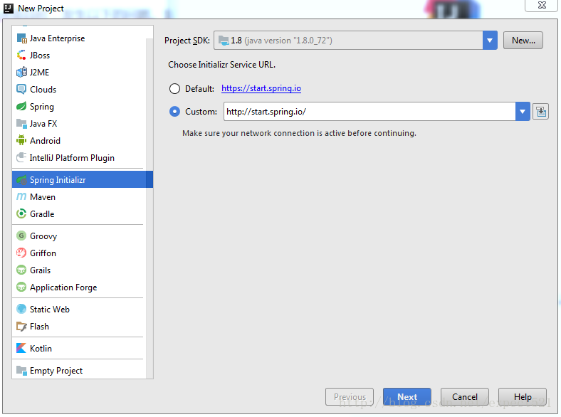
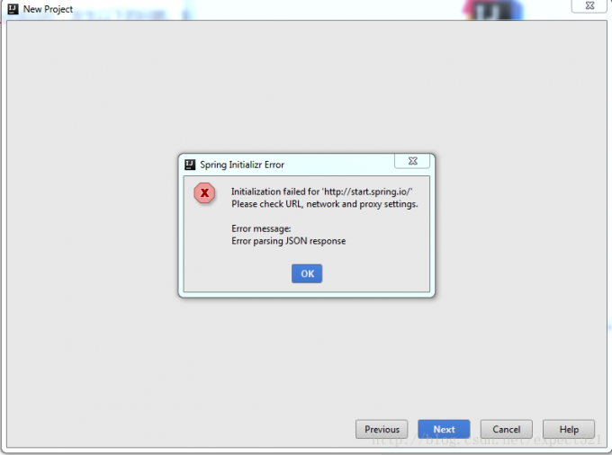
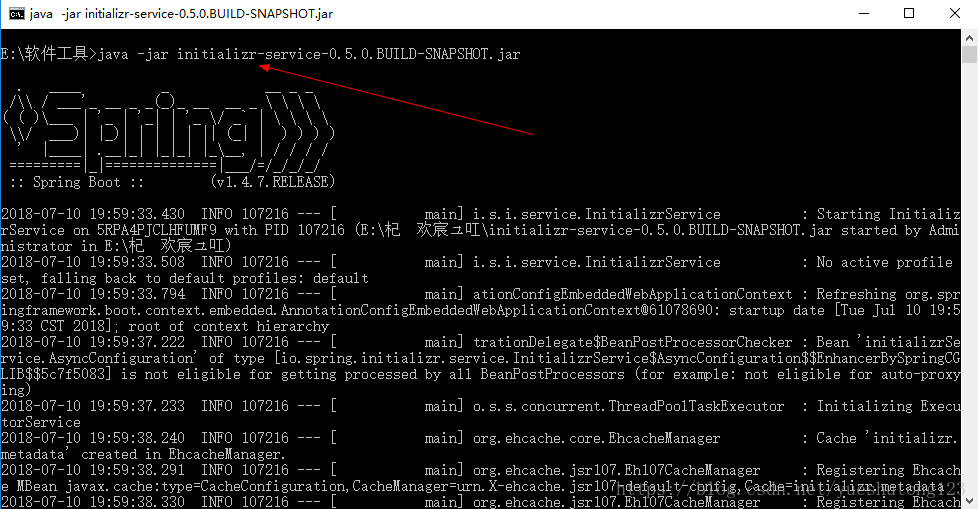
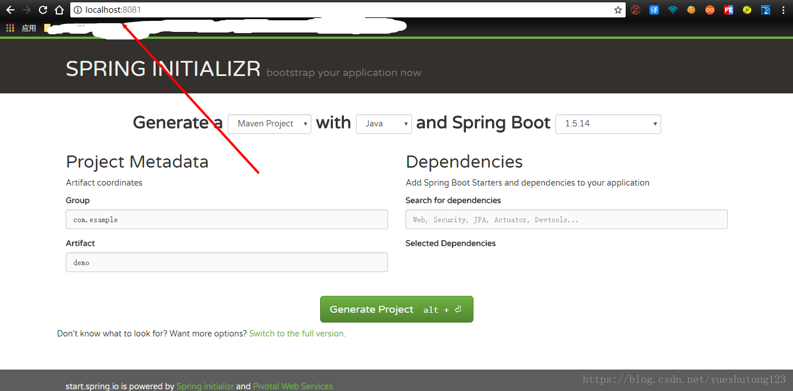
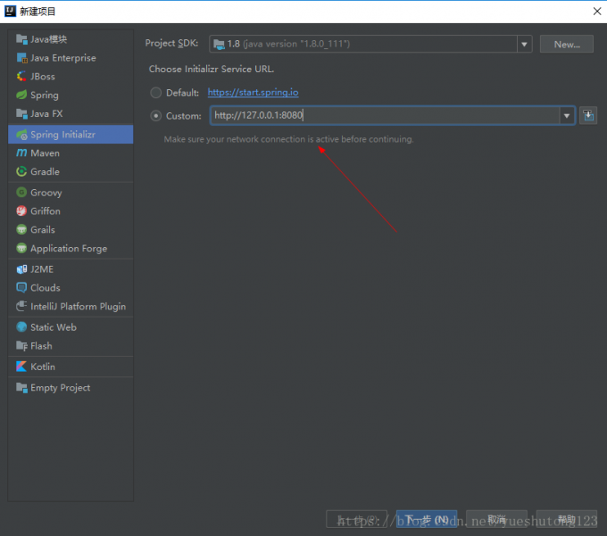

##### 通过IntellJ IDEA创建Spring Boot项目时，发生以下的问题。如图：

##### 报错：

##### 也许你搜到的都是诸如此类的回答：

>在学习springboot的时候，使用IDEA的快速新建springboot入门程序的时候，出现 
>  IDEA创建SpringBoot无法连接的错误， 
>  解决办法： 
>  进入到IDEA的setting  
>  搜索 HTTP Proxy  
>  选择Auto-detect proxy settings 
>  点击最下面的Check connection弹出如下的输入框，输入地址[https://start.spring.io](https://start.spring.io)点击ok，如果successful证明连接成功，重新生成一次，完美生成springboot项目

##### 但还是不成功，甚至浏览器打不开start.spring.io，一劳永逸的方法来了，spring官方提供了搭建本地服务器的方法，详情参考官方说明：[https://github.com/spring-io/initializr](https://github.com/spring-io/initializr)

##### 打开一看是英文，而且你鼓捣半天不一定成功，没事，我已经搭建好了可执行jar包给你下载使用！你只需要java -jar，如图：

##### 访问[http://localhost:8080/](http://localhost:8080/)

##### 在IDEA新建项目(此时请关闭IDEA代理)

#### 完美！

## 下载地址：[https://download.csdn.net/download/yueshutong123/10533392](https://download.csdn.net/download/yueshutong123/10533392)

