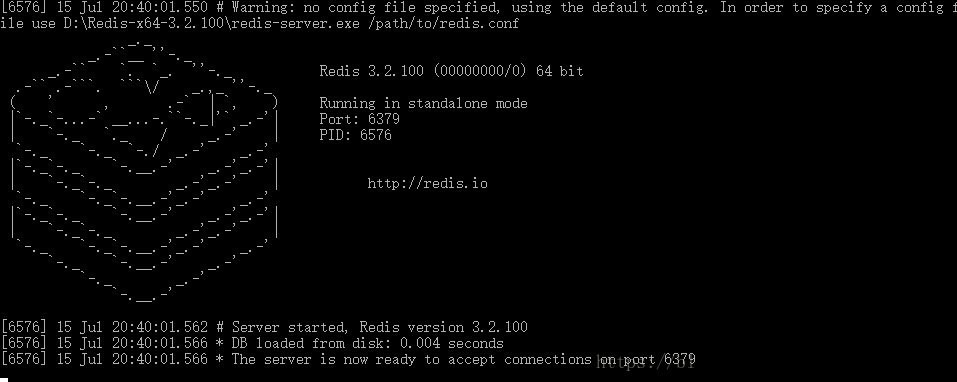

## 一：Spring缓存抽象

Spring从3.1开始定义了org.springframework.cache.Cache和org.springframework.cache.CacheManager接口来统一不同的缓存技术；并支持使用JCache（JSR-107）注解简化我们开发；

*  Cache接口为缓存的组件规范定义，包含缓存的各种操作集合；

*  Cache接口下Spring提供了各种xxxCache的实现；如RedisCache，EhCacheCache ,ConcurrentMapCache等；

*  每次调用需要缓存功能的方法时，Spring会检查检查指定参数的指定的目标方法是否已经被调用过；如果有就直接从缓存中获取方法调用后的结果，如果没有就调用方法并缓存结果后返回给用户。下次调用直接从缓存中获取。

*  使用Spring缓存抽象时我们需要关注以下两点；
   
   1、确定方法需要被缓存以及他们的缓存策略
   
   2、从缓存中读取之前缓存存储的数据

## 二：几个重要概念&缓存注解

|名称|解释|
|---|---|
|Cache|缓存接口，定义缓存操作。实现有：RedisCache、EhCacheCache、ConcurrentMapCache等|
|CacheManager|缓存管理器，管理各种缓存（cache）组件|
|@Cacheable|主要针对方法配置，能够根据方法的请求参数对其进行缓存|
|@CacheEvict|清空缓存|
|@CachePut|保证方法被调用，又希望结果被缓存。与@Cacheable区别在于是否每次都调用方法，常用于更新|
|@EnableCaching|开启基于注解的缓存|
|keyGenerator|缓存数据时key生成策略|
|serialize|缓存数据时value序列化策略|
|@CacheConfig|统一配置本类的缓存注解的属性|

**@Cacheable/@CachePut/@CacheEvict 主要的参数**

|名称|解释|
|---|---|
|value|缓存的名称，在 spring 配置文件中定义，必须指定至少一个例如：@Cacheable(value=&rdquo;mycache&rdquo;) 或者@Cacheable(value={&rdquo;cache1&rdquo;,&rdquo;cache2&rdquo;}|
|key|缓存的 key，可以为空，如果指定要按照 SpEL 表达式编写，如果不指定，则缺省按照方法的所有参数进行组合例如：@Cacheable(value=&rdquo;testcache&rdquo;,key=&rdquo;#id&rdquo;)|
|condition|缓存的条件，可以为空，使用 SpEL 编写，返回 true 或者 false，只有为 true 才进行缓存/清除缓存例如：@Cacheable(value=&rdquo;testcache&rdquo;,condition=&rdquo;#userName.length()>2&rdquo;)|
|unless|否定缓存。当条件结果为TRUE时，就不会缓存。@Cacheable(value=&rdquo;testcache&rdquo;,unless=&rdquo;#userName.length()>2&rdquo;)|
|allEntries(@CacheEvict )|是否清空所有缓存内容，缺省为 false，如果指定为 true，则方法调用后将立即清空所有缓存例如：@CachEvict(value=&rdquo;testcache&rdquo;,allEntries=true)|
|beforeInvocation(@CacheEvict)|是否在方法执行前就清空，缺省为 false，如果指定为 true，则在方法还没有执行的时候就清空缓存，缺省情况下，如果方法执行抛出异常，则不会清空缓存例如：@CachEvict(value=&rdquo;testcache&rdquo;，beforeInvocation=true)|

## 三：SpEL上下文数据

Spring Cache提供了一些供我们使用的SpEL上下文数据，下表直接摘自Spring官方文档：

|名称|位置|描述|示例|
|---|---|---|---|
|methodName|root对象|当前被调用的方法名|`#root.methodname`|
|method|root对象|当前被调用的方法|`#root.method.name`|
|target|root对象|当前被调用的目标对象实例|`#root.target`|
|targetClass|root对象|当前被调用的目标对象的类|`#root.targetClass`|
|args|root对象|当前被调用的方法的参数列表|`#root.args[0]`|
|caches|root对象|当前方法调用使用的缓存列表|`#root.caches[0].name`|
|Argument Name|执行上下文|当前被调用的方法的参数，如findArtisan(Artisan artisan),可以通过#artsian.id获得参数|`#artsian.id`|
|result|执行上下文|方法执行后的返回值（仅当方法执行后的判断有效，如 unless cacheEvict的beforeInvocation=false）|`#result`|

**注意：**

1.当我们要使用root对象的属性作为key时我们也可以将&ldquo;#root&rdquo;省略，因为Spring默认使用的就是root对象的属性。 如 

`@Cacheable(key = "targetClass + methodName +#p0")`

2.使用方法参数时我们可以直接使用&ldquo;#参数名&rdquo;或者&ldquo;#p参数index&rdquo;。 如：

`@Cacheable(value="users", key="#id")`

`@Cacheable(value="users", key="#p0")`

**SpEL提供了多种运算符**

|**类型**|**运算符**|
|---|---|
|关系|<，>，<=，>=，==，!=，lt，gt，le，ge，eq，ne|
|算术|+，- ，* ，/，%，^|
|逻辑|&&，||，!，and，or，not，between，instanceof|
|条件|?: (ternary)，?: (elvis)|
|正则表达式|matches|
|其他类型|?.，?[&hellip;]，![&hellip;]，^[&hellip;]，$[&hellip;]|

以上的知识点适合你遗忘的时候来查阅，下面正式进入学习！

## 四：开始使用

环境：Spring boot 2.0.3

IDE：IDEA

### 1.开始使用前需要导入依赖

```xml
<dependency>
    <groupId>org.springframework.boot</groupId>
    <artifactId>spring-boot-starter-cache</artifactId>
</dependency>
```

### 2.然后在启动类注解@EnableCaching开启缓存

```java
@SpringBootApplication
@EnableCaching  //开启缓存
public class DemoApplication{

    public static void main(String[] args) {
        SpringApplication.run(DemoApplication.class, args);
    }

}
```

### 3.缓存@Cacheable``

`@Cacheable`注解会先查询是否已经有缓存，有会使用缓存，没有则会执行方法并缓存。

```java
@Cacheable(value = "emp" ,key = "targetClass + methodName +#p0")
public List<NewJob> queryAll(User uid) {
    return newJobDao.findAllByUid(uid);
}
```

此处的`value`是必需的，它指定了你的缓存存放在哪块命名空间。

此处的`key`是使用的spEL表达式，参考上章。这里有一个小坑，如果你把`methodName`换成`method`运行会报错，观察它们的返回类型，原因在于`methodName`是`String`而`methoh`是`Method`。

此处的`User`实体类一定要实现序列化`public class User implements Serializable`，否则会报`java.io.NotSerializableException`异常。

到这里，你已经可以运行程序检验缓存功能是否实现。

**深入源码，查看它的其它属性**

我们打开`@Cacheable`注解的源码，可以看到该注解提供的其他属性，如：

```java
String[] cacheNames() default {}; //和value注解差不多，二选一
```

```java
String keyGenerator() default ""; //key的生成器。key/keyGenerator二选一使用
```

```java
String cacheManager() default ""; //指定缓存管理器
```

```java
String cacheResolver() default ""; //或者指定获取解析器
```

```java
String condition() default ""; //条件符合则缓存
```

```java
String unless() default ""; //条件符合则不缓存
```

```java
boolean sync() default false; //是否使用异步模式
```

### 4.配置@CacheConfig

当我们需要缓存的地方越来越多，你可以使用`@CacheConfig(cacheNames = {"myCache"})`注解来统一指定`value`的值，这时可省略`value`，如果你在你的方法依旧写上了`value`，那么依然以方法的`value`值为准。

使用方法如下：

```java
@CacheConfig(cacheNames = {"myCache"})
public class BotRelationServiceImpl implements BotRelationService {
    @Override
    @Cacheable(key = "targetClass + methodName +#p0")//此处没写value
    public List<BotRelation> findAllLimit(int num) {
        return botRelationRepository.findAllLimit(num);
    }
    .....
}
```

**查看它的其它属性**

```java
String keyGenerator() default "";  //key的生成器。key/keyGenerator二选一使用
```

```java
String cacheManager() default "";  //指定缓存管理器
```

```java
String cacheResolver() default ""; //或者指定获取解析器
```

### 5.更新@CachePut

`@CachePut`注解的作用 主要针对方法配置，能够根据方法的请求参数对其结果进行缓存，和 `@Cacheable` 不同的是，它每次都会触发真实方法的调用 。简单来说就是用户更新缓存数据。但需要注意的是该注解的`value` 和 `key` 必须与要更新的缓存相同，也就是与`@Cacheable` 相同。示例：

```java
@CachePut(value = "emp", key = "targetClass + #p0")
public NewJob updata(NewJob job) {
    NewJob newJob = newJobDao.findAllById(job.getId());
    newJob.updata(job);
    return job;
}

@Cacheable(value = "emp", key = "targetClass +#p0")//清空缓存
public NewJob save(NewJob job) {
    newJobDao.save(job);
    return job;
}
```

**查看它的其它属性**

```java
String[] cacheNames() default {}; //与value二选一
```

```java
String keyGenerator() default "";  //key的生成器。key/keyGenerator二选一使用
```

```java
String cacheManager() default "";  //指定缓存管理器
```

```java
String cacheResolver() default ""; //或者指定获取解析器
```

```java
String condition() default ""; //条件符合则缓存
```

```java
String unless() default ""; //条件符合则不缓存
```

### 6.清除@CacheEvict

`@CachEvict` 的作用 主要针对方法配置，能够根据一定的条件对缓存进行清空 。

|属性|解释|示例|
|---|---|---|
|allEntries|是否清空所有缓存内容，缺省为 false，如果指定为 true，则方法调用后将立即清空所有缓存|@CachEvict(value=&rdquo;testcache&rdquo;,allEntries=true)|
|beforeInvocation|是否在方法执行前就清空，缺省为 false，如果指定为 true，则在方法还没有执行的时候就清空缓存，缺省情况下，如果方法执行抛出异常，则不会清空缓存|@CachEvict(value=&rdquo;testcache&rdquo;，beforeInvocation=true)|

示例：

```java
@Cacheable(value = "emp",key = "#p0.id")
public NewJob save(NewJob job) {
    newJobDao.save(job);
    return job;
}

//清除一条缓存，key为要清空的数据
@CacheEvict(value="emp",key="#id")
public void delect(int id) {
    newJobDao.deleteAllById(id);
}

//方法调用后清空所有缓存
@CacheEvict(value="accountCache",allEntries=true)
public void delectAll() {
    newJobDao.deleteAll();
}

//方法调用前清空所有缓存
@CacheEvict(value="accountCache",beforeInvocation=true)
public void delectAll() {
    newJobDao.deleteAll();
}
```

**其他属性**

```java
String[] cacheNames() default {}; //与value二选一
```

```java
String keyGenerator() default "";  //key的生成器。key/keyGenerator二选一使用
```

```java
String cacheManager() default "";  //指定缓存管理器
```

```java
String cacheResolver() default ""; //或者指定获取解析器
```

```java
String condition() default ""; //条件符合则清空
```

### 7.组合@Caching

有时候我们可能组合多个Cache注解使用，此时就需要@Caching组合多个注解标签了。

```java
@Caching(cacheable = {
        @Cacheable(value = "emp",key = "#p0"),
        ...
},
put = {
        @CachePut(value = "emp",key = "#p0"),
        ...
},evict = {
        @CacheEvict(value = "emp",key = "#p0"),
        ....
})
public User save(User user) {
    ....
}
```

下面讲到的整合第三方缓存组件都是基于上面的已经完成的步骤，所以一个应用要先做好你的缓存逻辑，再来整合其他cache组件。

## 五：整合EHCACHE

Ehcache是一种广泛使用的开源Java分布式缓存。主要面向通用缓存,Java EE和轻量级容器。它具有内存和磁盘存储，缓存加载器,缓存扩展,缓存异常处理程序,一个gzip缓存servlet过滤器,支持REST和SOAP api等特点。

### 1.导入依赖

整合ehcache必须要导入它的依赖。

```xml
<dependency>
    <groupId>net.sf.ehcache</groupId>
    <artifactId>ehcache</artifactId>
</dependency>

<dependency>
    <groupId>org.springframework.boot</groupId>
    <artifactId>spring-boot-starter-cache</artifactId>
</dependency>
```

### 2.yml配置

需要说明的是`config: classpath:/ehcache.xml`可以不用写，因为默认就是这个路径。但`ehcache.xml`必须有。

```yaml
spring:
  cache:
    type: ehcache
    ehcache:
      config: classpath:/ehcache.xml
```

### 3.ehcache.xml

在resources目录下新建ehcache.xml，注释啥的应该可以说相当详细了

```xml
<ehcache>

    <!--
        磁盘存储:将缓存中暂时不使用的对象,转移到硬盘,类似于Windows系统的虚拟内存
        path:指定在硬盘上存储对象的路径
        path可以配置的目录有：
            user.home（用户的家目录）
            user.dir（用户当前的工作目录）
            java.io.tmpdir（默认的临时目录）
            ehcache.disk.store.dir（ehcache的配置目录）
            绝对路径（如：d:\\ehcache）
        查看路径方法：String tmpDir = System.getProperty("java.io.tmpdir");
     -->
    <diskStore path="java.io.tmpdir" />

    <!--
        defaultCache:默认的缓存配置信息,如果不加特殊说明,则所有对象按照此配置项处理
        maxElementsInMemory:设置了缓存的上限,最多存储多少个记录对象
        eternal:代表对象是否永不过期 (指定true则下面两项配置需为0无限期)
        timeToIdleSeconds:最大的发呆时间 /秒
        timeToLiveSeconds:最大的存活时间 /秒
        overflowToDisk:是否允许对象被写入到磁盘
        说明：下列配置自缓存建立起600秒(10分钟)有效 。
        在有效的600秒(10分钟)内，如果连续120秒(2分钟)未访问缓存，则缓存失效。
        就算有访问，也只会存活600秒。
     -->
    <defaultCache maxElementsInMemory="10000" eternal="false"
                  timeToIdleSeconds="600" timeToLiveSeconds="600" overflowToDisk="true" />

    <cache name="myCache" maxElementsInMemory="10000" eternal="false"
                  timeToIdleSeconds="120" timeToLiveSeconds="600" overflowToDisk="true" />

</ehcache>
```

### 4.使用缓存

`@CacheConfig(cacheNames = {&ldquo;myCache&rdquo;})`设置ehcache的名称，这个名称必须在ehcache.xml已配置 。

```java
@CacheConfig(cacheNames = {"myCache"})
public class BotRelationServiceImpl implements BotRelationService {

    @Cacheable(key = "targetClass + methodName +#p0")
    public List<BotRelation> findAllLimit(int num) {
        return botRelationRepository.findAllLimit(num);
    }

}
```

整合完毕！

别忘了在启动类开启缓存！

## 六：整合Redis

**Redis 优势**

*  性能极高 &ndash; Redis能读的速度是110000次/s,写的速度是81000次/s 。
*  丰富的数据类型 &ndash; Redis支持二进制案例的 Strings, Lists, Hashes, Sets 及 Ordered Sets 数据类型操作。
*  原子 &ndash; Redis的所有操作都是原子性的，意思就是要么成功执行要么失败完全不执行。单个操作是原子性的。多个操作也支持事务，即原子性，通过MULTI和EXEC指令包起来。
*  丰富的特性 &ndash; Redis还支持 publish/subscribe, 通知, key 过期等等特性

### 1.启动Redis

下载地址：[https://github.com/MicrosoftArchive/redis/releases](https://github.com/MicrosoftArchive/redis/releases) 


### 2.导入依赖

就只需要这一个依赖！不需要`spring-boot-starter-cache`

```xml
<dependency>
     <groupId>org.springframework.boot</groupId>
     <artifactId>spring-boot-starter-data-redis</artifactId>
</dependency>
```

当你导入这一个依赖时，SpringBoot的CacheManager就会使用RedisCache。

如果你的Redis使用默认配置，这时候已经可以启动程序了。

### 3.配置Redis

```properties
# Redis数据库索引（默认为0）
spring.redis.database=1
# Redis服务器地址
spring.redis.host=127.0.0.1
# Redis服务器连接端口
spring.redis.port=6379
# Redis服务器连接密码（默认为空）
spring.redis.password=
# 连接池最大连接数（使用负值表示没有限制）
spring.redis.pool.max-active=1000
# 连接池最大阻塞等待时间（使用负值表示没有限制）
spring.redis.pool.max-wait=-1
# 连接池中的最大空闲连接
spring.redis.pool.max-idle=10
# 连接池中的最小空闲连接
spring.redis.pool.min-idle=2
# 连接超时时间（毫秒）
spring.redis.timeout=0
```

### 4.模板编程

除了使用注解，我们还可以使用Redis模板。 
Spring boot集成 Redis 客户端jedis。封装Redis 连接池，以及操作模板。 

```java
@Autowired
private StringRedisTemplate stringRedisTemplate;//操作key-value都是字符串

@Autowired
private RedisTemplate redisTemplate;//操作key-value都是对象

/**
 *  Redis常见的五大数据类型：
 *  stringRedisTemplate.opsForValue();[String(字符串)]
 *  stringRedisTemplate.opsForList();[List(列表)]
 *  stringRedisTemplate.opsForSet();[Set(集合)]
 *  stringRedisTemplate.opsForHash();[Hash(散列)]
 *  stringRedisTemplate.opsForZSet();[ZSet(有序集合)]
 */
public void test(){
    stringRedisTemplate.opsForValue().append("msg","hello");
}
```