## 一：RabbitMQ简介

### RabbitMQ介绍

RabbitMQ 即一个消息队列，主要是用来实现应用程序的异步和解耦，同时也能起到消息缓冲，消息分发的作用。

消息中间件最主要的作用是解耦，中间件最标准的用法是生产者生产消息传送到队列，消费者从队列中拿取消息并处理，生产者不用关心是谁来消费，消费者不用关心谁在生产消息，从而达到解耦的目的。在分布式的系统中，消息队列也会被用在很多其它的方面，比如：分布式事务的支持，RPC的调用等等。

RabbitMQ是实现AMQP（高级消息队列协议）的消息中间件的一种，最初起源于金融系统，用于在分布式系统中存储转发消息，在易用性、扩展性、高可用性等方面表现不俗。RabbitMQ主要是为了实现系统之间的双向解耦而实现的。当生产者大量产生数据时，消费者无法快速消费，那么需要一个中间层。保存这个数据。

AMQP，即Advanced Message Queuing Protocol，高级消息队列协议，是应用层协议的一个开放标准，为面向消息的中间件设计。消息中间件主要用于组件之间的解耦，消息的发送者无需知道消息使用者的存在，反之亦然。AMQP的主要特征是面向消息、队列、路由（包括点对点和发布/订阅）、可靠性、安全。

RabbitMQ是一个开源的AMQP实现，服务器端用Erlang语言编写，支持多种客户端，如：Python、Ruby、.NET、Java、JMS、C、PHP、ActionScript、XMPP、STOMP等，支持AJAX。

### 运行机制

通常我们谈到队列服务, 会有三个概念： 发消息者、队列、收消息者，RabbitMQ 在这个基本概念之上, 多做了一层抽象, 在发消息者和 队列之间, 加入了交换器 (Exchange). 这样发消息者和队列就没有直接联系, 转而变成发消息者把消息给交换器, 交换器根据调度策略再把消息再给队列。

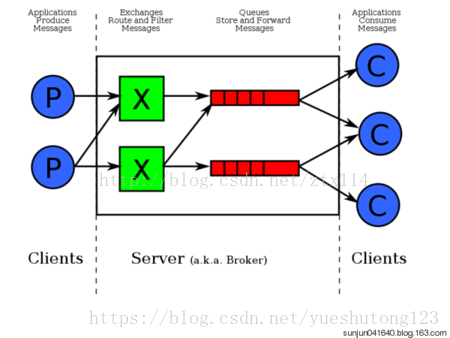

*  左侧 P 代表 生产者，也就是往 RabbitMQ 发消息的程序。
*  中间即是 RabbitMQ，*其中包括了 交换机 和 队列。*
*  右侧 C 代表 消费者，也就是往 RabbitMQ 拿消息的程序。

那么，*其中比较重要的概念有 4 个，分别为：虚拟主机，交换机，队列，和绑定。*

*  虚拟主机：一个虚拟主机持有一组交换机、队列和绑定。为什么需要多个虚拟主机呢？很简单，RabbitMQ当中，*用户只能在虚拟主机的粒度进行权限控制。* 因此，如果需要禁止A组访问B组的交换机/队列/绑定，必须为A和B分别创建一个虚拟主机。每一个RabbitMQ服务器都有一个默认的虚拟主机&ldquo;/&rdquo;。
*  交换机：*Exchange 用于转发消息，但是它不会做存储* ，如果没有 Queue bind 到 Exchange 的话，它会直接丢弃掉 Producer 发送过来的消息。 这里有一个比较重要的概念：**路由键（routing_key）** 。消息到交换机的时候，交互机会转发到对应的队列中，那么究竟转发到哪个队列，就要根据该路由键。
*  绑定：也就是交换机需要和队列相绑定，这其中如上图所示，是多对多的关系。

### 交换机

交换机的功能主要是接收消息并且转发到绑定的队列，交换机不存储消息，在启用ack模式后，交换机找不到队列会返回错误。交换机有四种类型：Direct, topic, Headers and Fanout

*  Direct：direct 类型的行为是&rdquo;先匹配, 再投送&rdquo;. 即在绑定时设定一个 **routing_key**, 消息的**routing_key** 匹配时, 才会被交换器投送到绑定的队列中去.
*  Topic：按规则转发消息（最灵活）
*  Headers：设置header attribute参数类型的交换机
*  Fanout：转发消息到所有绑定队列（广播：忽略routing_key ）

### 一句话总结

RabbitMQ简单来说，就是生产者发送消息到虚拟主机，虚拟主机把消息交给指定的交换机，交换机按照规则扔给消息队列进行存储，消息队列等待消费者来消费。

由此我想到了商品买卖：厂家生产商品卖给批发部，批发部交给指定的超市出售，超市按照售价摆放在门店，并等待顾客上门购买。

完美~~

## 二：RabbitMQ安装

因为RabbitMQ是由erlang语言写的，就像Java程序需要jdk环境一样，运行RabbitMQ也需要erlang环境。

### 1.安装erlang

环境：Centos7.4

下载地址：[http://erlang.org/download/](http://erlang.org/download/)

在Linux终端运行命令行

下载：

```java
wget http://erlang.org/download/otp_src_18.3.tar.gz
```

下载一定要认准**otp_src_**字样。

解压：

```java
tar -zxvf otp_src_18.3.tar.gz
```

进入解压后的根目录：

```java
./configure --prefix=/usr/local/erlang --enable-hipe --enable-threads --enable-smp-support --enable-kernel-poll --without-javac
```

```java
make && make install 
```

上面有点慢。

把erlang加入环境变量：

```
vi /etc/profile
```

```java
export ERLANG=/usr/local/erlang/erlang
export PATH=$ERLANG/bin:$PATH
```

使环境变量生效

```java
source /etc/profile
```

然后，我们测试下是否安装成功：

```java
[root@yueshutong ~]# erl
Erlang/OTP 18 [erts-7.3] [source] [64-bit] [async-threads:10] [hipe] [kernel-poll:false]

Eshell V7.3  (abort with ^G)
1>
```

### 2.安装RabbitMQ

下载地址：[http://www.rabbitmq.com/releases/rabbitmq-server/v3.6.1/](http://www.rabbitmq.com/releases/rabbitmq-server/v3.6.1/)

下载：

```java
wget http://www.rabbitmq.com/releases/rabbitmq-server/v3.6.1/rabbitmq-server-generic-unix-3.6.1.tar.xz
```

对于下载xz包进行解压，首先先下载xz压缩工具：

```java
yum install xz
```

对rabbitmq包进行解压：

```java
xz -d xz -d rabbitmq-server-generic-unix-3.6.1.tar.xz
```

```java
tar -xvf rabbitmq-server-generic-unix-3.6.1.tar
```

随后在`sbin`目录启用MQ管理方式：

```java
./rabbitmq-plugins enable rabbitmq_management   #启动后台管理
```

```java
./rabbitmq-server -detached #后台运行rabbitmq
```

添加用户和权限 默认网页guest用户是不允许访问的，需要增加一个用户修改一下权限，代码如下：

添加用户:

```
./rabbitmqctl add_user admin admin 
```

添加权限:

```java
./rabbitmqctl set_permissions -p "/" admin ".*" ".*" ".*"  
```

修改用户角色:

```java
./rabbitmqctl set_user_tags admin administrator  
```

然后就可以远程访问了，然后可直接配置用户权限等信息。

**验证**

访问[http://localhost:15672/](http://localhost:15672/)，输入admin用户密码，登录成功！

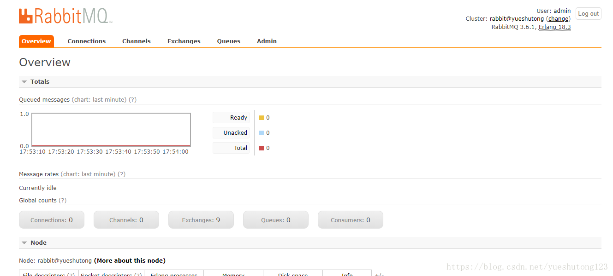

## 三：整合Spring Boot

新建一个1.5版本的Spring boot项目，选择rabbitmq+web模块。

### 1.导入依赖

```xml
<dependency>
    <groupId>org.springframework.boot</groupId>
    <artifactId>spring-boot-starter-amqp</artifactId>
</dependency>
```

### 2.yml配置rabbitmq

`virtual-host: /` 默认就是斜杠，具体查看rabbitmq后台admin栏。如果默认这行不用写。

```java
spring:
  rabbitmq:
    host: 127.0.0.1
    username: admin
    password: admin
    virtual-host: / #可以不用写
```

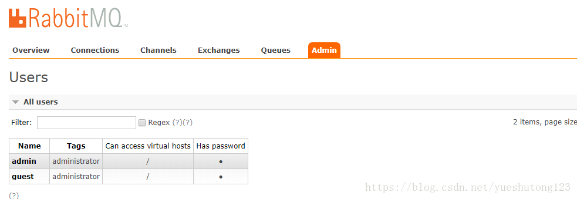

### 3.发送direct消息

direct 类型的行为是&rdquo;先匹配, 再投送&rdquo;. 即在绑定时设定一个 **routing_key**, 消息的**routing_key** 匹配时, 才会被交换器投送到绑定的队列中去.

1.我们在RabbitMQ后台新建一个交换机，`demo-direct`交换机名，`direct`交换机类型，`Durable`持久化： 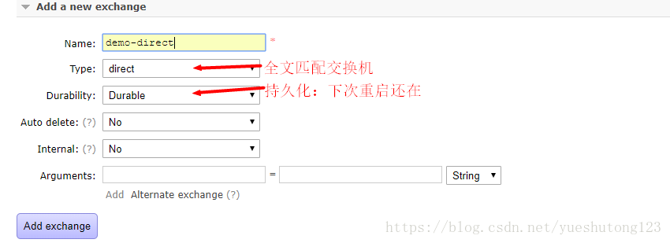


2.再新建一个消息队列，取名为`demo`：

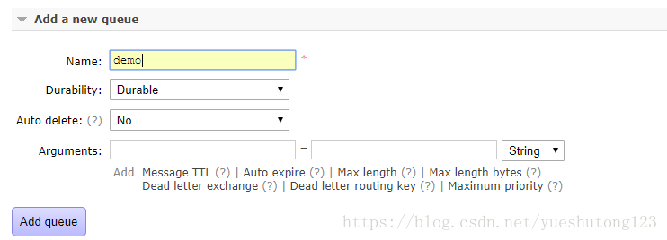

3.点击`demo-direct`交换机进入绑定消息队列`demo`：

如果没有指定routingkey，**消息队列的名称就是routingkey** 

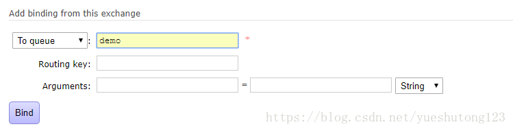

4.绑定成功后查看：

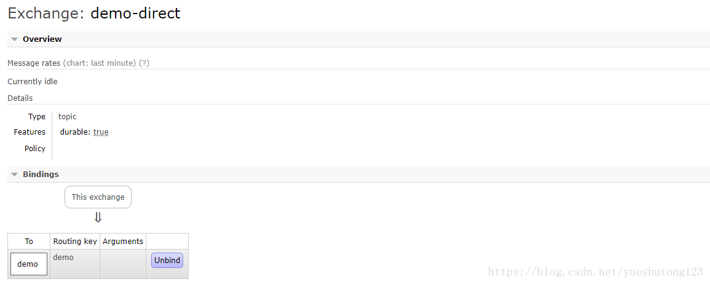

你可以直接在交换机页面下方的`Publish message`发送消息，在消息队列的`Get message`查看消息，不过我们实际生产比较多使用编程：

**在Spring Boot创建单元测试**

`demo-direct`交换机名

`demo`是该交换机绑定的消息队列名

**发送消息**

```java
    @Autowired
    RabbitTemplate rabbitTemplate;

    @Test
    public void contextLoads() {
       //message需要自己构造一个，定义消息体内容和消息体
       //rabbitTemplate.send(exchange,routingkey,message);
       Map map = new HashMap();
       map.put("key","值");
       map.put("msg",true);
       //对象被默认序列化后发送
       rabbitTemplate.convertAndSend("demo-direct","demo",map);
    }
```

此时发送消息我们在rabbitmq网页发现消息是经序列化后的，我们如果想改变序列化机制为JSON，也很简单，只需要注入一个人Bean：

```java
@Configuration
public class MyAMQPConfig {
    @Bean
    public MessageConverter messageConverter(){
        return new Jackson2JsonMessageConverter();
    }
}
```

然后我们再启动测试，发送。

**接收消息**

`demo`是消息队列名，也就是消费者只需要得到消息队列的名字就可以接收队列中的消息。

```java
    @Test
    public void receive(){
        Object o = rabbitTemplate.receiveAndConvert("demo");
        System.out.println(o.getClass());
        System.out.println(o);
    }
```

查看打印

```java
class java.util.HashMap
{msg=true, key=值}
```

### 4.广播fanout消息

转发消息到所有绑定队列（广播：忽略routing_key ）

1.首先我们需要在RabbitMQ后台创建一个广播交换机：

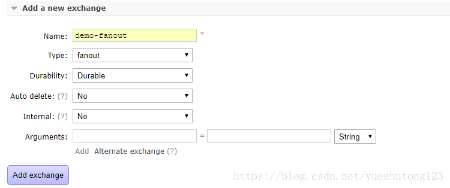

2.再创建一些（demo1，demo2）消息队列，以一个作为演示：

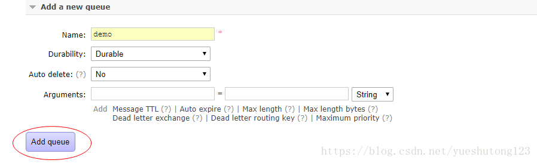

3.进入创建的交换机页面：

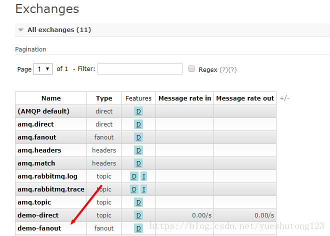

4.交换机与消息队列（demo1,demo2）进行绑定：

如果没有指定routingkey，**消息队列的名称就是routingkey** 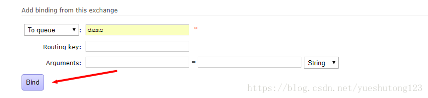

**在Spring Boot创建单元测试**

注意在广播模式下会忽略忽略routing_key 

**发送消息**

```java
    @Autowired
    RabbitTemplate rabbitTemplate;

    @Test
    public void send() {
        Book book = new Book();
        book.setName("<西游记>");
        book.setAnthony("吴承恩");
        //对象被默认序列化后发送
        rabbitTemplate.convertAndSend("demo-fanout","",book);
    }
```

**接收消息**

```java
    @Test
    public void receive(){
        Object o = rabbitTemplate.receiveAndConvert("demo");
        System.out.println(o.getClass());
        System.out.println(o);
    }
```

打印输出：

```java
class cn.zyzpp.rabbitmq.entity.Book
Book{name='<西游记>', anthony='吴承恩'}
```

### 5.发送topic消息

按规则转发消息（使用通配符）

1.在rabbitmq后台新建一个topic交换机

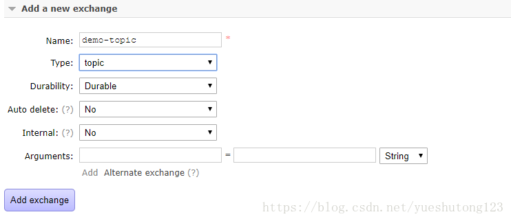

2.新建一个消息队列`demo`

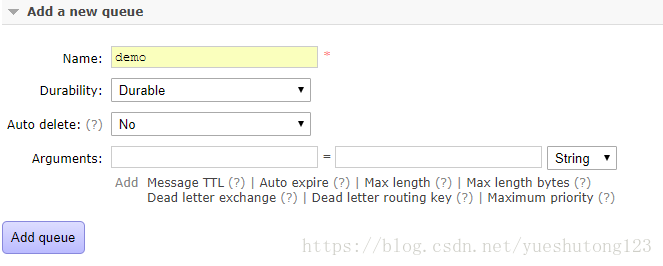

3.交换机绑定消息队列，注意此处的**路由键Routing key**使用了通配符

*  `*`表示一个词.
*  `#`表示零个或多个词.

那我们如何区分几个字母为一个单词呢？

答案是通过&rdquo;点分&rdquo;的 routing_key 形式，比如两个单词是 `*.demo` `hello.demo`，

如果路由键为`demo.#`,那可以匹配`demo.`开头的所有路由键。

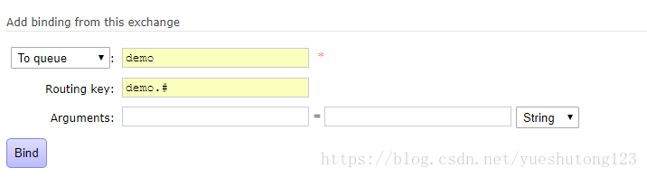

4.查看此时的交换机

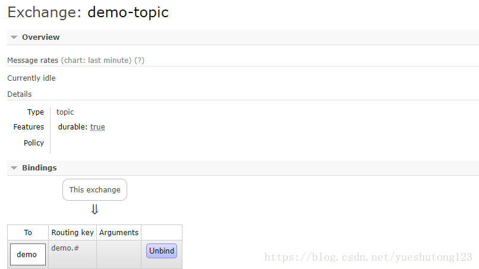

**在Spring Boot创建单元测试**

**发送消息**

```java
    @Test
    public void contextLoads() {
        //message需要自己构造一个，定义消息体内容和消息体
        //rabbitTemplate.send(exchange,routingkey,message);
        Map map = new HashMap();
        map.put("key","topic交换机");
        map.put("msg",true);
        //对象被默认序列化后发送
        rabbitTemplate.convertAndSend("demo-topic","demo.hello",map);
    }
```

**接收消息**

```java
    @Test
    public void receive(){
        Object o = rabbitTemplate.receiveAndConvert("demo");
        System.out.println(o.getClass());
        System.out.println(o);
    }
```

打印输出

```java
class java.util.HashMap
{msg=true, key=topic交换机}
```

### 6.代码创建交换机与消息队列

1.上面演示的是通过RabbitMQ网页后台创建，通过编程的方式也非常简单：

```java
    @Autowired
    AmqpAdmin amqpAdmin;

    /**
     * 代码创建交换机与消息队列并绑定
     */
    @Test
    public void createExChange(){
//        new TopicExchange("topic.exChange");
//        new FanoutExchange("fanout.exChange");
        amqpAdmin.declareExchange(new DirectExchange("amqp.exChange"));//创建交换机（remove为删除交换机）
        System.out.println("单播交换机创建完成");
        amqpAdmin.declareQueue(new Queue("amqp.queue",true)); //创建消息队列
        amqpAdmin.declareBinding(new Binding("amqp.queue",
                Binding.DestinationType.QUEUE,"amqp.exChange","amqp.exChange",null));//绑定
    }
```

2.登录后台查看，创建成功！

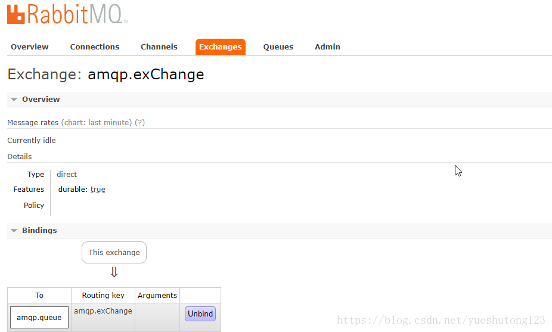

### 7.监听消息队列

监听消息队列，当有消息发到消息队列，立马获取并操作。方法也很简单。

1.开启基于注解的Rabbit模式

```java
@EnableRabbit   //开启基于注解的Rabbit模式
@SpringBootApplication
public class RabbitmqApplication {

    public static void main(String[] args) {
        SpringApplication.run(RabbitmqApplication.class, args);
    }
}
```

2.@RabbitListener注解实现监听

注意此时你的消息队列已经有了`demo`和`demo.news`

```java
@Service
public class BookService {

    @RabbitListener(queues = "demo")
    public void receive(Book book){
        System.out.println("收到消息："+ book);
    }

    @RabbitListener(queues = "demo.news")
    public void receiveMess(Message message){
        System.out.println("收到消息："+ message);
        System.out.println(message.getBody()); //getBody返回的byte[]字节数组
        System.out.println(message.getMessageProperties());
    }
}
```

然后我们在开启主程序时再运行测试用例：

**测试用例**

```java
    @Test
    public void send() {
        Book book = new Book();
        book.setName("<西游记>");
        book.setAnthony("吴承恩");
        //对象被默认序列化后发送
        rabbitTemplate.convertAndSend("demo-fanout","",book);
    }
```

**查看主控制台打印**

```java
收到消息：Book{name='<西游记>', anthony='吴承恩'}
```

**测试用例**

```java
    @Test
    public void contextLoads() {
        //message需要自己构造一个，定义消息体内容和消息体
        //rabbitTemplate.send(exchange,routingkey,message);
        Map map = new HashMap();
        map.put("key","topic交换机");
        map.put("msg",true);
        //对象被默认序列化后发送
        rabbitTemplate.convertAndSend("demo-topic","demo.hello",map);
    }
```

**查看主控制台打印**

```java
收到消息：(Body:'{"msg":true,"key":"topic交换机"}' MessageProperties [headers={__ContentTypeId__=java.lang.Object, __KeyTypeId__=java.lang.Object, __TypeId__=java.util.HashMap}, timestamp=null, messageId=null, userId=null, receivedUserId=null, appId=null, clusterId=null, type=null, correlationId=null, correlationIdString=null, replyTo=null, contentType=application/json, contentEncoding=UTF-8, contentLength=0, deliveryMode=null, receivedDeliveryMode=PERSISTENT, expiration=null, priority=0, redelivered=false, receivedExchange=demo-topic, receivedRoutingKey=demo.hello, receivedDelay=null, deliveryTag=1, messageCount=0, consumerTag=amq.ctag-KRZh2DyNETjEaGSH0JZ2dA, consumerQueue=demo.news])
[B@5332f99e
MessageProperties [headers={__ContentTypeId__=java.lang.Object, __KeyTypeId__=java.lang.Object, __TypeId__=java.util.HashMap}, timestamp=null, messageId=null, userId=null, receivedUserId=null, appId=null, clusterId=null, type=null, correlationId=null, correlationIdString=null, replyTo=null, contentType=application/json, contentEncoding=UTF-8, contentLength=0, deliveryMode=null, receivedDeliveryMode=PERSISTENT, expiration=null, priority=0, redelivered=false, receivedExchange=demo-topic, receivedRoutingKey=demo.hello, receivedDelay=null, deliveryTag=1, messageCount=0, consumerTag=amq.ctag-KRZh2DyNETjEaGSH0JZ2dA, consumerQueue=demo.news]
```


