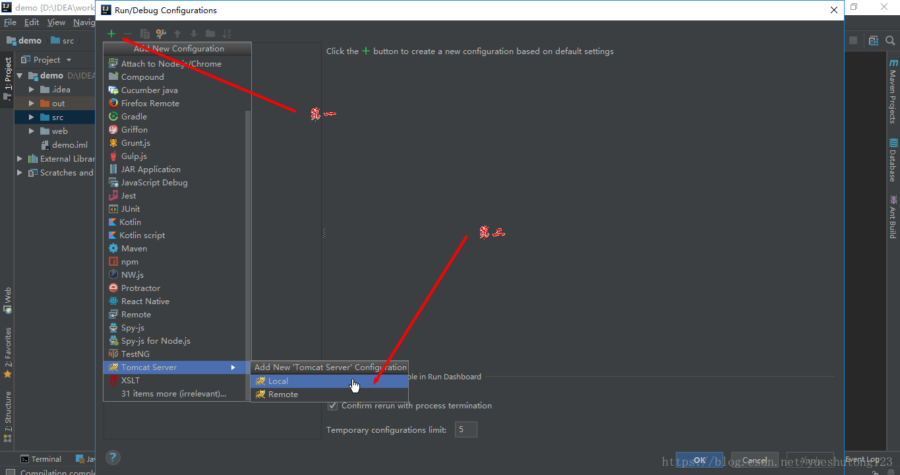

打开你的IDEA，跟着我走！

### 第一步：新建项目

### 第二步：找到Artifacts

点击绿色的+号，如图所示，点一下 
这一步很关键，目的是设置输出格式为`war`包，如果你的项目中已经有了，那就不需要再建了。有没有看右上角的`Type`

### 第三步：新建Tomcat

Tomcat关联输出的war包，这样我们就构建好了！右上角切换tomcat运行项目。 
在上面配置Tomcat时可以手动设置路径, 类似[http://localhost:8080/demo](http://localhost:8080/demo)，但我们刚刚并没有配置，所以运行时，你会发现你的war包被解压到Tomcat安装目录下的webapps目录下的ROOT里。

### 第四步：查看war包

当我们启动程序后，就可以找到程序为我们打好的war包

举一反三，在使用Maven方式构建webApp项目时，该方法同样适用！