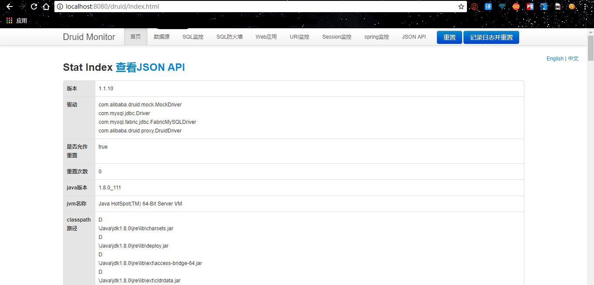

## 一：Druid介绍

### 1. Druid是什么？

Druid是Java语言中最好的数据库连接池。Druid能够提供强大的监控和扩展功能。

### 2. 在哪里下载druid

- 正式版本下载：
  maven中央仓库: <http://central.maven.org/maven2/com/alibaba/druid/> 

### 3. 怎么获取Druid的源码

Druid是一个开源项目，源码托管在github上，源代码仓库地址是 <https://github.com/alibaba/druid>。同时每次Druid发布正式版本和快照的时候，都会把源码打包，你可以从上面的下载地址中找到相关版本的源码


## 二：SpringBoot集成

首先在你的SpringBoot项目导入依赖

### 1.导入依赖

```java
<dependency>
    <groupId>com.alibaba</groupId>
    <artifactId>druid</artifactId>
    <version>1.1.10</version>
</dependency>
<dependency>
	<groupId>mysql</groupId>
	<artifactId>mysql-connector-java</artifactId>
	<scope>runtime</scope>
</dependency>
```

### 2.配置数据源与连接池

```java
spring:
  datasource:
    driver-class-name: com.mysql.jdbc.Driver
    url: jdbc:mysql://localhost:3306/user?useUnicode=true&characterEncoding=utf-8&useSSL=false
    username: root
    password: 123456
    type: com.alibaba.druid.pool.DruidDataSource
#   数据源其他配置
    initialSize: 5
    minIdle: 5
    maxActive: 20
    maxWait: 60000
    timeBetweenEvictionRunsMillis: 60000
    minEvictableIdleTimeMillis: 300000
    validationQuery: SELECT 1 FROM DUAL
    testWhileIdle: true
    testOnBorrow: false
    testOnReturn: false
    poolPreparedStatements: true
#   配置监控统计拦截的filters，去掉后监控界面sql无法统计，'wall'用于防火墙
    filters: stat,wall,log4j
    maxPoolPreparedStatementPerConnectionSize: 20
    useGlobalDataSourceStat: true
    connectionProperties: druid.stat.mergeSql=true;druid.stat.slowSqlMillis=500
```

### 3.注入DataSource

```java
@Configuration
public class DruidConfig {
    @ConfigurationProperties(prefix = "spring.datasource")
    @Bean
    public DataSource druid() {
        return new DruidDataSource();
    }

    //配置Druid的监控
    // 1、配置一个管理后台的Servlet
    @Bean
    public ServletRegistrationBean statViewServlet() {
        //配置参数参考ResourceServlet类
        ServletRegistrationBean bean = new ServletRegistrationBean(new StatViewServlet(), "/druid/*");
        Map<String, String> initParams = new HashMap<>();
        initParams.put("loginUsername", "admin");
        initParams.put("loginPassword", "123456");
        initParams.put("allow", "");//默认就是允许所有访问
        initParams.put("deny", "192.168.15.21");//拒绝谁
        bean.setInitParameters(initParams);
        return bean;
    }

    //2、配置一个web监控的filter
    @Bean
    public FilterRegistrationBean webStatFilter() {
        FilterRegistrationBean bean = new FilterRegistrationBean();
        bean.setFilter(new WebStatFilter());
        Map<String, String> initParams = new HashMap<>();
        initParams.put("exclusions", "*.js,*.css,/druid/*");
        bean.setInitParameters(initParams);
        bean.setUrlPatterns(Arrays.asList("/*"));
        return bean;
    }
}
```

### 4.启动应用

访问http://localhost:8080/druid体验强大的Druid！


> 官方Spring boot集成文档：https://github.com/alibaba/druid/tree/master/druid-spring-boot-starter