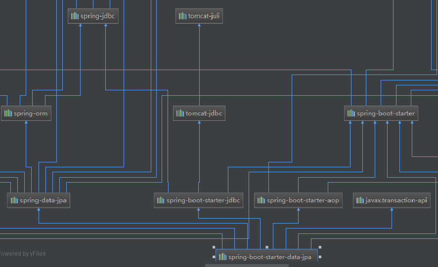
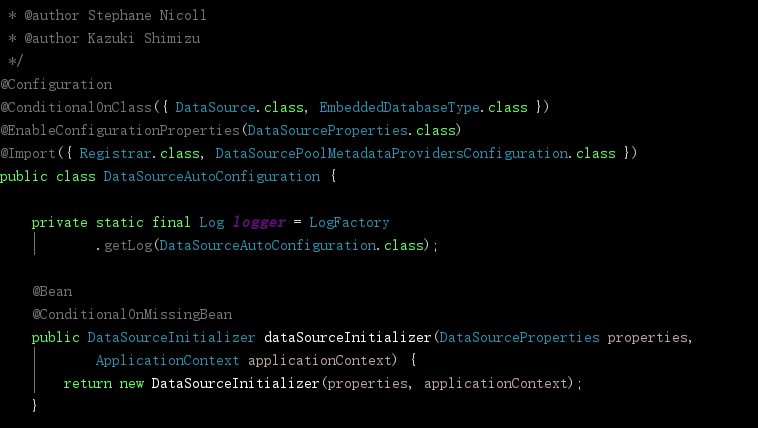
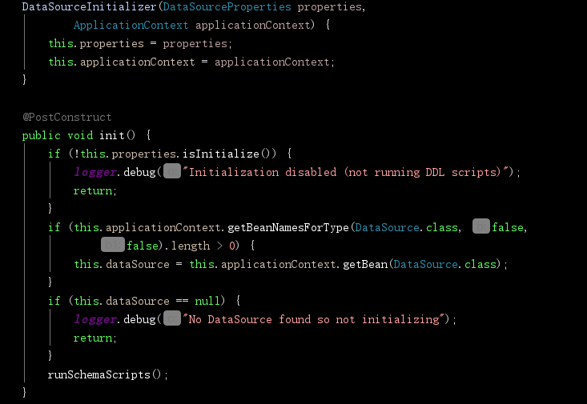
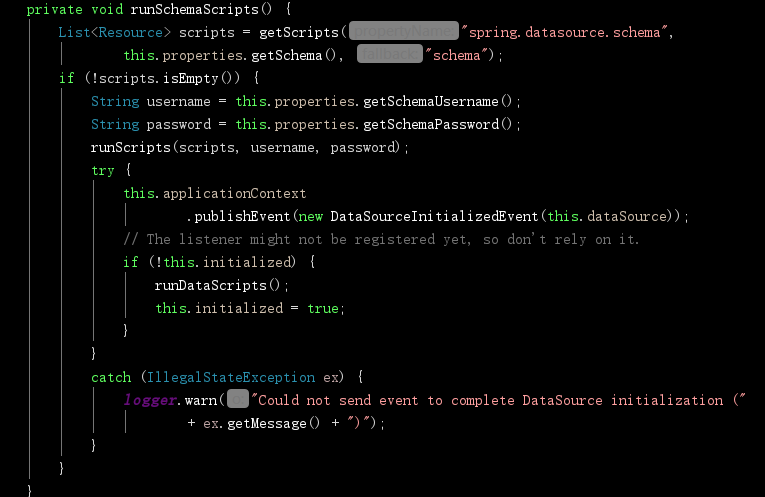
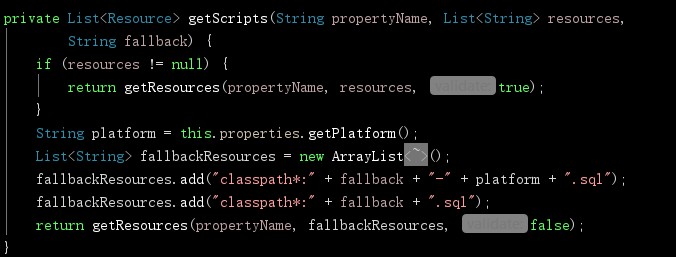

## 一：开始
在使用Spring Boot数据源之前，我们一般会导入相关依赖。其中数据源核心依赖就是`spring‐boot‐starter‐jdbc`
如下

```
<dependency>
	<groupId>org.springframework.boot</groupId>            
	<artifactId>spring‐boot‐starter‐jdbc</artifactId>            
</dependency>        
<dependency>        
	<groupId>mysql</groupId>            
	<artifactId>mysql‐connector‐java</artifactId>            
	<scope>runtime</scope>            
</dependency> 
```

或者你使用的是JPA：

```
<dependency>
     <groupId>org.springframework.boot</groupId>
     <artifactId>spring-boot-starter-data-jpa</artifactId>
</dependency>
```

查看JPA的依赖关系，如图，其中已经包含JDBC。




## 二：数据源

配置我们的Mysql数据库连接信息：

```
spring:
  datasource:
    username: root
    password: 123456
    url: jdbc:mysql://192.168.15.22:3306/jdbc?useUnicode=true&characterEncoding=utf-8&useSSL=false
    driver‐class‐name: com.mysql.jdbc.Driver
```

### 1.如何查看当前数据源？   

编写单元测试

```
@RunWith(SpringRunner.class)
@SpringBootTest
public class RobotsApplicationTests {

    @Autowired
    DataSource dataSource;

    @Test
    public void test(){
        System.out.println(dataSource.getClass());
    }

}
```

查看打印：

```
class org.apache.tomcat.jdbc.pool.DataSource
```

**总结**

所以这段配置的效果就是，默认是用org.apache.tomcat.jdbc.pool.DataSource作为数据源，

且数据源的相关配置都在DataSourceProperties里面，如下：

```
@ConfigurationProperties(prefix = "spring.datasource")
public class DataSourceProperties
		implements BeanClassLoaderAware, EnvironmentAware, InitializingBean {
	...

	private String name = "testdb";

	private String driverClassName;

	private String url;

	private String username;
	
	private String password;
	
	.....
```

### 2.自动配置原理

找到`org.springframework.boot.autoconfigure.jdbc`包下的`DataSourceConfiguration`类

```
abstract class DataSourceConfiguration {

	@ConditionalOnClass(org.apache.tomcat.jdbc.pool.DataSource.class)
	@ConditionalOnProperty(name = "spring.datasource.type", havingValue = "org.apache.tomcat.jdbc.pool.DataSource", matchIfMissing = true)
	static class Tomcat extends DataSourceConfiguration {

		@Bean
		@ConfigurationProperties(prefix = "spring.datasource.tomcat")
		public org.apache.tomcat.jdbc.pool.DataSource dataSource(
				DataSourceProperties properties) {
			org.apache.tomcat.jdbc.pool.DataSource dataSource = createDataSource(
					properties, org.apache.tomcat.jdbc.pool.DataSource.class);
			DatabaseDriver databaseDriver = DatabaseDriver
					.fromJdbcUrl(properties.determineUrl());
			String validationQuery = databaseDriver.getValidationQuery();
			if (validationQuery != null) {
				dataSource.setTestOnBorrow(true);
				dataSource.setValidationQuery(validationQuery);
			}
			return dataSource;
		}

	}
	......
```

以上就是自动配置代码，原理大概是如果在classpath下存在`org.apache.tomcat.jdbc.pool.DataSource.class`类，并且在配置文件中指定`spring.datasource.type`的值为`org.apache.tomcat.jdbc.pool.DataSource`，或者不写都会认为可以通过。只有通过才会进入这段配置代码，才能注入`DataSource`Bean。


SpringBoot默认可以支持；

```
org.apache.tomcat.jdbc.pool.DataSource、HikariDataSource、BasicDataSource、
```

当然了，除了Tomcat数据源依赖自带，其他都是缺少状态。

### 3.自定义数据源

找到这个类的最下面，如果`spring.datasource.type`的值不属于上面的几个，那么可以自己定义数据源：

```

	@ConditionalOnMissingBean(DataSource.class)
	@ConditionalOnProperty(name = "spring.datasource.type")
	static class Generic {
		@Bean
		public DataSource dataSource(DataSourceProperties properties) {
		    //使用DataSourceBuilder创建数据源，利用反射创建响应type的数据源，并且绑定相关属性
			return properties.initializeDataSourceBuilder().build();
		}
	}
```


### 4.自动执行SQL语句

打开DataSourceAutoConfiguration自动配置类，在自动配置DataSource时会注入`DataSourceInitializer`，继续打开该类，






我们发现该类有一个方法被注解`@PostConstruct`，这个注解用于需要在依赖注入完成后执行任何初始化的方法上。该初始化方法调用了`runSchemaScripts();`




该方法的第一句就调用 `getScripts()`方法，获取SQL脚本，如图：




所以我们想要初始化一些数据库脚本，可以依照这个规则

```
schema‐*.sql、data‐*.sql
```

例如：

```
schema.sql，schema‐all.sql；
```
也可以使用如下指定具体位置
```
  schema:    
      ‐ classpath:department.sql
```

作用：

1）、runSchemaScripts();运行建表语句；

2）、runDataScripts();运行插入数据的sql语句；

### 5.操作数据库

自动配置了JdbcTemplate操作数据库，示例：

```
@RunWith(SpringRunner.class)
@SpringBootTest
public class RobotsApplicationTests {

    @Autowired
    JdbcTemplate jdbcTemplate;

    @Test
    public void test(){
        jdbcTemplate.queryForList("SELECT * FROM user");
    }

}
```


## 三：连接池

为什么要把数据源和连接池放在一起讲，因为当我们使用了如上所述的默认数据源之后，那么已默认启用了数据库链接池。 换句话说，你根本不需要关心连接池，它本来就有！

### 1.默认连接池规则

Tomcat7之前，Tomcat本质应用了DBCP连接池技术来实现的JDBC数据源，但在Tomcat7之后，Tomcat提供了新的JDBC连接池方案，作为DBCP的替换或备选方案，解决了许多之前使用DBCP的不利之处，并提高了性能。详细请参考：<http://wiki.jikexueyuan.com/project/tomcat/tomcat-jdbc-pool.html>

Spring Boot为我们准备了最佳的数据库连接池方案，只需要在属性文件（例如application.properties）中配置需要的连接池参数即可。

在引入spring-boot-starter-jdbc后，内部包含了tomcat-jdbc包，里面有tomcat连接池.然后通过自动配置DataSourceAutoConfigurer创建DataSource对象。

SpringBoot创建默认DataSource时，规则如下：

- 优先寻找创建Tomcat连接池

- 如果没有Tomcat连接池，会查找创建HikariCP

- 如果没有HikariCP连接池，会查找创建dbcp

- 如果没有dbcp连接池，会查找创建dbcp2

- 可以使用spring.datasource.type属性指定连接池类型

  ```
  spring.datasource.type=org.apache.commons.dbcp.BasicDataSource
  ```

### 2.控制连接池行为

在数据源那一讲中，我们已经知道Spring data默认使用tomcat-jdbc时，所以直接在application.yml增加配置项spring.datasource.tomcat.*来控制链接池的行为。比如如下配置。

```
spring:
    datasource:
        url: jdbc:mysql://localhost:3306/jackieathome?useSSL=false
        username: root
        password: mypassword
        # 6.x版本的MySQL JDBC驱动类为com.mysql.cj.jdbc.Driver
        # 5.X版本的MySQL JDBC驱动类为com.mysql.jdbc.Driver
        driver-class-name: com.mysql.cj.jdbc.Driver
        tomcat:
            max-wait: 10000
            max-active: 30
            test-on-borrow: true
            max-idle: 5
```


### 3.Tomcat常用属性

| 属性                                  | 描述                                                         |
| ------------------------------------- | ------------------------------------------------------------ |
| `defaultAutoCommit`                   | （布尔值）连接池所创建的连接默认自动提交状态。如果未设置，则默认采用 JDBC 驱动的缺省值（如果未设置，则不会调用 `setAutoCommit` 方法）。 |
| `defaultReadOnly`                     | （布尔值）连接池所创建的连接默认只读状态。如果未设置，将不会调用 `setReadOnly` 方法。（有些驱动并不支持只读模式，比如：informix） |
| `defaultTransactionIsolation`         | （字符串）连接池所创建的连接的默认事务隔离状态。取值范围为：（参考 javadoc） `NONE``READ_COMMITTED``READ_UNCOMMITTED``REPEATABLE_READ``SERIALIZABLE` 如果未设置该值，则不会调用任何方法，默认为 JDBC 驱动。 |
| `defaultCatalog`                      | （字符串）连接池所创建的连接的默认catalog。                  |
| `driverClassName`                     | （字符串）所要使用的 JDBC 驱动的完全限定的 Java 类名。该驱动必须能从与 tomcat-jdbc.jar 同样的类加载器访问 |
| `username`                            | （字符串）传入 JDBC 驱动以便建立连接的连接用户名。注意，`DataSource.getConnection(username,password)`方法默认不会使用传入该方法内的凭证，但会使用这里的配置信息。可参看 `alternateUsernameAllowed` 了解更多详情。 |
| `password`                            | （字符串）传入 JDBC 驱动以便建立连接的连接密码。注意，`DataSource.getConnection(username,password)`方法默认不会使用传入该方法内的凭证，但会使用这里的配置信息。可参看 `alternateUsernameAllowed` 了解更多详情。 |
| `maxActive`                           | （整形值）池同时能分配的活跃连接的最大数目。默认为 `100`。   |
| `maxIdle`                             | （整型值）池始终都应保留的连接的最大数目。默认为 `maxActive:100`。会周期性检查空闲连接（如果启用该功能），留滞时间超过 `minEvictableIdleTimeMillis` 的空闲连接将会被释放。（请参考 `testWhileIdle`） |
| `minIdle`                             | （整型值）池始终都应保留的连接的最小数目。如果验证查询失败，则连接池会缩减该值。默认值取自 `initialSize:10`（请参考 `testWhileIdle`）。 |
| `initialSize`                         | （整型值）连接器启动时创建的初始连接数。默认为 `10`。        |
| `maxWait`                             | （整型值）在抛出异常之前，连接池等待（没有可用连接时）返回连接的最长时间，以毫秒计。默认为 `30000`（30 秒） |
| `testOnBorrow`                        | （布尔值）默认值为 `false`。从池中借出对象之前，是否对其进行验证。如果对象验证失败，将其从池中清除，再接着去借下一个。注意：为了让 `true` 值生效，`validationQuery`参数必须为非空字符串。为了实现更高效的验证，可以采用 `validationInterval`。 |
| `testOnReturn`                        | （布尔值）默认值为 `false`。将对象返回池之前，是否对齐进行验证。注意：为了让 `true` 值生效，`validationQuery`参数必须为非空字符串。 |
| `testWhileIdle`                       | （布尔值）是否通过空闲对象清除者（如果存在的话）验证对象。如果对象验证失败，则将其从池中清除。注意：为了让 `true` 值生效，`validationQuery` 参数必须为非空字符串。该属性默认值为 `false`，为了运行池的清除/测试线程，必须设置该值。（另请参阅 `timeBetweenEvictionRunsMillis`） |
| `validationQuery`                     | （字符串）在将池中连接返回给调用者之前，用于验证这些连接的 SQL 查询。如果指定该值，则该查询不必返回任何数据，只是不抛出 `SQLException` 异常。默认为 `null`。实例值为：`SELECT 1`（MySQL） `select 1 from dual`（Oracle） `SELECT 1`（MySQL Server）。 |
| `validationQueryTimeout`              | （整型值）连接验证失败前的超时时间（以秒计）。通过在执行 `validationQuery` 的语句上调用 `java.sql.Statement.setQueryTimeout(seconds)` 来实现。池本身并不会让查询超时，完全是由 JDBC 来强制实现。若该值小于或等于 0，则禁用该功能。默认为 `-1`。 |
| `validatorClassName`                  | （字符串）实现 `org.apache.tomcat.jdbc.pool.Validator`接口并提供了一个无参（可能是隐式的）构造函数的类名。如果指定该值，将通过该类来创建一个 Validator 实例来验证连接，代替任何验证查询。默认为 `null`，范例值为：`com.mycompany.project.SimpleValidator`。 |
| `timeBetweenEvictionRunsMillis`       | （整型值）空闲连接验证/清除线程运行之间的休眠时间（以毫秒计）。不能低于 1 秒。该值决定了我们检查空闲连接、废弃连接的频率，以及验证空闲连接的频率。默认为 `5000`（5 秒） |
| `numTestsPerEvictionRun`              | （整型值）Tomcat JDBC 连接池没有用到这个属性。               |
| `minEvictableIdleTimeMillis`          | （整型值）在被确定应被清除之前，对象在池中保持空闲状态的最短时间（以毫秒计）。默认为 `60000`（60 秒） |
| `accessToUnderlyingConnectionAllowed` | （布尔值）没有用到的属性。可以在归入池内的连接上调用 `unwrap`来访问。参阅 `javax.sql.DataSource` 接口的相关介绍，或者通过反射调用 `getConnection`，或者将对象映射为 `javax.sql.PooledConnection`。 |
| `removeAbandoned`                     | （布尔值）该值为标志（Flag）值，表示如果连接时间超出了 `removeAbandonedTimeout`，则将清除废弃连接。如果该值被设置为 `true`，则如果连接时间大于 `removeAbandonedTimeout`，该连接会被认为是废弃连接，应予以清除。若应用关闭连接失败时，将该值设为 `true` 能够恢复该应用的数据库连接。另请参阅 `logAbandoned`。默认值为 `false`。 |
| `removeAbandonedTimeout`              | （整型值）在废弃连接（仍在使用）可以被清除之前的超时秒数。默认为 `60`（60 秒）。应把该值设定为应用可能具有的运行时间最长的查询。 |
| `logAbandoned`                        | （布尔值）标志能够针对丢弃连接的应用代码，进行堆栈跟踪记录。由于生成堆栈跟踪，对废弃连接的日志记录会增加每一个借取连接的开销。默认为 `false` |
| `connectionProperties`                | （字符串）在建立新连接时，发送给 JDBC 驱动的连接属性。字符串格式必须为：[propertyName=property;]*。注意：user 与 password 属性会显式传入，因此这里并不需要包括它们。默认为 `null。` |
| `poolPreparedStatements`              | （布尔值）未使用的属性                                       |
| `maxOpenPreparedStatements`           | （整型值）未使用的属性                                       |

### 4.Tomcat JDBC 增强属性

| 属性                            | 描述                                                         |
| ------------------------------- | ------------------------------------------------------------ |
| `initSQL`                       | 字符串值。当连接第一次创建时，运行的自定义查询。默认值为 `null`。 |
| `jdbcInterceptors`              | 字符串。继承自类 `org.apache.tomcat.jdbc.pool.JdbcInterceptor`的子类类名列表，由分号分隔。关于格式及范例，可参见下文的配置 JDBC 拦截器。  这些拦截器将会插入到 `java.sql.Connection` 对象的操作队列中。   预定义的拦截器有： `org.apache.tomcat.jdbc.pool.interceptor``ConnectionState`——记录自动提交、只读、catalog以及事务隔离级别等状态。`org.apache.tomcat.jdbc.pool.interceptor``StatementFinalizer`——记录打开的语句，并当连接返回池后关闭它们。  有关更多预定义拦截器的详尽描述，可参阅JDBC 拦截器 |
| `validationInterval`            | 长整型值。为避免过度验证而设定的频率时间值（以秒计）。最多以这种频率运行验证。如果连接应该进行验证，但却没能在此间隔时间内得到验证，则会重新对其进行验证。默认为 `30000`（30 秒）。 |
| `jmxEnabled`                    | 布尔值。是否利用 JMX 注册连接池。默认为 `true`。             |
| `fairQueue`                     | 布尔值。假如想用真正的 FIFO 方式公平对待 `getConnection` 调用，则取值为 `true`。对空闲连接列表将采用 `org.apache.tomcat.jdbc.pool.FairBlockingQueue` 实现。默认值为 `true`。如果想使用异步连接获取功能，则必须使用该标志。 设置该标志可保证线程能够按照连接抵达顺序来接收连接。 在性能测试时，锁及锁等待的实现方式有很大差异。当 `fairQueue=true` 时，根据所运行的操作系统，存在一个决策过程。假如系统运行在 Linux 操作系统（属性 `os.name = linux`）上，为了禁止这个 Linux 专有行为，但仍想使用公平队列，那么只需在连接池类加载之前，将 `org.apache.tomcat.jdbc.pool.FairBlockingQueue.ignoreOS=true`添加到系统属性上。 |
| `abandonWhenPercentageFull`     | 整型值。除非使用中连接的数目超过 `abandonWhenPercentageFull`中定义的百分比，否则不会关闭并报告已废弃的连接（因为超时）。取值范围为 0-100。默认值为 0，意味着只要达到 `removeAbandonedTimeout`，就应关闭连接。 |
| `maxAge`                        | 长整型值。连接保持时间（以毫秒计）。当连接要返回池中时，连接池会检查是否达到 `now - time-when-connected > maxAge` 的条件，如果条件达成，则关闭该连接，不再将其返回池中。默认值为 `0`，意味着连接将保持开放状态，在将连接返回池中时，不会执行任何年龄检查。 |
| `useEquals`                     | 布尔值。如果想让 `ProxyConnection` 类使用 `String.equals`，则将该值设为 `true`；若想在对比方法名称时使用 `==`，则应将其设为 `false`。该属性不能用于任何已添加的拦截器中，因为那些拦截器都是分别配置的。默认值为 `true`。 |
| `suspectTimeout`                | 整型值。超时时间（以秒计）。默认值为 `0`。 类似于 `removeAbandonedTimeout`，但不会把连接当做废弃连接从而有可能关闭连接。如果 `logAbandoned` 设为 `true`，它只会记录下警告。如果该值小于或等于 0，则不会执行任何怀疑式检查。如果超时值大于 0，而连接还没有被废弃，或者废弃检查被禁用时，才会执行怀疑式检查。如果某个连接被怀疑到，则记录下 WARN 信息并发送一个 JMX 通知。 |
| `rollbackOnReturn`              | 布尔值。如果 `autoCommit==false`，那么当连接返回池中时，池会在连接上调用回滚方法，从而终止事务。默认值为 `false`。 |
| `commitOnReturn`                | 布尔值。如果 `autoCommit==false`，那么当连接返回池中时，池会在连接上调用提交方法，从而完成事务；如果 `rollbackOnReturn==true`，则忽略该属性。默认值为 `false`。 |
| `alternateUsernameAllowed`      | 布尔值。出于性能考虑，JDBC 连接池默认会忽略 [`DataSource.getConnection(username,password)`](http://docs.oracle.com/javase/6/docs/api/javax/sql/DataSource.html#getConnection(java.lang.String,%20java.lang.String))调用，只返回之前池化的具有全局配置属性 `username` 和 `password`的连接。  但经过配置，连接池还可以允许使用不同的凭证来请求每一个连接。为了启用这项在[`DataSource.getConnection(username,password)`](http://docs.oracle.com/javase/6/docs/api/javax/sql/DataSource.html#getConnection(java.lang.String,%20java.lang.String))调用中描述的功能，只需将 `alternateUsernameAllowed` 设为 `true`。 如果你请求一个连接，凭证为 user 1/password 1，而连接之前使用的是 user 2/password 2 凭证，那么连接将被关闭，重新利用请求的凭证来开启。按照这种方式，池的容量始终以全局级别管理，而不是限于模式（schema）级别。 默认值为 `false`。 该属性作为一个改进方案，被添加到了 [bug 50025](https://bz.apache.org/bugzilla/show_bug.cgi?id=50025) 中。 |
| `dataSource`                    | （javax.sql.DataSource）将数据源注入连接池，从而使池利用数据源来获取连接，而不是利用 `java.sql.Driver`接口来建立连接。它非常适于使用数据源（而非连接字符串）来池化 XA 连接或者已建立的连接时。默认值为 `null`。 |
| `dataSourceJNDI`                | 字符串。在 JNDI 中查找的数据源的 JNDI 名称，随后将用于建立数据库连接。参看 `datasource` 属性的介绍。默认值为 `null`。 |
| `useDisposableConnectionFacade` | 布尔值。如果希望在连接上放上一个门面对象，从而使连接在关闭后无法重用，则要将值设为 `true`。这能防止线程继续引用一个已被关闭的连接，并继续在连接上查询。默认值为 `true`。 |
| `logValidationErrors`           | 布尔值。设为 `true` 时，能将验证阶段的错误记录到日志文件中，错误会被记录为 SEVERE。考虑到了向后兼容性，默认值为 `false`。 |
| `propagateInterruptState`       | 布尔值。传播已中断的线程（还没有清除中断状态）的中断状态。考虑到了向后兼容性，默认值为 `false`。 |
| `ignoreExceptionOnPreLoad`      | 布尔值。在初始化池时，是否忽略连接创建错误。取值为 `true`时表示忽略；设为 `false` 时，抛出异常，从而宣告池初始化失败。默认值为 `false`。 |


