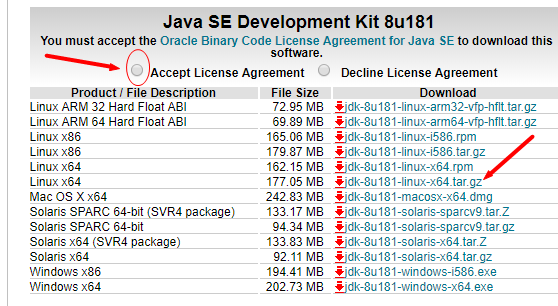

## 1.下载

jdk8官网下载地址

[http://www.oracle.com/technetwork/java/javase/downloads/jdk8-downloads-2133151.html](http://www.oracle.com/technetwork/java/javase/downloads/jdk8-downloads-2133151.html)

现在下载需要登陆，不过注册还是挺快的，耐心操作即可。

先点一下接受，再选择对应版本下的包。我的是CentOS7.3/7.4, 选择tar.gz压缩包。




## 2.上传

把下载的压缩包上传到你的Linux服务器。

~~推荐工具 [WinScp](https://winscp.net/eng/download.php)~~

墙裂推荐 [XShell Enterprise Plus 6.0.0.82绿色破解版(集成xftp)](https://download.csdn.net/download/yueshutong123/11080082)

直接拖拽上传！

## 3.命令

~~WinScp用户推荐下载[Putty](https://www.chiark.greenend.org.uk/~sgtatham/putty/latest.html)搭配起来超级爽！~~

接下来假设你已经把jdk压缩包上传到服务器了，并假设存放在`/usr/local/java/jdk8.tar.gz`

**1.进入jdk存放目录**

```
cd /usr/local/java
```

**2.查看**

```
ls
```

**3.解压**

```
tar -zxvf jdk8.tar.gz
```

**4.编辑**

```
vi /etc/profile
```

光标移到最后，新系统是没有`export xxxxx`等，按一下`i`进入写入模式。

**5.在下面添加下面这段**

```
export JAVA_HOME=/usr/local/java/jdk1.8
export CLASSPATH=.:$JAVA_HOME/lib/dt.jar:$JAVA_HOME/lib/tools.jar
export PATH=${JAVA_HOME}/bin:$PATH
```

再按下`esc`，输入`:wq`保存并退出！

**6.设置立即生效**

```
source /etc/profile
```

**7.验证**

```
java -version
```

出现如下所示信息即为安装成功

```
java version "1.8.0_144"
Java(TM) SE Runtime Environment (build 1.8.0_144-b01)
Java HotSpot(TM) 64-Bit Server VM (build 25.144-b01, mixed mode)
```


