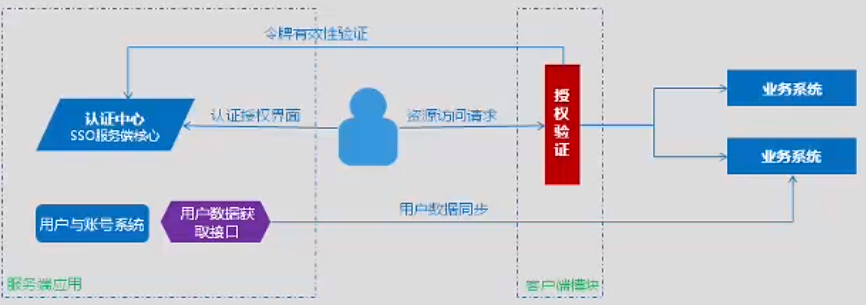
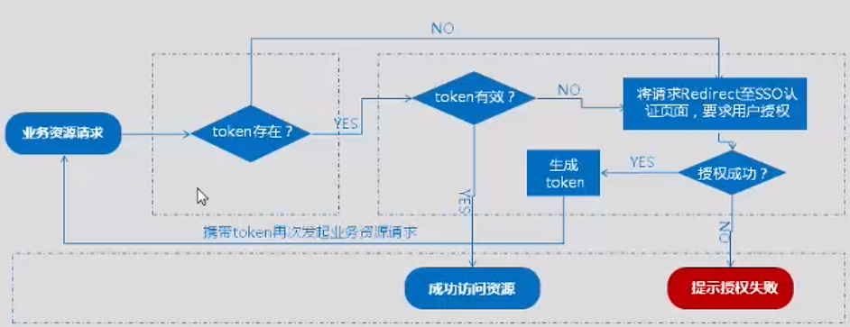
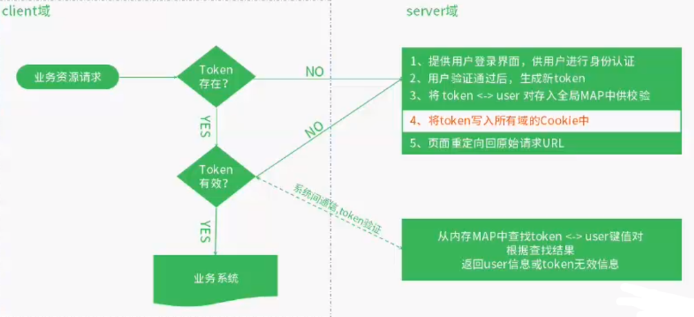

## 一：SSO体系结构

### SSO

SSO英文全称Single Sign On，单点登录。SSO是在多个应用系统中，用户只需要登录一次就可以访问所有相互信任的应用系统。它包括可以将这次主要的登录映射到其他应用中用于同一个用户的登录的机制。它是目前比较流行的企业业务整合的解决方案之一。 

### 体系结构

当用户第一次访问应用系统1的时候，因为还没有登录，会被引导到认证系统中进行登录；根据用户提供的登录信息，认证系统进行身份校验，如果通过校验，应该返回给用户一个认证的凭据－－token；用户再访问别的应用的时候就会将这个token带上，作为自己认证的凭据，应用系统接受到请求之后会把token送到认证系统进行校验，检查token的合法性。如果通过校验，用户就可以在不用再次登录的情况下访问应用系统2和应用系统3了 。




### Token（令牌）

token的意思是“令牌”，是服务端生成的一串字符串，作为客户端进行请求的一个标识。

当用户第一次登录后，服务器生成一个token并将此token返回给客户端，客户端收到token后把它存储起来，可以放在cookie或者Local Storage（本地存储）里。 以后客户端只需带上这个token前来请求数据即可，无需再次带上用户名和密码。

简单token的组成；uid(用户唯一的身份标识)、time(当前时间的时间戳)、sign（签名，token的前几位以哈希算法压缩成的一定长度的十六进制字符串。为防止token泄露）。

**设计token的值可以有以下方式**

1. 用设备mac地址作为token 
2. 用sessionid作为token 

### 同域SSO原理分析

> 实际上，HTTP协议是无状态的，单个系统的会话由服务端Session进行维持，Session保持会话的原理是通过Cookie把sessionId写入浏览器，每次访问都会自动携带全部Cookie，在服务端读取其中的sessionId进行验证实现会话保持。同域下单点登录其实就是手写token代替sessionId进行会话认证。

**token的生成**

服务端生成token后，将token与user对象存储在Map结构中，token为Key，user对象为value，response.addCookie()生成新的Cookie，名为token，值为token的值。

**token过期移除**

将服务端的token从Map中移除，再删除浏览器端的名为token的Cookie。

**认证流程**


### 跨域SSO原理分析

当有多个系统时，认证机制的流程如下：

1. 提供用户登录界面，供用户进行身份认证
2. 用户验证通过后，生成新token
3. 将token<->user 对存入全局MAP中供校验
4. **将token写入所有域的Cookie中**
5. 页面重定向回原始请求URL

**分析**

当系统有多个并且在不同域(domain)时，Cookie只会作用在当前域下。

将token写入所有域的Cookie中才是解决跨域SSO的核心。


## 二：Cookie增删改查

### 如何读取Cookie？

通过Servlet中的request对象可以读取到Cookie数组，然后foreach遍历读取，一般只是获取到nam和value，其他信息写入到浏览器后，浏览器不主动再发回来，读取并无意义。

```java
Cookie[] cookies = request.getCookies();
if (cookies != null) {
    for (Cookie cookie : cookies) {
        System.out.println(
                cookie.getName() +
                cookie.getValue() +
                cookie.getMaxAge() +
                cookie.getPath() +
                cookie.getDomain() +
                cookie.getSecure() +
                cookie.isHttpOnly()//客户端js是否可以获取
        );
    }
}
```


### 如何写入Cookie带浏览器？

新建Cookie对象设置一系列属性，然后添加到response中去。需要注意的是，当设置path为“/”时，表示所有路径都会被该Cookie作用到，如果设置为`/path1`那么由`/path2`发起请求就不会携带该Cookie。默认不设置只作用在当前路径下。

```java
Cookie cookie = new Cookie("myCookieName","myCookieValue");
cookie.setHttpOnly(false);//Javascript不能处理
//一个正值表示cookie将在经过许多秒之后过期。注意，值是cookie过期的最大时间，而不是cookie当前的时间。
//负值表示cookie没有持久存储，在Web浏览器退出时将被删除。零值会导致删除cookie。
cookie.setMaxAge(-1000);
cookie.setSecure(false);//如果为true，仅支持HTTPS协议
//cookie对指定目录中的所有页面以及该目录子目录中的所有页面都可见。
cookie.setPath("/");
//cookie.setDomain("www.a.com");//默认情况下，cookie只返回给发送cookie的服务器。
response.addCookie(cookie);
```

### 修改Cookie

修改更新Cookie时，除了要保证Cookie的name是相同的，也要保证Cookie的一系列属性是相同的，否则浏览器会生成新的Cookie。

### 删除Cookie

只需要设置Cookie的MaxAge为负值，意味着是过去的Cookie，浏览器就会清除。


## 三：跨域读写Cookie

### 1.利用HTML的script标签跨域写Cookie

比如当前域是www.a.com,下面的script标签是跨域写cookie的核心，通过此标签实现了向www.b.com域写入cookie：

```html
<script type="text/javascript" src="http://www.b.com/setCookie?cname=token&cval=123456"></script>
```

#### P3P协议

P3P是一种被称为个人隐私安全平台项目（the Platform for Privacy Preferences）的标准，能够保护在线隐私权，使Internet冲浪者可以选择在浏览网页时，是否被第三方收集并利用自己的个人信息。如果一个站点不遵守P3P标准的话，那么有关它的Cookies将被自动拒绝，并且P3P还能够自动识破多种Cookies的嵌入方式。p3p是由全球资讯联盟网所开发的。 

**举个例子：**

我们在访问A网站时，理论上说，我们只能把Cookie信息保存到A站域名下，而不能写入到B网站下。如果想要跨域读写Cookie，只是通过script标签变相访问B网站在一些浏览器是行不通的，此时B网站的服务器应该告诉浏览器允许A网站写入Cookie，否则浏览器将会拒绝执行，这就是P3P协议。

**服务端如何告诉浏览器？**

P3P提供了一种简单的方式 ，来加载用户隐私策略，只要在http响应的头信息中增加 `response.setHeader("P3P","CP=NON DSP COR CURa ADMa DEVa TAIa PSAa PSDa IVAa IVDa CONa HISa TELa OTPa OUR UNRa IND UNI COM NAV INT DEM CNT PRE LOC);`而无需指定隐私策略文件也可以达到指定隐私策略的目的。 CP=后面的字符串分别代表不同的策略信息。

**总结**

因为P3P协议所以不能保证所有浏览器都能通过script标签方式跨域写Cookie，有的浏览器本身就是拒绝跨域的。

显然这种方式是不能保证跨域写cookie的成功性。

### 2.通过URL参数实现跨域信息传递

我们要在A域实现写入token到B域，需要在A域设计一个servlet接收请求，代码：

```java
@WebServlet(name = "tg")
public class Servlet extends HttpServlet {
    protected void doPost(HttpServletRequest request, HttpServletResponse response) throws IOException {
        //获取请求的目标域
        String from = request.getParameter("from");
        //生成token，
        String token = "123456";
        //重定向到目标域
        response.sendRedirect(from + "?cname=token&cval=" + token);
    }
 }
```

由a域发起请求，请求地址：`http://www.a.com/tg?from=http://www.b.com/set_cookie`, 请求后该Servlet会获取`from`参数的值并生成`token`最后让客户端重定向到`http://www.b.com/set_cookie?cname=token&cval=123456`，然后B域的Servlet("set_cookie")获取Url参数写入Cookie到客户端，代码：

```java
//将要写入的cookie项，调用者通过参数传递
String cookieName = request.getParameter("cname");
String cookieValue = request.getParameter("cval");

//生成cookie
Cookie cookie = new Cookie(cookieName,cookieValue);
cookie.setPath("/");
//一般可以将domain设置到顶级域
//cookie.setDomain("www.b.com");
response.addCookie(cookie);
```

这时候再查看B域下的Cookie就可以发现(token=123456)已经被写入到浏览器。


### 3.读取其它域的Cookie

**利用script标签**

利用script标签执行另一个域实现的读取cookie方法，script标签返回结果将是变量定义形式的JS代码，每一个变量表示一个cookie项，这些代码加载后，此页面后续JS代码可以直接在script脚本中读取已定义的变量值，即各cookie值。

```java
<script type="text/javascript" src="http://www.b.com/reaf_cookies"></script>
```

**HTML页面读取**

```html
<script>
alert(token);
</script>
```

**B域的url为`/read_cookies`的Servlet是如何实现的？**

如图，首先我们先在request中获取cookie数组，然后for循环遍历拼接为类似`var token='test123';`的字符串。最重要的是设置`ContentType`为`application/javascript`，代码如下：

```java
protected void doGet(HttpServletRequest request, HttpServletResponse response) throws ServletException, IOException {
    Cookie[] cookies = request.getCookies();
    StringBuilder stringBuilder = new StringBuilder();
一定要设置响应类型，否则可能导致IE不解析js直接进行下载操作
    response.setContentType("application/javascript");

    if (cookies != null) {
        for (Cookie cookie : cookies) {
            //结果类似于这样 var token='123456';
            stringBuilder.append("var ")
                    .append(cookie.getName())
                    .append("=")
                    .append("'")
                    .append(cookie.getValue())
                    .append("'")
                    .append(";");
        }
        response.getWriter().append(stringBuilder.toString());
    }
 }
```

## 四：跨域Ajax请求

### 1.Jsonp的方式

跨域Ajax请求在浏览器阶段就会被阻止，我们可以通过script标签返回想要的json数据。如图：

```html
 <script type="text/javascript" src="http://www.b.com/user_info_2"></script>
```

后台Servlet代码

```java
//要正确设置响应类型,避免IE出现下载
response.setContentType("application/javascript");

String userInfo = "{\"id\":1,\"name\":\"zhangsan\"}";

//返回拼接的javascript语句字符串，语句本身执行一个调用函数的操作
String ret = "showResult("+userInfo+")";
```

在Servlet中设置返回类型为`javascript`，并正常获取json格式的数据，最关键的是在最后拼接为js语句字符串，语句本身就是执行一个调用函数的操作：

```java
showResult({"id":1,"name":"zhangsan"})
```

而`showResult(ret)`回调函数自然需要我们在之前就定义好：

```java
    <script>
        function showResult(ret){
            console.log(ret)
        }
    </script>
```

**优化**

这种方式，前端的回调函数和后端耦合度较高。前端可以在调用后端方法时带上回调函数名（?callback=xxxxx），后端优化后的代码：

```java
        //通过参数传递回调函数名，一定程度降低了前后端代码的耦合度
        String callback = request.getParameter("callback");

        //返回拼接的javascript语句字符串，语句本身执行一个调用函数的操作
        String ret = callback+"("+userInfo+")";
```


**再优化**

HTML页面加载到我们定义的script标签时就会执行我们的回调方法，更多时候我们想要控制回调方法的执行时机。这个问题可以通过前端动态生成节点来解决，当我们执行完之后再移除节点即可：

```java
    <script>
        var script = document.createElement("script");
        script.src = "http://www.b.com/user_info_2?callback=showResult";
        document.body.appendChild(script);

        script.onload = function () {
            document.body.removeChild(script);
        }
    </script>
```

**JQuery**

我们可以把这些封装到一个方法里，随时调用。这里可以使用Jquery封装好的API。

```java
                $.ajax({
                    url: "http://localhost:9090/query",
                    type: "GET",
                    dataType: "jsonp",  //指定服务器返回的数据类型
                    jsonpCallback: "showData",  //指定回调函数名称
                    success: function (data) {
                        console.info("调用success");
                    }
                });
                function showData(data){
                    var result = JSON.stringify(data);
                }
```


### 2.CORS简介

出于安全原因，浏览器限制从脚本内发起的跨源HTTP请求。 例如，XMLHttpRequest和Fetch API遵循同源策略。 这意味着使用这些API的Web应用程序只能从加载应用程序的同一个域请求HTTP资源，除非使用CORS头文件。 

跨域资源共享（ [CORS](https://developer.mozilla.org/en-US/docs/Glossary/CORS) ）机制允许 Web 应用服务器进行跨域访问控制，从而使跨域数据传输得以安全进行。浏览器支持在 API 容器中（例如 [`XMLHttpRequest`](https://developer.mozilla.org/zh-CN/docs/Web/API/XMLHttpRequest) 或 [Fetch](https://developer.mozilla.org/en-US/docs/Web/API/Fetch_API) ）使用 CORS，以降低跨域 HTTP 请求所带来的风险。


**GET跨域请求原理**

当客户端浏览器发起一个跨域的HTTP请求，浏览器经过请求响应，如果没有看到`Access-Control-Allow-Origin`的header头部，会认为你的请求是不合法的。换句话说，我们只要在被请求的服务器上设置这个头部，浏览器就会允许我们进行请求。


**解决方法**

对于简单的请求，我们直接在服务端 设置就可以了。如图，只要请求的地址是`www.a.com`就会被浏览器允许跨域。如果想要允许对于多个来源可以用`,`号进行隔开；如果想要允许所有来源，设置为`*`就可以，不过建议不要使用，这样会造成安全隐患。

```java
    protected void doGet(HttpServletRequest request, HttpServletResponse response) throws ServletException, IOException {
        //简单请求，直接设置Access-Control-Allow-Origin就可以了
        response.setHeader("Access-Control-Allow-Origin","*");
        //要正确设置响应类型,避免IE出现下载
        response.setContentType("application/json");

        response.getWriter().write("{\"id\":1,\"name\":\"zhangsan\"}");
    }
```

对于复杂的请求，比如POST，或者加入了自定义header头部，上面的方法就不适用了。下面继续看。


#### CORS流程

请求发起时,浏览器先判断当前是否是跨域的AJAX;

如果是,判断是否是普通类型请求(GET类型,无自定义头数据);

普通请求,直接发起GET到服务端,在响应头中寻找 Access-Contro-Alow- Origin,如果有且允许,处理响应结果;

不是普通请求(非GET类型,或有自定义头), 先 PreFlight(即发起一个 method= OPTIONS)的请求,

要求返回 Access-Control-Allow- Methods和 Access-Control-Allow- Headers, 内容体为空

PreFlight正确执行后, 再发起GET请求, 获得响应结果, 并处理结果.


**实现**

归根到我们的代码中的实现，只需要在servlet中定义options请求的处理方法即可。如图

```java
    protected void doOptions(HttpServletRequest req, HttpServletResponse response) {
        response.setHeader("Access-Control-Allow-Origin","*");
        response.setHeader("Access-Control-Allow-Methods","GET,POST,OPTIONS,DELETE");
        response.setHeader("Access-Control-Allow-Headers","reqid,xxx");
    }
```

注意：`Access-Control-Allow-Origin`是必需的。


### 3.两种跨域AJax请求对比

**兼容性**

Jsonp对所有浏览器兼容，CORS对现代浏览器兼容（IE8之后）。

**请求方式**

Jsonp只支持GET方式，CORS支持GET，POST等。

**调用方式**

Jsonp需要服务端封装返回信息，CORS更像原生AJax一样使用。


## 补充：Spring MVC使用@CrossOrigin注解解决Ajax跨域请求

参考 [https://www.cnblogs.com/mmzs/p/9167743.html](https://www.cnblogs.com/mmzs/p/9167743.html)