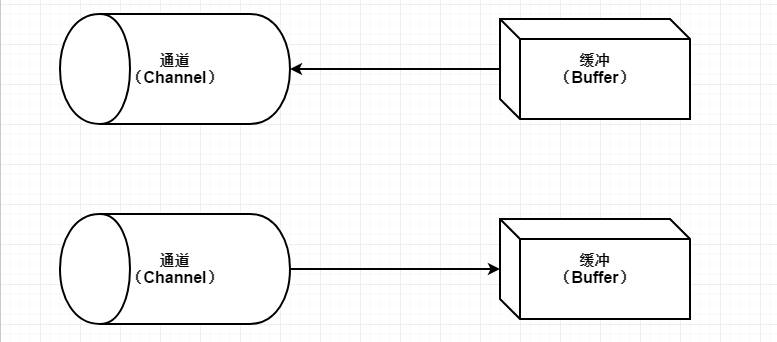
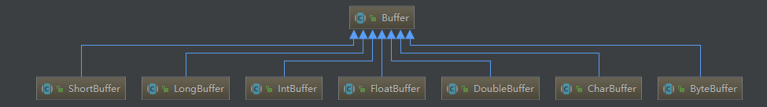
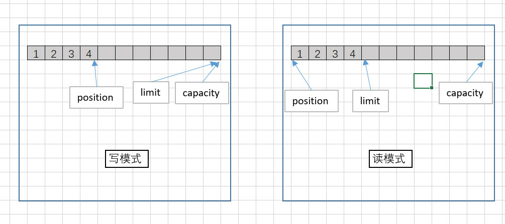
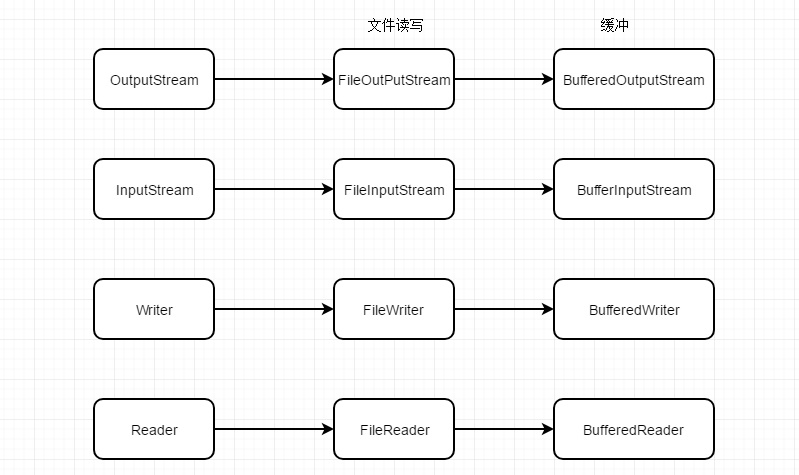

在软件系统中，由于IO的速度要比内存慢，因此，I/O读写在很多场合都会成为系统的瓶颈。提升I/O速度，对提升系统整体性能有着很大的好处。

在Java的标准I/O中，提供了基于流的I/O实现，即InputStream和OutputStream。这种基于流的实现以字节为单位处理数据，并且非常容易建立各种过滤器。

NIO是New I/O的简称，具有以下特性：

1. 为所有的原始类型提供（Buffer）缓存支持；
2. 使用 java.nio.charset.Charset 作为字符集编码解码解决方案；
3. 增加通道（channel）对象，作为新的原始 I/O 抽象；
4. 支持锁和内存映射文件的文件访问接口；
5. 提供了基于 Selector 的异步网络 I/O。

与流式的 I/O 不同，NIO是基于块（Block）的，它以块为基本单位处理数据。在NIO中，最为重要的两个组件是缓冲 Buffer 和通道 Channel 。缓冲是一块连续的内存块，是 NIO 读写数据的中转地。通道表示缓冲数据的源头或者目的地，它用于向缓冲读取或者写入数据，是访问缓冲的接口。



本文主要是介绍通过NIO中的Buffer和Channel，来提升系统性能。

## 1. NIO的Buffer类族和Channel

在NIO的实现中，Buffer是一个抽象类。JDK为每一种 Java 原生类型都创建了一个Buffer，如图




在NIO中和Buffer配合使用的还有 Channel 。Channel 是一个双向通道，即可读又可写。

下面列出Java NIO中最重要的集中Channel的实现：

- FileChannel
- DatagramChannel
- SocketChannel
- ServerSocketChannel

FileChannel用于文件的数据读写。 DatagramChannel用于UDP的数据读写。 SocketChannel用于TCP的数据读写。 ServerSocketChannel允许我们监听TCP链接请求，每个请求会创建会一个SocketChannel.

应用程序只能通过Buffer对Channel进行读写。比如，在读一个Channel的时候，需要先将数据读入到相应的Buffer，然后在Buffer中进行读取。

一个使用NIO进行文件复制的例子如下：

```java
@Test
public void test() throws IOException {
/写文件通道
    FileOutputStream fileOutputStream = new FileOutputStream(new File(path_copy));
    FileChannel wChannel = fileOutputStream.getChannel();
    
    //读文件通道
    FileInputStream fileInputStream = new FileInputStream(new File(path));
    FileChannel rChannel = fileInputStream.getChannel();
    
    ByteBuffer byteBufferRead = ByteBuffer.allocate(1024);//从堆中分配缓冲区
    
    while(rChannel.read(byteBufferRead)!=-1){
        byteBufferRead.flip();//将Buffer从写状态切换到读状态
        while(byteBufferRead.hasRemaining()){
            wChannel.write(byteBufferRead);
        }
        byteBufferRead.clear();//为读入数据到Buffer做准备
    }
    wChannel.close();
    rChannel.close();
}
```

## 2. Buffer的基本原理

buffer中有三个重要参数：位置（position）、容量（capacity）、上限（limit）。

- 位置（position）：当前缓冲区（Buffer）的位置，将从该位置往后读或写数据。
- 容量（capacity）：缓冲区的总容量上限。
- 上限（limit）：缓冲区的实际容量大小。

再回到上面的例子：

在创建ByteBuffer缓冲区实例后，位置（position）、容量（capacity）、上限（limit）均已初始化！position为0，capacity、limit均为最大长度值。rChannel 通道的 read() 方法会把文件数据写入ByteBuffer缓冲区，此时position的位置移动到下一个即将输入的位置，而limit，capacity不变。接着ByteBuffer缓冲区执行flip()操作，该操作会把会把limit移到position的位置，并且把position的位置重置为0。这样做是防止程序读到根本没有进行操作的区域。

接着 wChannel 通道的 write() 方法会读取ByteBuffer缓冲区的数据到文件，和 read() 操作一样，write() 操作也会设置position的位置到当前位置。为了便于下次读入数据到缓冲区，我们调用clear()方法将position，capacity，limit初始化。




### 1、Buffer的创建

第一种从堆中创建

```java
ByteBuffer byteBufferRead = ByteBuffer.allocate(1024);
```

从既有数组中创建

```java
byte[] bytes = new byte[1024];
ByteBuffer byteBufferRead = ByteBuffer.wrap(bytes);
```

### 2、重置和清空缓冲区

Buffer提供了一些用于重置和清空 Buffer 状态的函数，如下：

```java
public final Buffer rewind()
public final Buffer clear()
public final Buffer flip()
```

`rewind()` 方法将position置零，并清除标志位（mark）。作用是为提取Buffer的有效数据做准备：

```java
out.write(buf); //从buffer读取数据写入channel
buf.rewind();//回滚buffer
buf.get(array);//将buffer的有效数据复制到数组中
```

`clear()`方法将position置零，同时将limit设置为capacity的大小，并清除了mark。为重新写Buffer做准备：

```java
buf.clear();//为读入数据到Buffer做准备
ch.read(buf);
```

`flip()`方法先将limit设置到position的位置，并且把position的位置重置为零，并清除mark。通常用于读写转换。

### 3、标志缓冲区

标志（mark）缓冲区是一项在数据处理时比较有用的功能，它就像书签一样，可以在数据处理过程中。随时记录当前位置，然后在任意时刻，回到这个位置，从而加快或简化数据处理流程。主要函数如下：

```java
public final Buffer mark()
public final Buffer reset()
```

mark()方法用于记录当前位置，reset()方法用于回到当前位置。

### 4、复制缓冲区

复制缓冲区是指以原缓冲区为基础，生成一个完全一样的新缓冲区。方法如下：

```java
public abstract ByteBuffer duplicate()
```

简单来说，复制生成的新的缓冲区与原缓冲区共享相同内存数据，每一方的数据改动都是相互可见的。但是，两者又维护了各自的position、limit和mark。这就大大增加了程序的灵活性，为多方处理数据提供了可能。

### 5、缓冲区分片

缓存区分片使用slice()方法实现，它将在现有的缓冲区中，创建新的子缓冲区，子缓冲区和父缓冲区共享数据。

```java
public abstract ByteBuffer slice()
```

新缓冲区的内容将从此缓冲区的当前位置开始。此缓冲区内容的更改在新缓冲区中是可见的，反之亦然；这两个缓冲区的position、limit和mark是相互独立的。 新缓冲区的position位置将为零，其容量和limit将为此缓冲区中所剩余的字节数量，其mark标记是不确定的。当且仅当此缓冲区为只读时，新缓冲区才是只读的。 

### 6、只读缓冲区

可以使用缓冲区对象的asReadOnlyBuffer()方法得到一个与当前缓冲区一致的，并且共享内存数据的只读缓冲区。只读缓冲区对于数据安全非常有用。如果不希望数据被随意修改，返回一个只读缓冲区是很有帮助的。

```java
public abstract ByteBuffer asReadOnlyBuffer()
```

### 7、文件映射到内存

NIO提供了一种将文件映射到内存的方法进行I/O操作，它可以比常规的基于流的方式快很多。这个操作主要由FileChannel.map()方法实现。如下

```java
MappedByteBuffer map = channel.map(FileChannel.MapMode.READ_WRITE, 0, 1024);
```

以上代码将文件的前1024个字节映射到内存中。返回MappedByteBuffe，它是Buffer的子类，因此，可以像使用ByteBuffer那样使用它。

### 8、处理结构化数据（散射、聚集）

NIO提供处理结构化数据的方法，称之为散射（Scattering）和聚集（Gathering）。

散射是指将数据读入一组数据中，而不仅仅是一个。聚集与之相反。

在JDK中，通过GatheringByteChannel, ScatteringByteChannel接口提供相关操作。

下面我用一个示例来说明聚集写于散射读。

示例功能：写入两段话到文件，然后读取打印。

```java
@Test
public void test() throws IOException {
    String path = "D:\\test.txt";
    //聚集写
    //这是一组数据
    ByteBuffer byteBuffer1 = ByteBuffer.wrap("Java是最好的工具".getBytes(Charset.forName("UTF-8")));
    ByteBuffer byteBuffer2 = ByteBuffer.wrap("像风一样".getBytes(Charset.forName("UTF-8")));
    //记录数据长度
    int length1 = byteBuffer1.limit();
    int length2 = byteBuffer2.limit();
    //用 ByteBuffer 数组存放ByteBuffer实例的引用。
    ByteBuffer[] byteBuffers = new ByteBuffer[]{byteBuffer1, byteBuffer2};
    //获取文件写通道
    FileOutputStream fileOutputStream = new FileOutputStream(new File(path));
    FileChannel channel = fileOutputStream.getChannel();
    //开始写
    channel.write(byteBuffers);
    channel.close();
    
    //散射读
    byteBuffer1 = ByteBuffer.allocate(length1);
    byteBuffer2 = ByteBuffer.allocate(length2);
    byteBuffers = new ByteBuffer[]{byteBuffer1,byteBuffer2};
    //获取文件读通道
    FileInputStream fileInputStream = new FileInputStream(new File(path));
    channel = fileInputStream.getChannel();
    //开始读
    channel.read(byteBuffers);
    //读取
    System.out.println(new String(byteBuffers[0].array(),"utf-8"));
    System.out.println(new String(byteBuffers[1].array(),"utf-8"));
}
```

执行完成后，我们打开test.txt文件，看到：Java是最好的工具像风一样

并在控制台打印出：

```java
Java是最好的工具
像风一样
```

### 9、直接内存访问

NIO的 Buffer 还提供了一个可以直接访问系统物理内存的类----DirectByteBuffer。

DirectByteBuffer继承自ByteBuffer，但和普通Buffer不同。普通的ByteBuffer仍然在JVM堆上分配空间，其最大内存受到最大堆的限制。而DirectByteBuffer直接分配在物理内存中，并不占用堆空间。而且，DirectByteBuffer是一种更加接近系统底层的方法，所以，它的速度比普通的ByteBuffer更快。

使用很简单，只需要把 ByteBuffer.allocate(1024) 换成 ByteBuffer.allocateDirect(1024) 即可。该方法的源码为

```java
public static ByteBuffer allocateDirect(int capacity) {
    return new DirectByteBuffer(capacity);
}
```

有必要说明的是，使用参数-XX:MaxDirectMemorySize=10M 可以指定DirectByteBuffer的大小最多是 10M。

DirectByteBuffer的读写比普通Buffer快，但创建和销毁却比普通Buffer慢。但如果能将DirectByteBuffer进行复用，那么，在读写频繁的情况下，它可以大幅改善系统性能。

## 3.与传统I/O的对比
I/O和NIO的最大区别就是 **传统I/O是面向（缓冲）流，NIO是面向缓冲区**。

使用 Java 进行 I/O操作有两种基本方法：

1. 使用基于InputStream 和 OutputStream 的方式；（字节流）
2. 使用 Writer 和 Reader。（字符流）

无论使用哪种方式进行文件 I/O，如果能合理地使用缓冲，就能有效的提高I/O的性能。



用传统I/O实现刚开始的文件复制例子，代码如下：

```java
@Test
public void test6() throws IOException {
    //缓冲输出流
    BufferedOutputStream bufferedOutputStream = new BufferedOutputStream(new FileOutputStream(new File(path_copy)));
    //缓冲输入流
    BufferedInputStream bufferedInputStream = new BufferedInputStream(new FileInputStream(new File(path)));
    byte[] bytes = new byte[1024];
    while (bufferedInputStream.read(bytes) != -1) {
        bufferedOutputStream.write(bytes);
    }
    bufferedInputStream.close();
    bufferedOutputStream.close();
}
```

需要注意的是，虽然使用ByteBuffer读写文件比Stream快很多，但不足以表明两者存在很如此之大的差距。这其中，由于ByteBuffer是将文件一次性读入内存再做后续处理，而Stream方式是则是边读文件边处理数据（虽然使用了缓冲组件 BufferedInputStream），这也是导致两者性能差异的原因之一。虽如此，仍不能掩盖使用NIO的优势。使用NIO替代传统I/O操作，对系统整体性能的优化，应该是有立竿见影的效果的。

------
## 附录

位："位(bit)"是电子计算机中最小的数据单位。每一位的状态只能是0或1。 

字节：8个二进制位构成1个"字节(Byte)"，它是存储空间的基本计量单位。1个字节可以储存1个英文字母或者半个汉字，换句话说，1个汉字占据2个字节的存储空间。

 以1KB的文件举例：

```java
1Byte = 8Bit
1KB = 1024Byte
```

当我们进行`byte[] bytes = new byte[1024]`操作时，相当于开辟了1KB的内存空间。

## 参考

*Java程序性能优化 葛一鸣著*