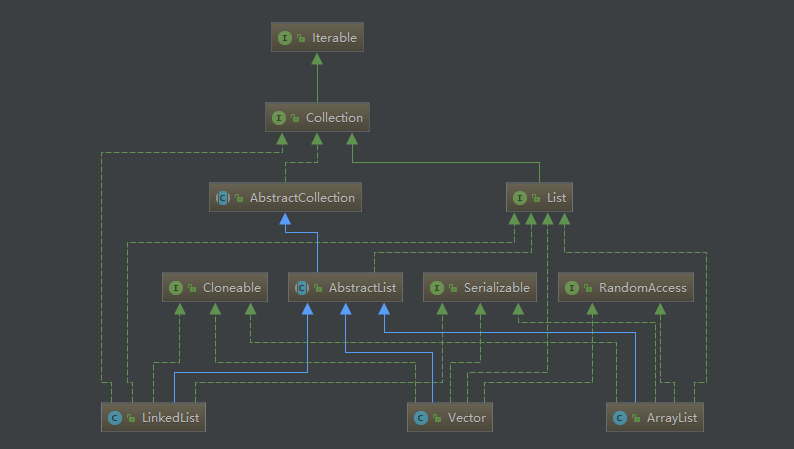
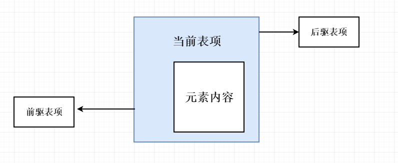
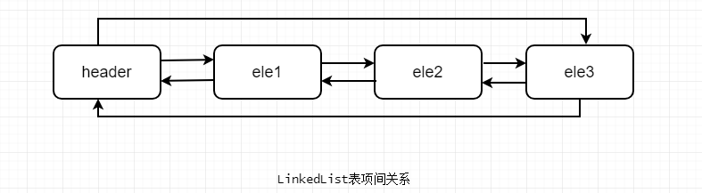
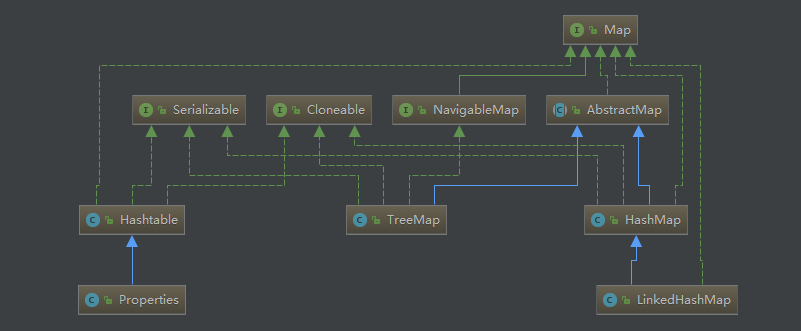

JDK提供了一组主要的数据结构实现，如List、Map、Set等常用数据结构。这些数据都继承自 java.util.Collection 接口，并位于 java.util 包内。

## 1、List接口

最重要的三种List接口实现：ArrayList、Vector、LinkedList。它们的类图如下：




可以看到，3种List均来自 AbstratList 的实现。而 AbstratList  直接实现了List接口，并扩展自 AbstratCollection。

ArrayList 和 Vector 使用了数组实现，可以认为，ArrayList 封装了对内部数组的操作。比如向数组中添加、删除、插入新的元素或数组的扩展和重定义。对ArrayList或者Vector的操作，等价于对内部对象数组的操作。

ArrayList 和 Vector 几乎使用了相同的算法，它们的唯一区别可以认为是对多线程的支持。ArrayList 没有对一个方法做线程同步，因此不是线程安全的。Vector 中绝大多数方法都做了线程同步，是一种线程安全的实现。因此ArrayList 和 Vector 的性能特性相差无几。

LinkedList 使用了循环双向链表数据结构。LinkedList 由一系列表项连接而成。一个表项总是包含3个部分：元素内容、前驱表项和后驱表项。如图所示：



LinkedList的表项源码：

```
    private static class Node<E> {
        E item;
        Node<E> next;
        Node<E> prev;

        Node(Node<E> prev, E element, Node<E> next) {
            this.item = element;
            this.next = next;
            this.prev = prev;
        }
    }
```

无论LinkedList是否为空，链表都有一个header表项，它既是链表的开始，也表示链表的结尾。它的后驱表项便是链表的第一个元素，前驱表项便是链表的最后一个元素。如图所示：




下面比较下ArrayList 和 LinkedList的不同。

### 1.增加元素到列表尾端

对于ArrayList来说，只要当前容量足够大，add()操作的效率是非常高的。

只有当ArrayList对容量的需求超过当前数组的大小时，才需要进行扩容。扩容会进行大量的数组复制操作。而复制时最终调用的是System.arraycopy()方法，因此，add()效率还是相当高的。

LinkedList由于使用了链表的结构，因此不需要维护容量的大小。这点比ArrayList有优势，不过，由于每次元素增加都需要新建Node对象，并进行更多的赋值操作。在频繁的系统调用中，对性能会产生一定影响。

### 2.插入元素到列表任意位置

ArrayList是基于数组实现的，而数组是一块连续的内存空间，每次插入操作，都会进行一次数组复制。大量的数组复制会导致系统性能低下。

LinkedList是基于链表实现的，在任意位置插入和在尾端增加是一样的。所以，如果系统应用需要对List对象在任意位置进行频繁的插入操作，可以考虑用LinkedList替代ArrayList。

### 3.删除任意位置元素

对ArrayList来说，每次remove()移除元素都需要进行数组重组。并且元素位置越靠前开销越大，要删除的元素越靠后，开销越小。

在LinkedList的实现中，首先需要通过循环找到要删除的元素。如果要删除的元素位置处于List的前半段，则从前往后找；若处于后半段，则从后往前找。如果要移除中间位置的元素，则需要遍历完半个List，效率很低。

### 4.容量参数

容量参数是ArrayList 和 Vector等基于数组的List的特有性能参数，它表示初始数组的大小。

合理的设置容量参数，可以减少数组扩容，提升系统性能。

默认ArrayList的数组初始大小为10。

```
private static final int DEFAULT_CAPACITY = 10;
```

### 5.遍历列表

常用的三种列表遍历方式：ForEach操作、迭代器 和 for循环。

对于ForEach操作，反编译可知实际上是将ForEach循环体作为迭代器处理。不过ForEach比自定义的迭代器多了一步赋值操作，性能不如直接使用迭代器的方式。

使用For循环通过随机访问遍历列表，ArrayList表现很好，速度最快；但是LinkedList的表现非常差，应避免使用，这是因为对LinkedList的随机访问时，总会进行一次列表的遍历操作。

## 2、Map接口

Map是一种非常常用的数据结构。围绕着Map接口，最主要的实现类有Hashtable, HashMap, LinkedHashMap 和 TreeMap，在Hashtable中，还有Properties 类的实现。




Hashtable和hashMap的区别在于Hashtable的大部分方法都做了线程同步，而HashMap没有，因此，Hashtable是线程安全的，HashMap不是。其次，Hashtable 不允许key 或 value使用null值，而HashMap可以。第三，它们在内部对key的hash算法和hash值到内存索引的映射算法不同。

由于HashMap使用广泛，本文以HashMap为例，阐述它的实现原理。

### 1.HashMap的实现原理

简单来说，HashMap就是将key做hash算法，然后将hash值映射到内存地址，直接取得key所对应的数据。在HashMap中，底层数据结构使用的是数组。所谓的内存地址，就是数组的下标索引。

用代码简单表示如下：

```
object[key_hash] = value;
```

### 2.Hash冲突

当需要存放的两个元素1和2经hash计算后，发现对应在内存中的同一个地址。此时HashMap又会如何处理以保证数据的完整存放？

在HashMap的底层使用数组，但数组内的元素不是简单的值，而是一个Entity类的对象。每一个Entity表项包括key，value，next，hash几项。注意这里的next部分，它指向另外一个Entity。当put()操作有冲突时，新的Entity会替换原有的值，为了保证旧值不丢失，会将next指向旧值。这便实现了在一个数组空间内存放多个值项。因此，HashMap实际上是一个链表的数组。而在进行get()操作时，如果定位到的数组元素不含链表（当前entry的next指向null），则直接返回；如果定位到的数组元素包含链表，则需要遍历链表，通过key对象的equals方法逐一比对查找。

### 3.容量参数

和ArrayList一样，基于数组的结构，不可避免的需要在数组空间不足时，进行扩展。而数组的重组比较耗时，因此对其做一定的优化很有必要了。

HashMap提供了两个可以指定初始化大小的构造函数：

```
HashMap(int initialCapacity) 
          构造一个带指定初始容量和默认负载因子 (0.75) 的空 HashMap。
```

```
HashMap(int initialCapacity, float loadFactor) 
          构造一个带指定初始容量和负载因子的空 HashMap。
```

其中，HashMap会使用大于等于initialCapacity并且是2的指数次幂的最小的整数作为内置数组的大小。

负载因子又叫做填充比，它是介于0和1之间的浮点数。

*负载因子 = 实际元素个数 / 内部数组总大小*

负载因子的作用就是决定HashMap的阈值（threshold）。

*阈值 = 数组总容量 × 负载因子*
当HashMap的实际容量超过阈值便会进行扩容，每次扩容将新的数组大小设置为原大小的1.5倍。

默认情况下，HashMap的初始大小是16，负载因子为0.75。

```
static final int DEFAULT_INITIAL_CAPACITY = 1 << 4; // aka 16
static final float DEFAULT_LOAD_FACTOR = 0.75f;
```

### 4.LinkedHashMap

LinkedHashMap继承自HashMap，因此，它具备了HashMap的优良特性，并在此基础上，LinkedHashMap又在内部增加了一个链表，用以存放元素的顺序。因此，**LinkedHashMap 可以简单理解为一个维护了元素次序表的HashMap**.

LinkedHashMap 提供两种类型的顺序：一是元素插入时的顺序；二是最近访问的顺序。

```
LinkedHashMap(int initialCapacity, float loadFactor, boolean accessOrder) 
          构造一个带指定初始容量、负载因子和排序模式的空 LinkedHashMap 实例
```

其中 accessOrder 为 true 时，按照元素最后访问时间排序；当 accessOrder 为 false 时，按照插入顺序排序。默认为 false 。

在内部实现中，LinkedHashMap 通过继承 HashMap.Entity 类，实现 LinkedHashMap.Entity，为 HashMap.Entity 增加了 before 和 after属性用以记录某一表项的前驱和后继，并构成循环链表。

### 5.TreeMap

**TreeMap可以简单理解为一种可以进行排序的Map实现**。与 LinkedHashMap 不同，LinkedHashMap 是根据元素增加或者访问的先后顺序进行排序，而TreeMap则根据元素的Key进行排序。为了确定Key的排序算法，可以使用两种方式指定：

（1）在TreeMap的构造函数中注入一个Comparator：

```
TreeMap(Comparator<? super K> comparator) 
```

（2）使用一个实现了 Comparable 接口的 Key。

> TreeMap的内部实现是基于红黑树的。红黑树是一种平衡查找树，这里不做过多介绍。

TreeMap 其它排序接口如下：

```
subMap(K fromKey, K toKey) 
          返回此映射的部分视图，其键值的范围从 fromKey（包括）到 toKey（不包括）。
```

```
tailMap(K fromKey) 
          返回此映射的部分视图，其键大于等于 fromKey。
```

```
firstKey() 
          返回此映射中当前第一个（最低）键。
```

```
headMap(K toKey) 
          返回此映射的部分视图，其键值严格小于 toKey。
```

一个简单示例如下：

```
public class MyKey implements Comparable<MyKey> {
    private int id;

    public MyKey(int id) {
        this.id = id;
    }

    @Override
    public int compareTo(MyKey o) {
        if (o.id < this.id){
            return 1;
        }else if (o.id > this.id){
            return -1;
        }
        return 0;
    }

    public static void main(String[] args) {
        MyKey myKey1 = new MyKey(1);
        MyKey myKey2 = new MyKey(2);
        MyKey myKey3 = new MyKey(3);
        Map<MyKey,Object> map = new TreeMap<>();
        map.put(myKey1,"一号");
        map.put(myKey3,"三号");
        map.put(myKey2,"二号");

        Iterator<MyKey> iterator = map.keySet().iterator();
        while (iterator.hasNext()){
            System.out.println(map.get(iterator.next()));
        }
    }
}
```

## 3、Set接口

Set并没有在Collection接口之上增加额外的操作，**Set集合中的元素是不能重复的、无序的**。

其中最为重要的是HashSet、LinkedHashSet、TreeSet 的实现。这里不再一一赘述，因为所有的这些Set实现都只是对应的Map的一种封装而已。

## 4、优化集合访问代码

### 1.分离循环中被重复调用的代码

举个例子，当我们要使用for循环遍历集合时

```
        for (int i =0;i<collection.size();i++){
            //.....
        }
```

很明显，每次循环都会调用size()方法，并且每次都会返回相同的数值。分离所有类似的代码对提升循环性能有着积极地意义。因此，可以将上段代码改造成

```
        int size= collection.size();
        for (int i =0;i<size;i++){
            //.....
        }
```

当元素的数量越多时，这样的处理就越有意义。

### 2.省略相同的操作

假设我们有一段类似的操作如下

```
        int size= collection.size();
        for (int i =0;i<size;i++){
            if (list.get(i)==1||list.get(i)==2||list.get(i)==3){
                //...
            }
        }
```

虽然每次循环调用get(i)的返回值不同，但在同一次调用中，结果是相同的，因此可以提取这些相同的操作。

```
        int size= collection.size();
        int k=0;
        for (int i =0;i<size;i++){
            if ((k = list.get(i))==1||k==2||k==3){
                //...
            }
        }
```

### 3.减少方法调用

方法调用是需要消耗系统堆栈的，如果可以，则尽量访问内部元素，而不要调用对应的接口，函数调用是需要消耗系统资源的，直接访问元素会更高效。

假设上面的代码是Vector.class的子类的部分代码，那么可以这么改写

```
        int size = this.elementCount;
        Object k=null;
        for (int i =0;i<size;i++){
            if ((k = elementData[i])=="1"||k=="2"||k=="3"){
                //...
            }
        }
```

可以看到，原本的 size() 和 get() 方法被直接替代为访问原始变量，这对系统性能的提升是非常有用的。

## 5、RandomAccess接口

RandomAccess接口是一个标志接口，本身并没有提供任何方法，任何实现RandomAccess接口的对象都可以认为是支持快速随机访问的对象。**此接口的主要目的是标识那些可以支持快速随机访问的List实现**。

在JDK中，任何一个基于数组的List实现都实现了 RandomAccess接口，而基于链表的实现则没有。这很好理解，只有数组能够快速随机访问，（比如：通过 object[5]，object[6]可以直接查找并返回对象），而对链表的随机访问需要进行链表的遍历。

在实际操作中，可以根据`list instanceof RandomAccess`来判断对象是否实现 RandomAccess 接口，从而选择是使用随机访问还是iterator迭代器进行访问。

在应用程序中，如果需要通过索引下标对 List 做随机访问，尽量不要使用 LinkedList，ArrayList和Vector都是不错的选择。

> 本文已授权微信公众号“后端技术精选”发布
