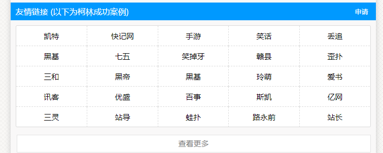
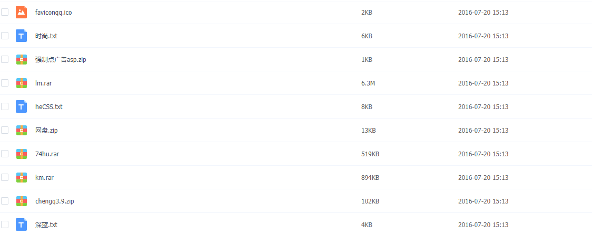
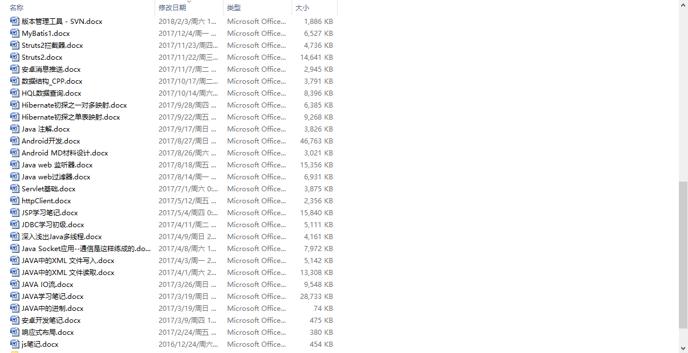
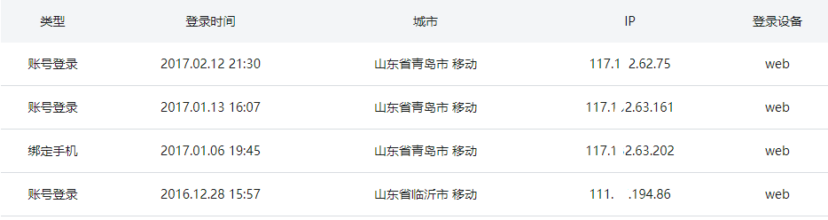

2019-10-16：

今天一看，没想到文章访问量已经1万了，对此，我有点歉意，因为这篇文章并不是写的多么好，也没有写的太详细，所以，我之后又写了一篇文章，详细讲述了我的大学生活以及拿到百度网易offer的经历，请大家移步看下吧！《[我一个二本大学是如何拿到百度、网易大厂offer的](/)》

---

没啥经验，说说心路历程吧~~

过两天就9月1号了，正式成为大三生，没错，我就是如此嫩~~~

## 萌芽在初中

初一的时候，电视广告结尾都会放一句，我们的网站是.....于是心里琢磨，网站是怎么建的呢？我可以吗？

然后用非智能机，上网百度如何建站，说实话，初中玩了一两年自助站~~

自助站，那时候最火的就是思图 http://wap.stuzn.com/ 和娃派建站，直接注册登录，然后可以排版，换css样式。那时候不懂css是什么呀。在这个圈子里混了好久，那时候鼓捣网站最火的是冒泡游戏破解，或者QQ刷钻啥的。想想自己当年还真的是执着呀，为了搞个好看的页面都不吃饭了。（排版是傻瓜式，不过网速不太好，手机更是非智能）。关于这段经历的详情可以看看这位哥们写的。https://www.yaxi.net/2017-10-18/1593.html

后来，懵懵懂懂了解到这些自助建站网站是使用的柯林程序（[官网](http://www.kelink.com/)）

通过这些友情链接，了解到的范围越来越多。还加了不少大佬的QQ号交流，一打听都是初中生。

后来，知道了PHP程序和免费PHP/ASP空间，还搞过.tk免费域名。那时候自己做了一个qq挂机网。php程序，程序现在网盘还有。

如图，chengq就是qq挂机程序，深蓝.txt是一套css，还有lm.rar是当时有名的龙门建站程序。

## 我是如何赚到700块钱的

后来，我学会了如何开通一个空间，并利用ftp工具上传网站程序。那时候不得不提我初中时的微机老师了，我的这位老师也是和我比较对网站感兴趣的同志！周末之时，是他让我上他家操作电脑。我才接触了Dreamweaver，额。没你们想的那么励志，我就真的只是看了一眼~也没给我留下太深印象~~

逛他们那些网站的时候，都有很多广告，帮你建站，收多少钱那种。我就想，我也可以试试呀。我在免费空间网站 http://www.tzcx.net/ 花3元买永久免费空间，转手50的卖出，狠赚！

然后我就去一些门户网站，而且是我们这些菜鸟最喜欢去的，放广告。我是万万没想到，竟然真的有人加我QQ好友。真的赚到了第一笔30块钱。然后，我就抱着手机整天赚钱了。那时候我没电脑，只有一部很差劲的智能手机。我妈见我每天抱着手机，说我被迷住了，我说我在赚钱呢。后来，我就真的用我赚到的6 7百买了个好点的手机。

## 高中平淡无奇

初中后再没碰过之前玩的那些，高中虽然好好学习，但实在是对高科技着迷呀。那时候自己就想安卓软件是怎么做的呢？然后自己又百度，你别说，又有傻瓜式造软件，专业叫做在线App制作，最好的一个就是应用公园了（http://www.apppark.cn/）。不过只能做离线的，当时觉得学校查成绩比较麻烦，如果有个App就好了。

## 大学的波澜

心满意足的进了计科专业，进了学校的一个编程工作室，作为一个啥也不懂的萌新，这是非常幸运的事！首先，你可观察高年级的大佬在做什么，其次，你可以问呀，不耻下问。第一个学期，有一些商业比赛，没下文纯宣传的那种，参加了一下。学了html。就要做一个页面，就可以交作品了。呵呵，大佬勿笑~~比较有成就的就是，第一个学期的C语言学的很扎实，很用心。因为啥都不会嘛，比较有目标和冲劲。上机做题都是一步一个脚印。然后，放寒假了。高潮到了~

我了解到未来你只需要选择一个职业，也就是说，你只需要掌握一门技术语言。并不是学了C，学Java，再学PHP。学长那时候最喜欢说一句话，那就是大学老师教的远远满足不了毕业后公司的要求。那段时期很迷茫。

不知道学什么，然后我去招聘网站看！（真的，当你迷茫不知道学啥的时候就去招聘网站）

我听了一个讲座，说Java工程师和大数据工程师在未来最火。然后我问了学长，最后决定学Java。

寒假两月，跟着慕课网视频把Java语法基础IO流啥的学完了。我觉得这是我逆袭的开始。

开学后，和工作室的同学交流，他们还是C语言基础，我已经学完Java语法。差距慢慢拉开了。

从那时起，我明确了目标与方向，Java工程师。剩下的，就是慢慢看视频，

慢慢的，笔记从2016年12月做到了2018年此刻。

慢慢的，慕课注册时间已经快2年，

慢慢的，看了1770个小时的视频，技术栈越来越多。

后来，就不再看视频了，改看书。视频得来的总归是浅显，不如看书深刻、系统。

## 一点教训

说到这里，就不得不说我的一点教训了，那个时候的我，听到的全是技术，自己学的比较急躁，以为技术学的越多越厉害，忽略了基础，对于自己搞不懂的，就马马虎虎的略过了。你以前略过的，你未来一定会偿还！

对于技术，如果你只是想学会如何使用，那你花了半天的时间基本就能搞定。比着葫芦画瓢就完了，用好人家提供的API就行了。

实现原理还是得懂得，这东西不止面试会用到，而且在你以后自己开发项目的时候都是你的底蕴。

最后，我只是一名未进入工厂的萌新，说的不好，大家多多担待~~