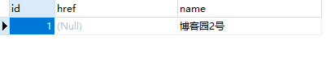
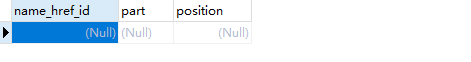

## 1、问题背景

个人比较喜欢Spring data JPA，这次的问题是在实体类中使用List类型作为字段，JPA也提供了操作的方法，即使用@ElementCollection注解，网上对于JPA的知识比较零散，毕竟是不如Mybatis使用起来那么简单。

下面进入正题，来看下我的实体类中的字段：

```
 @ElementCollection(fetch = FetchType.LAZY)//定义基本类型或可嵌入类的实例集合
 @OrderColumn(name="position")//如果使用的是List，你需要多定义一个字段维护集合顺序
 private List<String> part;
```

其实JPA内部对于集合类型的字段是使用另一张表进行维护。简单来说，省去了你自己去定义另一张表来进行一对多关系的维护。

所以，我想更新这张表的这条字段就不能像更新普通字段（String，int）一样了，那不一样在哪里呢？

JPA更新字段的手段有两种，一种是通过设置主键进行save()保存，一种是通过@Query注解。

如果使用第二种，在前面已经说了其实是对另一张表的操作，所以我们只需要对另一张表增删改查就好了。

但这样个人觉得有点没发挥JPA的个性，所以我想使用第一种。

但是使用第一种方法有两个问题：

1. 实体类的部分字段LAZY懒加载会不会导致更新后这部分字段为NULL？
2. JPA为什么能够知道我们调用save()方法是updata更新而不是insert新增？

请看下面的测试用例。

## 2、测试用例

下面看下定义的实体类，主要由主键id，字段name，以及集合part组成，集合为Lazy懒加载。

```
@Entity
@Table(name = "name_href")
public class NameHref {
    @Id
    @GeneratedValue()
    private int id;
    @Column(name = "name")
    private String name;
    private String href;
    @ElementCollection(fetch = FetchType.LAZY)
    @OrderColumn(name="position")
    private List<String> part;
    ......
```

当我们定义集合part为Lazy懒加载，正常来说使用JPA获取实体后是取不到part的值的，（执行get方法会报错）所以更新字段后part的值到底是不是为NULL，我们来看单元测试：

```
    @Autowired
    NameHrefRepository nameHrefRepository;

    @Test
    public void getHref() {
        NameHref nameHref = new NameHref();
        nameHref.setId(-1);
        String name = "博客园";
        nameHref.setName(name);
        nameHref.setHref("http://www.cnblogs.com");
        ArrayList<String> objects = new ArrayList<>();
        objects.add("安卓");
        objects.add("苹果");
        nameHref.setPart(objects);
        nameHrefRepository.save(nameHref);

        NameHref byName = nameHrefRepository.findAllByName(name);
        byName.setHref("http://www.baidu.com");
        nameHrefRepository.save(byName);

    }
```

这段代码是先新建一个实体保存到数据库然后再获取该实体，修改部分字段，使用save()方法保存。执行完后我们查看数据库字段：href属性已经被成功修改，而且声明为LAZY的集合part也还在。说明save()方法正确执行了updata操作。那JPA究竟如何执行的，看下SQL记录：

```
Hibernate: select namehref0_.id as id1_20_, namehref0_.href as href2_20_, namehref0_.name as name3_20_ from name_href namehref0_ where namehref0_.name=?
Hibernate: select namehref0_.id as id1_20_0_, namehref0_.href as href2_20_0_, namehref0_.name as name3_20_0_ from name_href namehref0_ where namehref0_.id=?
Hibernate: update name_href set href=?, name=? where id=?
```

一共执行了三句SQL，第一句是由find方法执行的查询操作，第二句第三句是由save()方法进行的操作。由此可知，JPA更新字段的原理大概是先执行select语句判断是否数据已存在，若存在则执行updata语句进行更新操作。那JPA是如何对save()操作进行分辨的呢？答案是主键是否被赋值。来看下面的测试方法：

```
        NameHref nameHref = new NameHref();
//        nameHref.setId(-1);
        String name = "博客园";
        nameHref.setName(name);
        nameHref.setHref("http://www.cnblogs.com");
        nameHrefRepository.save(nameHref);
```

上面的代码把setId()方法注释掉后，执行程序，查看SQL打印：

```
Hibernate: insert into name_href (href, name) values (?, ?)
```

只执行了insert语句，由此可知，JPA对程序调用的save()方法判断是updata或者insert操作的依据是看实体对象的主键是否被赋值。

到这里还没有结束，如果你不是通过Repository获取的实体对象，而是自己定义实体对象并对主键赋值，想达到更新部分字段的目的，那么你通过save()方法更新字段后会出现未定义的字段为NULL的情况。来看下面的测试用例：

```
        NameHref nameHref = new NameHref();
        nameHref.setId(1);
        String name = "博客园2号";
        nameHref.setName(name);
        nameHrefRepository.save(nameHref);
```

在上面的代码中，我们想要达到更新数据表中ID为1的name字段的值，并保持其它字段的值不变。执行程序后，我们查看数据表：







除了字段id，name（name被成功修改），其它字段都变成了NULL，这是为什么呢？来看下SQL执行记录：

```
Hibernate: select namehref0_.id as id1_20_0_, namehref0_.href as href2_20_0_, namehref0_.name as name3_20_0_ from name_href namehref0_ where namehref0_.id=?
Hibernate: update name_href set href=?, name=? where id=?
Hibernate: delete from name_href_part where name_href_id=?
```

查看SQL打印，我们可知JPA首先进行了更新前的判断，查看是否已存在。然后进行更新操作，不过此时的JPA似乎没有那么聪明，它不知道我们只想更新部分字段，而是当成了更新全部字段，导致没有被我们进行赋值的其它字段都成了NULL，并且主动删除了关联表的字段part。由此说明，手动新建实体对象并进行更新操作是不可取的。

## 3、总结一波

JPA更新字段的手段有两种，一种是通过设置主键进行save()保存，一种是通过@Query注解。

使用save()方法更新字段一定要通过Repository获取实体对象，在此对象上进行更新操作。


> 推荐我的另一篇文章：两行代码玩转Spring Data排序与分页
