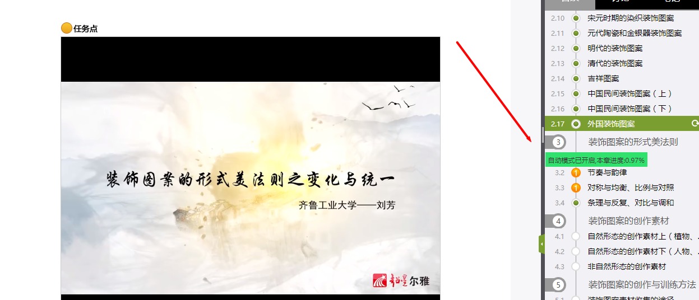

又到一年刷课季，如果你的课程在智慧树，请看我写的另一篇：[破解智慧树视频弹题及实现自动播放下一节](/)

最近选了门超星泛雅的课程，连鼠标都不能乱动呀，动不动播放暂停。身为计科的学生，怎么能被这难倒？

于是昨晚用了一两个小时，写了个破解脚本挂了一夜的网课，今早一看已经看完了。现在我就把我写的JS脚本贴出来，大家直接在视频播放页按F12打开开发者工具，在console粘贴代码回车即可。

**代码如下**：

```java
var fa = $("body");
var btn = $("<li></li>");
var json = {
    "background": "#31e16d",
    "height": "16px",
    "padding": "5px",
    "z-index": 999999,
    "cursor": "pointer",
    "top": "300px",
    "right": "120px",
    "position": "fixed"
};
btn.css(json);
btn.html("<span id='lfsenior'>开启自动播放模式</span>");
fa.append(btn);

btn.click(function () {

    setInterval(function () {
        //获取iframe
        var video = $("iframe").contents().find("iframe").contents();
        //播放函数
        var play = function () {
            video.find("#video > button").click();
            var jy = video.find("#video > div.vjs-control-bar > div.vjs-volume-panel.vjs-control.vjs-volume-panel-vertical > button");
            if (jy.attr("title") != "取消静音") {
                jy.click()
            }
        }
        //如果正在加载
        var load = video.find("#loading");
        if (load.css("visibility") != "hidden") {
            return;
        }
        //获取当前进度
        var spans = video.find("#video > div.vjs-control-bar > div.vjs-progress-control.vjs-control > div").attr("aria-valuenow");
        // 如果还没播放完
        if (spans != 100) {
            play();
        }
        //如果播放结束
        if (spans == 100) {
            var bs = false;
            $(".onetoone").find(".flush").each(function () {
                if (bs) {
                    $(this).prev("a").on('click', "#coursetree>ncells", function () {
                        console.log("已结束章节：" + $(this).prev("a").attr("title"))
                    })
                    var str = $(this).prev("a").attr("href");
                    str = str.match(/'(\S*)'/)[1];
                    var reg = new RegExp("'", "g");
                    str = str.replace(reg, "");
                    var href = str.split(",");
                    getTeacherAjax(href[0], href[1], href[2])
                    bs = false;
                }
                if ($(this).css("display") == "block") {
                    bs = true;
                }
            })
        }
        $("#lfsenior").html("自动模式已开启,本章进度:" + spans + "%");
    }, 100);

});
```

**最终效果**：

