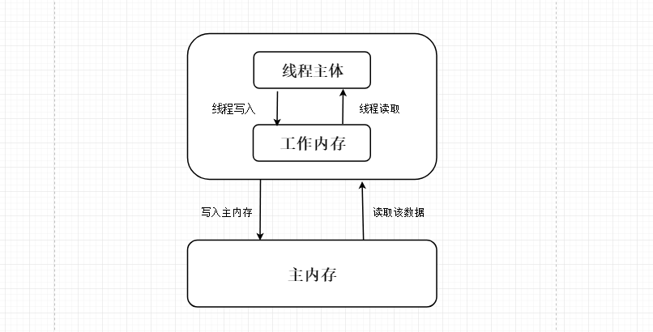
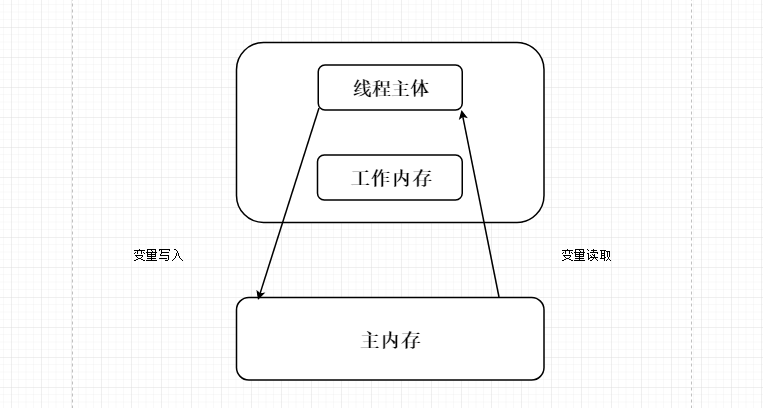

本文主要介绍Java多线程中的同步，也就是如何在Java语言中写出线程安全的程序，如何在Java语言中解决非线程安全的相关问题。阅读本文应该着重掌握如下技术点：

1. synchronized对象监视器为Object时的使用。
2. synchronized对象监视器为Class时的使用。
3. 非线程安全是如何出现的。
4. 关键字volatile的主要作用。
5. 关键字volatile与synchronized的区别及使用情况。

## 1.synchronized同步方法

“非线程安全”其实会在多个线程对同一个对象中的实例变量进行并发访问时发生，产生的后果就是”脏读“，也就是读取到的数据其实是被更改过的。而“线程安全”就是已获得的实例变量的值是经过线程同步处理的，不会出现脏读的现象。

### 1.1 方法内的变量为线程安全

“非线程安全”问题存在于“实例变量”中，如果是方法内部的私有变量，则不存在“非线程安全”问题，所得结果也就是“线程安全”的了。

### 1.2 实例变量的非线程安全

如果多个线程共同访问1个对象中的实例变量，则有可能出现“非线程安全”问题。

用线程访问的对象中如果有多个实例对象，则运行的结果有可能出现交叉的情况。

如果对象仅有一个实例变量，则有可能出现覆盖的情况。

如果两个线程同时访问一个没有同步的方法，如果两个线程同时操作业务对象中的实例变量，则有可能出现“非线程安全”问题。解决这个问题的方法就是在方法前加关键字synchronized即可。

### 1.3 多个对象多个锁

代码示例：

```
public class Run {
    public static void main(String[] args) {
        MyService service1 = new MyService();
        Thread thread1 = new Thread(service1);
        thread1.start();
        MyService service2 = new MyService();
        Thread thread2 = new Thread(service2);
        thread2.start();
    }
}
public class MyService implements Runnable {
    private int i = 0;
    @Override
    synchronized public void run() {
        System.out.println(++i);
    }
}
```

上面示例是两个线程分别访问同一个类的两个不同实例的相同的同步方法，效果却是以异步的方式运行的。本示例由于创建了2个业务对象，在系统中产生出2个锁，所以运行结果是异步的，打印的效果就是1 1。当我们把线程2的参数service2改成service1，打印结果变为1 2。为什么是这样的结果？

关键字 synchronized 取得的线程对象都是对象锁，而不是把一段代码或方法（函数）当做锁，所以在上面的示例中，哪个线程先执行带 synchronized 关键字的方法，哪个线程就持有该方法所属对象的锁Lock，那么其他线程只能呈等待状态，前提是多个线程访问的是同一个对象。

但如果多个线程访问多个对象，则JVM会创建多个锁。

### 1.4 synchronized方法与锁对象

为了证明前面讲的线程锁是对象，示例代码如下：

```
public class MyService implements Runnable {
    @Override
    public void run() {
        System.out.println("begin: "+Thread.currentThread().getName());
        try {
            Thread.sleep(5000);
        } catch (InterruptedException e) {
            e.printStackTrace();
        }
        System.out.println("end");
    }
}
public class Run {
    public static void main(String[] args) {
        MyService service = new MyService();
        Thread thread1 = new Thread(service,"A");
        thread1.start();
        Thread thread2 = new Thread(service,"B");
        thread2.start();
    }
}
```

运行结果：

```
begin: B
begin: A
end
end
```

在run方法前加入关键字synchronized进行同步处理。再次运行结果如下：

```
begin: A
end
begin: B
end
```

通过上面的实验得出结论，调用关键字synchronized声明的方法一定是排队运行的。另外需要牢牢记住“共享”这两个字，只有共享资源读写访问才需要同步化，如果不是共享资源，那么基本就没有同步的必要。

### 1.5 脏读

```
public class MyService{
    private String username = "AA";
    private String password = "aa";

    public void getValue() {
        System.out.println(Thread.currentThread().getName()+" : "+username+" "+password);
    }

    synchronized public void setValue(String username,String password){
        this.username = username;
        try {
            Thread.sleep(1000);
        } catch (InterruptedException e) {
            e.printStackTrace();
        }
        this.password = password;
    }
    
    public static void main(String[] args) throws InterruptedException {
        MyService service = new MyService();
        Thread thread1 = new Thread(() -> service.setValue("BB","bb"),"Thread-A");
        thread1.start();
        Thread.sleep(200);
        Thread thread2 = new Thread(service::getValue,"Thread-B");
        thread2.start();
    }
}

```

打印结果：

```
Thread-B : BB aa
```

出现脏读是因为getValue方法不是同步的，所以可以在任意时候进行调用。解决方法就是加上同步synchronized关键字，代码如下：

```
synchronized public void getValue() {
   System.out.println(Thread.currentThread().getName()+" : "+username+" "+password);
}
```

运行结果：

```
Thread-B : BB bb
```

通过上述示例不仅要知道脏读是通过synchronized关键字解决的，还要知道如下内容：

当A线程调用实例对象的加入synchronized关键字的 X 方法时，A线程就获得了 X 方法锁，更准确地讲，是获得了对象的锁，所以其他线程必须等A线程执行完毕了才可以调用 X 方法，但B线程可以随意调用其他的非 synchronized 同步方法。

脏读一定会出现操作实例变量的情况下，这就是不同线程“争抢”实例变量的结果。

### 1.6 synchronized锁重入

关键字synchronized拥有锁重入的功能，也就是在使用synchronized时，当一个线程得到一个对象后，再次请求此对象锁时是可以再次得到该对象的锁的。这也证明了在一个synchronized方法/块的内部调用本类的其他synchronized方法/块，是永远可以得到锁的。

示例代码：

```
public class MyService{
    synchronized public void service1(){
        System.out.println("service1");
        service2();
    }
    
    synchronized public void service2(){
        System.out.println("service2");
    }
}
```

“可重入锁”的概念是：自己可以再次获取自己的内部锁。可重入锁也支持在父子类继承的环境中。

示例代码：

```
public class MyServiceChild extends MyService{
    synchronized public void service(){
        System.out.println("service1");
        this.service2();
    }
}
```

说明子类是完全可以通过“可重入锁”调用父类的同步方法的。

### 1.7 出现异常,锁自动释放

当一个线程执行的代码出现异常时，其所持有的锁会自动释放。

### 1.8 同步不具有继承性

同步不可以继承。子类继承父类的同步方法时还需要添加synchronized关键字才能保持同步。

## 2.synchronized同步语句块

用关键字synchronized声明方法在某些情况下是有弊端的，比如A线程调用同步方法执行一个长时间的任务，那么B线程则必须等待比较长的时间。在这样的情况下可以使用synchronized同步语句块来解决。synchronized 方法是对当前对象进行加锁，而 synchronized代码块是对某一个对象进行加锁。

### 2.1 synchronized同步代码块的使用

当两个并发线程访问同一个对象object中的synchronized(this)同步代码块时，一段时间内只能有一个线程被执行，另一个线程必须等待当前线程执行完这个代码块以后才能执行该代码块。

示例代码：

```
public class Test {

    public void service(){
        synchronized (this) {
            System.out.println(Thread.currentThread().getName()+" begin: " + System.currentTimeMillis());
            try {
                Thread.sleep(3000);
            } catch (InterruptedException e) {
                e.printStackTrace();
            }
            System.out.println(Thread.currentThread().getName()+" end: " + System.currentTimeMillis());
        }
    }
    public static void main(String[] args) {
        Test test = new Test();
        new Thread(new Runnable() {
            @Override
            public void run() {
                test.service();
            }
        },"Thread-A").start();
        new Thread(new Runnable() {
            @Override
            public void run() {
                test.service();
            }
        },"Thread-B").start();
    }
}
```

运行结果：

```
Thread-A begin: 1537000799741
Thread-A end: 1537000802742
Thread-B begin: 1537000802742
Thread-B end: 1537000805742
```

上述示例证明了同步synchronized代码块真的是同步的。

### 2.2 一半同步，一半异步

我们把前面的示例代码的service方法改造一下：

```
    public void service(){
        System.out.println(Thread.currentThread().getName()+" begin: " + System.currentTimeMillis());
        synchronized (this) {
            try {
                Thread.sleep(3000);
            } catch (InterruptedException e) {
                e.printStackTrace();
            }
            System.out.println(Thread.currentThread().getName()+" end: " + System.currentTimeMillis());
        }
    }
```

再次运行：

```
Thread-A begin: 1537001008952
Thread-B begin: 1537001008952
Thread-A end: 1537001011953
Thread-B end: 1537001014954
```

本实验说明：不在synchronized代码块中就是异步执行，在synchronized块中就是同步执行。

### 2.3 synchronized代码块间的同步性

在使用synchronized(this)代码块需要注意的是，当一个线程访问object的一个synchronized(this)同步代码块时，其它线程对同一个object中所有其他synchronized(this)同步访问被阻塞，这说明synchronized使用的“对象监视器”是一个。

和synchronized关键字修饰的方法一样，synchronize(this)代码块也是锁定的当前对象。

### 2.4 将任意对象作为对象监视器

多个线程调用同一个对象中得不同名称的synchronized同步方法或synchronized(this)同步代码块时，调用的效果就是按顺序执行，也就是同步的，阻塞的。

这说明synchronized同步方法或synchronized同步代码块分别有两种作用。

（1）对其他synchronized同步方法或synchronized(this)同步代码块调用呈阻塞状态。

（2）同一时间只有一个线程可以执行synchronized同步方法或synchronized(this)同步代码块中的代码。

在前面我们使用synchronized(this)格式来同步代码块，其实Java还支持对“任意对象”作为“对象监视器”来实现同步的功能。这个”任意对象“大多数是实例变量及方法的参数，使用格式为synchronized(非this对象)。

根据前面对synchronized(this)同步代码块的作用总结可知，synchronized(非this对象)格式的作用只有1种：synchronized(非this对象 X )同步代码块。

（1）在多个线程持有”对象监视器“为同一个对象的前提下，同一时间只有一个线程可以执行synchronized(非this对象 X)同步代码块。

（2）当持有”对象监视器“为同一个对象的前提下，同一时间只有一个线程可以执行synchronized(非this对象X)同步代码块中的代码。

下面演示下任意对象作为对象监视器的示例：

```
public class Test {
    private String anyObject = new String();
    public void service(){
        synchronized (anyObject) {
            System.out.println(Thread.currentThread().getName()+" begin: " + System.currentTimeMillis());
            try {
                Thread.sleep(3000);
            } catch (InterruptedException e) {
                e.printStackTrace();
            }
            System.out.println(Thread.currentThread().getName()+" end: " + System.currentTimeMillis());
        }
    }
    public static void main(String[] args) {
        Test test = new Test();
        new Thread(new Runnable() {
            @Override
            public void run() {
                test.service();
            }
        },"Thread-A").start();
        new Thread(new Runnable() {
            @Override
            public void run() {
                test.service();
            }
        },"Thread-B").start();
    }
}
```

运行结果：

```
Thread-A begin: 1537008016172
Thread-A end: 1537008019173
Thread-B begin: 1537008019173
Thread-B end: 1537008022173
```

锁非this对象具有一定的优点：如果在一个类中有很多个synchronized方法，这时虽然能实现同步，但会受到阻塞，所以影响运行效率；但如果使用同步代码块锁非this对象，则synchronized(非this)代码块中的程序与同步方法是异步的，不与其他锁this同步方法争抢this锁，则可大大提高运行效率。

再来看下面的示例代码：

```
public class Test {
    private String anyObject = new String();
    public void service(){
        synchronized (anyObject) {
            System.out.println(Thread.currentThread().getName()+" begin: " + System.currentTimeMillis());
            try {
                Thread.sleep(3000);
            } catch (InterruptedException e) {
                e.printStackTrace();
            }
            System.out.println(Thread.currentThread().getName()+" end: " + System.currentTimeMillis());
        }
    }
    synchronized public void service2(){
        System.out.println(Thread.currentThread().getName()+" begin: " + System.currentTimeMillis());
    }
    public static void main(String[] args) {
        Test test = new Test();
        new Thread(new Runnable() {
            @Override
            public void run() {
                test.service();
            }
        },"Thread-A").start();
        new Thread(new Runnable() {
            @Override
            public void run() {
                test.service2();
            }
        },"Thread-B").start();
    }
}
```

运行结果：

```
Thread-A begin: 1537009027680
Thread-B begin: 1537009027681
Thread-A end: 1537009030680
```

可见，使用“synchronized(非this对象x)同步代码块”格式进行同步操作时，对象监视器必须是同一个对象，如果不是同一个对象。如果不是同一个对象监视器，运行的结果就是异步调用了，就会交叉运行。

### 2.5 细化三个结论

”synchronized(非this对象X)“格式的写法是将x对象本身作为“对象监视器”，这样就可以得出以下3个结论：

1. 当多个线程同时执行synchronized(X){}同步代码块时呈同步效果。
2. 当其他线程执行X对象中synchronized同步方法时呈同步效果。
3. 当其他线程执行X对象方法里面的synchronized(this)代码块时也呈现同步效果。
4. 但需要注意的是，如果其他线程调用不加synchronized关键字的方法时，还是异步调用。

### 2.6 静态同步synchronized方法与synchronized(class)代码块

关键字synchronized还可以在static静态方法上，如果这样写，那是对当前的*.java文件对应的Class类进行持锁。

下面测试静态同步方法：

```
public class Test2 {
    synchronized public static void service() {
        System.out.println(Thread.currentThread().getName() + " begin: " + System.currentTimeMillis());
        try {
            Thread.sleep(3000);
        } catch (InterruptedException e) {
            e.printStackTrace();
        }
        System.out.println(Thread.currentThread().getName() + " end: " + System.currentTimeMillis());
    }

    public static void main(String[] args) {
        new Thread(new Runnable() {
            @Override
            public void run() {
                Test2.service();
            }
        }, "Thread-A").start();
        new Thread(new Runnable() {
            @Override
            public void run() {
                Test2.service();
            }
        }, "Thread-B").start();
    }
}
```

运行结果：

```
Thread-A begin: 1537011409603
Thread-A end: 1537011412608
Thread-B begin: 1537011412608
Thread-B end: 1537011415608
```

synchronized关键字加到static静态方法上是给Class类上锁，而synchronized关键字加到非static静态方法上是给对象上锁。

为了验证对象锁和Class锁不是同一个锁，来看下面的代码：

```
public class Test2 {
    synchronized public static void service() {
        System.out.println(Thread.currentThread().getName() + " begin: " + System.currentTimeMillis());
        try {
            Thread.sleep(3000);
        } catch (InterruptedException e) {
            e.printStackTrace();
        }
        System.out.println(Thread.currentThread().getName() + " end: " + System.currentTimeMillis());
    }
    synchronized public void service2(){
        System.out.println(Thread.currentThread().getName() + " begin: " + System.currentTimeMillis());
        try {
            Thread.sleep(3000);
        } catch (InterruptedException e) {
            e.printStackTrace();
        }
        System.out.println(Thread.currentThread().getName() + " end: " + System.currentTimeMillis());
    }
    public static void main(String[] args) {
        new Thread(new Runnable() {
            @Override
            public void run() {
                Test2.service();
            }
        }, "Thread-A").start();
        new Thread(new Runnable() {
            @Override
            public void run() {
                new Test2().service2();
            }
        }, "Thread-B").start();
    }
}
```

运行结果：

```
Thread-A begin: 1537012019151
Thread-B begin: 1537012019152
Thread-A end: 1537012022152
Thread-B end: 1537012022152
```

异步的原因是持有不同的锁，一个是对象锁，另外一个是Class锁，Class锁可以对所有类的实例对象起作用。

下面我们测试synchronized(class)代码块，示例代码如下：

```
public class Test {
    public void service(){
        synchronized (Test.class) {
            System.out.println(Thread.currentThread().getName()+" begin: " + System.currentTimeMillis());
            try {
                Thread.sleep(3000);
            } catch (InterruptedException e) {
                e.printStackTrace();
            }
            System.out.println(Thread.currentThread().getName()+" end: " + System.currentTimeMillis());
        }
    }
    public static void main(String[] args) {
        new Thread(new Runnable() {
            @Override
            public void run() {
                new Test().service();
            }
        },"Thread-A").start();
        new Thread(new Runnable() {
            @Override
            public void run() {
                new Test().service();
            }
        },"Thread-B").start();
    }
}
```

运行结果：

```
Thread-A begin: 1537011197190
Thread-A end: 1537011200191
Thread-B begin: 1537011200191
Thread-B end: 1537011203191
```

同步synchronized(class)代码块的作用其实和synchronized static方法的作用一样。

### 2.7 数据类型String的常量池特性

在JVM中具有String常量池缓存的功能，将synchronized(String)同步块与String联合使用时，要注意常量池以带来的一些例外。

```
public class Test {
    public void service(String str){
        synchronized (str) {
            while (true) {
                System.out.println(Thread.currentThread().getName() + " time: " + System.currentTimeMillis());
            }
        }
    }
    public static void main(String[] args) {
        new Thread(new Runnable() {
            @Override
            public void run() {
                new Test().service("AA");
            }
        },"Thread-A").start();
        new Thread(new Runnable() {
            @Override
            public void run() {
                new Test().service("AA");
            }
        },"Thread-B").start();
    }
}
```

运行结果：

```
Thread-A time: 1537013470535
Thread-A time: 1537013470535
Thread-A time: 1537013470535
...
```

运行结果显示A线程陷入了死循环，而B线程一直在等待未执行。出现这样的结果就是两个持有相同的锁，所以造成B线程不能执行。这就是String常量池带来的问题。因此在大多数情况下，同步synchronized代码块都不使用String作为锁对象，而改用其他，比如new Object()实例化一个Object对象，但它并不放入缓存中。

改造后的代码：

```
public class Test {
    public void service(Object str){
        synchronized (str) {
            while (true) {
                System.out.println(Thread.currentThread().getName() + " time: " + System.currentTimeMillis());
            }
        }
    }
    public static void main(String[] args) {
        new Thread(new Runnable() {
            @Override
            public void run() {
                new Test().service(new Object());
            }
        },"Thread-A").start();
        new Thread(new Runnable() {
            @Override
            public void run() {
                new Test().service(new Object());
            }
        },"Thread-B").start();
    }
}
```

运行结果：

```
Thread-A time: 1537015931981
Thread-A time: 1537015931982
Thread-B time: 1537015931982
Thread-B time: 1537015931982
...
```

交替打印的原因是持有的锁不是一个。

### 2.8 同步synchronized方法无限等待与解决

同步方法极易造成死循环。示例代码：

```
public class Test {
    synchronized public void serviceA() {
        System.out.println(Thread.currentThread().getName() + " begin: " + System.currentTimeMillis());
        boolean is = true;
        while (is){

        }
        System.out.println(Thread.currentThread().getName() + " end: " + System.currentTimeMillis());
    }

    synchronized public void serviceB() {
        System.out.println(Thread.currentThread().getName() + " begin: " + System.currentTimeMillis());
        System.out.println(Thread.currentThread().getName() + " end: " + System.currentTimeMillis());
    }

    public static void main(String[] args) {
        Test test = new Test();
        new Thread(new Runnable() {
            @Override
            public void run() {
                test.serviceA();
            }
        }, "Thread-A").start();
        new Thread(new Runnable() {
            @Override
            public void run() {
                test.serviceB();
            }
        }, "Thread-B").start();
    }
}
```

线程B永远得不到运行的机会，锁死了。

解决的方法就是使用同步块。更改后的代码如下：

```
public class Test {
    private Object objectA = new Object();
    public void serviceA() {
        synchronized (objectA) {
            System.out.println(Thread.currentThread().getName() + " begin: " + System.currentTimeMillis());
            boolean is = true;
            while (is) {

            }
            System.out.println(Thread.currentThread().getName() + " end: " + System.currentTimeMillis());
        }
    }

    private Object objectB = new Object();
    synchronized public void serviceB() {
        synchronized (objectB) {
            System.out.println(Thread.currentThread().getName() + " begin: " + System.currentTimeMillis());
            System.out.println(Thread.currentThread().getName() + " end: " + System.currentTimeMillis());
        }
    }
    ....
}
```

### 2.9 多线程的死锁

Java多线程死锁是一个经典问题，因为不同的线程都在等待根本不可能被释放的锁，从而导致所有的任务都无法完成。在多线程技术中，“死锁”是必须避免的，因为这会造成线程的“假死”。

示例代码：

```
public class DealThread implements Runnable {
    public String username;
    public Object locak1 = new Object();
    public Object locak2 = new Object();
    public void setFlag(String username){
        this.username = username;
    }

    @Override
    public void run() {
        if (username.equals("a")){
            synchronized (locak1){
                System.out.println("username:"+username);
                try {
                    Thread.sleep(3000);
                } catch (InterruptedException e) {
                    e.printStackTrace();
                }
                synchronized (locak2){
                    System.out.println("按lock1-》lock2执行");
                }
            }
        }

        if (username.equals("b")){
            synchronized (locak2){
                System.out.println("username:"+username);
                try {
                    Thread.sleep(3000);
                } catch (InterruptedException e) {
                    e.printStackTrace();
                }
                synchronized (locak1){
                    System.out.println("按lock2-》lock1执行");
                }
            }
        }
    }

    public static void main(String[] args) throws InterruptedException {
        DealThread dealThread = new DealThread();
        dealThread.setFlag("a");
        Thread threadA = new Thread(dealThread);
        threadA.start();
        Thread.sleep(100);
        dealThread.setFlag("b");
        Thread threadB = new Thread(dealThread);
        threadB.start();
    }
}
```

运行结果，出现死锁：

```
username:a
username:b
```

死锁是程序设计的Bug，在设计程序时就需要避免双方互相持有对方的锁的情况。需要说明的是，本实验使用synchronized嵌套的代码结构来实现死锁，其实不使用嵌套的代码结构也会出现死锁，与嵌套不嵌套无任何关系，不要被代码结构所误导。只要互相等待对方释放锁就有可能出现死锁。

> 可以使用JDK自带的工具来检测是否有死锁的现象。首先进入CMD命令行界面，再进入JDK的安装文件夹中的
>
> bin目录，执行jps命令。得到运行的线程Run的id值。再执行jstack命令，查看结果。

完整命令演示如下：

```
D:\Java\jdk1.8.0\bin>jps
8240 Launcher
13252 Jps
12312
7948 DealThread
D:\Java\jdk1.8.0\bin>jstack -l 7948
....

Java stack information for the threads listed above:
===================================================
"Thread-1":
        at cn.zyzpp.thread2_3.DealThread.run(DealThread.java:39)
        - waiting to lock <0x00000000d6089e80> (a java.lang.Object)
        - locked <0x00000000d6089e90> (a java.lang.Object)
        at java.lang.Thread.run(Thread.java:745)
"Thread-0":
        at cn.zyzpp.thread2_3.DealThread.run(DealThread.java:25)
        - waiting to lock <0x00000000d6089e90> (a java.lang.Object)
        - locked <0x00000000d6089e80> (a java.lang.Object)
        at java.lang.Thread.run(Thread.java:745)

Found 1 deadlock.
```

### 2.10 锁对象的改变

在任何数据类型作为同步锁时，需要注意的是，是否有多个线程同时持有锁对象，如果同时持有锁对象，则这些线程之间就是同步的；如果分别获得锁对象，这些线程之间就是异步的。

```
public class Test {
    private String lock = "123";
    public void service(){
        synchronized (lock) {
            System.out.println(Thread.currentThread().getName()+" begin: " + System.currentTimeMillis());
            lock = "456";
            try {
                Thread.sleep(2000);
            } catch (InterruptedException e) {
                e.printStackTrace();
            }
            System.out.println(Thread.currentThread().getName()+" end: " + System.currentTimeMillis());
        }
    }
    public static void main(String[] args) throws InterruptedException {
        Test test = new Test();
        new Thread(new Runnable() {
            @Override
            public void run() {
                test.service();
            }
        },"Thread-A").start();
        Thread.sleep(50);
        new Thread(new Runnable() {
            @Override
            public void run() {
                test.service();
            }
        },"Thread-B").start();
    }
}
```

运行结果：

```
Thread-A begin: 1537019992452
Thread-B begin: 1537019992652
Thread-A end: 1537019994453
Thread-B end: 1537019994653
```

为什么是乱序？因为50ms过后线程取得的锁时“456”。

把lock = "456"放在Thread.sleep(2000)之后，再次运行。

```
Thread-A begin: 1537020101553
Thread-A end: 1537020103554
Thread-B begin: 1537020103554
Thread-B end: 1537020105558
```

线程A和线程B持有的锁都是“123”，虽然将锁改成了“456”，但结果还是同步的，因为A和B争抢的锁是“123”。

还需要提示一下，只要对象不变，即使对象的属性被改变，运行的结果还是同步的。

## 3.volatile关键字

关键字volatile的主要作用是使变量在多个线程间可见。

### 3.1 关键字volatile与死循环

如果不是在多继承的情况下，使用继承Thread类和实现Runnable接口在取得程序运行的结果上并没有多大的区别。如果一旦出现”多继承“的情况，则用实现Runable接口的方式来处理多线程的问题就是很有必要的。

```
public class PrintString implements Runnable{
    private boolean isContinuePrint = true;

    @Override
    public void run() {
        while (isContinuePrint){
            System.out.println("Thread: "+Thread.currentThread().getName());
            try {
                Thread.sleep(1000);
            } catch (InterruptedException e) {
                e.printStackTrace();
            }
        }
    }

    public boolean isContinuePrint() {
        return isContinuePrint;
    }

    public void setContinuePrint(boolean continuePrint) {
        isContinuePrint = continuePrint;
    }

    public static void main(String[] args) throws InterruptedException {
        PrintString printString = new PrintString();
        Thread thread = new Thread(printString,"Thread-A");
        thread.start();
        Thread.sleep(100);
        System.out.println("我要停止它！" + Thread.currentThread().getName());
        printString.setContinuePrint(false);
    }
}
```

运行结果：

```
Thread: Thread-A
我要停止它！main
```

上面的代码运行起来没毛病，但是一旦运行在 -server服务器模式中64bit的JVM上时，会出现死循环。解决的办法是使用volatile关键字。

> 关键字volatile的作用是强制从公共堆栈中取得变量的值，而不是从线程私有数据栈中取得变量的值。

### 3.2 解决异步死循环

在研究volatile关键字之前先来做一个测试用例，代码如下：

```
public class PrintString implements Runnable{
    private boolean isRunnning = true;

    @Override
    public void run() {
        System.out.println("Thread begin: "+Thread.currentThread().getName());
        while (isRunnning == true){
        }
        System.out.println("Thread end: "+Thread.currentThread().getName());
    }

    public boolean isRunnning() {
        return isRunnning;
    }

    public void setRunnning(boolean runnning) {
        isRunnning = runnning;
    }

    public static void main(String[] args) throws InterruptedException {
        PrintString printString = new PrintString();
        Thread thread = new Thread(printString,"Thread-A");
        thread.start();
        Thread.sleep(1000);
        printString.setRunnning(false);
        System.out.println("我要停止它！" + Thread.currentThread().getName());
    }

}
```

JVM有Client和Server两种模式，我们可以通过运行：java -version来查看jvm默认工作在什么模式。我们在IDE中把JVM设置为在Server服务器的环境中，具体操作只需配置运行参数为 `-server`。然后启动程序，打印结果：

```
Thread begin: Thread-A
我要停止它！main
```

代码 `System.out.println("Thread end: "+Thread.currentThread().getName());`从未被执行。

是什么样的原因造成将JVM设置为-server就出现死循环呢？

在启动thread线程时，变量`boolean isContinuePrint = true;`存在于公共堆栈及线程的私有堆栈中。在JVM设置为-server模式时为了线程运行的效率，线程一直在私有堆栈中取得isRunning的值是true。而代码thread.setRunning(false);虽然被执行，更新的却是公共堆栈中的isRunning变量值false，所以一直就是死循环的状态。内存结构图：




这个问题其实就是私有堆栈中的值和公共堆栈中的值不同步造成的。解决这样的问题就要使用volatile关键字了，它主要的作用就是当线程访问isRunning这个变量时，强制性从公共堆栈中进行取值。

将代码更改如下：

```
volatile private boolean isRunnning = true;
```

再次运行：

```
Thread begin: Thread-A
我要停止它！main
Thread end: Thread-A
```

通过使用volatile关键字，强制的从公共内存中读取变量的值，内存结构如图所示：




使用volatile关键字增加了实例变量在多个线程之间的可见性。但volatile关键字最致命的缺点是不支持原子性。

下面将关键字synchronized和volatile进行一下比较：

1. 关键字volatile是线程同步的轻量级实现，所以volatile性能肯定比synchronized要好，并且volatile只能修饰于变量，而synchronized可以修饰方法，以及代码块。随着JDK新版本的发布，synchronized关键字在执行效率上得到很大提升，在开发中使用synchronized关键字的比率还是比较大的。
2. 多线程访问volatile不会发生阻塞，而synchronized会出现阻塞。
3. volatile能保证数据的可见性，但不能保证原子性；而synchronized可以保证原子性，也可以间接保证可见性，因为它会将私有内存和公共内存中的数据做同步。
4. 再次重申一下，关键字volatile解决的是变量在多个线程之间的可见性；而synchronized关键字解决的是多个线程之间访问资源的同步性。

线程安全包含原子性和可见性两个方面，Java的同步机制都是围绕这两个方面来确保线程安全的。

### 3.3 volatile非原子性的特征

关键字虽然增加了实例变量在多个线程之间的可见性，但它却不具备同步性，那么也就不具备原子性。

示例代码：

```
public class MyThread extends Thread {
    volatile private static int count;
    @Override
    public void run() {
        addCount();
    }

    private void addCount() {
        for (int i = 0;i<100;i++){
            count++;
        }
        System.out.println(count);
    }

    public static void main(String[] args) {
        MyThread[] myThreads = new MyThread[100];
        for (int i=0;i<100;i++){
            myThreads[i] = new MyThread();
        }
        for (int i=0;i<100;i++){
            myThreads[i].start();
        }
    }
}
```

运行结果：

```
...
8253
8353
8153
8053
7875
7675
```

在addCount方法上加入synchronized同步关键字与static关键字，达到同步的效果。

再次运行结果：

```
....
9600
9700
9800
9900
10000
```

关键字volatile提示线程每次从共享内存中读取变量，而不是从私有内存中读取，这样就保证了同步数据的可见性。但在这里需要注意的是：如果修改实例变量中的数据，比如i++，也就是比

i=i+1，则这样的操作其实并不是一个原子操作，也就是非线程安全。表达式i++的操作步骤分解为下面三步：

1. 从内存中取i的值；
2. 计算i的值；
3. 将i值写入到内存中。

假如在第二步计算i值的时候，另外一个线程也修改i的值，那么这个时候就会脏数据。解决的方法其实就是使用synchronized关键字。所以说volatile关键字本身并不处理数据的原子性，而是强制对数据的读写及时影响到主内存中。

### 3.4 使用原子类进行i++操作

除了在i++操作时使用synchronized关键字实现同步外，还可以使用AtomicInteger原子类进行实现。

原子操作是不可分割的整体，没有其他线程能够中断或检查正在原子操作中的变量。它可以在没有锁的情况下做到线程安全。

示例代码：

```
public class MyThread extends Thread {
    private static AtomicInteger count = new AtomicInteger(0);
    @Override
    public void run() {
        addCount();
    }

    private static void addCount() {
        for (int i = 0;i<100;i++){
            System.out.println(count.incrementAndGet());
        }
    }

    public static void main(String[] args) {
        MyThread[] myThreads = new MyThread[100];
        for (int i=0;i<100;i++){
            myThreads[i] = new MyThread();
        }
        for (int i=0;i<100;i++){
            myThreads[i].start();
        }
    }
}
```

打印结果：

```
....
9996
9997
9998
9999
10000
```

成功达到累加的效果。

### 3.5 原子类也不安全

原子类在具有有逻辑性的情况下输出结果也具有随机性。


示例代码：

```
public class MyThread extends Thread {
    private static AtomicInteger count = new AtomicInteger(0);

    public MyThread(String name) {
        super(name);
    }

    @Override
    public void run() {
        this.addCount();
    }

    private void addCount() {
        System.out.println(Thread.currentThread().getName()+"加100之后："+count.addAndGet(100));
        count.addAndGet(1);
    }

    public static void main(String[] args) throws InterruptedException {
        MyThread[] myThreads = new MyThread[10];
        for (int i = 0; i < 10; i++) {
            myThreads[i] = new MyThread("Thread-"+i);
        }
        for (int i = 0; i < 10; i++) {
            myThreads[i].start();
        }
        Thread.sleep(2000);
        System.out.println(MyThread.count);
    }
}
```

打印结果：

```
Thread-0加100之后：100
Thread-2加100之后：201
Thread-1加100之后：302
Thread-5加100之后：602
Thread-4加100之后：502
Thread-3加100之后：402
Thread-6加100之后：706
Thread-7加100之后：807
Thread-9加100之后：908
Thread-8加100之后：1009
1010
```

可以看到，结果值正确但是打印顺序出错了，出现这样的原因是因为AtomicInteger的addAndGet()方法是原子的，但方法与方法之间的调用却不是原子的。也就是方法addCount的调用不是原子的。解决这样的问题必须要用同步。

### 3.6 synchronized代码块有volatile同步的功能

关键字synchronized可以使多个线程访问同一个资源具有同步性，而且它还具有将线程工作内存中的私有变量与公共内存中的变量同步的功能。

我们把前面讲到的异步死循环代码改造一下：

```
public class PrintString implements Runnable{
    private boolean isRunnning = true;

    @Override
    public void run() {
        String lock = new String();
        System.out.println("Thread begin: "+Thread.currentThread().getName());
        while (isRunnning == true){
            synchronized (lock){
				//加与不加的效果就是是否死循环
            }
        }
        System.out.println("Thread end: "+Thread.currentThread().getName());
    }

    public boolean isRunnning() {
        return isRunnning;
    }

    public void setRunnning(boolean runnning) {
        isRunnning = runnning;
    }

    public static void main(String[] args) throws InterruptedException {
        PrintString printString = new PrintString();
        Thread thread = new Thread(printString,"Thread-A");
        thread.start();
        Thread.sleep(1000);
        printString.setRunnning(false);
        System.out.println("我要停止它！" + Thread.currentThread().getName());
    }

}
```

打印结果：

```
Thread begin: Thread-A
我要停止它！main
Thread end: Thread-A
```

关键字synchronized可以保证在同一时刻，只有一个线程可以执行某一个方法或某一个代码块。它包含两个特征：互斥相和可见性。同步synchronized不仅可以解决一个线程看到对象处于不一致的状态，还可以保证进入同步方法或者同步代码块的每个线程，都看到由同一个锁保护之前所有的修改效果。

学习多线程并发。要着重“外修互斥，内修可见”，这是掌握多线程、学习多线程并发的重要技术点。


## 参考

*《Java多线程编程核心技术》高洪岩著*

## 扩展

## 扩展

[Java多线程编程核心技术(一)Java多线程技能](https://www.cnblogs.com/yueshutong/p/9575698.html)

[Java多线程编程核心技术(三)多线程通信](https://www.cnblogs.com/yueshutong/p/9674166.html)

[Java多线程核心技术(四)Lock的使用](https://www.cnblogs.com/yueshutong/p/9677342.html)

[Java多线程核心技术(五)单例模式与多线程](https://www.cnblogs.com/yueshutong/p/9678050.html)

[Java多线程核心技术(六)线程组与线程异常](https://www.cnblogs.com/yueshutong/p/9681041.html)