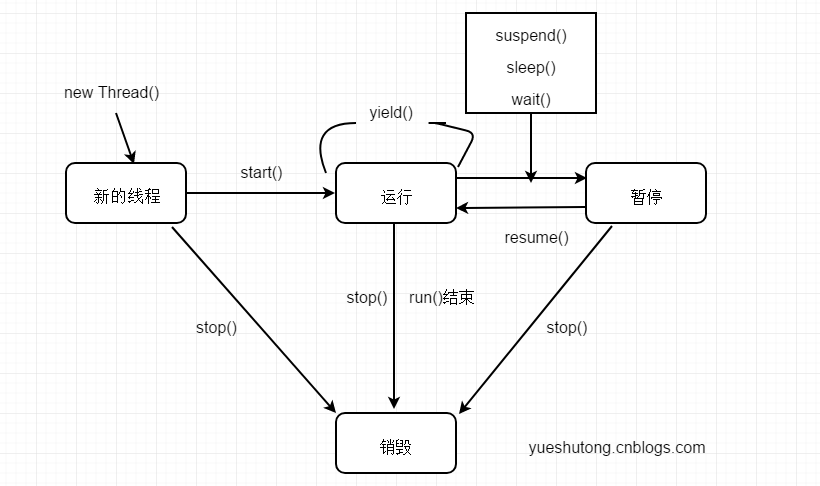

> 线程是操作系统中独立的个体，但这些个体如果不经过特殊的处理就不能成为一个整体。线程间的通信就是成为整体的必用方案之一，可以说，使线程间进行通信后，系统之间的交互性会更强大，在大大提高CPU利用率的同时还会使程序员对各线程任务在处理的过程中进行有效的把控与监督。

在本章中需要着重掌握的技术点如下：

- 使用wait/notify实现线程间的通信
- 生产者/消费者模式的实现
- 方法join的使用
- ThreadLocal类的使用

## 1.等待 / 通知机制

通过本节可以学习到，线程与线程之间不是独立的个体，它们彼此之间可以互相通信和协作。

### 1.1 不使用等待 / 通知机制实现线程间通信

下面的示例，是sleep()结合while(true)死循环来实现多个线程间通信。

```
public class MyService {
    volatile private List<Integer> list = new ArrayList<>();
    public void add(){
        list.add(1);
    }
    public int size(){
        return list.size();
    }

    public static void main(String[] args) {
        MyService myService = new MyService();
        new Thread(new Runnable() {
            @Override
            public void run() {
                for (int i= 0;i<10;i++) {
                    myService.add();
                    System.out.println("添加了"+myService.size()+"个元素");
                    try {
                        Thread.sleep(1000);
                    } catch (InterruptedException e) {
                        e.printStackTrace();
                    }
                }
            }
        }).start();
        new Thread(new Runnable() {
            @Override
            public void run() {
                try {
                    while (true){
                        if (myService.size() == 5){
                            System.out.println(" == 5 ，我要退出了");
                            throw new InterruptedException();
                        }

                    }
                } catch (InterruptedException e) {
                    System.out.println(myService.size());
                    e.printStackTrace();
                }
            }
        }).start();

    }
}
```

打印结果：

```
添加了1个元素
添加了2个元素
添加了3个元素
添加了4个元素
添加了5个元素
 == 5 ，我要退出了
5
java.lang.InterruptedException
	at cn.zyzpp.thread3_1.MyService$2.run(MyService.java:42)
	at java.lang.Thread.run(Thread.java:745)
添加了6个元素
添加了7个元素
添加了8个元素
添加了9个元素
添加了10个元素
```

虽然两个线程间实现了通信，但有一个弊端就是，线程ThreadB.java不停地通过while语句轮询机制来检测某一个条件，这样会浪费CPU资源。如果轮询的时间间隔很小，更浪费CPU资源；如果轮询的时间间隔很大，有可能会取不到想要得到的数据。所以就需要一种机制来实现减少CPU的资源浪费，而且还可以实现在多个线程间通信，它就是“wait / notify”机制。

### 1.2 什么是等待 / 通知机制

等待 / 通知机制在生活中比比皆是，比如你去餐厅点餐，服务员去取菜，菜暂时还没有做出来，这时候服务员就进入”等待“的状态，等到厨师把菜放在菜品传递台上，其实就相当于一种”通知“，这时服务员才可以拿到菜并交给就餐者。

需要说明的是，上节多个线程间也可以实现通信，原因是多个线程共同访问同一个变量，但那种通信不是“等待/通知”，两个线程完全是主动式地读取一个共享变量，在花费读取时间的基础上，读到的值是不是想要的，并不能完全确定。所以现在迫切需要一种“等待 / 通知”机制来满足上面的要求。

### 1.3 等待 / 通知机制的实现

方法 wait() 的作用是使当前执行代码的线程进行等待，wait()方法是object类的方法，该方法用来将当前线程置于“预执行队列”中，并且在wait()所在的代码行处停止执行，直到接到通知或被中断为止。在调用wait()方法之前，线程必须拿到该对象的对象级别锁。在从wait()返回前，线程与其他线程竞争重新获得锁。如果调用wait()时没有持有适当的锁，则抛出 java.lang.IllegalMonitorStateException 异常，它是RuntimeException 的一个子类，因此，不需要try-catch语句进行捕捉异常。

方法notify()也要在同步方法或同步块中调用，即在调用前，线程也必须获得该对象的对象级别锁。如果调用notify时没有适当的锁，也会抛出 java.lang.IllegalMonitorStateException 异常。该方法用来通知那些可能等待该对象的对象锁的其他线程，如果有多个线程等待，则由线程规划器随机挑选出其中一个呈 wait 状态的线程，对其发出通知 notify，并使它等待获取该对象的对象锁。需要说明的是，在执行 notify 方法后，当前线程不会马上释放该对象锁，呈 wait 状态的线程也并不能马上获取该对象锁，要等到执行 notify() 方法的线程将程序执行完，也就是退出 synchronized 代码块后，当前线程才会释放锁，而呈wait状态所在的线程才可以获取该对象锁。当第一个获得了该对象锁的 wait 线程运行完毕以后，它会释放掉该对象锁，此时如果该对象没有再次使用 notify 语句，则该对象以及空闲，其它 wait 状态等待的线程由于没有得到该对象的通知，还会继续阻塞在 wait 状态，知道直到这个对象发出一个 notify 或 notifyAll。

用一句话来总结一下 wait 和 notify ：**wait 使线程停止运行，而 notify 使停止的线程继续运行**。

示例代码：

```
public class MyServiceTwo extends Thread {
    private Object lock;
    
    public MyServiceTwo(Object object) {
        this.lock = object;
    }
    
    @Override
    public void run() {
        try {
            synchronized (lock){
                System.out.println("开始等待"+System.currentTimeMillis());
                lock.wait();
                System.out.println("结束等待"+System.currentTimeMillis());
            }
        } catch (InterruptedException e) {
            e.printStackTrace();
        }
    }
    
}

public class MyServiceThree extends Thread {
    private Object lock;

    public MyServiceThree(Object object) {
        this.lock = object;
    }

    @Override
    public void run() {
        synchronized (lock) {
            System.out.println("开始通知" + System.currentTimeMillis());
            lock.notify();
            System.out.println("结束通知" + System.currentTimeMillis());
        }
    }

    public static void main(String[] args) throws InterruptedException {
        Object lock = new Object();
        MyServiceTwo serviceTwo = new MyServiceTwo(lock);
        serviceTwo.start();
        Thread.sleep(100);
        MyServiceThree serviceThree = new MyServiceThree(lock);
        serviceThree.start();
    }

}
```

打印结果：

```
开始等待1537185132949
开始通知1537185133048
结束通知1537185133048
结束等待1537185133048
```

从控制台的打印来看，100ms后线程被 notify 通知唤醒。

下面我们使用 wait / notify 来实现刚开始的实验：

```
public class MyService {
    volatile private List<Integer> list = new ArrayList<>();

    public void add() {
        list.add(1);
    }

    public int size() {
        return list.size();
    }

    public static void main(String[] args) {
        MyService myService = new MyService();
        Object lock = new Object();
        new Thread(new Runnable() {
            @Override
            public void run() {
                try {
                    synchronized (lock) {
                        if (myService.size() != 5) {
                            System.out.println("等待 "+System.currentTimeMillis());
                            lock.wait();
                            System.out.println("等待结束 "+System.currentTimeMillis());
                        }
                    }
                } catch (InterruptedException e) {
                    e.printStackTrace();
                }
            }
        }).start();
        new Thread(new Runnable() {
            @Override
            public void run() {
                synchronized (lock) {
                    for (int i = 0; i < 10; i++) {
                        if (myService.size() == 5){
                            lock.notify();
                            System.out.println("已发出通知！");
                        }
                        myService.add();
                        System.out.println("添加了" + myService.size() + "个元素");
                        try {
                            Thread.sleep(1000);
                        } catch (InterruptedException e) {
                            e.printStackTrace();
                        }
                    }
                }
            }
        }).start();

    }
}
```

打印结果：

```
等待 1537186277023
添加了1个元素
添加了2个元素
添加了3个元素
添加了4个元素
添加了5个元素
已发出通知！
添加了6个元素
添加了7个元素
添加了8个元素
添加了9个元素
添加了10个元素
等待结束 1537186287034
```

日志信息 wait end 在最后输出，这也说明 notify 方法执行后并不立即释放锁。

关键字 synchronized 可以将任何一个 Object 对象作为同步对象来看待，而 Java 为每个 Object 都实现了 wait 和 notify 方法，它们必须用在被 synchronized 同步的 object 的临界区内。通过调用 wait() 方法可以使处于临界区内的线程进入等待状态，同时释放被同步对象对象的锁。而 notify 操作可以唤醒一个因调用了 wait 操作而处于阻塞状态中的线程，使其进入就绪状态。被重新换醒的线程会试图重新获得临界区的控制权，也就是锁，并继续执行临界区内 wait 之后的代码。如果发出 notify 操作时没有处于阻塞状态中的线程，那么该命令会被忽略。

wait 方法可以使调用该方法的线程释放共享资源的锁，然后从运行状态退出，进入等待队列，直到被再次唤醒。

notify 方法可以随机唤醒等待队列中等待同一共享资源的“一个”线程，并使该线程退出等待队列，进入可运行状态，也就是 notify() 方法仅通知“一个”线程。

notifyAll() 方法可以使所有正在等待队列中等待同一共享资源的“全部”线程从等待状态退出，进入可运行状态。并使该线程退出等待队列，进入可运行状态。此时，优先级最高的那个线程最先执行，但也有可能是随机执行，因为这要取决于JVM虚拟机的实现。

在《[Java多线程编程核心技术(一)Java多线程技能](/)》中，已经介绍了与Thread有关的大部分 API ，这些 API 可以改变线程对象的状态。




1. 新创建一个新的线程对象后，再调用它的 start() 方法，系统会为此线程分配CPU资源，使其处于 Runnable（可运行）状态，这是一个准备运行的阶段。如果线程抢占到CPU资源，此线程就处于 Running(运行)状态。

2. Runnable 状态和 Running 状态可相互切换，因为有可能线程运行一段时间后，有其他高优先级的线程抢占了CPU资源，这时此线程就从 Running 状态变成 Runnable 状态。

   线程进入Runable 状态大体分为如下3中情况：

   - 调用 sleep方法后经过的时间超过了指定的休眠时间。
   - 线程调用的阻塞IO已经返回，阻塞方法执行完毕。
   - 线程成功地获得了试图同步的监视器。
   - 线程正在等待某个通知，其他线程发出了通知。
   - 处于挂起状态的线程调用了 resurne恢复方法。

3. Blocked是阻寒的意思, 例如遇到了一个IO操作, 此时CPU处于空闲状态, 可能会转而把CPU时间片分配给其他线程, 这时也可以称为“暂停”状态。 Blocked 状态结束后，进入 Runnable状态, 等待系统重新分配资源。

   出现阻塞的情况大体分为如下5种：

   - 线程调用 sleep方法, 主动放弃占用的处理器资源。
   - 线程调用了阻塞式IO方法，在该方法返回前，该线程被阻塞。
   - 线程试图获得一个同步监视器，但该同步监视器正被其他线程所持有。
   - 线程等待某个通知。
   - 程序调用了 suspend方法将该线程挂起。此方法容易导致死锁，尽量避免使用该方法。

4. main() 方法运行结束后进人销毁阶段，整个线程执行完毕。

每个锁对象都有两个队列，一个是就绪队列，一个是阻塞队列。就绪队列存储了将要获得锁的线程，阻塞队列存储了被阻塞的线程。一个线程被唤醒后，才会进入就绪队列，等待CPU的调度；反之，一个线程被 wait 后，就会进入阻塞队列，等待下一次被唤醒。 

### 1.4 方法wait()锁释放与notify()锁不释放

当方法 wait() 被执行后，锁自动释放，但执行完 notify() 方法，锁却不自动释放。

### 1.5 当interrupt方法遇到wait方法

当线程呈 wait() 方法时，调用线程对象的 interrupt() 方法会出现 InterruptedException 异常。

下面我们做一个实验：

```
public class MyServiceTwo extends Thread {
    private Object lock;

    public MyServiceTwo(Object object) {
        this.lock = object;
    }


    @Override
    public void run() {
        try {
            synchronized (lock){
                System.out.println("开始等待"+System.currentTimeMillis());
                lock.wait();
                System.out.println("结束等待"+System.currentTimeMillis());
            }
        } catch (InterruptedException e) {
            e.printStackTrace();
            System.out.println("出现异常了");
        }
    }

    public static void main(String[] args) throws InterruptedException {
        Object lock = new Object();
        MyServiceTwo service = new MyServiceTwo(lock);
        service.start();
        Thread.sleep(5000);
        service.interrupt();
    }
    
}
```

运行结果：

```
开始等待1537194007598
java.lang.InterruptedException
出现异常了
	at java.lang.Object.wait(Native Method)
	at java.lang.Object.wait(Object.java:502)
	at cn.zyzpp.thread3_1.MyServiceTwo.run(MyServiceTwo.java:19)
```

通过上面的实验可以总结如下三点：

1. 执行完同步代码块就会释放对象的锁。
2. 在执行同步代码块的过程中，遇到异常而导致线程终止，锁也会被释放。
3. 在执行同步代码块的过程中，执行了锁所属对象的 wait() 方法，这个线程会释放对象锁，而此线程对象会进入线程等待池中，等待被唤醒。

### 1.6 notify()和notifyAll()

调用方法 notify()  一次只随机通知一个线程进行唤醒。

当多次调用 notify() 方法会随机将等待 wait 状态的线程进行唤醒。

notifyAll() 方法会唤醒全部线程。

### 1.7 方法 wait(long) 的使用

带一个参数的 wait(long) 方法的功能是等待某一时间内是否有线程对锁进行唤醒，如果超过这个时间则自动唤醒。

### 1.8 等待/通知之交叉备份

假设我们创建了20个线程，我们需要这20个线程的运行效果变成有序的，我们可以在 等待 / 通知的基础上，利用如下代码作为标记：

```
volatile private boolean prevIsA = false;
```

再使用while()循环：

```
while(prevIsA){
    wait();
}
```

实现交替打印。

## 2.生产者 / 消费者模式

等待 / 通知模式最经典的案列就是”生产者 / 消费者“模式。但此模式在使用上有几种”变形“，还有一些小的注意事项，但原理都是基于 wait/notify 的。

### 1.一生产与一消费：操作值

生产者：

```
public class P {
    private String lock;

    public P(String lock) {
        super();
        this.lock = lock;
    }

    public void setValue(){
        try {
            synchronized (lock){
                if (!ValueObject.value.equals("")){
                    lock.wait();
                }
                String value = System.currentTimeMillis() + "_" + System.nanoTime();
                System.out.println("set的值是 "+value);
                ValueObject.value =  value;
                lock.notify();
            }
        } catch (InterruptedException e) {
            e.printStackTrace();
        }
    }

}
```

消费者：

```
public class C {
    private String lock;

    public C(String lock) {
        super();
        this.lock = lock;
    }

    public void getVlue() {
        try {
            synchronized (lock) {
                if (ValueObject.value.equals("")) {
                    lock.wait();
                }
                System.out.println("get的值是 " + ValueObject.value);
                ValueObject.value = "";
                lock.notify();
            }
        } catch (InterruptedException e) {
            e.printStackTrace();
        }
    }
}
```

操作值：

```
public class ValueObject {
    public static String value = "";
}
```

main方法：

```
public class Run {
    public static void main(String[] args) {
        String lock = new String();
        P p = new P(lock);
        C c = new C(lock);
        new Thread(new Runnable() {
            @Override
            public void run() {
                while (true) {
                    p.setValue();
                }
            }
        }).start();
        new Thread(new Runnable() {
            @Override
            public void run() {
                while (true) {
                    c.getVlue();
                }
            }
        }).start();
    }
}
```

打印结果：

```
set的值是 1537253968947_1379616037064493
get的值是 1537253968947_1379616037064493
set的值是 1537253968947_1379616037099625
get的值是 1537253968947_1379616037099625
set的值是 1537253968947_1379616037136730
get的值是 1537253968947_1379616037136730
set的值是 1537253968947_1379616037173047
.....
```

本实例是1个生产者与消费者进行数据的交互，在控制台中打印的日志get和set是交替运行的。

但如果在此实验的基础上，设计出多个生产者与消费者，那么在运行的过程中极有可能出现“假死”的情况，也就是所有的线程都呈 WAITING 等待状态。

### 2.多生产与多消费：操作值

生产者：

```
public class P {
    private String lock;

    public P(String lock) {
        super();
        this.lock = lock;
    }

    public void setValue(){
        try {
            synchronized (lock){
                while (!ValueObject.value.equals("")){
                    System.out.println("生产者"+Thread.currentThread().getName()+"WAITING");
                    lock.wait();
                }
                String value = System.currentTimeMillis() + "_" + System.nanoTime();
                System.out.println("生产者"+Thread.currentThread().getName()+"set的值是 "+value);
                ValueObject.value =  value;
                lock.notify();
            }
        } catch (InterruptedException e) {
            e.printStackTrace();
        }
    }

}
```

消费者：

```
public class C {
    private String lock;

    public C(String lock) {
        super();
        this.lock = lock;
    }

    public void getVlue() {
        try {
            synchronized (lock) {
                while (ValueObject.value.equals("")) {
                    System.out.println("消费者"+Thread.currentThread().getName()+"WAITING");
                    lock.wait();
                }
                System.out.println("消费者"+Thread.currentThread().getName()+"get的值是 " + ValueObject.value);
                ValueObject.value = "";
                lock.notify();
            }
        } catch (InterruptedException e) {
            e.printStackTrace();
        }
    }
}
```

操作值：

```
public class ValueObject {
    public static String value = "";
}
```

main方法：

```
public class Run {
    public static void main(String[] args) {
        String lock = new String();
        P p = new P(lock);
        C c = new C(lock);
        for (int i = 0; i < 2; i++) {
            new Thread(new Runnable() {
                @Override
                public void run() {
                    while (true) {
                        p.setValue();
                    }
                }
            }).start();
            new Thread(new Runnable() {
                @Override
                public void run() {
                    while (true) {
                        c.getVlue();
                    }
                }
            }).start();
        }
    }
}
```

运行结果：

```
...
消费者Thread-1WAITING
消费者Thread-3WAITING
生产者Thread-0set的值是 1537255325047_1380972136738280
生产者Thread-0WAITING
消费者Thread-1get的值是 1537255325047_1380972136738280
消费者Thread-1WAITING
消费者Thread-3WAITING
生产者Thread-2set的值是 1537255325048_1380972137330390
生产者Thread-2WAITING
生产者Thread-0WAITING
```

运行结果显示，最后所有的线程都呈WAITING状态。为什么会出现这样的情况呢？在代码中已经 wait/notify 啊？

在代码中确实已经通过 wait / notify 进行呈通信了，但不保证 notify 唤醒的是异类，也许是同类，比如“生产者”唤醒“生产者”，或“消费者”唤醒“消费者”这样的情况。如果按这样情况运行的比率积少成多，就会导致所有的线程都不能继续运行下去，大家都在等待，都呈 WAITING 状态，程序最后也就呈“假死”的状态，不能继续运行下去了。

解决“假死”的情况很简单，将P.java和C.Java文件中的 notify() 改成 notifyAll() 方法即可，它的原理就是不光通知同类线程，也包括异类。这样就不至于出现假死的状态了，程序会一直运行下去。

## 3.通过管道进行线程间通信

### 字节流

在 Java 语言中提供了各种各样的输入 / 输出流Stream，使我们能够很方便地对数据进行操作，其中管道流（pipeStream）是一种特殊的流，用于在不同线程间直接传送数据。一个线程发送数据到输出管道，另一个线程从输入管道中读数据。通过使用管道，实现不同线程间的通信，而无须借助于类似临时文件之类的东西。

在 Java 的JDK中的IO包提供了4个类来使线程间可以进行通信：

1. PipedInputStream 和 PipedOutputStream
2. PipedReader 和 PipedWriter

下面来演示字节流的使用。

读线程：

```
public class ReadThread extends Thread{
    PipedInputStream inputStream;

    public ReadThread(PipedInputStream inputStream) {
        this.inputStream = inputStream;
    }

    @Override
    public void run() {
        readMethod();
    }

    private void readMethod(){
        try {
            System.out.println("Read :");
            byte[] bytes = new byte[20];
            int readLength = inputStream.read(bytes);
            while (readLength != -1){
                String data = new String(bytes,0,readLength);
                System.out.print(data);
                readLength = inputStream.read(bytes);
            }
            System.out.println();
            inputStream.close();
        } catch (IOException e) {
            e.printStackTrace();
        }
    }

}
```

写线程：

```
public class WriteThread extends Thread{
    PipedOutputStream outputStream;

    public WriteThread(PipedOutputStream outputStream) {
        this.outputStream = outputStream;
    }

    @Override
    public void run() {
        readMethod();
    }

    private void readMethod(){
        try {
            System.out.println("write :");
            for (int i=0;i<300;i++){
                String data = ""+(i+1);
                outputStream.write(data.getBytes());
                System.out.print(data);
            }
            System.out.println();
            outputStream.close();
        } catch (IOException e) {
            e.printStackTrace();
        }
    }

}
```

运行类：

```
public class Run {

    public static void main(String[] args) throws InterruptedException, IOException {
        PipedOutputStream outputStream = new PipedOutputStream();
        PipedInputStream inputStream = new PipedInputStream();
//        inputStream.connect(outputStream);
        outputStream.connect(inputStream);
        ReadThread readThread =  new ReadThread(inputStream);
        WriteThread writeThread = new WriteThread(outputStream);
        readThread.start();
        Thread.sleep(2000);
        writeThread.start();
    }

}
```

打印结果：

```
Read :
write :
123456789101112131415161718192021222324...
123456789101112131415161718192021222324...
```

使用代码inputStream.connect(outputStream) 或 outputStream.connect(inputStream) 的作用使两个 Stream 之间产生通信链接，这样才可以将数据进行输入与输出。

但在此实验中，首先是读取线程启动，由于当时没有数据被写入。所以线程阻塞在 `int readLength = inputStream.read(bytes)` 代码中，直到有数据被写入，才继续向下运行。

### 字符流

写线程：

```
public class WriteThread extends Thread{
    PipedWriter outputStream;

    public WriteThread(PipedWriter outputStream) {
        this.outputStream = outputStream;
    }

    @Override
    public void run() {
        readMethod();
    }

    private void readMethod(){
        try {
            System.out.println("write :");
            for (int i=0;i<300;i++){
                String data = ""+(i+1);
                outputStream.write(data);
                System.out.print(data);
            }
            System.out.println();
            outputStream.close();
        } catch (IOException e) {
            e.printStackTrace();
        }
    }

}
```

读线程：

```
public class ReadThread extends Thread{
    PipedReader inputStream;

    public ReadThread(PipedReader inputStream) {
        this.inputStream = inputStream;
    }

    @Override
    public void run() {
        readMethod();
    }

    private void readMethod(){
        try {
            System.out.println("Read :");
            char[] chars = new char[20];
            int readLength = inputStream.read(chars);
            while (readLength != -1){
                String data = new String(chars);
                System.out.print(data);
                readLength = inputStream.read(chars);
            }
            System.out.println();
            inputStream.close();
        } catch (IOException e) {
            e.printStackTrace();
        }
    }

}
```

运行类：

```
public class Run {

    public static void main(String[] args) throws InterruptedException, IOException {
        PipedWriter outputStream = new PipedWriter();
        PipedReader inputStream = new PipedReader();
//        inputStream.connect(outputStream);
        outputStream.connect(inputStream);
        ReadThread readThread =  new ReadThread(inputStream);
        WriteThread writeThread = new WriteThread(outputStream);
        readThread.start();
        Thread.sleep(2000);
        writeThread.start();

    }

}
```

运行结果：

```
Read :
write :
123456789101112131415161718...
123456789101112131415161718...
```

打印的结果基本和前一个基本一样，此实验是在两个线程中通过管道流进行字符数据的传输。

## 4.方法join的使用

在很多情况下，主线程创建并启动了子线程，如果子线程中要进行大量的耗时运算，主线程往往将早于子线程之前结束。这时，如果主线程想等待子线程执行完成之后再结束，比如子线程处理一个数据，主线程要取得这个数据中的值，就要用到 join() 方法了。方法 join() 的作用是等待线程对象销毁。

示例代码：

```
public class MyThread extends Thread{
    @Override
    public void run() {
        try {
            Thread.sleep(3000);
        } catch (InterruptedException e) {
            e.printStackTrace();
        }
        System.out.println(Thread.currentThread().getName()+"执行完毕");
    }

    public static void main(String[] args) throws InterruptedException {
        MyThread thread = new MyThread();
        thread.start();
        thread.join();
        System.out.println("我想在thread执行完之后执行，我做到了");
    }

}
```

打印结果：

```
Thread-0执行完毕
我想在thread执行完之后执行，我做到了
```

方法join() 的作用是使所属的线程对象 x 正常执行 run() 方法中的任务，而使当前线程 z 进行无限期的阻塞，等待线程x 销毁后再继续执行线程z 后面的代码。

join与synchronized的区别是：join 在内部使用 wait() 方法进行等待，而synchronize 关键字使用的是“对象监视器”原理做为同步。

在前面已经讲到：当线程呈 wait() 方法时，调用线程对象的 interrupt() 方法会出现 InterruptedException 异常。说明方法 join() 和 interrupt() 方法如果彼此遇到，则会出现异常。

### 4.1 方法 join(long) 的使用

方法 join(long) 中的参数是设定等待的时间。

### 4.2 join(long) 和 sleep(long) 的区别

方法 join(long) 的功能在内部是使用 wait(long) 方法来实现的，所以 join(long) 方法具有释放锁的特点。

方法 join(long) 的源代码如下：

```
    public final synchronized void join(long millis) throws InterruptedException {
        long base = System.currentTimeMillis();
        long now = 0;

        if (millis < 0) {
            throw new IllegalArgumentException("timeout value is negative");
        }

        if (millis == 0) {
            while (isAlive()) {
                wait(0);
            }
        } else {
            while (isAlive()) {
                long delay = millis - now;
                if (delay <= 0) {
                    break;
                }
                wait(delay);
                now = System.currentTimeMillis() - base;
            }
        }
    }
```

从源代码可以了解到，当执行 wait(long) 方法后，当前线程的锁被释放，那么其他线程就可以调用此线程中的同步方法了。而 Thread.sleep() 方法却不释放锁。

## 5.类 ThreadLocal 的使用

变量值的共享可以使用 public static 变量的形式，所有的线程都使用同一个 public static 变量。如果想实现每一个线程都有自己的共享变量该如何解决呢？JDK中提供的类ThreadLocal正是为了解决这样的问题。

类ThreadLocal 主要解决的就是每个线程绑定自己的值，可以将 ThreadLocal 类比喻成全局存放数据的盒子，盒子中可以存储每个线程的私有数据。

示例代码：

```
public class LocalThread extends Thread {
    private static ThreadLocal local = new ThreadLocal();

    @Override
    public void run() {
        local.set("线程的值");
        System.out.println("thread线程："+ local.get());
    }

    public static void main(String[] args) throws InterruptedException {
        System.out.println(local.get());
        local.set("main的值");
        LocalThread t = new LocalThread();
        t.start();
        Thread.sleep(1000);
        System.out.println("main线程："+ local.get());
    }

}
```

打印结果：

```
null
thread线程：线程的值
main线程：main的值
```

在第一次调用get()方法返回的是null，怎么样能实现第一次调用get()不返回 null 呢？也就是具有默认值的效果。

答案是继承 LocalThread 类重写 initialValue() 方法：

```
public class Local extends ThreadLocal {

    @Override
    protected Object initialValue() {
        return new Date();
    }
    
}
```

#### ThreadLocal原理

ThreadLocal内部使用了ThreadLocalMap，ThreadLocal的set方法内部通过当前线程对象获取ThreadLocalMap对象，然后将当前ThreadLocal对象作为Key与Value一起保存到ThreadLocalMap中。

```java
    public void set(T value) {
        Thread t = Thread.currentThread();
        ThreadLocalMap map = getMap(t);
        if (map != null)
            map.set(this, value);
        else
            createMap(t, value);
    }
```

ThreadLocal的get方法内部也是通过当前线程对象获取ThreadLocalMap对象，把当前ThreadLocal对象作为Key，获取Value。

```java
    public T get() {
        Thread t = Thread.currentThread();
        ThreadLocalMap map = getMap(t);
        if (map != null) {
            ThreadLocalMap.Entry e = map.getEntry(this);
            if (e != null) {
                @SuppressWarnings("unchecked")
                T result = (T)e.value;
                return result;
            }
        }
        return setInitialValue();
    }
```


## 6.类 InheritableThreadLocal 的使用

使用类 InheritableThreadLocal 可以在子线程中取得父线程继承下来的值。

示例代码：

```
public class LocalThread extends Thread {
    private static InheritableThreadLocal local = new InheritableThreadLocal();

    @Override
    public void run() {
        System.out.println("thread线程："+ local.get());
    }

    public static void main(String[] args) throws InterruptedException {
        local.set("main的值");
        LocalThread t = new LocalThread();
        t.start();
        System.out.println("main线程："+ local.get());
    }

}
```

如果想要自定义 get() 方法默认值，具体操作也和 ThreadLocal 是一样的。

```
public class Local extends InheritableThreadLocal {

    @Override
    protected Object initialValue() {
        return new Date();
    }
}
```

InheritableThreadLocal 提供继承的同时还可以进行进一步的处理。代码如下：

```
public class Local extends InheritableThreadLocal {

    @Override
    protected Object initialValue() {
        return new Date();
    }

    @Override
    protected Object childValue(Object parentValue) {
        return parentValue+"[子线程增强版]";
    }
}
```

InheritableThreadLocal 如何做到继承父线程的值的呢？从下面的代码中我们可以看到详细的逻辑：

``` java
        /**
         * Construct a new map including all Inheritable ThreadLocals
         * from given parent map. Called only by createInheritedMap.
         *
         * @param parentMap the map associated with parent thread.
         */
        private ThreadLocalMap(ThreadLocalMap parentMap) {
            Entry[] parentTable = parentMap.table;
            int len = parentTable.length;
            setThreshold(len);
            table = new Entry[len];

            for (int j = 0; j < len; j++) {
                Entry e = parentTable[j];
                if (e != null) {
                    @SuppressWarnings("unchecked")
                    ThreadLocal<Object> key = (ThreadLocal<Object>) e.get();
                    if (key != null) {
                        Object value = key.childValue(e.value);
                        Entry c = new Entry(key, value);
                        int h = key.threadLocalHashCode & (len - 1);
                        while (table[h] != null)
                            h = nextIndex(h, len);
                        table[h] = c;
                        size++;
                    }
                }
            }
        }
```


在构造方法的完整源代码算法中可以发现，子线程将父线程中的 table 对象以复制的方式赋值给子线程的 table 数组，这个过程是在创建 Thread 类对象时发生的，也就说明当子线程对象创建完毕后，子线程中的数据就是主线程中旧的数据，主线程使用新的数据时，子线程还是使用旧的数据，因为主子线程使用两个 Entry[] 对象数组各自存储自己的值。

## 7.文末总结

经过本文的学习，可以将以前分散的线程对象进行彼此的通信与协作，线程任务不再是单打独斗，更具有团结性，因为它们之间可以相互通信。

## 参考

*《Java多线程编程核心技术》高洪岩著*

## 扩展

[Java多线程编程核心技术(一)Java多线程技能](/)

[Java多线程编程核心技术(二)对象及变量的并发访问](/)

[Java多线程核心技术(四)Lock的使用](/)

[Java多线程核心技术(五)单例模式与多线程](/)

[Java多线程核心技术(六)线程组与线程异常](/)