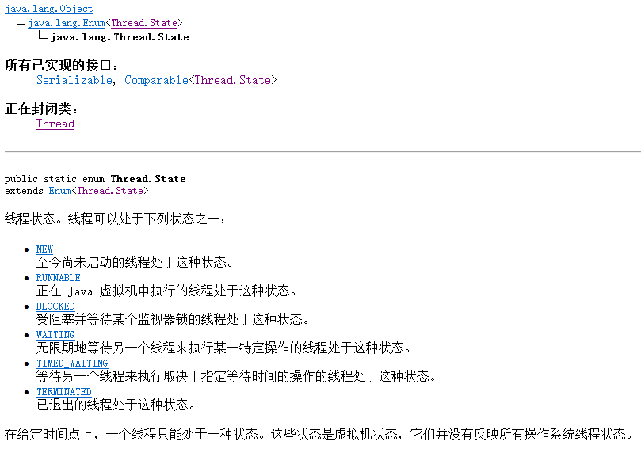
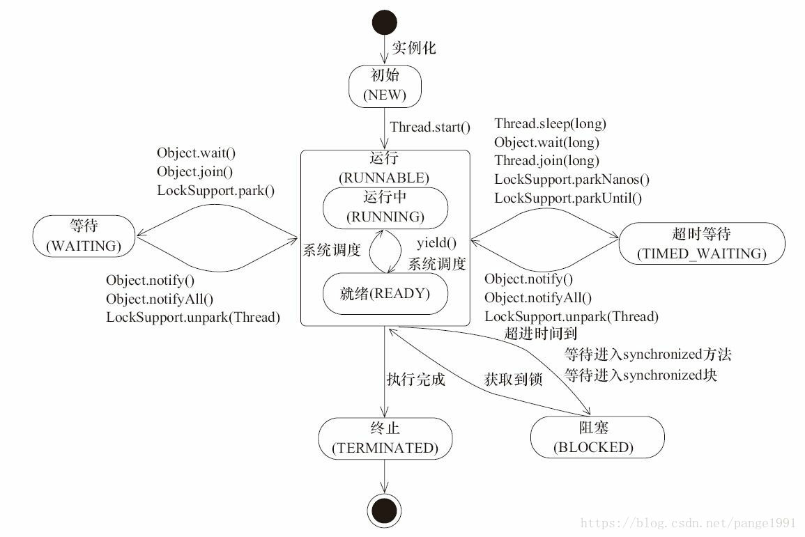
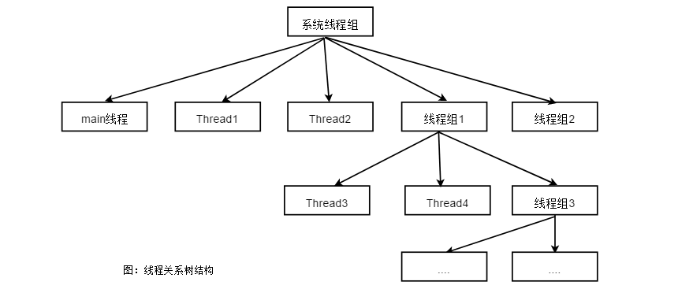

本文应注重掌握如下知识点：

1. 线程组的使用
2. 如何切换线程状态
3. SimpleDataFormat 类与多线程的解决办法
4. 如何处理线程的异常

## 1.线程的状态

线程对象在不同运行时期有不同的状态，状态信息就处于State枚举类中，如图所示：




### 线程状态

1. **初始(NEW)**：新创建了一个线程对象，但还没有调用start()方法。

2. **运行(RUNNABLE)**：Java线程中将就绪（ready）和运行中（running）两种状态笼统的称为“运行”。

   线程对象创建后，其他线程(比如main线程）调用了该对象的start()方法。该状态的线程位于可运行线程池中，等待被线程调度选中，获取CPU的使用权，此时处于就绪状态（ready）。就绪状态的线程在获得CPU时间片后变为运行中状态（running）。

3. **阻塞(BLOCKED)**：表示线程阻塞于锁。

4. **等待(WAITING)**：进入该状态的线程需要等待其他线程做出一些特定动作（通知或中断）。

5. **超时等待(TIMED_WAITING)**：该状态不同于WAITING，它可以在指定的时间后自行返回。

6. **终止(TERMINATED)**：表示该线程已经执行完毕。

调用与线程有关的方法是造成线程状态改变的主要原因，其关系如图所示：（图片来源于网络）




## 2.线程组

可以把线程归属到某一个线程组中，线程组中可以有线程对象，也可以有线程组，组中还可以有线程。




下面看下线程组的使用示例：

```java
public class Group implements Runnable {

    public static void main(String[] args) {
        Group runnable = new Group();
        ThreadGroup threadGroup = new ThreadGroup("我的线程组");
        Thread threadA = new Thread(threadGroup,runnable);
        Thread threadB = new Thread(threadGroup,runnable);
        threadA.start();
        threadB.start();
        System.out.println("活动的线程"+threadGroup.activeCount());
        System.out.println("线程组的名称"+threadGroup.getName());
    }

    @Override
    public void run() {
        while (true){
            System.out.println("Thread-Name: "+Thread.currentThread().getName());
            try {
                Thread.sleep(3000);
            } catch (InterruptedException e) {
                e.printStackTrace();
            }
        }
    }
}
```

运行结果：

```java
活动的线程2
线程组的名称我的线程组
Thread-Name: Thread-0
Thread-Name: Thread-1
```

控制台中的信息表明有2个线程在名为“我的线程组”下活动。

上面的线程树结构图中显示，所有的线程与线程组都在系统线程组下，下面演示如何创建具有多级关联关系的线程结构，并获取相关线程信息。

示例代码：

```java
public class Group implements Runnable {

    public static void main(String[] args) {
        ThreadGroup threadGroupMain = Thread.currentThread().getThreadGroup();
        Group runnable = new Group();
        ThreadGroup threadGroup = new ThreadGroup(threadGroupMain,"我的线程组");
        Thread threadA = new Thread(threadGroup,runnable);
        Thread threadB = new Thread(threadGroup,runnable);
        threadA.start();
        threadB.start();
        System.out.println("系统线程组的名字："+Thread.currentThread().getThreadGroup().getName());
        System.out.println("系统线程组中有多少子线程："+Thread.currentThread().getThreadGroup().activeCount());
        Thread[] threads1 = new Thread[threadGroupMain.activeCount()];
        threadGroupMain.enumerate(threads1);
        System.out.println("这些子线程具体是：");
        for (int i = 0; i < threads1.length; i++) {
            System.out.println(threads1[i].getName());
        }
        System.out.println("系统线程组中有多少子线程组："+Thread.currentThread().getThreadGroup().activeGroupCount());
        ThreadGroup[] listGroup = new ThreadGroup[Thread.currentThread().getThreadGroup().activeGroupCount()];
        //enumerate方法将子线程组以复制的形式拷贝到数组中，并返回拷贝的数量
        Thread.currentThread().getThreadGroup().enumerate(listGroup);
        System.out.println("子线程组的名字是："+listGroup[0].getName());
        Thread[] threads = new Thread[listGroup[0].activeCount()];
        listGroup[0].enumerate(threads);
        System.out.println("子线程组中的线程有：");
        for (int i = 0; i < threads.length; i++) {
            System.out.println(threads[i].getName());
        }
    }

    @Override
    public void run() {
        while (true){
            try {
                Thread.sleep(5000);
            } catch (InterruptedException e) {
                e.printStackTrace();
            }
        }
    }
}
```

运行结果：

```java
系统线程组的名字：main
系统线程组中有多少子线程：4
这些子线程具体是：
main
Monitor Ctrl-Break
Thread-0
Thread-1
系统线程组中有多少子线程组：1
子线程组的名字是：我的线程组
子线程组中的线程有：
Thread-0
Thread-1
```

需要说明的是，在实例化一个ThreadGroup线程组x时如果不指定所属的线程组，则x线程组自动归属到当前线程对象所属的线程组中，也就是隐式的当前线程组中添加了一个子线程组。


### 线程组批量操作

通过将线程归属到线程组中，当调用线程组ThreadGroup的interrupt()方法时，可以将该组中的所有正在运行的线程批量停止。

## 3.SimpleDataFormat非线程安全

SimpleDataFormat主要负责日期的转换与格式化，但在多线程的环境中，使用此类容易造成数据及处理的不准确，因为SimpleDataFormat并不是安全的。

解决方法有两种，一是每个线程都new一个新的SimpleDataFormat实例对象；二是利用ThreadLocal类将SimpleDataFormat对象绑定到线程上。

## 4.线程中出现异常的处理

在 Java 的多线程技术中，可以对多线程中的异常进行“捕捉”，使用的是 UncaughtExceptionHandler类，从而可以对发生的异常进行有效的处理。

```java
thread.setUncaughtExceptionHandler(new UncaughtExceptionHandler() {
     @Override
     public void uncaughtException(Thread t, Throwable e) {
          System.out.println("线程"+t.getName()+"出现了异常");
          e.printStackTrace();
     }
});
```

方法setUncaughtExceptionHandler()是给指定的线程对象设置的异常处理器。在Thread类中还可以使用setDefaultUncaughtExceptionHandler()方法对所有线程对象设置异常处理器。示例代码如下：

```java
MyThread.setDefaultUncaughtExceptionHandler(new UncaughtExceptionHandler() {
       @Override
       public void uncaughtException(Thread t, Throwable e) {
           System.out.println("线程"+t.getName()+"出现了异常");
           e.printStackTrace();
       }
});
```

方法setDefaultUncaughtExceptionHandler()的作用是为指定的线程类的所有线程对象设置默认的异常处理器。

## 5.线程组中出现异常的处理

使用重写uncaughtException方法处理组内线程的异常时，每个线程内部不要有异常catch语句，如果有catch语句，则public void uncaughtException(Thread t, Throwable e) 方法不执行。

```java
ThreadGroup group = new ThreadGroup(""){
      @Override
      public void uncaughtException(Thread t, Throwable e) {
             super.uncaughtException(t, e);
             //一个线程出现异常，中断组内所有线程
             this.interrupt();
      }
};
```

前面介绍了线程对象的异常处理，线程类的异常处理，线程组的异常处理。将它们放一起会出现什么效果呢？

示例代码：

```java
public class MyThread{

    public static void main(String[] args) {
        ThreadGroup threadGroup = new ThreadGroup("ThreadGroup"){
            @Override
            public void uncaughtException(Thread t, Throwable e) {
                System.out.println("线程组的异常处理");
                super.uncaughtException(t, e);
            }
        };
        Thread.setDefaultUncaughtExceptionHandler(new Thread.UncaughtExceptionHandler() {
            @Override
            public void uncaughtException(Thread t, Throwable e) {
                System.out.println("线程类的异常处理");
            }
        });
        Thread thread = new Thread(threadGroup,"Thread"){
            @Override
            public void run() {
                System.out.println(Thread.currentThread().getName()+"执行");
                int i= 2/0;
            }
        };
        thread.setUncaughtExceptionHandler(new Thread.UncaughtExceptionHandler() {
            @Override
            public void uncaughtException(Thread t, Throwable e) {
                System.out.println("线程对象的异常处理");
            }
        });
        thread.start();
    }

}
```

运行结果：

```java
Thread执行
线程对象的异常处理
```

注释掉线程对象的异常处理之后，再次运行：

```java
public class MyThread{

    public static void main(String[] args) {
        ThreadGroup threadGroup = new ThreadGroup("ThreadGroup"){
            @Override
            public void uncaughtException(Thread t, Throwable e) {
                System.out.println("线程组的异常处理");
                super.uncaughtException(t, e);
            }
        };
        Thread.setDefaultUncaughtExceptionHandler(new Thread.UncaughtExceptionHandler() {
            @Override
            public void uncaughtException(Thread t, Throwable e) {
                System.out.println("线程类的异常处理");
            }
        });
        Thread thread = new Thread(threadGroup,"Thread"){
            @Override
            public void run() {
                System.out.println(Thread.currentThread().getName()+"执行");
                int i= 2/0;
            }
        };
//        thread.setUncaughtExceptionHandler(new Thread.UncaughtExceptionHandler() {
//            @Override
//            public void uncaughtException(Thread t, Throwable e) {
//                System.out.println("线程对象的异常处理");
//            }
//        });
        thread.start();
    }

}
```

运行结果：

```java
Thread执行
线程组的异常处理
线程类的异常处理
```

## 6.文末总结

本文弥补了前面几个文章的技术空白点。到此，Java多线程编程核心技术的学习告一段落。

## 参考

*《Java多线程编程核心技术》高洪岩著*

## 扩展

[Java多线程编程核心技术(一)Java多线程技能](/)

[Java多线程编程核心技术(二)对象及变量的并发访问](/)

[Java多线程编程核心技术(三)多线程通信](/)

[Java多线程核心技术(四)Lock的使用](/)

[Java多线程核心技术(五)单例模式与多线程](/)