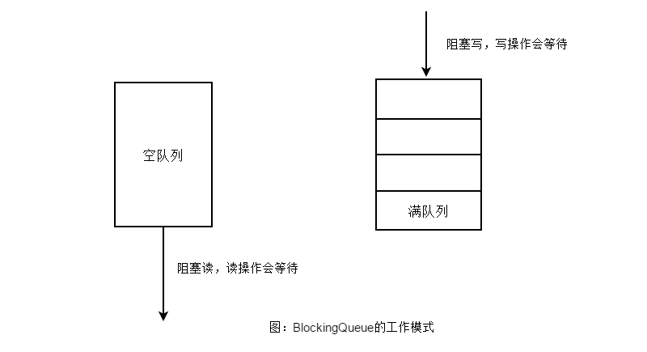

由于并行程序与串行程序的不同特点，适用于串行程序的一些数据结构可能无法直接在并发环境下正常工作，这是因为这些数据结构不是线程安全的。本节将着重介绍一些可以用于多线程环境的数据结构，如并发List、并发Set、并发Map等。

## 1.并发List

Vector 或者 CopyOnWriteArrayList 是两个线程安全的List实现，ArrayList 不是线程安全的。因此，应该尽量避免在多线程环境中使用ArrayList。如果因为某些原因必须使用的，则需要使用`Collections.synchronizedList(List list)`进行包装。

示例代码：

```
        List list = Collections.synchronizedList(new ArrayList());
            ...
        synchronized (list) {
            Iterator i = list.iterator(); // 必须在同步块中
            while (i.hasNext())
                foo(i.next());
        }
```

CopyOnWriteArrayList 的内部实现与Vector又有所不同。顾名思义，Copy-On-Write 就是 CopyOnWriteArrayList 的实现机制。即当对象进行写操作时，复制该对象；若进行的读操作，则直接返回结果，操作过程中不需要进行同步。

CopyOnWriteArrayList 很好地利用了对象的不变性，在没有对对象进行写操作前，由于对象未发生改变，因此不需要加锁。而在试图改变对象时，总是先获取对象的一个副本，然后对副本进行修改，最后将副本写回。

这种实现方式的核心思想是减少锁竞争，从而提高在高并发时的读取性能，但是它却在一定程度上牺牲了写的性能。

在 get() 操作上，Vector 使用了同步关键字，所有的 get() 操作都必须先取得对象锁才能进行。在高并发的情况下，大量的锁竞争会拖累系统性能。反观CopyOnWriteArrayList 的get() 实现，并没有任何的锁操作。

在 add() 操作上，CopyOnWriteArrayList 的写操作性能不如Vector，原因也在于Copy-On-Write。

> 在读多写少的高并发环境中，使用 CopyOnWriteArrayList 可以提高系统的性能，但是，在写多读少的场合，CopyOnWriteArrayList  的性能可能不如 Vector。

### Copy-On-Write源码分析

通过查看CopyOnWriteArrayList类的源码可知，在add操作上，是使用了Lock锁做了同步处理，内部拷贝了原数组，并在新数组上进行添加操作，最后将新数组替换掉旧数组。

```java
    public boolean add(E e) {
        final ReentrantLock lock = this.lock;
        lock.lock();
        try {
            Object[] elements = getArray();
            int len = elements.length;
            Object[] newElements = Arrays.copyOf(elements, len + 1);
            newElements[len] = e;
            setArray(newElements);
            return true;
        } finally {
            lock.unlock();
        }
    }
```

CopyOnWriteArrayList的get(int index)方法是没有任何锁处理的，直接返回数组对象。

```java
    public E get(int index) {
        return get(getArray(), index);
    }

    final Object[] getArray() {
        return array;
    }
```

那么Copy-On-Write的优缺点有哪些呢？

最明显的就是这是CopyOnWriteArrayList属于线程安全的，并发的读是没有异常的，读写操作被分离。缺点就是在写入时不止加锁，还使用了Arrays.copyOf()进行了数组复制，性能开销较大，遇到大对象也会导致内存占用较大。

## 2.并发Set

和List相似，并发Set也有一个 CopyOnWriteArraySet ，它实现了 Set 接口，并且是线程安全的。它的内部实现完全依赖于 CopyOnWriteArrayList ，因此，它的特性和 CopyOnWriteArrayList 完全一致，适用于 读多写少的高并发场合，在需要并发写的场合，则可以使用 `    Set s = Collections.synchronizedSet(Set<T> s)`得到一个线程安全的Set。

示例代码：

        Set s = Collections.synchronizedSet(new HashSet());
            ...
        synchronized (s) {
            Iterator i = s.iterator(); // 必须在同步块中
            while (i.hasNext())
                foo(i.next());
        }


## 3.并发Map

在多线程环境下使用Map，一般也可以使用 `Collections.synchronizedMap()`方法得到一个线程安全的 Map（详见示例代码1）。但是在高并发的情况下，这个Map的性能表现不是最优的。由于 Map 是使用相当频繁的一个数据结构，因此 JDK 中便提供了一个专用于高并发的 Map 实现 ConcurrentHashMap。

Collections的示例代码1：

```
        Map m = Collections.synchronizedMap(new HashMap());
            ...
        Set s = m.keySet();  // 不需要同步块
            ...
        synchronized (m) {  // 同步在m上，而不是s上!!
            Iterator i = s.iterator(); // 必须在同步块中
            while (i.hasNext())
                foo(i.next());
        }
```

1.为什么不能在高并发下使用HashMap？

因为多线程环境下，使用Hashmap进行put操作会引起死循环，导致CPU利用率接近100%，所以在并发情况下不能使用HashMap。

2.为什么不使用线程安全的HashTable？

HashTable容器使用synchronized来保证线程安全，但在线程竞争激烈的情况下HashTable的效率非常低下。因为当一个线程访问HashTable的同步方法时，其他线程访问HashTable的同步方法时，可能会进入阻塞或轮询状态。如线程1使用put进行添加元素，线程2不但不能使用put方法添加元素，并且也不能使用get方法来获取元素，所以竞争越激烈效率越低。

3.ConcurrentHashMap的优势

ConcurrentHashMap的内部实现进行了锁分离（或锁分段），所以它的锁粒度小于同步的 HashMap；同时，ConcurrentHashMap的 get() 操作也是无锁的。除非读到的值是空的才会加锁重读，我们知道HashTable容器的get方法是需要加锁的，那么ConcurrentHashMap的get操作是如何做到不加锁的呢？原因是它的get方法里将要使用的共享变量都定义成volatile。

锁分离：首先将数据分成一段一段的存储，然后给每一段数据配一把锁，当一个线程占用锁访问其中一个段数据的时候，其他段的数据也能被其他线程访问。有些方法需要跨段，比如size()和containsValue()，它们可能需要锁定整个表而而不仅仅是某个段，这需要按顺序锁定所有段，操作完毕后，又按顺序释放所有段的锁。

## 4.并发Queue

在并发队列上，JDK提供了两套实现，一个是以 ConcurrentLinkedQueue 为代表的高性能队列，一个是以 BlockingQueue 接口为代表的阻塞队列。不论哪种实现，都继承自 Queue 接口。

ConcurrentLinkedQueue 是一个适用于高并发场景下的队列。它通过无锁的方式，实现了高并发状态下的高性能。通常，ConcurrentLinkedQueue 的性能要好于 BlockingQueue 。

与 ConcurrentLinkedQueue 的使用场景不同，BlockingQueue 的主要功能并不是在于提升高并发时的队列性能，而在于简化多线程间的数据共享。

BlockingQueue 典型的使用场景是生产者-消费者模式，生产者总是将产品放入 BlockingQueue 队列，而消费者从队列中取出产品消费，从而实现数据共享。

BlockingQueue 提供一种读写阻塞等待的机制，即如果消费者速度较快，则 BlockingQueue 则可能被清空，此时消费线程再试图从 BlockingQueue 读取数据时就会被阻塞。反之，如果生产线程较快，则 BlockingQueue 可能会被装满，此时，生产线程再试图向 BlockingQueue 队列装入数据时，便会被阻塞等待，其工作模式如图所示。




## 5.并发Deque

在JDK1.6中，还提供了一种双端队列（Double-Ended Queue），简称Deque。Deque允许在队列的头部或尾部进行出队和入队操作。与Queue相比，具有更加复杂的功能。

Deque 接口的实现类：LinkedList、ArrayDeque和LinkedBlockingDeque。

它们都实现了双端队列Deque接口。其中LinkedList使用链表实现了双端队列，ArrayDeque使用数组实现双端队列。通常情况下，由于ArrayDeque基于数组实现，拥有高效的随机访问性能，因此ArrayDeque具有更好的遍性能。但是当队列的大小发生变化较大时，ArrayDeque需要重新分配内存，并进行数组复制，在这种环境下，基于链表的 LinkedList 没有内存调整和数组复制的负担，性能表现会比较好。但无论是LinkedList或是ArrayDeque，它们都不是线程安全的。

LinkedBlockingDeque 是一个线程安全的双端队列实现。可以说，它已经是最为复杂的一个队列实现。在内部实现中，LinkedBlockingDeque 使用链表结构。每一个队列节点都维护了一个前驱节点和一个后驱节点。LinkedBlockingDeque 没有进行读写锁的分离，因此同一时间只能有一个线程对其进行操作。因此，在高并发应用中，它的性能表现要远远低于 LinkedBlockingQueue，更要低于 ConcurrentLinkedQueue 。


## 参考

*《Java程序性能优化》葛一鸣著*
