# 1.Java虚拟机内存区域

JVM虚拟机将内存数据分为程序计数器、虚拟机栈、本地方法栈、Java堆和方法区等部分。

程序计数器用于存放下一条运行的指令；虚拟机栈和本地方法栈用于存放函数调用堆栈信息；Java堆用于存放Java程序运行时所需的对象等数据；方法区用于存放程序的类元数据信息。

## 1.1 程序计数器

每一个线程都必须有一个独立的程序计数器，用于记录下一条要运行的指令。各个线程之间的计数器互不影响，独立工作；是一块线程私有的内存空间。

如果当前程序正在执行一个Java方法，则程序计数器记录正在执行的Java字节码地址，如果当前线程正在执行一个Native方法，则程序计数器为空。

## 1.2 Java虚拟机栈

Java虚拟机栈也是线程的私有空间，它和Java线程在同一时间创建，它保存方法的局部变量、部分结果，并参与方法的调用和返回。

在Java虚拟机规范中，定义了两种异常与栈空间有关：StackOverflowError 和 OutOfMemoryError。

在 HotSpot 虚拟机中，可以使用 `-Xss` 参数（如：-Xss1M）来设置栈的大小。栈的大小直接决定了函数调用的可达深度。

虚拟机栈在运行时使用一种叫做栈帧的数据结构保存上下文数据。在栈帧中，存放了方法的局部变量表、操作数栈、动态连接方法和返回地址等信息。每一个方法的调用都伴随着栈帧的入栈操作。相应的，方法的返回则表示栈帧的出栈操作。

如果方法调用时，方法的参数和局部变量相对较多，那么栈帧中的局部变量表就会比较大，栈帧会膨胀以满足方法调用所需传递的信息。因此，单个方法调用所需的栈空间大小也会比较多。

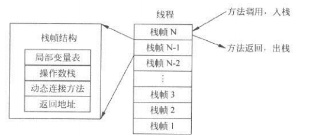


### 局部变量

如果一个局部变量被保存在局部变量表中，那么GC根就能引用到这个局部变量所指向的内存空间，从而在GC时，无法回收这部分空间。这里有一个非常简单的示例来说明局部变量对GC的影响。

```java
public void test(){
    {
        byte[] b = new byte[1024 * 1024 * 60]; // 1024*60 KB = 60 MB
    }
    System.gc();
    System.out.println("gc over");
}
```

在运行Java程序时设置参数`-XX:+PrintGC`打印GC日志，运行结果：

```java
[GC (System.gc())  64775K->62176K(125952K), 0.0011984 secs]
[Full GC (System.gc())  62176K->62097K(125952K), 0.0063403 secs]
gc over
```

很明显，显示的Full GC并没有能释放它所占用的堆空间。这是因为，变量b仍在该栈帧的局部变量表中。因此GC可以引用到该内存块，阻碍了回收过程。

假设在该变量失效后，在这个函数体内，又未能有定义足够多的局部变量来复用该变量所占的字，那么，在整个函数体中，这块内存区域是不会被回收的。在这种环境下，手工对要释放的变量赋值为null，是一种有效的做法。

```java
public void test(){
    {
        byte[] b = new byte[1024 * 1024 * 5]; // 5MB
        b = null;
    }
    System.gc();
    System.out.println("gc over");
}
```

运行结果：

```java
[GC (Allocation Failure)  1513K->616K(7680K), 0.0011590 secs]
[GC (System.gc())  6191K->5880K(7680K), 0.0011550 secs]
[Full GC (System.gc())  5880K->651K(7680K), 0.0095708 secs]
gc over
```

在实际开发中，遇到上述情况的可能性并不大。因为在大多数情况下，如果后续仍然需要进行大量的操作，那么极有可能会申明新的局部变量，从而复用变量b的字，使b占的内存空间可以被GC回收。

```java
public void test(){
    {
        byte[] b = new byte[1024 * 1024 * 5];
    }
    int a = 0;
    System.gc();
    System.out.println("gc over");
}
```

运行结果：

```java
[GC (Allocation Failure)  1530K->656K(7680K), 0.0011337 secs]
[GC (System.gc())  6189K->5824K(7680K), 0.0010571 secs]
[Full GC (System.gc())  5824K->651K(7680K), 0.0077965 secs]
gc over
```

很明显，变量b由于变量a的作用被回收了。

完整代码如下：

```java
package com.oscar999.performance.JVMTune;
 
public class SystemGC {
	/**
	 * GC 无法回收b, 因为b 还在局部变量中
	 */
	public static void test1() {
		{
			byte[] b = new byte[6 * 1024 * 1024];
		}
		System.gc();
		System.out.println("first explict gc over");
	}
	/**
	 * GC 无法回收, 因为 赋值为null将销毁局部变量表中的数据
	 */
	public static void test2() {
		{
			byte[] b = new byte[6 * 1024 * 1024];
			b=null;
		}
		System.gc();
		System.out.println("first explict gc over");
	}
	/**
	 * GC 可以回收, 因为变量a 复用了变量b 的字，GC根无法找到b
	 */
	public static void test3() {
		{
			byte[] b = new byte[6 * 1024 * 1024];
			
		}
		int a=0;
		System.gc();
		System.out.println("first explict gc over");
	}
	/**
	 * GC 无法回收, 因为变量a 复用了变量c 的字，b 仍然存在
	 */
	public static void test4() {
		{
			int c = 0;
			byte[] b = new byte[6 * 1024 * 1024];			
		}
		int a=0;
		System.gc();
		System.out.println("first explict gc over");
	}
	/**
	 * GC 可以回收, 因为变量a 复用了变量c 的字，变量d 复用了变量b 的字
	 */
	public static void test5() {
		{
			int c = 0;
			byte[] b = new byte[6 * 1024 * 1024];			
		}
		int a=0;
		int d=0;
		System.gc();
		System.out.println("first explict gc over");
	}
	
	/**
	 * 
	 * 总是可以回收b , 因为上层函数的栈帧已经销毁
	 */
	public static void main(String args[]){
		test1();
		System.gc();
		System.out.println("second explict gc over");
	}
}
```

## 1.3 本地方法栈

本地方法栈和Java虚拟机栈的功能很相似，也属于线程的私有空间。Java虚拟机栈用于管理Java函数的调用，而本地方法栈用于管理本地方法的调用。本地方法并不是用Java实现的，而是使用C实现的。在SUN的Hot Spot虚拟机中，不区分本地方法栈和虚拟机栈。因此，和虚拟机栈一样，他也会抛出 StackOverflowError 和 OutOfMemoryError。

## 1.4 Java堆

Java堆可以说是Java运行时内存中最为重要的部分，几乎所有的对象和数组都是在堆中分配空间的。Java堆分为新生代和老年代两个部分，新生代用于存放刚刚产生的对象和年轻的对象，如果对象一直没有被回收，生存得足够长，老年对象就会被移入老年代。

新生代又可进一步细分为 eden、survivor space0（s0 或者 from space）和 survivor space1（s1或者to space）。

eden：对象的出生地，大部分对象刚刚建立时，通常会存放在这里。s0 和 s1 为 survivor（幸存者）空间，存放其中的对象至少经历过一次垃圾回收，并得以幸存。如果在幸存区的对象到了指定年龄仍未被回收，则有机会进入老年代（tenured）。

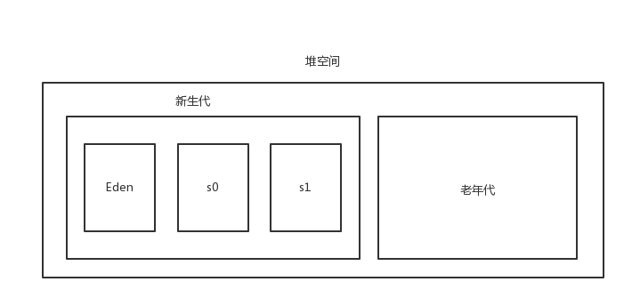


使用JVM参数`-XX:+PrintGCDetails -XX:SurvivorRatio=8 -XX:MaxTenuringThreshold=15 -Xms40M -Xmx40M -Xmn20M`运行这段代码：


```java
public void test2(){
    byte[] byte1 = new byte[1024*1024/2];
    byte[] byte2 = new byte[1024*1024*8];
    byte2 = null;
    byte2 = new byte[1024*1024*8];
    System.gc();    //注释此行
}
```
运行结果：
```java
[GC (System.gc()) [PSYoungGen: 11004K->1256K(18432K)] 19196K->9456K(38912K), 0.0013429 secs][Times: user=0.00 sys=0.00, real=0.00 secs] 
[Full GC (System.gc()) [PSYoungGen: 1256K->0K(18432K)] [ParOldGen: 8200K->9361K(20480K)] 9456K->9361K(38912K), [Metaspace: 3478K->3478K(1056768K)], 0.0072324 secs][Times: user=0.00 sys=0.00, real=0.01 secs] 
Heap
 PSYoungGen      total 18432K, used 164K [0x00000000fec00000, 0x0000000100000000, 0x0000000100000000)
  eden space 16384K, 1% used [0x00000000fec00000,0x00000000fec290d0,0x00000000ffc00000)
  from space 2048K, 0% used [0x00000000ffc00000,0x00000000ffc00000,0x00000000ffe00000)
  to   space 2048K, 0% used [0x00000000ffe00000,0x00000000ffe00000,0x0000000100000000)
 ParOldGen       total 20480K, used 9361K [0x00000000fd800000, 0x00000000fec00000, 0x00000000fec00000)
  object space 20480K, 45% used [0x00000000fd800000,0x00000000fe124740,0x00000000fec00000)
 Metaspace       used 3485K, capacity 4498K, committed 4864K, reserved 1056768K
  class space    used 387K, capacity 390K, committed 512K, reserved 1048576K
```

可以看到，在经过Full GC之后，新生代空间全部被清空，未被回收的对象全部被移入老年代。

## 1.5 方法区（永久区、元空间）

方法区也是 JVM 内存区中非常重要的一块内存区域，与堆空间类似，它也是被 JVM 中所有的线程共享的。方法区主要保存的信息是类的元数据。

方法区中最为重要的是类的类型信息、常量池、域信息、方法信息。类型信息包括类的完整名称、父类的完整名称、类型修饰符（public/protected/private）和类型的直接接口类表；常量池包括这个类方法、域等信息所引用的常量信息；域信息包括域名称、域类型和域修饰符；方法信息包括方法名称名称、返回类型、方法参数、方法修饰符、方法字节码、操作数栈和方法帧栈的局部变量区大小以及异常表。总之，方法区保存的信息，大部分来自于 class 文件，是 Java 应用程序运行必不可少的重要数据。

在JDK8之前的Host Spot虚拟机的实现中，方法区也被称为永久区，是一块独立于 Java 堆的内存空间。虽然叫永久区，但是永久区中的对象同样可以被 GC 回收的。对永久区 GC 的回收，通常主要从两个方面分析：一是 GC 对永久区常量池的回收；二是永久区对类元数据的回收。永久区的垃圾回收是和老年代(old generation)捆绑在一起的，因此无论谁满了，都会触发永久代和老年代的垃圾收集。

方法区是 JVM 的一种规范，永久区是一种具体实现，在 Java8 中，永久区已经被 Metaspace 元空间取而代之。原永久区的数据被分到了堆和元空间中：元空间存储类的元信息，静态变量和常量池等放入堆中。相应的，JVM参数 PermSize 和 MaxPermSize 被 MetaSpaceSize 和 MaxMetaSpaceSize 取代。

至于为什么要使用元空间替换永久区，无非是永久区带来了一些问题，元空间解决了一些问题。比如永久区的大小是在启动时固定好的——很难验证并进行调优，因为永久区的大小依赖于很多因素，例如JVM加载的class的总数，常量池的大小，方法的大小等，所以容易导致内存泄露或内存溢出（java.lang.OutOfMemoryError: PermGen）。

元空间的本质和永久区类似，都是对JVM规范中方法区的实现。不过元空间与永久代之间最大的区别在于：元空间并不在虚拟机中，而是使用本地内存。理论上取决于32位/64位系统可虚拟的内存大小。不过，可以通过设置参数 MaxMetaspaceSize 限制本地内存分配给类元数据的大小。如果没有指定这个参数，元空间会在运行时根据需要动态调整。

元空间认为，类和它的元数据的生命周期是和它的类加载器的生命周期一致的。每一个类加载器的存储区域都称作一个元空间，所有的元空间合在一起就是我们一直说的元空间。当一个类加载器被垃圾回收器标记为不再存活，其对应的元空间会被回收。

使用JVM参数`-XX:+PrintGCDetails -XX:MetaspaceSize=4M -XX:MaxMetaspaceSize=5M`运行这段代码：

```java
@Test
public void test4() {
    for (int i=0; i<Integer.MAX_VALUE;i++){
        String s = String.valueOf(i).intern();  //加入常量池并返回
    }
}
```

运行结果：

```java
[GC (Metadata GC Threshold) [PSYoungGen: 1331K->696K(38400K)] 1331K->696K(125952K), 0.0011365 secs] [Times: user=0.00 sys=0.00, real=0.00 secs]
[Full GC (Metadata GC Threshold) [PSYoungGen: 696K->0K(38400K)] [ParOldGen: 0K->550K(62976K)] 696K->550K(101376K), [Metaspace: 2875K->2875K(1056768K)], 0.0062965 secs] [Times: user=0.02 sys=0.00, real=0.01 secs] 
[GC (Metadata GC Threshold) [PSYoungGen: 4672K->640K(38400K)] 5222K->1198K(101376K), 0.0016105 secs] [Times: user=0.00 sys=0.00, real=0.00 secs] 
[Full GC (Metadata GC Threshold) [PSYoungGen: 640K->0K(38400K)] [ParOldGen: 558K->1131K(118272K)] 1198K->1131K(156672K), [Metaspace: 4647K->4647K(1056768K)], 0.0139785 secs] [Times: user=0.02 sys=0.00, real=0.02 secs] 
Exception in thread "main" java.lang.OutOfMemoryError: Metaspace
....
```

可以看到，持久代已经饱和，并抛出 “java.lang.OutOfMemoryError: Metaspace” 异常显示持久代溢出。

Full GC 在这种情况下不能回收类的元数据。

事实上，如果虚拟机确认该类的所有实例已经被回收，并且加载该类的 ClassLoader 已经被回收，GC 就有可能回收该类型。

## 附图

（*图片来源于网络*）


# 2.JVM内存分配参数

## 2.1 设置最大堆内存

| 设置       | 参数 | 示例   |
| ---------- | ---- | ------ |
| 最大堆内存 | -Xmx | -Xmx3m |

在运行时，可以使用 `Runtime.getRuntime().maxMemory()` 取得系统可用的最大堆内存。

比如在运行时设置参数 `-Xmx3M`：

```java
@Test
public void test5(){
    System.out.println(Runtime.getRuntime().maxMemory()/1024/1024);
}
```

运行结果：

```java
3
```

## 2.2 设置最小堆内存

| 设置       | 参数 | 示例   |
| ---------- | ---- | ------ |
| 最小堆内存 | -Xms | -Xms1m |

最小堆内存，也就是JVM启动时，所占据的操作系统内存大小。

Java应用程序在运行时，首先被分配-Xms指定的内存大小，并尽可能尝试在这个空间段内运行程序。当-Xms指定的内存大小确实无法满足应用程序时，JVM 才会向操作系统申请更多的内存，直到内存大小达到-Xmx指定的最大内存为止。若超过-Xmx的值，则抛出 OutOfMemoryError 异常。

如果 -Xms 的数值较小，那么JVM为了保证系统尽可能地在指定内存范围内运行，就会更加频繁地进行GC操作，以释放失效的内存空间，从而，会增加 Minor GC 和 Full GC的次数，对系统性能产生一定的影响。因此把 -Xms 值设置为 -Xmx 时，可以在系统运行初期减少 GC 的次数和耗时。

## 2.3 设置新生代

| 设置   | 参数 | 示例   |
| ------ | ---- | ------ |
| 新生代 | -Xmn | -Xmn2m |

设置一个较大的新生代会减少老年代的大小，这个参数对系统性能以及 GC 行为有很大的影响。新生代的大小一般设置为整个堆空间的1/4到1/3左右。

在 Hot Spot 虚拟机中，`-XX:NewSize` 用于设置新生代的初始大小，`-XX:MaxNewSize`用于设置新生代的最大值。但通常情况下，只设置 -Xmn 以及可以满足绝大部分应用的需要。设置 -Xmn 的效果等同于设置了相同的`-XX:NewSize` 和 `-XX:MaxNewSize`。

若设置不同的`-XX:NewSize` 和 `-XX:MaxNewSize`可能会导致内存震荡，从而产生不必要的系统开销。

## 2.4 设置持久代

持久代（方法区）不属于Java堆的一部分。在Hot Spot虚拟机中，使用-XX:MaxPermSize可以设置持久代的最大值，使用-XX:PermSize可以设置持久代的初始大小。

JDK1.8取消了PermGen，取而代之的是Metaspace（元空间），所以PermSize和MaxPermSize参数失效，取而代之的是 `-XX:MetaspaceSize` 和 `-XX:MaxMetaspaceSize`。

| 设置             | 参数                 | 示例                      |
| ---------------- | -------------------- | ------------------------- |
| 持久代的初始大小 | -XX:MetaspaceSize    | -XX:MetaspaceSize=64M     |
| 持久代的最大值   | -XX:MaxMetaspaceSize | -XX:MaxMetaspaceSize=128M |

持久代的大小直接决定了系统可以支持多少个类定义和多少常量。对于使用 CGLIB 或者 Javassist 等动态字节码生成工具的应用程序而言，设置合理的持久代大小有助于维持系统稳定。

一般来说，设置MaxMetaspaceSize为64MB已经可以满足绝大部分应用程序正常工作。如果依然出现永久区溢出，可以将MaxMetaspaceSize设置为128MB。这是两个很常用的永久区取值。

## 2.5 设置线程栈

线程栈是线程的一块私有空间。有关描述可以参考前文的“Java虚拟机栈”。

| 设置   | 参数 | 示例   |
| ------ | ---- | ------ |
| 线程栈 | -Xss | -Xss1M |

在线程中进行局部变量分配，函数调用时，都需要在栈中开辟空间。如果栈的空间分配太小，那么线程在运行时，可能没有足够的空间分配局部变量或者达不到足够的函数调用深度，导致程序异常退出；如果栈空间过大，那么开设线程所需的内存成本就会上升，系统所能支持的线程总数就会下降。

由于Java堆也是向操作系统申请内存空间的，因此，如果堆空间过大，就会导致操作系统可用于线程栈的内存减少，从而间接减少程序所能支持的线程数量。

当系统由于内存不够无法创建新的线程时，会抛出 OOM 异常如下：

```java
java.lang.OutOfMemoryError: unable to create new native thread
```

根据以上内容可知，这并不是由于堆内存不够而导致的 OOM，而是因为操作系统内存减去堆内存后，剩余的系统内存不足而无法创建新的线程。在这种情况下，可以尝试减少堆内存，以换取更多的系统空间，来解决这个问题。

如果系统确实需要大量的线程并发执行，那么设置一个较小的堆和较小的栈，有助于提供系统所能承受的最大线程数。

## 2.6 堆的内存分配

| 设置              | 参数              | 示例                |
| ----------------- | ----------------- | ------------------- |
| eden区/survivor区 | -XX:SurvivorRatio | -XX:SurvivorRatio=8 |
| 老年代/新生代     | -XX:NewRatio      | -XX:NewRatio=2      |

参数 `-XX:SurvivorRatio` 是用来设置新生代中，eden空间和s0空间的比例关系。s0 和 s1 空间又被称为 from 空间和 to 空间。它们的大小是相同的，职能也是一样的，并在 Minor GC后，会互换角色。

公式：-XX:SurvivorRatio = eden/s0 = eden/s1

举例：当设置JVM参数 `-Xmn10M -XX:SurvivorRatio=8` 就等于设置 eden=8M，s0=1M，s1=1M。

参数 `  -XX:NewRatio` 是用来设置新生代与老年代的比例：

公式：-XX:NewRatio = 老年代 / 新生代

举例：当设置JVM参数 `-Xms18M -Xmx18M -XX:NewRatio=2`运行程序时，新生代约占6MB，老年代约占12MB。

## 2.7 堆分配参数总结

| 参数                    | 说明                                                         |
| ----------------------- | ------------------------------------------------------------ |
| -Xmx                    | 设置Java应用程序能获得的最大堆大小。                         |
| -Xms                    | 设置Java应用程序启动时的初始堆大小。                         |
| -Xss                    | 设置线程栈的大小。                                           |
| -Xmn                    | 设置新生代的初始大小与最大值。                               |
| -XX:NewSize             | 设置新生代的大小。                                           |
| -XX:NewRatio            | 设置老年代与新生代的比例，它等于老年代大小除以新生代大小。   |
| -XX:SurvivorRatio       | 设置新生代中eden区和survivor区的比例。                       |
| -XX:MetaspaceSize       | （Java8）设置永久区的初始值。。                              |
| -XX:MaxMetaspaceSize    | （Java8）最大的持久区大小。                                  |
| -XX:MinHeapFreeRatio    | 设置堆空间的最大空闲比例。<br />当堆空间的空闲内存小于这个数值时，JVM便会扩展堆空间 |
| -XX:MaxHeapFreeRatio    | 设置堆空间的最大空闲比例。<br />当堆空间的空闲内存大于这个数值时，便会压缩堆空间，得到一个较小的堆。 |
| -XX:TargetSurvivorRatio | 设置survivor区的可使用率。<br />当survivor区的空间使用率达到这个值时，会将对象送入老年代。 |

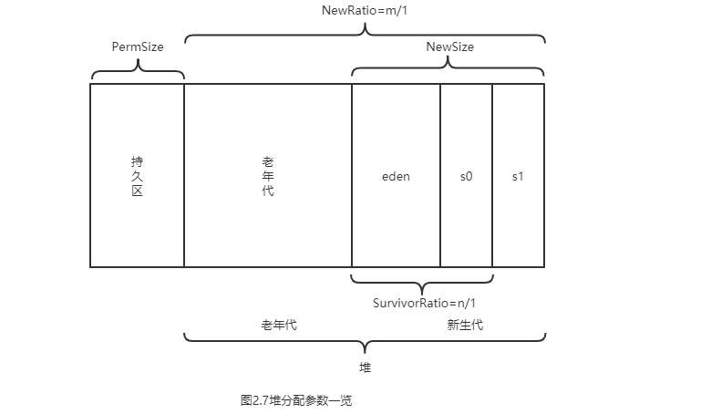


# 3.垃圾收集基础

Java语言的一大特点就是可以进行自动垃圾回收处理，而无需开发人员过于关注系统资源（尤其是内存资源）的释放情况。自动垃圾收集虽然大大减轻了开发人员的工作量，但同时，它也增加了软件系统的负担。一个不合适的垃圾回收方法和策略会对系统性能造成不良影响。

## 3.1 垃圾收集的作用

在C++语言中，程序员必须小心谨慎地处理每一项内存分配，且内存使用完后，必须手工释放曾经占用的内存空间，当内存释放不够完全时，即存在分配但永不释放的内存块，就会引起内存泄漏，严重时，会导致程序瘫痪。

虽然，目前有许多自动化检测工具可以识别这些内存泄漏的代码点，但是这种纯手工的管理内存的方法，依然被不少人所诟病。为了解决这个问题，Java语言使用了垃圾收集器用来替代C++时代的纯手工的内存管理，以减轻程序员的负担，减少出错的概率。

垃圾收集器要处理的基本问题是：

1. 哪些对象需要回收？
2. 何时回收这些对象？
3. 如何回收这些对象？

## 3.2 垃圾回收算法与思想

### 3.2.1 引用计数法（Reference Counting）

引用计数法的实现很简单，对于一个对象A，只要有任何一个对象引用了A，则A的引用计数器就加1，当引用失效时，引用计数器就减一。只要对象A的引用计数器的值为0，则对象A就不能再被使用。

引用计数器的缺点是无法处理循环引用的情况。因此，在Java的垃圾回收器中，没有使用这种算法。

一个简单的循环引用问题描述如下：有对象A和对象B，对象A中含有对象B的引用，对象B中含有对象A的引用。此时，对象A和B的引用计数器都不为0。但是，在系统中，却不存在任何第3个对象引用了A或B。也就是说，A和B是应该被回收的垃圾对象，但由于垃圾对象间的相互引用，从而使垃圾回收器无法识别，引起内存泄漏。

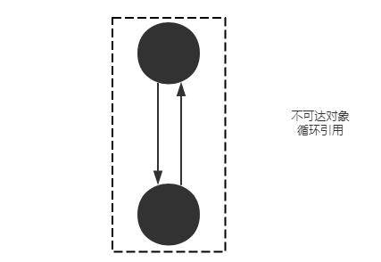


### 3.2.2 标记-清除算法（Mark-Sweep）

标记-清除算法是现代垃圾回收算法的思想基础。

标记-清除算法将垃圾回收分为两个阶段：标记阶段和清除阶段。一种可行的实现是，在标记阶段，首先通过根节点，标记所有从根节点开始的可达对象。因此，未被标记的对象就是未被引用的垃圾对象。然后，在清除阶段，清除所有未被标记的对象。标记-清除算法可能产生的最大问题就是空间碎片。

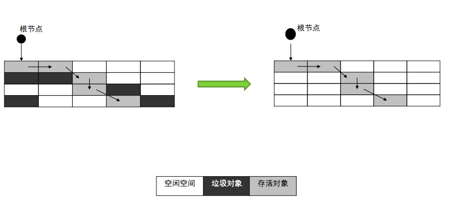


由图可以看到，回收后的空间是不连续的。不连续的内存空间的工作效率要低于连续的空间。因此，这也是该算法的最大缺点。

### 3.2.3 复制算法（Copying）

与标记-清除算法相比，复制算法是一种相对高效的回收方法。它的核心思想是：将原有的内存空间分为两块，每次只使用其中一块，在垃圾回收时，将正在使用的内存中的存活对象复制到未使用的内存块中，之后，清除正在使用的内存块中的所有对象，交换两个内存中的角色，完成垃圾回收。

如果系统中的垃圾对象很多，复制算法需要复制的存活对象数量并不会太大。因此，在真正需要垃圾回收的时刻，复制算法的效率是很高的。又由于对象是在垃圾回收过程中统一复制到新的内存空间中，因此，可确保回收后的内存空间是没有碎片的。但是，复制算法的缺点是将系统内存折半，因此，单纯的复制算法也很难让人接受。如图：

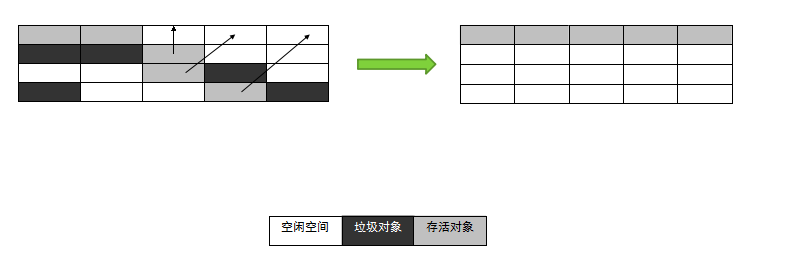

在Java的新生代串行垃圾回收器中，使用了复制算法的思想。新生代分为 eden 空间、form 空间和 to空间3个部分。其中 from 和 to 空间可以视为用于复制的两块大小相同、地位相等，且可进行角色互换的空间块。from 和 to 空间也称为 survivor 空间，即幸存者空间，用于存放未被回收的对象。

在垃圾回收时，eden空间中存活的对象会被复制到未使用的survivor空间中（假设是 to），正在使用的survivor空间（假设是 from）中的年轻对象也会被复制到to空间中（大对象或者老年对象会直接进入老年代，如果to空间已满，则对象也会进入老年代）。此时eden和from空间中剩余对象就是垃圾对象，直接清空，to空间则存放此次回收后存活下来的对象。

这种复制算法保证了内存空间的连续性，又避免了大量的空间浪费。

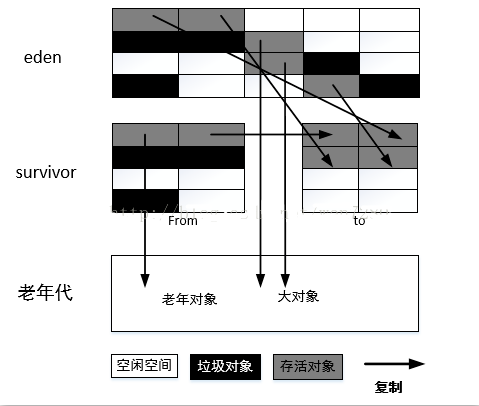

> 复制算法比较适用于新生代。因为在新生代中，垃圾对象通常会多于存活对象，复制算法的效果会比较好。 

### 3.2.4 标记-压缩算法（Mark-Compact）

复制算法的高效性是建立在存活对象少、垃圾对象多的前提下的。这种情况在年轻代经常发生，但是在老年代中，大部分对象都是存活的对象，如果还是有复制算法的话，成本会比较高。因此，基于老年代这种特性，应该使用其他的回收算法。 

标记压缩算法是一种老年代的回收算法，它在标记清除算法的基础上做了优化。（标记清除算法的缺点，垃圾回收后内存空间不再连续，影响了内存空间的使用效率）和标记清除算法一样，标记压缩算法也首先从根节点开始，对所有可达的对象做一次标记，但之后，它并不是简单的清理未标记的对象，而是将所有的存活对象压缩到内存空间的一端。之后，清理边界外所有的空间。这样做避免的碎片的产生，又不需要两块相同的内存空间，因此，其性价比高。

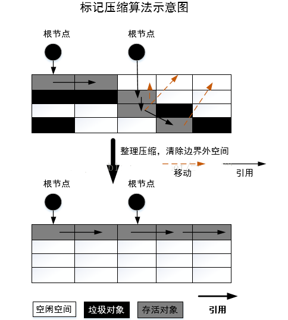


### 3.2.5 增量算法（Incremental Collecting）

对大部分垃圾回收算法而言,在垃圾回收的过程中，应用系统软件处于一种“Stop the World”的状态。在“Stop the World”状态下应用程序的所有线程都会挂起，暂停一切正常的工作，等待垃圾回收的完成。如果垃圾回收时间很长，应用系统会被挂起很久，将严重影响用户体验或者系统的稳定性。

增量算法的基本思想是，如果一次性将所有垃圾进行处理,需要造成系统长时间的停顿，那么可以让垃圾收集和应用程序交替止执行。每次，垃圾收集线程只收集一小片区域的内存空间，接着切换到应用程序执行。如此反复，直到垃圾收集完成。使用这种方式，由于在垃圾回收过程中，间断性的还执行了应用程序代码，所以能减少系统的停顿时间。因为线程切换和上下文转换的消耗，会使得垃圾回收的整体成本升高，造成系统吞吐量的下降。

### 3.2.6 分代（Generation Collection）

前面介绍的复制、标记-清除、标记-压缩等算法,并没有一种算法可以完全替换其他算法。它们都有各自的优缺点。因此根据垃圾回收对象的特点不同，使用不同的回收算法才是明智之举。 

分代就是基于这种思想，它将内存区域根据对象的特点分成不同的内存区域，根据每块区域对象的特征不同使用不同的回收算法，以提高垃圾回收的效率。 

以Hot Spot虚拟机为例，它将所有的新建对象都放入称为年轻代的内存区域，年轻代的特点是对象朝生夕灭，大约 90% 的新建对象会被很快回收，因此，在年轻代就选择效率较高的复制算法。当一个对象经过几次垃圾回收后依然存活，对象就会放入老年代的内存空间，在老年代中，几乎所有的对象都是经过几次垃圾回收后依然得以存活的，因此，认为这些对象在一段时间内，甚至在程序的整个生命周期将是常驻内存的。

老年代的存活率是很高的，如果依然使用复制算法回收老年代，将需要复制大量的对象。这种做法是不可取的，根据分代的思想，对老年代的回收使用与新生代不同的标记-压缩算法可以提高垃圾回收效率。如图：

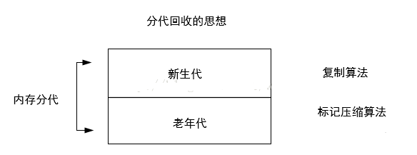

> 注意：分代的思想被现有的Hot Spot虚拟机广泛使用，几乎所有的垃圾回收器都区分新生代和老年代。 

## 3.3 垃圾收集器的类型

-  按线程数分：

  串行：串行垃圾回收器一次只使用一个线程继续垃圾回收。

  并行：并行垃圾回收器一次开启多个线程同时进行垃圾回收。在cup能力较强时使用并行可以提高垃圾收集效率，缩短GC停顿时间。

-  按工作模式分：

  并发式：并发式垃圾回收器与应用系统交替工作，以尽可能减少应用系统的停顿时间。

  独占式：独占式垃圾回收器（Stop the World）一旦运行就停止应用程序运行，直到垃圾收集完全结束，才允许应用程序执行。

-  按碎片处理方式分：

  压缩式：压缩式垃圾回收器会在回收完成后，对存活对象进行压缩整理，消除回收后的碎片。

  非压缩式：非压缩式垃圾回收器不进行压缩操作。

-  按工作内存区间分：

  新生代垃圾回收器：只在新生代工作。

  老年代垃圾回收器：只在老年代工作。

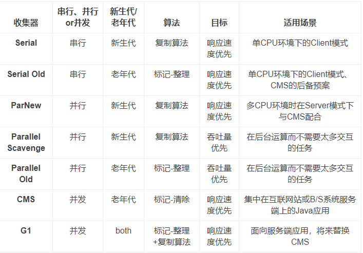


## 3.4 评价GC策略的指标

-  吞吐量：指在应用程序的生命周期内，应用程序所花费的时间和系统总运行时间的比值。 系统总运行时间 = 应用程序耗时 + GC 耗时。如果系统运行了 100min，GC 耗时 1min，那么系统的吞吐量就是(100-1)/100=99%。

-  垃圾回收器负载：和吞吐量相反，垃圾回收器负载指垃圾回收器耗时与系统运行总时间的比值。 

-  停顿时间：指垃圾回收器正在运行时，应用程序的暂停时间。对于独占回收器而言，停顿时间可能会比较长。使用并发的回收器时，由于垃圾回收器和应用程序交替运行，程序的停顿时间会变短，但是，由于其效率很可能不如独占垃圾回收器，故系统的吞吐量可能会较低。 

-  垃圾回收频率：指垃圾回收器多长时间会运行一次。一般来说，对于固定的应用而言，垃圾回收器的频率应该是越低越好。通常增大堆空间可以有效降低垃圾回收发生的频率，但是可能会增加回收产生的停顿时间。 

-  反应时间：指当一个对象被称为垃圾后多长时间内，它所占据的内存空间会被释放。 

-  堆分配：不同的垃圾回收器对堆内存的分配方式可能是不同的。一个良好的垃圾收集器应该有一个合理的堆内存区间划分。

通常情况下，很难让一个应用程序在所有的指标上都达到最优，因此，只能根据应用本身的特点，尽可能使垃圾回收器配合应用程序的工作。比如，对于客户端应用而言，应该尽可能降低其停顿时间，给用户良好的使用体验，为此，可以牺牲垃圾回收的吞吐量；对后台服务程序来说，可能会更加关注吞吐量，所以，可以适当延长系统的停顿时间。

## 3.5 新生代串行收集器

串行收集器是所有垃圾收集器中最古老的一种，也是JDK中最基本的垃圾收集器之一。串行回收器主要有两个特点：第一：使用单线程进行垃圾回收；第二：独占式垃圾回收。

在串行收集器进行垃圾回收时，Java应用程序中的线程都需要暂停，等待垃圾回收完成。这种现象成为Stop-The-World。它将造成非常糟糕的用户体验，在实时性要求较高的应用场景中，这种现象往往是不能被接受的。 

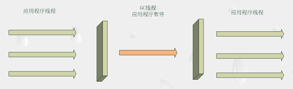

在诸如单CPU处理器或者较小的应用内存等硬件平台不是特别优越的场合，它的性能表现可以超过并行回收器和并发回收器。

在 Hot Spot虚拟机中，使用`-XX:+UseSerialGC`参数可以指定使用新生代串行收集器和老年代串行收集器。当JVM虚拟机在Client模式下运行时，它是默认的垃圾收集器。 

## 3.6 老年代串行收集器

老年代串行收集器使用的是标记压缩算法，它也是一个串行的、独占式的垃圾回收器。由于老年代垃圾回收通常会使用比新生代垃圾回收更长的时间。因此，在堆空间较大的应用程序中，一旦老年串行收集器启动，应用程序很可能会因此停顿几秒甚至更长时间。虽然如此，作为老牌的垃圾回收器，老年代串行回收器可以和多种新生代回收器配合使用，同时它也可以作为CMS回收器的备用回收器。 

可以使用以下参数启用老年代串行回收器。

-  -XX:+UseSerialGC：新生代老年代都使用串行回收去器。

-  -XX:+UseParNewGC：新生代使用并行回收器，老年代使用串行回收器。

-  -XX:+UseParallelGC：新生代使用并行回收收集器，老年代使用串行回收收集器。

## 3.7 并行收集器

并行收集器是工作在新生代的垃圾收集器，它只是简单地将串行回收器多线程化。它的回收策略、算法以及参数和串行回收器一样。并行回收器也是独占式的回收器，在收集过程中，应用程序会全部暂停。但由于并行回收器使用多线程进行垃圾回收，因此，在并发能力比较强的 CPU 上，它产生的停顿时间要短于串行回收器，而在单 CPU 或者并发能力较弱的系统中，并行回收器的效果不会比串行回收器好，由于多线程的压力，它的实际表现很可能比串行回收器差。

开启并行回收器可以使用以下参数：

-  -XX:+UseParNewGC：新生代使用并行收集器，老年代使用串行回收器。

-  -XX:+UseConcMarkSweepGC：新生代使用并行回收器，老年代使用CMS。

并行收集器工作时的线程数量可以使用 `-XX:ParallelGCThreads` 参数指定。一般最好与CPU数量相当，避免过多的线程数，影响垃圾收集性能。 在默认情况下，当CPU数量小于8个时，ParallelGCThreads 的值等于 CPU 数量；当 CPU 数量大于8个时，ParallelGCThreads 的值等于 3+[(5*CPU_Count)/8]。


## 3.8 新生代并行回收（Parallel Scavenge）收集器

新生代并行回收器也是使用复制算法的收集器。与并行回收器不同的是它非常关注系统的吞吐量。

开启并行回收收集器可以使用以下参数：

-  -XX:+UseParallelGC：新生代使用并行回收收集器，老年代使用串行回收器。

-  -XX:+UseParallelOldGC：新生代与老年代都使用并行回收收集器。

并行回收收集器提供了两个重要的参数用于控制系统的吞吐量：

- -XX:+MaxGCPauseMills：设置最大垃圾收集停顿时间，它的值是一个大于 0 的整数。收集器在工作时会调整 Java 堆大小或者其他一些参数，尽可能地把停顿时间控制在 MaxGCPauseMills 以内。如果希望减少停顿时间，而把这个值设置得很小，为了达到预期的停顿时间，JVM 可能会使用一个较小的堆 (一个小堆比一个大堆回收快)，而这将导致垃圾回收变得很频繁，从而增加了垃圾回收总时间，降低了吞吐量。

- -XX:+GCTimeRatio：设置吞吐量大小，它的值是一个 0-100 之间的整数。假设 GCTimeRatio 的值为 n，那么系统将花费不超过 1/(1+n) 的时间用于垃圾收集。比如 GCTimeRatio 等于 19，则系统用于垃圾收集的时间不超过 1/(1+19)=5%。默认情况下，它的取值是 99，即不超过 1%的时间用于垃圾收集。

除此之外，并行回收收集器与并行收集器另一个不同之处在于，它支持一种自适应的 GC 调节策略，使用`-XX:+UseAdaptiveSizePolicy` 可以打开自适应 GC 策略。在这种模式下，新生代的大小、eden 和 survivor 的比例、晋升老年代的对象年龄等参数会被自动调整，以达到在堆大小、吞吐量和停顿时间之间的平衡点。在手工调优比较困难的场合，可以直接使用这种自适应的方式，仅指定虚拟机的最大堆、目标的吞吐量 (GCTimeRatio) 和停顿时间 (MaxGCPauseMills)，让虚拟机自己完成调优工作。

## 3.9 老年代并行回收收集器

老年代的并行回收收集器也是一种多线程并发的收集器。和新生代并行回收收集器一样，它也是一种关注吞吐量的收集器。老年代并行回收收集器使用标记-压缩算法，JDK1.6 之后开始启用。 

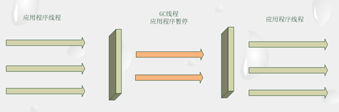

使用`-XX:+UseParallelOldGC` 可以在新生代和老生代都使用并行回收收集器，这是一对非常关注吞吐量的垃圾收集器组合，在对吞吐量敏感的系统中，可以考虑使用。参数`-XX:ParallelGCThreads` 也可以用于设置垃圾回收时的线程数量。 

## 3.10 CMS收集器

与并行回收收集器不同，CMS 收集器主要关注于系统停顿时间。CMS 是 Concurrent Mark Sweep 的缩写，意为并发标记清除，从名称上可以得知，它使用的是**标记-清除算法**，同时它又是一个使用多线程**并发回收**的垃圾收集器。

CMS 工作时，主要步骤有：初始标记、并发标记、重新标记、并发清除和并发重置。其中初始标记和重新标记是独占系统资源的，而并发标记、并发清除和并发重置是可以和用户线程一起执行的。因此，从整体上来说，CMS 收集不是独占式的，它可以在应用程序运行过程中进行垃圾回收。

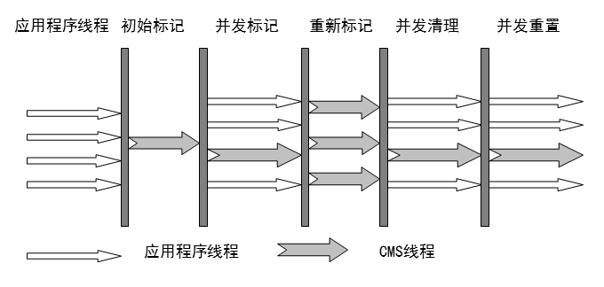

根据标记-清除算法，初始标记、并发标记和重新标记都是为了标记出需要回收的对象。并发清理则是在标记完成后，正式回收垃圾对象；并发重置是指在垃圾回收完成后，重新初始化 CMS 数据结构和数据，为下一次垃圾回收做好准备。并发标记、并发清理和并发重置都是可以和应用程序线程一起执行的。

CMS收集器的主要缺点：

**对CPU资源非常敏感**：CMS 收集器在其主要的工作阶段虽然没有暴力地彻底暂停应用程序线程，但是由于它和应用程序线程并发执行，相互抢占 CPU，所以在 CMS 执行期内对应用程序吞吐量造成一定影响。CMS 默认启动的线程数是 (ParallelGCThreads+3)/4)，ParallelGCThreads 是新生代并行收集器的线程数，也可以通过`-XX:ParallelCMSThreads` 参数手工设定 CMS 的线程数量。当 CPU 资源比较紧张时，受到 CMS 收集器线程的影响，应用程序的性能在垃圾回收阶段可能会非常糟糕。

**无法处理浮动垃圾**：由于 CMS 收集器不是独占式的回收器，在 CMS 回收过程中，应用程序仍然在不停地工作。在应用程序工作过程中，又会不断地产生垃圾。这些新生成的垃圾在当前 CMS 回收过程中是无法清除的。同时，因为应用程序没有中断，所以在 CMS 回收过程中，还应该确保应用程序有足够的内存可用。因此，CMS 收集器不会等待堆内存饱和时才进行垃圾回收，而是当前堆内存使用率达到某一阈值时，便开始进行回收，以确保应用程序在 CMS 工作过程中依然有足够的空间支持应用程序运行。

这个回收阈值可以使用`-XX:CMSInitiatingOccupancyFraction` 来指定，默认是 68。即当老年代的空间使用率达到 68%时，会执行一次 CMS 回收。如果应用程序的内存使用率增长很快，在 CMS 的执行过程中，已经出现了内存不足的情况，此时，CMS 回收将会失败，JVM 将启动老年代串行收集器进行垃圾回收。如果这样，应用程序将完全中断，直到垃圾收集完成，这时，应用程序的停顿时间可能很长。

因此，根据应用程序的特点，可以对 -XX:CMSInitiatingOccupancyFraction  进行调优。如果内存增长缓慢，则可以设置一个稍大的值，大的阈值可以有效降低 CMS 的触发频率，减少老年代回收的次数可以较为明显地改善应用程序性能。反之，如果应用程序内存使用率增长很快，则应该降低这个阈值，以避免频繁触发老年代串行收集器。

**标记-清除算法导致的空间碎片**：CMS是一个基于标记-清除算法的回收器。标记-清除算法会造成大量内存碎片，离散的可用空间无法分配较大的对象。在这种情况下，即使堆内存仍然有较大的剩余空间，也可能会被迫进行一次垃圾回收，以换取一块可用的连续内存，这种现象对系统性能是相当不利的，为了解决这个问题，CMS 收集器还提供了几个用于内存压缩整理的参数。

`-XX:+UseCMSCompactAtFullCollection` 参数可以使 CMS 在垃圾收集完成后，进行一次内存碎片整理。内存碎片的整理并不是并发进行的。`-XX:CMSFullGCsBeforeCompaction` 参数可以用于设定进行多少次 CMS 回收后，进行一次内存压缩。

如果CMS收集器并发收集失败。这很可能是由于应用程序在运行过程中老年代空间不够所导致。如果在CMS工作过程中，出现非常频繁的并发模式失败，就应该考虑进行调整，尽可能预留一个较大的老年代空间。或者可以设置一个较小的 -XX:CMSInitiatingOccupancyFraction 参数，降低CMS触发的阈值，使CMS在执行过程中，仍然有较大的老年代空闲空间供应用程序使用。

## 3.11 G1收集器

G1（Garbage First）收集器在JDK 1.7中发布，目标是作为一款面向服务端应用的垃圾收集器，HotSpot开发团队赋予它的使命是在未来可以替换掉JDK 1.5中发布的CMS收集器。与其他GC收集器相比，G1具备如下特点：

- **并行与并发**：G1能充分利用多CPU、多核环境下的硬件优势，使用多个CPU来缩短“Stop The World”停顿时间，部分其他收集器原本需要停顿Java线程执行的GC动作，G1收集器仍然可以通过并发的方式让Java程序继续执行。
- **分代收集**：与其他收集器一样，分代概念在G1中依然得以保留。虽然G1可以不需要其他收集器配合就能独立管理整个GC堆，但它能够采用不同方式去处理新创建的对象和已存活一段时间、熬过多次GC的旧对象来获取更好的收集效果。
- **空间整合**：G1从整体来看是基于“标记-整理”算法实现的收集器，从局部（两个Region之间）上来看是基于“复制”算法实现的。这意味着G1运行期间不会产生内存空间碎片，收集后能提供规整的可用内存。此特性有利于程序长时间运行，分配大对象时不会因为无法找到连续内存空间而提前触发下一次GC。
- **可预测的停顿**：这是G1相对CMS的一大优势，降低停顿时间是G1和CMS共同的关注点，但G1除了降低停顿外，还能建立可预测的停顿时间模型，能让使用者明确指定在一个长度为M毫秒的时间片段内，消耗在GC上的时间不得超过N毫秒，这几乎已经是实时Java（RTSJ）的垃圾收集器的特征了。

在G1之前的其他收集器进行收集的范围都是整个新生代或者老生代，而G1不再是这样。G1在使用时，Java堆的内存布局与其他收集器有很大区别，它**将整个Java堆划分为多个大小相等的独立区域**（Region） ，虽然还保留新生代和老年代的概念，但新生代和老年代不再是物理隔离的了，而都是一部分Region（不需要连续）的集合。

G1收集器之所以能**建立可预测的停顿时间模型**，是因为它可以有计划地避免在整个Java堆中进行全区域的垃圾收集。G1跟踪各个Region里面的垃圾堆积的价值大小（回收所获得的空间大小以及回收所需时间的经验值），在后台维护一个优先列表 ，每次根据允许的收集时间，优先回收价值最大的Region（这也就是Garbage-First名称的来由）。这种使用Region划分内存空间以及有优先级的区域回收方式，保证了G1收集器在有限的时间内可以获取尽可能高的收集效率。

每个 Region 都有一个 Remembered Set，用来记录该 Region 对象的引用对象所在的 Region。通过使用 Remembered Set，在做可达性分析的时候就可以避免全堆扫描。

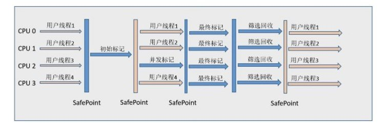

如果不计算维护Remembered Set的操作，G1收集器的运作大致可划分为以下几个步骤：

- **初始标记**（Initial Marking）：仅仅只是标记一下GC Roots 能直接关联到的对象，并且修改TAMS（Nest Top Mark Start）的值，让下一阶段用户程序并发运行时，能在正确可以的Region中创建对象，此阶段需要停顿线程，但耗时很短。
- **并发标记**（Concurrent Marking）：从GC Root 开始对堆中对象进行可达性分析，找到存活对象，此阶段耗时较长，但可与用户程序并发执行。
- **最终标记**（Final Marking）：为了修正在并发标记期间因用户程序继续运作而导致标记产生变动的那一部分标记记录，虚拟机将这段时间对象变化记录在线程的Remembered Set Logs里面，最终标记阶段需要把Remembered Set Logs的数据合并到Remembered Set中，这阶段需要停顿线程，但是可并行执行。
- **筛选回收**（Live Data Counting and Evacuation）：首先对各个Region中的回收价值和成本进行排序，根据用户所期望的GC停顿时间来制定回收计划。此阶段其实也可以做到与用户程序一起并发执行，但是因为只回收一部分Region，时间是用户可控制的，而且停顿用户线程将大幅度提高收集效率。

使用以下参数可以启用 G1 回收器：

-XX:+UnlockExperimentalVMOptions –XX:+UseG1GC 

设置 G1 回收器的目标停顿时间：

-XX:MaxGCPauseMills = 20

-XX:GCPauseIntervalMills = 200。

以上参数指定在200ms内，停顿时间不超过50ms。这两个参数是G1回收器的目标，G1回收器并不保证能执行它们。

## 3.12 收集器对系统性能的影响

本示例将展示不同垃圾收集器对应用软件性能的影响，而不是筛选出最优秀的垃圾回收器。事实上，在众多的垃圾回收器中，并没有最好的，只有最适合应用的回收器。根据应用软件的特性以及硬件平台的特点，选择不同的垃圾回收器，才能有效地提高系统性能。

测试代码：

```java
import java.util.HashMap;

public class  GCTimeTest {
    private static HashMap<Long, byte[]> map = new HashMap<>();
    public static  void main(String[] args){
        long beginTime = System.currentTimeMillis();
        for(int i=0;i<10000;i++){
            if(map.size()*512/1024/1024>=400){
                map.clear();//保护内存不溢出
                System.out.println("clean map");
            }
            byte[] b1;
            for(int j=0;j<100;j++){
                b1 = new  byte[512];
                map.put(System.nanoTime(), b1);//不断消耗内存
            }
        }
        long endTime = System.currentTimeMillis();
        System.out.println(endTime-beginTime);
    }
}
```

使用不同的垃圾回收器测试表：

| 回收器                                                       | 耗时/ms |
| ------------------------------------------------------------ | ------- |
| -Xmx512M -Xms512M -XX:+UseParNewGC                           | 515     |
| -Xmx512M -Xms512M -XX:+UseParallelOldGC -XX:ParallelGCThreads=8 | 547     |
| -Xmx512M -Xms512M -XX:+UseSerialGC                           | 730     |
| -Xmx512M -Xms512M -XX:+UseConcMarkSweepGC                    | 686     |

可以看到，不同的回收器对代码的执行时间有着较为明显的差别。如果读者亲自测试一番，可能结果又有所不同。本例只能说明在新生代使用并行收集器更适合笔者的测试硬件环境和样例代码。

> 根据应用的不同特点，可以选择不同的垃圾回收器，以提高应用程序的性能。

## 3.13 GC相关参数总结

1.与串行回收器相关的参数

-  -XX:+UseSerialGC：在新生代和老年代使用串行回收器。

-  -XX:+SuivivorRatio：设置 eden 区大小和 survivor 区大小的比例。

-  -XX:+PretenureSizeThreshold：设置大对象直接进入老年代的阈值。当对象的大小超过这个值时，将直接在老年代分配。

-  -XX:MaxTenuringThreshold：设置对象进入老年代的年龄的最大值。每一次 Minor GC 后，对象年龄就加 1。任何大于这个年龄的对象，一定会进入老年代。

2.与并行 GC 相关的参数

-  -XX:+UseParNewGC：在新生代使用并行回收收集器。

-  -XX:+UseParallelOldGC：老年代使用并行回收收集器。

-  -XX:ParallelGCThreads：设置用于垃圾回收的线程数。通常情况下可以和 CPU 数量相等。但在 CPU 数量比较多的情况下，设置相对较小的数值也是合理的。

-  -XX:MaxGCPauseMills：设置最大垃圾收集停顿时间。它的值是一个大于 0 的整数。收集器在工作时，会调整 Java 堆大小或者其他一些参数，尽可能地把停顿时间控制在 MaxGCPauseMills 以内。

-  -XX:GCTimeRatio：设置吞吐量大小，它的值是一个 0-100 之间的整数。假设 GCTimeRatio 的值为 n，那么系统将花费不超过 1/(1+n) 的时间用于垃圾收集。

-  -XX:+UseAdaptiveSizePolicy：打开自适应 GC 策略。在这种模式下，新生代的大小，eden 和 survivor 的比例、晋升老年代的对象年龄等参数会被自动调整，以达到在堆大小、吞吐量和停顿时间之间的平衡点。

3.与 CMS 回收器相关的参数

-  -XX:+UseConcMarkSweepGC：新生代使用并行收集器，老年代使用 CMS+串行收集器。

-  -XX:+ParallelCMSThreads：设定 CMS 的线程数量。

-  -XX:+CMSInitiatingOccupancyFraction：设置 CMS 收集器在老年代空间被使用多少后触发，默认为 68%。

-  -XX:+UseFullGCsBeforeCompaction：设定进行多少次 CMS 垃圾回收后，进行一次内存压缩。

-  -XX:+CMSClassUnloadingEnabled：允许对类元数据进行回收。

-  -XX:+CMSParallelRemarkEndable：启用并行重标记。

-  -XX:CMSInitatingPermOccupancyFraction：当永久区占用率达到这一百分比后，启动 CMS 回收 (前提是-XX:+CMSClassUnloadingEnabled 激活了)。

-  -XX:UseCMSInitatingOccupancyOnly：表示只在到达阈值的时候，才进行 CMS 回收。

-  -XX:+CMSIncrementalMode：使用增量模式，比较适合单 CPU。

4.与 G1 回收器相关的参数

-  -XX:+UseG1GC：使用 G1 回收器。

-  -XX:+UnlockExperimentalVMOptions:允许使用实验性参数。

-  -XX:+MaxGCPauseMills:设置最大垃圾收集停顿时间。

-  -XX:+GCPauseIntervalMills:设置停顿间隔时间。

5.其他参数

-  -XX:+DisableExplicitGC: 禁用显示 GC。

# 4.常用调优案例和方法

在实际调优过程中，需要根据具体情况进行权衡和折中。

## 4.1 将新对象预留在新生代

由于 Full GC 的成本远远高于 Minor GC，因此某些情况下需要尽可能将对象分配在年轻代。因此，在 JVM 参数调优时可以为应用程序分配一个合理的年轻代空间，以最大限度避免新对象直接进入年老代的情况发生。 

合理设置一个年轻代的空间大小。-Xmn 调整这个参数，最好设置成堆内存的3/8,例如最大-Xmx5G，那么 -Xmn应该设置成3/8*2大约在2G左右 

设置合理的survivor区并提高survivor区的使用率。 第一种是通过参数-XX:TargetSurvivorRatio提高from区的利用率；第二种方法通过-XX:SurvivorRatio，设置一个更大的from区。

## 4.2 大对象进入老年代

因为大对象出现在年轻代很可能扰乱年轻代 GC，并破坏年轻代原有的对象结构。因为尝试在年轻代分配大对象，很可能导致空间不足，为了有足够的空间容纳大对象，JVM 不得不将年轻代中的年轻对象挪到年老代。因为大对象占用空间多，所以可能需要移动大量小的年轻对象进入年老代，这对 GC 相当不利。基于以上原因，可以将大对象直接分配到年老代，保持年轻代对象结构的完整性，这样可以提高 GC 的效率。 

可以使用-XX:PetenureSizeThreshold 设置大对象直接进入老年代的阈值。

举例：-XX:PetenureSizeThreshold=1000000 当对象大小超过这个值时，将直接在老年代分配。

## 4.3 设置对象进入老年代的年龄

对象在新生代经过一次GC依然存活，则年龄＋1，当年龄达到阀值，就移入老年代。 阀值的最大值通过参数： -XX:MaxTenuringThreshold 来设置，它默认是15。 在实际虚拟机运行过程中，并不是按照这个年龄阀值来判断，而是依据内存使用情况来判断，但这个年龄阀值是最大值，也就说到达这个年龄的对象一定会被移到老年代。 

举例：-XX:MaxTenuringThreshold=1 即所有经过一次GC的对象都可以直接进入老年代。

## 4.4 稳定与震荡的堆大小

当 -Xms与 -Xmx设置大小一样，是一个稳定的堆，这样做的好处是，减少GC的次数。

当 -Xms与 -Xmx设置大小不一样，是一个不稳定的堆，它会增加GC的次数，但是它在系统不需要使用大内存时，压缩堆空间，使得GC应对一个较小的堆，可以加快单次GC的次数。

可以通过两个参数设置用语压缩和扩展堆空间： 

-  -XX:MinHeapFreeRatio: 设置堆的最小空闲比例，默认是40，当堆空间的空闲空间小于这个数值时，jvm会自动扩展空间。 

-  -XX：MaxHeapFreeRatio: 设置堆的最大空闲比例，默认是70，当堆空间的空闲空间大于这个数值时，jvm会自动压缩空间。 

## 4.5 吞吐量优先案例

吞吐量优先的方案将会尽可能减少系统执行垃圾回收的总时间，故可以考虑关注系统吞吐量的并行回收收集器。在拥有4GB内存和32核CPU的计算机上，进行吞吐量的优化，可以使用参数：

```java
java –Xmx3800m –Xms3800m –Xmn2G –Xss128k –XX:+UseParallelGC 
   –XX:ParallelGCThreads=20 –XX:+UseParallelOldGC
```

-  –Xmx380m –Xms3800m：设置 Java 堆的最大值和初始值。一般情况下，为了避免堆内存的频繁震荡，导致系统性能下降，我们的做法是设置最大堆等于最小堆。假设这里把最小堆减少为最大堆的一半，即 1900m，那么 JVM 会尽可能在 1900MB 堆空间中运行，如果这样，发生 GC 的可能性就会比较高；

-  -Xss128k：减少线程栈的大小，这样可以使剩余的系统内存支持更多的线程；

-  -Xmn2g：设置年轻代区域大小为 2GB；

-  –XX:+UseParallelGC：年轻代使用并行垃圾回收收集器。这是一个关注吞吐量的收集器，可以尽可能地减少 GC 时间。

-  –XX:ParallelGCThreads：设置用于垃圾回收的线程数，通常情况下，可以设置和 CPU 数量相等。但在 CPU 数量比较多的情况下，设置相对较小的数值也是合理的；

-  –XX:+UseParallelOldGC：设置年老代使用并行回收收集器。

## 4.6 使用大页案例

在 Solaris 系统中，JVM 可以支持 Large Page Size 的使用。使用大的内存分页可以增强 CPU 的内存寻址能力，从而提升系统的性能。

```java
java –Xmx2506m –Xms2506m –Xmn1536m –Xss128k -XX:++UseParallelGC
 –XX:ParallelGCThreads=20 –XX:+UseParallelOldGC –XX:+LargePageSizeInBytes=256m
```

–XX:+LargePageSizeInBytes：设置大页的大小。

## 4.7 降低停顿案例

为降低应用软件的垃圾回收时的停顿，首先考虑的是使用关注系统停顿的 CMS 回收器，其次，为了减少 Full GC 次数，应尽可能将对象预留在年轻代，因为年轻代 Minor GC 的成本远远小于年老代的 Full GC。 

```java
java –Xmx3550m –Xms3550m –Xmn2g –Xss128k –XX:ParallelGCThreads=20
 –XX:+UseConcMarkSweepGC –XX:+UseParNewGC –XX:+SurvivorRatio=8 –XX:TargetSurvivorRatio=90
 –XX:MaxTenuringThreshold=31
```

-  –XX:ParallelGCThreads=20：设置 20 个线程进行垃圾回收；

-  –XX:+UseParNewGC：新生代使用并行回收器；

-  –XX:+UseConcMarkSweepGC：老年代使用 CMS 收集器降低停顿；

-  –XX:+SurvivorRatio：设置 Eden 区和 Survivor 区的比例为 8:1。稍大的 Survivor 空间可以提高在新生代回收生命周期较短的对象的可能性（如果 Survivor 不够大，一些短命的对象可能直接进入老年代，这对系统来说是不利的）。

-  –XX:TargetSurvivorRatio：设置 Survivor 区的可使用率。这里设置为 90%，则允许 90%的 Survivor 空间被使用。默认值是 50%。故该设置提高了 Survivor 区的使用率。当存放的对象超过这个百分比，则对象会向老年代压缩。因此，这个选项更有助于将对象留在新生代。

-  –XX:MaxTenuringThreshold：设置年轻对象晋升到老年代的年龄。默认值是 15 次，即对象经过 15 次 Minor GC 依然存活，则进入老年代。这里设置为 31，即尽可能地让对象保存在新生代。

# 5.实用JVM参数

## 5.1 JIT编译参数

JVM的JIT（Just-In-Time）编译器，可以在运行时将字节码编译成本地代码，从而提高函数的执行效率。-XX:CompileThreshold 为 JIT编译的阈值， 当函数的调用次数超过 -XX:CompileThreshold 时，JIT就将字节码编译成本地机器码。 在Client 模式下， XX:CompileThreshold 的取值为1500；在Server 模式下， 取值是10000。JIT编译完成后， JVM便会使用本地代码代替原来的字节码解释执行。

| 设置         | 参数                 | 示例                      |
| ------------ | -------------------- | ------------------------- |
| JIT编译阈值  | -XX:CompileThreshold | -XX:CompileThreshold=1500 |
| 打印耗时     | -XX:CITime           | -XX:CITime                |
| 打印编译信息 | -XX:PrintCompilation | -XX:PrintCompilation      |

## 5.2 堆快照（堆Dump）

获得程序的堆快照文件有很多方法， 比较常用的取得堆快照文件的方法是使用-XX:+HeapDumpOnOutOfMemoryError 参数在程序发生OOM时，导出应用程序的当前堆快照。 

通过参数 -XX:heapDumpPath 可以指定堆快照的保存位置。

```java
-Xmx10m -XX:+HeapDumpOnOutOfMemoryError -XX:heapDumpPath=C:\m.hprof
```

## 5.3 错误处理

当系统发生OOM错误时，虚拟机在错误发生时运行一段第三方脚本， 比如， 当OOM发生时，重置系统

```java
-XX:OnOutOfMemoryError=c:\reset.bat
```

## 5.4 取得GC信息

JVM虚拟机提供了许多参数帮助开发人员获取GC信息。

获取一段简要的GC信息，可以使用  -verbose:gc 或者 -XX:+PrintGC。它们的输出如下：

```java
[GC 118250K->113543K(130112K), 0.0094143 secs]
[Full GC 121376K->10414K(130112K), 0.0650971 secs]
```

这段输出，显示了GC前的堆栈情况以及GC后的堆栈大小和堆栈的总大小。

如果要获得更加详细的信息， 可以使用 -XX:+PrintGCDetails。示例输出：

```java
[GC [DefNew: 8614K->781K(9088K), 0.0123035 secs] 118250K->113543K(130112K), 0.0124633 secs]
[GC [DefNew: 8614K->8614K(9088K), 0.0000665 secs][Tenured: 112761K->10414K(121024K), 0.0433488 secs] 121376K->10414K(130112K), 0.0436268 secs]
```

它不仅包含了GC的总体情况，还分别给出了新生代、老年代以及永久区各自的GC信息，以及GC的消耗时间。

如果想要在GC发生的时刻打印GC发生的时间，则可以追加使用-XX:+PrintGCTimeStamps选项。因此，可以知道GC的频率和间隔。打印输出如下：

```java
11.851: [GC 98328K->93620K(130112K), 0.0082960 secs]
```

如果需要查看新生对象晋升老年代的实际阈值， 可以使用参数 -XX:+PrintTenuringDistribution 。

如果需要在GC时打印详细的堆信息，则可以打开 -XX:+PrintHeapAtGC 开关。

如果需要查看GC与实际程序相互执行的耗时， 可以使用 -XX:+PrintGCApplicationtStoppedTime 和 -XX:+PrintGCApplicationConcurrentTime参数。它们将分别显示应用程序在GC发生时的停顿时间和应用程序在GC停顿期间的执行时间。它们的输出如下：

```java
Total time for which application threads were stopped: 0.0468229 seconds
Application time: 0.5291524 seconds
```

为了能将以上的输出信息保存到文件，可以使用 -Xloggc 参数指定GC日志的输出位置。 如 -Xloggc:C:\gc.log。

## 5.5 类和对象跟踪

JVM 还提供了一组参数用于获取系统运行时的加载、卸载类的信息。

-XX:+TraceClassLoading 参数用于跟踪类加载情况，-XX:+TraceClassUnloading 用于跟踪类卸载情况。如果需要同时跟踪类的加载和卸载信息，可以同时打开这两个开关，也可以使用 -verbose:class 参数。

除了类的跟踪， JVM 还提供了 -XX:+PrintClassHistogram 开关用于打印运行时实例的信息。 当此开关被打开时，  当Ctrl+Break 被按下， 会输出系统内类的统计信息。 

```java
...
 4: 990 23760 java.lang.String
...
```

从左到右，依次是 序号、实例数量、总大小和类名等信息。

## 5.6 控制GC

-XX:+DisableExplicitGC 选项用于禁止显式的GC操作， 即禁止在程序中使用System.gc() 触发Full GC。

-Xnoclassgc 参数用于禁止系统进行类的回收， 即系统不会卸载任何类，进而提升GC的性能。 

-Xincgc 参数，一旦启用这个参数，系统便会进行增量式的 GC，增量式的GC使用特定算法让GC线程和应用程序线程交叉执行，从而减小应用程序因GC而产生的停顿时间。 

## 5.7 选择类校验器

为确保class文件的正确和安全，JVM需要通过类校验器对class文件进行验证。目前，JVM中有两套校验器。

在JDK1.6中默认开启新的类校验器，加速类的记载， 可以使用 -XX:-UseSplitVerifier 参数指定使用旧的类校验器（注意是关闭选项）。如果新的校验器校验失败，可以使用老的校验器再次校验。可以使用开关 -XX:-FailOverToOldVerifier关闭再次校验的功能。

## 5.8 Solaris下线程控制

在solaris下，JVM提供了几个用于线程控制的开关：

-  -XX:+UseBoundTreads: 绑定所有用户线程到内核线程， 减少线程进入饥饿状态的次数 。
-  -XX:+UserLWPSynchronization: 使用内核线程替换线程同步 。
-  -XX:+UserVMInterruptibleIO: 允许运行时中断线程。 

## 5.9 使用大页

对同样大小的内存空间， 使用大页后， 内存分页的表项就会减少， 从而可以提升CPU从虚拟内存地址映射到物理内存地址的能力。 在支持大页的操作系统中，使用JVM参数让虚拟机使用大页，从而提升系统性能。 

-  -XX:+UserlargePages: 启用大页。

-  -XX:LargePageSizeInBytes: 指定大页的大小。

## 5.10 压缩指针

在64位虚拟机上， 应用程序所占内存的大小要远远超出其32位版本(约1.5 倍左右)。这是因为64位系统拥有更宽的寻址空间， 与32位系统相比，指针对象的长度进行了翻倍。为了解决这个问题，64位的JVM虚拟机可以使用 -XX:+UseCompressedOops 参数打开指针压缩，从一定程度上减少内存的消耗，可以对以下指针进行压缩：

-  Class的属性指针（静态成员变量）
-  对象的属性指针
-  普通对象数组的每个元素指针

虽然压缩指针可以节省内存，但是压缩和解压指针也会对JVM造成一定的性能损失。

# 6.实战JVM调优

## 6.1 Tomcat启动加速

使用 startup.bat 启动Tomcat 服务器时，start.bat  调用了bin 目录下的calalina.bat 文件。 如果需要配置 Tomcat的JVM参数，可以将参数写入 catalina.bat 中。打开 catalina.bat，可以看到：

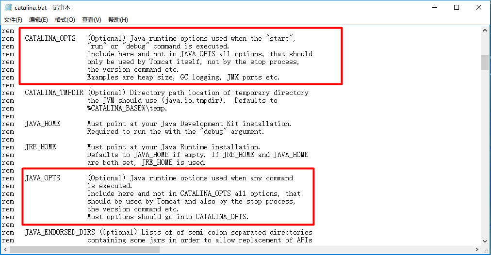


这段说明显示，配置环境变量CATALINA_OPTS或者JAVA_OPTS都可以设置Tomcat的JVM优化参数。根据说明建议，类似堆大小、GC日志和 JMX 端口等推荐配置在 CATALIN_OPTS 中。

获取GC信息可以加入：

```java
set CATALINA_OPTS=-Xloggc:gc.log -XX:+PrintGCDetails
```

为了减少Minor GC的次数， 增大新生代：

```java
set CATALINA_OPTS=%CATALINA_OPTS% -Xmx32M -Xms32M
```

禁用显示GC：

```java
set CATALINA_OPTS=%CATALINA_OPTS% -XX:+DisableExplicitGC
```

在堆内存不变的前提下，为了能进一步减少Minor GC的次数，可以扩大新生代的大小：

```java
set CATALINA_OPTS=%CATALINA_OPTS% -XX:NewRation=2
```

为了加快Minor GC的速度，在多核计算机上可以考虑使用新生代并行回收收集器，加快Minor GC 的速度：

```java
set CATALINA_OPTS=%CATALINA_OPTS% -XX:+UseParallelGC
```

由于JVM虚拟机在加载类时，处于完全考虑，会对Class进行校验和认证，如果类文件是可信任的， 为了加快程序的运行速度，也可以考虑禁用这些效应：

```java
set CATALINA_OPTS=%CATALINA_OPTS% -Xverify:none
```

## 6.2 JMeter介绍和使用

JMeter是Apache 下基于Java 的一款性能测试和压力测试工具。它基于Java 开发，可对HTTP 服务器和FTP服务器，甚至是数据库进行压力测试。 

下载地址：http://jmeter.apache.org/download_jmeter.cgi

中文教程：https://www.yiibai.com/jmeter/

### 1）如何切换中文界面？

编辑/bin/jmeter.properties文件，

找到被注释的#language那一行，更改为 language=zh_CN

### 2）入门HTTP测试

使用版本：5.0 ，环境：windows

第一步：新建线程组

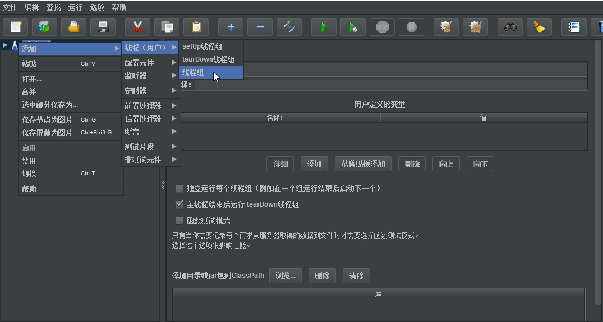


第二步：配置线程数10，每条线程循环200次。

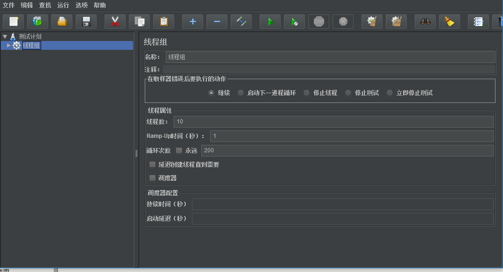


第三步：配置取样器，这里是HTTP请求。

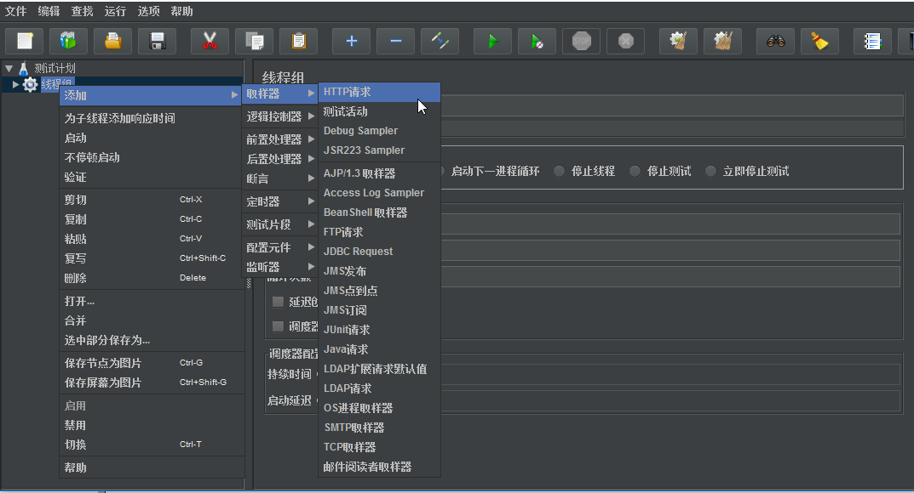


第四步：配置HTTP请求参数，服务器IP，端口号，路径，HTTP参数等。

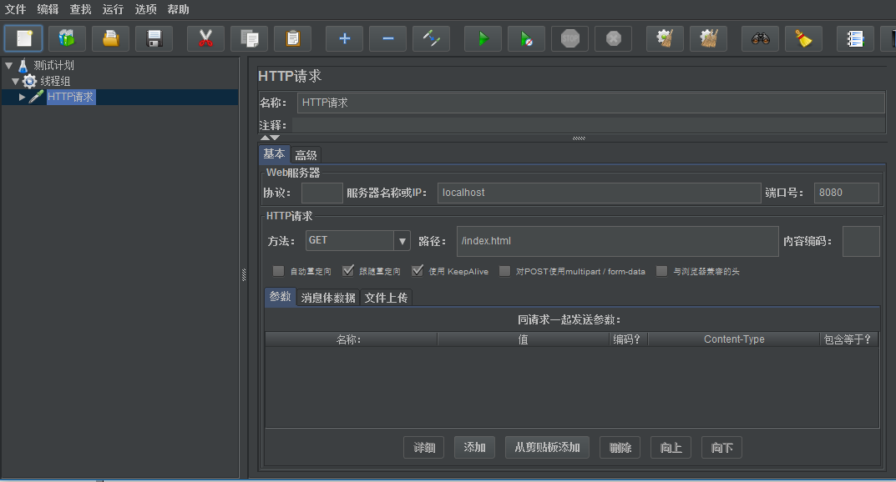


第五步：生成测试报告。JMeter提供图形、表格等多种形式的报告，报告有各项参数，包括平均响应时间、错误数和吞吐量。这里是生成聚合报告。

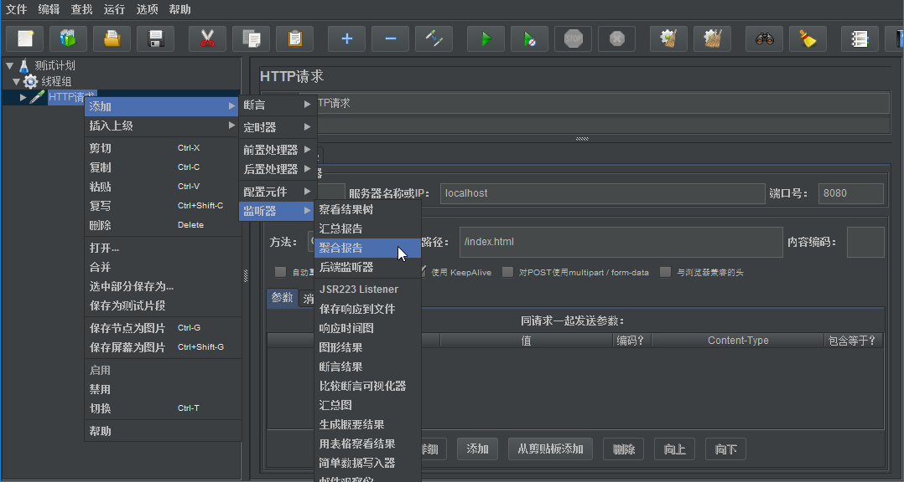


第六步：配置完成后，单机顶部绿色的三角图形，启动，即可进行测试。测试完成后，查看吞吐量那一栏（Throughput）。

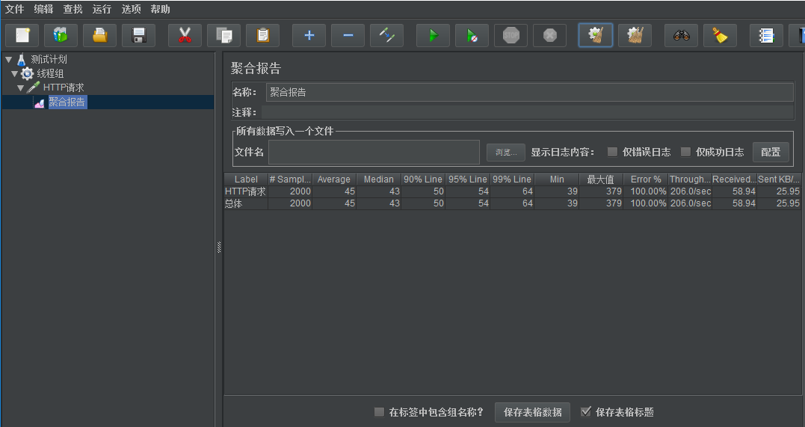


### 3）调优过程示例

为了减少GC次数， 可以使用合理的堆大小和永久区大小。这里将堆大小设置为512MB, 永久区使用32MB, 同时， 禁用显示GC, 并去掉类校验。参数如下：

```java
set CATALINA_OPTS=%CATALINA_OPTS% "-Xmx512M"
set CATALINA_OPTS=%CATALINA_OPTS% "-Xms512M"
set CATALINA_OPTS=%CATALINA_OPTS% "-XX:PermSize=32M"
set CATALINA_OPTS=%CATALINA_OPTS% "-XX:MaxPermSize=32M"
set CATALINA_OPTS=%CATALINA_OPTS% "-XX:+DisableExplicitGC"
set CATALINA_OPTS=%CATALINA_OPTS% "-Xverify:none"
```

 为了进一步提高系统的吞吐量， 可以尝试使用并行回收收集器代替串行收集器。 

```java
set CATALINA_OPTS=%CATALINA_OPTS% "-Xmx512M"
set CATALINA_OPTS=%CATALINA_OPTS% "-Xms512M"
set CATALINA_OPTS=%CATALINA_OPTS% "-XX:PermSize=32M"
set CATALINA_OPTS=%CATALINA_OPTS% "-XX:MaxPermSize=32M"
set CATALINA_OPTS=%CATALINA_OPTS% "-XX:+DisableExplicitGC"
set CATALINA_OPTS=%CATALINA_OPTS% "-Xverify:none"
set CATALINA_OPTS=%CATALINA_OPTS% -XX:+UseParallelGC
set CATALINA_OPTS=%CATALINA_OPTS% -XX:+UseParallelOldGC
set CATALINA_OPTS=%CATALINA_OPTS% -XX:ParallelGCThreads=8
```

总结一下 JVM调优的主要过程有： 确定堆内存大小(-Xmx, -Xms)、合理分配新生代和老生代(-XX:NewRation, -Xmn, -XX:SurvivorRatio)、确定永久区大小： -XX:Permsize, -XX:MaxPermSize、选择垃圾收集器、对垃圾收集器进行合理的设置，除此之外，禁用显示GC（-XX:+DisableExplicitGC）, 禁用类元数据回收(-Xnoclassgc), 禁用类验证(-Xverfy:none)等设置， 对提升系统性能也有一定的帮助。

# 本文参考

*《深入理解Java虚拟机》周志明*
*《Java程序性能优化》葛一鸣*