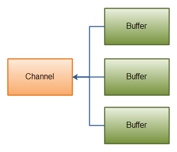
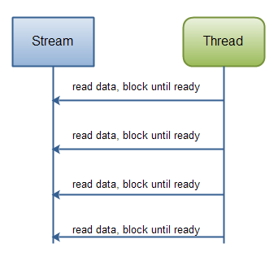
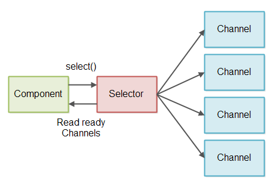
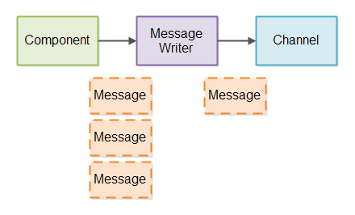

> 本文是从网络复制、经过我的整理、开光而来的，而来的，来的，的。
为什么？因为写的太好了~没事打开看看打发打发时间，哈哈~
# 零、NIO包

`NIO`类包含在一个叫作`java.nio`包的包中。要了解NIO子系统不会取代`java.io`包中可用的基于流的I/O类，如果有对`java.io`基于流的I/O的如何工作有所有了解，这有助于您学习和使用`NIO`中的知识内容。 

`NIO`类包含在以下包中：

| 包名称                    | 使用/目的                                                    |
| ------------------------- | ------------------------------------------------------------ |
| `java.nio`                | 它是NIO系统的顶级包，NIO系统封装了各种类型的缓冲区。         |
| `java.nio.charset`        | 它封装了字符集，并且还支持分别将字符转换为字节和字节到编码器和解码器的操作。 |
| `java.nio.charset.spi`    | 它支持字符集服务提供者                                       |
| `java.nio.channels`       | 它支持通道，这些通道本质上是打开I/O连接。                    |
| `java.nio.channels.spi`   | 它支持频道的服务提供者                                       |
| `java.nio.file`           | 它提供对文件的支持                                           |
| `java.nio.file.spi`       | 它支持文件系统的服务提供者                                   |
| `java.nio.file.attribute` | 它提供对文件属性的支持                                       |

# 一、Java NIO Channel通道

> 原文链接：<http://tutorials.jenkov.com/java-nio/channels.html>

Java NIO Channel通道和流非常相似，主要有以下几点区别：

- 通道可以读也可以写，流一般来说是单向的（只能读或者写）。
- 通道可以异步读写。
- 通道总是基于缓冲区Buffer来读写。

正如上面提到的，我们可以从通道中读取数据，写入到buffer；也可以中buffer内读数据，写入到通道中。下面有个示意图：


**Java NIO: Channels read data into Buffers, and Buffers write data into Channels**

## Channel的实现（Channel Implementations）

下面列出Java NIO中最重要的集中Channel的实现：

- FileChannel
- DatagramChannel
- SocketChannel
- ServerSocketChannel

FileChannel用于文件的数据读写。 DatagramChannel用于UDP的数据读写。 SocketChannel用于TCP的数据读写。 ServerSocketChannel允许我们监听TCP链接请求，每个请求会创建会一个SocketChannel.

## Channel的基础示例（Basic Channel Example）

这有一个利用FileChannel读取数据到Buffer的例子：

```
    RandomAccessFile aFile = new RandomAccessFile("data/nio-data.txt", "rw");
    FileChannel inChannel = aFile.getChannel();

    ByteBuffer buf = ByteBuffer.allocate(48);

    int bytesRead = inChannel.read(buf);
    while (bytesRead != -1) {

      System.out.println("Read " + bytesRead);
      buf.flip();

      while(buf.hasRemaining()){
          System.out.print((char) buf.get());
      }

      buf.clear();
      bytesRead = inChannel.read(buf);
    }
    aFile.close();
```

注意buf.flip()的调用。首先把数据读取到Buffer中，然后调用flip()方法。接着再把数据读取出来。在后续的章节中我们还会讲解先关知识。

# 二、Java NIO Buffer缓冲区

> 原文链接：<http://tutorials.jenkov.com/java-nio/buffers.html>

Java NIO Buffers用于和NIO Channel交互。正如你已经知道的，我们从channel中读取数据到buffers里，从buffer把数据写入到channels.

buffer本质上就是一块内存区，可以用来写入数据，并在稍后读取出来。这块内存被NIO Buffer包裹起来，对外提供一系列的读写方便开发的接口。

## Buffer基本用法（Basic Buffer Usage）

利用Buffer读写数据，通常遵循四个步骤：

- 把数据写入buffer；
- 调用flip；
- 从Buffer中读取数据；
- 调用buffer.clear()或者buffer.compact()

当写入数据到buffer中时，buffer会记录已经写入的数据大小。当需要读数据时，通过flip()方法把buffer从写模式调整为读模式；在读模式下，可以读取所有已经写入的数据。

当读取完数据后，需要清空buffer，以满足后续写入操作。清空buffer有两种方式：调用clear()或compact()方法。clear会清空整个buffer，compact则只清空已读取的数据，未被读取的数据会被移动到buffer的开始位置，写入位置则近跟着未读数据之后。

这里有一个简单的buffer案例，包括了write，flip和clear操作：

```
RandomAccessFile aFile = new RandomAccessFile("data/nio-data.txt", "rw");
FileChannel inChannel = aFile.getChannel();

//create buffer with capacity of 48 bytes
ByteBuffer buf = ByteBuffer.allocate(48);

int bytesRead = inChannel.read(buf); //read into buffer.
while (bytesRead != -1) {

  buf.flip();  //make buffer ready for read

  while(buf.hasRemaining()){
      System.out.print((char) buf.get()); // read 1 byte at a time
  }

  buf.clear(); //make buffer ready for writing
  bytesRead = inChannel.read(buf);
}
aFile.close();
```

## Buffer的容量，位置，上限（Buffer Capacity, Position and Limit）

buffer缓冲区实质上就是一块内存，用于写入数据，也供后续再次读取数据。这块内存被NIO Buffer管理，并提供一系列的方法用于更简单的操作这块内存。

一个Buffer有三个属性是必须掌握的，分别是：

- capacity容量
- position位置
- limit限制

position和limit的具体含义取决于当前buffer的模式。capacity在两种模式下都表示容量。

下面有张示例图，描诉了不同模式下position和limit的含义：


**Buffer capacity, position and limit in write and read mode.**

### 容量（Capacity）

作为一块内存，buffer有一个固定的大小，叫做capacity容量。也就是最多只能写入容量值得字节，整形等数据。一旦buffer写满了就需要清空已读数据以便下次继续写入新的数据。

### 位置（Position）

当写入数据到Buffer的时候需要中一个确定的位置开始，默认初始化时这个位置position为0，一旦写入了数据比如一个字节，整形数据，那么position的值就会指向数据之后的一个单元，position最大可以到capacity-1.

当从Buffer读取数据时，也需要从一个确定的位置开始。buffer从写入模式变为读取模式时，position会归零，每次读取后，position向后移动。

### 上限（Limit）

在写模式，limit的含义是我们所能写入的最大数据量。它等同于buffer的容量。

一旦切换到读模式，limit则代表我们所能读取的最大数据量，他的值等同于写模式下position的位置。

数据读取的上限时buffer中已有的数据，也就是limit的位置（原position所指的位置）。

## Buffer Types

Java NIO有如下具体的Buffer类型：

- ByteBuffer
- MappedByteBuffer
- CharBuffer
- DoubleBuffer
- FloatBuffer
- IntBuffer
- LongBuffer
- ShortBuffer

正如你看到的，Buffer的类型代表了不同数据类型，换句话说，Buffer中的数据可以是上述的基本类型；

MappedByteBuffer稍有不同，我们会单独介绍。

## 分配一个Buffer（Allocating a Buffer）

为了获取一个Buffer对象，你必须先分配。每个Buffer实现类都有一个allocate()方法用于分配内存。下面看一个实例,开辟一个48字节大小的buffer：

```
ByteBuffer buf = ByteBuffer.allocate(48);
```

开辟一个1024个字符的CharBuffer：

```
CharBuffer buf = CharBuffer.allocate(1024);
```

## 写入数据到Buffer（Writing Data to a Buffer）

写数据到Buffer有两种方法：

- 从Channel中写数据到Buffer
- 手动写数据到Buffer，调用put方法

下面是一个实例，演示从Channel写数据到Buffer：

```
 int bytesRead = inChannel.read(buf); //read into buffer.
```

通过put写数据：

```
buf.put(127);    
```

put方法有很多不同版本，对应不同的写数据方法。例如把数据写到特定的位置，或者把一个字节数据写入buffer。看考JavaDoc文档可以查阅的更多数据。

## 翻转（flip()）

flip()方法可以吧Buffer从写模式切换到读模式。调用flip方法会把position归零，并设置limit为之前的position的值。 也就是说，现在position代表的是读取位置，limit标示的是已写入的数据位置。

## 从Buffer读取数据（Reading Data from a Buffer）

冲Buffer读数据也有两种方式。

- 从buffer读数据到channel
- 从buffer直接读取数据，调用get方法

读取数据到channel的例子：

```
//read from buffer into channel.
int bytesWritten = inChannel.write(buf);
```

调用get读取数据的例子：

```
byte aByte = buf.get();    
```

get也有诸多版本，对应了不同的读取方式。

## rewind()

Buffer.rewind()方法将position置为0，这样我们可以重复读取buffer中的数据。limit保持不变。

## clear() and compact()

一旦我们从buffer中读取完数据，需要复用buffer为下次写数据做准备。只需要调用clear或compact方法。

clear方法会重置position为0，limit为capacity，也就是整个Buffer清空。实际上Buffer中数据并没有清空，我们只是把标记为修改了。

如果Buffer还有一些数据没有读取完，调用clear就会导致这部分数据被“遗忘”，因为我们没有标记这部分数据未读。

针对这种情况，如果需要保留未读数据，那么可以使用compact。 因此compact和clear的区别就在于对未读数据的处理，是保留这部分数据还是一起清空。

## mark() and reset()

通过mark方法可以标记当前的position，通过reset来恢复mark的位置，这个非常像canva的save和restore：

```
buffer.mark();

//call buffer.get() a couple of times, e.g. during parsing.

buffer.reset();  //set position back to mark.    
```

## equals() and compareTo()

可以用eqauls和compareTo比较两个buffer

### equals()

判断两个buffer相对，需满足：

- 类型相同
- buffer中剩余字节数相同
- 所有剩余字节相等

从上面的三个条件可以看出，equals只比较buffer中的部分内容，并不会去比较每一个元素。

### compareTo()

compareTo也是比较buffer中的剩余元素，只不过这个方法适用于比较排序的：

# 三、Java NIO Scatter / Gather

> 原文链接：<http://tutorials.jenkov.com/java-nio/scatter-gather.html>

Java NIO发布时内置了对scatter / gather的支持。scatter / gather是通过通道读写数据的两个概念。

Scattering read指的是从通道读取的操作能把数据写入多个buffer，也就是sctters代表了数据从一个channel到多个buffer的过程。

gathering write则正好相反，表示的是从多个buffer把数据写入到一个channel中。

Scatter/gather在有些场景下会非常有用，比如需要处理多份分开传输的数据。举例来说，假设一个消息包含了header和body，我们可能会把header和body保存在不同独立buffer中，这种分开处理header与body的做法会使开发更简明。

## Scattering Reads

"scattering read"是把数据从单个Channel写入到多个buffer，下面是示意图：


**Java NIO: Scattering Read**

用代码来表示的话如下：

```
ByteBuffer header = ByteBuffer.allocate(128);
ByteBuffer body   = ByteBuffer.allocate(1024);

ByteBuffer[] bufferArray = { header, body };

channel.read(bufferArray);
```

观察代码可以发现，我们把多个buffer写在了一个数组中，然后把数组传递给channel.read()方法。read()方法内部会负责把数据按顺序写进传入的buffer数组内。一个buffer写满后，接着写到下一个buffer中。

实际上，scattering read内部必须写满一个buffer后才会向后移动到下一个buffer，因此这并不适合消息大小会动态改变的部分，也就是说，如果你有一个header和body，并且header有一个固定的大小（比如128字节）,这种情形下可以正常工作。

## Gathering Writes

"gathering write"把多个buffer的数据写入到同一个channel中，下面是示意图：




**Java NIO: Gathering Write**

用代码表示的话如下：

```
ByteBuffer header = ByteBuffer.allocate(128);
ByteBuffer body   = ByteBuffer.allocate(1024);

//write data into buffers

ByteBuffer[] bufferArray = { header, body };

channel.write(bufferArray);
```

类似的传入一个buffer数组给write，内部机会按顺序将数组内的内容写进channel，这里需要注意，写入的时候针对的是buffer中position到limit之间的数据。也就是如果buffer的容量是128字节，但它只包含了58字节数据，那么写入的时候只有58字节会真正写入。因此gathering write是可以适用于可变大小的message的，这和scattering reads不同。

# 四、Java NIO Channel to Channel Transfers通道传输接口

> 原文链接：<http://tutorials.jenkov.com/java-nio/channel-to-channel-transfers.html>

在Java NIO中如果一个channel是FileChannel类型的，那么他可以直接把数据传输到另一个channel。逐个特性得益于FileChannel包含的transferTo和transferFrom两个方法。

## transferFrom()

FileChannel.transferFrom方法把数据从通道源传输到FileChannel：

```
RandomAccessFile fromFile = new RandomAccessFile("fromFile.txt", "rw");
FileChannel      fromChannel = fromFile.getChannel();

RandomAccessFile toFile = new RandomAccessFile("toFile.txt", "rw");
FileChannel      toChannel = toFile.getChannel();

long position = 0;
long count    = fromChannel.size();

toChannel.transferFrom(fromChannel, position, count);
```

transferFrom的参数position和count表示目标文件的写入位置和最多写入的数据量。如果通道源的数据小于count那么就传实际有的数据量。 另外，有些SocketChannel的实现在传输时只会传输哪些处于就绪状态的数据，即使SocketChannel后续会有更多可用数据。因此，这个传输过程可能不会传输整个的数据。

## transferTo()

transferTo方法把FileChannel数据传输到另一个channel,下面是案例：

```
RandomAccessFile fromFile = new RandomAccessFile("fromFile.txt", "rw");
FileChannel      fromChannel = fromFile.getChannel();

RandomAccessFile toFile = new RandomAccessFile("toFile.txt", "rw");
FileChannel      toChannel = toFile.getChannel();

long position = 0;
long count    = fromChannel.size();

fromChannel.transferTo(position, count, toChannel);
```

这段代码和之前介绍transfer时的代码非常相似，区别只在于调用方法的是哪个FileChannel.

SocketChannel的问题也存在与transferTo.SocketChannel的实现可能只在发送的buffer填充满后才发送，并结束。

# 五、Java NIO Pipe管道

> 原文链接：<http://tutorials.jenkov.com/java-nio/pipe.html>

一个Java NIO的管道是两个线程间单向传输数据的连接。一个管道（Pipe）有一个source channel和一个sink channel(没想到合适的中文名)。我们把数据写到sink channel中，这些数据可以同过source channel再读取出来。

下面是一个管道的示意图：


## 创建管道(Creating a Pipe)

打开一个管道通过调用Pipe.open()工厂方法，如下：

```
Pipe pipe = Pipe.open();
```

## 向管道写入数据（Writing to a Pipe）

向管道写入数据需要访问他的sink channel：

```
Pipe.SinkChannel sinkChannel = pipe.sink();
```

接下来就是调用write()方法写入数据了：

```
String newData = "New String to write to file..." + System.currentTimeMillis();

ByteBuffer buf = ByteBuffer.allocate(48);
buf.clear();
buf.put(newData.getBytes());

buf.flip();

while(buf.hasRemaining()) {
    sinkChannel.write(buf);
}
```

## 从管道读取数据（Reading from a Pipe）

类似的从管道中读取数据需要访问他的source channel：

```
Pipe.SourceChannel sourceChannel = pipe.source();
```

接下来调用read()方法读取数据：

```
ByteBuffer buf = ByteBuffer.allocate(48);

int bytesRead = inChannel.read(buf);
```

注意这里read()的整形返回值代表实际读取到的字节数。

# 六、选择器

Selector（选择器）是 Java NIO 中能够检测一到多个 NIO 通道，并能够知晓通道是否为诸如读写事件做好准备的组件。这样，一个单独的线程可以管理多个 channel，从而管理多个网络连接。

下面是本文所涉及到的主题列表：

1. 为什么使用 Selector?
2. Selector 的创建
3. 向 Selector 注册通道
4. SelectionKey
5. 通过 Selector 选择通道
6. wakeUp()
7. close()
8. 完整的示例

### 为什么使用 Selector?

仅用单个线程来处理多个 Channels 的好处是，只需要更少的线程来处理通道。事实上，可以只用一个线程处理所有的通道。对于操作系统来说，线程之间上下文切换的开销很大，而且每个线程都要占用系统的一些资源（如内存）。因此，使用的线程越少越好。

但是，需要记住，现代的操作系统和 CPU 在多任务方面表现的越来越好，所以多线程的开销随着时间的推移，变得越来越小了。实际上，如果一个 CPU 有多个内核，不使用多任务可能是在浪费 CPU 能力。不管怎么说，关于那种设计的讨论应该放在另一篇不同的文章中。在这里，只要知道使用 Selector 能够处理多个通道就足够了。

下面是单线程使用一个 Selector 处理 3 个 channel 的示例图：


### Selector 的创建

通过调用 Selector.open() 方法创建一个 Selector，如下：

`Selector selector = Selector.open();`

### 向 Selector 注册通道

为了将 Channel 和 Selector 配合使用，必须将 channel 注册到 selector 上。通过 SelectableChannel.register() 方法来实现，如下：

```
channel.configureBlocking(false);
SelectionKey key = channel.register(selector,
    Selectionkey.OP_READ);
```

与 Selector 一起使用时，Channel 必须处于非阻塞模式下。这意味着不能将 FileChannel 与 Selector 一起使用，因为 FileChannel 不能切换到非阻塞模式。而套接字通道都可以。

注意 register() 方法的第二个参数。这是一个 “interest 集合”，意思是在通过 Selector 监听 Channel 时对什么事件感兴趣。可以监听四种不同类型的事件：

1. Connect
2. Accept
3. Read
4. Write

通道触发了一个事件意思是该事件已经就绪。所以，某个 channel 成功连接到另一个服务器称为 “连接就绪”。一个 server socket channel 准备好接收新进入的连接称为 “接收就绪”。一个有数据可读的通道可以说是 “读就绪”。等待写数据的通道可以说是 “写就绪”。

这四种事件用 SelectionKey 的四个常量来表示：

1. SelectionKey.OP_CONNECT
2. SelectionKey.OP_ACCEPT
3. SelectionKey.OP_READ
4. SelectionKey.OP_WRITE

如果你对不止一种事件感兴趣，那么可以用 “位或” 操作符将常量连接起来，如下：

`int interestSet = SelectionKey.OP_READ | SelectionKey.OP_WRITE;`

在下面还会继续提到 interest 集合

### SelectionKey

在上一小节中，当向 Selector 注册 Channel 时，register() 方法会返回一个 SelectionKey 对象。这个对象包含了一些你感兴趣的属性：

- interest 集合
- ready 集合
- Channel
- Selector
- 附加的对象（可选）

下面我会描述这些属性。

**interest 集合**

就像向 Selector 注册通道一节中所描述的，interest 集合是你所选择的感兴趣的事件集合。可以通过 SelectionKey 读写 interest 集合，像这样：

```
int interestSet = selectionKey.interestOps();
boolean isInterestedInAccept  = (interestSet & SelectionKey.OP_ACCEPT) == SelectionKey.OP_ACCEPT；
boolean isInterestedInConnect = interestSet & SelectionKey.OP_CONNECT;
boolean isInterestedInRead    = interestSet & SelectionKey.OP_READ;
boolean isInterestedInWrite   = interestSet & SelectionKey.OP_WRITE;
```

可以看到，用 “位与” 操作 interest 集合和给定的 SelectionKey 常量，可以确定某个确定的事件是否在 interest 集合中。

**ready 集合**

ready 集合是通道已经准备就绪的操作的集合。在一次选择 (Selection) 之后，你会首先访问这个 ready set。Selection 将在下一小节进行解释。可以这样访问 ready 集合：

`int readySet = selectionKey.readyOps();`

可以用像检测 interest 集合那样的方法，来检测 channel 中什么事件或操作已经就绪。但是，也可以使用以下四个方法，它们都会返回一个布尔类型：

```
selectionKey.isAcceptable();
selectionKey.isConnectable();
selectionKey.isReadable();
selectionKey.isWritable();
```

**Channel + Selector**

从 SelectionKey 访问 Channel 和 Selector 很简单。如下：

```
Channel  channel  = selectionKey.channel();
Selector selector = selectionKey.selector();
```

还可以在用 register() 方法向 Selector 注册 Channel 的时候附加对象。如：

`SelectionKey key = channel.register(selector, SelectionKey.OP_READ, theObject);`

### Selector 选择通道

一旦向 Selector 注册了一或多个通道，就可以调用几个重载的 select() 方法。这些方法返回你所感兴趣的事件（如连接、接受、读或写）已经准备就绪的那些通道。换句话说，如果你对 “读就绪” 的通道感兴趣，select() 方法会返回读事件已经就绪的那些通道。

下面是 select() 方法：

- int select()
- int select(long timeout)
- int selectNow()

select()阻塞到至少有一个通道在你注册的事件上就绪了。

select(long timeout)和 select() 一样，除了最长会阻塞 timeout 毫秒 (参数)。

selectNow()不会阻塞，不管什么通道就绪都立刻返回（译者注：此方法执行非阻塞的选择操作。如果自从前一次选择操作后，没有通道变成可选择的，则此方法直接返回零。）。

select() 方法返回的 int 值表示有多少通道已经就绪。亦即，自上次调用 select() 方法后有多少通道变成就绪状态。如果调用 select() 方法，因为有一个通道变成就绪状态，返回了 1，若再次调用 select() 方法，如果另一个通道就绪了，它会再次返回 1。如果对第一个就绪的 channel 没有做任何操作，现在就有两个就绪的通道，但在每次 select() 方法调用之间，只有一个通道就绪了。

**selectedKeys()**

一旦调用了 select() 方法，并且返回值表明有一个或更多个通道就绪了，然后可以通过调用 selector 的 selectedKeys() 方法，访问 “已选择键集（selected key set）” 中的就绪通道。如下所示：

`Set selectedKeys = selector.selectedKeys();`

当像 Selector 注册 Channel 时，Channel.register() 方法会返回一个 SelectionKey 对象。这个对象代表了注册到该 Selector 的通道。可以通过 SelectionKey 的 selectedKeySet() 方法访问这些对象。

可以遍历这个已选择的键集合来访问就绪的通道。如下：

```
Set selectedKeys = selector.selectedKeys();
Iterator keyIterator = selectedKeys.iterator();
while(keyIterator.hasNext()) {
    SelectionKey key = keyIterator.next();
    if(key.isAcceptable()) {
        // a connection was accepted by a ServerSocketChannel.
    } else if (key.isConnectable()) {
        // a connection was established with a remote server.
    } else if (key.isReadable()) {
        // a channel is ready for reading
    } else if (key.isWritable()) {
        // a channel is ready for writing
    }
    keyIterator.remove();
}
```

这个循环遍历已选择键集中的每个键，并检测各个键所对应的通道的就绪事件。

注意每次迭代末尾的 keyIterator.remove() 调用。Selector 不会自己从已选择键集中移除 SelectionKey 实例。必须在处理完通道时自己移除。下次该通道变成就绪时，Selector 会再次将其放入已选择键集中。

SelectionKey.channel() 方法返回的通道需要转型成你要处理的类型，如 ServerSocketChannel 或 SocketChannel 等。

**wakeUp()**

某个线程调用 select() 方法后阻塞了，即使没有通道已经就绪，也有办法让其从 select() 方法返回。只要让其它线程在第一个线程调用 select() 方法的那个对象上调用 Selector.wakeup() 方法即可。阻塞在 select() 方法上的线程会立马返回。

如果有其它线程调用了 wakeup() 方法，但当前没有线程阻塞在 select() 方法上，下个调用 select() 方法的线程会立即 “醒来（wake up）”。

**close()**

用完 Selector 后调用其 close() 方法会关闭该 Selector，且使注册到该 Selector 上的所有 SelectionKey 实例无效。通道本身并不会关闭。

### 完整的示例

这里有一个完整的示例，打开一个 Selector，注册一个通道注册到这个 Selector 上 (通道的初始化过程略去), 然后持续监控这个 Selector 的四种事件（接受，连接，读，写）是否就绪。

```
Selector selector = Selector.open();
channel.configureBlocking(false);
SelectionKey key = channel.register(selector, SelectionKey.OP_READ);
while(true) {
  int readyChannels = selector.select();
  if(readyChannels == 0) continue;
  Set selectedKeys = selector.selectedKeys();
  Iterator keyIterator = selectedKeys.iterator();
  while(keyIterator.hasNext()) {
    SelectionKey key = keyIterator.next();
    if(key.isAcceptable()) {
        // a connection was accepted by a ServerSocketChannel.
    } else if (key.isConnectable()) {
        // a connection was established with a remote server.
    } else if (key.isReadable()) {
        // a channel is ready for reading
    } else if (key.isWritable()) {
        // a channel is ready for writing
    }
    keyIterator.remove();
  }
}
```

# 七、FileChannel

Java NIO 中的 FileChannel 是一个连接到文件的通道。可以通过文件通道读写文件。

FileChannel 无法设置为非阻塞模式，它总是运行在阻塞模式下。

### 打开 FileChannel

在使用 FileChannel 之前，必须先打开它。但是，我们无法直接打开一个 FileChannel，需要通过使用一个 InputStream、OutputStream 或 RandomAccessFile 来获取一个 FileChannel 实例。下面是通过 RandomAccessFile 打开 FileChannel 的示例：

```
RandomAccessFile aFile = new RandomAccessFile("data/nio-data.txt", "rw");
FileChannel inChannel = aFile.getChannel();
```

### 从 FileChannel 读取数据

调用多个 read() 方法之一从 FileChannel 中读取数据。如：

```
ByteBuffer buf = ByteBuffer.allocate(48);
int bytesRead = inChannel.read(buf);
```

首先，分配一个 Buffer。从 FileChannel 中读取的数据将被读到 Buffer 中。

然后，调用 FileChannel.read() 方法。该方法将数据从 FileChannel 读取到 Buffer 中。read() 方法返回的 int 值表示了有多少字节被读到了 Buffer 中。如果返回 - 1，表示到了文件末尾。

### 向 FileChannel 写数据

使用 FileChannel.write() 方法向 FileChannel 写数据，该方法的参数是一个 Buffer。如：

```
String newData = "New String to write to file..." + System.currentTimeMillis();
ByteBuffer buf = ByteBuffer.allocate(48);
buf.clear();
buf.put(newData.getBytes());
buf.flip();
while(buf.hasRemaining()) {
    channel.write(buf);
}
```

注意 FileChannel.write() 是在 while 循环中调用的。因为无法保证 write() 方法一次能向 FileChannel 写入多少字节，因此需要重复调用 write() 方法，直到 Buffer 中已经没有尚未写入通道的字节。

### 关闭 FileChannel

用完 FileChannel 后必须将其关闭。如：

`channel.close();`

### FileChannel 的 position 方法

有时可能需要在 FileChannel 的某个特定位置进行数据的读 / 写操作。可以通过调用 position() 方法获取 FileChannel 的当前位置。

也可以通过调用 position(long pos) 方法设置 FileChannel 的当前位置。

这里有两个例子:

```
long pos = channel.position();
channel.position(pos +123);
```

如果将位置设置在文件结束符之后，然后试图从文件通道中读取数据，读方法将返回 - 1 —— 文件结束标志。

如果将位置设置在文件结束符之后，然后向通道中写数据，文件将撑大到当前位置并写入数据。这可能导致 “文件空洞”，磁盘上物理文件中写入的数据间有空隙。

### FileChannel 的 size 方法

FileChannel 实例的 size() 方法将返回该实例所关联文件的大小。如:

`long fileSize = channel.size();`

### FileChannel 的 truncate 方法

可以使用 FileChannel.truncate() 方法截取一个文件。截取文件时，文件将中指定长度后面的部分将被删除。如：

`channel.truncate(1024);`

这个例子截取文件的前 1024 个字节。

### FileChannel 的 force 方法

FileChannel.force() 方法将通道里尚未写入磁盘的数据强制写到磁盘上。出于性能方面的考虑，操作系统会将数据缓存在内存中，所以无法保证写入到 FileChannel 里的数据一定会即时写到磁盘上。要保证这一点，需要调用 force() 方法。

force() 方法有一个 boolean 类型的参数，指明是否同时将文件元数据（权限信息等）写到磁盘上。

下面的例子同时将文件数据和元数据强制写到磁盘上：

`channel.force(true);`


# 八、ServerSocketChannel

Java NIO 中的 ServerSocketChannel 是一个可以监听新进来的 TCP 连接的通道, 就像标准 IO 中的 ServerSocket 一样。ServerSocketChannel 类在 java.nio.channels 包中。

这里有个例子：

```
ServerSocketChannel serverSocketChannel = ServerSocketChannel.open();
serverSocketChannel.socket().bind(new InetSocketAddress(9999));
while(true){
    SocketChannel socketChannel =
            serverSocketChannel.accept();
    //do something with socketChannel...
}
```

### 打开 ServerSocketChannel

通过调用 ServerSocketChannel.open() 方法来打开 ServerSocketChannel. 如：

`ServerSocketChannel serverSocketChannel = ServerSocketChannel.open();`

### 关闭 ServerSocketChannel

通过调用 ServerSocketChannel.close() 方法来关闭 ServerSocketChannel. 如：

`serverSocketChannel.close();`

### 监听新进来的连接

通过 ServerSocketChannel.accept() 方法监听新进来的连接。当 accept() 方法返回的时候, 它返回一个包含新进来的连接的 SocketChannel。因此, accept() 方法会一直阻塞到有新连接到达。

通常不会仅仅只监听一个连接, 在 while 循环中调用 accept() 方法. 如下面的例子：

```
while(true){
    SocketChannel socketChannel =
            serverSocketChannel.accept();
    //do something with socketChannel...
}
```

当然, 也可以在 while 循环中使用除了 true 以外的其它退出准则。

### 非阻塞模式

ServerSocketChannel 可以设置成非阻塞模式。在非阻塞模式下，accept() 方法会立刻返回，如果还没有新进来的连接，返回的将是 null。 因此，需要检查返回的 SocketChannel 是否是 null。 如：

```
ServerSocketChannel serverSocketChannel = ServerSocketChannel.open();
serverSocketChannel.socket().bind(new InetSocketAddress(9999));
serverSocketChannel.configureBlocking(false);
while(true){
    SocketChannel socketChannel =
            serverSocketChannel.accept();
    if(socketChannel != null){
        //do something with socketChannel...
    }
}
```

# 九、SocketChannel

Java NIO 中的 SocketChannel 是一个连接到 TCP 网络套接字的通道。可以通过以下 2 种方式创建 SocketChannel：

1. 打开一个 SocketChannel 并连接到互联网上的某台服务器。
2. 一个新连接到达 ServerSocketChannel 时，会创建一个 SocketChannel。

### 打开 SocketChannel

下面是 SocketChannel 的打开方式：

```
SocketChannel socketChannel = SocketChannel.open();
socketChannel.connect(new InetSocketAddress("http://jenkov.com", 80));
```

### 关闭 SocketChannel

当用完 SocketChannel 之后调用 SocketChannel.close() 关闭 SocketChannel：

`socketChannel.close();`

### 从 SocketChannel 读取数据

要从 SocketChannel 中读取数据，调用一个 read() 的方法之一。以下是例子：

```
ByteBuffer buf = ByteBuffer.allocate(48);
int bytesRead = socketChannel.read(buf);
```

首先，分配一个 Buffer。从 SocketChannel 读取到的数据将会放到这个 Buffer 中。

然后，调用 SocketChannel.read()。该方法将数据从 SocketChannel 读到 Buffer 中。read() 方法返回的 int 值表示读了多少字节进 Buffer 里。如果返回的是 - 1，表示已经读到了流的末尾（连接关闭了）。

### 写入 SocketChannel

写数据到 SocketChannel 用的是 SocketChannel.write() 方法，该方法以一个 Buffer 作为参数。示例如下：

```
String newData = "New String to write to file..." + System.currentTimeMillis();
ByteBuffer buf = ByteBuffer.allocate(48);
buf.clear();
buf.put(newData.getBytes());
buf.flip();
while(buf.hasRemaining()) {
    channel.write(buf);
}
```

注意 SocketChannel.write() 方法的调用是在一个 while 循环中的。Write() 方法无法保证能写多少字节到 SocketChannel。所以，我们重复调用 write() 直到 Buffer 没有要写的字节为止。

### 非阻塞模式

可以设置 SocketChannel 为非阻塞模式（non-blocking mode）. 设置之后，就可以在异步模式下调用 connect()， read() 和 write() 了。

**connect()**

如果 SocketChannel 在非阻塞模式下，此时调用 connect()，该方法可能在连接建立之前就返回了。为了确定连接是否建立，可以调用 finishConnect() 的方法。像这样：

```
socketChannel.configureBlocking(false);
socketChannel.connect(new InetSocketAddress("http://jenkov.com", 80));
while(! socketChannel.finishConnect() ){
    //wait, or do something else...
}
```

**write()**

非阻塞模式下，write() 方法在尚未写出任何内容时可能就返回了。所以需要在循环中调用 write()。前面已经有例子了，这里就不赘述了。

**read()**

非阻塞模式下, read() 方法在尚未读取到任何数据时可能就返回了。所以需要关注它的 int 返回值，它会告诉你读取了多少字节。

### 非阻塞模式与选择器

非阻塞模式与选择器搭配会工作的更好，通过将一或多个 SocketChannel 注册到 Selector，可以询问选择器哪个通道已经准备好了读取，写入等。Selector 与 SocketChannel 的搭配使用会在后面详讲。

# 十、DatagramChannel

Java NIO 中的 DatagramChannel 是一个能收发 UDP 包的通道。因为 UDP 是无连接的网络协议，所以不能像其它通道那样读取和写入。它发送和接收的是数据包。

### 打开 DatagramChannel

下面是 DatagramChannel 的打开方式：

```
DatagramChannel channel = DatagramChannel.open();
channel.socket().bind(new InetSocketAddress(9999));
```

这个例子打开的 DatagramChannel 可以在 UDP 端口 9999 上接收数据包。

### 接收数据

通过 receive() 方法从 DatagramChannel 接收数据，如：

```
ByteBuffer buf = ByteBuffer.allocate(48);
buf.clear();
channel.receive(buf);
```

receive() 方法会将接收到的数据包内容复制到指定的 Buffer. 如果 Buffer 容不下收到的数据，多出的数据将被丢弃。

### 发送数据

通过 send() 方法从 DatagramChannel 发送数据，如:

```
String newData = "New String to write to file..." + System.currentTimeMillis();
ByteBuffer buf = ByteBuffer.allocate(48);
buf.clear();
buf.put(newData.getBytes());
buf.flip();
int bytesSent = channel.send(buf, new InetSocketAddress("jenkov.com", 80));
```

这个例子发送一串字符到”jenkov.com” 服务器的 UDP 端口 80。 因为服务端并没有监控这个端口，所以什么也不会发生。也不会通知你发出的数据包是否已收到，因为 UDP 在数据传送方面没有任何保证。

### 连接到特定的地址

可以将 DatagramChannel“连接” 到网络中的特定地址的。由于 UDP 是无连接的，连接到特定地址并不会像 TCP 通道那样创建一个真正的连接。而是锁住 DatagramChannel ，让其只能从特定地址收发数据。

这里有个例子:

`channel.connect(new InetSocketAddress("jenkov.com", 80));`

当连接后，也可以使用 read() 和 write() 方法，就像在用传统的通道一样。只是在数据传送方面没有任何保证。这里有几个例子：

```
int bytesRead = channel.read(buf);
int bytesWritten = channel.write(but);
```

# 十一、Java NIO 与 IO

当学习了 Java NIO 和 IO 的 API 后，一个问题马上涌入脑海：

我应该何时使用 IO，何时使用 NIO 呢？在本文中，我会尽量清晰地解析 Java NIO 和 IO 的差异、它们的使用场景，以及它们如何影响您的代码设计。

## Java NIO 和 IO 的主要区别

下表总结了 Java NIO 和 IO 之间的主要差别，我会更详细地描述表中每部分的差异。

```
IO                NIO
面向流            面向缓冲
阻塞IO            非阻塞IO
无                选择器
```

## 面向流与面向缓冲

Java NIO 和 IO 之间第一个最大的区别是，IO 是面向流的，NIO 是面向缓冲区的。 Java IO 面向流意味着每次从流中读一个或多个字节，直至读取所有字节，它们没有被缓存在任何地方。此外，它不能前后移动流中的数据。如果需要前后移动从流中读取的数据，需要先将它缓存到一个缓冲区。 Java NIO 的缓冲导向方法略有不同。数据读取到一个它稍后处理的缓冲区，需要时可在缓冲区中前后移动。这就增加了处理过程中的灵活性。但是，还需要检查是否该缓冲区中包含所有您需要处理的数据。而且，需确保当更多的数据读入缓冲区时，不要覆盖缓冲区里尚未处理的数据。

## 阻塞与非阻塞 IO

Java IO 的各种流是阻塞的。这意味着，当一个线程调用 read() 或 write() 时，该线程被阻塞，直到有一些数据被读取，或数据完全写入。该线程在此期间不能再干任何事情了。 Java NIO 的非阻塞模式，使一个线程从某通道发送请求读取数据，但是它仅能得到目前可用的数据，如果目前没有数据可用时，就什么都不会获取。而不是保持线程阻塞，所以直至数据变的可以读取之前，该线程可以继续做其他的事情。 非阻塞写也是如此。一个线程请求写入一些数据到某通道，但不需要等待它完全写入，这个线程同时可以去做别的事情。 线程通常将非阻塞 IO 的空闲时间用于在其它通道上执行 IO 操作，所以一个单独的线程现在可以管理多个输入和输出通道（channel）。

## 选择器（Selectors）

Java NIO 的选择器允许一个单独的线程来监视多个输入通道，你可以注册多个通道使用一个选择器，然后使用一个单独的线程来 “选择” 通道：这些通道里已经有可以处理的输入，或者选择已准备写入的通道。这种选择机制，使得一个单独的线程很容易来管理多个通道。

## NIO 和 IO 如何影响应用程序的设计

无论您选择 IO 或 NIO 工具箱，可能会影响您应用程序设计的以下几个方面：

1. 对 NIO 或 IO 类的 API 调用。
2. 数据处理。
3. 用来处理数据的线程数。

## API 调用

当然，使用 NIO 的 API 调用时看起来与使用 IO 时有所不同，但这并不意外，因为并不是仅从一个 InputStream 逐字节读取，而是数据必须先读入缓冲区再处理。

## 数据处理

使用纯粹的 NIO 设计相较 IO 设计，数据处理也受到影响。

在 IO 设计中，我们从 InputStream 或 Reader 逐字节读取数据。假设你正在处理一基于行的文本数据流，例如：

```
Name: Anna
Age: 25
Email: anna@mailserver.com
Phone: 1234567890
```

该文本行的流可以这样处理：

`InputStream input = … ; // get the InputStream from the client socket`

```
BufferedReader reader = new BufferedReader(new InputStreamReader(input));
String nameLine   = reader.readLine();
String ageLine    = reader.readLine();
String emailLine  = reader.readLine();
String phoneLine  = reader.readLine();
```

请注意处理状态由程序执行多久决定。换句话说，一旦 reader.readLine() 方法返回，你就知道肯定文本行就已读完， readline() 阻塞直到整行读完，这就是原因。你也知道此行包含名称；同样，第二个 readline() 调用返回的时候，你知道这行包含年龄等。 正如你可以看到，该处理程序仅在有新数据读入时运行，并知道每步的数据是什么。一旦正在运行的线程已处理过读入的某些数据，该线程不会再回退数据（大多如此）。下图也说明了这条原则：




（Java IO: 从一个阻塞的流中读数据） 而一个 NIO 的实现会有所不同，下面是一个简单的例子：

```
ByteBuffer buffer = ByteBuffer.allocate(48);
int bytesRead = inChannel.read(buffer);
```

注意第二行，从通道读取字节到 ByteBuffer。当这个方法调用返回时，你不知道你所需的所有数据是否在缓冲区内。你所知道的是，该缓冲区包含一些字节，这使得处理有点困难。

假设第一次 read(buffer) 调用后，读入缓冲区的数据只有半行，例如，“Name:An”，你能处理数据吗？显然不能，需要等待，直到整行数据读入缓存，在此之前，对数据的任何处理毫无意义。

所以，你怎么知道是否该缓冲区包含足够的数据可以处理呢？好了，你不知道。发现的方法只能查看缓冲区中的数据。其结果是，在你知道所有数据都在缓冲区里之前，你必须检查几次缓冲区的数据。这不仅效率低下，而且可以使程序设计方案杂乱不堪。例如：

```
ByteBuffer buffer = ByteBuffer.allocate(48);
int bytesRead = inChannel.read(buffer);
while(! bufferFull(bytesRead) ) {
bytesRead = inChannel.read(buffer);
}
```

bufferFull() 方法必须跟踪有多少数据读入缓冲区，并返回真或假，这取决于缓冲区是否已满。换句话说，如果缓冲区准备好被处理，那么表示缓冲区满了。

bufferFull() 方法扫描缓冲区，但必须保持在 bufferFull（）方法被调用之前状态相同。如果没有，下一个读入缓冲区的数据可能无法读到正确的位置。这是不可能的，但却是需要注意的又一问题。

如果缓冲区已满，它可以被处理。如果它不满，并且在你的实际案例中有意义，你或许能处理其中的部分数据。但是许多情况下并非如此。下图展示了 “缓冲区数据循环就绪”：


Java NIO：从一个通道里读数据，直到所有的数据都读到缓冲区里。

### 用来处理数据的线程数

NIO 可让您只使用一个（或几个）单线程管理多个通道（网络连接或文件），但付出的代价是解析数据可能会比从一个阻塞流中读取数据更复杂。

如果需要管理同时打开的成千上万个连接，这些连接每次只是发送少量的数据，例如聊天服务器，实现 NIO 的服务器可能是一个优势。同样，如果你需要维持许多打开的连接到其他计算机上，如 P2P 网络中，使用一个单独的线程来管理你所有出站连接，可能是一个优势。一个线程多个连接的设计方案如下图所示：


Java NIO: 单线程管理多个连接。

如果你有少量的连接使用非常高的带宽，一次发送大量的数据，也许典型的 IO 服务器实现可能非常契合。下图说明了一个典型的 IO 服务器设计：


Java IO：一个典型的 IO 服务器设计 - 一个连接通过一个线程处理。


# 十二、Java NIO Path路径

> 原文链接：<http://tutorials.jenkov.com/java-nio/path.html>

Java的path接口是作为Java NIO 2的一部分是Java6,7中NIO的升级增加部分。Path在Java 7新增的。相关接口位于java.nio.file包下，所以Javaz内Path接口的完整名称是java.nio.file.Path.

一个Path实例代表一个文件系统内的路径。path可以指向文件也可以指向目录。可以使相对路径也可以是绝对路径。绝对路径包含了从根目录到该文件（目录）的完整路径。相对路径包含该文件（目录）相对于其他路径的路径。相对路径听起来可能有点让人头晕。但是别急，稍后我们会详细介绍。

不要把文件系统中路径和环境变量的路径混淆。java.nio.file.Path和环境变量没有任何关系。

在很多情况下java.no.file.Path接口和java.io.File比较相似，但是他们之间存在一些细微的差异。尽管如此，在大多数情况下，我们都可以用File相关类来替换Path接口。

## 创建Path实例（Creating a Path Instance）

为了使用java.nio.file.Path实例我们必须创建Path对象。创建Path实例可以通过Paths的工厂方法get（）。下面是一个实例：

```
import java.nio.file.Path;
import java.nio.file.Paths;

public classs PathExample {
  public static void mian(String[] args) {
    Path = path = Paths.get("c:\\data\\myfile.txt");
  }
}
```

注意上面的两个import声明。需要使用Path和Paths的接口,毕现先把他们引入。

其次注意Paths.get("c:\data\myfile.txt")的调用。这个方法会创建一个Path实例，换句话说Paths.get()是Paths的一个工厂方法。

### 创建绝对路径（Creating an Absolute Path）

创建绝对路径只需要调动Paths.get()这个工厂方法，同时传入绝对文件。这是一个例子：

```
Path path = Paths.get("c:\\data\\myfile.txt");
```

对路径是c:\data\myfile.txt，里面的双斜杠\字符是Java 字符串中必须的，因为\是转义字符，表示后面跟的字符在字符串中的真实含义。双斜杠\表示\自身。

上面的路径是Windows下的文件系统路径表示。在Unixx系统中（Linux, MacOS,FreeBSD等）上述的绝对路径长得是这样的：

```
Path path = Paths.get("/home/jakobjenkov/myfile.txt");
```

他的绝对路径是/home/jakobjenkov/myfile.txt。 如果在Windows机器上使用用这种路径，那么这个路径会被认为是相对于当前磁盘的。例如：

```
/home/jakobjenkov/myfile.txt
```

这个路径会被理解其C盘上的文件，所以路径又变成了

```
C:/home/jakobjenkov/myfile.txt
```

### 创建相对路径（Creating a Relative Path）

相对路径是从一个路径（基准路径）指向另一个目录或文件的路径。完整路径实际上等同于相对路径加上基准路径。

Java NIO的Path类可以用于相对路径。创建一个相对路径可以通过调用Path.get(basePath, relativePath),下面是一个示例：

```
Path projects = Paths.get("d:\\data", "projects");

Path file     = Paths.get("d:\\data", "projects\\a-project\\myfile.txt");
```

第一行创建了一个指向d:\data\projects的Path实例。第二行创建了一个指向d:\data\projects\a-project\myfile.txt的Path实例。 在使用相对路径的时候有两个特殊的符号：

- .
- ..

.表示的是当前目录，例如我们可以这样创建一个相对路径：

```
Path currentDir = Paths.get(".");
System.out.println(currentDir.toAbsolutePath());
```

currentDir的实际路径就是当前代码执行的目录。 如果在路径中间使用了.那么他的含义实际上就是目录位置自身，例如：

```
Path currentDir = Paths.get("d:\\data\\projects\.\a-project");
```

上诉路径等同于：

```
d:\data\projects\a-project
```

..表示父目录或者说是上一级目录：

```
Path parentDir = Paths.get("..");
```

这个Path实例指向的目录是当前程序代码的父目录。 如果在路径中间使用..那么会相应的改变指定的位置：

```
String path = "d:\\data\\projects\\a-project\\..\\another-project";
Path parentDir2 = Paths.get(path);
```

这个路径等同于：

```
d:\data\projects\another-project
```

.和..也可以结合起来用，这里不过多介绍。

## Path.normalize()

Path的normalize()方法可以把路径规范化。也就是把.和..都等价去除：

```
String originalPath = "d:\\data\\projects\\a-project\\..\\another-project";

Path path1 = Paths.get(originalPath);
System.out.println("path1 = " + path1);

Path path2 = path1.normalize();
System.out.println("path2 = " + path2);
```

这段代码的输出如下：

```
path1 = d:\data\projects\a-project\..\another-project
path2 = d:\data\projects\another-project
```

# 十三、Java NIO Files

> 原文链接：<http://tutorials.jenkov.com/java-nio/files.html>

Java NIO中的Files类（java.nio.file.Files）提供了多种操作文件系统中文件的方法。本节教程将覆盖大部分方法。Files类包含了很多方法，所以如果本文没有提到的你也可以直接查询JavaDoc文档。

java.nio.file.Files类是和java.nio.file.Path相结合使用的，所以在用Files之前确保你已经理解了Path类。

## Files.exists()

Files.exits()方法用来检查给定的Path在文件系统中是否存在。 在文件系统中创建一个原本不存在的Payh是可行的。例如，你想新建一个目录，那么闲创建对应的Path实例，然后创建目录。

由于Path实例可能指向文件系统中的不存在的路径，所以需要用Files.exists()来确认。

下面是一个使用Files.exists()的示例：

```
Path path = Paths.get("data/logging.properties");

boolean pathExists =
        Files.exists(path,
            new LinkOption[]{ LinkOption.NOFOLLOW_LINKS});
```

这个示例中，我们首先创建了一个Path对象，然后利用Files.exists()来检查这个路径是否真实存在。

注意Files.exists()的的第二个参数。他是一个数组，这个参数直接影响到Files.exists()如何确定一个路径是否存在。在本例中，这个数组内包含了LinkOptions.NOFOLLOW_LINKS，表示检测时不包含符号链接文件。

## Files.createDirectory()

Files.createDirectory()会创建Path表示的路径，下面是一个示例：

```
Path path = Paths.get("data/subdir");

try {
    Path newDir = Files.createDirectory(path);
} catch(FileAlreadyExistsException e){
    // the directory already exists.
} catch (IOException e) {
    //something else went wrong
    e.printStackTrace();
}
```

第一行创建了一个Path实例，表示需要创建的目录。接着用try-catch把Files.createDirectory()的调用捕获住。如果创建成功，那么返回值就是新创建的路径。

如果目录已经存在了，那么会抛出java.nio.file.FileAlreadyExistException异常。如果出现其他问题，会抛出一个IOException。比如说，要创建的目录的父目录不存在，那么就会抛出IOException。父目录指的是你要创建的目录所在的位置。也就是新创建的目录的上一级父目录。

## Files.copy()

Files.copy()方法可以吧一个文件从一个地址复制到另一个位置。例如：

```
Path sourcePath      = Paths.get("data/logging.properties");
Path destinationPath = Paths.get("data/logging-copy.properties");

try {
    Files.copy(sourcePath, destinationPath);
} catch(FileAlreadyExistsException e) {
    //destination file already exists
} catch (IOException e) {
    //something else went wrong
    e.printStackTrace();
}
```

这个例子当中，首先创建了原文件和目标文件的Path实例。然后把它们作为参数，传递给Files.copy(),接着就会进行文件拷贝。

如果目标文件已经存在，就会抛出java.nio.file.FileAlreadyExistsException异常。类似的吐过中间出错了，也会抛出IOException。

### 覆盖已经存在的文件(Overwriting Existing Files)

copy操作可以强制覆盖已经存在的目标文件。下面是具体的示例：

```
Path sourcePath      = Paths.get("data/logging.properties");
Path destinationPath = Paths.get("data/logging-copy.properties");

try {
    Files.copy(sourcePath, destinationPath,
            StandardCopyOption.REPLACE_EXISTING);
} catch(FileAlreadyExistsException e) {
    //destination file already exists
} catch (IOException e) {
    //something else went wrong
    e.printStackTrace();
}
```

注意copy方法的第三个参数，这个参数决定了是否可以覆盖文件。

## Files.move()

Java NIO的Files类也包含了移动的文件的接口。移动文件和重命名是一样的，但是还会改变文件的目录位置。java.io.File类中的renameTo()方法与之功能是一样的。

```
Path sourcePath      = Paths.get("data/logging-copy.properties");
Path destinationPath = Paths.get("data/subdir/logging-moved.properties");

try {
    Files.move(sourcePath, destinationPath,
            StandardCopyOption.REPLACE_EXISTING);
} catch (IOException e) {
    //moving file failed.
    e.printStackTrace();
}
```

首先创建源路径和目标路径的，原路径指的是需要移动的文件的初始路径，目标路径是指需要移动到的位置。

这里move的第三个参数也允许我们覆盖已有的文件。

## Files.delete()

Files.delete()方法可以删除一个文件或目录：

```
Path path = Paths.get("data/subdir/logging-moved.properties");

try {
    Files.delete(path);
} catch (IOException e) {
    //deleting file failed
    e.printStackTrace();
}
```

首先创建需要删除的文件的path对象。接着就可以调用delete了。

## Files.walkFileTree()

Files.walkFileTree()方法具有递归遍历目录的功能。walkFileTree接受一个Path和FileVisitor作为参数。Path对象是需要遍历的目录，FileVistor则会在每次遍历中被调用。

下面先来看一下FileVisitor这个接口的定义：

```
public interface FileVisitor {

    public FileVisitResult preVisitDirectory(
        Path dir, BasicFileAttributes attrs) throws IOException;

    public FileVisitResult visitFile(
        Path file, BasicFileAttributes attrs) throws IOException;

    public FileVisitResult visitFileFailed(
        Path file, IOException exc) throws IOException;

    public FileVisitResult postVisitDirectory(
        Path dir, IOException exc) throws IOException {

}
```

FileVisitor需要调用方自行实现，然后作为参数传入walkFileTree().FileVisitor的每个方法会在遍历过程中被调用多次。如果不需要处理每个方法，那么可以继承他的默认实现类SimpleFileVisitor，它将所有的接口做了空实现。

下面看一个walkFileTree()的示例：

```
Files.walkFileTree(path, new FileVisitor<Path>() {
  @Override
  public FileVisitResult preVisitDirectory(Path dir, BasicFileAttributes attrs) throws IOException {
    System.out.println("pre visit dir:" + dir);
    return FileVisitResult.CONTINUE;
  }

  @Override
  public FileVisitResult visitFile(Path file, BasicFileAttributes attrs) throws IOException {
    System.out.println("visit file: " + file);
    return FileVisitResult.CONTINUE;
  }

  @Override
  public FileVisitResult visitFileFailed(Path file, IOException exc) throws IOException {
    System.out.println("visit file failed: " + file);
    return FileVisitResult.CONTINUE;
  }

  @Override
  public FileVisitResult postVisitDirectory(Path dir, IOException exc) throws IOException {
    System.out.println("post visit directory: " + dir);
    return FileVisitResult.CONTINUE;
  }
});
```

FileVisitor的方法会在不同时机被调用： preVisitDirectory()在访问目录前被调用。postVisitDirectory()在访问后调用。

visitFile()会在整个遍历过程中的每次访问文件都被调用。他不是针对目录的，而是针对文件的。visitFileFailed()调用则是在文件访问失败的时候。例如，当缺少合适的权限或者其他错误。

上述四个方法都返回一个FileVisitResult枚举对象。具体的可选枚举项包括：

- CONTINUE
- TERMINATE
- SKIP_SIBLINGS
- SKIP_SUBTREE

返回这个枚举值可以让调用方决定文件遍历是否需要继续。 CONTINE表示文件遍历和正常情况下一样继续。

TERMINATE表示文件访问需要终止。

SKIP_SIBLINGS表示文件访问继续，但是不需要访问其他同级文件或目录。

SKIP_SUBTREE表示继续访问，但是不需要访问该目录下的子目录。这个枚举值仅在preVisitDirectory()中返回才有效。如果在另外几个方法中返回，那么会被理解为CONTINE。

### Searching For Files

下面看一个例子，我们通过walkFileTree()来寻找一个README.txt文件：

```
Path rootPath = Paths.get("data");
String fileToFind = File.separator + "README.txt";

try {
  Files.walkFileTree(rootPath, new SimpleFileVisitor<Path>() {

    @Override
    public FileVisitResult visitFile(Path file, BasicFileAttributes attrs) throws IOException {
      String fileString = file.toAbsolutePath().toString();
      //System.out.println("pathString = " + fileString);

      if(fileString.endsWith(fileToFind)){
        System.out.println("file found at path: " + file.toAbsolutePath());
        return FileVisitResult.TERMINATE;
      }
      return FileVisitResult.CONTINUE;
    }
  });
} catch(IOException e){
    e.printStackTrace();
}
```

### Deleting Directies Recursively

Files.walkFileTree()也可以用来删除一个目录以及内部的所有文件和子目。Files.delete()只用用于删除一个空目录。我们通过遍历目录，然后在visitFile()接口中三次所有文件，最后在postVisitDirectory()内删除目录本身。

```
Path rootPath = Paths.get("data/to-delete");

try {
  Files.walkFileTree(rootPath, new SimpleFileVisitor<Path>() {
    @Override
    public FileVisitResult visitFile(Path file, BasicFileAttributes attrs) throws IOException {
      System.out.println("delete file: " + file.toString());
      Files.delete(file);
      return FileVisitResult.CONTINUE;
    }

    @Override
    public FileVisitResult postVisitDirectory(Path dir, IOException exc) throws IOException {
      Files.delete(dir);
      System.out.println("delete dir: " + dir.toString());
      return FileVisitResult.CONTINUE;
    }
  });
} catch(IOException e){
  e.printStackTrace();
}
```

## Additional Methods in the Files Class

java.nio.file.Files类还有其他一些很有用的方法，比如创建符号链接，确定文件大小以及设置文件权限等。具体用法可以查阅JavaDoc中的API说明。

# 十四、Java NIO通道FileLock

`FileLock`锁定或尝试锁定文件的给定部分。它属于`java.nio.channels`包，该功能在JDK 1.4以上版本可用。

`FileLock`用于在共享模式或非共享模式下锁定文件。它有两个重要的方法如下：

- `FileLock.lock(long position, long size, boolean shared)`
- `FileLock.tryLock(long position, long size, boolean shared)`

上述方法使用参数作为初始位置，文件大小锁定和一个参数来决定是否共享锁定。

## **创建文件锁**

当使用`FileChannel`或`AsynchronousFileChannel`的`lock()`或`tryLock()`方法之一获取文件锁时，将创建文件锁定对象。

## **基本FileLock示例**

下面来看看使用专用锁定的通道在文件中写入(附加)的程序(*FileLockExample.java*)：

```
package com.yiibai;

import java.io.IOException;
import java.nio.channels.FileChannel;
import java.nio.channels.FileLock;
import java.nio.ByteBuffer;
import java.nio.file.Paths;
import java.nio.file.Path;
import java.nio.file.StandardOpenOption;

public class FileLockExample {
    public static void main (String [] args)  
            throws IOException {  
        String input = "* end of the file.";  
        System.out.println("Input string to the test file is: " + input);  
        ByteBuffer buf = ByteBuffer.wrap(input.getBytes());  
        String fp = "testout-file.txt";  
        Path pt = Paths.get(fp);  
        FileChannel fc = FileChannel.open(pt, StandardOpenOption.WRITE,  
StandardOpenOption.APPEND);  
        System.out.println("File channel is open for write and Acquiring lock...");  
        fc.position(fc.size() - 1); // position of a cursor at the end of file       
        FileLock lock = fc.lock();   
        System.out.println("The Lock is shared: " + lock.isShared());  
        fc.write(buf);  
        fc.close(); // Releases the Lock  
        System.out.println("Content Writing is complete. Therefore close the channel and release the lock.");  
        PrintFile.print(fp);  
    }
}


Java
```

**PrintFile.java**文件的内容如下 -

```
package com.yiibai;

import java.io.IOException;
import java.io.FileReader;
import java.io.BufferedReader;

public class PrintFile {
    public static void print(String path) throws IOException {
        FileReader filereader = new FileReader(path);
        BufferedReader bufferedreader = new BufferedReader(filereader);
        String tr = bufferedreader.readLine();
        System.out.println("The Content of testout-file.txt file is: ");
        while (tr != null) {
            System.out.println("    " + tr);
            tr = bufferedreader.readLine();
        }
        filereader.close();
        bufferedreader.close();
    }
}


Java
```

注意：在运行代码之前，需要创建一个名称为`“testout-file.txt”`的文本文件，文本文件的内容如下：

```
Welcome to yiibai.com

This is the example of FileLock in Java NIO channel.


Txt
```

执行上面示例代码，得到以下结果 -

```
Input string to the test file is: * end of the file.
File channel is open for write and Acquiring lock...
The Lock is shared: false
Content Writing is complete. Therefore close the channel and release the lock.
The Content of testout-file.txt file is: 
    Welcome to yiibai.com

    This is the example of FileLock in Java NIO channel.* end of the file.
```


# 十五、Java NIO字符集

`java.nio.charset.Charset`包使用的是在JDK 1.4中引入了字符集的概念。它在给定的字符集和UNICODE之间的编码和解码中起着重要的作用。

字符集的名称必须遵循某些规则。它必须以数字或字母开头。`Charset`类方法在多线程环境中也是安全的。

## 标准字符集

Java支持的字符集列表如下：

- *UTF-8*：`8`位UCS转换格式。
- *US-ASCII*：`7`位ASCII字符。
- *UTF-16LE*：`16`位UCS转换，小字节顺序。
- *ISO-8859-1*：ISO拉丁字母
- *UTF-16*：16位UCS转换格式。
- *UTF-16BE*：大字节顺序的`16`位UCS变换格式
- *Charset.displayName()* - 在Java NIO中用于返回规范名称的字符集。
- *Charset.encode()* - 在Java NIO中用于将UNICODE字符集的`charbuffer`编码为给定字符集的`CharBuffer`。
- *Charset.decode()* - 在Java NIO中用于将给定字符集的字符串解码为`Unicode`字符集的`CharBuffer`。

**基本字符串示例**

```
package com.yiibai;

import java.nio.ByteBuffer;
import java.nio.CharBuffer;
import java.nio.charset.Charset;

public class CharsetExample {
    public static void main(String[] args) {
        Charset cs = Charset.forName("UTF-8");
        System.out.println(cs.displayName());
        System.out.println(cs.canEncode());
        String st = "Welcome to yiibai.com, it is Charset test Example.";
        // The conversion of byte buffer from given charset to char buffer in
        // unicode
        ByteBuffer bytebuffer = ByteBuffer.wrap(st.getBytes());
        CharBuffer charbuffer = cs.decode(bytebuffer);
        // The converesion of char buffer from unicode to byte buffer in given
        // charset
        ByteBuffer newbytebuffer = cs.encode(charbuffer);
        while (newbytebuffer.hasRemaining()) {
            char ca = (char) newbytebuffer.get();
            System.out.print(ca);
        }
        newbytebuffer.clear();
    }
}


Java
```

执行上面示例代码，得到以下结果 -

```
UTF-8
true
Welcome to yiibai.com, it is Charset test Example.
```

# 十六、Java NIO编码和解码

使用Java NIO API编码和解码操作可以从一个字符串执行到另一个字符集。两个类：`CharsetEncoder`和`CharsetDecoder`在`ByteBuffer`和`CharBuffer`之间的编码和解码中起着重要的作用。

只有当处理程序可用时，反应堆(`Reactor`)保持到达事件的跟踪和调度。我们来看看反应堆中执行的编码和解码操作的架构：


**Java NIO中的CharsetEncoder**

`CharsetEncoder`用于将`Unicode`字符编码为字节序列。它还返回一个提供任何错误信息的`CoderResult`对象。

**Java NIO中的CharsetDecoder**

`CharsetDecoder`用于将数组或字节序列解码为`Unicode`字符。在从`ByteBuffer`到`CharBuffer`的解码过程中，获得`CoderResult`对象。

**Java NIO中的Charset.newEncoder()**

在`CharsetEncoder`中，`Charset.newEncoder()`用于创建`Charset`对象，然后通过`newEncoder()`方法，可以获取`CharsetEncoder`对象。

**Java NIO Charset.newDecoder()**

在`CharsetDecoder`中，`Charset.newDecoder()`用于创建`Charset`对象，然后通过`newDecoder()`方法，可以获取一个`CharsetDecoder`对象。

**基本编码和解码示例**

```
package com.yiibai;

import java.nio.ByteBuffer;
import java.nio.CharBuffer;
import java.nio.charset.Charset;
import java.nio.charset.CharacterCodingException;
import java.nio.charset.CharsetDecoder;
import java.nio.charset.CharsetEncoder;

public class CharsetExam {
    public static void main(String[] args) throws CharacterCodingException {
        Charset cs = Charset.forName("UTF-8");
        CharsetDecoder csdecoder = cs.newDecoder();
        CharsetEncoder csencoder = cs.newEncoder();
        String st = "Example of Encode and Decode in Java NIO.";
        ByteBuffer bb = ByteBuffer.wrap(st.getBytes());
        CharBuffer cb = csdecoder.decode(bb);
        ByteBuffer newbb = csencoder.encode(cb);
        while (newbb.hasRemaining()) {
            char ca = (char) newbb.get();
            System.out.print(ca);
        }
        newbb.clear();
    }
}


Java
```

执行上面示例代码，得到以下结果 -

```
Example of Encode and Decode in Java NIO.
```

# 十七、Java NIO AsynchronousFileChannel异步文件通道

> 原文链接：<http://tutorials.jenkov.com/java-nio/asynchronousfilechannel.html>

Java7中新增了AsynchronousFileChannel作为nio的一部分。AsynchronousFileChannel使得数据可以进行异步读写。下面将介绍一下AsynchronousFileChannel的使用。

## 创建AsynchronousFileChannel（Creating an AsynchronousFileChannel）

AsynchronousFileChannel的创建可以通过open()静态方法：

```
Path path = Paths.get("data/test.xml");

AsynchronousFileChannel fileChannel =
    AsynchronousFileChannel.open(path, StandardOpenOption.READ);
```

open()的第一个参数是一个Path实体，指向我们需要操作的文件。 第二个参数是操作类型。上述示例中我们用的是StandardOpenOption.READ，表示以读的形式操作文件。

## 读取数据（Reading Data）

读取AsynchronousFileChannel的数据有两种方式。每种方法都会调用AsynchronousFileChannel的一个read()接口。下面分别看一下这两种写法。

### 通过Future读取数据（Reading Data Via a Future）

第一种方式是调用返回值为Future的read()方法：

```
Future<Integer> operation = fileChannel.read(buffer, 0);
```

这种方式中，read()接受一个ByteBuffer座位第一个参数，数据会被读取到ByteBuffer中。第二个参数是开始读取数据的位置。

read()方法会立刻返回，即使读操作没有完成。我们可以通过isDone()方法检查操作是否完成。

下面是一个略长的示例：

```
 AsynchronousFileChannel fileChannel = 
    AsynchronousFileChannel.open(path, StandardOpenOption.READ);

ByteBuffer buffer = ByteBuffer.allocate(1024);
long position = 0;

Future<Integer> operation = fileChannel.read(buffer, position);

while(!operation.isDone());

buffer.flip();
byte[] data = new byte[buffer.limit()];
buffer.get(data);
System.out.println(new String(data));
buffer.clear();
```

在这个例子中我们创建了一个AsynchronousFileChannel，然后创建一个ByteBuffer作为参数传给read。接着我们创建了一个循环来检查是否读取完毕isDone()。这里的循环操作比较低效，它的意思是我们需要等待读取动作完成。

一旦读取完成后，我们就可以把数据写入ByteBuffer，然后输出。

### 通过CompletionHandler读取数据（Reading Data Via a CompletionHandler）

另一种方式是调用接收CompletionHandler作为参数的read()方法。下面是具体的使用：

```
fileChannel.read(buffer, position, buffer, new CompletionHandler<Integer, ByteBuffer>() {
    @Override
    public void completed(Integer result, ByteBuffer attachment) {
        System.out.println("result = " + result);

        attachment.flip();
        byte[] data = new byte[attachment.limit()];
        attachment.get(data);
        System.out.println(new String(data));
        attachment.clear();
    }

    @Override
    public void failed(Throwable exc, ByteBuffer attachment) {

    }
});
```

这里，一旦读取完成，将会触发CompletionHandler的completed()方法，并传入一个Integer和ByteBuffer。前面的整形表示的是读取到的字节数大小。第二个ByteBuffer也可以换成其他合适的对象方便数据写入。 如果读取操作失败了，那么会触发failed()方法。

## 写数据（Writing Data）

和读数据类似某些数据也有两种方式，调动不同的的write()方法，下面分别看介绍这两种方法。

### 通过Future写数据（Writing Data Via a Future）

通过AsynchronousFileChannel我们可以一步写数据

```
Path path = Paths.get("data/test-write.txt");
AsynchronousFileChannel fileChannel = 
    AsynchronousFileChannel.open(path, StandardOpenOption.WRITE);

ByteBuffer buffer = ByteBuffer.allocate(1024);
long position = 0;

buffer.put("test data".getBytes());
buffer.flip();

Future<Integer> operation = fileChannel.write(buffer, position);
buffer.clear();

while(!operation.isDone());

System.out.println("Write done");
```

首先把文件已写方式打开，接着创建一个ByteBuffer座位写入数据的目的地。再把数据进入ByteBuffer。最后检查一下是否写入完成。 需要注意的是，这里的文件必须是已经存在的，否者在尝试write数据是会抛出一个java.nio.file.NoSuchFileException.

检查一个文件是否存在可以通过下面的方法：

```
if(!Files.exists(path)){
    Files.createFile(path);
}
```

### 通过CompletionHandler写数据（Writing Data Via a CompletionHandler）

我们也可以通过CompletionHandler来写数据：

```
Path path = Paths.get("data/test-write.txt");
if(!Files.exists(path)){
    Files.createFile(path);
}
AsynchronousFileChannel fileChannel = 
    AsynchronousFileChannel.open(path, StandardOpenOption.WRITE);

ByteBuffer buffer = ByteBuffer.allocate(1024);
long position = 0;

buffer.put("test data".getBytes());
buffer.flip();

fileChannel.write(buffer, position, buffer, new CompletionHandler<Integer, ByteBuffer>() {

    @Override
    public void completed(Integer result, ByteBuffer attachment) {
        System.out.println("bytes written: " + result);
    }

    @Override
    public void failed(Throwable exc, ByteBuffer attachment) {
        System.out.println("Write failed");
        exc.printStackTrace();
    }
});

```

同样当数据吸入完成后completed()会被调用，如果失败了那么failed()会被调用。

# 十八、Java NIO: Non-blocking Server非阻塞服务器

> 原文链接：<http://tutorials.jenkov.com/java-nio/non-blocking-server.html>

现在我们已经知道了Java NIO里面那些非阻塞特性是怎么工作的，但是要设计一个非阻塞的服务仍旧比较困难。非阻塞IO相对传统的阻塞IO给开发者带来了更多的挑战。在本节非阻塞服务的讲解中，我们一起来讨论这些会面临的主要挑战，同时也会给出一些潜在的解决方案。

查找关于设计非阻塞服务的相关资料是比较难的，本文提出的解决方案也只能是基于笔者个人的工作经验，构思。如果你有其他的解决方案或者是更好的点子，那么还请不吝赐教。你可以在文章下方的评论区回复，或者可以给我发送邮件，也可以直接在[Twitter](https://twitter.com/jjenkov)上联系我。

虽然本文介绍的一些点子是为Java NIO设计的，但是我相信这些思路同样适用于其他编程语言，只要他们也存在和Selector类似结构，概念。就目前我的了解来说，这些结构底层OS提供的，所以基本上你可以运用到其他编程语言中去。

## 非阻塞服务-GitHub源码仓（Non-blocking Server - GitHub Repository）

为了演示本文探讨的一些技术，笔者已经在GitHub上面建立了相应的源码仓，地址如下：

<https://github.com/jjenkov/java-nio-server>

## 非阻塞IO通道（Non-blocking IO Pipelines）

非阻塞的IO管道（Non-blocking IO Pipelines）可以看做是整个非阻塞IO处理过程的链条。包括在以非阻塞形式进行的读与写操作。下面有一张插图，简单的描述了一个基础的非阻塞的IO管道（Non-blocking IO Pipelines）：


我们的组件（Component）通过Selector检查当前Channel是否有数据需要写入。此时component读入数据，并且根据输入的数据input对外提供数据输出output。这个对外的数据输出output被写到了另一个Channel中。

一个非阻塞的IO管道不必同时需要读和写数据，通常来说有些管道只需要读数据，而另一些管道则只需写数据。

上面的这幅流程图仅仅展示了一个组件。实际上一个管道可能存在多个component在处理输入数据。管道的长度取决于管道具体要做的事情。

当然一个非阻塞的IO管道他也可以同时从多个Channel中读取数据，例如同时冲多个SocketChannel中读取数据；

上面的流程图实际上被简化了，图中的Component实际上负责初始化Selector，从Channel中读取数据，而不是由Channel往Selector压如数据（push），这是简化的上图容易给人带来的误解。

## 非阻塞和阻塞通道比较（Non-blocking vs. Blocking IO Pipelines）

非阻塞IO管道和阻塞IO管道之间最大的区别是他们各自如何从Channel（套接字socket或文件file）读写数据。

IO管道通常直接从流中（来自于socket活file的流）读取数据，然后把数据分割为连续的消息。这个处理与我们读取流信息，用tokenizer进行解析非常相似。不同的是我们在这里会把数据流分割为更大一些的消息块。我把这个过程叫做Message Reader.下面是一张说明的插图：


一个阻塞IO管道的使用可以和输入流一样调用，每次从Channel中读取一个字节的数据，阻塞自身直到有数据可读。这个流程就是一个阻塞的Messsage Reader实现。

使用阻塞IO大大简化了Message Reader的实现成本。阻塞的Message Reader无需关注没有数据返回的情形，无需关注返回部分数据或者数据解析需要被复用的问题。

相似的，一个阻塞的Message Writer也不需要关注写入部分数据，和数据复用的问题。

### 阻塞IO通道的缺点（Blocking IO Pipeline Drawbacks）

上面提到了阻塞的Message Reader易于实现，但是阻塞也给他带了不可避免的缺点，必须为每个数据数量都分配一个单独线程。原因就在于IO接口在读取数据时在有数据返回前会一直被阻塞住。这直接导致我们无法用单线程来处理一个流没有数据返回时去读取其他的流。每当一个线程尝试去读取一个流的数据，这个线程就会被阻塞直到有数据真正返回。

如果这样的IO管道运用到服务器去处理高并发的链接请求，服务器将不得不为每一个到来的链接分配一个单独的线程。如果并发数不高比如每一时刻只有几百并发，也行不会有太大问题。一旦服务器的并发数上升到百万级别，这种设计就缺乏伸缩性。每个线程需要为堆栈分配320KB（32位JVM）到1024KB(64位JVM)的内存空间。这就是说如果有1,000,000个线程，需要1TB的内存。而这些在还没开始真正处理接收到的消息前就需要（消息处理中还需要为对象开拍内存）。

为了减少线程数，很多服务器都设计了线程池，把所有接收到的请求放到队列内，每次读取一条连接进行处理。这种设计可以用下图表示：


但是这种设计要求缓冲的连接进程发送有意义的数据。如果这些连接长时间处于非活跃的状态，那么大量非活跃的连接会阻塞线程池中的所有线程。这会导致服务器的响应速度特别慢甚至无响应。

有些服务器为了减轻这个问题，采取的操作是适当增加线程池的弹性。例如，当线程池所有线程都处于饱和时，线程池可能会自动扩容，启动更多的线程来处理事务。这个解决方案会使得服务器维护大量不活跃的链接。但是需要谨记服务器所能开辟的线程数是有限制的。所有当有1,000,000个低速的链接时，服务器还是不具备伸缩性。

## 基础的非阻塞通道设计（Basic Non-blocking IO Pipeline Design）

一个非阻塞的IO通道可以用单线程读取多个数据流。这个前提是相关的流可以切换为非阻塞模式（并不是所有流都可以以非阻塞形式操作）。在非阻塞模式下，读取一个流可能返回0个或多个字节。如果流还没有可供读取的数据那么就会返回0，其他大于1的返回都表明这是实际读取到的数据；

为了避开没有数据可读的流，我们结合Java NIO中的Selector。一个Selector可以注册多个SelectableChannel实例。当我们调用select()或selectorNow()方法时Selector会返回一个有数据可读的SelectableChannel实例。这个设计可以如下插图：



## 读取部分信息(Reading Partial Messages)

当我们冲SelectableChannel中读取一段数据后，我们并不知道这段数据是否是完整的一个message。因为一个数据段可能包含部分message，也就是说即可能少于一个message，也可能多一个message，正如下面这张插图所示意的那样：


要处理这种截断的message，我们会遇到两个问题：

1. 检测数据段中是否包含一个完整的message
2. 在message剩余部分获取到之前，我们如何处理不完整的message

检测完整message要求Message Reader查看数据段中的数据是否至少包含一个完整的message。如果包含一个或多个完整message，这些message可以被下发到通道中处理。查找完整message的过程是个大量重复的操作，所以这个操作必须是越快越好的。

当数据段中有一个不完整的message时，无论不完整消息是整个数据段还是说在完整message前后，这个不完整的message数据都需要在剩余部分获得前存储起来。

检查message完整性和存储不完整message都是Message Reader的职责。为了避免混淆来自不同Channel的数据，我们为每一个Channel分配一个Message Reader。整个设计大概是这样的：


当我们通过Selector获取到一个有数据可以读取的Channel之后，改Channel关联的Message Reader会读取数据，并且把数据打断为Message块。得到完整的message后就可以通过通道下发到其他组件进行处理。

一个Message Reader自然是协议相关的。他需要知道message的格式以便读取。如果我们的服务器是跨协议复用的，那他必须实现Message Reader的协议-大致类似于接收一个Message Reader工厂作为配置参数。

## 存储不完整的Message（Storing Partial Messages）

现在我们已经明确了由Message Reader负责不完整消息的存储直到接收到完整的消息。闲杂我们还需要知道这个存储过程需要如何来实现。

在设计的时候我们需要考虑两个关键因素：

1. 我们希望在拷贝消息数据的时候数据量能尽可能的小，拷贝量越大则性能相对越低；
2. 我们希望完整的消息是以顺序的字节存储，这样方便进行数据的解析；

### 为每个Message Reade分配Buffer（A Buffer Per Message Reader）

显然不完整的消息数据需要存储在某种buffer中。比较直接的办法是我们为每个Message Reader都分配一个内部的buffer成员。但是，多大的buffer才合适呢？这个buffer必须能存储下一个message最大的大小。如果一个message最大是1MB，那每个Message Reader内部的buffer就至少有1MB大小。

在百万级别的并发链接数下，1MB的buffer基本没法正常工作。举例来说，1,000,000 x 1MB就是1TB的内存大小！如果消息的最大数据量是16MB又需要多少内存呢？128MB呢？

### 可伸缩Buffer（Resizable Buffers）

另一个方案是在每个Message Reader内部维护一个容量可变的buffer。一个可变的buffer在初始化时占用较少控件，在消息变得很大超出容量时自动扩容。这样每个链接就不需要都占用比如1MB的空间。每个链接只使用承载下一个消息所必须的内存大小。

要实现一个可伸缩的buffer有几种不同的办法。每一种都有它的优缺点，下面几个小结我会逐一讨论它们。

### 拷贝扩容（Resize by Copy）

第一种实现可伸缩buffer的办法是初始化buffer的时候只申请较少的空间，比如4KB。如果消息超出了4KB的大小那么开赔一个更大的空间，比如8KB，然后把4KB中的数据拷贝纸8KB的内存块中。

以拷贝方式扩容的优点是一个消息的全部数据都被保存在了一个连续的字节数组中。这使得数据解析变得更加容易。

同时它的缺点是会增加大量的数据拷贝操作。

为了减少数据的拷贝操作，你可以分析整个消息流中的消息大小，一次来找到最适合当前机器的可以减少拷贝操作的buffer大小。例如，你可能会注意到觉大多数的消息都是小于4KB的，因为他们仅仅包含了一个非常请求和响应。这意味着消息的处所荣校应该设置为4KB。

同时，你可能会发现如果一个消息大于4KB，很可能是因为他包含了一个文件。你会可能注意到 大多数通过系统的数据都是小于128KB的。所以我们可以在第一次扩容设置为128KB。

最后你可能会发现当一个消息大于128KB后，没有什么规律可循来确定下次分配的空间大小，这意味着最后的buffer容量应该设置为消息最大的可能数据量。

结合这三次扩容时的大小设置，可以一定程度上减少数据拷贝。4KB以下的数据无需拷贝。在1百万的连接下需要的空间例如1,000,000x4KB=4GB，目前（2015）大多数服务器都扛得住。4KB到128KB会仅需拷贝一次，即拷贝4KB数据到128KB的里面。消息大小介于128KB和最大容量的时需要拷贝两次。首先4KB数据被拷贝第二次是拷贝128KB的数据，所以总共需要拷贝132KB数据。假设没有很多的消息会超过128KB，那么这个方案还是可以接受的。

当一个消息被完整的处理完毕后，它占用的内容应当即刻被释放。这样下一个来自东一个链接通道的消息可以从最小的buffer大小重新开始。这个操作是必须的如果我们需要尽可能高效地复用不同链接之间的内存。大多数情况下并不是所有的链接都会在同一时刻需要大容量的buffer。

笔者写了一个完整的教程阐述了如何实现一个内存buffer使其支持扩容：[Resizable Arrays](http://tutorials.jenkov.com/java-performance/resizable-array.html) 。这个教程也附带了一个指向GitHub上的源码仓地址，里面有实现方案的具体代码。

### 追加扩容（Resize by Append）

另一种实现buffer扩容的方案是让buffer包含几个数组。当需要扩容的时候只需要在开辟一个新的字节数组，然后把内容写到里面去。

这种扩容也有两个具体的办法。一中是开辟单独的字节数组，然后用一个列表把这些独立数组关联起来。另一种是开辟一些更大的，相互共享的字节数组切片，然后用列表把这些切片和buffer关联起来。个人而言，笔者认为第二种切片方案更好一点点，但是它们之前的差异比较小。（译者话：关于这两个办法，我个人觉得概念介绍有点难懂，建议读者也参考一下原文😏）

这种追加扩容的方案不管是用独立数组还是切片都有一个优点，那就是写数据的时候不需要二外的拷贝操作。所有的数据可以直接从socket（Channel）中拷贝至数组活切片当中。

这种方案的缺点也很明显，就是数据不是存储在一个连续的数组中。这会使得数据的解析变得更加复杂，因为解析器不得不同时查找每一个独立数组的结尾和所有数组的结尾。正因为我们需要在写数据时查找消息的结尾，这个模型在设计实现时会相对不那么容易。

### TLV编码消息(TLV Encoded Messages)

有些协议的消息消失采用的是一种TLV格式（Type, Length, Value）。这意味着当消息到达时，消息的完整大小存储在了消息的开始部分。我们可以立刻判断为消息开辟多少内存空间。

TLV编码是的内存管理变得更加简单。我们可以立刻知道为消息分配多少内存。即便是不完整的消息，buffer结尾后面也不会有浪费的内存。

TLV编码的一个缺点是我们需要在消息的全部数据接收到之前就开辟好需要用的所有内存。因此少量链接慢，但发送了大块数据的链接会占用较多内存，导致服务器无响应。

解决上诉问题的一个变通办法是使用一种内部包含多个TLV的消息格式。这样我们为每个TLV段分配内存而不是为整个的消息分配，并且只在消息的片段到达时才分配内存。但是消息片段很大时，任然会出现一样的问题。

另一个办法是为消息设置超时，如果长时间未接收到的消息（比如10-15秒）。这可以让服务器从偶发的并发处理大块消息恢复过来，不过还是会让服务器有一段时间无响应。另外恶意的DoS攻击会导致服务器开辟大量内存。

TLV编码有不同的变种。有多少字节使用这样确切的类型和字段长度取决于每个独立的TLV编码。有的TLV编码吧字段长度放在前面，接着放类型，最后放值。尽管字段的顺序不同，但他任然是一个TLV的类型。

TLV编码使得内存管理更加简单，这也是HTTP1.1协议让人觉得是一个不太优良的的协议的原因。正因如此，HTTP2.0协议在设计中也利用TLV编码来传输数据帧。也是因为这个原因我们设计了自己的利用TLV编码的网络协议[VStack.co](http://vstack.co/)。

## 写不完整的消息（Writing Partial Messages）

在非阻塞IO管道中，写数据也是一个不小的挑战。当你调用一个非阻塞模式Channel的write()方法时，无法保证有多少机字节被写入了ByteBuffer中。write方法返回了实际写入的字节数，所以跟踪记录已被写入的字节数也是可行的。这就是我们遇到的问题：持续记录被写入的不完整的小树知道一个消息中所有的数据都发送完毕。

为了管理不完整消息的写操作，我们需要创建一个Message Writer。正如前面的Message Reader，我们也需要每个Channel配备一个Message Writer来写数据。在每个Message Writer中我们记录准确的已经写入的字节数。

为了避免多个消息传递到Message Writer超出他所能处理到Channel的量，我们需要让到达的消息进入队列。Message Writer则尽可能快的将数据写到Channel里。

下面是一个流程图，展示的是不完整消息被写入的过程：


为了使Message Writer能够持续发送刚才已经发送了一部分的消息，Message Writer需要被移植调用，这样他就可以发送更多数据。

如果你有大量的链接，你会持有大量的Message Writer实例。检查比如1百万的Message Writer实例是来确定他们是否处于可写状态是很慢的操作。首先，许多Message Writer可能根本就没有数据需要发送。我们不想检查这些实例。其次，不是所有的Channel都处于可写状态。我们不想浪费时间在这些非写入状态的Channel。

为了检查一个Channel是否可写，可以把它注册到Selector上。但是我们不希望把所有的Channel实例都注册到Selector。试想一下，如果你有1百万的链接，这里面大部分是空闲的，把1百万链接都祖册到Selector上。然后调用select方法的时候就会有很多的Channel处于可写状态。你需要检查所有这些链接中的Message Writer以确认是否有数据可写。

为了避免检查所有的这些Message Writer，以及那些根本没有消息需要发送给他们的Channel实例，我么可以采用入校两步策略：

1. 当有消息写入到Message Writer忠厚，把它关联的Channel注册到Selector上（如果还未注册的话）。
2. 当服务器有空的时候，可以检查Selector看看注册在上面的Channel实例是否处于可写状态。每个可写的channel，使其Message Writer向Channel中写入数据。如果Message Writer已经把所有的消息都写入Channel，把Channel从Selector上解绑。

这两个小步骤确保只有有数据要写的Channel才会被注册到Selector。

## 集成（Putting it All Together）

正如你所知到的，一个被阻塞的服务器需要时刻检查当前是否有显得完整消息抵达。在一个消息被完整的收到前，服务器可能需要检查多次。检查一次是不够的。

类似的，服务器也需要时刻检查当前是否有任何可写的数据。如果有的话，服务器需要检查相应的链接看他们是否处于可写状态。仅仅在消息第一次进入队列时检查是不够的，因为一个消息可能被部分写入。

总而言之，一个非阻塞的服务器要三个管道，并且经常执行：

- 读数据管道，用来检查打开的链接是否有新的数据到达；
- 处理数据管道，负责处理接收到的完整消息；
- 写数据管道，用于检查是否有数据可以写入打开的连接中；

这三个管道在循环中重复执行。你可以尝试优化它的执行。比如，如果没有消息在队列中等候，那么可以跳过写数据管道。或者，如果没有收到新的完整消息，你甚至可以跳过处理数据管道。

下面这张流程图阐述了这整个服务器循环过程：


假如你还是柑橘这比较复杂难懂，可以去clone我们的源码仓： <https://github.com/jjenkov/java-nio-server> 也许亲眼看到了代码会帮助你理解这一块是如何实现的。

## 服务器线程模型（Server Thread Model）

我们在GitHub上的源码中实现的非阻塞IO服务使用了一个包含两条线程的线程模型。第一个线程负责从ServerSocketChannel接收到达的链接。另一个线程负责处理这些链接，包括读消息，处理消息，把响应写回到链接。这个双线程模型如下：


前一节中已经介绍过的服务器的循环处理在处理线程中执行。

# 十九、实战NIO Socket源码

服务端：

```
package cn.zyzpp.nio;

import java.io.IOException;
import java.net.InetAddress;
import java.net.InetSocketAddress;
import java.nio.ByteBuffer;
import java.nio.channels.SelectionKey;
import java.nio.channels.Selector;
import java.nio.channels.ServerSocketChannel;
import java.nio.channels.SocketChannel;
import java.nio.channels.spi.SelectorProvider;
import java.util.Iterator;
import java.util.Set;
import java.util.concurrent.ExecutorService;
import java.util.concurrent.Executors;

/**
 * Create by yster@foxmail.com 2018/10/11 17:44
 */
public class Server {
    private Selector selector;

    private ExecutorService tp = Executors.newCachedThreadPool();

    class HandleMsg implements Runnable {
        ByteBuffer byteBuffer;
        SelectionKey key;
        public HandleMsg(ByteBuffer byteBuffer, SelectionKey key) {
            this.byteBuffer = byteBuffer;
            this.key = key;
        }
        @Override
        public void run() {
            byteBuffer.flip();

            //byte[] bytes = new byte[byteBuffer.remaining()];
            //byteBuffer.get(bytes);
            //System.out.println(new String(bytes, 0, bytes.length));
            System.out.println(new String(byteBuffer.array(), 0, byteBuffer.limit()));

            //将此键的 interest 集合设置为给定值
            key.interestOps(SelectionKey.OP_WRITE);
            //强迫selector返回, 使尚未返回的第一个选择操作立即返回, 即取消selector.select()的阻塞
            selector.wakeup();
        }
    }

    private void doAccept(SelectionKey key) {
        //返回创建此键的通道
        ServerSocketChannel server = (ServerSocketChannel) key.channel();
        SocketChannel clientChannel;
        try {
            //生成和客户端的通信的通道
            clientChannel = server.accept();
            //设置非阻塞模式
            clientChannel.configureBlocking(false);
            //注册选择器, 读就绪
            clientChannel.register(selector, SelectionKey.OP_READ);
            InetAddress clientAddress = clientChannel.socket().getInetAddress();
            System.out.println("连接到客户端, 客户端ip: " + clientAddress.getHostAddress());
        } catch (Exception e) {
            e.printStackTrace();
        }
    }

    private void doRead(SelectionKey key) throws IOException {
        SocketChannel channel = (SocketChannel) key.channel();
        ByteBuffer byteBuffer = ByteBuffer.allocate(1024);
        try {
            int readBytes = channel.read(byteBuffer);
            if(readBytes > 0) {
                tp.execute(new HandleMsg(byteBuffer, key));
            }
        } catch (IOException e) {
            //请求取消此键的通道到其选择器的注册
            key.cancel();
            if(key.channel() != null) {
                key.channel().close();
            }
            e.printStackTrace();
        }

    }

    private void doWrite(SelectionKey key) throws IOException {
        SocketChannel channel = (SocketChannel) key.channel();
        ByteBuffer byteBuffer = ByteBuffer.allocate(1024);
        try {
            byteBuffer.put("客户端，我服务端收到消息了".getBytes());
            byteBuffer.flip();
            channel.write(byteBuffer);
        } catch (Exception e) {
            key.channel();
            if(key.channel() != null) {
                key.channel().close();
            }
            e.printStackTrace();
        }
        //将此键的 interest 集合设置为给定值
        key.interestOps(SelectionKey.OP_READ);
    }

    private void startServer() throws IOException {
        selector = SelectorProvider.provider().openSelector();
        ServerSocketChannel ssc = ServerSocketChannel.open();
        //设置为非阻塞模式
        ssc.configureBlocking(false);

        InetSocketAddress isa = new InetSocketAddress(8100);
        ssc.socket().bind(isa);

        //让Selector为这个Channel服务, 接收连接继续事件，表示服务器监听到了客户连接，服务器可以接收这个连接了
        // ServerSocketChannel只有OP_ACCEPT可用，OP_CONNECT,OP_READ,OP_WRITE用于SocketChannel
        ssc.register(selector, SelectionKey.OP_ACCEPT);

        while(true) {
            //阻塞方法
            selector.select();
            Set<SelectionKey> readyKeys = selector.selectedKeys();
            Iterator<SelectionKey> iterator = readyKeys.iterator();
            while(iterator.hasNext()) {
                SelectionKey key = (SelectionKey) iterator.next();

                //避免重复处理相同的SelectionKey
                iterator.remove();

                //测试此键的通道是否已准备好接受新的套接字连接(socket连接)
                if(key.isAcceptable()) {
                    doAccept(key);
                    //此键是否有效&&此键的通道是否已准备好进行读取
                } else if(key.isValid() && key.isReadable()) {
                    doRead(key);
                    //此键是否有效&&此键的通道是否已准备好进行写入
                } else if(key.isValid() && key.isWritable()) {
                    doWrite(key);
                }
            }
        }
    }

    public static void main(String[] args) throws IOException {
        new Server().startServer();
    }
}

```

客户端：

```
package cn.zyzpp.nio;

import java.io.IOException;
import java.net.InetSocketAddress;
import java.nio.ByteBuffer;
import java.nio.channels.SelectionKey;
import java.nio.channels.Selector;
import java.nio.channels.SocketChannel;
import java.nio.channels.spi.SelectorProvider;
import java.util.Iterator;

/**
 * Create by yster@foxmail.com 2018/10/11 16:36
 */
public class Client {

    private Selector selector;

    public void init(String ip, int port) throws IOException {
        SocketChannel channel = SocketChannel.open();
        channel.configureBlocking(false);
        this.selector = SelectorProvider.provider().openSelector();
        channel.connect(new InetSocketAddress(ip, port));
        //连接就绪，表示客户与服务器的连接已经建立成功
        channel.register(selector, SelectionKey.OP_CONNECT);
    }

    public void connect(SelectionKey key) throws IOException {
        SocketChannel channel = (SocketChannel) key.channel();
        try {
            //如果正在连接, 则完成连接
            if(channel.isConnectionPending()) {
                //完成套接字通道的连接过程
                channel.finishConnect();
            }
            channel.configureBlocking(false);
            channel.write(ByteBuffer.wrap(new String("hello server, I am client!\r\n").getBytes()));
            //注册选择器，读就绪
            channel.register(this.selector, SelectionKey.OP_READ);
        } catch (IOException e) {
            e.printStackTrace();
            channel.close();
            key.selector().close();
        }

    }

    public void read(SelectionKey key) throws IOException {
        SocketChannel channel = (SocketChannel) key.channel();
        //创建读取的缓冲区
        ByteBuffer buffer = ByteBuffer.allocate(2048);
        try {
            channel.read(buffer);
            byte[] data = buffer.array();
            String msg = new String(data).trim();
            System.out.println("客户端收到信息: " + msg);
        } catch (IOException e) {
            channel.close();
            key.selector().close();
        }
    }

    public void working() throws IOException {
        while(true) {
            if(!selector.isOpen()) {
                break;
            }
            selector.select();
            Iterator<SelectionKey> ite = this.selector.selectedKeys().iterator();
            while(ite.hasNext()) {
                SelectionKey key = ite.next();
                ite.remove();
                //连接事件发生
                if(key.isConnectable()) {
                    connect(key);
                } else if(key.isReadable()) {
                    read(key);
                }
            }
        }
    }

    public static void main(String[] args) throws IOException {
        Client c = new Client();
        c.init("127.0.0.1", 8080);
        c.working();
    }

}

```

服务端打印：

```
连接到客户端, 客户端ip: 127.0.0.1
hello server, I am client!
```

客户端打印：

```
客户端收到信息: 客户端，我服务端收到消息了
```

