# 1.Linux命令行工具

推荐：CentOS 7

## 1.1 top命令

top命令的输出如下：

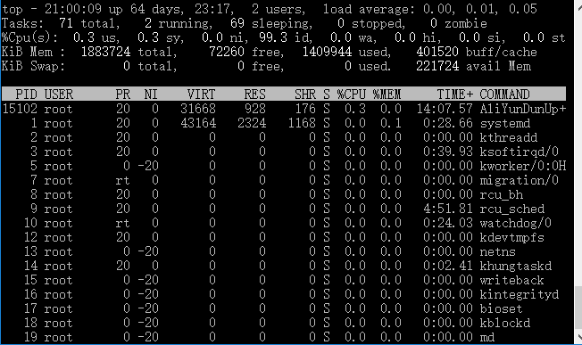


top命令的输出可以分为两部分：前半部分是系统统计信息，后半部分是进程信息。在统计信息中，

第1行是任务队列信息，它的结果等同于 uptime 命令。从左到右依次表示：系统当前时间、系统运行时间、当前登录用户数。最后的 load average 表示系统的平均负载，即任务队列的平均长度，这3个值分别表示1分钟、5分钟、15分钟到现在的平均值。

第2行是进程统计信息，分别有进程总数量、正在运行的进程数、睡眠进程数、停止的进程数、僵尸进程数。

第3行是CPU统计信息，us 表示用户空间CPU的占用率、sy表示内核空间CPU占用率、ni表示用户进程空间改变过优先级的进程CPU的占用率、id表示空闲CPU占用率、wa表示等待输入输出的CPU的时间百分比、hi表示硬件中断请求、si表示软件中断请求。

第4行，在Mem行中，从左到右，依次表示物理内存总量、已使用的物理内存。空闲物理内存、内核缓冲使用量。

第5行，Swap行依次表示交换区总量、空闲交换区大小、缓冲交换区大小。

top 命令的第2部分是进程信息区，显示了系统内各个进程的资源使用情况。在这张表格中，可能出现的列及其含义如下：

- PID：进程id。

- PPID：父进程id。
- RUSER：Real user name。
- UID：进程所有者的用户id。
- USER：进程所有者的用户名。
- GROUP：进程所有者组名。
- TTY：启动进程的终端名。不是从终端启动的进程则显示为？。
- PR：优先级。
- NI：nice值。负值表示高优先级，正值表示低优先级。
- P：最后使用的CPU，仅在多CPU环境下有意义。
- %CPU：上次更新到现在的CPU时间占用百分比。
- TIME：进程使用的CPU时间总计，单位秒。
- TIME+：进程使用的CPU时间总计，单位1/100秒。
- %MEM：进程使用的物理内存百分比。
- VIRT：进程使用的虚拟内存总量，单位KB。VIRT=SWAP+RES。
- SWAP：进程使用的虚拟内存中被换出的大小，单位KB。
- RES：进程使用的、未被换出的物理内存大小，单位KB。RES=CODE+DATA。
- CODE：可执行代码占用的物理内存大小，单位KB。
- DATA：可执行代码以外的部分（数据段+栈）占用的物理内存大小，单位KB。
- SHR：共享内存大小，单位KB。
- nFLT：页面错误次数。
- nDRT：最后一次写入到现在，被修改过的页面数。
- S：进程状态。D表示不可中断的睡眠状态；R表示运行；S表示睡眠；T表示跟踪/停止；Z表示僵尸进程。
- COMMAND：命令名/命令行。
- WCHAN：若该进程在睡眠，则显示睡眠中的系统函数名。
- Flags：任务标志，参考 sched.h。

在top命令下，按下 f 键，可以进行列的选择，使用 o 键可以更改列的显示顺序。此外，top 命令还有一些实用的交互指令：

- h：显示帮助信息。
- k：终止一个进程。
- q：退出程序。
- c：切换显示命令名称和完整命令行。
- M：根据驻留内存大小进行排序。
- P：根据CPU使用百分比大小进行排序。
- T：根据时间/累计时间进行排序。
- 数字1：显示所有CPU负载情况。

## 1.2 sar命令

sar命令也是 Linux 系统中最重要的性能监测工具之一。它可以周期性地对内存和CPU使用情况进行采样。基本语法如下：

```
sar [options] [<interval> [<count>] ]
```

interval 和 count 分别表示采样周期和采样数量。

options 选项可以指定sar命令对哪些性能数据进行采样（不同版本的sar命令，选项可能有所不同，可以通过sar-h命令查看）。

- -A：所有报告的总和。
- -u：CPU利用率。
- -d：硬盘使用报告。
- -b：I/O 的情况。
- -q：查看队列长度。
- -r：内存使用统计信息。
- -n：网络信息统计。
- -o：采样结果输出到文件。

下列使用sar命令获取内存使用情况，每秒钟采样一次，共计采样3次：


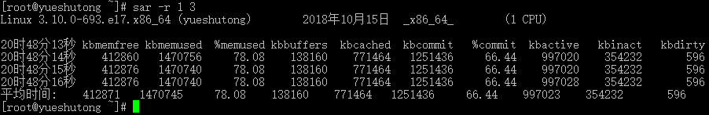


- kbmemfree  空闲的物理内存大小

- kbmemused  使用中的物理内存大小

- %memused 物理内存使用率
- kbbuffers 内核中作为缓冲区使用的物理内存大小，kbbuffers和kbcached:这两个值就是free命令中的buffer和cache. 
- kbcached 缓存的文件大小
- kbcommit  保证当前系统正常运行所需要的最小内存，即为了确保内存不溢出而需要的最少内存（物理内存+Swap分区）
- commit 这个值是kbcommit与内存总量（物理内存+swap分区）的一个百分比的值

## 1.3 vmstat命令

vmstat 和 sar 工具类似，可以指定采样周期、采样频率，统计CPU、内存使用情况、swap使用情况等信息。


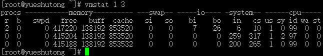


| 字段   | 说明                                                         |
| ------ | ------------------------------------------------------------ |
| Procs  | r：等待运行的进程数<br />b：处于非中断睡眠状态的进程数       |
| Memory | swpd：虚拟内存使用情况，单位：KB <br />free：空闲的内存，单位KB<br />buff：被用来做为缓存的内存数，单位：KB |
| Swap   | si：从磁盘交换到内存的交换页数量，单位：KB/秒 <br />so：从内存交换到磁盘的交换页数量，单位：KB/秒 |
| IO     | bi：发送到块设备的块数，单位：块/秒 <br />bo：从块设备接收到的块数，单位：块/秒 |
| System | in：每秒的中断数，包括时钟中断<br />cs：每秒的环境（上下文）切换次数 |
| CPU    | us：用户CPU 使用时间<br />sy：内核CPU 系统使用时间<br />id：空闲时间 |

## 1.4 iostat命令

iostat可以提供详细的磁盘IO信息。基本使用如下：

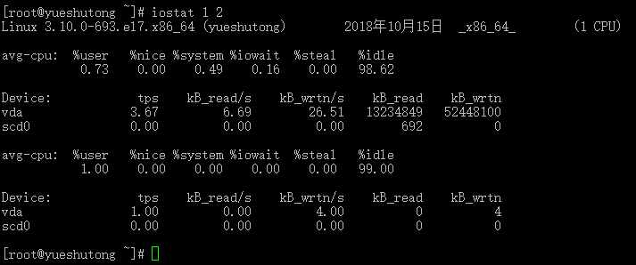

`iostat 1 2` 该命令显示了CPU的使用概况和磁盘IO的信息。输出信息每1秒采样1次，合计采样2次。如果只需要显示磁盘情况，不需要显示CPU使用情况，则可以使用命令：`iostat -d 1 2`

-d 表示输出磁盘使用情况。结果表中，各个列的含义如下：

- tps：该设备每秒的传输次数。
- kB_read/s：每秒从设备读取的数据量。
- kB_wrtn/s：每秒向设备写入的数据量。
- kB_read：读取的总数据量。
- kB_wrtn：写入的总数据量。

如果需要得到更多的统计信息，可以使用-x选项。如：`iostat -x 1 2`

## 1.5 pidstat工具

pidstat是一个性能强大的性能监测工具，它也是sysstat的组件之一。

1）CPU使用率监控

先是通过jps命令找到Java程序的PID，


然后使用pidstat命令输出程序的CPU使用情况。

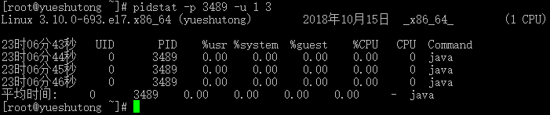


pidstat 的参数-p用于指定进程ID，-u表示对CPU使用率的监控。最后的参数1 3表示每秒钟采样1次，合计采样3次。从这个输出中可以看到，该应用程序CPU占用率达0.00%。pidstat可以进一步监控线程的信息。 使用以下命令：

```
pidstat -p 3489  1 3 -u -t
```

-t 参数将系统性能的监控细化到线程级别。

使用以下命令可以导出指定Java应用程序的所有线程：

```
jstack -l 3489 >/usr/local/t.txt
```

2）I/O使用监控

磁盘I/O也是常见的性能瓶颈之一，使用pidstat也可以监控进程内线程的I/O情况。

在程序运行过程中，使用以下命令监控程序I/O使用情况。其中28475是通过jps命令查询到的进程ID，-d参数表明监控对象为磁盘I/O。1 3表示每秒钟采样一次，合计采样3次。

```
pidstat -p 28475 -d -t 1 3
```

3）内存监控

使用 pidstat 命令。还可以监控指定进程的内存使用情况。


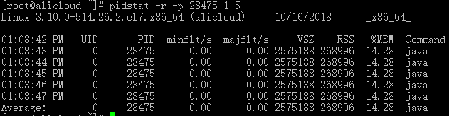


- minflt/s：表示该进程每秒 minor faults（不需要从磁盘中调出内存页）的总数。
- majflt/s：表示该进程每秒 major faults（需要从磁盘中调出内存页）的总数。
- VSZ：表示该进程使用的虚拟内存大小，单位为KB。
- RSS：表示该进程占用的物理内存大小，单位为KB。
- %MEM：表示占用内存比率。

# 2.Windows工具

## 2.1 任务管理器

快捷键 `Ctrl`+ `Alt`+ `.`

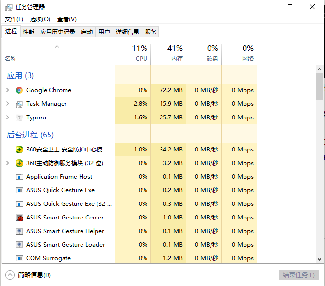

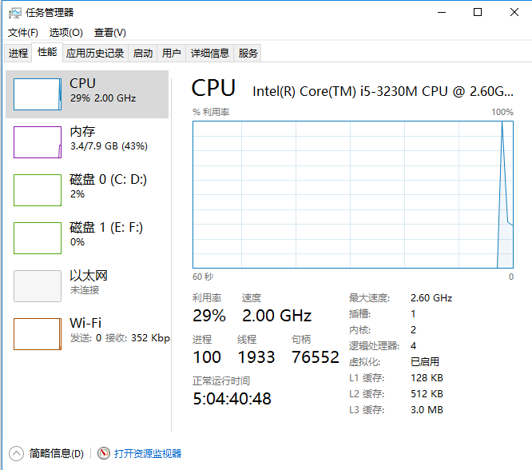

## 2.2 perfmon性能监控工具

可以用于监视[CPU使用率](http://baike.baidu.com/view/990476.htm)、内存使用率、硬盘读写速度、[网络速度](http://baike.baidu.com/view/1065551.htm)等。Perfmon提供了图表化的系统性能实时监视器、性能日志和警报管理，系统的性能日志可定义为二进制文件、文本文件、SQLSERVER表记录等方式，可以很方便地使用第三方工具进行性能分析。perfmon.exe 文件位于C:\Windows\System32目录下。　

快捷键 `win`+ `R`打开运行，输入 perfmon ：

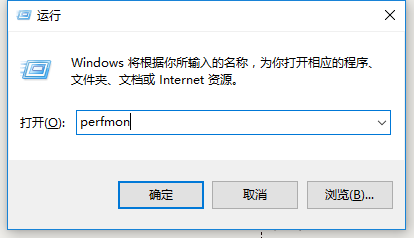


打开性能监控工具

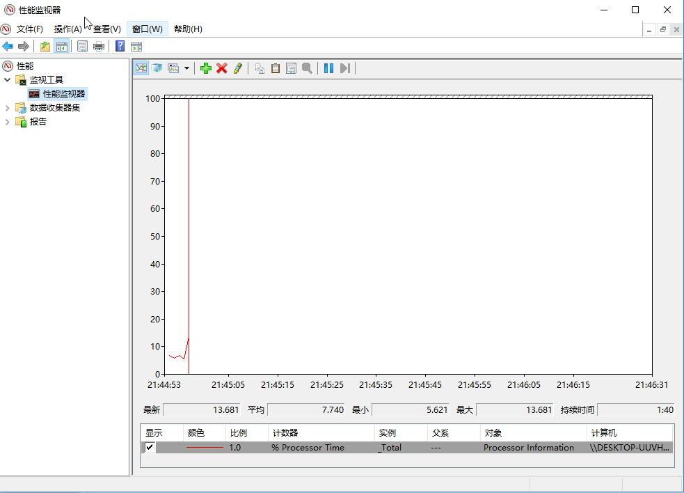


点击绿色的+号添加计数器，Process表示进程，Thread表示线程。

下面我们将对QQ的部分线程进行监控，选中实例，点击添加，确定。

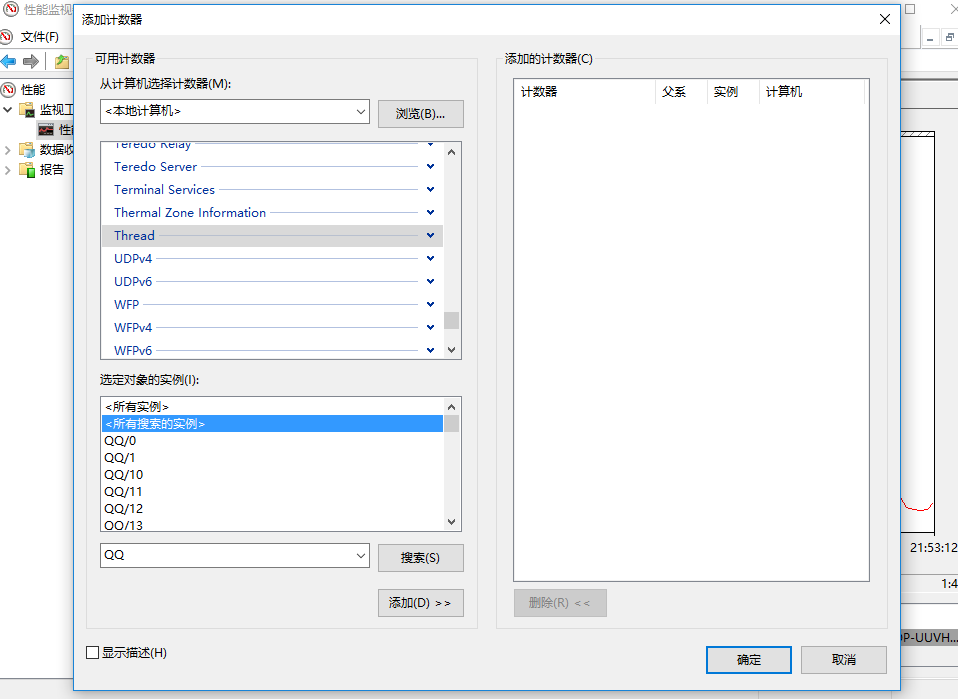


生成报告。可以看到线程ID，占用CPU的多少。

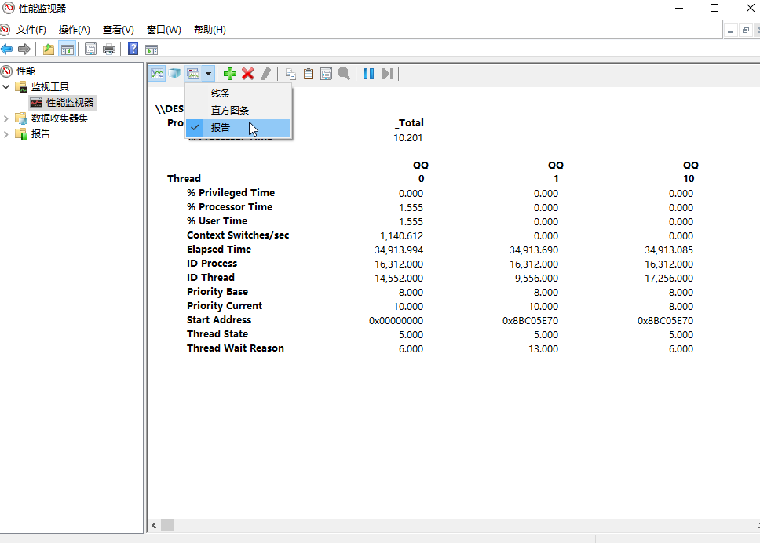


## 2.3 Process Explorer

由Sysinternals开发的Windows系统和应用程序监视工具，目前已并入微软旗下。不仅结合了Filemon（文件监视器）和Regmon（注册表监视器）两个工具的功能，还增加了多项重要的增强功能。包括稳定性和性能改进、强大的过滤选项、修正的进程树对话框（增加了进程存活时间图表）、可根据点击位置变换的右击菜单过滤条目、集成带源代码存储的堆栈跟踪对话框、更快的堆栈跟踪、可在 64位 Windows 上加载 32位 日志文件的能力、监视映像（DLL和内核模式驱动程序）加载、系统引导时记录所有操作等。 

下载地址：https://docs.microsoft.com/zh-cn/sysinternals/downloads/process-explorer

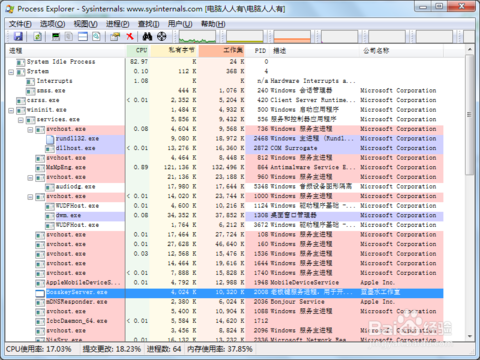

## 2.4 pslist命令行

pslist是一个windows下的命令行工具。

下载地址：https://docs.microsoft.com/en-us/sysinternals/downloads/pslist

基本用法如下：

```
pslist [-d] [-m] [-x] [-t] [-s [n] [-r n] [name|pid]
```

- -d：显示线程详细信息。
- -m：显示内存详细信息。
- -x：显示进程、内存和线程信息。
- -t：显示进程间父子关系。
- -s[n]：进入监控模式。n指定程序运行时间，使用ESC键退出。
- -r n：指定监控模式下的刷新时间，单位为秒。
- name：指定监控的进程名称，pslist将监控所有以给定名字开头的进程。
- -e：使用精确匹配，打开这个开关，pslist将只监控name参数指定的进程。
- pid：指定进程ID。

显示的栏位：

- Pri：优先级
- Thd：线程数
- Hnd：句柄数
- VM：虚拟内存
- WS：工作集
- Priv：专用虚拟内存
- Priv Pk：专用虚拟内存峰值
- Faults：页面错误
- NonP：非页面缓冲池
- ge：页面缓冲池
- Cswtch：上下文切换

# 参考

*《Java程序性能优化》葛一鸣著*
