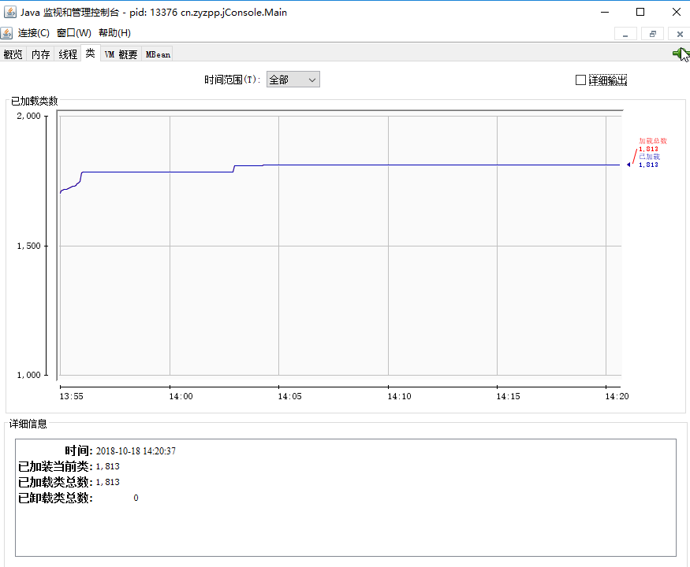

很多资料在介绍JDK命令行工具时并不是在Java8环境下，因此还在使用过时的永久区系列的参数，给一些读者造成困难。

Java8使用Metaspace（元空间）代替永久区，对于64位平台，为了压缩JVM对象中的_klass指针的大小，引入了类指针压缩空间（Compressed Class Pointer Space）  。关于这点，可以参考博客https://blog.csdn.net/liang0000zai/article/details/51168095。

# 1. JDK命令行工具

在JDK的开发包中，除了大家熟知的java.exe和javac.exe外，还有一系列辅助工具。这些工具在JDk安装目录下的bin目录中。如图：


虽然乍看之下，这些工作都是exe的可执行文件。但事实上，它们只是Java程序的一层包装，其真正实现是在 tools.jar 中。


以jps工具为例，在控制台执行jps命令和`java -classpath %Java_HOME%/lib/tools.jar sun.tools.jps.Jps`命令是等价的，即jps.exe只是这个命令的一层包装。

在学习以下命令之前，不妨使用IDEA写个不会退出的小程序，方便测试。示例代码：

```
package cn.zyzpp.jConsole;

import java.text.SimpleDateFormat;
import java.util.Date;

public class Main {
    public static void main(String[] args) throws InterruptedException {
        while (true){
            Thread.sleep(10000);
            //Byte[] bytes = new Byte[1024];
            //bytes = null;
            //System.gc();
            System.out.println(new SimpleDateFormat("yyyy-MM-dd hh:mm:ss").format(new Date()));
        }
    }
}
```

## 1.1 jps命令

命令jps用于列出java进程，直接运行jps不加任何参数，可以列出Java程序的进程ID以及Main函数等名称。


从这个输出中可以看到，当前系统中共存在4个Java应用程序，其中第一个输出jps就是jps命令本身，这个更加证明此命令本质也是一个Java程序。此外，jps还提供了一系列参数来控制它的输出内容。

参数`-q`指定jps只输出进程ID，而不输出类的短名称：


参数`-m`用于输出传递给Java进程（主函数）的参数：


参数 `-l`用于输出主函数的完整路径：


参数 `-v`可以显示传递给JVM的参数：


## 1.2 jstat命令

jstat是一个可以用于观察Java应用程序运行时信息的工具。它的功能非常强大，可以通过它，查看堆信息的详细使用情况。它的基本使用语法为：

```
jstat -<option> [-t] [-h<lines>] <vmid> [<interval>] [<count>]
```

选项option可以由以下值构成：

- -class：显示ClassLoader的相关信息。
- -compiler：显示JIT编译的相关信息。
- -gc：显示与GC相关的堆信息。
- -gccapacity：显示各个代的容量及使用情况。
- -gccause：显示垃圾收集相关信息（同-gcutil），同时显示最后一次或当前正在发生的垃圾收集的诱发原因。
- -gcnew：显示新生代信息。
- -gcnewcapacity：显示新生代大小与使用情况。
- -gcold：显示老年代与永久代的信息。
- -gcoldcapacity：显示老年代的大小。
- -gcmetacapacity：显示元空间的大小。（*在java8之前是使用-gcpermcapacity显示永久代的大小*）
- -gcutil：显示垃圾收集信息。
- -printcompilation：输出JIT编译的方法信息。

以上选项可以输入 `jstat -options` 查看。

-t 参数可以在输出信息前加一个 Timestamp 列，显示程序的运行时间。

-h 参数可以在周期性数据输出时，输出多少行数据后，跟着输出一个表头信息。

vmid 参数就是Java进程id。

interval 参数用于指定输出统计数据的周期，单位为毫秒。

count 用于指定一共输出多少次数据。

**示例**

### 1.2.1 -class

输出java进程13516的ClassLoader相关信息。每秒钟统计一次信息，一共输出2次：


在-class的输出中，Loaded 表示载入了类的数量，Bytes表示载入类的合计大小（KB），Unloaded 表示卸载类的数量，第2个Bytes表示卸载类的大小，Time表示在加载和卸载类上所花的时间。

### 1.2.2 -compiler

下例显示了查看JIT编译的信息：


Compiled 表示编译任务执行的次数，Failed表示编译失败的次数，Invalid 表示编译不可用的次数，Time 表示编译后的总耗时，FailedType 表示最后一次编译失败的类型，FailedMethod 表示最后一次编译失败的类名和方法名。

### 1.2.3 -gc

下例显示了与GC相关的堆信息的输出：


各项参数的含义如下：

- S0C：s0（from）的大小（KB）。
- S1C：s1（from）的大小（KB）。
- S0U：s0（from）已使用的空间（KB）。
- S1U：s1(from)已经使用的空间(KB)
- EC：eden区的大小(KB)
- EU：eden区已经使用的空间(KB)
- OC：老年代大小(KB)
- OU：老年代已经使用的空间(KB)
- MC：元空间的大小（Metaspace）（KB）
- MU：元空间已使用大小（KB）
- CCSC：压缩类空间大小（*compressed class space*）（KB）
- CCSU：压缩类空间已使用大小（KB）
- YGC：新生代gc次数
- YGCT：新生代gc耗时（秒）
- FGC：Full gc次数
- FGCT：Full gc耗时（秒）
- GCT：gc总耗时（秒）

### 1.2.4 -gccapacity

下例显示了各个代的信息，与-gc相比，它不仅输出了各个代的当前大小，也包含了各个代的最大值和最小值。


各参数含义：

- NGCMN：新生代最小（初始化）容量（字节）
- NGCMX：新生代最大容量（字节）
- NGC：当前新生代容量（字节）
- OGCMN：老年代最小容量（字节）
- OGCMX：老年代最大容量（字节）
- MCMN：metaspace(元空间)中初始化(最小)的大小 (字节)
- MCMX ：metaspace(元空间)的最大容量 (字节)
- CCSMN：最小压缩类空间大小（字节）
- CCSMX：最大压缩类空间大小（字节）

### 1.2.5 -gccause

下列显示了最近一次GC的原因以及当前GC的原因：


各项参数如下：

- LGCC：上次GC的原因。
- GCC：当前GC的原因。

### 1.2.6 -gcnew

-gcnew 参数用于查看新生代的一些详细信息：


各项参数的含义如下：

- TT：新生代对象晋升到老年代对象的年龄。
- MTT：新生代对象晋升到老年代对象的年龄最大值。
- DSS：所需的survivor区大小。

### 1.2.7 -gcnewcapacity

-gcnewcapacity 参数可以详细输出新生代各个区的大小信息：


各项参数的含义如下：

- S0CMX：s0区的最大值（KB）。
- S1CMX：s1区的最大值（KB）。
- ECMX：eden区的最大值（KB）。

### 1.2.8 -gcold

-gcold 可以用于展现老年代GC的概况。


### 1.2.9 -gcoldcapacity

-gcoldcapacity 用于展现老年代的容量信息：


### 1.2.10 -gcmetacapacity与-gcpermcapacity

-gcpermcapacity 用于展示永久区的使用情况，但是在Java8环境下使用会报错找不到。因为java8的永久区被元空间取而代之。所以要使用 -gcmetacapacity：


### 1.2.11 -gcutil

-gcutil 用于展示GC回收相关信息：


各项参数如下：

- S0：s0区使用的百分比。
- S1：s1区使用的百分比。
- E：eden 区使用的百分比。
- O：old区使用的百分比。
- M：元空间使用的百分比。
- CCS：压缩类空间使用的百分比。

## 1.3 jinfo命令

jinfo 可以用来查看正在运行的Java运行程序的扩展参数，甚至支持在运行时修改部分参数。它的基本语法为：

```
jinfo <option> <pid>
```

其中option可以为以下信息：

* -flag<name>: 打印指定java虚拟机的参数值。 
* -flag [+|-]< name >：设置或取消指定java虚拟机参数的布尔值。 
* -flag < name >=< value >：设置指定java虚拟机的参数的值。
在很多情况下，Java应用程序不会指定所有的JVM参数。而此时，开发人员可能不知道某一个具体的JVM参数的默认值。有了 jinfo 工具，开发人员可以很方便地找到JVM参数的当前值。

1）下例显示了新生代对象晋升到老年代对象的最大年龄。在应用程序运行时并没有指定这个参数，但是通过jinfo，可以查看这个参数的当前的值。  


2）显示是否打印GC详细信息。


3）修改部分参数的值，下面是对PrintGCDetails参数的修改。


## 1.4 jmap命令

jmap 可以生成Java应用程序的堆快照和对象的统计信息。基本语法为：

```
jmap [option] vmid
```

option 选项如下：


| 选项           | 作用                                                         |
| -------------- | ------------------------------------------------------------ |
| -dump          | 生成java堆转储快照。格式为： -dump:[live,]format=b,file=\<filename>,其中live子参数说明是否只dump出存活的对象 |
| -finalizerinfo | 显示在F-Queue中等待Finalizer线程执行finalize方法的对象。只在Linux/Solaris平台下有效 |
| -heap          | 显示java堆详细信息，如使用哪种收集器、参数配置、分代情况等，在Linux/Solaris平台下有效 |
| -histo         | 显示堆中对象统计信息，包含类、实例对象、合集容量             |
| -permstat      | 以ClassLoader为统计口径显示永久代内存状态。只在Linux/Solaris平台下有效 |
| -F             | 当虚拟机进程对-dump选项没有相应时。可使用这个选项强制生成dump快照。只在Linux/Solaris平台下有效 |


下例使用jmap生成PID为9440的Java应用程序的对象统计信息，并输入到 s.txt 文件中。

```
jmap -histo 9440 >c:\s.txt
```

输出文件有如下结构：


可以看到，这个输出显示了内存中的实例数量和合计。

另一个更为重要的功能是得到Java程序的当前堆快照：


本例中，将应用程序的堆快照输出到E盘的heap.bin文件中。之后，可以通过多种工具分析文件。比如，下文中提到的jhat工具。也可以使用 Visual VM工具打开这个快照文件。

## 1.5 jhat命令

使用 jhat 工具可以用于分析Java应用程序的堆快照内容。以前文中jmap的输出对文件 heap.hprof 为例：


jhat 在分析完成后，使用HTTP服务器展示其分析结果。在浏览器中访问http://localhost:7000/，结果如图所示。


在默认页中，jhat 服务器显示了所有的非平台类信息。单击链接进入，可以查看选中类的超类、ClassLoader 以及该类的实例等信息。此外，在页面底部，jhat还为开发人员提供了其他查询方式（Other Queries）。

通过这些链接，开发者可以进一步查看所有类信息（包括Java平台的类）。所有类的实例数量以及实例的具体信息。最后，还有一个链接指向OQL查询界面。

图中显示了在jhat中，查看Java应用程序里java.lang.String类的实例数量：


单击 instances 链接可以进一步查看 String 对象的实例，如图所示：


通常，导出的堆快照信息可以非常大，由于信息太多，可能很难通过页面上简单的链接索引找到想要的信息。为此，jhat还支持使用OQL语句对堆快照进行查询。执行 OQL 语言的界面非常简洁，如图所示。使用OQL查询出当前Java程序中所有java.io.File对象的路径。OQL如下：

```
select file.path.value.toString() from java.io.File file
```


## 1.6 jstack命令

jstack 可用于导出Java应用程序的线程堆栈。语法为：

```
jstack [-l] <pid>
```

-l选项用于打印锁的附加信息。

jstack 工具会在控制台输出程序中所有的锁信息，可以使用重定向将输出保存到文件，如：

```
jstack -l 16196 >e\deadlock.txt
```

通过 jstack 工具不仅可以得到线程堆栈，它还能自动进行死锁检查，输出找到的死锁信息。

## 1.7 jstatd命令

之前所述的工具中，只涉及到监控本机的Java应用程序。而在这些工具中，一些监控工具也支持对远程计算机的监控（如：jps、jstat）。为了启用远程监控，则需要配合使用jstatd工具。

命令jstatd是一个RMI服务端程序，它的作用相当于代理服务器，建立本地计算机与远程监控工具的通信。jstatd服务器将本机的Java应用程序信息传递到远程计算机。


直接打开jstatd服务器可能会抛出访问拒绝异常：


这是由于jstatd程序没有足够的权限所致，可以使用Java的安全策略，为其分配相应的权限，下面代码为jststd分配了最大的权限，将其保存在jstatd.all.policy文件中：

```
grant codebase "file:${java.home}/../lib/tools.jar" {
permission java.security.AllPermission;
};
```

然后，使用以下命令再次开启jstatd服务器：

```
 jstatd -J-Djava.security.policy=c:\jstatd.all.policy
```

服务器即可开启成功。

> -J参数是一个公共的参数，如jps、jstat等命令都可以接受这个参数。由于jsp、jstat命令本身也是Java应用程序，-J参数可以为jps等命令本身设置其JVM参数。

默认情况下，jstatd 将在1099端口开启RMI服务器：


使用jps命令显示远程计算机的Java进程：

```
jps localhost:1099
```

使用jstat命令显示远程进程460的GC情况：

```
jstat -gcutil 460@localhost:1099
```

## 1.8 hprof工具

hprof不是独立的监控工具，它只是一个Java agent工具，它可以用于监控Java应用程序在运行时的CPU信息和堆信息。使用 `java -agentlib:hprof=help` 命令可以查看hprof 的帮助文档。下面是 hropf 工具帮助信息的输出：


使用hprof工具可以查看程序中各个函数的CPU占用时间。以下代码包含3个方法，分别占用不同的CPU时间：

```
public class HProfTest {
    public void slowMethod(){
        try {
            Thread.sleep(1000);
        } catch (InterruptedException e) {
            e.printStackTrace();
        }
    }

    public void slowerMethod(){
        try {
            Thread.sleep(10000);
        } catch (InterruptedException e) {
            e.printStackTrace();
        }
    }

    public void fastMethod(){
        try {
            Thread.yield();
        } catch (Exception e) {
            e.printStackTrace();
        }
    }

    public static void main(String[] args) {
        HProfTest hProfTest = new HProfTest();
        hProfTest.fastMethod();
        hProfTest.slowMethod();
        hProfTest.slowerMethod();
    }
}
```

使用参数-agentlib:hprof=cpu=times,interval=10运行以上代码。times选项将会在Java函数的调用前后记录函数的执行时间，进而计算函数的执行时间。hprof=cpu是针对cpu统计时间。interval=10 采样10次。程序运行后会发现多了一个文本文件java.hprof.txt，打开后查看部分输出如下，可以很容易看到运行时间最长的函数：


使用参数-agentlib:hprof=heap=dump,format=b,file=e:\core.hprof 运行程序，可以将应用程序的堆快照保存在指定文件 e:\core.hprof 中。使用MAT或者Visual VM等工具可以拆这个堆文件。

使用参数 -agentlib:hprof=heap=sites 运行程序，可以输出Java应用程序中各个类所占的内存百分比，部分输出如下：


# 2.JConsole工具

 JConsole（Java Monitoring and ManagementConsole）工具时JDK自带的图形化性能监控工具。通过JConsole工具，可以查看Java应用程序的运行概况，监控堆信息、永久区使用情况、类加载情况等。本节主要介绍JConsole工具的基本使用方法。

## 2.1 JConsole连接Java程序

JConsole 程序在%JAVA_HOME%/bin目录下，双击启动后，程序便要求指定连接Java应用程序，如图所示。


在罗列的本地Java应用程序选择PID为15908的程序，连接。

如果需要使用JConsole连接远程进程，则需要在远程Java应用程序启动时，加上如下参数：

```
-Djava.rmi.server.hostname=127.0.0.1       #远程服务器的ip地址
-Dcom.sun.management.jmxremote
-Dcom.sun.management.jmxremote.port=8888   #指定jmx监听的端口
-Dcom.sun.management.jmxremote.authenticate=false  #是否开启认证
-Dcom.sun.management.jmxremote.ssl=false   #是否开启ssl
```

基于以上配置启动的Java应用程序，通过JConsole在远程连接时，只需要填写如下远程进程即可：

```
127.0.0.1:8888
```

## 2.2 Java程序概况

在连接上Java应用程序后，便可以查看应用程序概况。


## 2.3 内存监控

切换到内存监控页面，JConsole 可以显示当前内存的详细信息。这不仅是包括堆内存的整体信息，更细化到eden区、survivior 区、老年代的使用情况。同时，也包括非堆区，即永久代的使用情况，如图所示，单机界面右上角的“执行GC”按钮，可以强制应用程序进行一次Full GC。


## 2.4 线程监控

JConsole 中的线程选项卡允许开发人员监控程序内的线程，如图所示。JConsole 显示了系统内的线程数量，并在屏幕下方，显示了程序中所有的线程。单击线程名称，便可以查看线程的栈信息。


使用最下方的“监测死锁”按钮。还可以自动监测多线程应用程序的死锁情况。

## 2.5 类加载情况

JConsole的类页面如图所示，显示了系统以及装载的类数量。在详细信息栏中，还显示了已卸载的类数量。




## 2.6 虚拟机信息

在VM摘要页面，JConsole 显示了当前应用程序的运行环境。包括虚拟机类型、版本、堆信息以及虚拟机参数等。


## 2.7 MBean管理

MBean页面允许通过JConsole进行MBean的管理，包括查看或者设置MBean的属性、运行MBean的方法等。下图是MBean的管理界面，这里选中了Memory的Verbose属性。通过修改Verbose的属性值，可以在程序运行时动态打开或者关闭GC的输出信息。


MBean种类繁多。主要的操作如下：


## 2.8 使用插件

除了基本功能之外，JConsole还支持插件扩展。在JDK的安装目录下，就有一个自带的JConsole插件。使用以下命令可以让JConsole加载插件并启动：

```
jconsole -pluginpath C:\Java\jdk1.6.0_22\demo\management\JTop\JTop.jar
```

JConsole启动后，连接到任意Java应用程序，便可以进入JTop页面。

# 参考

*《Java程序性能优化》葛一鸣著*


