# 1.Visual VM多合一工具

Visual VM是一个功能强大的多合一故障诊断和性能监控的可视化工具，它集成了多种性能统计工具的功能，使用 Visual VM 可以代替jstat、jmap、jhat、jstack甚至是JConsole。在JDK 6 Update 7以后，Visual Vm便作为JDK的一部分发布，它完全免费。

官方下载：[https://visualvm.github.io/download.html](https://visualvm.github.io/download.html)

中文汉化版：[https://download.csdn.net/download/yueshutong123/10729777](https://download.csdn.net/download/yueshutong123/10729777)

Visual VM插件的安装非常容易，既可以通过离线下载插件*.nbm。然后在 PLugin 对话框的Downloaded页面下，添加已下载的插件。也可以在Availble Plugin页面下，在线安装插件，如图所示。

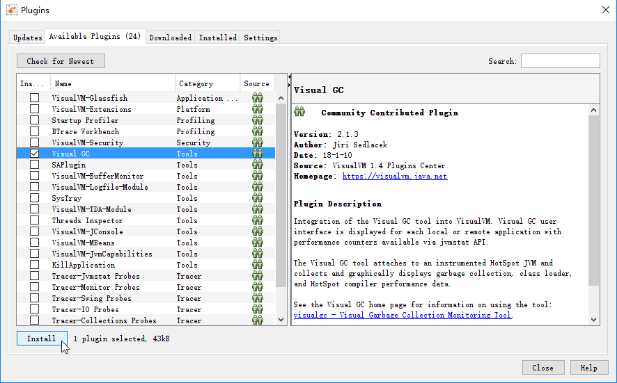

若是启动VisualVm.exe报错：Can'nt find java1.8 or or higher ,只需要编辑\etc\visualvm.conf文件，找到下面这行并重新指向本地Java路径即可。

```
visualvm_jdkhome="D:\Java\jdk1.8.0"
```

汉化版的插件地址已过时，点击“插件”->“设置”->“编辑”，更换URL为https://visualvm.github.io/archive/uc/release138/updates.xml.gz

插件地址汇总：[https://visualvm.github.io/pluginscenters.html](https://visualvm.github.io/pluginscenters.html)

## 1.1 Visual VM连接应用程序

1）Visual VM支持多种连接应用程序，最常见的就是本地连接。只要本地计算机内有Java应用程序正在执行，就可以监测到。如图所示。

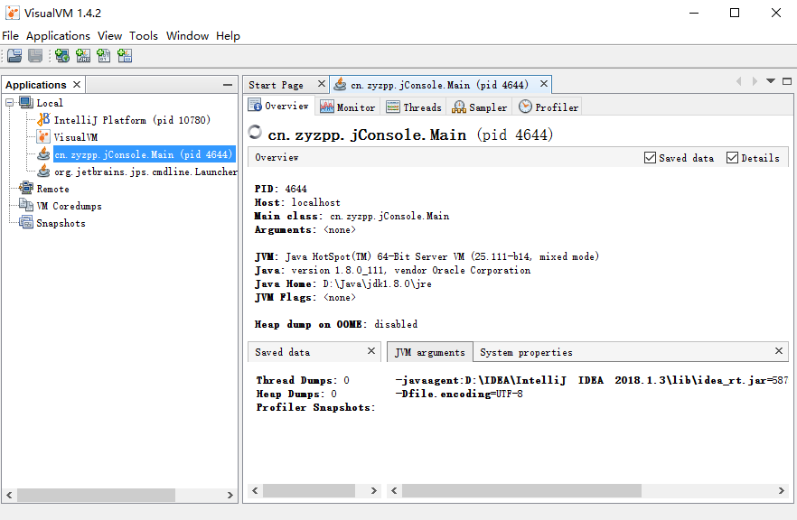

2）除了本地连接外，Visual VM也支持远程JMX连接。Java应用程序可以通过以下参数启动程序打开JMX端口：

```
-Djava.rmi.server.hostname=127.0.0.1       #远程服务器的ip地址
-Dcom.sun.management.jmxremote
-Dcom.sun.management.jmxremote.port=8888   #指定jmx监听的端口
-Dcom.sun.management.jmxremote.authenticate=false  #是否开启认证
-Dcom.sun.management.jmxremote.ssl=false   #是否开启ssl
```

添加JMX连接

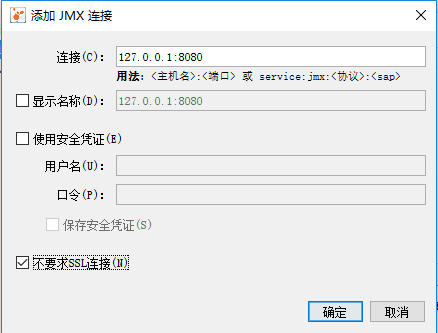


添加成功后

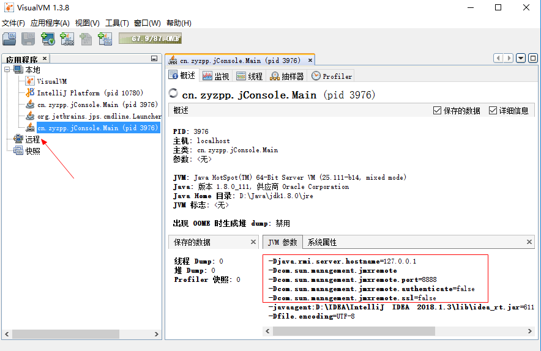


3）添加远程主机。远程主机可以通过jstatd工具建立，如使用以下命令开启

```
 jstatd -J-Djava.security.policy=c:\jstatd.all.policy
```

文本文件jstatd.all.policy的内容为：

```
grant codebase "file:${java.home}/../lib/tools.jar" {
permission java.security.AllPermission;
};
```

接着在Visual VM中添加远程主机，如图。正确填写计算机IP地址。

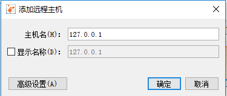


## 1.2 监控应用程序概况

通过Visual VM，可以查看应用程序的基本情况。比如，进程ID、Main Class、启动参数等。

单机Tab页面的Monitor页面，即可监控应用程序的CPU、堆、永久区、类加载和线程数的总体情况。通过页面上的Perform GC 和 Heap Dump按钮还可以手工执行Full GC和生成堆快照。

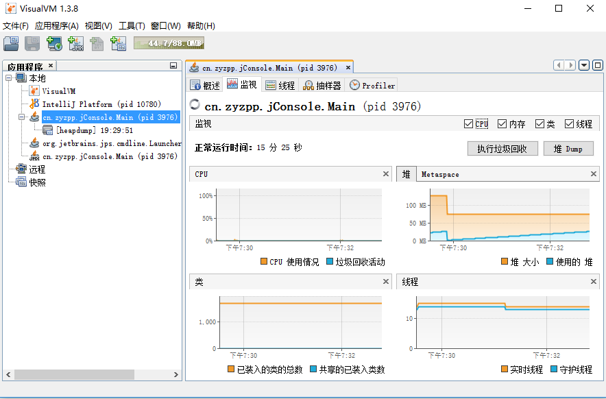


## 1.3 Thread Dump和分析

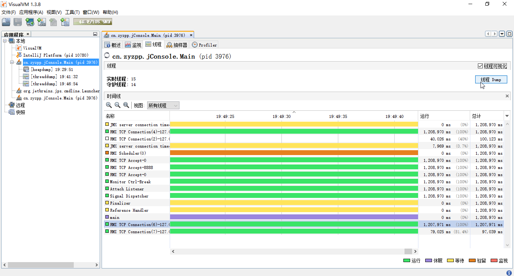


## 1.4 性能分析

Visual VM有CPU和内存两个采样器。

编写测试程序：

```
public class HProfTest {
    public void slowMethod(){
        try {
            Thread.sleep(1000);
        } catch (InterruptedException e) {
            e.printStackTrace();
        }
    }

    public void slowerMethod(){
        try {
            Thread.sleep(10000);
        } catch (InterruptedException e) {
            e.printStackTrace();
        }
    }

    public void fastMethod(){
        try {
            Thread.yield();
        } catch (Exception e) {
            e.printStackTrace();
        }
    }

    public static void main(String[] args) {
        while (true) {
            HProfTest hProfTest = new HProfTest();
            hProfTest.fastMethod();
            hProfTest.slowMethod();
            hProfTest.slowerMethod();
        }
    }
}
```

通过Visual VM的采样功能，可以找到占用CPU时间最长的方法。如图slowerMethod()方法占用时间最长。

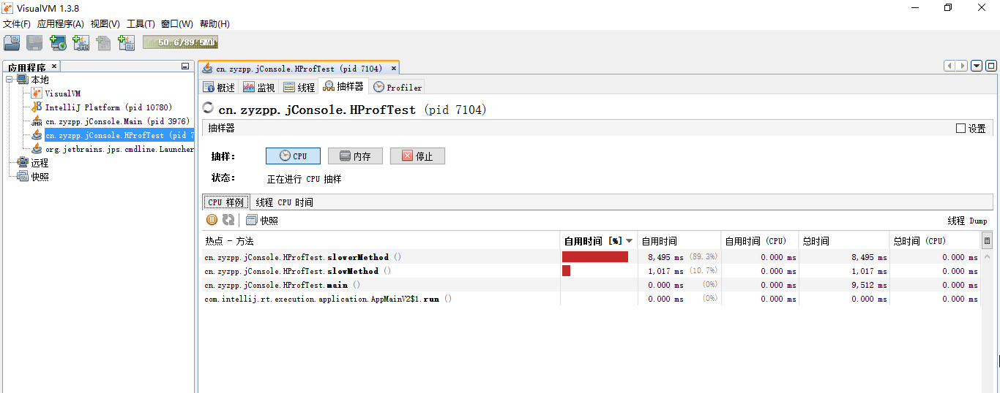


在Visual VM的默认统计信息中，不包含JDK内的函数调用统计，需要单击右上角的设置，手工配置。如图。

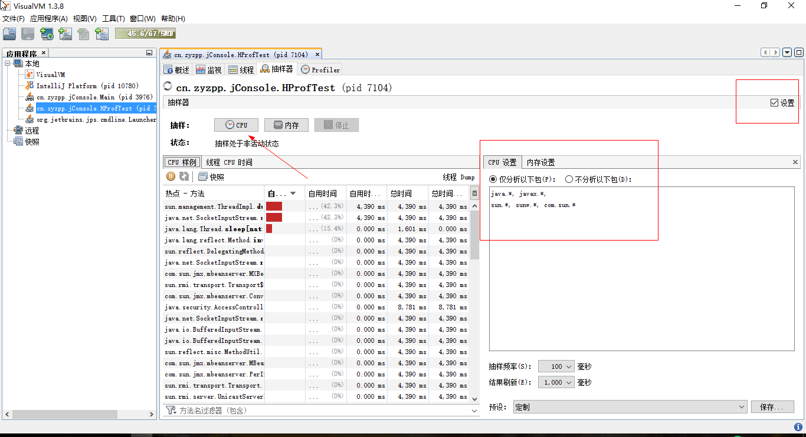


## 1.5 快照

选中java应用，单击应用程序，即可查看堆Dump，线程Dump等。

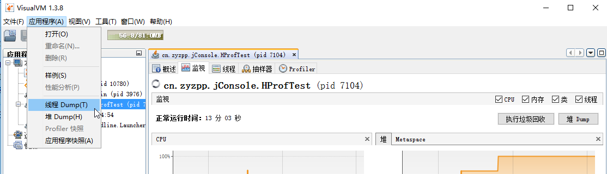


右击dump快照，可另存为。

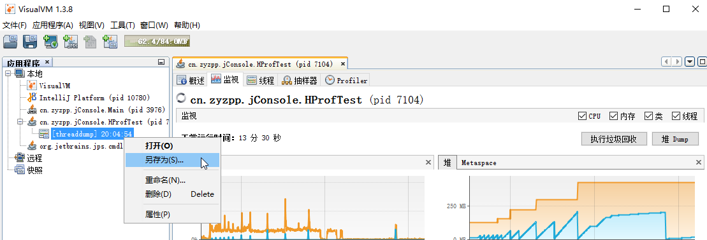


## 1.6 内存快照分析

通过选中右键的堆Dump命令，可以立即获得当前应用程序的内存快照，如图。

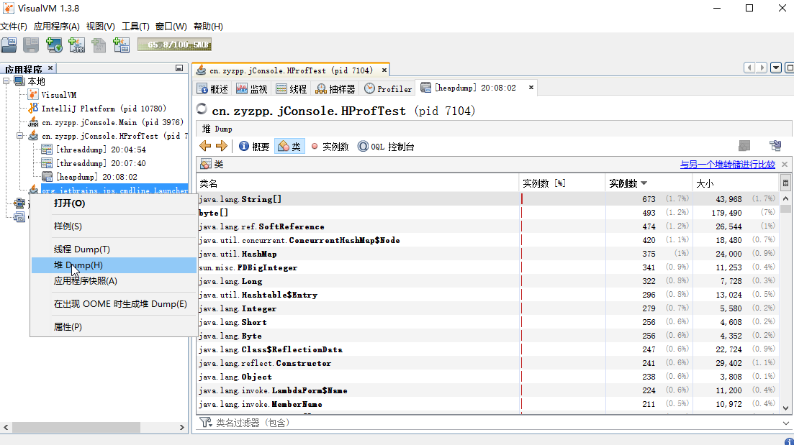


在类页面中，还可以对两个不同的内存快照文件进行比较。这个功能可以帮助开发者快速分析同一应用程序运行的不同时刻，内存数据产生的变化。

在这个类展示的页面中，如果需要获取类的更多信息，可以单击右键，进入该类的实例页面；或者直接双击。

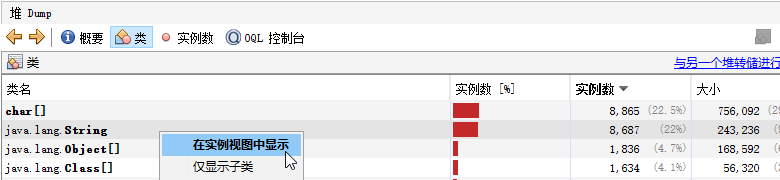


在实例页面中，将显示类的所有实例。

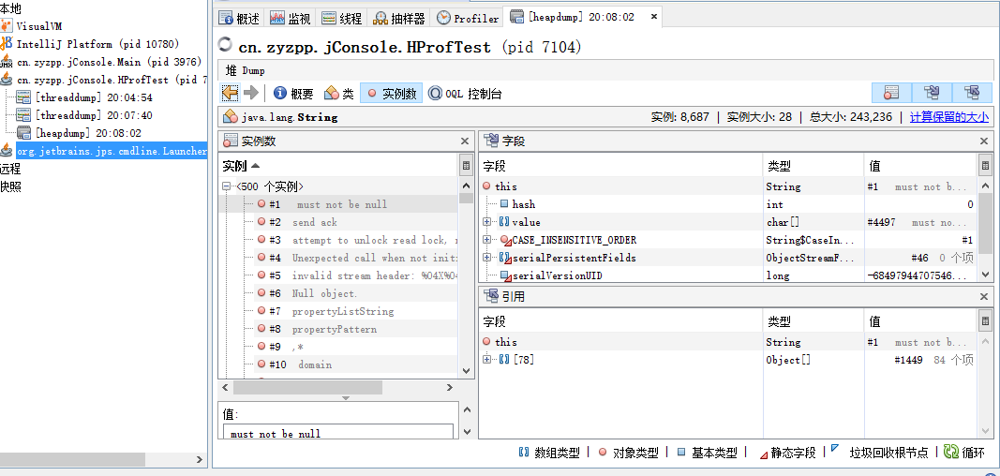


## 1.7 MBean管理

Visual VM可以通过插件，集成JConsole的MBean管理功能。
关于JConsole MBean的使用请参考另一篇博客：[/](/)

## 1.8 TDA使用

TDA 是Thread Dump Analyzer 的缩写，是一款线程快照分析工具。当使用jstack或者Visual VM等工具取得线程快照文件后，使用TDA可以帮助开发者分析导出的线程快照。TDA即是一款单独的软件，又是Visual VM的插件。当作为插件时，导出快照后，TDA会自启动。

## 1.9 BTrace介绍

BTrace 通过字节码注入，动态监控系统的运行情况。它可以跟踪指定的方法调用、构造函数调用和系统内存等信息。在Visual VM中安装插件BTrace后，右击Java程序打开Trece application。如图。


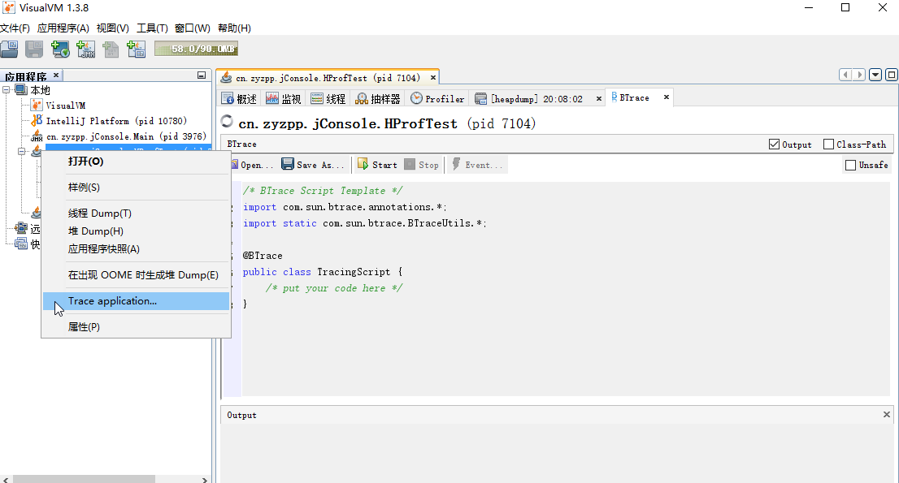


BTrace脚本示范：

```
@BTrace
public class TimeLogger {

  @TLS 
  private static long startTime = 0;

 @OnMethod(clazz="/.+/", //监控任意类
  method="/slowMethod/")	//监控slowMethod方法
  public static void startMethod(){
    startTime = timeMillis();
  }

  @OnMethod(clazz="/.+/",method="/slowMethod/",location=@Location(Kind.RETURN))//方法返回时触发
  public static void endMethod(){
    long time = timeMillis() - startTime;
    println(strcat("execute time(nanos): ", str(time)));
  }

}
```

以上脚本使用@OnMethod注释指定要监控的类和方法名称。@Location注释，可以指定程序运行到某一行代码时，触发某一行为。

@OnMethod(clazz="/.+/", location=@Location(Kind.LINE, line=26))

定时触发(ms)

@OnMethod 更换为 @OnTimer(3000)

监控参数

```
 public static void endMethod(@ProbeClassName String pcn, @ProbeMethodName String pmn, AnyType[]  args){
	//pcn 类名称

	//pmn 方法名称

	//args 参数

  }
```

监控文件

method="\<init>"  //监控构造函数

# 2.Visual VM对OQL的支持

上面我们学会了如何查看堆内存快照，但是，堆内存快照十分庞大，快照中的类数量也很多。Visual VM提供了对OQL（对象查询语言）的支持，以便于开发人员在庞大的堆内存数据中，快速定位所需的资源。

## 2.1 Visual VM的OQL基本语法

OQL 语言是一种类似SQL的查询语言。基本语法如下：

```
select <JavaScript expression to select>
[ from [instanceof] <class name> <identifier>
[ where <JavaScript boolean expression to filter> ] ]
```

OQL由3个部分组成：select 子句、from 子句和where 子句。select 子句指定查询结果要显示的内容；from 子句指定查询范围，可指定类名，如java.lang.String、char[]、[Ljava.io.File（File数组）;where 子句用于指定查询条件。

select 子句和where 子句支持使用Javascript 语法处理较为复杂的查询逻辑；select 子句可以使用类似json的语法输出多个列；from子句中可以使用instanceof关键字，将给定类的子类也包括到输出列表中。

在Visual VM的OQL中，可以直接访问对象的属性和部分方法。如下例中，直接使用了String对象的count属性，筛选出长度大于等于100的字符串：

```
select s from java.lang.String s where s.count >= 100
```

选取长度大于等于256的 int 数组：

```
select a from int[] a where a.length >= 256
```

筛选出表示两位数整数的字符串：

```
select {instance: s, content: s.toString()} from java.lang.String s where /^\d{2}$/(s.toString())
```

上例中，select 子句使用了json语法，指定输出两列为String对象以及String.toString() 的输出。where 子句使用正则表达式，指定了符合/^\d{2}$/条件的字符串。

下例使用 instance 关键字选取所有的ClassLoader，包括子类：

```
select cl from instanceof java.lang.ClassLoader cl;
```

由于在Java程序中，一个类可能会被多个ClassLoader同时载入，因此，这种情况下，可能需要使用Class的ID来指定Class。如下例，选出了所有ID为0x37A014D8的Class对象实例。

```
select s from 0x37A014D8 s;
```

> Visual VM 的 OQL 语言支持Javascript作为子表达式。

## 2.2 内置heap对象

heap对象是 Visual VM OQL 的内置对象。通过 heap 对象可以实现一些强大的OQL功能。heap 对象的主要方法如下：

- forEachClass()：对每一个Class对象执行一个回调操作。它的使用方法类似于 heap.forEachClass(callback)，其中 callback 为 Javascript 函数。
- findClass()：查找给定名称的类对象，返回类的方法和属性参考表6.3.它的调用方法类似 heap.findClass(className)。
- classes()：返回堆快照中所有的类集合。使用方法如 heap.classes()。
- objects()：返回堆快照中所有的对象集合。使用方法如 heap.objects(clazz,[includeSubtypes],[filter])，其中clazz指定类名称，includeSubtypes指定是否选出子类，filter 为过滤器，指定筛选规则。includeSubtypes 和 filter 可以省略。
- livepaths()：返回指定对象的存活路径。即，显示哪些对象直接或者间接引用了给定对象。它的使用方法如heap.livepaths(obj)。
- roots()：返回这个堆的根对象。使用方法如heap.roots()。

使用findClass()返回的Class对象拥有的属性和方法 ：

| 属性                            | 方法                                 |
| ------------------------------- | ------------------------------------ |
| name：类名称                    | isSubclassOf()：是否是指定类的子类   |
| superclass：父类                | isSuperclassOf()：是否是指定类的父类 |
| statics：类的静态变量的名称和值 | subclasses()：返回所有子类           |
| fields：类的域信息              | superclasses()：返回所有父类         |

下例查找java.util.Vector类：

```
select heap.findClass("java.util.Vector") 
```

查找java.util.Vector的所有父类：

```
select heap.findClass("java.util.Vector").superclasses() 
```

输出结果如下：

```
java.util.AbstractList  
java.util.AbstractCollection  
java.lang.Object 
```

查找所有在java.io包下的对象：

```
select filter(heap.classes(), "/java.io./(it.name)") 
```

查找字符串“56”的引用链：

```
select heap.livepaths(s) from java.lang.String s where s.toString()=='56' 
```

如下是一种可能的输出结果，其中java.lang.String#1600即字符串“56”。它显示了该字符串被一个WebPage对象持有。

```
java.lang.String#1600->geym.zbase.ch7.heap.WebPage#57->java.lang.Object[]#341->java.util.Vector#11->geym.zbase.ch7.heap.Student#3 
```

查找这个堆的根对象：

```
select heap.roots() 
```

下例查找当前堆中所有java.io.File对象实例，参数true表示java.io.File的子类也需要被显示：

```
select heap.objects("java.io.File",true) 
```

下例访问了TraceStudent类的静态成员webpages对象：

```
select heap.findClass("geym.zbase.ch7.heap.TraceStudent").webpages 
```

## 2.3  对象函数

在Visual VM中，为OQL语言还提供了一组以对象为操作目标的内置函数。通过这些函数，可以获取目标对象的更多信息。本节主要介绍一些常用的对象函数。

### 1．classof()函数

返回给定Java对象的类。调用方法形如classof(objname)。返回的类对象有以下属性。

- name：类名称。

- superclass：父类。

- statics：类的静态变量的名称和值。

- fields：类的域信息。

Class对象拥有以下方法。

- isSubclassOf()：是否是指定类的子类。

- isSuperclassOf()：是否是指定类的父类。

- subclasses()：返回所有子类。

- superclasses()：返回所有父类。

下例将返回所有Vector类以及子类的类型：

```
select classof(v) from instanceof java.util.Vector v 
```

一种可能的输出如下：

```
java.util.Vector  
java.util.Vector  
java.util.Stack 
```

### 2．objectid()函数

objectid()函数返回对象的ID。使用方法如objectid(objname)。

返回所有Vector对象（不包含子类）的ID：

```
select objectid(v) from  java.util.Vector v 
```

### 3．reachables()函数

reachables()函数返回给定对象的可达对象集合。使用方法如reachables(obj,[exclude])。obj为给定对象，exclude指定忽略给定对象中的某一字段的可达引用。

下例返回'56'这个String对象的所有可达对象：

```
select reachables(s) from java.lang.String s where s.toString()=='56'
```

它的部分输出如下：

```
char[]#264
```

这里的返回结果是 java.lang.String.value 域的引用对象。即，给定的 String 类型的 value 域指向对象 char[]#264。如果使用过滤，要求输出结果中不包含 java.lang.String.value 域的引用对象，代码如下：

```
select reachables(s, "java.lang.String.value") from java.lang.String s where s.toString()=='56'
```

以上查询输出结果为空，因为String对象只有value包含对其它对象的引用。

### 4．referrers()函数

返回引用给定对象的对象集合。使用方法如：referrers(obj)。

下例返回了引用“56”String对象的对象集合：

```
select referrers(s) from java.lang.String s where s.toString()=='56'
```

它的输出可能如下：

```
java.lang.Object[]#1077
java.lang.Object[]#1055
```

这说明一个Object数组引用了“56”这个字符串对象。在查询结果中单击 java.lang.Object[]#1077，可进一步找到引用 java.lang.Object[]#1077 对象的是一个ArrayList对象。如图所示。

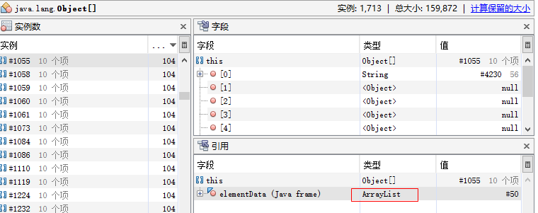


下例找出长度为2，并且至少被2个对象引用的字符串：

```
select s.toString() from java.lang.String s where (s.count==2 && count(referrers(s)) >=2)
```

注意：where子句中使用的逻辑运算符是&&。这是JavaScript语法，不能像SQL一样使用AND操作符。

###  5．referees()函数

referees()函数返回给定对象的直接引用对象集合，用法形如：referees(obj)。

下例返回了File对象的静态成员引用：

```
select referees(heap.findClass("java.io.File")) 
```

下例返回长度为2，并且至少被2个对象引用的字符串的直接引用：

```
select referees(s) from java.lang.String s where (s.count==2 && count(referrers(s)) >=2 )
```

### 6．sizeof()函数

sizeof()函数返回指定对象的大小（不包括它的引用对象），即浅堆（Shallow Size）。

注意：sizeof()函数返回对象的大小不包括对象的引用对象。因此，sizeof()的返回值由对象的类型决定，和对象的具体内容无关。

下例返回所有int数组的大小以及对象：

```
select {size:sizeof(o),Object:o} from int[] o 
```

下例返回所有Vector的大小以及对象：

```
select {size:sizeof(o),Object:o} from java.util.Vector o 
```

它的输出可能为如下形式：

```
{
size = 36,
Object = java.util.Vector#5
}
{
size = 36,
Object = java.util.Vector#6
}
```

可以看到，不论Vector集合包含多少对象。Vector对象所占用的内存大小始终为36字节。这是由Vector本身的结构决定的，与其内容无关。sizeof()函数就是返回对象的固有大小。

### 7．rsizeof()函数

rsizeof()函数返回对象以及其引用对象的大小总和，即深堆（Retained Size）。这个数值不仅与类本身的结构有关，还与对象的当前数据内容有关。

下例显示了所有Vector对象的Shallow Size以及Retained Size：

```
select {size:sizeof(o),rsize:rsizeof(o)} from java.util.Vector o 
```

部分输出可能如下所示：

```
{
size = 36,
rsize = 572
}

{
size = 36,
rsize = 76
}
```

注意：resizeof()取得对象以及其引用对象的大小总和。因此，它的返回值与对象的当前数据内容有关。

**8．toHtml()函数**

toHtml()函数将对象转为HTML显示。

下例将Vector对象的输出使用HTML进行加粗和斜体显示：

```
select "<b><em>"+toHtml(o)+"</em></b>" from java.util.Vector o 
```

输出部分结果如图7.44所示。直接点击输出对象，可以展示实例页面中的对应对象。

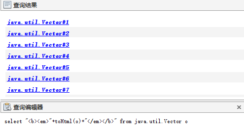


## 2.4 集合/统计函数

Visual VM中还有一组用于集合操作和统计的函数。可以方便地对结果集进行后处理或者统计操作。集合/统计函数主要有contains()、count()、filter()、length()、map()、max()、min()、sort()、top()等。

### 1．contains()函数

contains()函数判断给定集合是否包含满足给定表达式的对象。它的使用方法形如contains(set, boolexpression)。其中set为给定集合，boolexpression为表达式。在boolexpression中，可以使用如下contains()函数的内置对象。

- it：当前访问对象。

- index：当前对象索引。

- array：当前迭代的数组/集合。

下例返回被 File 对象引用的 String 对象集合。首先通过 referrers(s) 得到所有引用String 对象的对象集合。使用 contains() 函数及其参数布尔等式表达式classof(it).name == 'java.io.File')，将 contains() 的筛选条件设置为类名是java.io.File 的对象。

```
select s.toString() from java.lang.String s where contains(referrers(s), "classof(it).name == 'java.io.File'") 
```

以上查询的部分输出结果如下：

```
D:\Java\jdk1.8.0\jre\lib\ext\sunpkcs11.jar
D:\Java\jdk1.8.0\jre\lib\ext\sunec.jar
D:\Java\jdk1.8.0\jre\lib\ext\nashorn.jar
D:\Java\jdk1.8.0\jre\lib\ext\localedata.jar
D:\Java\jdk1.8.0\jre\lib\ext\zipfs.jar
D:\Java\jdk1.8.0\jre\lib\ext\jfxrt.jar
D:\Java\jdk1.8.0\jre\lib\ext\dnsns.jar
```

通过该OQL，得到了当前堆中所有的File对象的文件名称。可以理解为当前Java程序通过java.io.File获得已打开或持有的所有文件。

### 2．count()函数

count()函数返回指定集合内满足给定布尔表达式的对象数量。它的基本使用方法如：count(set, [boolexpression])。参数set指定要统计总数的集合，boolexpression为布尔条件表达式，可以省略，但如果指定，count()函数只计算满足表达式的对象个数。在boolexpression表达式中，可以使用以下内置对象。

- it：当前访问对象。
- index：当前对象索引。
- array：当前迭代的数组/集合。

下例返回堆中所有java.io包中的类的数量，布尔表达式使用正则表达式表示。

```
select count(heap.classes(), "/java.io./(it.name)") 
```

下列返回堆中所有类的数量。

```
select count(heap.classes()) 
```

### 3．filter()函数

filter()函数返回给定集合中，满足某一个布尔表达式的对象子集合。使用方法形如filter(set, boolexpression)。在boolexpression中，可以使用以下内置对象。

- it：当前访问对象。

- index：当前对象索引。

- array：当前迭代的数组/集合。

下例返回所有java.io包中的类。

```
select filter(heap.classes(), "/java.io./(it.name)") 
```

下例返回了当前堆中，引用了java.io.File对象并且不在java.io包中的所有对象实例。首先使用referrers()函数得到所有引用java.io.File对象的实例，接着使用filter()函数进行过滤，只选取不在java.io包中的对象。

```
select filter(referrers(f), "! /java.io./(classof(it).name)") from java.io.File f 
```

### 4．length()函数

length()函数返回给定集合的数量，使用方法形如length(set)。

下例返回当前堆中所有类的数量。

```
select length(heap.classes()) 
```

### 5．map()函数

map()函数将结果集中的每一个元素按照特定的规则进行转换，以方便输出显示。使用方法形如：map(set, transferCode)。set为目标集合，transferCode为转换代码。在transferCode中可以使用以下内置对象。

- it：当前访问对象。

- index：当前对象索引。

- array：当前迭代的数组/集合。

下例将当前堆中的所有File对象进行格式化输出：

```
select map(heap.objects("java.io.File"), "index + '=' + it.path.toString()") 
```

输出结果为：

```
0=D:\tools\jdk1.7_40\jre\bin\zip.dll
1=D:\tools\jdk1.7_40\jre\bin\zip.dll
2=D:\tools\jdk1.7_40\jre\lib\ext
3=C:\Windows\Sun\Java\lib\ext
4=D:\tools\jdk1.7_40\jre\lib\ext\meta-index
5=D:\tools\jdk1.7_40\jre\lib\ext 
```

注意：map()函数可以用于输出结果的数据格式化。它可以将集合中每一个对象转成特定的输出格式。

### 6．max()函数

max()函数计算并得到给定集合的最大元素。使用方法为：max(set, [express])。其中set为给定集合，express为比较表达式，指定元素间的比较逻辑。参数express可以省略，若省略，则执行数值比较。参数express可以使用以下内置对象。

- lhs：用于比较的左侧元素。

- rhs：用于比较的右侧元素。

下例显示了当前堆中最长的String长度。对于JDK 1.6得到的堆，首先使用heap.objects()函数得到所有String对象，接着，使用map()函数将String对象集合转为String对象的长度集合，最后，使用max()函数得到集合中的最大元素。对于JDK 1.7得到的堆，由于String结构发生变化，故通过String.value得到字符串长度。

```
JDK 1.6导出的堆  
select max(map(heap.objects('java.lang.String', false), 'it.count'))   
JDK 1.7导出的堆  
select max(map(filter(heap.objects('java.lang.String', false),'it.value!=null'), 'it.value.length'))
```

以上OQL的输出为最大字符串长度，输出如下：

```
734.0 
```

下例取得当前堆的最长字符串。它在max()函数中设置了比较表达式，指定了集合中对象的比较逻辑。

```
JDK 1.6导出的堆  
select max(heap.objects('java.lang.String'), 'lhs.count > rhs.count')   
JDK 1.7导出的堆  
select max(filter(heap.objects('java.lang.String'),'it.value!=null'), 'lhs. value.length > rhs.value.length') 
```

与上例相比，它得到的是最大字符串对象，而非对象的长度：

```
java.lang.String#908 
```

### 7．min()函数

min()函数计算并得到给定集合的最小元素。使用方法为：min(set, [expression])。其中set为给定集合，expression为比较表达式，指定元素间的比较逻辑。参数expression可以省略，若省略，则执行数值比较。参数expression可以使用以下内置对象：

- lhs：用于比较的左侧元素

- rhs：用于比较的右侧元素

下例返回当前堆中数组长度最小的Vector对象的长度：

```
select min(map(heap.objects('java.util.Vector', false), 'it.elementData. length')) 
```

下例得到数组元素长度最长的一个Vector对象：

```
select min(heap.objects('java.util.Vector'), 'lhs.elementData.length > rhs.elementData.length') 
```

### 8．sort()函数

sort()函数对指定的集合进行排序。它的一般使用方法为：sort(set, expression)。其中，set为给定集合，expression为集合中对象的排序逻辑。在expression中可以使用以下内置对象：

- lhs：用于比较的左侧元素

- rhs：用于比较的右侧元素

下例将当前堆中的所有Vector按照内部数组的大小进行排序：

```
select sort(heap.objects('java.util.Vector'), 
'lhs.elementData.length - rhs.elementData.length') 
```

下例将当前堆中的所有Vector类（包括子类），按照内部数据长度大小，从小到大排序，并输出Vector对象的实际大小以及对象本身。

```
select map(    sort(          
heap.objects('java.util.Vector'),       
'lhs.elementData.length - rhs.elementData.length' ), 
'{ size: rsizeof(it), obj: it }'    ) 
```

上述查询中，首先通过heap.objects()方法得到所有Vector及其子类的实例，接着，使用sort()函数，通过Vector内部数组长度进行排序，最后使用map()函数对排序后的集合进行格式化输出。

### 9．top()函数

top()函数返回在给定集合中，按照特定顺序排序的前几个对象。一般使用方法为：top(set, expression,num)。其中set为给定集合，expression为排序逻辑，num指定输出前几个对象。在expression中，可以使用以下内置对象。

- lhs：用于比较的左侧元素。

- rhs：用于比较的右侧元素。

下例显示了长度最长的前5个字符串：

```
JDK 1.6的堆  
select top(heap.objects('java.lang.String'), 'rhs.count - lhs.count', 5)   
JDK 1.7的堆  
select top(filter(heap.objects('java.lang.String'),'it.value!=null'), 'rhs. value.length - lhs.value.length', 5) 
```

下例显示长度最长的5个字符串，输出它们的长度与对象：

```
JDK 1.6的堆  
select map(top(heap.objects('java.lang.String'), 'rhs.count - lhs.count', 5), '{ length: it.count, obj: it }')  
JDK 1.7的堆  
select map(top(filter(heap.objects('java.lang.String'),'it.value!=null'), 'rhs.value.length - lhs.value.length', 5), '{ length: it.value.length, obj: it }') 
```

上述查询的部分输出可能如下所示：

```
{  
length = 734.0, 
obj = java.lang.String#908  } 
{ 
length = 293.0, 
obj = java.lang.String#914  
} 
```

### 10．sum()函数

sum()函数用于计算集合的累计值。它的一般使用方法为：sum(set,[expression])。其中第一个参数set为给定集合，参数expression用于将当前对象映射到一个整数，以便用于求和。参数expression可以省略，如果省略，则可以使用map()函数作为替代。

下例计算所有 java.util.Properties 对象的可达对象的总大小：

```
select sum(map(reachables(p), 'sizeof(it)')) from java.util.Properties p 
```

将使用 sum() 函数的第2个参数 expression 代替 map() 函数，实现相同的功能：

```
select sum(reachables(p), 'sizeof(it)') from java.util.Properties p 
```

### 11．unique()函数

unique()函数将除去指定集合中的重复元素，返回不包含重复元素的集合。它的一般使用方法形如unique(set)。

下例返回当前堆中，有多个不同的字符串：

```
select count(unique(map(heap.objects('java.lang.String'), 'it.value'))) 
```

## 2.5 程序化OQL

Visual VM不仅支持在OQL控制台上执行OQL查询语言，也可以通过其OQL相关的JAR包，将OQL查询程序化，从而获得更加灵活的对象查询功能，实现堆快照分析的自动化。

在进行OQL开发前，工程需要引用Visual VM安装目录下JAR包，如图7.45所示。

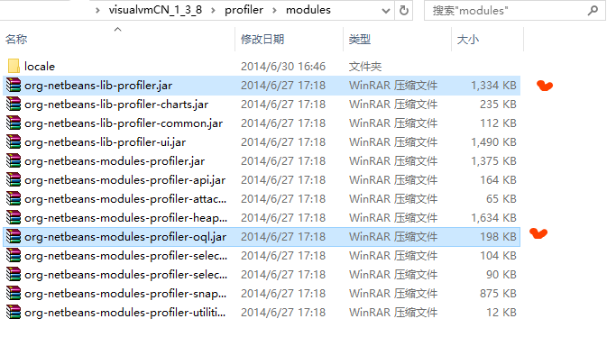


这里以分析Tomcat堆溢出文件为例，展示程序化OQL带来的便利。 对于给定的Tomcat堆溢出Dump文件，这里将展示如何通过程序，计算Tomcat平均每秒产生的session数量，代码如下：

```
public class AveLoadTomcatOOM {
    public static final String dumpFilePath = "d:/tmp/tomcat_oom/tomcat.hprof";

    public static void main(String args[]) throws Exception {
        OQLEngine engine;
        final List<Long> creationTimes = new ArrayList<Long>(000);
        engine = new OQLEngine(HeapFactory.createHeap(new File(dumpFilePath)));
        String query = "select s.creationTime from org.apache.catalina. session.StandardSession s"; //第8行
        engine.executeQuery(query, new OQLEngine.ObjectVisitor() {
            public boolean visit(Object obj) {
                creationTimes.add((Long) obj);
                return false;
            }
        });
        Collections.sort(creationTimes);
        long min = creationTimes.get(0) / 1000;//第18行
        long max = creationTimes.get(creationTimes.size() - 1) / 1000;
        System.out.println("平均压力：" + creationTimes.size() * 1.0 / (max - min) + "次/秒");
    }
}
```

上述代码第8行，通过OQL语句得到所有session的创建时间，在第18、19行获得所有session中最早创建和最晚创建的session时间，在第21行计算整个时间段内的平均session创建速度。

运行上述代码，得到输出如下：

```
平均压力：311.34375次/秒 
```

使用这种方式可以做到堆转存文件的全自动化分析，并将结果导出到给定文件，当有多个堆转存文件需要分析时，有着重要的作用。

除了使用以上方式外，Visual VM的OQL控制台也支持直接使用JavaScript代码进行编程，如下代码实现了相同功能：

```
var sessions=toArray(heap.objects("org.apache.catalina.session.StandardSession"));  
var count=sessions.length;  
var createtimes=new Array();  
for(var i=0;i<count;i++){      createtimes[i]=sessions[i].creationTime;  
}  
createtimes.sort();  
var min=createtimes[0]/1000;  
var max=createtimes[count-1]/1000;  
count/(max-min)+"次/秒" 
```

下图显示了在OQL控制台中，执行上述脚本以及输出结果。

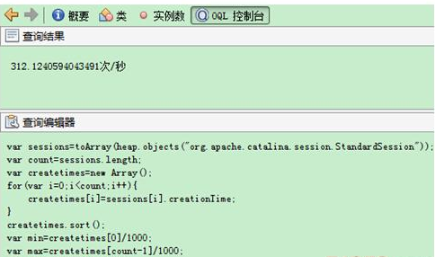


细心的读者可能会发现，这个结果和使用Java访问Dump文件时的结果有所差异，这是因为JavaScript是弱类型语言，在处理整数除法时和Java有所不同，读者可以自行研究，在此不予展开讨论。

Visual VM的OQL是非常灵活的，除了上述使用JavaScript风格外，也可以使用如下函数式编程风格计算：

```
count(heap.objects('org.apache.catalina.session.StandardSession'))/  (  
max(map(heap.objects('org.apache.catalina.session.StandardSession'),'it.creationTime'))/1000-  
min(map(heap.objects('org.apache.catalina.session.StandardSession'),'it.creationTime'))/1000  ) 

```

上述代码使用了count()、min()、max()、map()等函数，共同完成了平均值的计算。执行上述代码，输出如下：

```
312.1240594043491 
```

>因JDK版本问题，无法保证上述操作的有效性，仅供学习与参考。


