# MAT内存分析工具

MAT是Memory Analyzer的简称，它是一款功能强大的Java堆内存分析器。可以用于查找内存泄露以及查看内存消耗情况。MAT是基于Eclipse开发的，是一款免费的性能分析工具。读者可以在<http://www.eclipse.org/mat/>下载并使用MAT。

## 1 初识MAT

在分析堆快照前，首先需要导出应用程序的堆快照。在本书前文中提到的jmap、JConsole和Visual VM等工具都可用于获得Java应用程序的堆快照文件。此外，MAT本身也具有这个功能。

单击左上角的“File”菜单下的“Accquire Heap Dump”选项后，会弹出当前Java应用程序列表，选择要分析的应用程序即可，如图所示。

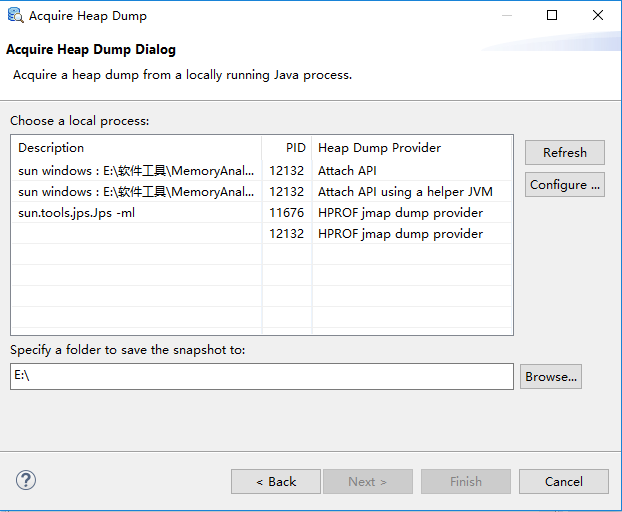

除了直接在MAT中导出正在运行的应用程序堆快照外，也可以通过“Open Heap Dump”来打开一个既存的堆快照文件。

> 注意：使用MAT既可以打开一个已有的堆快照，也可以通过MAT直接从活动Java程序中导出堆快照。

如图所示，显示了正常打开堆快照文件后的MAT的界面。

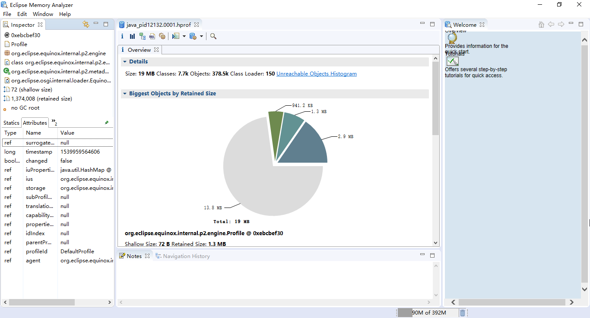


右侧界面中，显示了堆快照文件的大小、类、实例和ClassLoader的总数。在右侧的饼图中，显示了当前堆快照中最大的对象。将鼠标悬停在饼图中，可以在左侧的Inspector界面中，查看该对象的相应信息。在饼图中单击某对象，可以对选中的对象进行更多的操作。

在工具栏上单击柱状图，可以显示系统中所有类的内存使用情况。图为系统内所有类的统计信息，包含类的实例数量和占用的空间。

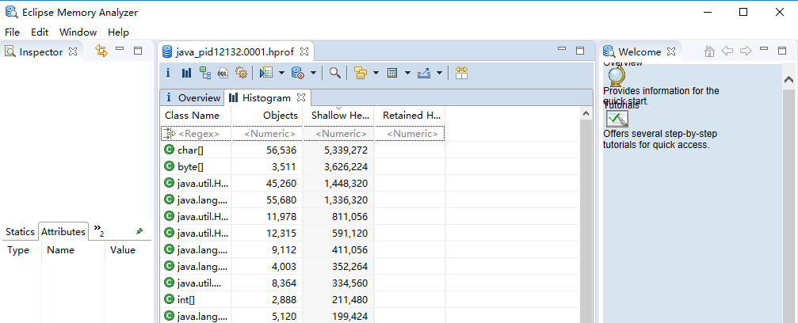


另外一个实用的功能是，可以通过MAT查看系统中的Java线程，如图所示。

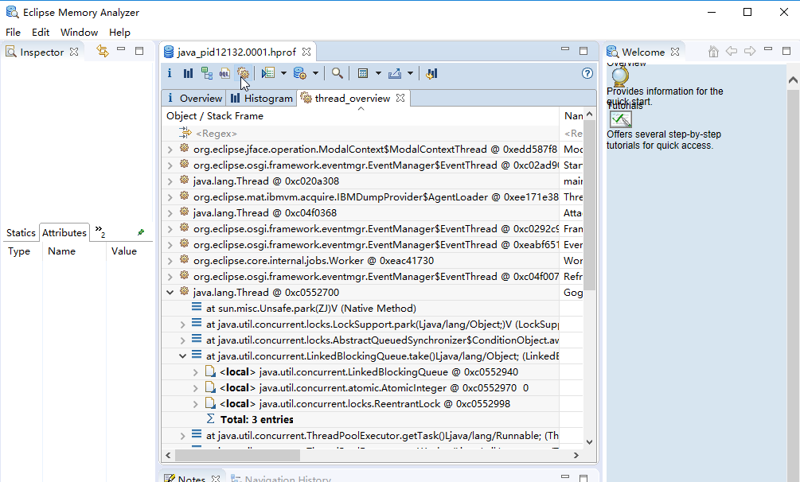


当然，这里查看Java层面的应用线程，对于虚拟机的系统线程是无法显示的。通过线程的堆栈，还可以查看局部变量的信息。如上图所示，带有“\<local>”标记的，就为当前帧栈的局部变量，这部分信息可能存在缺失。

MAT的另外一个常用功能，是在各个对象的引用列表中穿梭查看。对于给定一个对象，通过MAT可以找到引用当前对象的对象，即入引用（Incomming References），以及当前对象引用的对象，即出引用（Outgoing References），如图7.11所示。

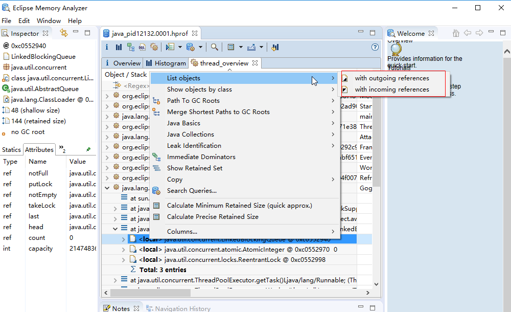


下图显示了with outgoing reference 的输出。

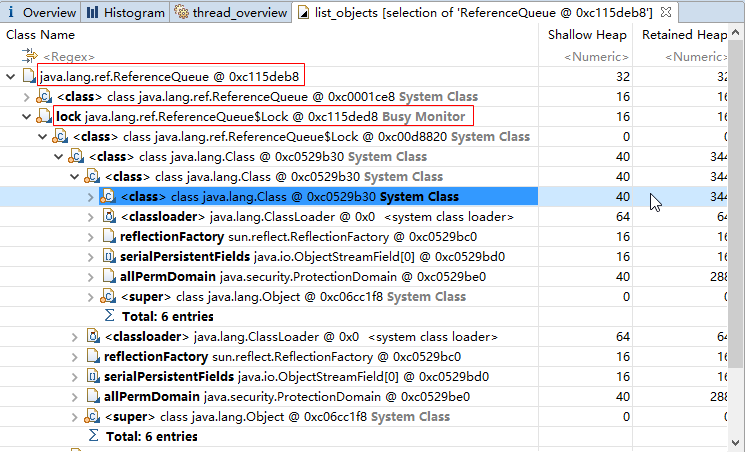


为了方便查看，柱状图还提供了根据Class Loader和包对类进行排序。如下图是按照包排序的柱状图输出。

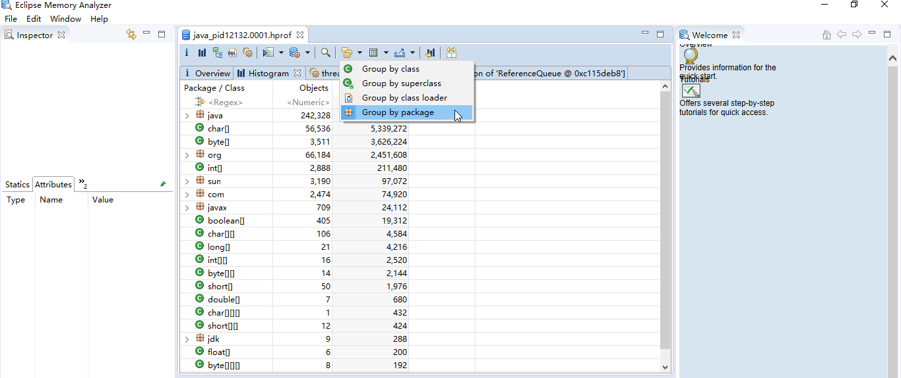


## 2  浅堆和深堆

浅堆（Shallow Heap）和深堆（Retained Heap）是两个非常重要的概念，它们分别表示一个对象结构所占用的内存大小和一个对象被GC回收后，可以真实释放的内存大小。

浅堆（Shallow Heap）是指一个对象所消耗的内存。在32位系统中，一个对象引用会占据4个字节，一个int类型会占据4个字节，long型变量会占据8个字节，每个对象头需要占用8个字节。

根据堆快照格式不同，对象的大小可能会向8字节进行对齐。以String对象为例，如下图所示，显示了String对象的几个属性。

- String
  - value:char[]
  - offset:int
  - count:int
  - hash:int

3个int值共占12字节，对象引用占用4字节，对象头8字节，合计24字节。浅堆的大小只与对象的结构有关，与对象的实际内容无关。也就是说，无论字符串的长度有多少，内容是什么，浅堆的大小始终是24字节。

深堆（Retained Heap）的概念略微复杂。要理解深堆，首先需要了解保留集（Retained Set）。对象A的保留集指当对象A被垃圾回收后，可以被释放的所有的对象集合（包括对象A本身），即对象A的保留集可以被认为是只能通过对象A被直接或间接访问到的所有对象的集合。通俗地说，就是指仅被对象A所持有的对象的集合。深堆是指对象的保留集中所有的对象的浅堆大小之和。

> 注意：浅堆指对象本身占用的内存，不包括其内部引用对象的大小。一个对象的深堆指只能通过该对象访问到的（直接或间接）所有对象的浅堆之和，即对象被回收后，可以释放的真实空间。
>

另外一个常用的概念是对象的实际大小。这里，对象的实际大小定义为一个对象所能触及的所有对象的浅堆大小之和，也就是通常意义上我们说的对象大小。与深堆相比，似乎这个在日常开发中更为直观和被人接受，但实际上，这个概念和垃圾回收无关。

如图7.14所示，显示了一个简单的对象引用关系图，对象A引用了C和D，对象B引用了C和E。那么对象A的浅堆大小只是A本身，不含C和D，而A的实际大小为A、C、D三者之和。而A的深堆大小为A与D之和，由于对象C还可以通过对象B访问到，因此不在对象A的深堆范围内。

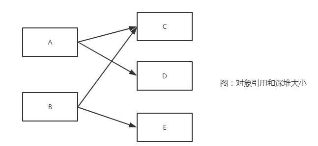


在MAT中查看对象浅堆和深堆的大小：

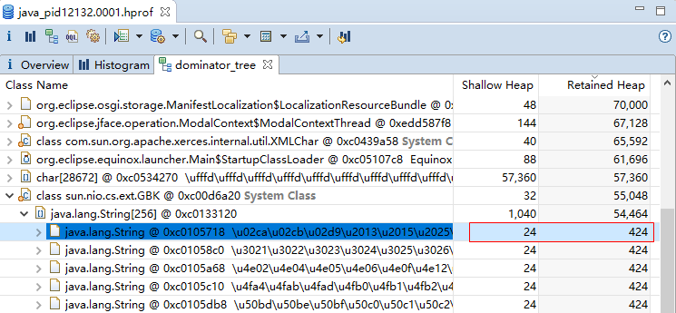


选中对象，单击右键，在弹出的菜单中都有 Show Retained Set 命令，它可用于显示指定类或者对象的保留集。

## 3  支配树（Dominator Tree）

MAT提供了一个称为支配树（Dominator Tree）的对象图。支配树体现了对象实例间的支配关系。在对象引用图中，所有指向对象B的路径都经过对象A，则认为对象A支配对象B。如果对象A是离对象B最近的一个支配对象，则认为对象A为对象B的直接支配者。支配树是基于对象间的引用图所建立的，它有以下基本性质：

- 对象A的子树（所有被对象A支配的对象集合）表示对象A的保留集（retained set），即深堆。


- 如果对象A支配对象B，那么对象A的直接支配者也支配对象B。


- 支配树的边与对象引用图的边不直接对应。


如图7.19所示，左图表示对象引用图，右图表示左图所对应的支配树。对象A和B由根对象直接支配，由于在到对象C的路径中，可以经过A，也可以经过B，因此对象C的直接支配者也是根对象。对象F与对象D相互引用，因为到对象F的所有路径必然经过对象D，因此，对象D是对象F的直接支配者。而到对象D的所有路径中，必然经过对象C，即使是从对象F到对象D的引用，从根节点出发，也是经过对象C的，所以，对象D的直接支配者为对象C。

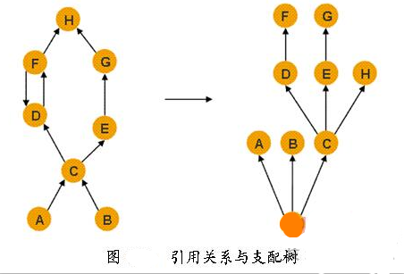


同理，对象E支配对象G。到达对象H的可以通过对象D，也可以通过对象E，因此对象D和E都不能支配对象H，而经过对象C既可以到达D也可以到达E，因此对象C为对象H的直接支配者。

在MAT中，单击工具栏上的对象支配树按钮，可以打开对象支配树视图，如图7.20所示。

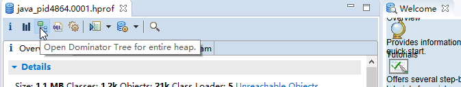


> 注意：对象支配树中，某一个对象的子树，表示在该对象被回收后，也将被回收的对象的集合。
>

## 4 垃圾回收根

在Java系统中，作为垃圾回收的根节点可能是以下对象之一：

- 系统类：被 bootstrap/system ClassLoader加载的类。如在 rt.jar包中的所有类。

- JNI局部变量：本地代码中的局部变量。如用户自定义的JNI代码或者JVM内部代码。

- JNI全局变量：本地代码中的全局变量。

- 线程：开始、并且没有停止的线程。

- 正在使用的锁：作为锁的对象。比如，调用了 wait() 或者 notify() 方法的对象。或者调用了 synchronized(Object)操作的对象。

- Java局部变量：如函数的输入参数以及方法中的局部变量。

- 本地栈：本地代码中的输入输出参数。比如用户自定义的JNI代码或者JVM内部代码。

- Finalizer：在等待队列中将要被执行析构函数的对象。

- Unfinalized：拥有析构函数，但是没有被析构，且不在析构队列中的对象。

- 不可达对象：从任何一个根对象，都无法达到的对象。但为了能够在MAT中分析，被MAT标志位根。

- 未知对象：未知的根类型。用于处理一些特殊的堆格式。

通过MAT，可以列出所有的根对象，如下图所示。

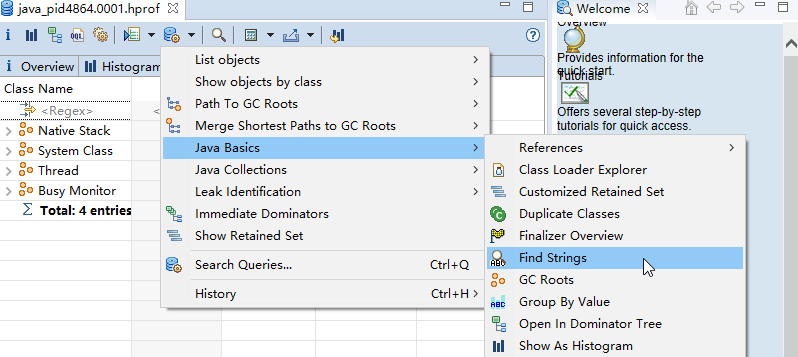


## 5 内存泄漏检测

MAT  提供了自动检测内存泄漏，以及统计堆快照内对象分布情况的工具，如图所示：

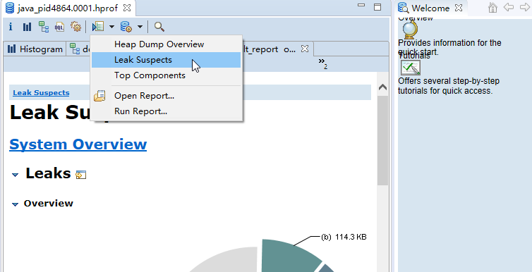


## 6 最大对象报告

系统中占有内存最大的几个对象，往往是解决系统性能问题的关键所在。如果应用程序发生内存泄漏，那么泄漏的对象通常会在堆快照中所占据很大的比重。因此，查看和分析堆快照中最大的对象，具有较高的价值。

在MAT中，可以自动查找并显示消耗内存最多的几个对象，如图所示，可以打开以饼图和表格为形式的最大对象报告。

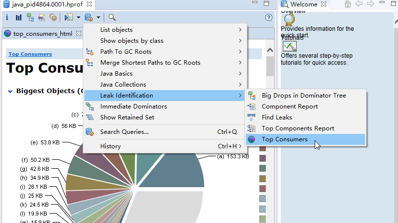


## 7 查找支配者

通过MAT，开发人员还可以很方便地查找某一个对象或者类的支配者。如下图所示。

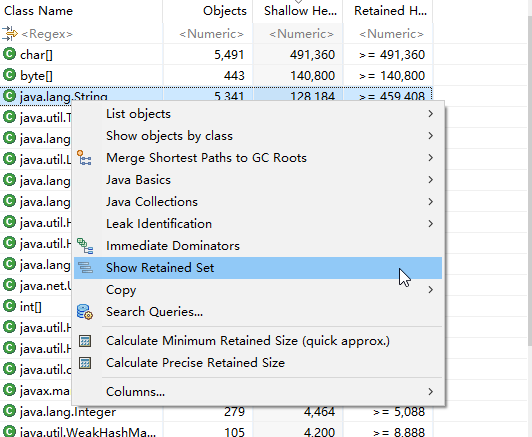


在参数对话框中，务必正确填写 -skip 参数。查询结果会忽略所有定义在 -skip 参数中的类和实例。

输出结果是不满足 -skip 所指定正则表达式的、所有选中对象或类的直接的支配者。

## 8 线程分析

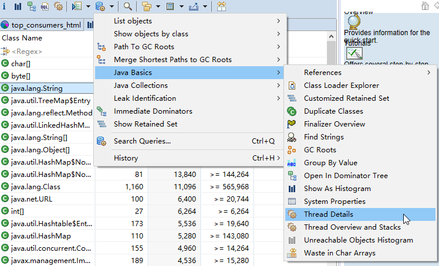


## 9 集合使用情况分析

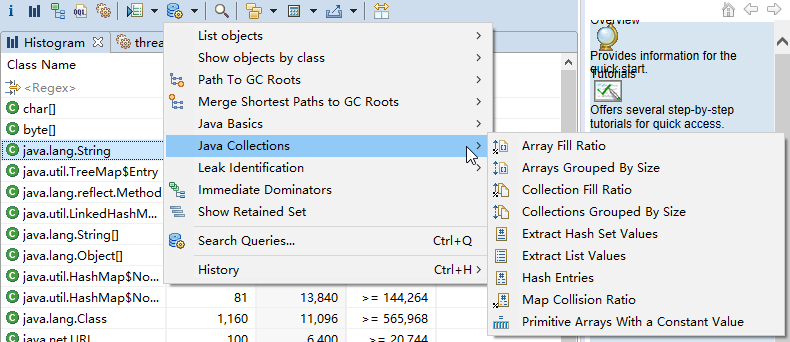


使用这些工具，可以查看数组、集合的填充率；可以观察集合内的数据；也可以分析哈希表的冲突率。

# MAT对OQL的支持

MAT的OQL语法与Visual VM支持的OQL有着很大不同。MAT支持一种类似于SQL的查询语言OQL（Object Query Language）。OQL使用类SQL语法，可以在堆中进行对象的查找和筛选。本节将主要介绍OQL的基本使用方法，帮助读者尽快掌握这种堆文件的查看方式。

## 1  Select子句

在MAT中，Select子句的格式与SQL基本一致，用于指定要显示的列。Select子句中可以使用“*”，查看结果对象的引用实例（相当于outgoing references）。

```
select * from java.util.ArrayList A
```

以上查询的输出如图所示，在输出结果中，结果集中的每条记录都可以展开，查看各自的引用对象。

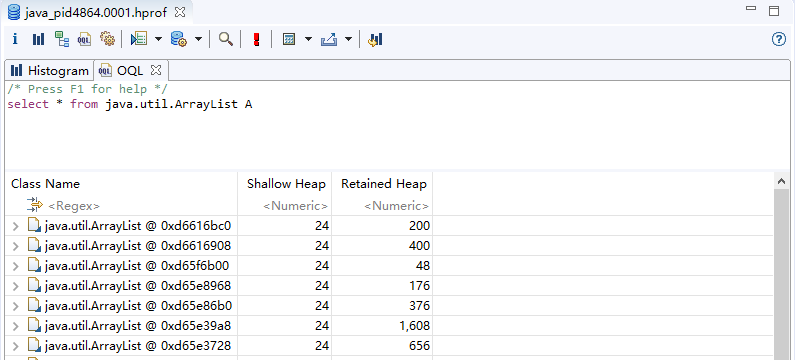


OQL还可以指定对象的属性进行输出，下例输出所有Vector对象的内部数组，输出结果如图7.31所示。使用“OBJECTS”关键字，可以将返回结果集中的项以对象的形式显示。

```
SELECT OBJECTS v.elementData FROM java.util.Vector v 
```

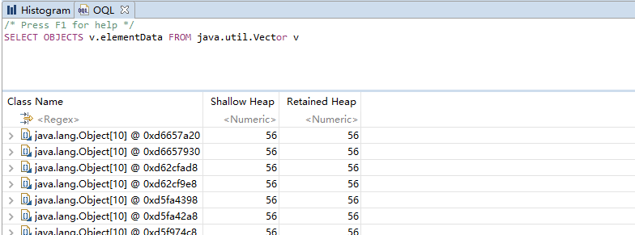


下例显示String对象的char数组（用于JDK 1.7的堆）：

```
SELECT OBJECTS s.value FROM java.lang.String s 
```

在Select子句中，使用“AS RETAINED SET”关键字可以得到所得对象的保留集。下例得到geym.zbase.ch7.heap.Student对象的保留集。

```
SELECT AS RETAINED SET * FROM geym.zbase.ch7.heap.Student 
```

“DISTINCT”关键字用于在结果集中去除重复对象。下例的输出结果中只有一条“class java.lang.String”记录。如果没有“DISTINCT”，那么查询将为每个String实例输出其对应的Class信息。

```
SELECT DISTINCT OBJECTS classof(s) FROM java.lang.String s 
```

## 2  From子句

From子句用于指定查询范围，它可以指定类名、正则表达式或者对象地址。

下例使用From子句，指定类名进行搜索，并输出所有的java.lang.String实例。

```
SELECT * FROM java.lang.String s 
```

下例使用正则表达式，限定搜索范围，输出所有java.lang包下所有类的实例，如图所示。

```
SELECT * FROM "java\.lang\..*" 
```

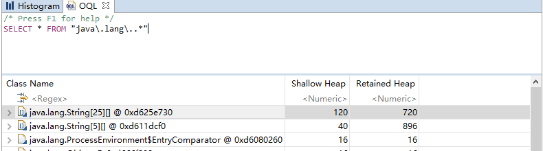

也可以直接使用类的地址进行搜索。使用类的地址的好处是可以区分被不同ClassLoader加载的同一种类型。下例中“0x37a014d8”为类的地址。

```
select * from 0x37a014d8 
```

有多种方法可以获得类的地址，在MAT中，一种最为简单的方法如图所示。

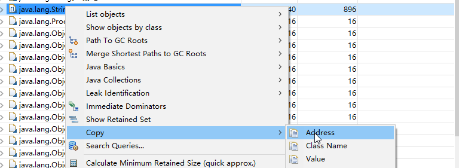


在From子句中，还可以使用“INSTANCEOF”关键字，返回指定类的所有子类实例。下例的查询返回了当前堆快照中所有的抽象集合实例，包括java.util.Vector、java.util.ArrayList和java.util.HashSet等。

```
SELECT * FROM INSTANCEOF java.util.AbstractCollection 
```

在From子句中，还可以使用“OBJECTS”关键字。使用“OBJECTS”关键字后，那么原本应该返回类的实例的查询，将返回类的信息。

```
SELECT * FROM OBJECTS java.lang.String 
```

以上查询的返回结果如图所示。它仅返回一条记录，表示java.lang.String的类的信息。如果不使用“OBJECTS”关键字，这个查询将返回所有的java.lang.String实例。


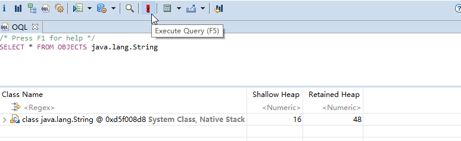


“OBJECTS”关键字也支持与正则表达式一起使用。下面的查询，返回了所有满足给定正则表达式的所有类，其结果如图所示。

```
SELECT * FROM OBJECTS "cn\.zyzpp\..*" 
```

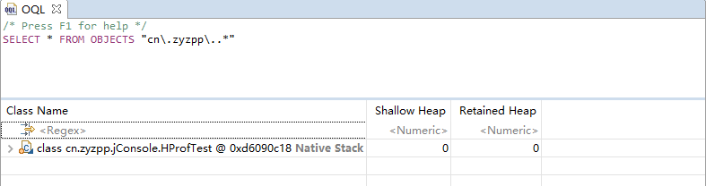


注意：在From子句中使用OBJECTS关键字，将返回符合条件的类信息，而非实例信息。这与Select子句中的OBJECTS关键字是完全不同的。

## 3  Where子句

Where子句用于指定OQL的查询条件。OQL查询将只返回满足Where子句指定条件的对象。Where子句的格式与传统SQL极为相似。

下例返回长度大于10的char数组。

```
SELECT * FROM char[] s WHERE s.@length>10 
```

下例返回包含“java”子字符串的所有字符串，使用“LIKE”操作符，“LIKE”操作符的操作参数为正则表达式。

```
SELECT * FROM java.lang.String s WHERE toString(s) LIKE ".*java.*" 
```

下例返回所有value域不为null的字符串，使用“=”操作符。

```
SELECT * FROM java.lang.String s where s.value!=null 
```

Where子句支持多个条件的AND、OR运算。下例返回数组长度大于15，并且深堆大于1000字节的所有Vector对象。

```
SELECT * FROM java.util.Vector v WHERE v.elementData.@length>15 AND v.@retainedHeapSize>1000
```

## 4  内置对象与方法

OQL中可以访问堆内对象的属性，也可以访问堆内代理对象的属性。访问堆内对象的属性时，格式如下：

```
[ <alias>. ] <field> . <field>. <field> 
```

其中alias为对象名称。

下例访问java.io.File对象的path属性，并进一步访问path的value属性。

```
SELECT toString(f.path.value) FROM java.io.File f 
```

以上查询得到的结果如图7.38所示。

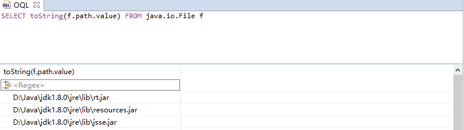


这些堆内对象的属性与Java对象一致，拥有与Java对象相同的结果。

MAT为了能快捷地获取堆内对象的额外属性（比如对象占用的堆大小、对象地址等），为每种元类型的堆内对象建立了相对应的代理对象，以增强原有的对象功能。访问代理对象的属性时，使用如下格式：

```
[ <alias>. ] @<attribute> 
```

其中，alias为对象名称，attribute为属性名。

下例显示了String对象的内容、objectid和objectAddress。

```
SELECT s.toString(), s.@objectId, s.@objectAddress FROM java.lang.String s 
```

下例显示了File对象的对象ID、对象地址、代理对象的类型、类的类型、对象的浅堆大小以及对象的显示名称。

```
SELECT f.@objectId, f.@objectAddress, f.@class, f.@clazz, f.@usedHeapSize, f.@displayName FROM java.io.File f 
```

下例显示java.util.Vector内部数组的长度。

```
SELECT v.elementData.@length FROM java.util.Vector v 
```

下表整理了MAT代理对象的基本属性。

| 对象类型   | 接口            | 属性             | 功能          |
| ---------- | --------------- | ---------------- | ------------- |
| 基对象     | IObejct         | objectId         | 对象ID        |
|            |                 | objectAddress    | 对象地址      |
|            |                 | class            | 代理对象类型  |
|            |                 | clazz            | 对象类类型    |
|            |                 | usedHeapSize     | 浅堆大小      |
|            |                 | retainedHeapSize | 深堆大小      |
|            |                 | displayName      | 显示名称      |
| Class对象  | IClass          | classLoaderId    | ClassLoad的ID |
| 数组       | IArray          | length           | 数组长度      |
| 元类型数组 | IPrimitiveArray | valueArray       | 数组内容      |
| 对象数组   | IObjectArray    | referenceArray   | 数组内容      |

除了使用代理对象的属性，OQL中还可以使用代理对象的方法，使用格式如下：

```
[ <alias> . ] @<method>( [ <expression>, <expression> ] ) 
```

下例显示int数组中索引下标为2的数据内容。

```
SELECT s.getValueAt(2) FROM int[] s WHERE (s.@length > 2) 
```

下例显示对象数组中索引下标为2的对象。

```
SELECT OBJECTS s.@referenceArray.get(2) FROM java.lang.Object[] s WHERE (s.@length > 2)
```

下例显示了当前堆中所有的类型。

```
select * from ${snapshot}.getClasses() 
```

下例显示了所有的java.util.Vector对象及其子类型，它的输出如图所示。

```
select * from INSTANCEOF java.util.Vector 
```

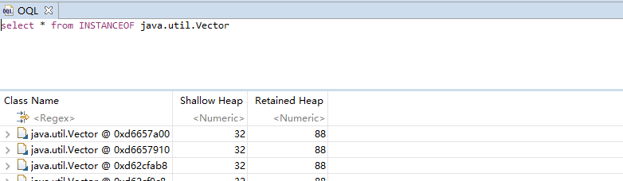


下例显示当前对象是否是数组。

```
SELECT c, classof(c).isArrayType() FROM ${snapshot}.getClasses() c 
```

代理对象的方法整理如表所示。

表  MAT代理对象的方法

| 对象说明             | 对象名          | 对象方法                                                 | 对象方法说明               |
| -------------------- | --------------- | -------------------------------------------------------- | -------------------------- |
| 全局快照             | ISnapshot       | getClasses()                                             | 所有实例的集合             |
|                      |                 | getClassesByName(String name, boolean includeSubClasses) | 根据名称选取符合条件的实例 |
| 类对象               | IClass          | hasSuperClass()                                          | 是否有超类                 |
|                      |                 | isArrayType()                                            | 是否是数组                 |
| 基对象               | IObject         | getObjectAddress()                                       | 取得对象地址               |
| 元类型数组           | IPrimitiveArray | getValueAt(int index)                                    | 取得数组中给定索引的数据   |
| 元类型数组，对象数组 | [] or List      | get(int index)                                           | 取得数组中给定索引的数据   |

MAT的OQL中还内置一些有用的函数，如表所示。

表 OQL中的内置函数

| 函数                 | 说明                   |
| -------------------- | ---------------------- |
| toHex( number )      | 转为16进制             |
| toString( object )   | 转为字符串             |
| dominators( object ) | 取得直接支配对象       |
| outbounds( object )  | 取得给定对象引用的对象 |
| inbounds( object )   | 取得引用给定对象的对象 |

续表

| 函数                  | 说明                     |
| --------------------- | ------------------------ |
| classof( object )     | 取得当前对象的类         |
| dominatorof( object ) | 取得给定对象的直接支配者 |

下例显示所有长度为15的字符串内容（JDK 1.7导出的堆）。

```
SELECT toString(s) FROM java.lang.String s WHERE ((s.value.@length = 15) and (s.value != null)) 
```

下例显示所有cn.zyzpp.jConsole.HProfTest对象的直接支配对象。即给定对象回收后，将释放的对象集合。

```
SELECT objects dominators(s) FROM cn.zyzpp.jConsole.HProfTest s
```

以上查询的输出如图所示，显示HProfTest对象支配了1个字符串对象。

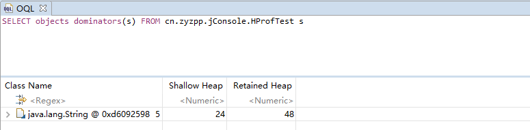


函数dominatorof()与dominators()的功能相反，它获取直接支配当前对象的对象。

```
SELECT distinct objects dominatorof(s) FROM cn.zyzpp.jConsole.HProfTest s 
```

以上查询的输出如图所示，显示所有的HProfTest对象直接被主线程支配。

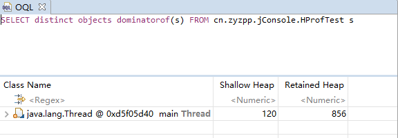


注意：函数dominatorof()与dominators()的功能正好相反。dominatorof()用于获得直接支配当前对象的对象，而dominators()用于获取直接支配对象。

下例取得引用WebPage的对象。

```
SELECT objects inbounds(w) FROM geym.zbase.ch7.heap.WebPage w 
```

下例取得堆快照中所有在cn.zyzpp包中的存在对象实例的类型，其输出如图所示。

```
SELECT distinct objects classof(obj) FROM "cn\.zyzpp\..*" obj 
```

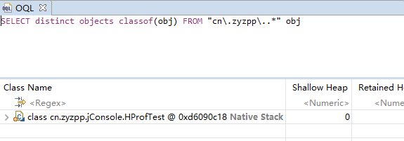

# 参考

*《Java程序性能优化》葛一鸣*

