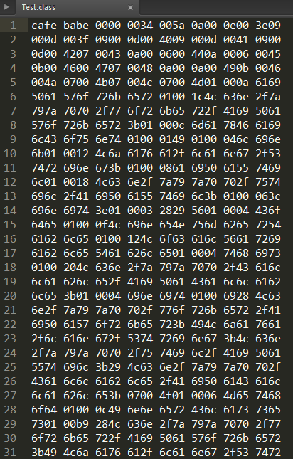
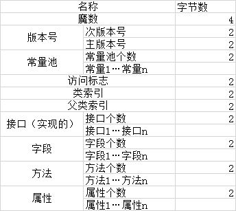
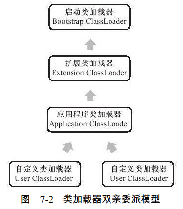
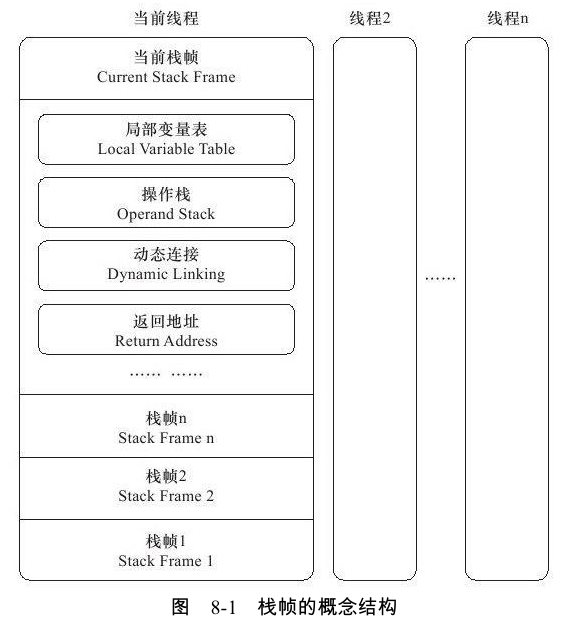
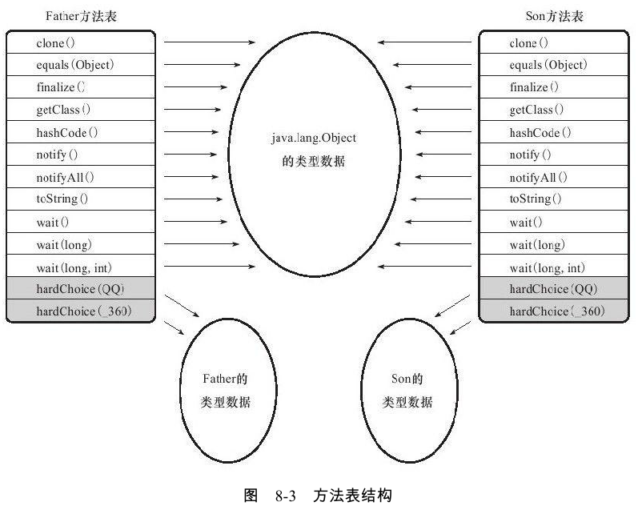
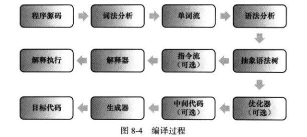

周志明的《深入理解Java虚拟机》很好很强大，阅读起来颇有点费劲，尤其是当你跟随作者的思路一直探究下去，开始会让你弄不清方向，难免有些你说的啥子的感觉。但知识不得不学，于是天天看，反复看，就慢慢的理解了。我其实不想说这种硬磨的方法有多好，我甚至不推荐，我建议大家阅读这本书时，由浅入深，有舍有得，先从宏观去理解去阅读，再慢慢深入，有条不紊的看下去。具体来说，当你看书的某一部分时，先看这部分的章节名，了解这部分这一章在讲什么，然后再看某一章，我拿“类文件结构”这一章来说，我必须先知道类文件结构都有什么，然后看到有魔数、Class文件版本、常量池等，然后我再去看魔数是什么，Class文件版本在哪里，常量池是什么？再深入下去，常量池有字面量和符号引用，再深入下去，，可能你看懂后还想深究，可能你到这里就已经看不下去了。这都没事，我想说的是，此时看不下去的知识，就不要看了，略过看下一节，我们先把最表面的那一层看完，了解，再去深入到某个点。这本书的知识就像是一个二叉树，我们先把上面的那层看完再步步去深入到下一层，我觉得这样阅读起来比较轻松，不至于读到难处还要硬读下去。本文只对比较简单的部分进行摘取作为笔记，适合初学者，若想深入还需亲自去阅读原著。

# 1.类文件结构

## 1.1 Class类文件结构

使用subline Test打开一个class文件，其十六进制代码为：





- Class文件是一组以8字节为基础单位的二进制流，
- 各个数据项目严格按照顺序紧凑排列在class文件中，
- 中间没有任何分隔符，这使得class文件中存储的内容几乎是全部程序运行的程序。

这里需要明白1个字节是2位（16进制），比如上面图中开头的“cafa babe”是4个字节，也就是魔数。其它参考下图：




## 1.2 魔数与Class文件的版本

　　每个Class文件的头4个字节称为魔数，它的唯一作用是确定这个文件是否为一个能被虚拟机接受的Class文件。很多文件储存标准中都使用魔数来进行身份识别，譬如图片格式，如 gif 或者 jpeg 等在文件头中都存有魔数。

​	Class 文件的魔数值为：0xCAFEBABE（咖啡宝贝） 

　　紧接着魔数的4个字节储存的是Class文件的版本号：第5和第6个字节是次版本号，第7和第8个字节是主版本号。Java版本号是从45开始的，JDK1.1之后的每个JDK大版本发布主版本号向上加1（JDK 1.0 ~ 1.1 使用了 45.0 ~ 45.3 的版本号），

​	高版本的 JDK 能向下兼容以前版本的 Class 文件，但不能运行以后版本的 Class 文件，即使文件格式并未发生任何变化，虚拟机也必须拒绝执行超过其版本号的 Class 文件。

## 1.3 常量池

　　紧接着主次版本号之后的是常量池入口，常量池可以理解为Class文件之中的资源仓库，它是Class文件结构中与其他项目关联最多的数据类型，也是占用Class文件空间最大的数据项目之一。

常量池主要存放两大类常量：字面量和符号引用。字面量比较接近Java语言层面的常量概念，如文本字符串，声明为final的常量值等。而符号引用则属于编译原理方面的概念，包括了下面三类常量：

　　　1.类和接口的全限定名

　　　2.字段的名称和描述符

　　　3.方法的名称和描述符

Java代码在进行Javac编译的时候，并不像C和C++那样有“连接”这一步骤，而是在虚拟机加载Class文件的时候进行动态连接。也就是说，在Class文件中不会保存各个方法，字段的最终内存布局信息，因此这些字段，方法的符号引用不经过运行期转换的话无法得到真正的内存入口地址，也就无法直接被虚拟机使用。当虚拟机运行时，需要从常量池获得对应的符号引用，再在类创建时或运行时解析，翻译到具体的内存地址中。

## 1.4 访问标志

在常量池结束之后，紧接着的两个字节代表访问标志（access_flags），这个标志用于识别一些类或接口层次的访问信息，包括：这个Class是类还是接口；是否定义为public类型；是否定义为abstrack类型；如果是类的话，是否被声明为final等。


## 1.5 类索引、父索引与接口索引集合

　　 类索引（this_class）和父类索引（super_class）都是一个u2 类型的数据，而接口索引集合（interfaces）是一组 u2 类型的数据的集合，Class文件中由这三项数据来确定这个类的继承关系。类索引用于确定这个类的全限定名，父类索引用于确定这个类的弗雷的全限定名。由于Java语言不允许多重继承，所以父类索引只有一个，除了java.lang.Object 外，所有 Java 类的父类索引都不为 0。接口索引集合就用来描述这个类实现了哪些接口，这些被实现的接口就按implements语句（如果这个类本身是一个接口，则应当是 extends 语句）后的接口顺序从左到右排列在接口索引集合中。

## 1.6 字段表集合

字段表（field_info）用于描述接口或者类中声明的变量。字段（field）包括类级变量以及实例变量，但不包括在方法内部声明的局部变量。

字段中包括的信息：字段的作用域（public、private、protected修饰符）、是类级变量还是实例级变量（static修饰符）、可变性（final）、并发可见性（volatile修饰符）、可否序列化（reansient修饰符）、字段数据类型（基本类型、对象、数组）、字段名称等。在这些信息中，各个修饰符都是布尔值，要么有，要么没有。而字段叫什么名字、字段被定义成什么数据类型，这些都是无法固定的，只能引用常量池中的常量来描述。 

## 1.7 方法集合

Class文件存储格式中对方法的描述与对字段的描述几乎采用了完全一致的方式，方法表的结构如同字段表一样依次包括了访问标志（access_flags）、名称索引（name_index）、描述符索引（descriptor_index）、属性表集合（attributes）几项，方法里的 Java 代码，经过编译器编译成字节码指令后，存放在方法属性表集合中一个名为 “Code” 的属性里面。

与字段表集合相对应的，如果父类方法在子类中没有被重写，方法集合中就不会出现来自父类的方法信息。但有可能会出现由编译器自动添加的方法，最典型的便是类构造器"\<clinit>"方法和实例构造器“\<init>”方法。 

## 1.8 属性表集

属性表（attribute_info）在前面的讲解之中已经出现过数次，在 Class 文件、字段表、方法表都可以携带子机的属性表集合，以用于描述某些场景专有的信息。

### 1.8.1 Code属性

　　Java程序方法体中的代码经过Javac编译器处理后，最终变为字节码指令存储在Code属性内。Code属性出现在方法表的属性集合中，但并非所有的方法都存在这个属性，譬如接口或者抽象类中的方法就不存在Code属性。

### 1.8.2 Exception属性

Exceptions 属性的作用是列举出方法中可能抛出的受检查异常（Checked Exceptions），也就是方法描述时在 throws 关键字后面列举的异常。 

### 1.8.3 LineNumberTable属性

　　LineNumberTable 属性用于描述 Java 源码行号与字节码行号（字节码的偏移量）之间的对应关系。它并不是运行时必需的属性，但默认会生成到 Class 文件之中，可以在 javac 中分别使用 -g:none 或 -g:lines 选项来取消或要求生成这项信息。如果选择不生成LineNumberTable 属性，对程序运行产生的最主要的影响就是当抛出异常时，堆栈中将不会显示出错的行号，并且在调试程序的时候，也无法按照源码行来设置断点。

### 1.8.4 LocalVariableTable属性

　　LocalVariableTable 属性用于描述栈帧中局部变量表中的变量与 Java 源码中定义的变量之间的关系，它也不是运行时必需的属性，但默认会生成到 Class 文件之中，可以在 Javac 中分别使用 -g:none 或 -g:vars 选项来取消或要求生成这项信息。如果没有生成这项属性，最大的影响就是当其他人引用这个方法时，所有的参数名称都将会丢失，IDE 将会使用诸如 arg0、arg1 之类的占位符代替原有的参数名，这对程序运行没有影响，但是会对代码编写带来较大不变，而且在调试期间无法根据参数名称从上下文获得参数值。

### 1.8.5 SourceFile属性

　　 SourceFile 属性用于记录生成这个 Class 文件的源码文件名称。这个属性也是可选的，可以分别使用 javac 的 -g:none 或 -g:source 选项来关闭或要求生成这项信息。在 Java 中，对于大多数的类来说，类名和文件名是一致的，但是又一些特殊情况（如内部类）例外。如果不生成这项属性，当抛出异常时，堆栈中将不会显示出错代码所属的文件名。

### 1.8.6 ConstantValue属性

　　ConstantValue 属性的作用是通知虚拟机自动为静态变量赋值。只有被 static 关键字修饰的变量（类变量）才可以使用这项属性。类似 “int x = 123” 和 “static int x = 123” 这样的变量定义在 Java 程序中是非常常见的事情，但虚拟机对这两种变量赋值的方式和时刻都有所不同。对于非 static 类型的变量（也就是实例变量）的赋值是在实例构造器 \<init> 方法中进行的；而对于类变量，则有两种方式可以选择：在类构造器 \<clinit> 方法中或者使用 ConstantValue 属性。目前 Sun Javac 编译器的选择是：如果同时使用 final 和 static 来修饰一个变量（按照习惯，这里称 “常量” 更贴切），并且这个变量的数据类型是基本类型或者 java.lang.String 的话，就生成 ConstantValue 属性来进行初始化，如果这个变量没有被 final 修饰，或者并非基本类型及字符串，则将会选择在 \<clinit> 方法中进行初始化。

### 1.8.7 InnerClass属性

　　InnerClass 属性用于记录内部类与宿主类之间的关联。如果一个类中定义了内部类，那编译器将会为它以及它所包含的内部类生成 InnerClass 属性。

### 1.8.8 Deprecated及Synthetic属性

　　Deprecated 和 Synthetic 两个属性都属于标志类型的布尔属性，只存在有和没有的区别，没有属性值的概念。

​        Deprecated 属性用于表示某个类、字段或者方法，已经被程序作者定为不再推荐使用，它可以通过在代码中使用 @deprecated 注释进行设置。

​        Synthetic 属性代表此字段或者方法并不是由 Java 源码直接产生的，而是由编译器自行添加的，在 JDK 1.5 之后，标识一个类、字段或者方法是编译器自动产生的，也可以设置它们访问标志中的 ACC_SYNTHETIC 标志位，其中最典型的例子就是 Bridge Method。所有由非用户代码产生的类、方法及字段都应当至少设置 Synthetic 属性和 ACC_SYNTHETIC 标志位中的一项，唯一的例外是实例构造器 “\<init>” 方法和类构造器 “\<clinit>” 方法。

### 1.8.9 StackMapTable属性

StackMapTable 属性在 JDK 1.6 发布后增加到了 Class 文件规范中，它是一个复杂的变长属性，位于 Code 属性的属性表中。这个属性会在虚拟机类加载的字节码验证阶段被新类型检查验证器（Type Checker）使用，目的在于代替以前比较消耗性能的基于数据流分析的类型推导验证器。

### 1.8.10 Signature属性

　　 Signature 属性在 JDK 1.5 发布后增加到了 Class 文件规范之中，它是一个可选的定长属性，可以出现于类、属性表和方法表结构的属性表中。在 JDK 1.5 中大幅增强了 Java 语言的语法，在此之后，任何类、接口、初始化方法或成员的泛型签名如果包含了类型变量（Type Variables）或参数化类型（Parameterized Types），则 Signature 属性会为它记录泛型签名信息。

之所以要专门使用这样一个属性去记录泛型类型，是因为 Java 语言的泛型采用的是擦除法实现的伪泛型，在字节码（Code 属性）中，泛型信息编译（类型变量、参数化类型）之后都通通被擦除掉。使用擦除法的好处是实现简单（主要修改 Javac 编译器，虚拟机内部只做了很少的改动）、非常容易实现 backport，运行期也能够节省一些类型所占的内存空间。但坏处是运行期就无法像 C# 等有真泛型支持的语言那样，将泛型类型与用户定义的普通类型同等对待，例如运行期做反射时无法获得泛型信息。Signature 属性就是为了弥补这个缺陷而增设的，现在 Java 的反射 API 能够获取泛型类型，最终的数据来源也就是这个属性。 

### 1.8.11 BootstrapMethods属性

  　　BootstrapMethods 属性在 JDK 1.7 发布后增加到了 Class 文件规范之中，它是一个复杂的变长属性，位于类文件的属性表中。这个属性用于保存 invokedynamic 指令引用的引导方法限定符。

# 2.虚拟机类加载机制

程序员将源代码写入.Java文件中，经过（javac）编译，生成.class二进制文件。虚拟机把描述类的数据从Class文件加载到内存，并对数据进行校验、转换解析和初始化，最终形成可以被虚拟机直接使用的Java类型，这就是虚拟机的类加载机制。

## 2.1 类加载的时机

类生命周期包括：加载、验证、准备、解析、初始化、使用、卸载 7个阶段 。

加载、验证、准备、初始化和卸载这5个阶段的顺序是确定的，类的加载过程必须按照这种顺序按部就班地开始，而解析阶段则不一定：它在某些情况下可以再初始化阶段之后再开始，这个是为了支持Java语言运行时绑定（也成为动态绑定或晚期绑定） 

**虚拟机规范规定有且只有5种情况必须立即对类进行初始化**：

　　**1**.遇到new、getstatic、putstatic或invokestatic这4条字节码指令时，如果类没有进行过初始化，则需要触发其初始化。生成这4条指令的最常见的Java代码场景是：使用new关键字实例化对象的时候、读取或设置一个类的静态字段（被final修饰、已在编译期把结果放入常量池的静态字段除外）的时候，以及调用一个类的静态方法的时候

　　**2**.使用java.lang.reflect包的方法对类进行反射调用的时候，如果类没有进行过初始化，则需要先触发其初始化

　　**3**.当初始化一个类的时候，如果发现其父类还没有进行过初始化，则需要先触发其父类的初始化

　　**4**.当虚拟机启动时候，用户需要指定一个要执行的主类（包含main()方法的那个类），虚拟机会先初始化这个主类

　　**5**.当使用JDK1.7的动态语言支持时，如果一个java.lang.invoke.MethodHandle实例最后的解析结果REF_getStatic、REF_putStatic、REF_invokeStatic的方法句柄，并且这个方法句柄所对应的类没有进行过初始化，则需要先触发其初始化

**被动引用：**

　　**1**.通过子类引用父类的静态字段，不会导致子类初始化

　　**2.**通过数组定义来引用类，不会触发此类的初始化

　　**3.**常量在编译阶段会存入调用类的常量池中，本质上并没有直接引用到定义常量的类，因此不会触发定义常量的类的初始化

接口的初始化：接口在初始化时，并不要求其父接口全部完成类初始化，只有在正整使用到父接口的时候（如引用接口中定义的常量）才会初始化

## 2.2 类加载的过程

### 2.2.1 加载

　　**1)**通过一个类的全限定名类获取定义此类的二进制字节流

　　**2)**将这字节流所代表的静态存储结构转化为方法区运行时数据结构

　　**3)**在内存中生成一个代表这个类的java.lang.Class对象，作为方法区这个类的各种数据的访问入口

**数组类的创建过程遵循以下规则：**

　　**1)**如果数组的组件类型(指的是数组去掉一个维度的类型)是引用类型，那就递归采用上面的加载过程去加载这个组件类型，数组C将在加载该组件类型的类加载器的类名称空间上被标识

　　**2)**如果数组的组件类型不是引用类型(列如int[]组数)，Java虚拟机将会把数组C标识为与引导类加载器关联

　　**3)**数组类的可见性与它的组件类型的可见性一致，如果组件类型不是引用类型，那数组类的可见性将默认为public

### 2.2.2 验证

　　验证阶段会完成下面4个阶段的检验动作：文件格式验证，元数据验证，字节码验证，符号引用验证。

#### (1)文件格式验证

　　第一阶段要验证字节流是否符合Class文件格式的规范，并且能被当前版本的虚拟机处理。这一阶段可能包括：

　　**1).**是否以魔数oxCAFEBABE开头

　　**2)**.主、次版本号是否在当前虚拟机处理范围之内

　　**3.)**常量池的常量中是否有不被支持的常量类型(检查常量tag标志)

　　**4.)**指向常量的各种索引值中是否有指向不存在的常量或不符合类型的常量

　　**5.)**CONSTANT_Itf8_info 型的常量中是否有不符合UTF8编码的数据

　　**6.)**Class文件中各个部分及文件本身是否有被删除的或附加的其他信息

　　这个阶段的验证时基于二进制字节流进行的，只有通过类这个阶段的验证后，字节流才会进入内存的方法区进行存储，所以后面的3个验证阶段全部是基于方法区的存储结构进行的，不会再直接操作字节流

#### (2)元数据验证

　　**1**.这个类是否有父类(除了java.lang.Object之外,所有的类都应当有父类)

　　**2**.这个类的父类是否继承了不允许被继承的类（被final修饰的类）

　　**3**.如果这个类不是抽象类，是否实现类其父类或接口之中要求实现的所有方法

　　**4**.类中的字段、方法是否与父类产生矛盾(列如覆盖类父类的final字段,或者出现不符合规则的方法重载，列如方法参数都一致，但返回值类型却不同等)

第二阶段的主要目的是对类元数据信息进行语义校验，保证不存在不符合Java语言规范的元数据信息

#### (3)字节码验证

　　第三阶段是整个验证过程中最复杂的一个阶段，主要目的似乎通过数据流和控制流分析，确定程序语言是合法的、符合逻辑的。在第二阶段对元数据信息中的数据类型做完校验后，这个阶段将对类的方法体进行校验分析，保证被校验类的方法在运行时不会做出危害虚拟机安全的事件。

　　**1.**保证任意时刻操作数栈的数据类型与指令代码序列都能配合工作，列如，列如在操作数栈放置类一个int类型的数据，使用时却按long类型来加载入本地变量表中

　　**2**.保证跳转指令不会跳转到方法体以外的字节码指令上

　　**3.**保证方法体中的类型转换时有效的，列如可以把一个子类对象赋值给父类数据类型，这个是安全的，但是吧父类对象赋值给子类数据类型，甚至把对象赋值给与它毫无继承关系、完全不相干的一个数据类型，则是危险和不合法的

#### (4)符号引用验证

发生在虚拟机将符号引用转化为直接引用的时候，这个转化动作将在连接的第三阶段——解析阶段中发生。

　　**1**.符号引用中通过字符串描述的全限定名是否能找到相对应的类

　　**2.**在指定类中是否存在符合方法的字段描述符以及简单名称所描述的方法和字段

　　**3**.符号引用中的类、字段、方法的访问性是否可被当前类访问

　　对于虚拟机的类加载机制来说，验证阶段是非常重要的，但是不一定必要（因为对程序运行期没有影响）的阶段。如果全部代码都已经被反复使用和验证过，那么在实施阶段就可以考虑使用Xverify：none参数来关闭大部分的类验证措施，以缩短虚拟机类加载的时间。

### 2.2.3 准备

　　准备阶段是正式为类变量分配内存并设置类变量初始值的阶段，这些变量都在方法区中进行分配。这个时候进行内存分配的仅包括类变量(被static修饰的变量)，而不包括实例变量，实例变量将会在对象实例化时随着对象一起分配在Java堆中。其次，这里说的初始值通常下是数据类型的零值。

　　假设`public static int value = 123；`那变量value在准备阶段过后的初始值为0而不是123，因为这时候尚未开始执行任何Java方法，而把value赋值为123的putstatic指令是程序被编译后，存放于类构造器\<clinit>()方法之中，所以把value赋值为123的动作将在初始化阶段才会执行，但是如果使用final修饰，`public static final int value=123；` 则在这个阶段其初始值设置为123。

### 2.2.4 解析

　　解析阶段是虚拟机将常量池内符号引用替换为直接引用的过

### 2.2.5 初始化

　　类的初始化阶段是类加载过程的最后一步，前面的类加载过程中，除了在加载阶段用户应用程序可以通过自定义类加载器参与之外，其余动作完全由虚拟机主导和控制。到了初始化阶段，才正真开始执行类中定义的Java程序代码(或者说是字节码)。

- \<clinit>，类构造器方法，在jvm第一次加载class文件时调用，因为是类级别的，所以只加载一次，是编译器自动收集类中所有类变量（static修饰的变量）和静态语句块（static{}），中的语句合并产生的，编译器收集的顺序，是由程序员在写在源文件中的代码的顺序决定的。

- \<init>，实例构造器方法，在实例创建出来的时候调用，包括调用new操作符；调用Class或java.lang.reflect.Constructor对象的newInstance()方法；调用任何现有对象的clone()方法；通过java.io.ObjectInputStream类的getObject()方法反序列化。

### 静态方法与构造方法的执行时机

```
public class ClassTest {
    static int i = 1;

    static {
        System.out.println("...静态方法" + i);
    }

    ClassTest() {
        System.out.println("...构造方法");
    }

    public static void main(String[] args) throws ClassNotFoundException, IllegalAccessException, InstantiationException {
        ClassLoader classLoader = new ClassLoader() {
            @Override
            public Class<?> loadClass(String name) throws ClassNotFoundException {
                return super.loadClass(name);
            }
        };
        Class<?> aClass = classLoader.loadClass(ClassTest.class.getName());
        System.out.println("---在准备阶段(实例化之前)就已经初始化类变量---");
        Object o = aClass.newInstance();
    }
}
```

运行结果：

```
...静态方法1
---在准备阶段(实例化之前)就已经初始化类变量---
...构造方法
```

## 2.3 类的加载器

### 2.3.1 双亲委派模型

　　只存在两种不同的类加载器：启动类加载器（Bootstrap ClassLoader），使用C++实现，是虚拟机自身的一部分。另一种是所有其他的类加载器，使用JAVA实现，独立于JVM，并且全部继承自抽象类java.lang.ClassLoader.

　　启动类加载器（Bootstrap ClassLoader），负责将存放在<JAVA+HOME>\lib目录中的，或者被-Xbootclasspath参数所制定的路径中的，并且是JVM识别的（仅按照文件名识别，如rt.jar，如果名字不符合，即使放在lib目录中也不会被加载），加载到虚拟机内存中，启动类加载器无法被JAVA程序直接引用。

　　扩展类加载器，由sun.misc.Launcher$ExtClassLoader实现，负责加载<JAVA_HOME>\lib\ext目录中的，或者被java.ext.dirs系统变量所指定的路径中的所有类库，开发者可以直接使用扩展类加载器。

应用程序类加载器（Application ClassLoader），由sun.misc.Launcher$AppClassLoader来实现。由于这个类加载器是ClassLoader中的getSystemClassLoader()方法的返回值，所以一般称它为系统类加载器。负责加载用户类路径（ClassPath）上所指定的类库，开发者可以直接使用这个类加载器，如果应用程序中没有自定义过自己的类加载器，一般情况下这个就是程序中默认的类加载器。




这张图表示类加载器的双亲委派模型（Parents Delegation model）. 双亲委派模型要求除了顶层的启动加载类外，其余的类加载器都应当有自己的父类加载器。，这里类加载器之间的父子关系一般不会以继承的关系来实现，而是使用组合关系来复用父类加载器的代码。 

### 2.3.2 双亲委派模型的工作过程

　　如果一个类加载器收到了类加载的请求，它首先不会自己去尝试加载这个类，而是把这个请求委派给父类加载器去完成，每一个层次的类加载器都是如此，因此所有的加载请求最终都是应该传送到顶层的启动类加载器中，只有当父类加载器反馈自己无法完成这个加载请求（它的搜索范围中没有找到所需的类）时，子加载器才会尝试自己去加载。

这样做的好处就是：Java类随着它的类加载器一起具备了一种带有优先级的层次关系。例如类java.lang.Object，它存放在rt.jar中，无论哪一个类加载器要加载这个类，最终都是委派给处于模型最顶端的启动类加载器进行加载，因此Object类在程序的各种类加载器环境中都是同一个类。相反，如果没有使用双亲委派模型，由各个类加载器自行去加载的话，如果用户自己编写了一个称为java.lang.object的类，并放在程序的ClassPath中，那系统中将会出现多个不同的Object类，Java类型体系中最基础的行为也就无法保证，应用程序也将会变得一片混乱。

# 3.虚拟机字节码执行引擎 

## 3.1 概述

执行引擎是java虚拟机最核心的组成部件之一。虚拟机的执行引擎由自己实现，所以可以自行定制指令集与执行引擎的结构体系，并且能够执行那些不被硬件直接支持的指令集格式。

所有的Java虚拟机的执行引擎都是一致的：输入的是字节码文件，处理过程是字节码解析的等效过程，输出的是执行结果。

## 3.2 栈帧

**栈帧（Stack Frame）是用于支持虚拟机进行方法调用和方法执行的数据结构**，它是虚拟机运行时数据区中的虚拟机栈（Virtual Machine Stack）的栈元素。栈帧存储了方法的局部变量表、操作数栈、动态连接和方法返回地址等信息。每一个方法从调用开始至执行完成的 过程，都对应着一个栈帧在虚拟机栈里面从入栈到出栈的过程。




### 3.2.1 局部变量表

**局部变量表是一组变量值存储空间，用于存放方法参数和方法内定义的局部变量。**在Java程序编译为Class文件时，就在方法的Code属性的max_locals数据项中确定了该方法所需要分配的局部变量表的最大容量。

局部变量表建立在线程的堆栈上，是线程的私有数据。

在方法执行时，虚拟机是使用局部变量表完成参数值到参数变量列表的传递过程的，如果执行的是实例方法（非static的方法），那局部变量表中第0位索引的Slot默认是用于传递方法所属对象实例的引用，在方法中可以通过关键字“this”来访问到这个隐含的参数。

### 3.2.2 操作数栈

操作数栈（Qperand Stack）也常称为操作栈，它是一个后入先出（Last In First Out，LIFO）栈。同局部变量表一样，操作数栈的最大深度也在编译的时候写入到Code属性的max_stacks数据项中。操作数栈的每一个元素可以是任意的Java数据类型，包括long和double。

当一个方法刚刚开始执行的时候，这个方法的操作数栈是空的，在方法的执行过程中，会有各种字节码指令往操作数栈中写入和提取内容，也就是出栈/入栈操作。

Java虚拟机的解释执行引擎称为“基于栈的执行引擎”，其中所指的“栈”就是操作数栈。

### 3.2.3 动态连接

每个栈帧都包含一个指向运行时常量池中该栈帧所属方法的引用，持有这个引用是为了支持方法调用过程中的动态连接（Dynamic  Linking）。我们知道Class
文件的常量池中存有大量的符号引用，字节码中的方法调用指令就以常量池中指向方法的符号引用作为参数。这些符号引用一部分会在类加载阶段或者第一次使用的时候就转化为直接引用，这种转化称为静态解析。另外一部分将在每一次运行期间转化为直接引用，这部分称为动态连接。

### 3.2.3 方法返回地址

当一个方法开始执行后，只有两种方式可以退出这个方法。第一种方式是执行引擎遇到任意一个方法返回的字节码指令，这时候可能会有返回值传递给上层的方法调用者（调用当前方法的方法称为调用者），是否有返回值和返回值的类型将根据遇到何种方法返回指令来决定，这种退出方法的方式称为正常完成出口（Normal Method Invocation Completion）。

另外一种退出方式是，在方法执行过程中遇到了异常，并且这个异常没有在方法体内得到处理，无论是Java虚拟机内部产生的异常，还是代码中使用athrow字节码指令产生的异常，只要在本方法的异常表中没有搜索到匹配的异常处理器，就会导致方法退出，这种退出方法的方式称为异常完成出口（Abrupt Method Invocation Completion）。一个方法使用异常完成出口的方式退出，是不会给它的上层调用者产生任何返回值的。

无论采用何种退出方式，在方法退出之后，都需要返回到方法被调用的位置，程序才能继续执行，方法返回时可能需要在栈帧中保存一些信息，用来帮助恢复它的上层方法的执行状态。**一般来说，方法正常退出时，调用者的PC计数器的值可以作为返回地址，栈帧中很可能会保存这个计数器值。而方法异常退出时，返回地址是要通过异常处理器表来确定的，栈帧中一般不会保存这部分信息。**

方法退出的过程实际上就等同于把当前栈帧出栈，因此退出时可能执行的操作有：恢复上层方法的局部变量表和操作数栈，把返回值（如果有的话）压入调用者栈帧的操作数栈中，调整PC计数器的值以指向方法调用指令后面的一条指令等。

### 3.2.4 附加信息

虚拟机规范允许具体的虚拟机实现增加一些规范里没有描述的信息到栈帧之中，例如与调试相关的信息，这部分信息完全取决于具体的虚拟机实现，这里不再详述。在实际开发中，一般会把动态连接、方法返回地址与其他附加信息全部归为一类，称为栈帧信息。

## 3.3 方法调用

方法调用并不等同于方法执行，方法调用阶段唯一的任务就是确定被调用方法的版本（即调用哪一个方法），暂时还不涉及方法内部的具体运行过程。

在程序运行时，进行方法调用是最普遍、最频繁的操作，但前面已经讲过，Class文件的编译过程中不包含传统编译中的连接步骤，一切方法调用在Class文件里面存储的都只是符号引用，而不是方法在实际运行时内存布局中的入口地址（相当于之前说的直接引用）。

### 3.3.1 解析

所有方法调用中的目标方法在Class文件里面都是一个常量池中的符号引用，在类加载的解析阶段，会将其中的一部分符号引用转化为直接引用，这种解析能成立的前提是：方法在程序真正运行之前就有一个可确定的调用版本，并且这个方法的调用版本在运行期是不可改变的。主要包括静态方法和私有方法两大类，前者与类型直接关联，后者在外部不可被访问，这两种方法各自的特点决定了它们都不可能通过继承或别的方式重写其他版本，因此它们都适合在类加载阶段进行解析。换句话说，调用目标在程序代码写好、编译器进行编译时就必须确定下来。这类方法的调用称为解析（Resolution）。

在Java虚拟机里面提供了5条方法调用字节码指令，分别如下。

- invokestatic：调用静态方法。
- invokespecial：调用实例构造器＜init＞方法、私有方法和父类方法。
- invokevirtual：调用所有的虚方法。
- invokeinterface：调用接口方法，会在运行时再确定一个实现此接口的对象。
- invokedynamic：先在运行时动态解析出调用点限定符所引用的方法，然后再执行该方法，在此之前的4条调用指令，分派逻辑是固化在Java虚拟机内部的，而invokedynamic指令的分派逻辑是由用户所设定的引导方法决定的。

### 3.3.2 分派

#### 1 静态分派

静态类型在编译期可知，而实际类型到运行期才确定下来。 

```
//实际类型变化
Human man=new Man()；
man=new Woman()；
//静态类型变化
sr.sayHello((Man)man);
sr.sayHello((Woman)man);
```

所有依赖静态类型来定位方法执行版本的分派动作，都称为静态分派。静态分派最典型的应用就是方法重载。 

#### 2 动态分派

在运行期根据实际类型确定方法执行版本的分派过程称为动态分派。最典型的应用就是方法重写。 

#### 3 单分派与多分派

方法的接收者、方法的参数都可以称为方法的宗量。根据分派基于多少种宗量，可以将分派划分为单分派和多分派。**单分派是根据一个宗量对目标方法进行选择的，多分派是根据多于一个的宗量对目标方法进行选择的。**

Java在进行静态分派时，选择目标方法要依据两点：一是变量的静态类型是哪个类型，二是方法参数是什么类型。因为要根据两个宗量进行选择，所以Java语言的静态分派属于多分派类型。

运行时阶段的动态分派过程，由于编译器已经确定了目标方法的签名（包括方法参数），运行时虚拟机只需要确定方法的接收者的实际类型，就可以分派。因为是根据一个宗量作为选择依据，所以Java语言的动态分派属于单分派类型。

注：到JDK1.7时，**Java语言还是静态多分派、动态单分派的语言**，未来有可能支持动态多分派。

#### 4 **虚拟机动态分派的实现** 

由于动态分派是非常频繁的动作，而动态分派在方法版本选择过程中又需要在方法元数据中搜索合适的目标方法，虚拟机实现出于性能的考虑，通常不直接进行如此频繁的搜索，而是采用优化方法。

其中一种“稳定优化”手段是：在类的方法区中建立一个**虚方法表**（Virtual Method Table, 也称vtable, 与此对应，也存在接口方法表——Interface Method Table，也称itable）。**使用虚方法表索引来代替元数据查找以提高性能。其原理与C++的虚函数表类似。**




虚方法表中存放的是各个方法的实际入口地址。如果某个方法在子类中没有被重写，那子类的虚方法表里面的地址入口和父类中该方法相同，都指向父类的实现入口。虚方法表一般在类加载的连接阶段进行初始化。

### 3.3.3 动态类型语言的支持

JDK新增加了invokedynamic指令来是实现“动态类型语言”。

动态类型语言的关键特征是它的类型检查的主体过程是在运行期而不是编译期，满足这个特征的语言有很多，常用的包括：APL、Clojure、Erlang、Groovy、JavaScript、Jython、Lisp、Lua、PHP、Prolog、Python、Ruby、Smalltalk和Tcl等。

相对的，在编译期就进行类型检查过程的语言（如C++和Java等）就是最常用的静态类型语言。

> 注意：动态类型语言与动态语言、弱类型语言并不是一个概念，需要区别对待。

## 3.4 基于栈的字节码解释执行引擎

虚拟机如何调用方法的内容已经讲解完毕，现在我们来探讨虚拟机是如何执行方法中的字节码指令。 

### 3.4.1 解释执行

Java语言经常被人们定位为 **“解释执行”语言**，在Java初生的JDK1.0时代，这种定义还比较准确的，但当主流的虚拟机中都包含了即时编译后，Class文件中的代码到底会被解释执行还是编译执行，就成了只有虚拟机自己才能准确判断的事情。再后来，Java也发展出来了直接生成本地代码的编译器[如何GCJ（GNU Compiler for the Java）]，而C/C++也出现了通过解释器执行的版本（如CINT），这时候再笼统的说“解释执行”，对于整个Java语言来说就成了几乎没有任何意义的概念，**只有确定了谈论对象是某种具体的Java实现版本和执行引擎运行模式时，谈解释执行还是编译执行才会比较确切**。




Java语言中，javac编译器完成了程序代码经过词法分析、语法分析到抽象语法树，再遍历语法树生成线性的字节码指令流的过程，因为这一部分动作是在Java虚拟机之外进行的，而解释器在虚拟机内部，所以Java程序的编译就是半独立实现的，。

### 3.4.2 基于栈的指令集与基于寄存器的指令集

Java编译器输出的指令流，基本上是一种**基于栈的指令集架构（Instruction Set Architecture，ISA）**，指令流中的指令大部分都是零地址指令，**依赖操作数栈进行工作**。与之相对应的另一套常用的指令集架构是**基于寄存器的指令集**， **依赖寄存器进行工作**。 

那么，**基于栈的指令集和基于寄存器的指令集这两者有什么不同呢？**

举个简单例子，分别使用这两种指令计算1+1的结果，**基于栈的指令集会是这个样子：** 
iconst_1

iconst_1

iadd

istore_0

两条iconst_1指令连续把两个常量1压入栈后，iadd指令把栈顶的两个值出栈、相加，然后将结果放回栈顶，最后istore_0把栈顶的值放到局部变量表中的第0个Slot中。

**如果基于寄存器的指令集，那程序可能会是这个样子：**

mov eax, 1

add eax, 1

mov指令把EAX寄存器的值设置为1，然后add指令再把这个值加1，将结果就保存在EAX寄存器里面。

**基于栈的指令集主要的优点就是可移植，寄存器是由硬件直接提供，程序直接依赖这些硬件寄存器则不可避免地要受到硬件的约束。**

**栈架构的指令集还有一些其他的优点，如代码相对更加紧凑，编译器实现更加简单等。栈架构指令集的主要缺点是执行速度相对来说会稍微慢一些。** 

------

本文中，我们分析了虚拟机在执行代码时，如何找到正确的方法、如何执行方法内的字节码，以及执行代码时涉及的内存结构。


