# 1.Gradle安装

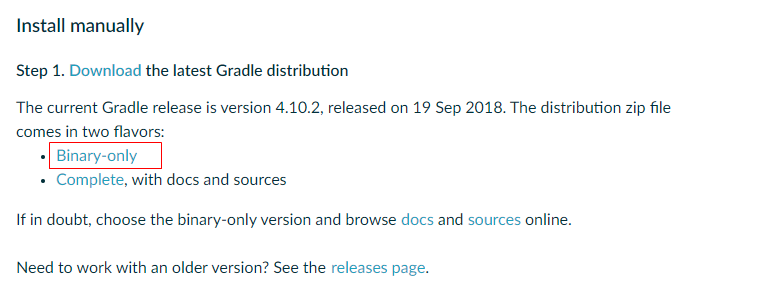


官网[下载](https://gradle.org/install/)压缩包，然后解压，配置本地环境变量。主要有下面两个：

GRADLE_HOME 是解压后的目录，

GRADLE_USER_HOME 的作用是让其他程序检测到本地.gradle文件夹的位置，

再把 %GRADLE_HOME%\bin 追加到 Path 环境变量中。

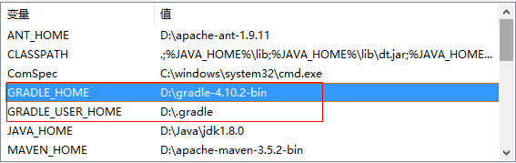


然后在D:\\.gradle目录下新建init.gradle文件，使用记事本打开粘贴下列代码：

```
allprojects{
    repositories {
        def REPOSITORY_URL = 'http://maven.aliyun.com/nexus/content/groups/public/'
        all { ArtifactRepository repo ->
            if(repo instanceof MavenArtifactRepository){
                def url = repo.url.toString()
                if (url.startsWith('https://repo1.maven.org/maven2') || url.startsWith('https://jcenter.bintray.com/')) {
                    project.logger.lifecycle "Repository ${repo.url} replaced by $REPOSITORY_URL."
                    remove repo
                }
            }
        }
        maven {
            url REPOSITORY_URL
        }
    }
}
```

即可更换maven仓库地址为国内阿里云镜像。

> mac上的安装步骤同上，环境变量文件为`~/.bash_profile`，默认的.gradle文件夹位于`~/.gradle`。

# 2.Groovy语法

打开IDEA，点击Tools，找到Groovy Console，单击。

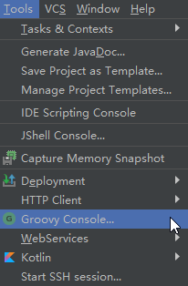


输入一些Groovy语法，单击绿色按键运行程序。

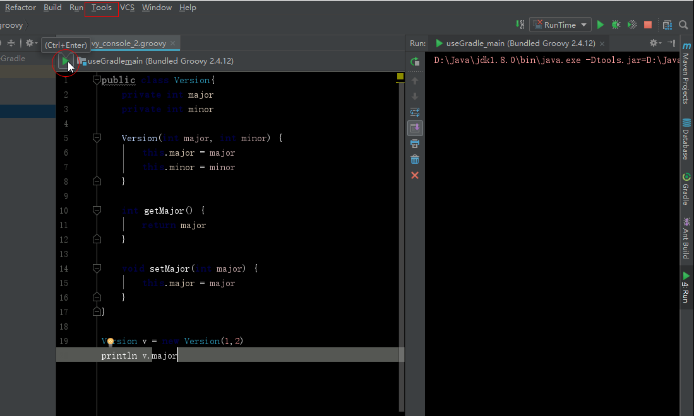


上面的程序省略了传参时的括号()，运行结果如下图：

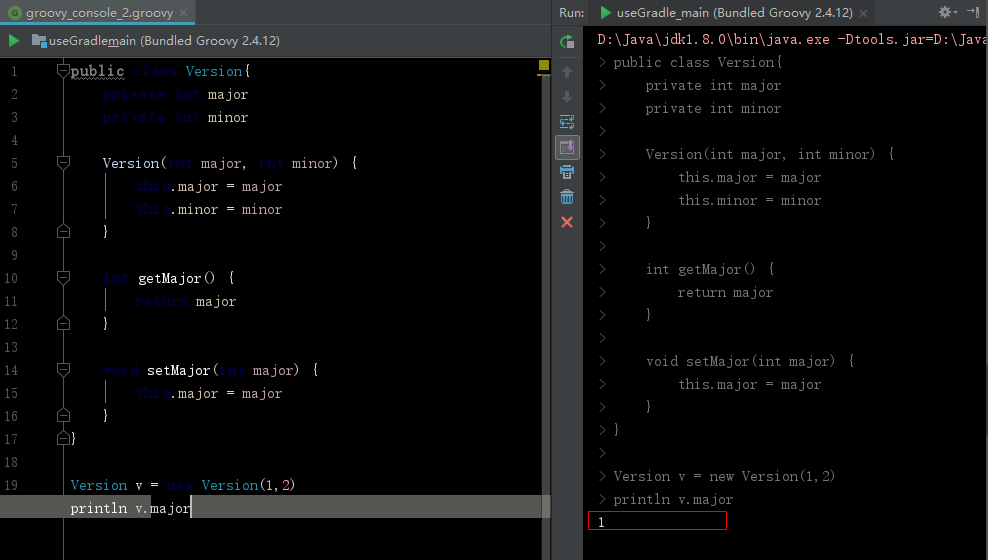


**Groovy字符串**的特性

1. 'a':只是字符串 
2. "a"：里面可以连接变量$(b)
3. '''a''':里面的字符串可以换行 

**list**: 

```
def buildTools=['ant','maven']
//添加list
buildTools << 'gradle'
```

**map**：

```
def buildYears=['ant':2000,'maven':2004]
//添加map
buildYears.gardle=2009
```

**闭包**：

闭包是一个代码块，语法如下：

```
{ [closureParameters -> ] statements }
```

其中`[]`内是可选的闭包参数，可省略。当闭包带有参数，就需要`->`来将参数和闭包体相分离。示例：

```
def c1={ v -> println v }
```

# 3.Gradle脚本

新建gradle Java项目的默认脚本文件内容：

```
plugins {
    id 'java'
}

group 'cn.zyzpp'
version '1.0-SNAPSHOT'

sourceCompatibility = 1.8

repositories {
    mavenCentral()
}

dependencies {
    testCompile group: 'junit', name: 'junit', version: '4.12'
}
```
解读脚本：
1. 方法调用基本都省略了()，比如 group('cn.zyzpp')
2. 还有给参数设值 X=x
3. 使用闭包{}来作为参数执行repositories()、dependencies()方法，这俩方法的调用同样忽略了()的书写

# 4.IDEA使用Gradle

**4.1** 新建Gradle程序。

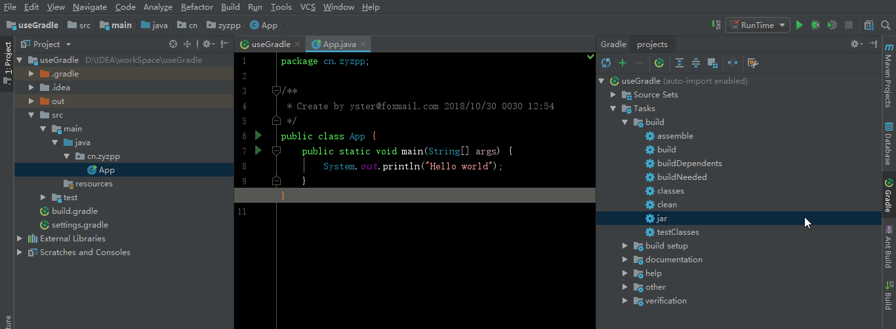


插件命令说明：

1. jar用于将文件编译为jar包；
2. build会执行build.gradle文件，由于插件是Java，所以也会将文件编译为jar包； 
3. classes会将文件转为class文件； 
4. clean会清除操作 ；

**4.2** 我们执行jar命令后，在libs目录下找到生成的jar包。

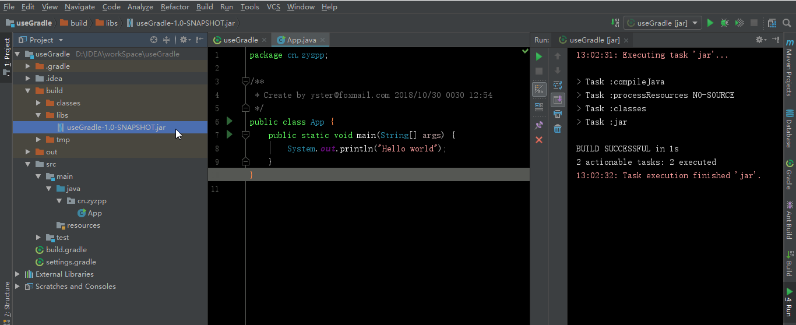

**4.3** 执行命令行 

```
java -classpath build/libs/useGradle-1.0-SNAPSHOT.jar cn.zyzpp.App
```

输出结果：

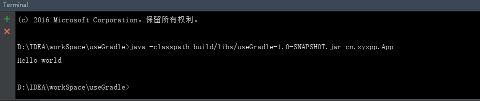

# 5.打包web项目

新建Gradle项目时选择web，点击war命令进行打包。

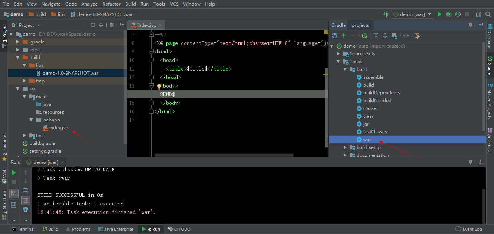

为什么会有war命令，因为plugins方法闭包参数内调用id(“war”)方法。

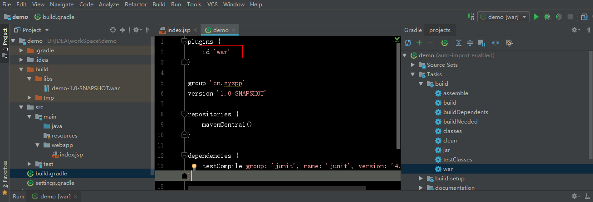

# 6.projects、tasks

Gradle 里的任何东西都是基于这两个基础概念:

- projects ( 项目 )
- tasks ( 任务 )

每一个构建都是由一个或多个 projects 构成的. 一个 project 到底代表什么依赖于你想用 Gradle 做什么. 举个例子, 一个 project 可以代表一个 JAR 或者一个网页应用.  

每一个 project 是由一个或多个 tasks 构成的. 一个 task 代表一些更加细化的构建. 可能是编译一些 classes, 创建一个 JAR, 生成 javadoc, 或者生成某个目录的压缩文件.

# 7.自定义任务

首先应该明白，gradle自带了很多task。

在build.gradle中添加自定义task很简单，代码如下：

```
//自定义一个方法，这里是创建目录
def createDir = {
    path ->
        File file = new File(path);
        if (!file.exists()){
            file.mkdirs();
        }
}
//自定义第一个task任务
task makeGroovyDir(){
    def paths = ["src/main/groovy"];
    doFirst {
        paths.forEach(createDir);
    }
}
//自定义第二个task任务
task makeJavaDir(){
    dependsOn 'makeGroovyDir'	//该任务依赖于某个任务
    def paths = ["src/main/java2"];
    doFirst {
        paths.forEach(createDir);
    }
}
```

运行图如下：

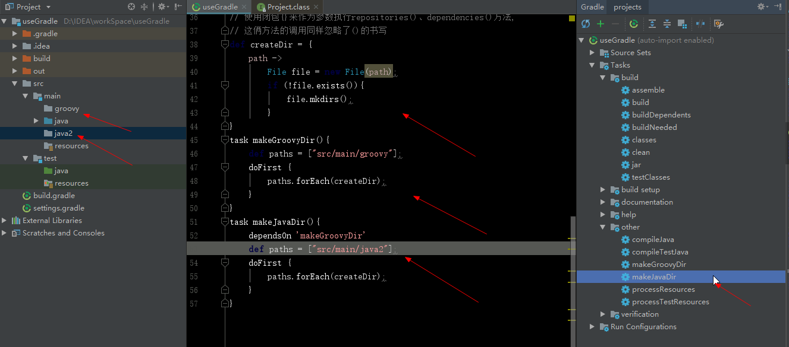

# 8.构建生命周期

**初始化**完成后的方法 -> **配置**完成后的方法 -> **执行**完成后的方法

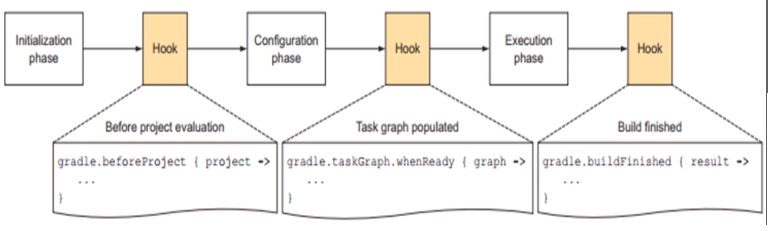

#  9.依赖管理

几乎所有的基于JVM的软件项目都需要依赖外部类库来重用现有的功能。自动化的依赖管理可以明确依赖的版本 ，解决因传递性依赖带来的版本冲突。

**9.1 依赖仓库位置**

工件坐标 group name version 

常用仓库 

1 mavenLocal() / mavenCentral() / jcenter 

2 自定义maven仓库 

```
repositories {
    maven{
        url '私服地址一般放首位'
    }
    mavenLocal()	//本地仓库
    mavenCentral()	//中央仓库
}
```

3 文件仓库（不推荐使用）

**9.2 依赖的传递性**     

b 依赖a   如果c依赖b  那么c依赖a

**9.3 依赖的阶段**

testCompile是在测试的编译阶段，其它如runtime等。

编译阶段的依赖在运行时也是存在的。典型的例子是JDBC驱动实现，项目主代码的编译只需要jdk提供的jdbc的接口，只有在执行测试或者运行测试的时候才需要实现上述接口的jdbc的驱动。

```
dependencies {
    testCompile group: 'junit', name: 'junit', version: '4.12'
    compile group: 'org.jsoup', name: 'jsoup', version: '1.10.3'
}
```

# 10.版本冲突

查看版本冲突，执行dependencies任务

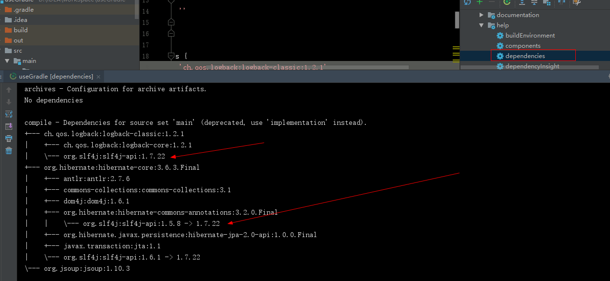

1.gradle默认会使用高版本的依赖 

2.取消默认策略，如果有版本冲突，直接让其构建失败

```
configurations.all{
    resolutionStrategy{
        failOnVersionConflict()
    }
}
```

3.排除传递性依赖（默认排除最低版本）

```
//排除哪个jar的依赖
compile('org.spring-core:3.6.3.Final'){
    //指定要排除的依赖的group和module=name,不指定版本，默认排除最低版本
    exclude group:'org.slf4j',module:'slf4j-api'
    //transitive=false//排除所有传递性依赖，比较少用
}
```

4.强制指定默认使用某个版本

```
configurations.all{
    resolutionStrategy{
        force 'org.slf4j:slf4j-api:1.7.24'
    }
}
```

备注：IDEA可能会不提示，但不要紧，依执行结果为据。

# 11.多项目构建

**11.1 新建模块**

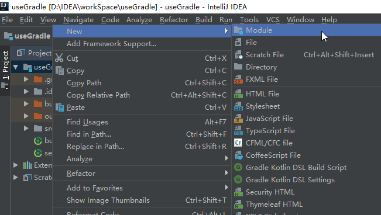

我们新建一个web模块，新建成功后如下：

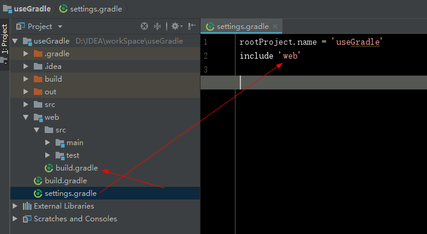

可以看到在新模块里生成了一个build.gradle文件，并且setting.gradle文件中新增了`include ‘web’`语句。

**11.2 依赖模块**

我们可以再次新建model模块。如果我们想在model模块使用web模块的类，如何写呢？

```
dependencies {
    compile project(":web")	//这里是模块名
    ...
}
```

现在通过gradle插件，查看到项目有root根模块，model模块，web模块。

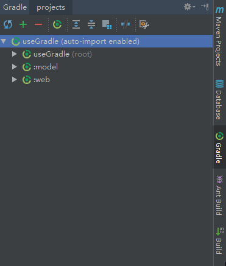

**11.3 全局配置**

我们可以在root根模块设置全局配置，比如在root模块使用allprojects：

```
allprojects{
    apply plugin : 'java'
    sourceCompatibility = 1.8
}
```

去掉其它模块的 `plugin : 'java'`，可以看到该模块依旧存在 jar 任务。

也可以使用subprojects配置这个项目的子项目：

```
subprojects {
    dependencies {
        compile 'ch.qos.logback:logback-classic:1.2.1'
        testCompile group: 'junit', name: 'junit', version: '4.12'
    }
}
```

**11.4 统一配置**

统一项目的版本，只需要在项目目录下新建gradle.properties文件，写入

```
group = 'cn.zyzpp'
version = '1.0-SNAPSHOT'
```

然后去掉其它配置文件的该内容即可。

**11.5 个性化配置**

在web模块添加war插件，只需要在web模块下的build.gradle写入

```
plugins{
    id 'war'
}
```

**11.6 总结**

当多项目构建时，每个子项目下的配置只是对与根项目不同的个性化配置。

所有相同的配置，建议还是在根项目下配置。

# 12.自动化测试

如果在test目录下编写了测试代码，在build构建项目时会自动运行这些测试代码并生成一些类似报表的html或xml。如图所示：

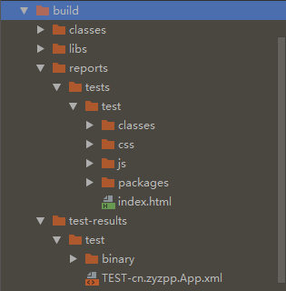

打开该HTML如图所示：

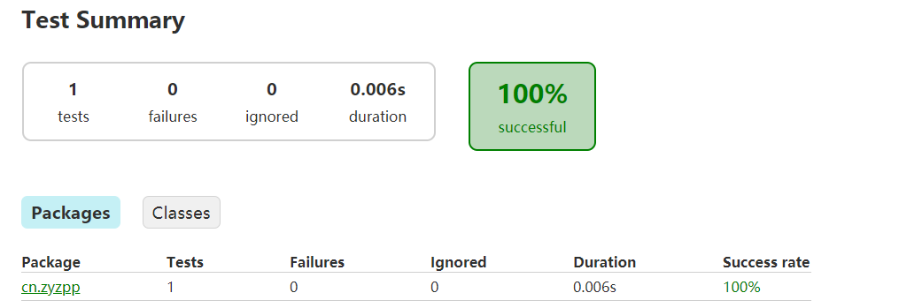

# 13.发布

在项目的build.gradle中加入:

```
apply plugin: 'maven-publish'//添加maven发布插件
//配置发布
publishing{
    //把什么发布到仓库
    publications{
        //方法名自定义
        myPublish(MavenPublication){
            from components.java//java产生的输出发布到仓库
        }
    }
    //发布的位置
    repositories{
        maven{
            mame 'myRepo'
            url '私服地址，然后执行publish即可发布到私服'
        }
    }
}
```

此时会看到Gradle project的选项卡的配置了发布信息的项目的Tasks下多出了publishing任务组，执行组下publishToMavenLocal即可发布到本地仓库，到本地仓库即可看到发布的信息。其它命令：

- publishes:发布到本地maven仓库 
- installs:发布到依赖缓存 
- uploads:发布到远程仓库

# 14.常用语句

```
// 解决打包无main函数，不包含其它依赖
jar {
    manifest {
        attributes(
                "Manifest-Version": 1.0,
                "Main-Class": "cn.zyzpp.App")//修改此处
    }
    from { configurations.compile.collect { it.isDirectory() ? it : zipTree(it) } }
    into('assets') {
        from 'assets'
    }
}
// 解决编译GBK编码问题
tasks.withType(JavaCompile) {
    options.encoding = 'UTF-8'
}
```

从Maven转Gradle还是比较容易的
