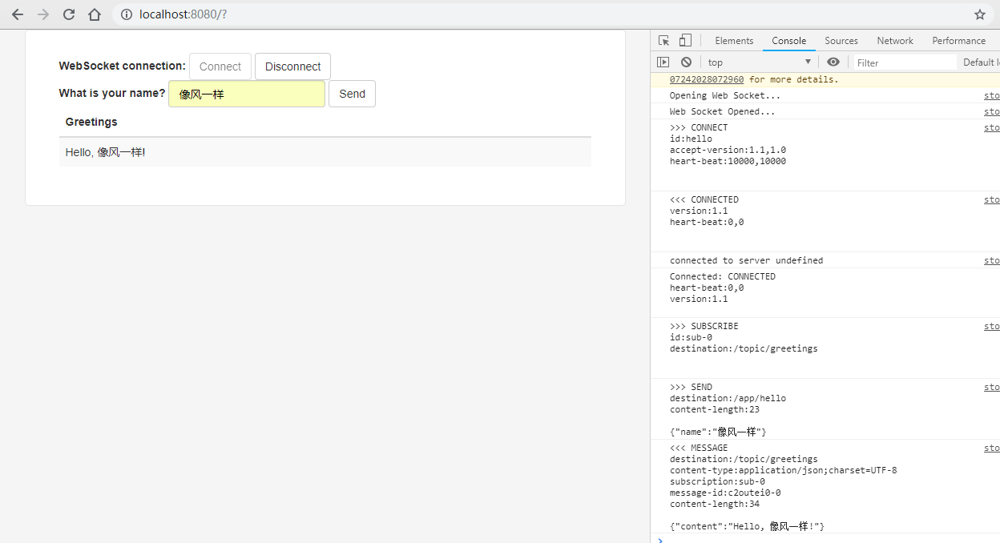
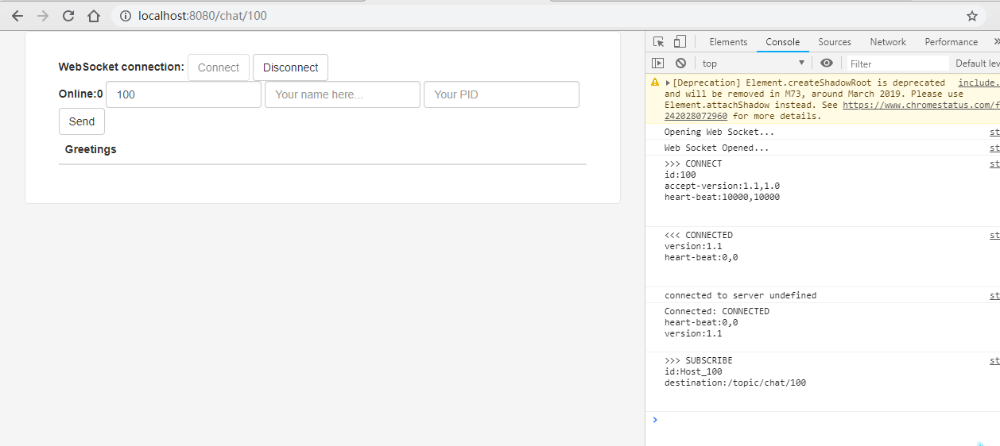
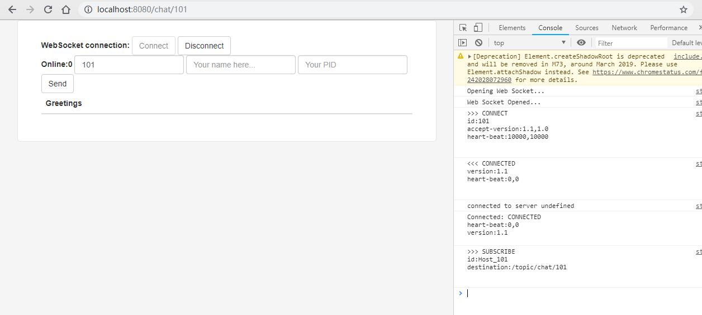
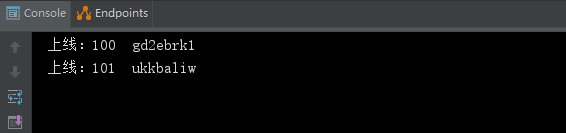
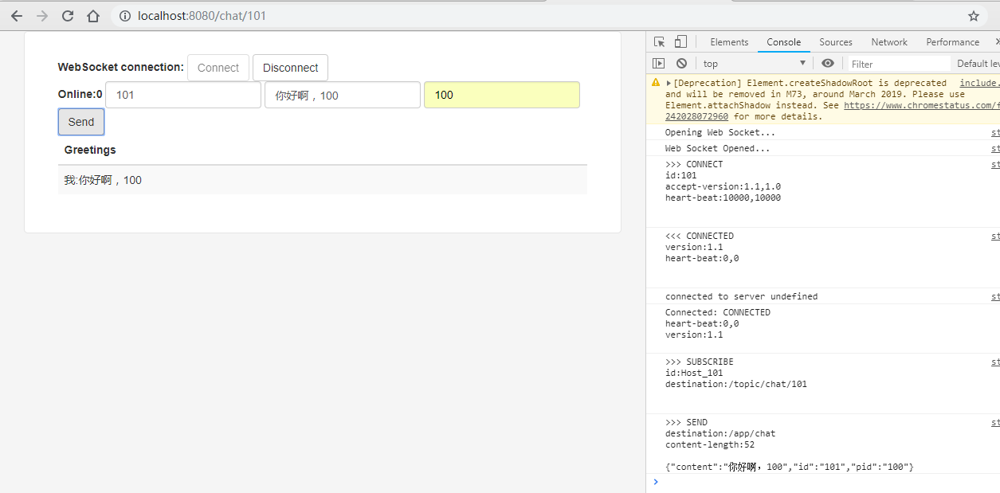
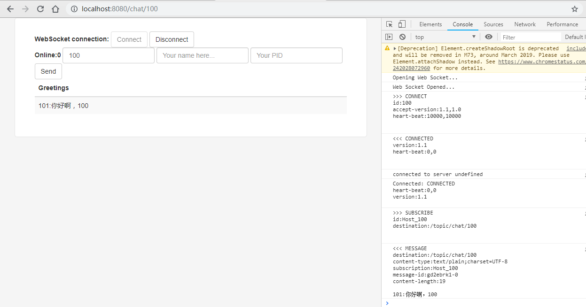
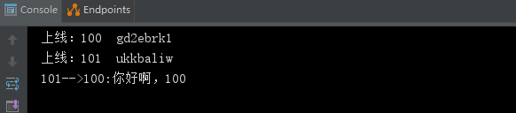
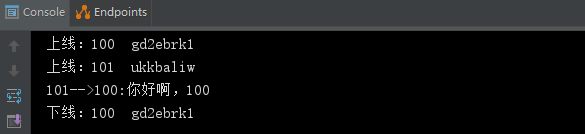

在构建Spring boot项目时已经提供webSocket依赖的勾选。webSocket是TCP之上的一个非常薄的轻量级层 ，webSocket主要的应用场景离不开即时通讯与消息推送，但只要应用程序需要在浏览器和服务器之间来回发送消息，就可以使用webSocket来降低客户端流量与服务器的负载。

下面将基于Spring boot实现一个非常简单的HelloWorld程序，用来熟悉项目构建逻辑。

# 1.导入依赖

主要的webSocket依赖

```
<dependency>
	<groupId>org.springframework.boot</groupId>
	<artifactId>spring-boot-starter-websocket</artifactId>
</dependency>
```

一些js库依赖，这里也使用maven方式导入，官网[https://www.webjars.org/](https://www.webjars.org/)

```
        <dependency>
            <groupId>org.webjars</groupId>
            <artifactId>webjars-locator-core</artifactId>
        </dependency>
        <dependency>
            <groupId>org.webjars</groupId>
            <artifactId>sockjs-client</artifactId>
            <version>1.0.2</version>
        </dependency>
        <dependency>
            <groupId>org.webjars</groupId>
            <artifactId>stomp-websocket</artifactId>
            <version>2.3.3</version>
        </dependency>
        <dependency>
            <groupId>org.webjars</groupId>
            <artifactId>bootstrap</artifactId>
            <version>3.3.7</version>
        </dependency>
        <dependency>
            <groupId>org.webjars</groupId>
            <artifactId>jquery</artifactId>
            <version>3.1.0</version>
        </dependency>
```

Thymeleaf模板引擎，不用多说了吧

```
<dependency>
    <groupId>org.springframework.boot</groupId>
    <artifactId>spring-boot-starter-thymeleaf</artifactId>
</dependency>
```

# 2.配置开启

接下来开启webSocket并配置一番

```
@Configuration
@EnableWebSocketMessageBroker
public class WebSocketConfig implements WebSocketMessageBrokerConfigurer {

    @Override
    public void registerStompEndpoints(StompEndpointRegistry registry) {
        registry.addEndpoint("/gs-guide-websocket").withSockJS();
    }
    
    @Override
    public void configureMessageBroker(MessageBrokerRegistry config) {
        config.enableSimpleBroker("/topic");
        config.setApplicationDestinationPrefixes("/app"); 
    }

}
```

这里从上向下说一下，

1）@EnableWebSocketMessageBroker注解用于开启使用STOMP协议来传输基于代理（MessageBroker）的消息，这时候控制器（controller）开始支持@MessageMapping,就像是使用@requestMapping一样。

2）registerStompEndpoints()方法只写了一行代码：

```
registry.addEndpoint("/gs-guide-websocket").withSockJS();
```

一是用来注册一个Stomp的节点（endpoint）,也就是webSocket的服务端地址，客户端在链接时使用到；

二是withSockJs()方法指定使用SockJS协议。SockJs是一个WebSocket的通信js库，Spring对这个js库进行了后台的自动支持，如果使用它不需要进行过多配置。

3）配置消息代理（MessageBroker），该方法干了两件事，一是启用一个简单的message broker并配置一个或多个前缀来过滤针对代理的目的地(例如以“/topic”为前缀的目的地)，该前戳限制了网页客户端设置本地地址时的前戳。 二是设置了一个客户端访问服务端地址的前缀。比如我们设置@MessageMapping("/hello")，那客户端要发送消息到服务器上的地址是 /app/hello。

# 3.提供接口

```
@Controller
public class GreetingController {

    @MessageMapping("/hello")
    @SendTo("/topic/greetings")
    public Greeting greeting(HelloMessage message) throws Exception {
        System.out.println("收到：" + message.toString() + "消息");
        return new Greeting("Hello, " + HtmlUtils.htmlEscape(message.getName()) + "!");
    }
```

1）@MessageMapping和@RequestMapping功能类似，用于设置URL映射地址，浏览器向服务器发起请求，需要通过该地址。

需要注意，这里设置路径为/hello，但是客户端需要访问/app/hello，原因前面已经讲述。

2）@SendTo("/topic/greetings") 设置目的地，这里的目的地是站在服务端的角度对客户端而言。客户端也需要设置相同的地址，而且必须使用/topic前戳，前面也已经讲述。

本示例中如果服务器接受到了消息，就会对订阅了@SendTo括号中的地址传送消息。

> 备注：HtmlUtils.htmlEscape()方法会将特殊字符转换为HTML字符引用。 

HelloMessage.java

```
public class HelloMessage {
    private String name;
    ...
}
```

Greeting.java

```
public class Greeting {
    private String content;
}
```

# 4.客户端

在resources/static目录下：

index.html

```
<!DOCTYPE html>
<html>
<head>
    <title>Hello WebSocket</title>
    <link href="/webjars/bootstrap/css/bootstrap.min.css" rel="stylesheet">
    <link href="/main.css" rel="stylesheet">
    <link rel="shortcut icon" href="/favicon.ico" />
    <script src="/webjars/jquery/jquery.min.js"></script>
    <script src="/webjars/sockjs-client/sockjs.min.js"></script>
    <script src="/webjars/stomp-websocket/stomp.min.js"></script>
    <script src="/app.js"></script>
</head>
<body>
<noscript><h2 style="color: #ff0000">Seems your browser doesn't support Javascript! Websocket relies on Javascript being
    enabled. Please enable
    Javascript and reload this page!</h2></noscript>
<div id="main-content" class="container">
    <div class="row">
        <div class="col-md-6">
            <form class="form-inline">
                <div class="form-group">
                    <label for="connect">WebSocket connection:</label>
                    <button id="connect" class="btn btn-default" type="submit">Connect</button>
                    <button id="disconnect" class="btn btn-default" type="submit" disabled="disabled">Disconnect
                    </button>
                </div>
            </form>
        </div>
        <div class="col-md-6">
            <form class="form-inline">
                <div class="form-group">
                    <label for="name">What is your name?</label>
                    <input type="text" id="name" class="form-control" placeholder="Your name here...">
                </div>
                <button id="send" class="btn btn-default" type="submit">Send</button>
            </form>
        </div>
    </div>
    <div class="row">
        <div class="col-md-12">
            <table id="conversation" class="table table-striped">
                <thead>
                <tr>
                    <th>Greetings</th>
                </tr>
                </thead>
                <tbody id="greetings">
                </tbody>
            </table>
        </div>
    </div>
</div>
</body>
</html>
```

main.css

```
body {
    background-color: #f5f5f5;
}

#main-content {
    max-width: 940px;
    padding: 2em 3em;
    margin: 0 auto 20px;
    background-color: #fff;
    border: 1px solid #e5e5e5;
    -webkit-border-radius: 5px;
    -moz-border-radius: 5px;
    border-radius: 5px;
}
```

app.js

```
var stompClient = null;

function setConnected(connected) {
    $("#connect").prop("disabled", connected);
    $("#disconnect").prop("disabled", !connected);
    if (connected) {
        $("#conversation").show();
    }
    else {
        $("#conversation").hide();
    }
    $("#greetings").html("");
}

function connect() {
    var socket = new SockJS('/gs-guide-websocket'); 
    stompClient = Stomp.over(socket);
    stompClient.connect({"id": "header"}, function (frame) {
        setConnected(true);
        console.log('Connected: ' + frame);
        stompClient.subscribe('/topic/greetings', function (greeting) { 
            showGreeting(JSON.parse(greeting.body).content);
        });
    });
}

function disconnect() {
    if (stompClient !== null) {
        stompClient.disconnect();
    }
    setConnected(false);
    console.log("Disconnected");
}

function sendName() {
    stompClient.send("/app/hello", {}, JSON.stringify({'name': $("#name").val()})); 
}

function showGreeting(message) {
    $("#greetings").append("<tr><td>" + message + "</td></tr>");
}

$(function () {
    $("form").on('submit', function (e) {
        e.preventDefault();
    });
    $( "#connect" ).click(function() { connect(); });
    $( "#disconnect" ).click(function() { disconnect(); });
    $( "#send" ).click(function() { sendName(); });
});
```

这部分最值得说的就是JS部分了，比较简单主要就是3个点击事件，包括连接、断开、发送消息。

当我们点击了连接后，会新建SockjS对象，并设置服务端的连接点（/gs-guide-websocket），这里的连接点由服务端提供。

subscribe()方法的第一个参数是注册客户端地址，注意前戳必须是/topic开头，因为在前面服务端已经配置了目的地前戳。与@SendTo中的地址对应。

客户端发送消息只需要调用send()方法，还方法的第一个参数是服务端@MessageMapping地址并且加了指定的/app前戳，第二个参数为header头部信息，第三个是发送的消息内容。

# 5.运行程序




成功实现Hello World程序，下面将通过搭建一个一对一聊天服务器，深入学习更多的socket知识。

# 6.发送消息

在前面我们写了一个自动回复的小例子，用到了@MessageMapping("/hello")和@SendTo("/topic/greetings")两个注解，其实我们还可以使用编程的方式发送消息。

其实很简单，直接引用该消息模板

```
    @Autowired
    private SimpMessagingTemplate messagingTemplate;
```

消息模板内置了一系列方法，比如

```
void convertAndSendToUser(String user, String destination, Object payload)

void convertAndSend(D destination, Object payload)
```

这俩方法会包装为消息并将其发送到给定的目的地。 

# 7.STOMP监听

监听webSocket服务器的连接只需要实现ApplicationListener<>接口。代码如下：

```
@Component
public class STOMPConnectEventListener implements ApplicationListener<SessionConnectEvent> {

    @Override
    public void onApplicationEvent(SessionConnectEvent event) {
        StompHeaderAccessor sha = StompHeaderAccessor.wrap(event.getMessage());
        //判断客户端的连接状态
        switch (sha.getCommand()) {
            case CONNECT:
                System.out.println("上线");
                break;
            case DISCONNECT:
                System.out.println("下线");
                break;
            case SUBSCRIBE:
                System.out.println("订阅");
                break;
            case SEND:
                System.out.println("发送");
                break;
            case UNSUBSCRIBE:
                System.out.println("取消订阅");
                break;
            default:
                break;
        }
    }
}
```

监听的所有状态被封装在一个枚举类中，其实还有很多，这里不再一一列举。

有了上面这些知识，我们就可以基于此开发一对一聊天服务器。

# 8.Session存取

webSocket提供的是一个socket框架，并不会帮我们管理session，我们需要自己去编写session管理类，进行session的读写。代码如下：

```
@Component
public class SocketSessionMap {
    private final static ConcurrentMap<String, String> sessionMap = new ConcurrentHashMap<>();

    /**
     * 注册Session
     * @param userId
     * @param sessionId
     */
    public synchronized void registerSession(String userId, String sessionId) {
        sessionMap.put(userId,sessionId);
    }

    /**
     * 移除Session
     * @param userId
     * @param sessionId
     */
    public synchronized void removeSession(String userId, String sessionId) {
        sessionMap.remove(userId);
    }

    /**
     * 获取用户的SessionId
     * @param userId
     * @return
     */
    public String getUserSessionId(String userId){
        return sessionMap.get(userId);
    }

    /**
     * 获取所有Session集合
     * @return
     */
    public Map<String, String> queryAllSession(){
        return sessionMap;
    }
    /**
     * 获取集合的大小
     */
    public int onlineCount(){
        return sessionMap.size();
    }
}
```

# 9.监听注册

接着，对STOMP监听类进行扩展。

```
@Component
public class STOMPConnectEventListener implements ApplicationListener<SessionConnectEvent> {

    @Autowired
    SocketSessionMap socketSessionMap;

    @Override
    public void onApplicationEvent(SessionConnectEvent event) {
        StompHeaderAccessor sha = StompHeaderAccessor.wrap(event.getMessage());
        String userId = sha.getFirstNativeHeader("id"); 
        String sessionId = sha.getSessionId();
        switch (sha.getCommand()) {
            case CONNECT:
                System.out.println("上线：" + userId + "  " + sessionId);
                socketSessionMap.registerSession(userId, sessionId);
                break;
            default:
                break;
        }
    }
}
```

服务端通过`sha.getFirstNativeHeader("id")`读取到客户端的ID，这个值需要网页客户端手动在header头部信息中设置。

当服务端监听到客户端连接时，会将用户SessionId注册到Map中。

# 10.监听下线

这里我们使用更可靠的请求下线方式，代码如下：

```
    @MessageMapping("/chatOut")
    public void sayHello(String userId) {
        String sessionId = socketSessionMap.getUserSessionId(userId);
        System.out.println("下线：" + userId + "  " + sessionId);
        socketSessionMap.removeSession(userId,sessionId);
    }
```

当收到下线请求时，移除SessionId。

关于Session，也可以设置一个最大值，超时自动移除。

# 11.一对一消息处理

在一对一服务器中，主要处理的就是一对一的消息发送。大致逻辑是接收客户端消息，分析消息结构，通过SessionMap判断对方是否在线，然后发送相应内容。代码如下：

```
    @MessageMapping("/chat")
    public void sayHello(Message user) {
        System.out.println(user.getId()+"-->"+user.getPid()+":"+user.getContent());
        String userPid = String.valueOf(user.getPid());
        String userId = String.valueOf(user.getId());
        String sendTo = "/topic/chat/"+userPid;
        String content = user.getId()+":"+user.getContent();
        if (socketSessionMap.getUserSessionId(userPid)!=null){
            messagingTemplate.convertAndSend(sendTo, HtmlUtils.htmlEscape(content));
        }else {
            sendTo = "/topic/chat/"+userId;
            content = "对方已下线";
            messagingTemplate.convertAndSend(sendTo, HtmlUtils.htmlEscape(content));
        }
    }
```

值得一体的是，关于用户ID的处理，这里使用的是自定义客户端地址，不同的地址表示不同的用户。最后通过convertAndSend()方法发送，这种方式比较可靠方便。

Message.java

```
public class Message {
    private int id; //用户ID
    private String content;//发送内容
    private int pid;    //发送到用户
```

# 12.聊天网页

服务端使用FreeMarker模板引擎返回html网页，代码如下：

```
    @RequestMapping("/chat/{id}")
    public String chat_page(@PathVariable int id, ModelMap model) {
        model.addAttribute("id", id);
        int count = socketSessionMap.onlineCount();
        model.addAttribute("count", count);
        return "chat";
    }
```

通过RESTful形式的URl注册ID。

chat.html

```
<!DOCTYPE html >
<html xmlns:th="http://www.thymeleaf.org">
<head>
    <title>Hello WebSocket</title>
    <link href="/webjars/bootstrap/css/bootstrap.min.css" rel="stylesheet">
    <link href="/main.css" rel="stylesheet">
    <link rel="shortcut icon" href="/favicon.ico" />
    <script src="/webjars/jquery/jquery.min.js"></script>
    <script src="/webjars/sockjs-client/sockjs.min.js"></script>
    <script src="/webjars/stomp-websocket/stomp.min.js"></script>
    <script src="/chat.js"></script>
</head>
<body>
<noscript><h2 style="color: #ff0000">Seems your browser doesn't support Javascript! Websocket relies on Javascript being
    enabled. Please enable
    Javascript and reload this page!</h2></noscript>
<div id="main-content" class="container">
    <div class="row">
        <div class="col-md-6">
            <form class="form-inline">
                <div class="form-group">
                    <label for="connect">WebSocket connection:</label>
                    <button id="connect" class="btn btn-default" type="submit">Connect</button>
                    <button id="disconnect" class="btn btn-default" type="submit" disabled="disabled">Disconnect
                    </button>
                </div>
            </form>
        </div>
        <div class="col-md-6">
            <form class="form-inline">
                <div class="form-group">
                    <label th:text="'Online:'+${count}"> </label>
                    <input type="text" id="id" class="form-control" th:value="${id}"required>
                    <input type="text" id="content" class="form-control" placeholder="Your name here..."required>
                    <input type="text" id="pid" class="form-control" placeholder="Your PID"required>
                </div>
                <button id="send" class="btn btn-default" type="submit">Send</button>
            </form>
        </div>
    </div>
    <div class="row">
        <div class="col-md-12">
            <table id="conversation" class="table table-striped">
                <thead>
                <tr>
                    <th>Greetings</th>
                </tr>
                </thead>
                <tbody id="greetings">
                </tbody>
            </table>
        </div>
    </div>
</div>
</body>
</html>
```

chat.js

```
var stompClient = null;

function setConnected(connected) {
    $("#connect").prop("disabled", connected);
    $("#disconnect").prop("disabled", !connected);
    if (connected) {
        $("#conversation").show();
    }
    else {
        $("#conversation").hide();
    }
    $("#greetings").html("");
}

function connect() {
    var socket = new SockJS('/gs-guide-websocket');
    stompClient = Stomp.over(socket);
    stompClient.connect({"id": $("#id").val()}, function (frame) { //客户端ID
        setConnected(true);
        console.log('Connected: ' + frame);
        stompClient.subscribe('/topic/chat/' + $("#id").val(), function (greeting) { //表明客户端地址
            showGreeting(greeting.body);
        }, {"id": "Host_" + $("#id").val()});
    });
}

function disconnect() {
    if (stompClient !== null) {
        stompClient.send("/app/chatOut", {},$("#id").val());
        stompClient.disconnect();
    }
    setConnected(false);
    console.log("Disconnected");
}

function sendName() {
    stompClient.send("/app/chat", {}, JSON.stringify({
        'content': $("#content").val(),
        'id': $("#id").val(),
        'pid': $("#pid").val()
    }));
    showGreeting("我:" + $("#content").val())
}

function showGreeting(message) {
    $("#greetings").append("<tr><td>" + message + "</td></tr>");
}

$(function () {
    $("form").on('submit', function (e) {
        e.preventDefault();
    });
    $("#connect").click(function () {
        connect();
    });
    $("#disconnect").click(function () {
        disconnect();
    });
    $("#send").click(function () {
        sendName();
    });
});
```

网页客户端的主要逻辑在chat.js中。非常有必要的是在stompClient.connect()方法的第一个参数中传入header头信息，该头部信息必须设置id字段的值，因为服务端会读取该ID值，该值最终会取自URL中的参数。

其次是在用户断开链接前，会向服务端发送断开通知。

```
stompClient.send("/app/chatOut", {},$("#id").val());
```

# 13.程序演示

打开两个网页，URl分别为http://localhost:8080/chat/100和http://localhost:8080/chat/101，点击连接。






查看控制台输出：



接下来演示用户101向用户100发送消息：




查看用户100收到信息：



再次查看控制输出：




消息成功发送！

当用户断开链接时，控制台输出为：




------

关于Spring boot webSocket就先到这里，更多请持续关注我的博客！

