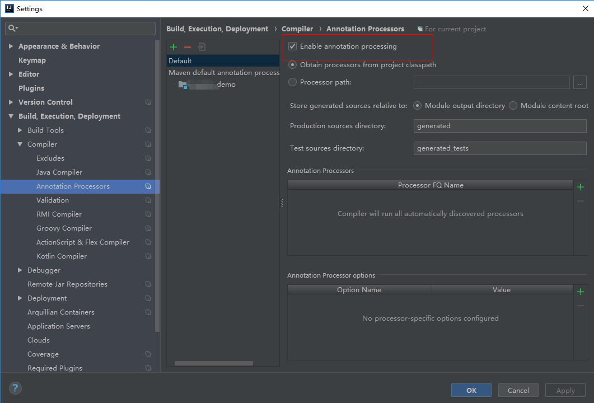

> Spring Boot在工作中是用到的越来越广泛了，简单方便，有了它，效率提高不知道多少倍。Spring Boot配置文件对Spring Boot来说就是入门和基础，经常会用到，所以写下做个总结以便日后查看。

# 1.配置文件

当我们构建完Spring Boot项目后，会在resources目录下给我们一个默认的全局配置文件 application.properties，这是一个空文件，因为Spring Boot在底层已经把配置都给我们自动配置好了，当在配置文件进行配置时，会修改SpringBoot自动配置的默认值。

配置文件名是固定的：**application.properties**

但我们可以修改为：**application.yml**

这两个文件本质是一样的，区别只是其中的语法略微不同。

# 2.值的写法

application.properties 配置文件比较简单，形式如下

```java
key = value
```

application.yml 配置文件使用YMAL语言，YMAL不是如XML般的标记语言，更适合作为配置文件。

下面说下对于不同类型（字符串、数组）如何去规范书写。

## 2.1 数字，字符串，布尔

1.直接写

```java
name=zhangsan
```

2.双引号

不会转义字符串里面的特殊字符，特殊字符会作为本身想表示的意思

   ```java
name: "zhangsan \n lisi"
   ```
输出：

```java
zhangsan
lisi
```

3.单引号

会转义特殊字符，特殊字符最终只是一个普通的字符串数据

   ```java
name: ‘zhangsan \n lisi’
   ```
输出：

```java
zhangsan \n lisi
```

## 2.2 对象、Map（属性和值）（键值对）

例如配置类中的字段为

```java
Map<String,String> maps;
```

在**yml**配置文件中，行内写法

```yaml
person.maps: {key1: value1,key2: value2}
```

需要注意:号后的空格，或者

```yaml
person:
  maps:
   key: value
```

在**properties**配置文件中

```properties
person.maps.key=value
```

## 2.3 数组（List、Set）

在**yml**配置文件中

```yaml
person:
  list:
   - 1
   - 2
   - 3
```

行内写法

```yaml
person:
  list: [1,2,3]
```

在**properties**配置文件中

```properties
person.list[0]=1
person.list[1]=2
person.list[2]=3
```

# 3.自定义配置属性

Spring Boot提供自定义配置组件，拿前面举例的属性来写一个规范的配置文件关联类：

```java
@Component // 或者@Configuration
@ConfigurationProperties(prefix = "person")
public class Person {
    private Map<String,String> maps;
    private List<String> list;
    private String name;

    public Map<String, String> getMaps() {
        return maps;
    }

    public void setMaps(Map<String, String> maps) {
        this.maps = maps;
    }

    public List<String> getList() {
        return list;
    }

    public void setList(List<String> list) {
        this.list = list;
    }
    public String getName() {
        return name;
    }

    public void setName(String name) {
        this.name = name;
    }
}
```

@ConfigurationProperties 注解向Spring Boot声明该类中的所有属性和配置文件中相关的配置进行绑定。`prefix = "person"` : 声明配置前戳，将该前戳下的所有属性进行映射。

@Component 或者@Configuration：将该组件加入Spring Boot容器，只有这个组件是容器中的组件，配置才生效。

> 扩展：也可以通过 @Value("${key}") 读取配置文件中的属性，key = properties文件等号左边的部分。
> 
> @Value("${Key}") 可以搭配使用 @Value("#{...}")，#{…}的{}里面的内容必须符合SpEL表达式，且和#{…}混合使用时，必须#{}外面，${}在里面。

# 4.配置自动提示

在配置自定义属性时，如果想要获得和配置Spring Boot属性自动提示一样的功能，则需要加入下面的依赖：

```xml
<!--导入配置文件处理器，配置文件进行绑定就会有提示-->
<dependency>
   <groupId>org.springframework.boot</groupId>
   <artifactId>spring-boot-configuration-processor</artifactId>
   <optional>true</optional>
</dependency>
```

若是依旧无法自动提示，可以尝试开启IDE的Annonation Processing



# 5.配置属性校验

自定义配置文件时，可以使用 @Validated 注解对注入的值进行一些简单的校验，示例代码

```java
@Validated
@Configuration
@ConfigurationProperties(prefix = "person")
public class Person {
    @Email
    private String mail;

    public String getMail() {
        return mail;
    }
  
    public void setMail(String mail) {
        this.mail = mail;
    }
}
```

@Email 注解会对mail字段的注入值进行检验，如果注入的不是一个合法的邮件地址则会抛出异常。

其它常见注解：

- @AssertFalse  校验false
- @AssertTrue  校验true
- @DecimalMax(value=,inclusive=)  小于等于value，inclusive=true，是小于等于
- @DecimalMin(value=,inclusive=)  与上类似
- @Max(value=)  小于等于value
- @Min(value=)  大于等于value
- @NotNull   检查Null
- @Past   检查日期
- @Pattern(regex=,flag=)  正则
- @Size(min=, max=)  字符串，集合，map限制大小
- @Validate   对po实体类进行校验

上述的这些注解位于 javax.validation.constraints 包下，具体用法查看注释即可了解。

# 6.自定义配置文件

除了在默认的application文件进行属性配置，我们也可以自定义配置文件，例如新建 peoson.properties ，配置内容如下

```java
person.mail=codeblog@qq.com
```

然后在配置类中使用@PropertySource注解注入该配置文件

```java
@Configuration
@ConfigurationProperties(prefix = "person")
@PropertySource(value = "classpath:person.properties")
public class Person {
    private String mail;
    
    public String getMail() {
        return mail;
    }

    public void setMail(String mail) {
        this.mail = mail;
    }
}
```

测试@PropertySource注解不支持注入yml文件。

> 扩展： @ImportResource：该注解导入Spring的xml配置文件，让配置文件里面的内容生效。
>
> 例如： @ImportResource(locations = {"classpath:beans.xml"})

# 7.配置文件占位符

Spring Boot配置文件支持占位符，一些用法如下

## 7.1 随机数

```java
${random.value}
${random.int}
${random.long}
${random.int(10)}
${random.int[1024,65536]}
```

## 7.2 默认值

占位符获取之前配置的值，如果没有可以是用:指定默认值

```properties
person.last-name=张三${random.uuid}
person.age=${random.int}
person.birth=2017/12/15
person.boss=false
person.maps.k1=v1
person.maps.k2=14
person.lists=a,b,c
person.dog.name=${person.hello:hello}_dog
person.dog.age=15
```

# 8.多配置文件

## 8.1 多Profile文件

我们在主配置文件编写的时候，文件名可以是 application-{profile}.properties/yml

默认使用application.properties的配置

## 8.2 yml支持多文档块方式

通过---可以把一个yml文档分割为多个，并可以通过 spring.profiles.active 属性指定使用哪个配置文件

```yaml
server:
  port: 8081
spring:
  profiles:
    active: prod #指定使用哪个环境

---
server:
  port: 8083
spring:
  profiles: dev  #指定属于哪个环境


---

server:
  port: 8084
spring:
  profiles: prod  #指定属于哪个环境
```

## 8.3 激活指定profile

无论是使用上述多文档块的方式，还是新建application-dev.yml文件，都可以在配置文件中指定  spring.profiles.active=dev 激活指定的profile，或者

1.使用命令行：

```java
java -jar spring-boot-02-config-0.0.1-SNAPSHOT.jar --spring.profiles.active=dev
```

可以直接在测试的时候，配置传入命令行参数

2.虚拟机参数：

```java
-Dspring.profiles.active=dev
```

# 9.配置文件加载位置

springboot 启动会扫描以下位置的application.properties或者application.yml文件作为Spring boot的默认配置文件

- –file:./config/

- –file:./

- –classpath:/config/

- –classpath:/

优先级由高到底，高优先级的配置会覆盖低优先级的配置；SpringBoot会从这四个位置全部加载主配置文件。

项目打包好以后，我们可以使用命令行参数的形式，启动项目的时候来指定配置文件的新位置；指定配置文件和默认加载的这些配置文件共同起作用形成互补配置；

我们还可以通过spring.config.location来改变默认的配置文件位置，示例：

```java
java -jar spring-boot-demo-0.0.1-SNAPSHOT.jar --spring.config.location=G:/application.properties
```

# 10.外部配置加载顺序

SpringBoot也可以从以下位置加载配置，优先级从高到低，高优先级的配置覆盖低优先级的配置，所有的配置会形成互补配置。

1.命令行参数

所有的配置都可以在命令行上进行指定

```java
java -jar spring-boot-02-config-02-0.0.1-SNAPSHOT.jar --server.port=8087  --server.context-path=/abc
```

多个配置用空格分开，形如 `--配置项=值`

2.来自java:comp/env的JNDI属性

3.Java系统属性（System.getProperties()）

4.操作系统环境变量

5.RandomValuePropertySource配置的random.*属性值

***由jar包外向jar包内进行寻找***

优先加载带{profile}

6.jar包外部的application-{profile}.properties或application.yml(带spring.profile)配置文件

7.jar包内部的application-{profile}.properties或application.yml(带spring.profile)配置文件

再来加载不带profile

8.jar包外部的application.properties或application.yml(不带spring.profile)配置文件

9.jar包内部的application.properties或application.yml(不带spring.profile)配置文件


10.@Configuration注解类上的@PropertySource

11.通过SpringApplication.setDefaultProperties指定的默认属性

# 11.自动配置原理

## 11.1 自动配置原理

1.SpringBoot启动的时候加载主配置类，@EnableAutoConfiguration注解开启了自动配置功能。

2.@EnableAutoConfiguration 作用：

- 利用EnableAutoConfigurationImportSelector给容器中导入一些组件

- 可以查看selectImports()方法的内容；

- List\<String> configurations = getCandidateConfigurations(annotationMetadata,  attributes);获取候选的配置

- 
    SpringFactoriesLoader.loadFactoryNames()
    扫描所有jar包类路径下  META-INF/spring.factories
    把扫描到的这些文件的内容包装成properties对象
    从properties中获取到EnableAutoConfiguration.class类（类名）对应的值，然后把他们添加在容器中
    

    将类路径下  META-INF/spring.factories 里面配置的所有EnableAutoConfiguration的值加入到了容器中

每一个这样的  xxxAutoConfiguration类都是容器中的一个组件，都加入到容器中,用他们来做自动配置。

```java
# Auto Configure
org.springframework.boot.autoconfigure.EnableAutoConfiguration=\
org.springframework.boot.autoconfigure.admin.SpringApplicationAdminJmxAutoConfiguration,\
......
```

3.对每一个自动配置类进行自动配置功能。

以HttpEncodingAutoConfiguration（Http编码自动配置）为例解释自动配置原理；

```java
@Configuration   //表示这是一个配置类，以前编写的配置文件一样，也可以给容器中添加组件
@EnableConfigurationProperties(HttpEncodingProperties.class) //启动指定类的ConfigurationProperties功能；将配置文件中对应的值和HttpEncodingProperties绑定起来；并把HttpEncodingProperties加入到ioc容器中

@ConditionalOnWebApplication 
//Spring底层@Conditional注解（Spring注解版），根据不同的条件，如果满足指定的条件，整个配置类里面的配置就会生效；判断当前应用是否是web应用，如果是，当前配置类生效

@ConditionalOnClass(CharacterEncodingFilter.class)  
//判断当前项目有没有这个类CharacterEncodingFilter；SpringMVC中进行乱码解决的过滤器；

@ConditionalOnProperty(prefix = "spring.http.encoding", value = "enabled", matchIfMissing = true)  
//判断配置文件中是否存在某个配置  spring.http.encoding.enabled；如果不存在，判断也是成立的
//即使我们配置文件中不配置pring.http.encoding.enabled=true，也是默认生效的；
public class HttpEncodingAutoConfiguration {
  
  	//他已经和SpringBoot的配置文件映射了
  	private final HttpEncodingProperties properties;
  
   //只有一个有参构造器的情况下，参数的值就会从容器中拿
  	public HttpEncodingAutoConfiguration(HttpEncodingProperties properties) {
		this.properties = properties;
	}
  
    @Bean   //给容器中添加一个组件，这个组件的某些值需要从properties中获取
	@ConditionalOnMissingBean(CharacterEncodingFilter.class) //判断容器没有这个组件
	public CharacterEncodingFilter characterEncodingFilter() {
		CharacterEncodingFilter filter = new OrderedCharacterEncodingFilter();
		filter.setEncoding(this.properties.getCharset().name());
		filter.setForceRequestEncoding(this.properties.shouldForce(Type.REQUEST));
		filter.setForceResponseEncoding(this.properties.shouldForce(Type.RESPONSE));
		return filter;
	}
```

根据当前不同的条件判断，决定这个配置类是否生效。

一但这个配置类生效，这个配置类就会给容器中添加各种组件，这些组件的属性是从对应的properties类中获取的，这些类里面的每一个属性又是和配置文件绑定的。

5.所有在配置文件中能配置的属性都是在xxxxProperties类中封装者，配置文件能配置什么就可以参照某个功能对应的这个属性类

```java
@ConfigurationProperties(prefix = "spring.http.encoding")  //从配置文件中获取指定的值和bean的属性进行绑定
public class HttpEncodingProperties {

   public static final Charset DEFAULT_CHARSET = Charset.forName("UTF-8");
```

**精髓：**

1）SpringBoot启动会加载大量的自动配置类
	
2）先看我们需要的功能有没有SpringBoot默认写好的自动配置类
	
3）再来看这个自动配置类中到底配置了哪些组件（只要我们要用的组件有，我们就不需要再来配置了）
	
4）给容器中自动配置类添加组件的时候，会从properties类中获取某些属性。我们就可以在配置文件中指定这些属性的值

> xxxxAutoConfigurartion：自动配置类；给容器中添加组件；
>
> xxxxProperties:封装配置文件中相关属性；
>

## 11.2 @Conditional注解

@Conditional派生注解（Spring注解版原生的@Conditional作用）

作用：必须是@Conditional指定的条件成立，才给容器中添加组件，配置配里面的所有内容才生效。

| @Conditional扩展注解            | 作用（判断是否满足当前指定条件）                 |
| ------------------------------- | ------------------------------------------------ |
| @ConditionalOnJava              | 系统的java版本是否符合要求                       |
| @ConditionalOnBean              | 容器中存在指定Bean；                             |
| @ConditionalOnMissingBean       | 容器中不存在指定Bean；                           |
| @ConditionalOnExpression        | 满足SpEL表达式指定                               |
| @ConditionalOnClass             | 系统中有指定的类                                 |
| @ConditionalOnMissingClass      | 系统中没有指定的类                               |
| @ConditionalOnSingleCandidate   | 容器中只有一个指定的Bean，或者这个Bean是首选Bean |
| @ConditionalOnProperty          | 系统中指定的属性是否有指定的值                   |
| @ConditionalOnResource          | 类路径下是否存在指定资源文件                     |
| @ConditionalOnWebApplication    | 当前是web环境                                    |
| @ConditionalOnNotWebApplication | 当前不是web环境                                  |
| @ConditionalOnJndi              | JNDI存在指定项                                   |

自动配置类必须在一定的条件下才能生效。

我们怎么知道哪些自动配置类生效？

我们可以通过在properties（yml）启用  debug=true 属性来让控制台打印自动配置报告，这样我们就可以很方便的知道哪些自动配置类生效。

```java
============================
CONDITIONS EVALUATION REPORT
============================


Positive matches:（自动配置类启用的）
-----------------

   CodecsAutoConfiguration matched:
      - @ConditionalOnClass found required class 'org.springframework.http.codec.CodecConfigurer'; @ConditionalOnMissingClass did not find unwanted class (OnClassCondition)

   CodecsAutoConfiguration.JacksonCodecConfiguration matched:
      - @ConditionalOnClass found required class 'com.fasterxml.jackson.databind.ObjectMapper'; @ConditionalOnMissingClass did not find unwanted class (OnClassCondition)
.......
Negative matches:（没有启动，没有匹配成功的自动配置类）
-----------------

   ActiveMQAutoConfiguration:
      Did not match:
         - @ConditionalOnClass did not find required classes 'javax.jms.ConnectionFactory', 'org.apache.activemq.ActiveMQConnectionFactory' (OnClassCondition)

   AopAutoConfiguration:
      Did not match:
         - @ConditionalOnClass did not find required classes 'org.aspectj.lang.annotation.Aspect', 'org.aspectj.lang.reflect.Advice', 'org.aspectj.weaver.AnnotatedElement' (OnClassCondition)
```

# 参考

[docs.spring.io官方文档](https://docs.spring.io/spring-boot/docs/1.5.9.RELEASE/reference/htmlsingle/#boot-features-external-config)