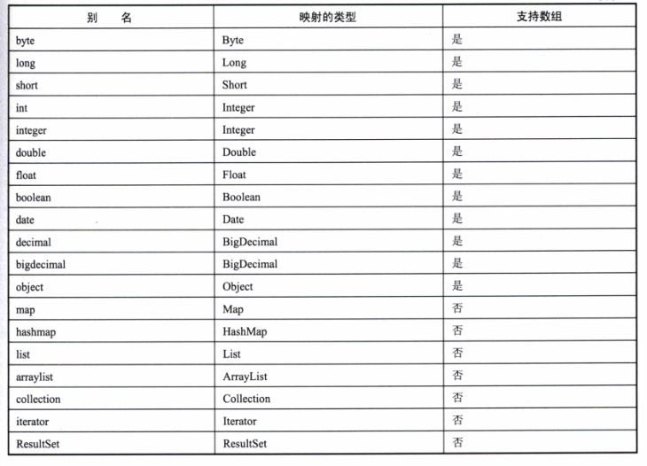

# 第1章 Mybatis简介

## 1.1 传统的JDBC编程

分为以下几步：

1. 使用JDBC编程需要连接数据库，注册驱动和数据库信息。
2. 操作Connection，打开Statement对象。
3. 通过Statement执行SQL，返回结果到ResultSet对象。
4. 使用ResultSet读取数据，然后通过代码转化为具体的POJO对象。
5. 关闭数据库相关资源。

弊端：工作量较大。

## 1.2 ORM模型

什么是ORM模型？

简单说，ORM模型就是数据库的表和简单Java对象（Plain Ordinary Java Object，简称 POJO）的映射关系模型，它主要解决的就是数据库数据和POJO对象的相互映射。我们通过这层映射关系就可以简单迅速地把数据库表的数据转化为POJO，以便程序员更加容易理解和应用Java程序。


## 1.4 MyBatis

MyBatis 所需要提供的映射文件包含以下三个部分：

- SQL
- 映射规则
- POJO

下图所示为MyBatis的ORM映射模型：


为了使用MyBatis，我们需要建立SqlSessionFactory，如下列代码：

```java
String resource = "Configuration.xml";   
Reader reader=Resources.getResourceAsReader(resource); 
SqlSessionFactory sqlSessionFactory = new SqlSessionFactoryBuilder().build(reader)
```

使用MyBatis操作示例：

```java
SqlSession session=sqlSessionFactory.openSession();
IUserOperation userOperation=session.getMapper(UserOperation.class);
User user=userOperation.selectUserByID(id);
```

## 1.5 什么时候用MyBatis

JDBC基本很少用到，Hibernate功能强大，但难以进行SQL优化，适用于场景不太复杂，要求不太苛刻的时候使用。

MyBatis灵活，可以动态生成映射关系的框架，那么MyBatis确实是一个最好的选择。缺陷是需要提供映射规则和SQL，所以它的开发工作量比Hibernate略大一些。

# 第2章 MyBatis入门


## 2.2 MyBatis构成

1. SqlSessionFactoryBuilder（构造器）：它会根据配置信息或者代码来生成SqlSessionFactory（工厂接口）。
2. SqlSessionFactory：依靠工厂来生成SqlSession（会话）。
3. SqlSession：是一个既可以发送SQL去执行并返回结果，也可以获取Mapper的接口。
4. SQL Mapper：它是MyBatis新设计的组件，它是由一个Java接口和XML文件（或注解）构成的，需要给出对应的SQL和映射规则，它负责发送SQL去执行，并返回结果。

如图所示：


## 2.3 SqlSession的作用

1. 获取映射器，让映射器通过命名空间和方法名称找到对应的SQL，发送给数据库执行并返回结果。
2. 直接通过命名信息去执行SQL返回结果，这是IBatis版本留下的方式。在SqlSession层我们可以通过update、insert、select、delete等方法，带上SQL的id来操作在XML中配置好的SQL，从而完成我们的工作；与此同时它也支持事物，通过commit、rollback方法提交或者回滚事物。

## 2.4 映射器

映射器是由Java接口和XML文件（或注解）共同组成的，它的作用如下。

1. 定义参数类型。
2. 描述缓存。
3. 描述SQL语句。
4. 定义查询结果和POJO的映射关系。

映射器有两种方式实现，一种是XML文件配置方式，一种是注解方式。

### 2.4.1 使用XML配置方式

第一步，给出Java接口，代码如下：

```java
public interface IUserOperation {
    public User selectUserByID(int id);
 }
```

第二步，给出一个映射XML文件，代码如下：

```xml
<?xml version="1.0" encoding="UTF-8"?>
<!DOCTYPE mapper
    PUBLIC "-//mybatis.org//DTD Mapper 3.0//EN"
    "http://mybatis.org/dtd/mybatis-3-mapper.dtd">
    
 <mapper namespace="com.zyzpp.inter.IUserOperation">
    <select id="selectUserByID" parameterType="int" resultType="cn.zyzpp.model.User">
        select * from user where id=#{id}
    </select>
 </mapper>
```

### 2.4.2 使用注解的方式

```java
public interface IUserOperation {
	@Select(value="select * from user where id=#{id}")
    public User selectUserByID(int id);
 }
```

### 2.4.3 MyBatis映射原理

我们使用的仅仅是Java接口和一个XML文件（或者注解）去实现Mapper，Java接口不是实现类，对于Java语言不熟悉的读者肯定会十分疑惑，一个没有实现类的接口怎么能够运行呢？

其实它需要运用到Java语言的**动态代理**去实现，而实现Java语言的动态代理的方式有多种。这里我们还是集中于它的用法，所以可以这样理解：我们会在MyBatis上下文中描述这个接口，而MyBatis会为这个接口生成代理类对象，代理对象会根据“接口全路径+方法名”去匹配，找到对应的XML文件（或注解）去完成它所需要的任务，返回我们需要的结果。

## 2.5 生命周期

### 2.5.1 SqlSessionFactoryBuilder

SqlSessionFactoryBuilder是利用XML或者Java编码获得资源来构建SqlSessionFactory的，通过它可以构建多个SessionFactory。它的作用就是一个构建器，一旦我们构建了SqlSessionFactory，它的作用就已经完结，失去了存在的意义，这时我们就应该毫不犹豫的废弃它，将它回收。所以它的生命周期只存在于**方法的局部**，它的作用就是生成SqlSessionFactory对象。

### 2.5.2 SqlSessionFactory

SqlSessionFactory的作用是创建SqlSession，而SqlSession就是一个会话，相当于JDBC中的Connection对象。每次应用程序需要访问数据库，我们就要通过SqlSessionFactory创建SqlSession，所以SqlSessionFactory应该在MyBatis应用的整个生命周期中。而如果我们多次创建同一个数据库的SqlSessionFactory，则每次创建SqlSessionFactory会打开更多的数据库连接（Connection）资源，那么连接资源就很快会被耗尽。因此SqlSessionFactory的责任是唯一的，它的责任就是创建SqlSession，所以我们果断采用的**单例模式**。如果我们采用多例，那么它对数据库连接的消耗是很大的，不利于我们统一管理，这样便嗅到了代码的坏味道。所以正确的做法就是每一个数据库只对应一个SqlSessionFactory，管理好数据库资源的分配，避免过多的Connection被消耗。

### 2.5.3 SqlSession

SqlSession 是一个会话，相当于JDBC的一个Connection对象，它的生命周期应该是在请求数据库处理事务的过程中。它是一个**线程不安全**的对象，在涉及多线程的时候我们需要特别的当心，操作数据库需要注意其隔离级别，数据库锁等高级特性。此外，每次创建的SqlSession都必须**及时关闭它**，它长期存在就会使数据库连接池的活动资源减少，对系统性能的影响很大。正如前面的代码一样，我们往往通过finally语句块保证我们正确的关闭SqlSession。它存活一个应用的请求和操作，可以执行多条SQL，保证事务的一致性。

### 2.5.4 Mapper

Mapper是一个**接口**，而没有任何实现类，它的作用是发送SQL，然后返回我们需要的结果，或者执行SQL从而修改数据库的数据，因此它应该在一个SqlSession事务方法之内，是一个方法级别的东西。它就是如同JDBC中的一条SQL语句的执行，它最大的范围和SqlSession是相同的。尽管我们想一直保存着Mapper，但是你会发现它很难控制，所以尽量在一个SqlSession事务的方法中使用它们，然后废弃掉。

组件生命周期图：


# 第3章 配置

MyBatis配置XML文件的层次结构，如下所示：

```xml
<?xml version="1.0" encoding="UTF-8"?>
<configuration><!--配置-->
    <properties/><!---属性-->
    <settings/><!--设置-->
    <typeAliases/><!--类型命名-->
    <typeHandlers/><!--类型处理器-->
    <objectFactory/><!--对象工厂-->
    <plugins/><!--插件-->
    <environments><!--配置环境-->
    	<environment><!--环境变量-->
            <transactionManager/><!--事务管理器-->
            <dataSource/><!--数据源-->
        </environment>
    </environments>
    <databaseIdProvider/><!--数据库厂商标识-->
    <mappers/><!--映射器-->
</configuration>
```

## 3.1 properties 元素

properties是一个配置属性的元素，让我们能在配置文件的上下文中使用它。

MyBatis提供3种配置方式。

1. peoperty子元素。
2. properties配置文件。
3. 程序参数传递。

### 3.1.1 property子元素

代码示例：

```xml
<!-- 配置数据库连接信息 -->
<dataSource type="POOLED">
      <property name="driver" value="com.mysql.jdbc.Driver" />
      <property name="url" value="jdbc:mysql://127.0.0.1:3306/test?useUnicode=true&amp;characterEncoding=UTF-8" />
      <property name="username" value="root" />
      <property name="password" value="123456" />
</dataSource>
```

### 3.1.2 properties配置文件

新建jdbc.properties文件，内容如下

```properties
driver=com.mysql.jdbc.Driver
url=jdbc:mysql://127.0.0.1:3306/test?useUnicode=true&amp;characterEncoding=UTF-8
username=root
password=123456
```

把这个properties文件放在源包下，只要这样引入配置文件即可。

```xml
<properties resource="jdbc.properties" />
```

### 3.1.3 编码方式

代码示例：

```java
InputStream cfgStream = Resources.getResourceAsStream("mybaties-config.xml");
InputStream proStream = Resources.getResourceAsStream("jdbc.properties");
Properties properties = new Properties();
properties.load(proStream);
properties.set("username","root");
properties.set("password","123456");
new SqlSessionFactoryBuild().build(cfgReader,properties);
```

### 3.1.4 优先级

MyBatis支持的3种配置方式可能同时出现，并且属性还会重复配置。这3种方式是存在优先级的，MyBatis将按照下面的顺序来加载。

1. 在properties元素体内指定的属性首先被读取。
2. 根据properties元素中的resource属性读取类路径下属性文件，或者根据url属性指定的路径读取属性文件，并覆盖已读取的同名属性。
3. 读取作为方法参数传递的属性，并覆盖已读取的同名属性。

优先级顺序为：编码方式 > properties配置文件 > property元素标签

 注意事项：

1. 不要使用混合的方式，这样会使管理混乱。
2. 首选的方式是使用properties文件。
3. 如果我们需要对其进行加密或者其它的加工以满足特殊的要求，不妨使用properties配置文件和编码方式结合的方式。

## 3.2  设置

设置（setting）在MyBatis中是最复杂的配置，同时也是最为重要的配置内容之一，它会改变MyBatis运行时的行为。即使不配置setting，MyBatis也可以正常工作，不过了解setting的配置内容，也仍然十分必要。

在mybaits中，setting的的配置参数如下（如果不在配置文件中配置将使用默认值）：

| 设置参数                  | 描述                                                         | 有效值                                                       | 默认值                                                       |
| ------------------------- | ------------------------------------------------------------ | ------------------------------------------------------------ | ------------------------------------------------------------ |
| cacheEnabled              | 该配置影响的所有映射器中配置的缓存的全局开关                 | true \| false                                                | true                                                         |
| lazyLoadingEnabled        | 延迟加载的全局开关。当开启时，所有关联对象都会延迟加载。 特定关联关系中可通过设置fetchType属性来覆盖该项的开关状态 | true \| false                                                | false                                                        |
| aggressiveLazyLoading     | 当启用时，对任意延迟属性的调用会使带有延迟加载属性的对象完整加载；反之，每种属性将会按需加载。 | true \| false                                                | true                                                         |
| multipleResultSetsEnabled | 是否允许单一语句返回多结果集（需要兼容驱动）。               | true \| false                                                | true                                                         |
| useColumnLabel            | 使用列标签代替列名。不同的驱动在这方面会有不同的表现， 具体可参考相关驱动文档或通过测试这两种不同的模式来观察所用驱动的结果。 | true \| false                                                | true                                                         |
| useGeneratedKeys          | 允许 JDBC 支持自动生成主键，需要驱动兼容。 如果设置为 true 则这个设置强制使用自动生成主键，尽管一些驱动不能兼容但仍可正常工作（比如 Derby）。 | true \| false                                                | False                                                        |
| autoMappingBehavior       | 指定 MyBatis 应如何自动映射列到字段或属性。 <br />NONE 表示取消自动映射；<br />PARTIAL 只会自动映射没有定义嵌套结果集映射的结果集。 <br />FULL 会自动映射任意复杂的结果集（无论是否嵌套）。 | NONE, PARTIAL, FULL                                          | PARTIAL                                                      |
| defaultExecutorType       | 配置默认的执行器。<br />SIMPLE 就是普通的执行器；<br />REUSE 执行器会重用预处理语句（prepared statements）； <br />BATCH 执行器将重用语句并执行批量更新。 | SIMPLE、REUSE、BATCH                                         | SIMPLE                                                       |
| defaultStatementTimeout   | 设置超时时间，它决定驱动等待数据库响应的秒数。               | Any positive integer                                         | Not Set (null)                                               |
| defaultFetchSize          | Sets the driver a hint as to control fetching size for return results. This parameter value can be override by a query setting. | Any positive integer                                         | Not Set (null)                                               |
| safeRowBoundsEnabled      | 允许在嵌套语句中使用分页（RowBounds）。                      | true \| false                                                | False                                                        |
| mapUnderscoreToCamelCase  | 是否开启自动驼峰命名规则（camel case）映射，即从经典数据库列名 A_COLUMN 到经典 Java 属性名 aColumn 的类似映射。 | true \| false                                                | False                                                        |
| localCacheScope           | MyBatis 利用本地缓存机制（Local Cache）防止循环引用（circular references）和加速重复嵌套查询。 默认值为 SESSION，这种情况下会缓存一个会话中执行的所有查询。 若设置值为 STATEMENT，本地会话仅用在语句执行上，对相同 SqlSession 的不同调用将不会共享数据。 | SESSION \| STATEMENT                                         | SESSION                                                      |
| jdbcTypeForNull           | 当没有为参数提供特定的 JDBC 类型时，为空值指定 JDBC 类型。 某些驱动需要指定列的 JDBC 类型，多数情况直接用一般类型即可，比如 NULL、VARCHAR 或 OTHER。 | JdbcType枚举，最常见的有:NULL、VARCHAR和OTHER等              | OTHER                                                        |
| lazyLoadTriggerMethods    | 指定哪个对象的方法触发一次延迟加载。                         | 用逗号分隔的方法名列表                                       | equals,clone,hashCode,toString                               |
| defaultScriptingLanguage  | 指定动态 SQL 生成的默认语言。                                | 你可以配置类的别名或完全限定的类名                           | org.apache.ibatis.scripting.xmltags.XMLDynamicLanguageDriver |
| callSettersOnNulls        | 指定当结果集中值为 null 的时候是否调用映射对象的 setter（map 对象时为 put）方法，这对于有 Map.keySet() 依赖或 null 值初始化的时候是有用的。注意基本类型（int、boolean等）是不能设置成 null 的。 | true \| false                                                | false                                                        |
| logPrefix                 | 指定 MyBatis 增加到日志名称的前缀。                          | 任何字符串                                                   | 没有设置                                                     |
| logImpl                   | 指定 MyBatis 所用日志的具体实现，未指定时将自动查找。        | SLF4J \| LOG4J \| LOG4J2 \| JDK_LOGGING \| COMMONS_LOGGING \| STDOUT_LOGGING \| NO_LOGGING | 没有设置                                                     |
| proxyFactory              | 指定 Mybatis 创建具有延迟加载能力的对象所用到的代理工具。    | CGLIB \| JAVASSIST                                           | 版本3.3.0（含）以上JAVASSIST，否则CGLIB                      |

配置示例：

```xml
<settings>
    <setting name="jdbcTypeForNull" value="NULL" />
    <setting name="logImpl" value="SLF4J" />
    <setting name="mapUnderscoreToCamelCase" value="true" />
    <setting name="defaultExecutorType" value="BATCH" />
</settings>
```

## 3.3 别名

别名（typeAliases）是一个指代的名称。因为我们遇到的类全限定名过长，所以我们希望用一个简短的名称去指定它，而这个名称可以在Mybatis上下文中使用。别名在MyBatis里面分为系统定义别名和自定义别名两类。注意，在MyBatis中别名是**不分大小写**的。一个typeAliases的实例是在解析配置文件时生成的，然后长期保存在Configuration对象中，当我们使用它时，再把它拿出来，这样就没有必要运行的时候再次生成它的实例了。

### 3.3.1  系统定义别名

MyBatis系统定义了一些经常使用的类型的别名，例如，数值、字符串、日期和集合等，我们可以在MyBatis中直接使用它们，在使用时不要重复定义把它们给覆盖了。

让我看看MyBatis已经定义好的别名（支持数组类型的只要加 "[]" 即可使用），比如Date数组别名可以用date[]代替，如表3-2所示，MyBatis已经在系统定义了typeAliases。





我们通过MyBatis的源码org.apache.ibatis.type.TypeAliasRegistry可以看出其自定义注册的信息，

```java
public TypeAliasRegistry() {
    this.registerAlias("string", String.class);
    this.registerAlias("byte", Byte.class);
    this.registerAlias("long", Long.class);
    this.registerAlias("short", Short.class);
    this.registerAlias("int", Integer.class);
    this.registerAlias("integer", Integer.class);
    this.registerAlias("double", Double.class);
    this.registerAlias("float", Float.class);
    this.registerAlias("boolean", Boolean.class);
    this.registerAlias("byte[]", Byte[].class);
    this.registerAlias("long[]", Long[].class);
    this.registerAlias("short[]", Short[].class);
    this.registerAlias("int[]", Integer[].class);
    this.registerAlias("integer[]", Integer[].class);
    this.registerAlias("double[]", Double[].class);
    this.registerAlias("float[]", Float[].class);
    this.registerAlias("boolean[]", Boolean[].class);
    this.registerAlias("_byte", Byte.TYPE);
    this.registerAlias("_long", Long.TYPE);
    this.registerAlias("_short", Short.TYPE);
    this.registerAlias("_int", Integer.TYPE);
    this.registerAlias("_integer", Integer.TYPE);
    this.registerAlias("_double", Double.TYPE);
    this.registerAlias("_float", Float.TYPE);
    this.registerAlias("_boolean", Boolean.TYPE);
    this.registerAlias("_byte[]", byte[].class);
    this.registerAlias("_long[]", long[].class);
    this.registerAlias("_short[]", short[].class);
    this.registerAlias("_int[]", int[].class);
    this.registerAlias("_integer[]", int[].class);
    this.registerAlias("_double[]", double[].class);
    this.registerAlias("_float[]", float[].class);
    this.registerAlias("_boolean[]", boolean[].class);
    this.registerAlias("date", Date.class);
    this.registerAlias("decimal", BigDecimal.class);
    this.registerAlias("bigdecimal", BigDecimal.class);
    this.registerAlias("biginteger", BigInteger.class);
    this.registerAlias("object", Object.class);
    this.registerAlias("date[]", Date[].class);
    this.registerAlias("decimal[]", BigDecimal[].class);
    this.registerAlias("bigdecimal[]", BigDecimal[].class);
    this.registerAlias("biginteger[]", BigInteger[].class);
    this.registerAlias("object[]", Object[].class);
    this.registerAlias("map", Map.class);
    this.registerAlias("hashmap", HashMap.class);
    this.registerAlias("list", List.class);
    this.registerAlias("arraylist", ArrayList.class);
    this.registerAlias("collection", Collection.class);
    this.registerAlias("iterator", Iterator.class);
    this.registerAlias("ResultSet", ResultSet.class);
}
```

这些就是MyBatis系统定义的别名，我们无需重复注册它们。

### 3.3.2 自定义别名

系统自定义的别名往往是不够用的，因为不同的应用有着不同的需要，所以MyBatis允许自定义别名。

```xml
<!-- 定义别名 -->
<typeAliases>
	<typeAlias  alias="user"  type="com.zyzpp.model.User"/>
</typeAliases>
```

若POJO过多，配置也是非常多的。因此允许通过自动扫描的形式自定义别名，示例配置：

```xml
<!-- 自定义别名 -->
<typeAliases>
	<package name="com.zyzpp.model" />
</typeAliases>
```

我们需要自己使用注解 @Alias 定义别名，示例代码：

```java
@Alias("user")
public class User{
    //...
}
```

到此，Mybatis就会自动扫描包，将扫描到的类装载到上下文中，以便将来使用。

当配置了包扫描的路经，而没有注解@Alias的MyuBatis也会装载，只是说它将把你的类名的第一个字母变为小写，作为MyBatis的别名，要特别注意避免出现重名的场景，建议使用部分包名加类名的限定。

## 3.4 typeHandler类型处理器

MyBatis在预处理语句（PrepareStatement）中设置一个参数时，或者从结果集（ResultSet）中取出一个值，都会用注册了的typeHandler进行处理。

由于数据库可能来自于不同的厂商，不同的厂商设置的参数可能有所不同，同时数据库也可以自定义数据类型，typeHandler允许根据项目的需要自定义设置Java传递到数据库的参数中，或者从数据库读出数据，我们也需要进行特殊的处理，这些都可以在自定义的typeHandler中处理，尤其是在使用枚举的时候我们常常需要使用typeHandler进行转换。

typeHandler和别名一样，分为MyBatis系统定义和用户自定义两种。一般来说，使用MyBatis系统定义就可以实现大部分的功能，如果使用用户自定义的typeHandler，我们在处理的时候务必小心谨慎，以避免出现不必要的错误。

typeHandler常用的配置为java类型（javaType）、JDBC类型（jdbcType）。typeHandler的作用就是将参数从javaType转化为jdbcType，或者从据库取出结果时把jdbcType转化为javaType。

### 3.4.1 系统定义的typeHandler

MyBatis系统内部定义了一系列的typeHandler，如代码所示。我们可以在源码查看它们，让我们看看org.apache.ibatis.type.TypeHandlerRegistry。

```JAVA
public TypeHandlerRegistry() {
  register(Boolean.class, new BooleanTypeHandler());
  register(boolean.class, new BooleanTypeHandler());
  register(JdbcType.BOOLEAN, new BooleanTypeHandler());
  register(JdbcType.BIT, new BooleanTypeHandler());

  register(Byte.class, new ByteTypeHandler());
  register(byte.class, new ByteTypeHandler());
  ......
```

这便是系统为我们注册的typeHandler。目前MyBatis为我们注册了多个typeHandler，如下：


我们需要注意下面几点。

1. 数值类型的精度，数据库 int、double、decimal 这些类型和 java 的精度、长度都是不一样的。
2. 时间精度，取数据到日用DateOnlyTypehandler即可，用到精度为妙的用SqlTimestampTypeHandler等。

```java
public class StringTypeHandler extends BaseTypeHandler<String> {

    //设置非空参数(要设置参数的预处理语句,设置参数的下标,使用的Java类型字符串,对应数据库的JDBC类型)
    @Override
    public void setNonNullParameter(PreparedStatement ps, int i, String parameter, JdbcType jdbcType)
            throws SQLException {
        ps.setString(i, parameter);
    }

    //从结果集中按列名获取(结果集,列名)
    @Override
    public String getNullableResult(ResultSet rs, String columnName)
            throws SQLException {
        return rs.getString(columnName);
    }

    //从结果集中按列下标获取(结果集,列下标)
    @Override
    public String getNullableResult(ResultSet rs, int columnIndex)
            throws SQLException {
        return rs.getString(columnIndex);
    }

    //从存储过程中按列下标获取(存储过程,列下标)
    @Override
    public String getNullableResult(CallableStatement cs, int columnIndex)
            throws SQLException {
        return cs.getString(columnIndex);
    }
}
```

StringTypeHandler 继承了BaseTypeHandler。而BaseTypeHandler实现了接口typeHandler，并且自己定义了4个抽象方法，这些方法已经在StringTypeHandler中用@Override注解注明了。

setParameter 是 PreparedStatement 对象设置参数，它允许我们自己填写变换规则。

getResult 则分为 Result 用列名（columnName）或者使用列下标（columnIndex）来获取结果数据。其中还包括了用CallableStatement（存储过程）获取结果及数据的方法。

### 3.4.2 自定义typeHandler

一般而言，MyBatis系统定义的typeHandler已经能够应付大部分的场景了，但是我们不能排除不够用的情况。首先需要明确两个问题：我们自定义的typeHandler需要处理什么类型？现在的typeHandler适合我们使用吗？我们需要特殊的处理Java的那些类型（JavaType）和对应处理数据库的那些类型（JdbcType），比如说字典项的枚举。

这里让我们重复覆盖一个字符串参数的typeHandler，我们首先配置XML文件，确定我们需要处理什么类型的参数和结果，代码如下：

```xml
<typeHandlers>
    <typeHandle jdbc="VARCHAR" javaType="String" handle="com.learn.typeHandler.MyStringTypeHandler"/>
</typeHandlers>
```

上面定义的数据库类型为VARCHAR型。当Java的参数为String型的时候，我们将使用MyStringTypeHandler进行处理。但是只有这个配置MyBatis不会自动帮助你去使用这个typeHandler去转化，你需要更多的配置。

对于MyStringTypeHandler的要求是必须实现接口：org.apache.ibatis.type.TypeHandler，在MyBatis中，我们也可以继承 org.apache.ibatis.type.BaseTypeHandler 来实现，因为 BaseTypeHandler 已经实现了typeHandler接口。代码示例：


自定义typeHandler里用注解配置JdbcType和JavaType。注意JdbcType需要满足org.apache.ibatis.type.JdbcType所列的枚举类型。

最后，我们还需要标识哪些参数或者结果类型去用typehandler进行转换，在没有任何标识的情况下，MyBatis是不会启用你定义的typehandler进行转换结果的，所以还需要给与对应的标识，比如配置jdbcType和javaType，或者直接用typeHandler属性指定，因此我们需要修改映射器的XML配置。示例代码：


一共3种方法

1. 在结果集的roleName定义了jdbcType和javaType。
2. 映射集里面直接定义具体的typehandler，这样就不需要再在配置里面定义了。
3. 在参数中制定 typeHandler，这样MyBatis就会用对应的typeHandle 进行转换。这样也不需要在配置里面定义了。

MyBatis同样支持包扫描typeHandler，以减少配置的工作。

```xml
<typeHandlers>
	<package name="com.learn.typeHandle" />
</typeHandlers>
```

### 3.4.3 枚举类型typeHandler

MyBatis 内部提供了两个转化枚举类型的 typeHandler 给我们使用。

1. org.apache.ibatis.type.EnumTypeHandler
2. org.apache.ibatis.type.EnumOrdinalTypeHandler

其中EnumTypeHandler是使用枚举字符串名称作为参数传递的，EnumOrdinalTypeHandler是使用整数下标作为参数传递的。

使用枚举类的步骤为：

1.定义枚举类

```java
public enum Sex{
    MALE(1,"男"),FEMALE(2,"女");
    //...
}
```

2.配置

org.apache.ibatis.type.EnumOrdinalTypeHandler是默认的枚举类型处理器。

```xml
<typeHandlers>
    <typeHandle handle="org.apache.ibatis.type.EnumOrdinalTypeHandler"
    javaType="com.learn.enyms.Sex"/>
</typeHandlers>
```

在userMapper.XML中配置

```xml
...
<result column="sex" property="sex" typeHandler="org.apache.ibatis.type.EnumOrdinalTypeHandler"/>
...
```

## 3.5 ObjectFactory

当MyBatis在构建一个结果返回的时候，都会使用ObjectFactory（对象工厂）去构建POJO，在MyBatis中可以定制自己的对象工厂。一般来说我们使用默认的ObjectFactory即可，MyBatis中默认的ObjectFactory是由org.apache.ibatis.reflection.DefaultObjectFactory来提供服务的。在大部分的场景下我们都不用修改，如果要定制特定的工厂则需要进行配置，代码如下：

```xml
<objectFactory type="com.learn.objectFactory.MyObjectFactory">
    <property name="name" value="MyObjectFactory" />
</objectFactory>
```

对MyObjectFactory对象工厂的要求是实现ObjectFactory的接口。实际上 DefaultObjectFactory 已经实现了 ObjectFactory de 接口，我们可以通过继承 DefaultObjectFactory 来简化编程。

## 3.6 插件

插件（plugins）是比较复杂的，使用时要特别小心。

## 3.7 environments 配置环境

### 3.7.1 概述

配置环境可以配置多个数据源（dataSource），每一个数据源分为两大部分：一个是数据源的配置，另外一个是数据库事务（transactionManager）的配置。我们来看一个连接池的数据源的配置，代码如下：

```xml
<environments default="development">
     <environment id="development">
         	<!-- 事务 -->
            <transactionManager type="JDBC">
                <property name="autoCommit" value="false" />
            </transactionManager>
            <!-- 数据源 -->
            <dataSource type="POOLED">
                <property name="driver" value="com.mysql.jdbc.Driver" />
                <property name="url" value="jdbc:mysql://127.0.0.1:3306/work?useUnicode=true&amp;characterEncoding=UTF-8" />
                <property name="username" value="root" />
                <property name="password" value="123456" />
            </dataSource>
       </environment>
</environments>
```

分析配置：

- environments 中的属性 default，标明在缺省的情况下，我们将启用哪个数据源配置。

- environment 元素是配置一个数据源的开始，属性id是设置这个数据源的标志，以便MyBatis上下文使用。

- transactionManager 配置的是数据库事务，其中 type 属性有3种配置方式。、
  1. JDBC，采用 JDBC 方式管理事务，在JNDI数据源中常用。
  2. MANAGED，采用容器方式管理事务，在独立编码中我们常常使用。
  3. 自定义，由使用者自定义数据库事务管理办法，适用于特殊应用。

- property 元素则是可以配置数据源的各类属性，我们这里配置了 autoCommit = false，则是要求数据源不自动提交。

- dataSource 标签，是配置数据源连接的信息，type 属性是提供我们对数据库连接方式的配置，同样 MyBatis 提供这么几种配置方式：

  1. UNPOOLED，非连接池数据库
  2. POOLED，连接池数据库
  3. JNDI，JNDI数据源
  4. 自定义数据源

  其中，配置的 property 元素，就是定义数据库的各类参数。


### 3.7.2  数据库事务

数据库事务 MyBatis 是交由 SqlSession 去控制的，我们可以通过 SqlSession 提交（Commit）或者回滚（rollback）。我们插入一个角色对象，如果成功就提交，否则就回滚，代码如下：

```java
try{
	SqlSession sqlSession = SqlSessionFactoryUtil.openSession();
	RoleMapper roleMapper = sqlSession.getMapper("RoleMapper.class");
	int count = roleMapper.insertRole(role);
	sqlSession.commit(); //事务提交
	return count;
}catch(Exception ex){
    sqlSession.rollback();	//事务回滚
}finally{
	sqlSession.close();
}
```

### 3.7.3 数据源

MyBatis 内部为我们提供了3中数据源的实现方式。

1. UNPOOLED，非连接池，使用MyBatis提供的 org.apache.ibatis.datasource.unpooled.UnpooledDataSource 实现。
2. POOLED，连接池，使用MyBatis提供了 org.apache.ibatis.datasource.pooled.PooledDataSource 实现。
3. JNDI，使用 MyBatis 提供的 org.apache.ibatis.datasource.jndi.JndiDataSourceFactory 来获取数据源。

如果需要使用DBCP数据源或其它数据源，这个时候我们需要自定义数据源，自定义数据源必须实现org.apache.ibatis.datasource.DataSourceFactory 接口。代码如下：

```java
public class DbcpDataSourcFactory extends BasicDataSource implements DataSourceFactory {
    private Properties properties;

    @Override
    public void setProperties(Properties properties) {
        this.properties = properties;
    }

    @Override
    public DataSource getDataSource() {
        DataSource dataSource = null;
        try {
            dataSource = BasicDataSourceFactory.createDataSource(properties);
        } catch (Exception e) {
            e.printStackTrace();
        }
        return dataSource;
    }
}
```

使用DBCP数据源需要我们提供一个类去配置它。

```xml
<dataSource type="xxx.xxx.DbcpDataSourceFactory">
```

## 3.8 databaseIdProvider数据库厂商标识

在相同数据库厂商的环境下，数据库厂商标识没有什么意义，在实际的应用中使用得比较少，因为使用不同厂商数据库的系统还是比较少的。MyBatis可能会运行在不同厂商的数据库中，它为此提供一个数据库标识，并提供自定义，它的作用在于指定SQL到对应的数据库厂商提供的数据库中运行。

### 3.8.1  使用系统默认规则

MyBatis提供默认的配置规则，代码如下：

```xml
<databaseIdProvider type="DB_VENDOR">
    <property name="Oracle" value="oracle"/>
    <property name="MySQL" value="mysql"/>
    <property name="DB2" value="d2"/>
    <property name="Oracle" value="oracle"/>
</databaseIdProvider>
```

type="DB_VENDOR"是启动MyBatis内部注册的策略器。首先MyBatis会将你的配置读入Configuration类里面，在连接数据库后调用 getDatabaseProductName()方法去获取数据库的信息，然后用我们配置的name值去匹配得到的DatabaseId。通过下例代码获取数据库的ID。

```java
sqlSessionFactory.getConfiguration().getDatabaseId();
```

我们也可以指定SQL在哪个数据库厂商运行，在Mapper的XML配置修改一下，代码如下：

```xml
<select id="getAllProduct" resultType="product" databaseId="mysql">
        SELECT * FROM product
</select>
```

多了一个databaseId属性的情况下，MyBatis将提供如下规则。

1. 如果没有配置 databaseIdProvider 标签，那么 databaseId 就会返回 null。
2. 如果配置了 databaseIdProvider 标签，MyBatis 就会用配置的 name 值去匹配数据库信息，如果匹配得上就会设置 databaseId，否则依旧为null。
3. 如果 Configuration 的 databaseId 不为空，则它只会找配置 databaseId 的SQL语句。
4. MyBatis会加载不带 databaseId 属性和带有匹配当前数据库 databaseId 属性的所有语句。如果同时找到带有databaseId 和不带 databaseId 的相同语句，则后者会被舍弃。

### 3.8.2 不使用系统默认规则

MyBatis 提供规则允许自定义，我们只要实现 databaseIdProvider 接口，并且实现配置即可。

```java
public class MyDatabaseIdProvider implements DatabaseIdProvider {
    private Properties properties;

    @Override
    public void setProperties(Properties properties) {
        this.properties = properties;
    }

    @Override
    public String getDatabaseId(DataSource dataSource) throws SQLException {
        String dbName = dataSource.getConnection().getMetaData().getDatabaseProductName();
        String dbId = (String) this.properties.get(dbName);
        return dbId;
    }
}
```

接着，注册这个类到MyBatis上下文环境中，我们这样配置 databaseIdProvider 标签，代码如下：

```xml
<databaseIdProvider type="xxx.xxx.MyDatabaseIdProvider">
    <property name="Oracle" value="oracle"/>
    <property name="MySQL" value="mysql"/>
    <property name="DB2" value="d2"/>
    <property name="Oracle" value="oracle"/>
</databaseIdProvider>
```

 我们把type修改为我们自己实现的类，类里面的setProperties方法参数是传递进去的是在XML里面配置的信息，我们保存在类的变量properties里，方便以后读出。在方法getDatabaseId中，传递的参数是数据库数据源，我们获取其名称，然后通过properties的键值找到对应的databaseId。

## 3.9 引入映射器的方法

映射器是MyBatis最复杂、最核心的组件。映射器由接口和XML文件（注解）组成。

引入映射器的方法有很多。

1. 用文件路径引入映射器。

```xml
<mappers>
      <mapper resource="cn/learn/mapper/userMapper.xml" />
</mappers>
```

2. 用包名引入映射器。

```xml
<mappers>
      <package name="cn.learn.mapper" />
</mappers>
```

3. 用类注册引入映射器。

```xml
<mappers>
    <mapper class="cn.zyzpp.mapper.UserMapper" />
</mappers>
```

4. 用userMapper.xml引入映射器。

```xml
<mappers>
    <mapper url="file:///cn/learn/mapper/userMapper.xml" />
</mappers>
```

# 4.映射器

## 4.1 映射器的主要元素

映射器的主要元素有八种：

| 元素名称         | 描述                                               |
| ---------------- | -------------------------------------------------- |
| select           | **查询**语句，可自定义参数，返回结果等             |
| insert           | **插入**语句，执行后返回插入的条数                 |
| update           | **更新**语句，执行后返回更新的条数                 |
| delete           | **删除**语句，执行后返回删除的条数                 |
| ~~parameterMap~~ | ~~定义参数映射关系（即将被删除的元素，不推荐用）~~ |
| sql              | 定义一部分的**sql**，被各处引用                    |
| resultMap        | **描述从数据库中得到的结果**，提供映射规则         |
| cache            | **给定**命名空间的**缓存配置**                     |
| cache-ref        | **其他**命名空间**缓存配置的引用**                 |


## 4.2 select 元素

### 4.2.1  概述


| 属性             | 描述                                                         |      |
| ---------------- | ------------------------------------------------------------ | ---- |
| id               | 在命名空间中唯一的标识符,可以被用来引用这条语句。            |      |
| parameterType    | 将会传入这条语句的参数类的完全限定名或别名。                 |      |
| ~~parameterMap~~ | ~~这是引用外部 parameterMap 的已经被废弃的方法。使用内联参数映射和 parameterType 属性。~~ |      |
| resultType       | 从这条语句中返回的期望类型的类的完全限定名或别名。注意集合情形,那应该是集合可以包含的类型,而不能是集合本身。使用 resultType 或 resultMap,但不能同时使用。 |      |
| resultMap        | 命名引用外部的 resultMap。返回 map 是 MyBatis 最具力量的特性, 对其有一个很好的理解的话, 许多复杂映射的情形就能被解决了。使用 resultMap 或 resultType,但不能同时使用。 |      |
| flushCache       | 将其设置为 true，在SQL调用后，清空之前查询的本地缓存和二级缓存。默认值:false。 |      |
| useCache         | 二级缓存的开关，将其设置为 true, 将会导致本条语句的结果被缓存。默认值: true。 |      |
| timeout          | 超时参数，单位秒。这个设置驱动程序等待数据库返回请求结果,并抛出异常时间的最大等待值。默认不设置(驱动自行处理) |      |
| fetchSize        | 获取记录的总条数。默认不设置(驱动自行处理)。                 |      |
| statementType    | STATEMENT,PREPARED 或 CALLABLE 的一种。这会让 MyBatis 使用选择使用 Statement,PreparedStatement 或 CallableStatement。默认值:PREPARED。 |      |
| resultSetType    | FORWARD_ONLY（游标允许向前访问）\|SCROLL_SENSITIVE（双向滚动，但不及时更新，就是如果数据库里的数据修改过，并不在resultSet中反应出来）\|SCROLL_INSENSITIVE（双向滚动，并及时跟踪数据库的更新，以便更改resultSet中的数据） 中的一种。默认是不设置(驱动自行处理)。 |      |
| databaseId       | 参考数据库厂商标识                                           |      |
| resultOrdered    | 这个设置仅针对嵌套结果 select 语句适用：如果为 true，就是假设包含了嵌套结果集或是分组了，这样的话当返回一个主结果行的时候，就不会发生有对前面结果集的引用的情况。这就使得在获取嵌套的结果集的时候不至于导致内存不够用。默认值：`false`。 |      |
| resultSets       | 这个设置仅对多结果集的情况适用，它将列出语句执行后返回的结果集并每个结果集给一个名称，名称是逗号分隔的 。 |      |


### 4.2.3 自动映射

自动映射是什么？只要返回的SQL列名和JavaBean的属性一致，MyBatis就会帮助我们回填这些字段而无需任何配置，它可以在很大程度上简化我们的配置工作。在实际的情况中，大部分的数据库规范都是要求每个单词用下划线分割，而Java则是用驼峰命名法来命名，于是使用列的别名就可以使得MyBatis自动映射，或者直接在配置文件中开启驼峰命名方式。

自动映射可以在setting元素中配置 autoMappingBehavior 属性值来设置其策略。它包含3个值。

1. NONE，取消自动映射。
2. PAPTIAL，只会自动映射，没有定义嵌套结果集映射的结果集。
3. FULL，会自动映射任意复杂的结果集（无论是否嵌套）。

默认值为PARTIAL。所以在默认的情况下，它可以做到当前对象的映射，使用FULL是嵌套映射，在性能上会下降。

如果你的数据库是规范命名的，即每一个单词都用下划线分割，POJO采用驼峰式命名方法，那么你也可以设置 ，mapUnderscoreToCamelCase 为 true，这样就可以实现从数据库到POJO的自动映射了。

### 4.2.44  传递多个参数

#### 4.2.3.1 使用Map传递参数

因为Map导致业务可读性的丧失，从而导致后续扩展和维护的困难，我们应该在实际的应用中果断放弃这样的传递参数的方式。

#### 4.2.3.2 使用注解方式传递参数

我们需要使用MyBatis的参数注解@Param(org.apache.ibatis.annotations.Param)来实现想要的功能。操作方法是，把 RoleDao 接口修改为下面的操作形式。

```java
public List<Role> findRoleByAnnotation(@Parm("roleName")String roleName,@Parm("note")String note);
```

把映射器的XML修改为无需定义参数定义，代码如下：

```xml
<select id="findRoleByAnnotation" resultMap="roleMap">
        SELECT * FROM t_role 
        WHERE role_name LIKE concat('%',#{roleName},'%')
        and note LIKE concat('%',#{note},'%')
</select>
```

当参数个数 n <= 5 时，它是最佳的方法。

#### 4.2.4.3 使用JavaBean传递参数

#### 当参数个数 n >  5 时，它是最佳的方法。

### 4.2.5 使用resultMap映射结果集

```xml
<resultMap type="User" id="resultListUser">
    <id column="id" property="id" jdbcType="INTEGER" />
    <result column="user_name" property="userName" jdbcType="VARCHAR" />
    <result column="user_age" property="userAge" jdbcType="INTEGER" />
    <result column="user_address" property="userAddress" jdbcType="VARCHAR" />
</resultMap>
<select id="selectUsers" parameterType="String" resultMap="resultListUser">
    select * from user where userName like #{userName}
</select>
```

解释一下resultMap的配置。

1. 定义了一个唯一的标识（id）为resultListUser的resultMap，用type属性去定义它对应的是哪个 JavaBean（也可以使用别名）。
2. 通过id元素定义 resultMap 的主键，result 元素定义普通列的映射关系，例如，把SQL结果返回的列 user_name 和JavaBean属性userName等做一一对应。
3. 这样 select 语句就不再需要使用自动映射的规则，直接用 resultMap 属性指定 resultListUser 即可。

## 4.3 insert 元素

### 4.3.1 概述

insert 元素，相对于 select 元素而言要简单的多。MyBatis 会在执行插入之后返回一个整数，以表示你进行操作后插入的记录数。

| 属性               | 描述                                                         |
| ------------------ | ------------------------------------------------------------ |
| `id`               | 命名空间中的唯一标识符，可被用来代表这条语句。               |
| `parameterType`    | 将要传入语句的参数的完全限定类名或别名。这个属性是可选的，因为 MyBatis 可以通过 TypeHandler 推断出具体传入语句的参数，默认值为 unset。 |
| ~~parameterMap~~   | ~~这是引用外部 parameterMap 的已经被废弃的方法。使用内联参数映射和 parameterType 属性。~~ |
| `flushCache`       | 将其设置为 true，任何时候只要语句被调用，都会导致本地缓存和二级缓存都会被清空，默认值：true（对应插入、更新和删除语句）。 |
| `timeout`          | 这个设置是在抛出异常之前，驱动程序等待数据库返回请求结果的秒数。默认值为 unset（依赖驱动）。 |
| `statementType`    | STATEMENT，PREPARED 或 CALLABLE 的一个。这会让 MyBatis 分别使用 Statement，PreparedStatement 或 CallableStatement，默认值：PREPARED。 |
| `useGeneratedKeys` | 这会令 MyBatis 使用 JDBC 的 getGeneratedKeys 方法来取出由数据库内部生成的主键（比如：像 MySQL 和 SQL Server 这样的关系数据库管理系统的自动递增字段），使用它就必须给keyProperty或者keyColumn赋值，默认值：false。 |
| `keyProperty`      | 表示哪个列作为属性的主键，MyBatis 会通过 getGeneratedKeys 的返回值或者通过 insert 语句的 selectKey 子元素设置它的键值，默认：`unset`。如果你是联合主键可以用逗号将其隔开。 |
| `keyColumn`        | 指明第几列是主键，不能和 keyProperty 同时使用，只接受整形参数。通过生成的键值设置表中的列名，这个设置仅在某些数据库（像 PostgreSQL）是必须的，当主键列不是表中的第一列的时候需要设置。如果希望得到多个生成的列，也可以是逗号分隔的属性名称列表。 |
| `databaseId`       | 如果配置了 databaseIdProvider，MyBatis 会加载所有的不带 databaseId 或匹配当前 databaseId 的语句；如果带或者不带的语句都有，则不带的会被忽略。 |

### 4.3.2 主键回填和自定义

MYSQL里面的主键需要根据一些特殊的规则去生成，再插入后我们往往需要获得这个主键，以便于未来的操作。

首先可以使用 keyProperty 属性指定哪个是主键字段，同时使用 useGeneratedKes 属性告诉 MyBatis 这个主键是否使用数据库内置策略生成。

```xml
<insert id="insertAuthor" parameterType="author" useGeneratedKeys="true" keyProperty="id">
  insert into Author (username,password,email,bio)
  values (#{username},#{password},#{email},#{bio})
</insert>
```

这样传入的author对象就无需设置id的值，MyBatis会用数据库的设置进行处理，并在插入后，自动填充主键。这样经过插入之后的author对象就会获得自增后的id值。

如果表 Author 没有记录，则我们需要设置 id=1，否则我们就取最大 id 加2，来设置新的主键，对于一些特殊要求，MyBatis 也提供了应对方法。

```xml
<insert id="insertAuthor" parameterType="author" useGeneratedKeys="true" keyProperty="id">
  <selectKey keyProperty="id" resultType="int" order="BEFORE">
    select if(max(id) is null, 1, max(id) + 2) as newId from Author
  </selectKey>
    insert into Author (id,username,password,email,bio)
    values (#{id},#{username},#{password},#{email},#{bio})
</insert>
```

## 4.4  updata 元素和 delete 元素

和 insert 元素一样，MyBatis 执行完 updata 元素和 delete 元素后会返回一个整数，标出执行后影响的记录条数。

```xml
<update id="updateAuthor">
  update Author set
    username = #{username},
    password = #{password},
    email = #{email},
    bio = #{bio}
  where id = #{id}
</update>

<delete id="deleteAuthor">
  delete from Author where id = #{id}
</delete>
```

## 4.5 参数

通过指定对应的 JdbcType、JavaType 我们可以明确使用哪个 typeHandler 去处理参数。

定义参数属性的时候，MyBatis 不允许换行！

### 4.5.1 参数配置

使用哪个typeHandler处理

```xml
#{age,javaType=int,jdbcType=NUMERIC}
```

```xml
#{age,javaType=int,jdbcType=NUMERIC,typeHandler=MyTypeHandler}
```

还可以对一些数值型的参数设置其保存的精度。

```java
#{age,javaType=int,jdbcType=NUMERIC,numericScale=2}
```

### 4.5.2 存储过程支持

对于存储过程而言，存在3种参数，输入参数（IN）、输出参数（OUT）、输入输出参数（INOUT）。MyBatis的参数规则为其提供了良好的支持。通过制定 mode 属性来确定是哪一种参数，它的选项有3种：IN、OUT、INOUT。

当返回的是一个游标（也就是我们制定jdbcType=CURSOR）的时候，你还需要去设置 resultMap 以便 MyBatis 将存储过程的参数映射到对应的类型，这时 MyBatis 就会通过你所设置的 resultMap 自动为你设置映射结果。

```xml
#{role,mode=OUT,jdbcType=CURSOR,javaType=ResultSet,resultMap=roleResultMap}
```

### 4.5.3 特殊字符串替换和处理（#和$） 

例如，在程序中传递变量 columns="col1,col2,col3..."给SQL，让其组装成为SQL语句。

```java
select ${columns} from t_tablename
```

这样MyBatis就不会帮我们转译 columns，而变为直出，而不是作为 SQL 的参数进行设置了。只是这样而言对SQL是不安全的。

## 4.6 sql元素

这个元素可以被用来定义可重用的 SQL 代码段，可以包含在其他语句中。

```xml
<sql id="userColumns"> 
    id,username,password 
</sql>
<select id="selectUsers" resultType="map">
  select
    <include refid="userColumns"/>
  from some_table t1
    cross join some_table t2
</select>
```

或者

```xml
<sql id="userColumns"> 
    ${alias}.id,${alias}.username,${alias}.password 
</sql>
<select id="selectUsers" resultType="map">
  select
    <include refid="userColumns"><property name="alias" value="t1"/></include>,
  from some_table t1
</select>
```

## 4.7 resultMap 结果映射集 

### 4.7.1 resultMap元素的构成

resultMap 元素里面还有以下元素

```xml
<resultMap>
  <constructor>
    <idArg/>
    <arg/>
  </constructor>
  <id/>
  <result/>
  <association />
  <collection />
  <discriminator>
     <case/>
   </discriminator>
</resultMap>
```

其中 constructor 元素用于配置构造方法。假设角色类 RoleBean 不存在没有参数的构造方法，构造方法声明为public RoleBean(Integer id, String roleName)，那么对应的结果集配置为：

```xml
<resultMap>
  <constructor>
    <idArg column="id" javaType="int"/>
    <arg column="role_name" javaType="string"/>
  </constructor>
</resultMap>
```

  \<id>表示哪个列是主键，允许多个主键（联合主键）。 \<result>是POJO到SQL列名的映射关系。


### 4.7.2 使用map存储结果集

一般来说，任何select语句都可以使用 map 存储，即 resultType="map"

但这样的后果就是可读性的下降，所以还是推荐POJO的方式。

### 4.7.3 使用POJO存储结果集

```xml
<resultMap id="detailedBlogResultMap" type="com.demo.Blog">
  <id property="id" column="post_id"/>
  <result property="title" column="blog_title"/>
```

resultMap 元素的属性 id 代表这个 resultMap 的标识，type 代表着你需要的映射的POJO。property 是POJO的属性，column是数据库SQL的列名。

### 4.7.4 级联

MyBatis 级联分为3种：association、collection 和 discriminator。

- association：一对一
- collection ：一对多
- discriminator：鉴别器

#### 4.7.4.1 association 一对一级联

```xml
<resultMap id="blogResult" type="Blog">
  <association property="author" column="author_id" javaType="Author" select="selectAuthor"/>
</resultMap>

<select id="selectBlog" resultMap="blogResult">
  SELECT * FROM BLOG WHERE ID = #{id}
</select>

<select id="selectAuthor" resultType="Author">
  SELECT * FROM AUTHOR WHERE ID = #{id}
</select>
```

association 元素的 select 属性是由指定的 SQL 去查询，而 column 则是指定传递给 select 语句的参数，多个参数用逗号分隔。

#### 4.7.4.2 collection 一对多级联

假设博客类有一些文章集合：

```java
private List<Post> posts;
```

查询文章

```xml
<resultMap id="blogResult" type="Blog">
  <collection property="posts" javaType="ArrayList" column="id" ofType="Post" select="selectPostsForBlog"/>
</resultMap>

<select id="selectBlog" resultMap="blogResult">
  SELECT * FROM BLOG WHERE ID = #{id}
</select>

<select id="selectPostsForBlog" resultType="Post">
  SELECT * FROM POST WHERE BLOG_ID = #{id}
</select>
```

上面的代码演示了通过ID查找博客信息，再通过博客ID查找发表的文章集合。注意此处使用的 javaType="ArrayList"，“ofType”属性 是集合类型，读作 : “在 Post 类型的 ArrayList 中的 posts 的集合”。

#### 4.7.4.3 discriminator鉴别器

```xml
<discriminator javaType="int" column="draft">
  <case value="1" resultType="carResult"/>
  <case value="2" resultMap="truckResult"/>
</discriminator>
<resultMap id="carResult" type="Car" extends="vehicleResult">
  <result property="doorCount" column="door_count" />
</resultMap>
<resultMap id="truckResult" type="Truck" extends="vehicleResult">
  <result property="boxSize" column="box_size" />
</resultMap>
```

或者另一种写法

```xml
<discriminator javaType="int" column="vehicle_type">
  <case value="1" resultType="carResult">
    <result property="doorCount" column="door_count" />
  </case>
  <case value="2" resultType="truckResult">
    <result property="boxSize" column="box_size" />
    <result property="extendedCab" column="extended_cab" />
  </case>
</discriminator>
```

简单来说，discriminator鉴别器 类似于Java语言的switch-case语句。

#### 4.7.4.4 性能分析和N+1问题

#### 4.7.4.5 延迟加载

为了处理N+1问题。MyBatis 引入了延迟加载的功能，延迟加载功能的意义在于，一开始并不取出级联数据，只有当使用它了才发送SQL去取回证据。

**全局参数**

| 设置项                | 描述                                               | 允许值        | 默认值 |
| --------------------- | -------------------------------------------------- | ------------- | ------ |
| lazyLoadingEnabled    | 是否开启延迟加载功能                               | true \| false | false  |
| aggressiveLazyLoading | 当为true时，按层级加载。否则，每个属性都按需加载。 | true \| false | true   |

```xml
<settings>
     <setting name="lazyLoadingEnabled" value="true"/>
     <setting name="aggressiveLazyLoading" value="false"/>
</settings>
```

**局部参数**

在 association 和 collection 元素上加上属性值 fetchType 就可以，取值范围为：eager 和 lazy 。默认取值为 setting 的配置。

## 4.8 缓存cache

### 4.8.1 一级缓存

MyBatis默认情况下，只开启一级缓存，一级缓存只是相对于同一个 SqlSession 而言。

### 4.8.2 二级缓存

二级缓存的开启需要配置，实现二级缓存，MyBatis 要求返回的POJO必须是可序列化的，也就是 Serializable 接口，然后在映射XML文件配置开启。

```xml
<cache />
```

这个简单语句的效果如下:

- 映射语句文件中的所有 select 语句将会被缓存。
- 映射语句文件中的所有 insert,update 和 delete 语句会刷新缓存。
- 缓存会使用 Least Recently Used(LRU,最近最少使用的)算法来收回。
- 根据时间表(比如 no Flush Interval,没有刷新间隔), 缓存不会以任何时间顺序 来刷新。
- 缓存会存储列表集合或对象(无论查询方法返回什么)的 1024 个引用。
- 缓存会被视为是 read/write(可读/可写)的缓存,意味着对象检索不是共享的,而 且可以安全地被调用者修改,而不干扰其他调用者或线程所做的潜在修改。

```xml
<cache
  eviction="FIFO"
  flushInterval="60000"
  size="512"
  readOnly="true"/>
```

eviction：可用的收回策略有:

- `LRU` – 最近最少使用的:移除最长时间不被使用的对象。
- `FIFO` – 先进先出:按对象进入缓存的顺序来移除它们。
- `SOFT` – 软引用:移除基于垃圾回收器状态和软引用规则的对象。
- `WEAK` – 弱引用:更积极地移除基于垃圾收集器状态和弱引用规则的对象。

flushInterval：刷新间隔，单位为毫秒。默认情况是不设置,也就是没有刷新间隔,缓存仅仅调用语句时刷新。 

size：引用数目。可以被设置为任意正整数,要记住你缓存的对象数目和你运行环境的可用内存资源数目。设置过大会导致内存溢出。默认值是1024。

readOnly：只读。属性可以被设置为 true 或 false。只读的缓存会给所有调用者返回缓 存对象的相同实例。因此这些对象不能被修改。这提供了很重要的性能优势。可读写的缓存会返回缓存对象的拷贝(通过序列化) 。这会慢一些,但是安全,因此默认是 false。

### 4.8.2 自定义缓存

使用第三方缓存（Redis等），需要实现 MyBatis 为我们提供的接口 org.apache.ibatis.cache.Cache，代码如下：

```java
public interface Cache {
  //获取缓存编号
  String getId();
  //获取缓存对象大小
  int getSize();
  //保存key值缓存对象
  void putObject(Object key, Object value);
  //通过key获取缓存对象
  Object getObject(Object key);
  //通过key删除缓存对象
  Object removeObject(Object key);
  //清空缓存
  void clear();
}
```

假设我们已有了一个实现类，那么可以配置为

```xml
<cache type="com.domain.something.MyCustomCache">
  <property name="host" value="localhost"/>
</cache>
```

\<property> 元素可有可无，如果配置该元素那么在初始化的时候就会调用 setHost(String host) 方法。

MyBatis缓存提供 useCache 和 flushCache，其中 useCache 表示是否需要使用缓存，而 flushCache 表示插入后是否需要刷新缓存。

```xml
<select ... flushCache="false" useCache="true"/>
<insert ... flushCache="true"/>
<update ... flushCache="true"/>
<delete ... flushCache="true"/>
```

# 第5章 动态SQL

MyBatis 提供对SQL语句动态的封装能力。

- if
- choose (when, otherwise)
- trim (where, set)
- foreach

## 5.2 if元素

if 元素是我们最常用的判断语句，相当于Java中的 if 语句。它常常与 test 属性联合使用。

```xml
<select id="findActiveBlogWithTitleLike"
     resultType="Blog">
  SELECT * FROM BLOG 
  WHERE state = ‘ACTIVE’ 
  <if test="title != null">
    AND title like #{title}
  </if>
</select>
```

## 5.3 choose, when, otherwise 元素

类比 Java 中的 switch 语句就非常简单了。

```xml
<select id="findActiveBlogLike"
     resultType="Blog">
  SELECT * FROM BLOG WHERE state = ‘ACTIVE’
  <choose>
    <when test="title != null">
      AND title like #{title}
    </when>
    <when test="author != null and author.name != null">
      AND author_name like #{author.name}
    </when>
    <otherwise>
      AND featured = 1
    </otherwise>
  </choose>
</select>
```

## 5.4 trim, where, set 元素

if 语句很可能出现下面这种情况

```xml
<select id="findActiveBlogLike"
     resultType="Blog">
  SELECT * FROM BLOG 
  WHERE 
  <if test="state != null">
    state = #{state}
  </if> 
   <if test="title != null">
     AND title like #{title}
   </if>
   <if test="author != null and author.name != null">
     AND author_name like #{author.name}
   </if>
</select>
```

如果没有匹配到的话，结果是

```sql
SELECT * FROM BLOG 
WHERE 
```

所以，你可以使用where元素

```xml
<select id="findActiveBlogLike"
     resultType="Blog">
  SELECT * FROM BLOG 
  <where> 
    <if test="state != null">
         state = #{state}
    </if> 
    <if test="title != null">
        AND title like #{title}
    </if>
    <if test="author != null and author.name != null">
        AND author_name like #{author.name}
    </if>
  </where>
</select>
```

*where* 元素只会在至少有一个子元素的条件返回 SQL 子句的情况下才去插入“WHERE”子句。而且，若语句的开头为“AND”或“OR”，*where* 元素也会将它们去除。 

如果 *where* 元素没有按正常套路出牌，我们可以通过自定义 trim 元素来定制 *where* 元素的功能。比如，和 *where* 元素等价的自定义 trim 元素为：

```xml
<trim prefix="WHERE" prefixOverrides="AND |OR ">
  ... 
</trim>
```

这句配置的意思是：遇到形如 WHERE AND 或者 WHERE OR 的情况时，会去掉AND和OR。

prefix：前戳。prefixOverrides：要去掉的字符。

类似的用于动态更新语句的解决方案叫做 *set*。*set* 元素可以用于动态包含需要更新的列，而舍去其它的。比如：

```xml
<update id="updateAuthorIfNecessary">
  update Author
    <set>
      <if test="username != null">username=#{username},</if>
      <if test="password != null">password=#{password},</if>
      <if test="email != null">email=#{email},</if>
      <if test="bio != null">bio=#{bio}</if>
    </set>
  where id=#{id}
</update>
```

这里，*set* 元素会动态前置 SET 关键字，同时也会删掉无关的逗号，因为用了条件语句之后很可能就会在生成的 SQL 语句的后面留下这些逗号。

 *set* 元素等价的自定义 trim 元素的代码感兴趣：

```xml
<trim prefix="SET" suffixOverrides=",">
  ...
</trim>
```

## 5.5 foreach 元素

动态 SQL 的另外一个常用的操作需求是对一个集合进行遍历，通常是在构建 IN 条件语句的时候。比如：

```xml
<select id="selectPostIn" resultType="domain.blog.Post">
  SELECT *
  FROM POST P
  WHERE ID in
  <foreach item="item" index="index" collection="list"
      open="(" separator="," close=")">
        #{item}
  </foreach>
</select>
```

- collection：参数名称，是一个数组或者List、Set等集合。
- item：当前元素。
- index：当前元素的下标。
- open 和 close 是以什么符号将这些集合元素包装起来。
- separator 是各个元素的间隔符。

## 5.6 bind 元素

bind元素可以从 OGNL 表达式中创建一个变量并将其绑定到上下文。

如果是 MySQL 数据库，我们常常用到的是一个 concat 用"%"和参数相连接。然而在 Oracle 数据库则是用连接符号 "||" ，这样SQL就需要两种形式去实现。有了bind元素，只要使用 MyBatis 的语言即可与所需参数相连。

```xml
<select id="selectBlogsLike" resultType="Blog">
  <bind name="pattern" value="'%' + _parameter + '%'" />
  SELECT * FROM BLOG
  WHERE title LIKE #{pattern}
</select>
```

_parameter 代表传进来的参数，和通配符连接后，赋给了 pattern，我们就可以在 select 语句中使用这个变量进行模糊查询。

# 第6章 MyBatis的解析和运行原理

## 6.1 Mapper接口如何实现的？

答案是动态代理。[动态代理的知识推荐阅读](/)

## 6.2 构建SqlSessionFactory过程

SqlSessionFactory 是 MyBatis 的核心类之一，其最重要的功能就是提供创建 MyBatis 的核心接口 SqlSession，所以我们需要先创建SqlSessionFactory，为此需要提供配置文件和相关参数。我们可以通过SqlSessionFactoryBuilder 去构建。

第一步，通过 org.apache.ibatis.builder.xml.XMLConfigBuilder 解析配置的XML文件，读出配置参数，并将读取的数据存入这个 org.apache.ibatis.session.Configuration 类中。注意，MyBatis 几乎所有的配置都是存在这里的。

第二步，使用 Configuration 对象去创建SqlSessionFactory。MyBatis 中的SqlSessionFactory 是一个接口，而不是实现类。为此MyBatis提供了一个默认的 SqlSessionFactory 实现类，我们一般都会使用它 org.apache.ibatis.session.defaults.DefaultSqlSessionFactory。注意，在大部分情况下我们都没有必要自己去创建新的 SqlSessionFactory 的实现类。

这种创建的方式就是一种 Builder 模式。

### 6.2.1  构建Configuration

在 SqlSessionFactory 构建中，Configuration是最重要的，它的作用如下。

- 读入配置文件，包括基础配置的XML文件和映射器的XML文件。
- 初始化基础配置，比如 MyBatis 的别名等，一些重要的类对象，例如，插件、映射器、ObjectFactory 和 typeHandler 对象。
- 提供单例，为后续创建 SessionFactory 服务并提供配置的参数。
- 执行一些重要的对象方法，初始化配置信息。

### 6.2.2 映射器的内部组成

一般而言，一个映射器是由3个部分组成：

- MappedStatement，它保存映射器的一个节点（select|insert|delete|update）。包括我们配置的SQL、SQL的id、缓存信息、resultMap、parameterType、resultType、languageDriver 等重要配置内容。
- SqlSource，它是提供 BoundSql 对象的地方，它是 MappedStatement 的一个属性。
- BoundSql，它是建立SQL和参数的地方。它有3个常用的属性：SQL、parameterObject、parameterMappings。

parameterObject 为参数本身，如果使用 @Param 注解，那么 MyBatis 就会把 parameterObject 也会变为一个 Map<String, Object> 对象。

### 6.3 SqlSession 运行过程

### 6.3.1 映射器的动态代理

MyBatis为什么只用Mapper接口便能够运行SQL，因为映射器的XML文件的命名空间对应的便是这个接口的全路径，那么它根据全路径和方法名便能够绑定起来，通过动态代理技术，让这个接口跑起来。而后采用命令模式，最后还是使用 SqlSession 接口的方法使得它能够执行查询，有了这层封装我们便可以使用接口编程，这样编程就更简单了。

### 6.3.2 SqlSession 下的四大对象

我们已经知道了映射器其实就是一个动态代理对象，进入到了 MapperMethod 的execute 方法。Mapper 执行的过程是通过 Executor、StatementHandler、ParameterHandler 和 ResultHandler 来完成数据库操作和结果返回的。

- Executor 代表执行器，由它来调度 StatementHandler、ParameterHandler、ResultHandler 等来执行对应的 SQL。
- StatementHandler 的作用是使用数据库的 Statement（PreparedStatement）执行操作，它是四大对象的核心，起到呈上启下的作用。
- ParameterHandler 用于SQL对参数的处理。
- ResultHandler 是进行最后数据集（ResultSet）的封装返回处理的。


#### 6.3.2.1 执行器

真正执行Java 和数据库交互的东西。在MyBatis中存在三种执行器。

- SIMPLE 就是普通的执行器；
- REUSE 执行器会重用预处理语句； 
- BATCH 执行器将重用语句并执行批量更新。

MyBatis 根据 Configuration 来构建 StatementHandler，然后使用 prepareStatement 方法，对 SQL 编译并对参数进行初始化，并在实现过程中，调用了 StatementHandler 的 prepare() 进行了预编译和基础设置，然后通过 StatementHandler 的parameterize() 来设置参数并执行，resultHandler 再组装查询结果返回给调用者来完成一次查询。这样焦点又转移到了 StatementHandler 上。

#### 6.3.2.2 数据库会话器

数据库会话器（StatementHandler）就是专门处理数据库会话的。

一条SQL的执行过程：

Executor 会先调用 StatementHandler 的 prepare() 方法预编译 SQL 语句，同时设置一些基本运行的参数。然后用 parameterize() 方法启用 ParameterHandler 设置参数，完成预编译，跟着就是执行查询，而 update() 也是这样的，最后如果需要查询，我们就用 ResultSetHandler 封装结果返回给调用者。

#### 6.3.2.3 参数处理器

看到了 MyBatis 是通过参数处理器（ParameterHandler）对预编译语句进行参数设置的。它的作用是很明显的，那就是完成对预编译参数的设置。

#### 6.3.2.4 结果处理器

ResultSetHandler 是结果处理器的接口定义。

### 6.3.3 SqlSession 运行总结


SqlSession 是通过 Executor 创建 StatementHandler 来运行的，而 StatementHandler 要经过下面三步。

- prepared：预编译SQL
- parameterize：设置参数
- query/update：执行SQL

其中 parameterize 是调用 parameterHandler 的方法去设置，而参数是根据类型处理器 typeHandler 去处理的。query/update 方法是通过 resultHandler 进行处理结果的封装，如果是 update 的语句，它就返回整数，否则它就通过 typeHandler 处理结果类型，然后用 ObjectFactory 提供的规则组装对象，返回给调用者。这便是 SqlSession 执行的过程，我们清楚了四大对象是如何协作的，同时也更好地理解了 typeHandler 和 ObjectFactory 在MyBatis 中的应用。

# 第7章 插件

前面讨论了四大对象的运行过程，在 Configuration 对象的创建方法里我们看到了MyBatis用责任链去封装它们。换句话说，我们有机会在四大对象调度的时候插入我们的代码去执行一些特殊的要求以满足特殊的场景需求，这便是MyBatis的插件技术。

## 7.1 插件接口

在 MyBatis 中使用插件，我们就必须实现接口 Interceptor ，让我们先看看它的定义和各个方法的含义。

```java
public interface Interceptor {   
   Object intercept(Invocation invocation) throws Throwable; 
   Object plugin(Object target);    
   void setProperties(Properties properties);
}
```

- intercept 方法：它将直接覆盖你所拦截对象原有的方法，因此它是插件的核心方法。intercept 里面的 Invocation 对象，通过它可以反射调度原来对象的方法，我们稍后讨论它的设计和使用。
- plugin 方法：target 是被拦截对象，它的作用是给被拦截对象生成一个代理对象，并返回它。为了方便 MyBatis 使用 org.apache.ibatis.plugin.Plugin 中的 wrap 静态(static)方法提供生成代理对象，我们往往使用 plugin 方法便可以生成一个代理对象了。当然你也可以自定义。
- setProperties 方法：允许在 plugin 元素中配置所需参数，方法在插件初始化的时候就被调用了一次，然后把插件对象存入到配置中，以便后面再取出。

这样的模式我们称为模板（template）模式。

## 7.2 插件的初始化

插件的初始化是在 MyBatis 初始化的时候完成的，这点我们通过 XMLConfigBuilder 中的代码便可知道。

```java
private void pluginElement(XNode parent) throws Exception {
        if (parent != null) {
            Iterator var2 = parent.getChildren().iterator();
 
            while(var2.hasNext()) {
                XNode child = (XNode)var2.next();
                String interceptor = child.getStringAttribute("interceptor");
                Properties properties = child.getChildrenAsProperties();
                Interceptor interceptorInstance = (Interceptor)this.resolveClass(interceptor).newInstance();
                interceptorInstance.setProperties(properties);
                this.configuration.addInterceptor(interceptorInstance);
            }
        }
 
    }
```

在解析配置文件的时候，在 MyBatis 的上下文初始化过程中，就可以读入插件节点和我们配置的参数，同时使用反射技术生成对应的插件实例，然后调用插件方法中的 setProperties 方法，设置我们需要的参数，然后将插件实例保存到配置对象中，以便读取和使用它。所以插件的实例对象是一开始就被初始化的，而不是用到的时候才初始化的，我们使用它的时候，直接拿出来就可以了，这样有助于性能的提高。

下面看看插件在Configuration对象里面是怎样保存的，代码如下： 

```java
public void addInterceptor(Interceptor interceptor) {
   this.interceptorChain.addInterceptor(interceptor);
}
```

interceptorChain在Configuration里面是一个属性，它里面有个addInterceptor方法，代码如下： 

```java
private final List<Interceptor> interceptors = new ArrayList();


public void addInterceptor(Interceptor interceptor) {
    this.interceptors.add(interceptor);
}
```

## 7.3 插件的代理和反射设计

插件用的是责任链模式。首先什么是责任链模式，就是一个对象，在 MyBatis 中可能是四大对象中的一个，在多个角色中传递，处在传递链上的任何角色都有处理它的机会。

MyBatis 的责任链是由 interceptorChain 去定义的，不知道读者是否记得 MyBatis 在创建执行器时用到这样的代码。

```java

```

我们不妨看看 pluginAll() 方法是如何实现的，代码如下：

```java
public Object pluginAll(Object target){
    for(Interceptor interceptor : interceptors){
        target = interceptor.plugin(target);
    }
    return target;
}
```

我们知道 plugin 方法是生成代理对象的方法，当它取出插件的时候是从 Configuration 对象中去取出的。从第一个对象（四大对象中的一个）开始，将对象传递给了 plugin 方法，然后返回一个代理；如果存在第二个插件，那么我们就拿到第一个代理对象，传递给 plugin 方法再返回第一个代理对象的代理.....依次类推，有多少拦截器就生成多少个代理对象。这样每一个插件都可以拦截到真实的对象了。这就好比每一个插件都可以一层层处理被拦截的对象。

MyBatis 中提供了一个常用的工具类，用来生成代理对象，它便是 Plugin 类。Plugin 类实现了 InvocationHandler 接口，采用的是 JDK 的动态代理。Plugin 类的 wrap 方法为我们生成这个对象的动态代理对象。

```java

public class Plugin implements InvocationHandler {
	//...
    public static Object wrap(Object target, Interceptor interceptor) {
        Map<Class<?>, Set<Method>> signatureMap = getSignatureMap(interceptor);
        Class<?> type = target.getClass();
        Class<?>[] interfaces = getAllInterfaces(type, signatureMap);
        return interfaces.length > 0 ? Proxy.newProxyInstance(type.getClassLoader(), interfaces, new Plugin(target, interceptor, signatureMap)) : target;
    }
 
    public Object invoke(Object proxy, Method method, Object[] args) throws Throwable {
        try {
            Set<Method> methods = (Set)this.signatureMap.get(method.getDeclaringClass());
            return methods != null && methods.contains(method) ? this.interceptor.intercept(new Invocation(this.target, method, args)) : method.invoke(this.target, args);
        } catch (Exception var5) {
            throw ExceptionUtil.unwrapThrowable(var5);
        }
        //...
    }
```

我们再看 invoke 方法，如果你使用这个类为插件生成代理对象，那么代理对象在调用方法的时候就会进入到 invoke 方法中。在 invoke 方法中，如果存在签名的拦截方法，插件的 intercept 方法就会被我们在这里调用，然后就返回结果。如果不存在签名方法，那么将直接反射调度我们要执行的方法。

我们创建一个 Invocation 对象，其构造方法的参数包括被代理的对象、方法及其参数。 Invocation 对象进行初始化，它有一个 proceed() 方法，

```java
public Object proceed() throws InvocationTargetException, IllegalAccessException {
        return this.method.invoke(this.target, this.args);
}
```

这个方法就是调度被代理对象的真实方法。现在假设有 n 个插件，我们知道第一个传递的参数是四大对象的本身，然后调用一次 wrap 方法产生第一个代理对象，而这里的反射就是反射四大对象本身的真实方法。如果有第二个插件，我们会将第一个代理对象传递给wrap 方法，生成第二个代理对象，这里的反射就是指第一个代理对象的 invoke 方法，那么最后四大对象本身的方法也会被调用，只是它会从最后一个代理对象的 invoke 方法运行到第一个代理对象的 invoke 方法，直至四大对象的真实方法。

在初始化的时候，我们一个个的加载插件实例，并用 setProperties() 方法进行初始化。我们可以使用 MyBatis 提供的 Plugin.wrap 方法去生成代理对象，再一层层地使用 Invocation 对象的 proceed() 方法来推动代理对象运行。所以在多个插件的环境下，调度 proceed() 方法时，MyBatis 总是从最后一个代理对象运行到第一个代理对象，最后是真实被拦截的对象方法被运行。大部分情况下，使用 MyBatis 的Plugin 类生成代理对象足够我们使用，当然如果你觉得自己可以写规则，也可以不用这个类。

## 7.4 常用的工具类-MetaObject

在编写插件之前我们需要去学习一个 MyBatis 的工具类--MetaObject，它可以有效读取或者修改一些重要对象的属性。在 MyBatis 中，四大对象给我们提供的 public 设置参数的方法很少，我们难以通过其自身得到的相关的属性信息，但是有了 MetaObject 这个工具类我们就可以通过其他的技术手段来读取或者修改这些对象的属性。在 MyBatis 插件中它是一个十分常用的工具类。

它有3个方法常常被我们用到。

- MetaObject forObject(Object object, ObjectFactory objectFactory, ObjectWrapperFactory objectWrapperFactory)方法用于包装对象。这个方法我们已经不再使用了，而是用 MyBatis 为我们提供的 SystemMetaObject.forObject(Object obj)。
- Object getValue(String name) 方法用于获取对象属性值，支持 OGNL。
- void setValue(String name, Object value) 方法用于修改对象属性值，支持OGNL。

在 MyBatis 对象中大量使用了这个类进行包装，包括四大对象，使得我们可以通过它来给四大对象的某些属性赋值从而满足我们的需要。

例如，拦截 StatementHandler 对象，我们需要先获取它要执行的 SQL 修改它的一些值。这时候我们可以使用 MetaObject，它为我们提供了如代码所示的方法。

```java
StatementHandler statementHandler = (StatementHandler)invocation.getTarget();
        MetaObject metaStatemnetHandler = SystemMetaObject.forObject(statementHandler);
        //进行绑定
        //分离代理对象链（由于目标类可能被多个拦截器拦截，从而形成多次代理，通过循环可以分离出原始的目标类）
        while (metaStatemnetHandler.hasGetter("h")) {
            Object object = metaStatemnetHandler.getValue("h");
            metaStatemnetHandler = SystemMetaObject.forObject(object);
        }
        //BoundSql对象是处理SQL语句用的
        String sql = metaStatemnetHandler.getValue("delegate.boundSql.sql");
        //判断sql是否是select语句，如果不是select语句，那么就出错了
        //如果是，则修改它，最多返回1000行，这里用的是mysql数据库，其他数据库要改写
        if (sql != null && sql.toLowerCase().trim().indexOf("select") == 0){
            //通过SQL重写来实现，这里我们起了一个别名，避免与表名重复
            sql = "select * from ( "+sql +" ) $_$limit_$table_limit 1000";
 metaStatemnetHandler.setValue("delegate.boundSql.sql",sql);
        }
```

从第6章可以知道我们拦截的 StatementHandler 实际是 RoutingStatementHandler 对象，它的 delegate 属性才是真实服务的 StatementHandler，真实的 StatementHandler 有一个属性 BoundSql，它下面又有一个属性 sql。所以才有了路径 delegate.boundSql.sql。我们就可以通过这个路径去获取或者修改对应运行时的 SQL。通过这样的改写，就可以限制所有查询的SQL 都只能至多返回 1000 行记录。

## 7.5 插件开发过程和实例

 有了对插件的理解，我们再学习插件的运用就简单多了。例如，开发一个互联网项目需要去限制每条sql返回的数据的行数。限制的行数需要是一个可配置的参数，业务可以根据自己的需要去配置。这样很有必要，因为很多系统数据很多，一次传输过多，很容易待机。这里我们可以通过修改sql来完成它。 

### 7.5.1 确定需要拦截的签名

正如mybatis插件可以拦截四大对象中任意一个一样。从Plugin源码中我们可以看到它需要注册签名才能够运行插件。签名需要确定一些要素。

1. 确定需要拦截的对象

   首先需要根据功能来确定你需要拦截什么对象。


- Executor 是执行sql的全过程，包括组装参数，组装结果集返回和执行sql过程，都可以拦截，较为广泛，我们一般用的不算太多。
- StatementHandler 是执行SQL的过程，我们可以重写执行SQL的过程。这是我们最常用的拦截对象。
- ParameterHandler 很明显它主要是拦截执行SQL的参数组装，你可以重写组装参数规则。
- ResultSetHandler 用于拦截执行结果的组装，你可以重写组装结果的规则。

我们清楚需要拦截的是StatementHandler对象，应该在预编译SQL之前，修改SQL使得结果返回数量被限制。

2. 拦截方法和参数 

当你确定了需要拦截什么对象，接下来就要确定需要拦截什么方法及方法的参数，这些都是在理解了mybatis四大对象运作的基础上才能确定的。

查询的过程是通过 Executor 调度 StatementHandler 来完成。调度StatementHandler 的 prepare 方法预编译 SQL，于是我们需要拦截的方法便是 prepare 方法，在此之前完成SQL的重新编写。下面看看StatementHandler接口的定义。

```java
public interface StatementHandler {
    Statement prepare(Connection var1, Integer var2) throws SQLException;
 
    void parameterize(Statement var1) throws SQLException;
 
    void batch(Statement var1) throws SQLException;
 
    int update(Statement var1) throws SQLException;
 
    <E> List<E> query(Statement var1, ResultHandler var2) throws SQLException;
 
    <E> Cursor<E> queryCursor(Statement var1) throws SQLException;
 
    BoundSql getBoundSql();
 
    ParameterHandler getParameterHandler();
}
```

以上的任何方法都可以拦截。从接口定义而言，prepare方法有一个参数Connection对象，因此我们按下面代码的方法来设计拦截器 。

```java
@Intercepts({
    @Signature(type = StatementHandler.class,//确定要拦截的对象
     method = "prepare",//确定要拦截的方法
     args = {Connection.class}//拦截方法的参数
        )})
public class MyPlugin implements Interceptor{
```

其中，@Intercepts 说明它是一个拦截器。@Signature 是注册拦截器签名的地方，只有签名满足条件才能拦截，type可以是四大对象中的一个，这里是StatementHandler。method代表要拦截四大对象的某一种接口方法，而args则表示该方法的参数，需要根据拦截对象的方法参数进行设置。

### 7.5.2 实现拦截方法

下面是一个最简单的插件实现方法 。

```java
@Intercepts({
    @Signature(type = StatementHandler.class,//确定要拦截的对象
     method = "prepare",//确定要拦截的方法
     args = {Connection.class}//拦截方法的参数
         )})
public class MyPlugin implements Interceptor{
    Properties props = null;
    /**
     * 代替拦截对象方法的内容
     * @param invocation 责任链对象
     */
    public Object intercept(Invocation invocation) throws Throwable {
        System.out.println("intercept()->before........................");
        //如果当前代理的是一个非代理对象，那么它就回调真实拦截对象的方法，如果不是它会调度下个插件代理对象的invoke方法
        Object obj = invocation.proceed();
        System.out.println("intercept()->after.....................");
        return obj;
    }
 
    /**
     * 生成对象的代理，这里常用的mybatis提供的Plugin类的wrap方法
     * @param target 被代理的对象
     */
    public Object plugin(Object target) {
        //使用mybatis提供的Plugin类生成代理对象
        System.out.println("plugin()调用生成代理对象");
        return Plugin.wrap(target,this);
    }
 
    /**
     *获取插件配置的属性，我们在mybatis的配置文件里面去配置
     *@param properties 是mybatis配置的参数
     */
    public void setProperties(Properties properties) {
        this.props = properties;
        System.out.println(props.getProperty("dbType"));
    }
}
```

### 7.5.3 配置和运行

我们需要在mybatis配置文件里面配置才能够使用插件，如下所示。请注意plugins元素的配置顺序，配置错了系统就会报错：

```xml
<plugins>
	<plugin interceptor="com.jack.plugin.MyPlugin">
		<property name="dbType" value="mysql"/>
	</plugin>
</plugins>
```

显然，我们需要清楚配置的哪个类的哪个插件。他会去解析注解，知道拦截哪个对象，方法和方法的参数，在初始化的时候就会调用setProperties方法，初始化参数。		

### 7.5.4 插件实例

有了前面的知识，下面来实现一个真实的插件就容易很多了。在一个大型的互联网系统中，我们使用的是mysql数据库，对数据库查询返回数据量需要限制，以避免数据量过大造成网站瓶颈。假设这个数据量可以配置，当前要配置50条数据。下面讨论实现：

首先我们先确定需要拦截四大对象中的哪一个，根据功能我们需要修改sql的执行。SqlSession运行原理告诉我们需要拦截的是StatementHandler对象，因为是由它的prepare方法来预编译sql语句的，我们可以在预编译前修改语句来满足我们的需求。所以我们选择拦截StatementHandler的prepare()方法，在它预编译前需重写sql，以达到要求的结果。它有一个参数（Connection connection），所以我们就很轻易地得到了签名注解其实现方法代码如下：

```java
package com.jack.plugin;
 
import org.apache.ibatis.executor.statement.StatementHandler;
import org.apache.ibatis.plugin.*;
import org.apache.ibatis.reflection.MetaObject;
import org.apache.ibatis.reflection.SystemMetaObject;
 
import java.sql.Connection;
import java.util.Properties;

@Intercepts(
        {
                @Signature(type = StatementHandler.class,//确定要拦截的对象
                        method = "prepare",//确定要拦截的方法
                        args = {Connection.class}//拦截方法的参数
                        )
        }
)
public class QueryLimitPlugin implements Interceptor{
 
    //Properties props = null;
    //默认限制查询返回行数
    private int limit;
    private String dbType;
    //限制表中间别名，避免表重名所以起得有点怪
    private static final String LMT_TABLE_NAME = "limit_Table_Name";
 
    /**
     * 代替拦截对象方法的内容
     * @param invocation 责任链对象
     * @return
     * @throws Throwable
     */
 
    public Object intercept(Invocation invocation) throws Throwable {
        //System.out.println("intercept()->before........................");
        //如果当前代理的是一个非代理对象，那么它就回调真实拦截对象的方法，如果不是它会调度下个插件代理对象的invoke方法
        //Object obj = invocation.proceed();
        //System.out.println("intercept()->after.....................");
        //取出被拦截对象
        StatementHandler statementHandler = (StatementHandler) invocation.getTarget();
        MetaObject metaStmtHandler = SystemMetaObject.forObject(statementHandler);
        //分离代理对象，从而形成多次代理，通过两次循环最原始的被代理类，mybatis使用的是jdk代理
        while (metaStmtHandler.hasGetter("h")) {
            Object object = metaStmtHandler.getValue("h");
            metaStmtHandler = SystemMetaObject.forObject(object);
        }
 
        //分离最后一个代理对象的目标类
        while (metaStmtHandler.hasGetter("target")) {
            Object object = metaStmtHandler.getValue("target");
            metaStmtHandler = SystemMetaObject.forObject(object);
        }
 
        //取出即将要执行的sql
        String sql = (String) metaStmtHandler.getValue("delegate.boundSql.sql");
        String limitSql;
        //判断参数是不是mysql数据库且sql有没有被插件重写过
        if ("mysql".equals(this.dbType) && sql.indexOf(LMT_TABLE_NAME) == -1) {
            //去掉前后空格
            sql = sql.trim();
            //将参数写入sql
            limitSql = "select * from ( "+sql+" )"+LMT_TABLE_NAME+" limit "+limit;
            //重要执行的sql
            metaStmtHandler.setValue("delegate.boundSql.sql",limitSql);
        }
        //调用原来对象的方法，进入责任链的下一层级
        return invocation.proceed();
    }
 
    /**
     * 生成对象的代理，这里常用的mybatis提供的Plugin类的wrap方法
     * @param target 被代理的对象
     * @return
     */
    public Object plugin(Object target) {
        //使用mybatis提供的Plugin类生成代理对象
        //System.out.println("plugin()调用生成代理对象");
        return Plugin.wrap(target,this);
    }
 
    /**
     *获取插件配置的属性，我们在mybatis的配置文件里面去配置
     * @param properties 是mybatis配置的参数
     */
    public void setProperties(Properties properties) {
        //this.props = properties;
        //System.out.println(props.getProperty("dbType"));
        String strLimit = properties.getProperty("limit","50");
        this.limit = Integer.parseInt(strLimit);
        //这里我们读取设置的数据库类型
        this.dbType = properties.getProperty("dbType","mysql");
    }
}
```

在setProperties方法中可以读入配置给插件的参数，一个是数据库的名称，另一个是限制的记录数。从初始化代码可知，它在mybatis初始化的时候就已经被设置进去了，在需要的时候我们可以直接使用它。
在plugin方法里，我们使用了mybatis提供的类来生成代理对象。那么插件就会进入plugin的invoke方法，它最后会使用到拦截器的intercept方法。

这个插件的intercept方法就会覆盖掉StatementHandler的prepare方法，我们先从代理对象分离出真实对象，然后根据需要修改sql，来达到限制返回行数的需求。最后使用invocation.proceed()来调度真实StatementHandler的prepare方法完成sql预编译，最后需要在mybatis配置文件里面配置才能运行这个插件，代码如下：

```xml
<plugins>
	<plugin interceptor="com.jack.plugin.QueryLimitPlugin">
	   <property name="dbType" value="mysql"/>
	   <property name="limit" value="50"/>
	</plugin>
</plugins>
```

配置好日志文件，运行一个查询语句，就可以看到日志信息了。在通过反射调度prepare()方法之前，sql被重写了，所以无论什么查询都只能返回至多50条数据，这样就可以限制一条语句的返回记录数了。 

## 7.6 总结

1. 能不用插件尽量不用插件，因为它将修改mybatis的底层设计。
2. 插件生成的是层层代理对象的责任链模式，通过反射方法运行，性能不高，所以减少插件就能减少代理，从而提高系统的性能。
3. 编写插件需要拦截mybatis的运行原理，了解四大对象及其方法的作用，准确判断需要拦截什么对象，什么方法，参数是什么，才能确定签名如何编写。
4. 在插件中往往需要读取和修改mybatis映射器中的对象属性，需要熟练掌握mybatis映射器内部组成的知识。
5. 插件的代码编写要考虑全面，特别是多个插件层层代理的时候，要保证逻辑的正确性。
6. 尽量少改动mybatis底层的东西，以减少错误的发生。